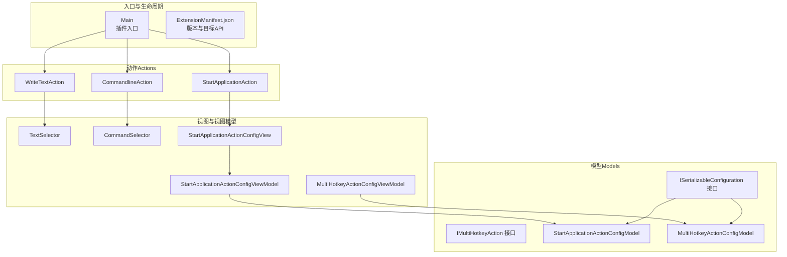
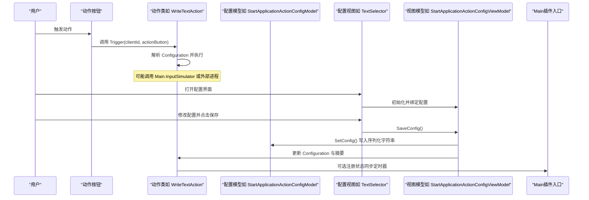
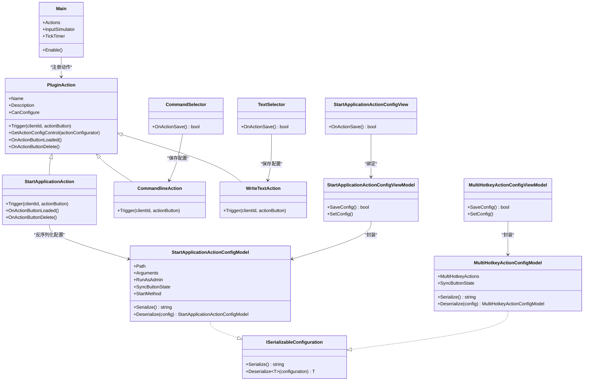

# API参考

<cite>
**本文引用的文件**
- [Main.cs](file://Main.cs)
- [ExtensionManifest.json](file://ExtensionManifest.json)
- [ISerializableConfiguration.cs](file://Models/ISerializableConfiguration.cs)
- [IMultiHotkeyAction.cs](file://Models/IMultiHotkeyAction.cs)
- [ISerializableConfigViewModel.cs](file://ViewModels/ISerializableConfigViewModel.cs)
- [WriteTextAction.cs](file://Actions/WriteTextAction.cs)
- [CommandlineAction.cs](file://Actions/CommandlineAction.cs)
- [StartApplicationAction.cs](file://Actions/StartApplicationAction.cs)
- [MultiHotkeyActionConfigModel.cs](file://Models/MultiHotkeyActionConfigModel.cs)
- [StartApplicationActionConfigModel.cs](file://Models/StartApplicationActionConfigModel.cs)
- [StartApplicationActionConfigView.cs](file://Views/StartApplicationActionConfigView.cs)
- [StartApplicationActionConfigViewModel.cs](file://ViewModels/StartApplicationActionConfigViewModel.cs)
- [MultiHotkeyActionConfigViewModel.cs](file://ViewModels/MultiHotkeyActionConfigViewModel.cs)
- [TextSelector.cs](file://GUI/TextSelector.cs)
- [CommandSelector.cs](file://GUI/CommandSelector.cs)
</cite>

## 目录
1. [简介](#简介)
2. [项目结构](#项目结构)
3. [核心组件](#核心组件)
4. [架构总览](#架构总览)
5. [详细组件分析](#详细组件分析)
6. [依赖关系分析](#依赖关系分析)
7. [性能与可靠性](#性能与可靠性)
8. [故障排查指南](#故障排查指南)
9. [结论](#结论)
10. [附录](#附录)

## 简介
本文件为 Macro Deck Windows Utils 插件的完整 API 参考，覆盖公共类、接口、方法与属性的规范说明，重点包括：
- 核心类：PluginAction、ActionConfigControl、ISerializableConfiguration 的接口与实现要点
- 动作类（Action）：WriteTextAction、CommandlineAction、StartApplicationAction 等的触发流程、配置模型与错误处理
- 配置模型：StartApplicationActionConfigModel、MultiHotkeyActionConfigModel 的字段、序列化与验证规则
- GUI 配置控件与视图模型：TextSelector、CommandSelector、StartApplicationActionConfigView、对应 ViewModel 的交互逻辑
- 版本兼容性、废弃功能与迁移建议、性能注意事项

## 项目结构
该插件以“动作（Actions）+ 模型（Models）+ 视图（Views/ViewModels）+ GUI 控件（GUI）+ 入口（Main）”分层组织，遵循 Macro Deck 插件扩展点约定。

图表来源
- [Main.cs:28-58](file://Main.cs#L28-L58)
- [ExtensionManifest.json:1-11](file://ExtensionManifest.json#L1-L11)
- [WriteTextAction.cs:14-51](file://Actions/WriteTextAction.cs#L14-L51)
- [CommandlineAction.cs:14-64](file://Actions/CommandlineAction.cs#L14-L64)
- [StartApplicationAction.cs:14-83](file://Actions/StartApplicationAction.cs#L14-L83)
- [ISerializableConfiguration.cs:5-11](file://Models/ISerializableConfiguration.cs#L5-L11)
- [IMultiHotkeyAction.cs:3-8](file://Models/IMultiHotkeyAction.cs#L3-L8)
- [StartApplicationActionConfigModel.cs:6-27](file://Models/StartApplicationActionConfigModel.cs#L6-L27)
- [MultiHotkeyActionConfigModel.cs:6-21](file://Models/MultiHotkeyActionConfigModel.cs#L6-L21)
- [TextSelector.cs:11-41](file://GUI/TextSelector.cs#L11-L41)
- [CommandSelector.cs:12-79](file://GUI/CommandSelector.cs#L12-L79)
- [StartApplicationActionConfigView.cs:13-135](file://Views/StartApplicationActionConfigView.cs#L13-L135)
- [StartApplicationActionConfigViewModel.cs:8-72](file://ViewModels/StartApplicationActionConfigViewModel.cs#L8-L72)
- [MultiHotkeyActionConfigViewModel.cs:9-55](file://ViewModels/MultiHotkeyActionConfigViewModel.cs#L9-L55)

章节来源
- [Main.cs:14-59](file://Main.cs#L14-L59)
- [ExtensionManifest.json:1-11](file://ExtensionManifest.json#L1-L11)

## 核心组件
本节概述插件的核心扩展点与通用接口。

- 插件入口 Main
  - 职责：注册动作集合、初始化语言资源、启动定时器
  - 关键成员：Actions 列表、TickTimer、InputSimulator
  - 生命周期：Enable() 中完成初始化
  - 参考路径：[Main.cs:28-58](file://Main.cs#L28-L58)

- 序列化配置接口 ISerializableConfiguration
  - 方法：Serialize() 返回 JSON 字符串；Deserialize<T>() 静态方法用于反序列化
  - 作用：统一动作配置的序列化与反序列化策略
  - 参考路径：[ISerializableConfiguration.cs:5-11](file://Models/ISerializableConfiguration.cs#L5-L11)

- 多按键动作接口 IMultiHotkeyAction
  - 方法：Execute() 执行单个热键动作
  - 作用：作为多热键动作列表中的元素
  - 参考路径：[IMultiHotkeyAction.cs:3-8](file://Models/IMultiHotkeyAction.cs#L3-L8)

- 可序列化配置视图模型接口 ISerializableConfigViewModel
  - 成员：SerializableConfiguration（受保护访问）、SetConfig()、SaveConfig()
  - 作用：封装配置视图与模型之间的保存与同步逻辑
  - 参考路径：[ISerializableConfigViewModel.cs:5-12](file://ViewModels/ISerializableConfigViewModel.cs#L5-L12)

章节来源
- [Main.cs:14-59](file://Main.cs#L14-L59)
- [ISerializableConfiguration.cs:5-11](file://Models/ISerializableConfiguration.cs#L5-L11)
- [IMultiHotkeyAction.cs:3-8](file://Models/IMultiHotkeyAction.cs#L3-L8)
- [ISerializableConfigViewModel.cs:5-12](file://ViewModels/ISerializableConfigViewModel.cs#L5-L12)

## 架构总览
下图展示了插件的动作触发、配置加载与 UI 交互的整体流程。

图表来源
- [WriteTextAction.cs:22-45](file://Actions/WriteTextAction.cs#L22-L45)
- [StartApplicationAction.cs:22-83](file://Actions/StartApplicationAction.cs#L22-L83)
- [TextSelector.cs:25-41](file://GUI/TextSelector.cs#L25-L41)
- [StartApplicationActionConfigView.cs:87-135](file://Views/StartApplicationActionConfigView.cs#L87-L135)
- [StartApplicationActionConfigViewModel.cs:53-71](file://ViewModels/StartApplicationActionConfigViewModel.cs#L53-L71)
- [Main.cs:18-58](file://Main.cs#L18-L58)

## 详细组件分析

### 插件入口 Main
- 类型：Main 继承自 MacroDeckPlugin
- 关键职责：
  - 在 Enable() 中注册所有动作到 Actions 列表
  - 初始化语言资源
  - 创建并启动 TickTimer（周期 2 秒），供需要状态同步的动作使用
- 成员：
  - InputSimulator：输入模拟器实例
  - TickTimer：系统计时器
- 生命周期钩子：
  - Enable()：插件启用时调用
- 参考路径：
  - [Main.cs:14-59](file://Main.cs#L14-L59)

章节来源
- [Main.cs:14-59](file://Main.cs#L14-L59)

### 动作基类与配置控件
- PluginAction：所有动作的基础类（由插件框架提供）
- ActionConfigControl：所有动作配置界面的基础控件（由插件框架提供）

章节来源
- [WriteTextAction.cs:14](file://Actions/WriteTextAction.cs#L14)
- [CommandlineAction.cs:14](file://Actions/CommandlineAction.cs#L14)
- [StartApplicationAction.cs:14](file://Actions/StartApplicationAction.cs#L14)
- [TextSelector.cs:11](file://GUI/TextSelector.cs#L11)
- [CommandSelector.cs:12](file://GUI/CommandSelector.cs#L12)
- [StartApplicationActionConfigView.cs:13](file://Views/StartApplicationActionConfigView.cs#L13)

### 文本输入动作 WriteTextAction
- 继承：PluginAction
- 名称与描述：通过语言管理器获取本地化文本
- 配置项：
  - text：要输入的文本（支持变量替换）
- 触发流程：
  - 解析 Configuration（JSON）获取 text
  - 替换文本中的变量占位符
  - 使用 Main.InputSimulator.Keyboard.TextEntry 执行输入
- 异常处理：捕获异常并记录警告日志
- 配置控件：TextSelector
- 参考路径：
  - [WriteTextAction.cs:14-51](file://Actions/WriteTextAction.cs#L14-L51)
  - [TextSelector.cs:25-50](file://GUI/TextSelector.cs#L25-L50)

章节来源
- [WriteTextAction.cs:14-51](file://Actions/WriteTextAction.cs#L14-L51)
- [TextSelector.cs:11-77](file://GUI/TextSelector.cs#L11-L77)

### 命令行动作 CommandlineAction
- 继承：PluginAction
- 配置项：
  - command：命令行内容
  - workingDirectory：工作目录
  - saveVariable：是否将输出保存为变量
  - variableName：变量名
  - variableType：变量类型（String/Integer/Float/Bool）
- 触发流程：
  - 解析 Configuration 获取上述字段
  - 启动 cmd.exe /C 命令
  - 若 saveVariable 为真，读取标准输出并写入指定变量
- 异常处理：捕获异常并记录调试信息
- 配置控件：CommandSelector
- 参考路径：
  - [CommandlineAction.cs:14-64](file://Actions/CommandlineAction.cs#L14-L64)
  - [CommandSelector.cs:46-79](file://GUI/CommandSelector.cs#L46-L79)

章节来源
- [CommandlineAction.cs:14-64](file://Actions/CommandlineAction.cs#L14-L64)
- [CommandSelector.cs:12-144](file://GUI/CommandSelector.cs#L12-L144)

### 应用程序启动动作 StartApplicationAction
- 继承：PluginAction
- 配置模型：StartApplicationActionConfigModel
- 触发流程：
  - 反序列化配置模型
  - 根据 StartMethod 分支：
    - Start：若未运行则启动，否则前置到前台
    - Stop：终止进程
    - Show：前置到前台
    - Hide：最小化到后台
- 状态同步：
  - 若启用 SyncButtonState，则在 TickTimer 周期中更新 ActionButton.State
- 生命周期钩子：
  - OnActionButtonLoaded：注册 TickTimer 事件
  - OnActionButtonDelete：注销 TickTimer 事件
- 参考路径：
  - [StartApplicationAction.cs:14-83](file://Actions/StartApplicationAction.cs#L14-L83)
  - [StartApplicationActionConfigModel.cs:6-27](file://Models/StartApplicationActionConfigModel.cs#L6-L27)

章节来源
- [StartApplicationAction.cs:14-83](file://Actions/StartApplicationAction.cs#L14-L83)
- [StartApplicationActionConfigModel.cs:6-36](file://Models/StartApplicationActionConfigModel.cs#L6-L36)

### 配置模型与序列化
- StartApplicationActionConfigModel
  - 字段：
    - path：应用程序路径或可执行文件
    - arguments：启动参数
    - runAsAdmin：是否以管理员权限运行
    - syncButtonState：是否同步按钮状态
    - startMethod：启动方式（Start/Stop/Show/Hide）
  - 序列化：使用 System.Text.Json 进行序列化与反序列化
  - 兼容性：JsonPropertyName 保证旧版本字段名称兼容
  - 参考路径：
    - [StartApplicationActionConfigModel.cs:6-36](file://Models/StartApplicationActionConfigModel.cs#L6-L36)

- MultiHotkeyActionConfigModel
  - 字段：
    - multiHotkeyActions：IMultiHotkeyAction 列表
    - syncButtonState：是否同步按钮状态
  - 序列化：实现 ISerializableConfiguration
  - 参考路径：
    - [MultiHotkeyActionConfigModel.cs:6-21](file://Models/MultiHotkeyActionConfigModel.cs#L6-L21)

- ISerializableConfiguration 接口
  - 方法：Serialize()、Deserialize<T>()
  - 参考路径：
    - [ISerializableConfiguration.cs:5-11](file://Models/ISerializableConfiguration.cs#L5-L11)

章节来源
- [StartApplicationActionConfigModel.cs:6-36](file://Models/StartApplicationActionConfigModel.cs#L6-L36)
- [MultiHotkeyActionConfigModel.cs:6-21](file://Models/MultiHotkeyActionConfigModel.cs#L6-L21)
- [ISerializableConfiguration.cs:5-11](file://Models/ISerializableConfiguration.cs#L5-L11)

### 配置视图与视图模型
- TextSelector（WriteTextAction 配置）
  - 行为：保存时将 text 写入动作 Configuration，并生成摘要
  - 变量插入：支持从变量列表中选择并插入占位符
  - 参考路径：
    - [TextSelector.cs:25-77](file://GUI/TextSelector.cs#L25-L77)

- CommandSelector（CommandlineAction 配置）
  - 行为：保存时构造 JSON 配置对象，包含 command、workingDirectory、saveVariable、variableName、variableType
  - 校验：对工作目录进行存在性检查提示
  - 参考路径：
    - [CommandSelector.cs:46-144](file://GUI/CommandSelector.cs#L46-L144)

- StartApplicationActionConfigView（StartApplicationAction 配置）
  - 行为：加载/保存路径、参数、启动方式、管理员权限、状态同步等
  - 图标导入：可选导入文件图标
  - 参考路径：
    - [StartApplicationActionConfigView.cs:87-159](file://Views/StartApplicationActionConfigView.cs#L87-L159)

- StartApplicationActionConfigViewModel
  - 行为：封装配置模型的读写、保存与摘要更新
  - 参考路径：
    - [StartApplicationActionConfigViewModel.cs:53-72](file://ViewModels/StartApplicationActionConfigViewModel.cs#L53-L72)

- MultiHotkeyActionConfigViewModel
  - 行为：封装多热键配置的读写与保存
  - 参考路径：
    - [MultiHotkeyActionConfigViewModel.cs:36-55](file://ViewModels/MultiHotkeyActionConfigViewModel.cs#L36-L55)

章节来源
- [TextSelector.cs:11-77](file://GUI/TextSelector.cs#L11-L77)
- [CommandSelector.cs:12-144](file://GUI/CommandSelector.cs#L12-L144)
- [StartApplicationActionConfigView.cs:13-159](file://Views/StartApplicationActionConfigView.cs#L13-L159)
- [StartApplicationActionConfigViewModel.cs:8-72](file://ViewModels/StartApplicationActionConfigViewModel.cs#L8-L72)
- [MultiHotkeyActionConfigViewModel.cs:9-55](file://ViewModels/MultiHotkeyActionConfigViewModel.cs#L9-L55)

### 多热键动作接口 IMultiHotkeyAction
- 方法：Execute()
- 用途：作为 MultiHotkeyActionConfigModel.MultiHotkeyActions 的元素
- 参考路径：
  - [IMultiHotkeyAction.cs:3-8](file://Models/IMultiHotkeyAction.cs#L3-L8)

章节来源
- [IMultiHotkeyAction.cs:3-8](file://Models/IMultiHotkeyAction.cs#L3-L8)

## 依赖关系分析
- 动作到模型：动作在触发时反序列化配置模型，驱动业务逻辑
- 视图到视图模型：视图负责 UI 交互，视图模型负责配置持久化
- 插件入口：Main 注册动作并提供共享资源（如 InputSimulator、TickTimer）
- 序列化接口：ISerializableConfiguration 统一了配置的序列化策略

图表来源
- [Main.cs:28-58](file://Main.cs#L28-L58)
- [StartApplicationAction.cs:14-83](file://Actions/StartApplicationAction.cs#L14-L83)
- [CommandlineAction.cs:14-64](file://Actions/CommandlineAction.cs#L14-L64)
- [WriteTextAction.cs:14-51](file://Actions/WriteTextAction.cs#L14-L51)
- [StartApplicationActionConfigModel.cs:6-27](file://Models/StartApplicationActionConfigModel.cs#L6-L27)
- [MultiHotkeyActionConfigModel.cs:6-21](file://Models/MultiHotkeyActionConfigModel.cs#L6-L21)
- [TextSelector.cs:25-41](file://GUI/TextSelector.cs#L25-L41)
- [CommandSelector.cs:46-79](file://GUI/CommandSelector.cs#L46-L79)
- [StartApplicationActionConfigView.cs:87-135](file://Views/StartApplicationActionConfigView.cs#L87-L135)
- [StartApplicationActionConfigViewModel.cs:53-71](file://ViewModels/StartApplicationActionConfigViewModel.cs#L53-L71)
- [MultiHotkeyActionConfigViewModel.cs:36-55](file://ViewModels/MultiHotkeyActionConfigViewModel.cs#L36-L55)

## 性能与可靠性
- 输入模拟与系统调用
  - WriteTextAction 使用 InputSimulator 执行文本输入，建议避免高频连续触发导致的输入抖动
  - CommandlineAction 启动外部进程，注意工作目录与命令合法性校验，防止阻塞
- 定时器与状态同步
  - StartApplicationAction 在启用状态同步时会注册 TickTimer，周期为 2 秒。请确保仅在需要时启用同步，避免不必要的 CPU 开销
- 序列化与反序列化
  - 配置模型统一使用 System.Text.Json，建议保持字段命名稳定，必要时通过 JsonPropertyName 保证向后兼容
- 日志与异常
  - 动作内部对异常进行捕获与日志记录，便于定位问题。建议在生产环境中关注日志输出

[本节为通用指导，不直接分析具体文件]

## 故障排查指南
- 文本输入无效
  - 检查 WriteTextAction 的 Configuration 是否包含 text 字段
  - 确认 TextSelector 已正确保存配置
  - 参考路径：
    - [WriteTextAction.cs:22-45](file://Actions/WriteTextAction.cs#L22-L45)
    - [TextSelector.cs:25-41](file://GUI/TextSelector.cs#L25-L41)

- 命令行执行失败
  - 检查 CommandlineAction 的 Configuration 字段是否完整
  - 确认工作目录存在且可访问
  - 查看日志中是否有异常信息
  - 参考路径：
    - [CommandlineAction.cs:22-58](file://Actions/CommandlineAction.cs#L22-L58)
    - [CommandSelector.cs:46-79](file://GUI/CommandSelector.cs#L46-L79)

- 应用程序启动/停止无响应
  - 检查 StartApplicationAction 的 Configuration，确认 path 有效
  - 若启用了状态同步，确认 TickTimer 是否正常运行
  - 参考路径：
    - [StartApplicationAction.cs:22-50](file://Actions/StartApplicationAction.cs#L22-L50)
    - [Main.cs:52-58](file://Main.cs#L52-L58)

- 配置保存失败
  - 检查视图模型的 SaveConfig() 是否抛出异常
  - 查看日志中的错误堆栈
  - 参考路径：
    - [StartApplicationActionConfigViewModel.cs:53-65](file://ViewModels/StartApplicationActionConfigViewModel.cs#L53-L65)
    - [MultiHotkeyActionConfigViewModel.cs:36-48](file://ViewModels/MultiHotkeyActionConfigViewModel.cs#L36-L48)

章节来源
- [WriteTextAction.cs:22-45](file://Actions/WriteTextAction.cs#L22-L45)
- [CommandlineAction.cs:22-58](file://Actions/CommandlineAction.cs#L22-L58)
- [StartApplicationAction.cs:22-50](file://Actions/StartApplicationAction.cs#L22-L50)
- [Main.cs:52-58](file://Main.cs#L52-L58)
- [StartApplicationActionConfigViewModel.cs:53-65](file://ViewModels/StartApplicationActionConfigViewModel.cs#L53-L65)
- [MultiHotkeyActionConfigViewModel.cs:36-48](file://ViewModels/MultiHotkeyActionConfigViewModel.cs#L36-L48)

## 结论
本参考文档梳理了 Macro Deck Windows Utils 插件的扩展点、动作实现、配置模型与 UI 交互机制。通过统一的 ISerializableConfiguration 接口与视图模型模式，插件实现了良好的可维护性与可扩展性。在实际使用中，请遵循配置字段约束、注意异常处理与日志记录，并根据性能需求合理使用状态同步与定时器。

[本节为总结性内容，不直接分析具体文件]

## 附录

### 版本兼容性与目标 API
- 目标插件 API 版本：40
- 包 ID：SuchByte.WindowsUtils
- 当前版本：1.5.0
- 参考路径：
  - [ExtensionManifest.json:7-9](file://ExtensionManifest.json#L7-L9)

章节来源
- [ExtensionManifest.json:1-11](file://ExtensionManifest.json#L1-L11)

### 废弃功能与迁移指南
- 多热键动作（MultiHotkeyAction）当前未启用注册
  - 原因：在 Main.Enable() 中被注释
  - 迁移建议：如需启用，取消注释并完善相关配置视图与模型
  - 参考路径：
    - [Main.cs:44-45](file://Main.cs#L44-L45)

章节来源
- [Main.cs:28-58](file://Main.cs#L28-L58)

### API 使用示例（步骤说明）
- 文本输入动作
  - 步骤：在动作配置界面输入文本，支持插入变量占位符；保存后触发动作执行
  - 参考路径：
    - [TextSelector.cs:25-41](file://GUI/TextSelector.cs#L25-L41)
    - [WriteTextAction.cs:22-45](file://Actions/WriteTextAction.cs#L22-L45)

- 命令行动作
  - 步骤：填写命令、工作目录；可选开启“将输出保存为变量”，设置变量名与类型；保存并触发
  - 参考路径：
    - [CommandSelector.cs:46-79](file://GUI/CommandSelector.cs#L46-L79)
    - [CommandlineAction.cs:22-58](file://Actions/CommandlineAction.cs#L22-L58)

- 应用程序启动动作
  - 步骤：选择可执行文件或快捷方式；设置启动方式（启动/停止/显示/隐藏）；可选管理员权限与状态同步；保存并触发
  - 参考路径：
    - [StartApplicationActionConfigView.cs:87-135](file://Views/StartApplicationActionConfigView.cs#L87-L135)
    - [StartApplicationAction.cs:22-50](file://Actions/StartApplicationAction.cs#L22-L50)