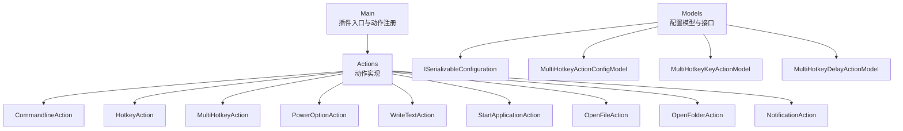
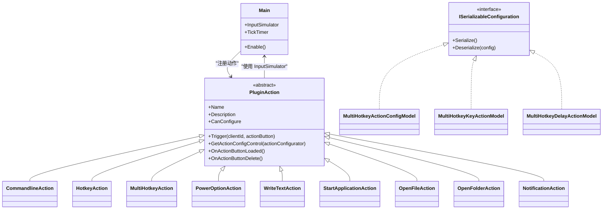
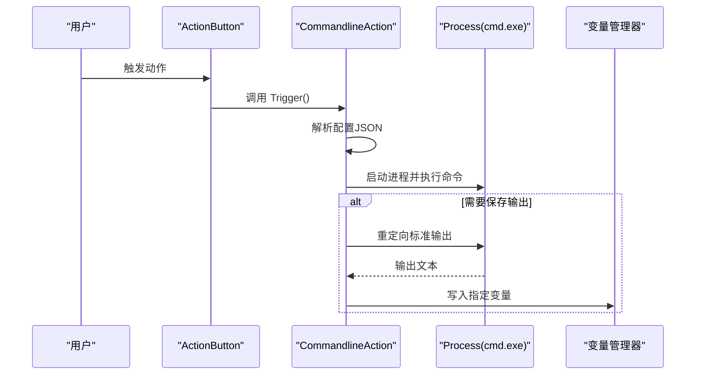
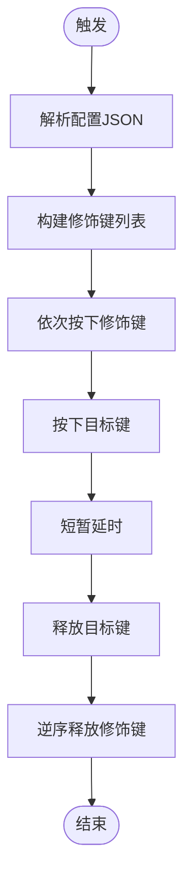
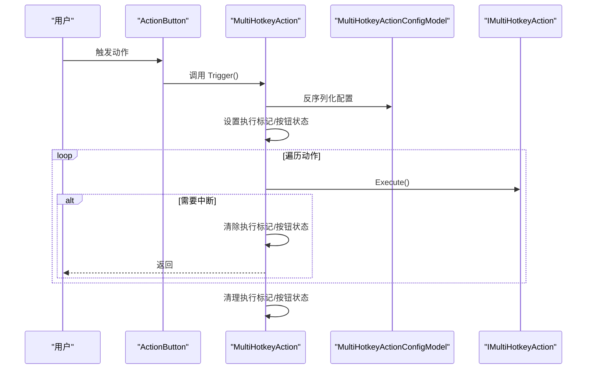
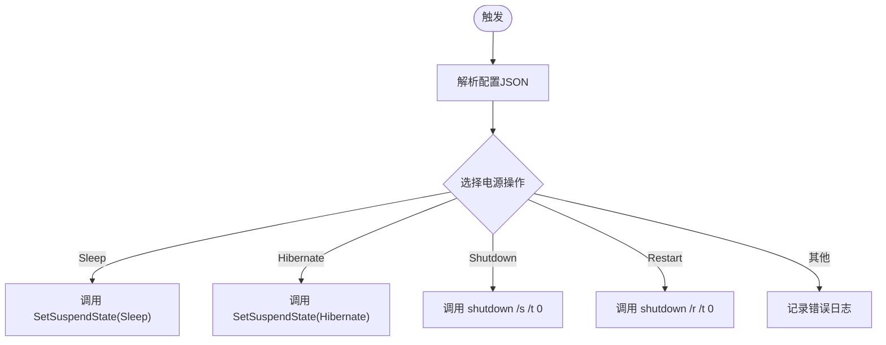
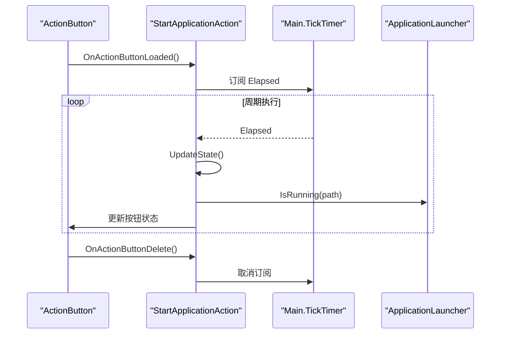
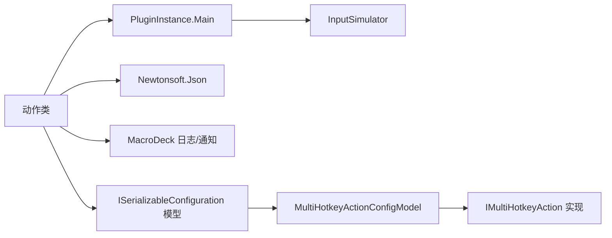

# 动作类API

<cite>
**本文引用的文件**
- [Main.cs](file://Main.cs)
- [CommandlineAction.cs](file://Actions/CommandlineAction.cs)
- [HotkeyAction.cs](file://Actions/HotkeyAction.cs)
- [MultiHotkeyAction.cs](file://Actions/MultiHotkeyAction.cs)
- [PowerOptionAction.cs](file://Actions/PowerOptionAction.cs)
- [WriteTextAction.cs](file://Actions/WriteTextAction.cs)
- [StartApplicationAction.cs](file://Actions/StartApplicationAction.cs)
- [OpenFileAction.cs](file://Actions/OpenFileAction.cs)
- [OpenFolderAction.cs](file://Actions/OpenFolderAction.cs)
- [NotificationAction.cs](file://Actions/NotificationAction.cs)
- [ISerializableConfiguration.cs](file://Models/ISerializableConfiguration.cs)
- [MultiHotkeyActionConfigModel.cs](file://Models/MultiHotkeyActionConfigModel.cs)
- [MultiHotkeyKeyActionModel.cs](file://Models/MultiHotkeyKeyActionModel.cs)
- [MultiHotkeyDelayActionModel.cs](file://Models/MultiHotkeyDelayActionModel.cs)
</cite>

## 目录
1. [简介](#简介)
2. [项目结构](#项目结构)
3. [核心组件](#核心组件)
4. [架构总览](#架构总览)
5. [详细组件分析](#详细组件分析)
6. [依赖分析](#依赖分析)
7. [性能考虑](#性能考虑)
8. [故障排除指南](#故障排除指南)
9. [结论](#结论)
10. [附录](#附录)

## 简介
本文件为 Macro Deck 插件“Windows Utils”中所有继承自 PluginAction 的动作类的详细参考文档。内容覆盖：
- 每个动作类的接口规范（名称、描述、是否可配置）
- 配置属性与序列化模型
- 执行流程与触发机制
- 生命周期钩子（如 OnActionButtonLoaded/OnActionButtonDelete）
- 异常处理策略
- 使用示例（如何在 Macro Deck 中配置与触发）
- 动作间依赖关系、执行顺序与性能建议

## 项目结构
该插件通过 Main 类注册一组动作实例；各动作类位于 Actions 目录，配置模型位于 Models 目录，GUI 配置控件位于 GUI 与 Views 相关文件中。

图表来源
- [Main.cs:31-50](file://Main.cs#L31-L50)
- [CommandlineAction.cs:14](file://Actions/CommandlineAction.cs#L14)
- [HotkeyAction.cs:15](file://Actions/HotkeyAction.cs#L15)
- [MultiHotkeyAction.cs:11](file://Actions/MultiHotkeyAction.cs#L11)
- [PowerOptionAction.cs:14](file://Actions/PowerOptionAction.cs#L14)
- [WriteTextAction.cs:14](file://Actions/WriteTextAction.cs#L14)
- [StartApplicationAction.cs:14](file://Actions/StartApplicationAction.cs#L14)
- [OpenFileAction.cs:12](file://Actions/OpenFileAction.cs#L12)
- [OpenFolderAction.cs:14](file://Actions/OpenFolderAction.cs#L14)
- [NotificationAction.cs:14](file://Actions/NotificationAction.cs#L14)
- [ISerializableConfiguration.cs:5](file://Models/ISerializableConfiguration.cs#L5)
- [MultiHotkeyActionConfigModel.cs:6](file://Models/MultiHotkeyActionConfigModel.cs#L6)
- [MultiHotkeyKeyActionModel.cs:5](file://Models/MultiHotkeyKeyActionModel.cs#L5)
- [MultiHotkeyDelayActionModel.cs:5](file://Models/MultiHotkeyDelayActionModel.cs#L5)

章节来源
- [Main.cs:28-58](file://Main.cs#L28-L58)

## 核心组件
- 插件入口与动作注册：Main 类在启用时初始化语言资源并注册所有动作实例。
- 动作基类：所有动作均继承自 PluginAction，具备 Name、Description、CanConfigure、Trigger、GetActionConfigControl 等约定接口。
- 配置模型：通过 ISerializableConfiguration 接口统一序列化/反序列化，部分动作使用专用模型类承载复杂配置。
- 输入模拟器：Main 提供 InputSimulator，供需要键盘/鼠标输入的动作使用。

章节来源
- [Main.cs:14-26](file://Main.cs#L14-L26)
- [Main.cs:28-58](file://Main.cs#L28-L58)
- [ISerializableConfiguration.cs:5-11](file://Models/ISerializableConfiguration.cs#L5-L11)

## 架构总览
下图展示了动作类与主插件、配置模型及外部库之间的交互关系。

图表来源
- [Main.cs:14-26](file://Main.cs#L14-L26)
- [Main.cs:31-50](file://Main.cs#L31-L50)
- [ISerializableConfiguration.cs:5-11](file://Models/ISerializableConfiguration.cs#L5-L11)
- [MultiHotkeyActionConfigModel.cs:6-21](file://Models/MultiHotkeyActionConfigModel.cs#L6-L21)
- [MultiHotkeyKeyActionModel.cs:5-25](file://Models/MultiHotkeyKeyActionModel.cs#L5-L25)
- [MultiHotkeyDelayActionModel.cs:5-13](file://Models/MultiHotkeyDelayActionModel.cs#L5-L13)

## 详细组件分析

### CommandlineAction（命令行执行）
- 继承：PluginAction
- 名称与描述：由语言资源提供
- 是否可配置：是
- 触发器：解析配置 JSON，启动 cmd 并执行命令；可选捕获输出写入变量
- 配置要点：
  - workingDirectory：工作目录
  - command：要执行的命令
  - saveVariable：是否保存输出
  - variableName：变量名
  - variableType：变量类型
- 异常处理：内部 try/catch 记录错误信息
- GUI 控件：CommandSelector

图表来源
- [CommandlineAction.cs:22-58](file://Actions/CommandlineAction.cs#L22-L58)

章节来源
- [CommandlineAction.cs:14-64](file://Actions/CommandlineAction.cs#L14-L64)

### HotkeyAction（热键组合）
- 继承：PluginAction
- 名称与描述：由语言资源提供
- 是否可配置：是
- 触发器：解析配置 JSON，构建修饰键集合，按下/抬起对应按键序列
- 配置要点：
  - key：目标键位
  - lwin/rwin、ctrl/lctrl/rctrl、shift/lshift/rshift、alt/lalt/ralt：布尔开关控制修饰键
- 执行细节：逐个按下修饰键，再按下目标键，短暂延时后释放，最后逆序释放修饰键
- 异常处理：空 try/catch（静默失败）
- GUI 控件：HotkeyConfigurator

图表来源
- [HotkeyAction.cs:29-111](file://Actions/HotkeyAction.cs#L29-L111)

章节来源
- [HotkeyAction.cs:15-112](file://Actions/HotkeyAction.cs#L15-L112)

### MultiHotkeyAction（多键序列）
- 继承：PluginAction
- 名称与描述：由语言资源提供
- 是否可配置：是
- 触发器：异步执行配置中的动作序列；支持中断标志与按钮状态同步
- 关键字段：stop、executing
- 配置模型：MultiHotkeyActionConfigModel，包含动作列表与 SyncButtonState
- 执行顺序：按序遍历执行 IMultiHotkeyAction（如 KeyDown/KeyUp 或 Delay）
- 中断机制：若再次触发且正在执行，则设置 stop 标志以提前退出循环
- GUI 控件：StartApplicationActionConfigView（复用视图）

图表来源
- [MultiHotkeyAction.cs:23-48](file://Actions/MultiHotkeyAction.cs#L23-L48)
- [MultiHotkeyActionConfigModel.cs:6-21](file://Models/MultiHotkeyActionConfigModel.cs#L6-L21)
- [MultiHotkeyKeyActionModel.cs:13-24](file://Models/MultiHotkeyKeyActionModel.cs#L13-L24)
- [MultiHotkeyDelayActionModel.cs:9-12](file://Models/MultiHotkeyDelayActionModel.cs#L9-L12)

章节来源
- [MultiHotkeyAction.cs:11-56](file://Actions/MultiHotkeyAction.cs#L11-L56)
- [MultiHotkeyActionConfigModel.cs:6-21](file://Models/MultiHotkeyActionConfigModel.cs#L6-L21)
- [MultiHotkeyKeyActionModel.cs:5-25](file://Models/MultiHotkeyKeyActionModel.cs#L5-L25)
- [MultiHotkeyDelayActionModel.cs:5-13](file://Models/MultiHotkeyDelayActionModel.cs#L5-L13)

### PowerOptionAction（电源选项）
- 继承：PluginAction
- 名称与描述：由语言资源提供
- 是否可配置：是
- 触发器：解析配置 JSON，根据枚举选择休眠、Hibernate、关机或重启
- 配置要点：powerOption（枚举）
- 异常处理：try/catch 并记录错误日志
- GUI 控件：PowerOptionSelector

图表来源
- [PowerOptionAction.cs:22-55](file://Actions/PowerOptionAction.cs#L22-L55)

章节来源
- [PowerOptionAction.cs:14-61](file://Actions/PowerOptionAction.cs#L14-L61)

### WriteTextAction（文本输入）
- 继承：PluginAction
- 名称与描述：由语言资源提供
- 是否可配置：是
- 触发器：解析配置 JSON，替换文本中的变量占位符，然后通过 InputSimulator 文本输入
- 异常处理：捕获异常并记录警告日志
- GUI 控件：TextSelector

章节来源
- [WriteTextAction.cs:14-51](file://Actions/WriteTextAction.cs#L14-L51)

### StartApplicationAction（启动/停止应用）
- 继承：PluginAction
- 名称与描述：由语言资源提供
- 是否可配置：是
- 触发器：根据 StartMethod（启动/停止/显示/隐藏）执行相应操作
- 生命周期：
  - OnActionButtonLoaded：当启用按钮状态同步时，订阅主定时器事件
  - OnActionButtonDelete：删除时取消订阅
- 定时更新：通过定时器周期性检查应用运行状态并更新按钮状态
- GUI 控件：StartApplicationActionConfigView

图表来源
- [StartApplicationAction.cs:57-83](file://Actions/StartApplicationAction.cs#L57-L83)
- [Main.cs:52-57](file://Main.cs#L52-L57)

章节来源
- [StartApplicationAction.cs:14-83](file://Actions/StartApplicationAction.cs#L14-L83)

### OpenFileAction（打开文件）
- 继承：PluginAction
- 名称与描述：由语言资源提供
- 是否可配置：是
- 触发器：解析配置 JSON，使用系统默认程序打开文件
- GUI 控件：FileFolderSelector（FILE）

章节来源
- [OpenFileAction.cs:12-46](file://Actions/OpenFileAction.cs#L12-L46)

### OpenFolderAction（打开文件夹）
- 继承：PluginAction
- 名称与描述：由语言资源提供
- 是否可配置：是
- 触发器：解析配置 JSON，使用系统默认程序打开文件夹
- GUI 控件：FileFolderSelector（FOLDER）

章节来源
- [OpenFolderAction.cs:14-48](file://Actions/OpenFolderAction.cs#L14-L48)

### NotificationAction（通知）
- 继承：PluginAction
- 名称与描述：由语言资源提供
- 是否可配置：是
- 触发器：解析配置 JSON，发送通知并立即移除
- 异常处理：捕获异常并记录错误日志
- GUI 控件：NotificationConfigurator

章节来源
- [NotificationAction.cs:14-47](file://Actions/NotificationAction.cs#L14-L47)

## 依赖分析
- 动作到主插件：多数动作通过 PluginInstance.Main 获取 InputSimulator；部分动作通过定时器进行状态同步
- 配置模型：ISerializableConfiguration 统一序列化/反序列化；MultiHotkeyActionConfigModel 作为容器持有 IMultiHotkeyAction 列表
- 外部库：WindowsInput（输入模拟）、Newtonsoft.Json（JSON 解析）、System.Diagnostics（进程与日志）

图表来源
- [Main.cs:18](file://Main.cs#L18)
- [ISerializableConfiguration.cs:5-11](file://Models/ISerializableConfiguration.cs#L5-L11)
- [MultiHotkeyActionConfigModel.cs:6-21](file://Models/MultiHotkeyActionConfigModel.cs#L6-L21)
- [MultiHotkeyKeyActionModel.cs:5-25](file://Models/MultiHotkeyKeyActionModel.cs#L5-L25)
- [MultiHotkeyDelayActionModel.cs:5-13](file://Models/MultiHotkeyDelayActionModel.cs#L5-L13)

章节来源
- [Main.cs:18](file://Main.cs#L18)
- [ISerializableConfiguration.cs:5-11](file://Models/ISerializableConfiguration.cs#L5-L11)

## 性能考虑
- 异步执行：MultiHotkeyAction 使用任务并发执行，避免阻塞 UI；注意避免过度并发导致系统抖动
- 延时与稳定性：HotkeyAction 在按键切换之间加入短暂延时，提升兼容性
- 进程与 I/O：CommandlineAction 与 OpenFile/FolderAction 启动外部进程，建议限制并发与超时
- 定时器开销：StartApplicationAction 通过定时器轮询应用状态，建议合理设置间隔（当前 2 秒），避免频繁查询
- 变量替换：WriteTextAction 对文本进行变量替换，建议避免在高频触发场景中使用大量变量

## 故障排除指南
- 空配置或格式错误：多数动作在配置为空或 JSON 解析失败时直接返回；请检查配置字符串与键名
- 权限问题：PowerOptionAction 与 StartApplicationAction 可能需要管理员权限；尝试以管理员身份运行
- 输入模拟失败：HotkeyAction 与 WriteTextAction 依赖 InputSimulator；确保未被安全软件拦截
- 日志定位：使用日志记录异常（如 CommandlineAction、PowerOptionAction、NotificationAction），便于排查
- 状态不同步：StartApplicationAction 的按钮状态同步依赖定时器；确认已启用同步并检查路径有效性

章节来源
- [CommandlineAction.cs:22-58](file://Actions/CommandlineAction.cs#L22-L58)
- [PowerOptionAction.cs:22-55](file://Actions/PowerOptionAction.cs#L22-L55)
- [NotificationAction.cs:22-41](file://Actions/NotificationAction.cs#L22-L41)
- [StartApplicationAction.cs:57-83](file://Actions/StartApplicationAction.cs#L57-L83)

## 结论
本插件提供了丰富而实用的动作集，覆盖命令行执行、热键组合、文本输入、应用启停、文件/文件夹打开、通知与电源控制等场景。通过统一的配置模型与生命周期钩子，动作具备良好的扩展性与可维护性。建议在高频触发场景中关注异步与定时器开销，在需要管理员权限的场景中谨慎配置。

## 附录

### 动作清单与配置要点
- CommandlineAction
  - 配置键：workingDirectory、command、saveVariable、variableName、variableType
  - 典型用途：执行批处理命令并回写变量
- HotkeyAction
  - 配置键：key 以及各类修饰键开关
  - 典型用途：模拟复杂热键组合
- MultiHotkeyAction
  - 配置模型：MultiHotkeyActionConfigModel
  - 动作元素：MultiHotkeyKeyActionModel、MultiHotkeyDelayActionModel
  - 典型用途：录制/回放按键序列
- PowerOptionAction
  - 配置键：powerOption（枚举）
  - 典型用途：睡眠/休眠/关机/重启
- WriteTextAction
  - 配置键：text（支持变量占位符）
  - 典型用途：自动输入文本
- StartApplicationAction
  - 配置模型：StartApplicationActionConfigModel
  - 生命周期：OnActionButtonLoaded/OnActionButtonDelete
  - 典型用途：启动/停止/显示/隐藏应用
- OpenFileAction / OpenFolderAction
  - 配置键：path
  - 典型用途：打开文件/文件夹
- NotificationAction
  - 配置键：title、message
  - 典型用途：推送系统通知

章节来源
- [CommandlineAction.cs:22-58](file://Actions/CommandlineAction.cs#L22-L58)
- [HotkeyAction.cs:29-111](file://Actions/HotkeyAction.cs#L29-L111)
- [MultiHotkeyAction.cs:23-48](file://Actions/MultiHotkeyAction.cs#L23-L48)
- [MultiHotkeyActionConfigModel.cs:6-21](file://Models/MultiHotkeyActionConfigModel.cs#L6-L21)
- [MultiHotkeyKeyActionModel.cs:13-24](file://Models/MultiHotkeyKeyActionModel.cs#L13-L24)
- [MultiHotkeyDelayActionModel.cs:9-12](file://Models/MultiHotkeyDelayActionModel.cs#L9-L12)
- [PowerOptionAction.cs:22-55](file://Actions/PowerOptionAction.cs#L22-L55)
- [WriteTextAction.cs:22-45](file://Actions/WriteTextAction.cs#L22-L45)
- [StartApplicationAction.cs:22-50](file://Actions/StartApplicationAction.cs#L22-L50)
- [OpenFileAction.cs:20-40](file://Actions/OpenFileAction.cs#L20-L40)
- [OpenFolderAction.cs:22-42](file://Actions/OpenFolderAction.cs#L22-L42)
- [NotificationAction.cs:22-41](file://Actions/NotificationAction.cs#L22-L41)