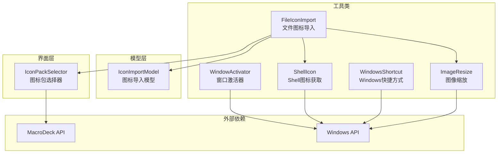
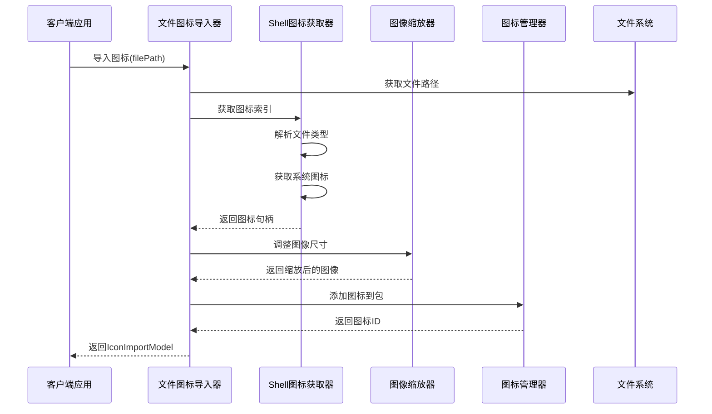
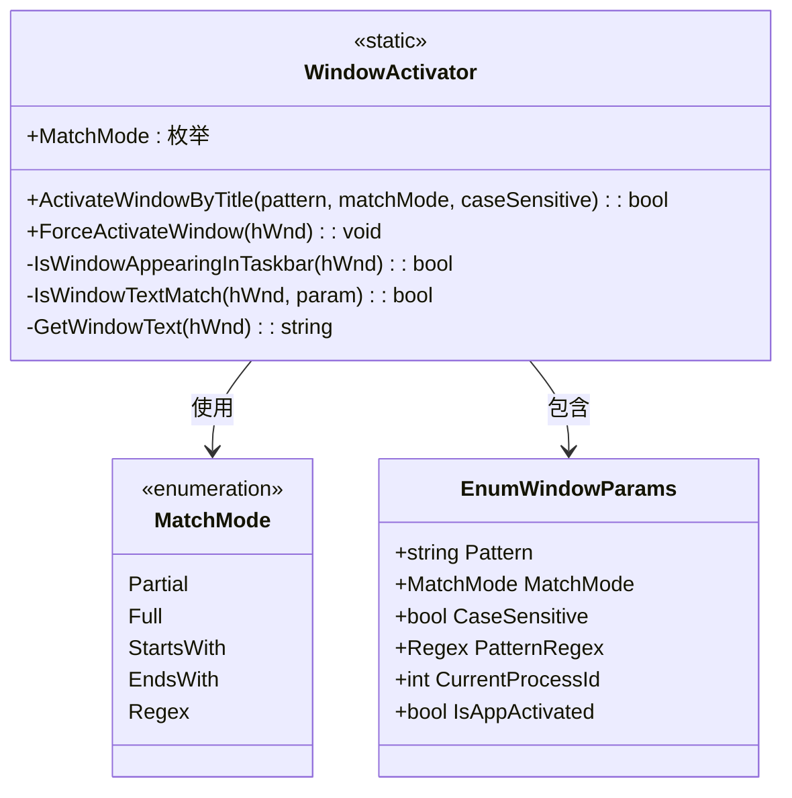
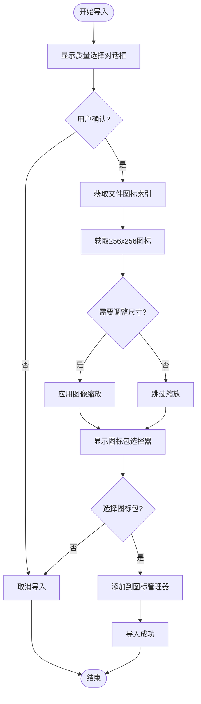
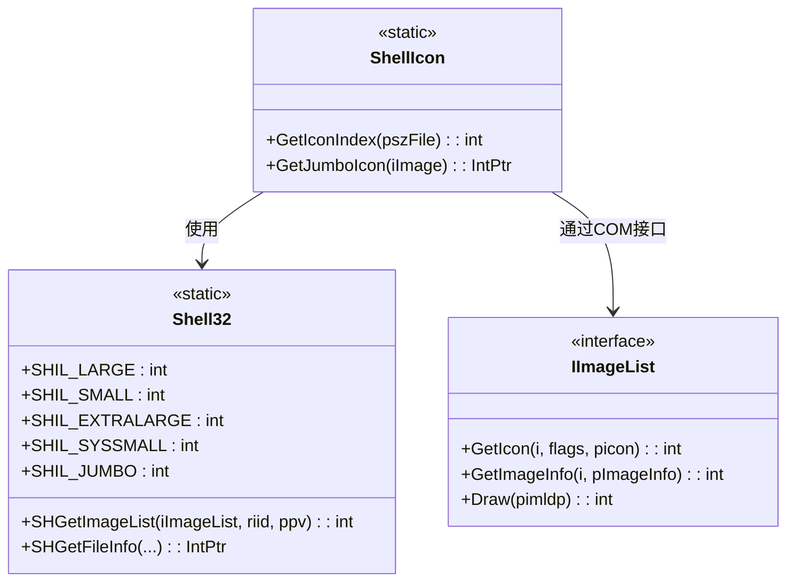
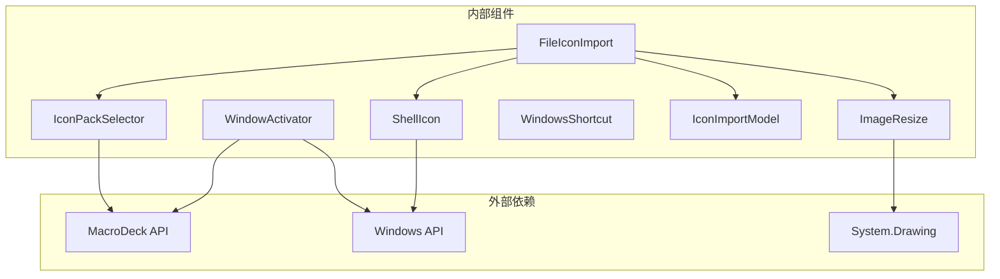

# 工具函数API

<cite>
**本文档引用的文件**
- [WindowActivator.cs](file://Utils/WindowActivator.cs)
- [FileIconImport.cs](file://Utils/FileIconImport.cs)
- [ImageResize.cs](file://Utils/ImageResize.cs)
- [ShellIcon.cs](file://Utils/ShellIcon.cs)
- [WindowsShortcut.cs](file://Utils/WindowsShortcut.cs)
- [IconImportModel.cs](file://Models/IconImportModel.cs)
- [IconPackSelector.cs](file://GUI/IconPackSelector.cs)
- [README.md](file://README.md)
</cite>

## 目录
1. [简介](#简介)
2. [项目结构](#项目结构)
3. [核心组件](#核心组件)
4. [架构概览](#架构概览)
5. [详细组件分析](#详细组件分析)
6. [依赖关系分析](#依赖关系分析)
7. [性能考虑](#性能考虑)
8. [故障排除指南](#故障排除指南)
9. [结论](#结论)

## 简介

本文件为Macro Deck Windows Utils插件的工具函数API完整参考文档。该插件提供了Windows系统控制和管理的实用工具函数，包括窗口管理、图标处理、图像操作和系统图标获取等功能。文档详细记录了所有工具类的静态方法、属性和辅助功能的接口规范，包含使用场景、参数说明、返回值定义、异常处理、性能考虑和最佳实践。

## 项目结构

该插件采用模块化设计，主要分为以下核心目录：

**图表来源**
- [WindowActivator.cs:1-256](file://Utils/WindowActivator.cs#L1-L256)
- [FileIconImport.cs:1-67](file://Utils/FileIconImport.cs#L1-L67)
- [ImageResize.cs:1-21](file://Utils/ImageResize.cs#L1-L21)
- [ShellIcon.cs:1-337](file://Utils/ShellIcon.cs#L1-L337)
- [WindowsShortcut.cs:1-66](file://Utils/WindowsShortcut.cs#L1-L66)

**章节来源**
- [README.md:1-40](file://README.md#L1-L40)

## 核心组件

本插件包含五个核心工具类，每个都提供特定的功能集：

### 主要工具类概览

| 工具类 | 功能领域 | 主要用途 | 复杂度 |
|--------|----------|----------|--------|
| WindowActivator | 窗口管理 | 窗口查找和激活 | 中等 |
| FileIconImport | 图标处理 | 文件图标导入和管理 | 中等 |
| ImageResize | 图像操作 | 图像尺寸调整 | 简单 |
| ShellIcon | 系统图标 | Windows系统图标获取 | 高复杂度 |
| WindowsShortcut | 快捷方式 | .lnk文件解析 | 简单 |

**章节来源**
- [WindowActivator.cs:8-36](file://Utils/WindowActivator.cs#L8-L36)
- [FileIconImport.cs:11-67](file://Utils/FileIconImport.cs#L11-L67)
- [ImageResize.cs:5-21](file://Utils/ImageResize.cs#L5-L21)
- [ShellIcon.cs:48-337](file://Utils/ShellIcon.cs#L48-L337)
- [WindowsShortcut.cs:5-66](file://Utils/WindowsShortcut.cs#L5-L66)

## 架构概览

插件采用分层架构设计，各工具类职责明确，相互协作完成复杂的Windows系统操作：

**图表来源**
- [FileIconImport.cs:14-64](file://Utils/FileIconImport.cs#L14-L64)
- [ShellIcon.cs:313-335](file://Utils/ShellIcon.cs#L313-L335)
- [ImageResize.cs:8-17](file://Utils/ImageResize.cs#L8-L17)

## 详细组件分析

### WindowActivator 窗口管理工具

WindowActivator类提供强大的窗口查找和激活功能，支持多种匹配模式和精确的窗口过滤。

#### 核心功能

**主要方法：**
- `ActivateWindowByTitle`: 根据标题模式激活窗口
- `ForceActivateWindow`: 强制激活指定窗口
- 内部辅助方法：窗口文本匹配、任务栏可见性检查

**匹配模式枚举：**
- `Partial`: 部分匹配（默认）
- `Full`: 完全匹配
- `StartsWith`: 前缀匹配
- `EndsWith`: 后缀匹配
- `Regex`: 正则表达式匹配

**图表来源**
- [WindowActivator.cs:9-36](file://Utils/WindowActivator.cs#L9-L36)
- [WindowActivator.cs:39-47](file://Utils/WindowActivator.cs#L39-L47)

#### 参数说明

| 参数名 | 类型 | 必需 | 默认值 | 描述 |
|--------|------|------|--------|------|
| pattern | string | 是 | - | 窗口标题匹配模式，不能为空 |
| matchMode | MatchMode | 否 | Partial | 匹配模式枚举 |
| caseSensitive | bool | 否 | true | 是否区分大小写 |

#### 返回值定义

- `ActivateWindowByTitle`: 成功找到并激活窗口返回true，否则false
- `ForceActivateWindow`: 无返回值（void）

#### 使用场景

- 自动化测试中的窗口切换
- 桌面应用程序的窗口管理
- 多任务环境下的焦点控制

**章节来源**
- [WindowActivator.cs:57-122](file://Utils/WindowActivator.cs#L57-L122)
- [WindowActivator.cs:173-210](file://Utils/WindowActivator.cs#L173-L210)

### FileIconImport 图标处理工具

FileIconImport类提供完整的文件图标导入流程，从系统图标提取到图标包管理的端到端解决方案。

#### 核心功能

**主要方法：**
- `ImportIcon`: 导入文件图标到指定图标包

**工作流程：**
1. 显示质量选择对话框
2. 获取系统图标索引
3. 调整图像尺寸
4. 选择目标图标包
5. 添加到MacroDeck图标管理器

**图表来源**
- [FileIconImport.cs:14-64](file://Utils/FileIconImport.cs#L14-L64)

#### 参数说明

| 参数名 | 类型 | 必需 | 默认值 | 描述 |
|--------|------|------|--------|------|
| filePath | string | 是 | - | 要导入图标的文件路径 |

#### 返回值定义

- `ImportIcon`: 成功返回IconImportModel对象，失败返回null

#### 使用场景

- 批量导入应用程序图标
- 创建自定义图标包
- 图标资源管理

**章节来源**
- [FileIconImport.cs:14-64](file://Utils/FileIconImport.cs#L14-L64)
- [IconImportModel.cs:3-15](file://Models/IconImportModel.cs#L3-L15)

### ImageResize 图像操作工具

ImageResize类提供简单而高效的图像缩放功能，专门用于图标尺寸调整。

#### 核心功能

**主要方法：**
- `Resize`: 将原始图像调整到指定尺寸

#### 参数说明

| 参数名 | 类型 | 必需 | 默认值 | 描述 |
|--------|------|------|--------|------|
| original | Bitmap | 是 | - | 原始图像对象 |
| width | int | 是 | - | 目标宽度（像素） |
| height | int | 是 | - | 目标高度（像素） |

#### 返回值定义

- `Resize`: 返回新的Bitmap对象，尺寸为目标规格

#### 使用场景

- 图标标准化处理
- 图像预处理
- 统一视觉效果

**章节来源**
- [ImageResize.cs:8-17](file://Utils/ImageResize.cs#L8-L17)

### ShellIcon 系统图标获取

ShellIcon类提供高级的Windows系统图标获取功能，支持从任意文件类型提取高质量图标。

#### 核心功能

**主要方法：**
- `GetIconIndex`: 获取文件的系统图标索引
- `GetJumboIcon`: 获取256x256的超大图标

**内部结构：**
- Shell32: Windows Shell API常量和P/Invoke声明
- IImageList: COM接口定义
- SHFILEINFO: 文件信息结构体

**图表来源**
- [ShellIcon.cs:48-337](file://Utils/ShellIcon.cs#L48-L337)

#### 参数说明

| 参数名 | 类型 | 必需 | 默认值 | 描述 |
|--------|------|------|--------|------|
| pszFile | string | 是 | - | 文件路径或名称 |
| iImage | int | 是 | - | 系统图标索引 |

#### 返回值定义

- `GetIconIndex`: 返回系统图标索引值
- `GetJumboIcon`: 返回图标句柄（IntPtr）

#### 使用场景

- 文件类型图标识别
- 应用程序图标提取
- 系统资源图标访问

**章节来源**
- [ShellIcon.cs:313-335](file://Utils/ShellIcon.cs#L313-L335)

### WindowsShortcut 快捷方式处理

WindowsShortcut类提供Windows快捷方式文件（.lnk）的解析功能。

#### 核心功能

**主要方法：**
- `GetShortcutTarget`: 解析.lnk文件的目标路径

#### 参数说明

| 参数名 | 类型 | 必需 | 默认值 | 描述 |
|--------|------|------|--------|------|
| file | string | 是 | - | .lnk文件路径 |

#### 返回值定义

- `GetShortcutTarget`: 返回解析出的目标路径字符串，失败时返回空字符串

#### 使用场景

- 快捷方式目标解析
- 文件链接追踪
- 应用程序启动路径获取

**章节来源**
- [WindowsShortcut.cs:8-64](file://Utils/WindowsShortcut.cs#L8-L64)

## 依赖关系分析

插件内部依赖关系清晰，各组件职责分离：

**图表来源**
- [FileIconImport.cs:1-8](file://Utils/FileIconImport.cs#L1-L8)
- [WindowActivator.cs:1-7](file://Utils/WindowActivator.cs#L1-L7)
- [ShellIcon.cs:1-3](file://Utils/ShellIcon.cs#L1-L3)
- [ImageResize.cs:1](file://Utils/ImageResize.cs#L1)

**章节来源**
- [FileIconImport.cs:1-8](file://Utils/FileIconImport.cs#L1-L8)
- [WindowActivator.cs:1-7](file://Utils/WindowActivator.cs#L1-L7)
- [ShellIcon.cs:1-3](file://Utils/ShellIcon.cs#L1-L3)

## 性能考虑

### WindowActivator 性能优化

- **窗口枚举优化**: 使用进程ID过滤避免处理当前进程的窗口
- **正则表达式缓存**: 在Regex模式下预编译正则表达式以提高性能
- **任务栏可见性检查**: 通过窗口样式和扩展样式快速过滤不可见窗口

### FileIconImport 性能优化

- **异步处理**: 图标导入过程涉及多个UI交互，建议在后台线程执行
- **内存管理**: 及时释放图标句柄和图像资源
- **条件缩放**: 当目标尺寸与源尺寸相同时跳过缩放操作

### ShellIcon 性能优化

- **COM接口复用**: IImageList接口在整个应用程序生命周期内可复用
- **图标缓存**: 对于频繁访问的文件类型，建议实现图标缓存机制
- **错误处理**: 避免重复的文件系统查询

## 故障排除指南

### 常见问题及解决方案

**窗口激活失败**
- 检查窗口是否在任务栏可见
- 确认匹配模式是否正确
- 验证进程权限是否足够

**图标导入失败**
- 确认文件路径有效且可访问
- 检查目标图标包是否存在
- 验证图像格式兼容性

**系统图标获取异常**
- 确认Windows Shell服务正常运行
- 检查文件关联是否正确
- 验证COM接口调用权限

**快捷方式解析错误**
- 检查.lnk文件完整性
- 验证文件编码格式
- 确认目标路径存在

**章节来源**
- [WindowActivator.cs:59-88](file://Utils/WindowActivator.cs#L59-L88)
- [FileIconImport.cs:29-36](file://Utils/FileIconImport.cs#L29-L36)
- [WindowsShortcut.cs:60-64](file://Utils/WindowsShortcut.cs#L60-L64)

## 结论

本工具函数API提供了完整的Windows系统控制和管理能力。每个工具类都经过精心设计，具有明确的职责边界和良好的错误处理机制。通过合理使用这些工具，开发者可以构建功能丰富的Windows自动化解决方案。

关键优势：
- **模块化设计**: 各工具类职责明确，易于维护和扩展
- **完善的错误处理**: 提供详细的异常信息和恢复策略
- **性能优化**: 针对Windows API调用进行了优化
- **易用性**: 清晰的接口设计和丰富的使用示例

建议的最佳实践：
- 在生产环境中始终进行适当的错误检查
- 合理使用异步操作避免UI阻塞
- 注意资源管理和内存泄漏防护
- 根据具体需求选择合适的匹配模式和处理策略