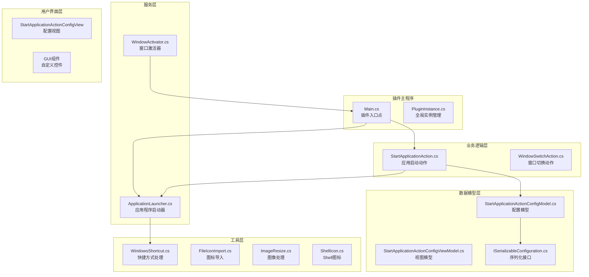
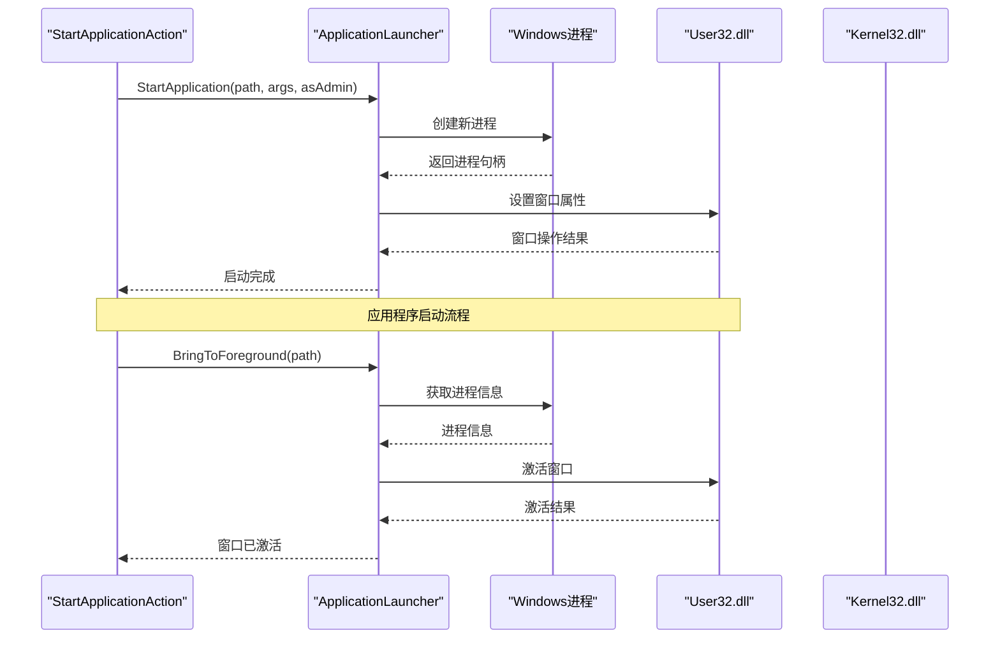
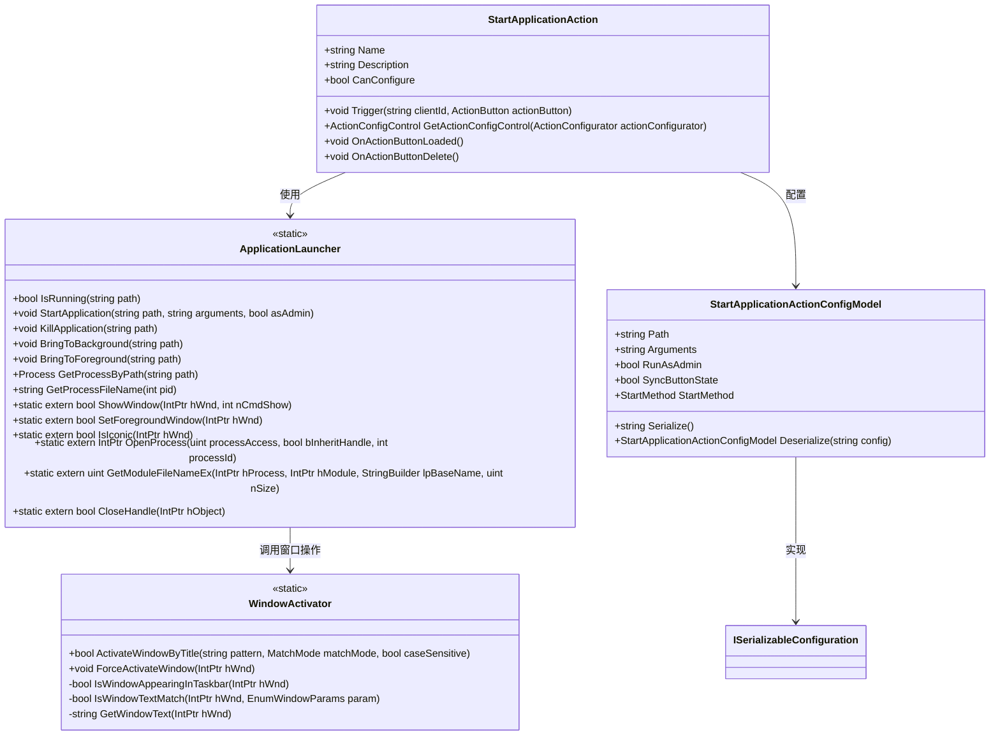
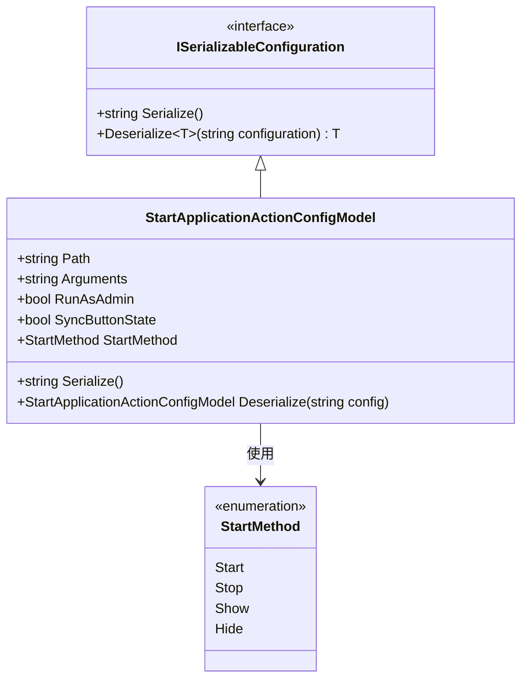
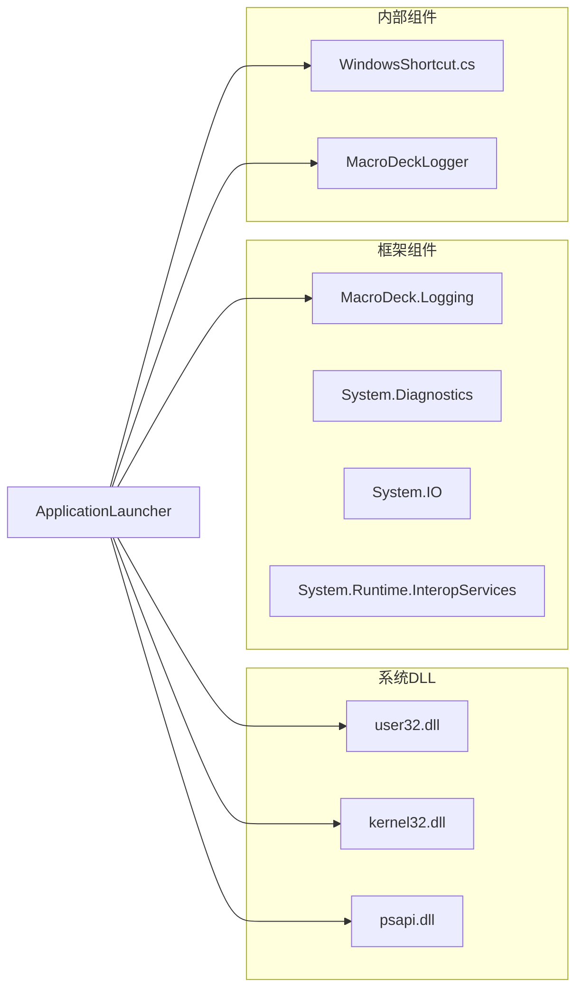
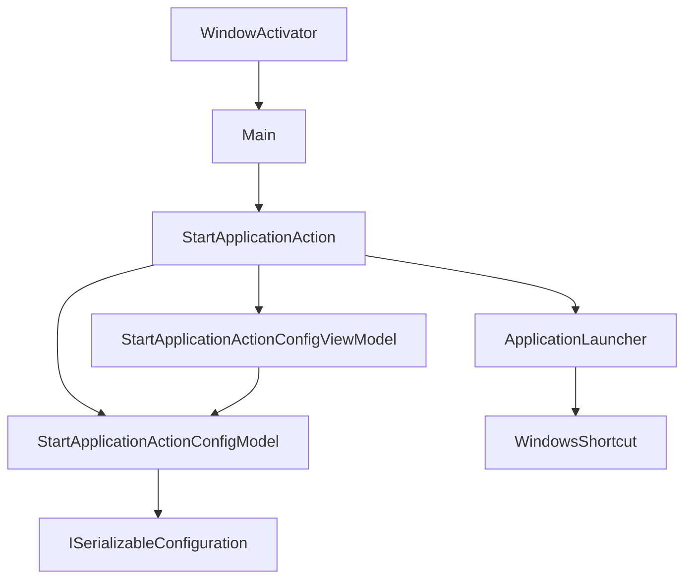

# 服务类API

<cite>
**本文档引用的文件**
- [ApplicationLauncher.cs](file://Services/ApplicationLauncher.cs)
- [StartApplicationAction.cs](file://Actions/StartApplicationAction.cs)
- [StartApplicationActionConfigModel.cs](file://Models/StartApplicationActionConfigModel.cs)
- [StartApplicationActionConfigViewModel.cs](file://ViewModels/StartApplicationActionConfigViewModel.cs)
- [WindowActivator.cs](file://Utils/WindowActivator.cs)
- [WindowsShortcut.cs](file://Utils/WindowsShortcut.cs)
- [Main.cs](file://Main.cs)
- [ISerializableConfiguration.cs](file://Models/ISerializableConfiguration.cs)
- [StartApplicationActionConfigView.Designer.cs](file://Views/StartApplicationActionConfigView.Designer.cs)
</cite>

## 目录
1. [简介](#简介)
2. [项目结构](#项目结构)
3. [核心组件](#核心组件)
4. [架构概览](#架构概览)
5. [详细组件分析](#详细组件分析)
6. [依赖关系分析](#依赖关系分析)
7. [性能考虑](#性能考虑)
8. [故障排除指南](#故障排除指南)
9. [结论](#结论)

## 简介

本文档提供了Windows Utils插件中ApplicationLauncher服务类的详细API参考文档。该服务类专门负责应用程序启动、进程管理和窗口激活等核心功能，为Macro Deck平台提供完整的Windows应用程序控制能力。

ApplicationLauncher服务类采用静态设计模式，提供了一系列线程安全的方法来管理Windows应用程序的生命周期和用户界面交互。该服务集成了多种Windows API，包括进程管理、窗口操作和快捷方式解析等功能。

## 项目结构

该项目遵循标准的Macro Deck插件架构，主要分为以下几个核心模块：

**图表来源**
- [Main.cs:14-59](file://Main.cs#L14-L59)
- [ApplicationLauncher.cs:13-165](file://Services/ApplicationLauncher.cs#L13-L165)
- [StartApplicationAction.cs:14-84](file://Actions/StartApplicationAction.cs#L14-L84)

**章节来源**
- [Main.cs:14-59](file://Main.cs#L14-L59)
- [ApplicationLauncher.cs:13-165](file://Services/ApplicationLauncher.cs#L13-L165)

## 核心组件

### ApplicationLauncher服务类概述

ApplicationLauncher是本项目的核心服务类，位于`SuchByte.WindowsUtils.Services`命名空间下。该类采用静态设计模式，提供以下主要功能：

- **应用程序启动管理**：支持普通启动、管理员权限启动、参数传递
- **进程生命周期控制**：进程检测、强制终止、状态查询
- **窗口操作管理**：前台显示、后台最小化、窗口激活
- **系统集成**：与Windows API深度集成，提供原生用户体验

### 主要特性

1. **线程安全设计**：所有公共方法均为静态，避免并发访问问题
2. **错误处理机制**：内置日志记录和异常处理
3. **资源管理**：正确管理Win32句柄和进程资源
4. **兼容性支持**：支持快捷方式解析和路径标准化

**章节来源**
- [ApplicationLauncher.cs:13-165](file://Services/ApplicationLauncher.cs#L13-L165)

## 架构概览

ApplicationLauncher服务类在整个系统架构中扮演着关键角色，作为底层系统操作与上层业务逻辑之间的桥梁：

**图表来源**
- [StartApplicationAction.cs:22-50](file://Actions/StartApplicationAction.cs#L22-L50)
- [ApplicationLauncher.cs:45-126](file://Services/ApplicationLauncher.cs#L45-L126)

### 组件关系图

**图表来源**
- [ApplicationLauncher.cs:13-165](file://Services/ApplicationLauncher.cs#L13-L165)
- [StartApplicationAction.cs:14-84](file://Actions/StartApplicationAction.cs#L14-L84)
- [StartApplicationActionConfigModel.cs:6-36](file://Models/StartApplicationActionConfigModel.cs#L6-L36)
- [WindowActivator.cs:9-256](file://Utils/WindowActivator.cs#L9-L256)

## 详细组件分析

### ApplicationLauncher类详细分析

#### 公共方法接口

##### IsRunning方法
- **功能**：检查指定路径的应用程序是否正在运行
- **参数**：
  - `path`：应用程序可执行文件的完整路径
- **返回值**：布尔值，表示应用程序是否运行中
- **实现细节**：通过`GetProcessByPath`方法获取进程信息进行判断

##### StartApplication方法
- **功能**：启动指定的应用程序
- **参数**：
  - `path`：应用程序可执行文件路径
  - `arguments`：启动参数字符串
  - `asAdmin`：是否以管理员权限运行
- **返回值**：无（void）
- **实现细节**：使用`ProcessStartInfo`配置启动参数，支持管理员权限提升

##### KillApplication方法
- **功能**：终止指定应用程序的所有进程实例
- **参数**：
  - `path`：目标应用程序的路径
- **返回值**：无（void）
- **实现细节**：查找所有匹配进程并逐一终止，包含详细的错误处理

##### BringToBackground方法
- **功能**：将应用程序窗口最小化到后台
- **参数**：
  - `path`：目标应用程序的路径
- **返回值**：无（void）
- **实现细节**：通过Windows API设置窗口状态为最小化

##### BringToForeground方法
- **功能**：将应用程序窗口激活到前台
- **参数**：
  - `path`：目标应用程序的路径
- **返回值**：无（void）
- **实现细节**：优先使用`SetForegroundWindow`，失败时采用后备方案

##### GetProcessByPath方法
- **功能**：根据文件路径获取对应的进程对象
- **参数**：
  - `path`：应用程序路径
- **返回值**：Process对象或null
- **实现细节**：支持快捷方式解析，按PID降序排列选择最新进程

##### GetProcessFileName方法
- **功能**：获取指定进程ID的可执行文件名
- **参数**：
  - `pid`：进程ID
- **返回值**：进程可执行文件的完整路径
- **实现细节**：使用Win32 API获取进程文件名，包含资源清理

#### 私有Win32 API声明

服务类声明了多个重要的Windows API用于底层系统操作：

- **ShowWindow**：控制窗口显示状态
- **SetForegroundWindow**：设置窗口为前台
- **IsIconic**：检查窗口是否最小化
- **OpenProcess**：打开现有进程
- **GetModuleFileNameEx**：获取进程模块文件名
- **CloseHandle**：关闭句柄

#### 错误处理和日志记录

服务类实现了完善的错误处理机制：

- **输入验证**：对空路径进行检查和警告
- **进程存在性检查**：在执行操作前验证进程状态
- **日志记录**：使用MacroDeckLogger记录操作状态和错误信息
- **异常捕获**：在关键操作中捕获并处理异常

**章节来源**
- [ApplicationLauncher.cs:39-165](file://Services/ApplicationLauncher.cs#L39-L165)

### 配置模型分析

#### StartApplicationActionConfigModel

该模型实现了`ISerializableConfiguration`接口，提供JSON序列化支持：

**图表来源**
- [ISerializableConfiguration.cs:5-11](file://Models/ISerializableConfiguration.cs#L5-L11)
- [StartApplicationActionConfigModel.cs:6-36](file://Models/StartApplicationActionConfigModel.cs#L6-L36)

**章节来源**
- [StartApplicationActionConfigModel.cs:6-36](file://Models/StartApplicationActionConfigModel.cs#L6-L36)
- [ISerializableConfiguration.cs:5-11](file://Models/ISerializableConfiguration.cs#L5-L11)

### 视图模型分析

#### StartApplicationActionConfigViewModel

提供配置数据的双向绑定支持：

- **属性映射**：将UI控件与配置模型进行绑定
- **配置保存**：实现配置的序列化和持久化
- **错误处理**：捕获保存过程中的异常并记录日志
- **状态同步**：支持按钮状态的实时同步

**章节来源**
- [StartApplicationActionConfigViewModel.cs:8-73](file://ViewModels/StartApplicationActionConfigViewModel.cs#L8-L73)

### 工具类分析

#### WindowsShortcut工具类

提供Windows快捷方式文件的解析功能：

- **快捷方式识别**：检测文件扩展名为`.lnk`
- **二进制解析**：直接读取LNK文件格式
- **目标路径提取**：解析快捷方式指向的实际目标
- **错误容错**：在解析失败时返回空字符串而非抛出异常

**章节来源**
- [WindowsShortcut.cs:5-66](file://Utils/WindowsShortcut.cs#L5-L66)

## 依赖关系分析

### 外部依赖

ApplicationLauncher服务类依赖于以下外部组件：

**图表来源**
- [ApplicationLauncher.cs:1-10](file://Services/ApplicationLauncher.cs#L1-L10)

### 内部依赖关系

**图表来源**
- [StartApplicationAction.cs:14-84](file://Actions/StartApplicationAction.cs#L14-L84)
- [ApplicationLauncher.cs:13-165](file://Services/ApplicationLauncher.cs#L13-L165)

**章节来源**
- [StartApplicationAction.cs:14-84](file://Actions/StartApplicationAction.cs#L14-L84)
- [ApplicationLauncher.cs:13-165](file://Services/ApplicationLauncher.cs#L13-L165)

## 性能考虑

### 线程安全设计

ApplicationLauncher采用静态设计模式，具有以下优势：

- **无状态设计**：所有方法都是静态的，避免了实例状态共享问题
- **线程安全**：静态方法天然支持多线程并发访问
- **内存效率**：无需创建实例，减少内存分配

### 资源管理优化

- **句柄管理**：在`GetProcessFileName`方法中正确管理Win32句柄的创建和销毁
- **进程枚举优化**：使用LINQ查询时注意性能影响，避免不必要的进程遍历
- **缓存策略**：可以考虑实现进程信息缓存以减少重复查询

### 性能优化建议

1. **异步操作**：对于可能阻塞的操作，考虑实现异步版本
2. **批量操作**：当需要对多个进程执行相同操作时，考虑批处理优化
3. **延迟加载**：对于不常用的功能，考虑延迟初始化
4. **内存监控**：定期检查内存使用情况，避免内存泄漏

### 错误处理性能

- **快速失败**：在发现无效输入时立即返回，避免不必要的系统调用
- **日志级别**：合理设置日志级别，避免在生产环境中产生过多日志
- **异常恢复**：在关键操作中实现适当的异常恢复机制

## 故障排除指南

### 常见问题及解决方案

#### 权限相关问题

**问题**：应用程序无法以管理员权限启动
**原因**：用户拒绝UAC提示或权限不足
**解决方案**：
- 确保用户具有管理员权限
- 检查UAC设置
- 验证目标应用程序的安装路径

#### 进程查找失败

**问题**：`GetProcessByPath`返回null
**原因**：
- 应用程序尚未完全启动
- 快捷方式路径解析失败
- 进程名称与文件名不匹配

**解决方案**：
- 增加启动等待时间
- 验证快捷方式文件的有效性
- 检查进程名称的大小写敏感性

#### 窗口激活失败

**问题**：`BringToForeground`无法激活目标窗口
**原因**：
- 目标应用程序处于最小化状态
- 窗口被其他应用程序覆盖
- 系统安全策略阻止前台切换

**解决方案**：
- 使用后备方案：先最小化再还原
- 检查应用程序的窗口样式
- 考虑使用`WindowActivator`类

### 日志分析

服务类使用MacroDeckLogger进行详细日志记录：

- **警告级别**：路径为空、进程不存在等可恢复错误
- **跟踪级别**：进程启动、窗口操作等详细信息
- **错误级别**：严重异常和不可恢复错误

**章节来源**
- [ApplicationLauncher.cs:60-126](file://Services/ApplicationLauncher.cs#L60-L126)

## 结论

ApplicationLauncher服务类为Windows Utils插件提供了强大而可靠的系统级应用程序管理能力。其设计充分考虑了线程安全性、错误处理和性能优化，在Macro Deck平台上实现了完整的Windows应用程序控制功能。

### 主要优势

1. **功能完整性**：涵盖了应用程序启动、进程管理和窗口操作的完整生命周期
2. **稳定性**：完善的错误处理和日志记录机制
3. **易用性**：简洁的API设计，易于在动作中集成使用
4. **性能**：静态设计和优化的资源管理

### 扩展建议

1. **异步支持**：为长时间运行的操作添加异步版本
2. **配置缓存**：实现进程信息和快捷方式的缓存机制
3. **监控功能**：添加进程状态监控和自动重连功能
4. **测试覆盖**：增加单元测试和集成测试覆盖率

该服务类为开发者提供了坚实的基础，可以在此基础上构建更复杂的应用程序控制功能，满足各种自动化场景的需求。