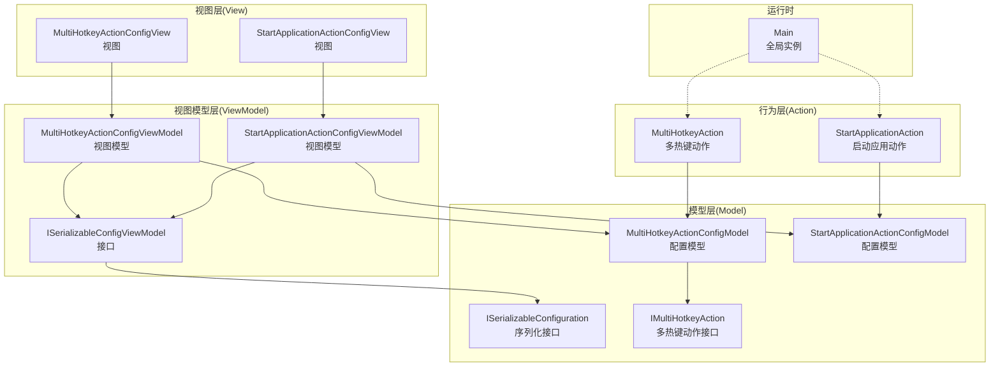
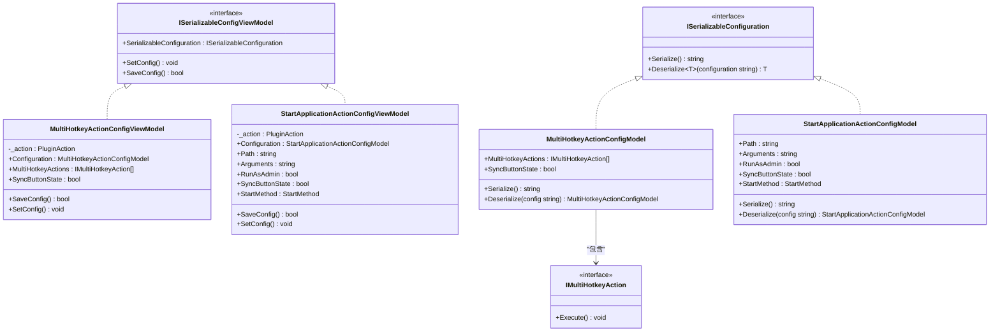
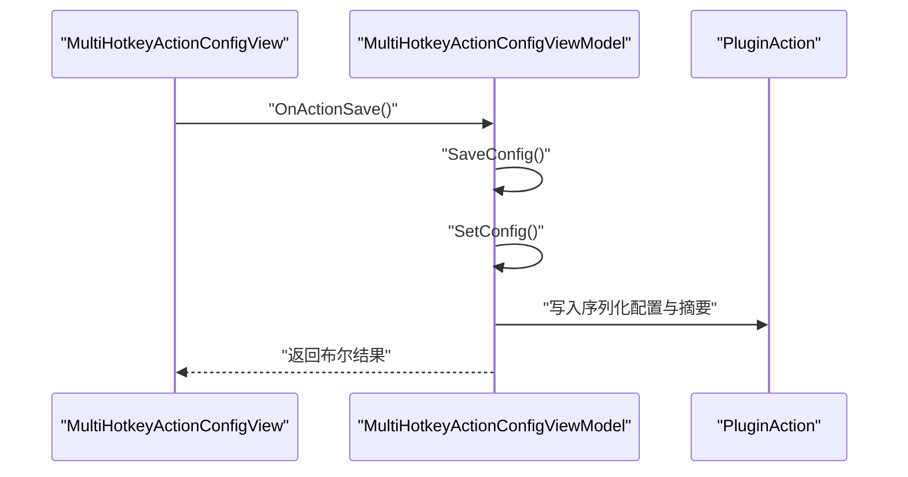
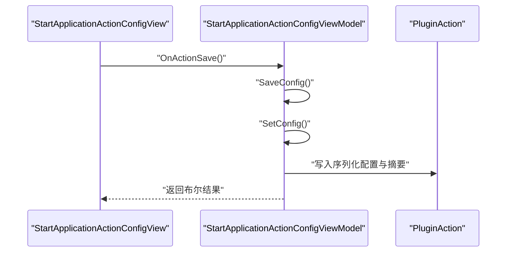
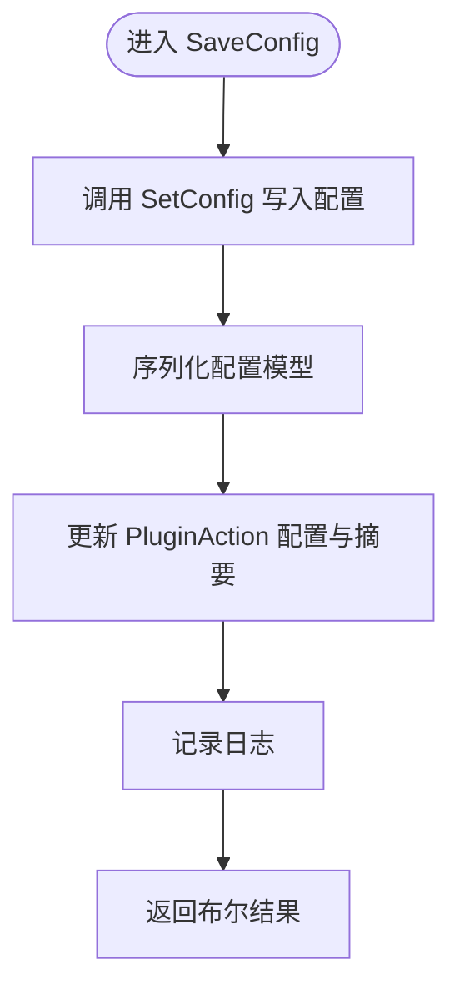
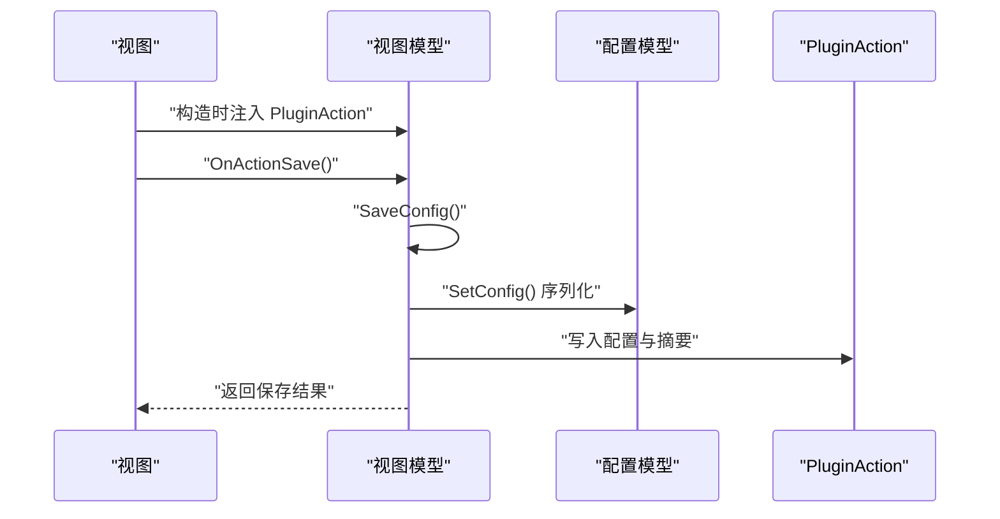
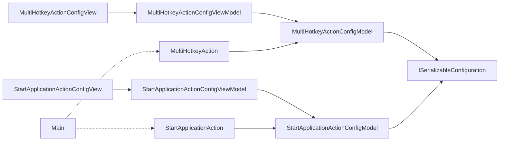

# 视图模型API

<cite>
**本文引用的文件**
- [ISerializableConfigViewModel.cs](file://ViewModels/ISerializableConfigViewModel.cs)
- [MultiHotkeyActionConfigViewModel.cs](file://ViewModels/MultiHotkeyActionConfigViewModel.cs)
- [StartApplicationActionConfigViewModel.cs](file://ViewModels/StartApplicationActionConfigViewModel.cs)
- [ISerializableConfiguration.cs](file://Models/ISerializableConfiguration.cs)
- [MultiHotkeyActionConfigModel.cs](file://Models/MultiHotkeyActionConfigModel.cs)
- [StartApplicationActionConfigModel.cs](file://Models/StartApplicationActionConfigModel.cs)
- [IMultiHotkeyAction.cs](file://Models/IMultiHotkeyAction.cs)
- [MultiHotkeyActionConfigView.cs](file://Views/MultiHotkeyActionConfigView.cs)
- [StartApplicationActionConfigView.Designer.cs](file://Views/StartApplicationActionConfigView.Designer.cs)
- [StartApplicationAction.cs](file://Actions/StartApplicationAction.cs)
- [MultiHotkeyAction.cs](file://Actions/MultiHotkeyAction.cs)
- [Main.cs](file://Main.cs)
</cite>

## 目录
1. [简介](#简介)
2. [项目结构](#项目结构)
3. [核心组件](#核心组件)
4. [架构总览](#架构总览)
5. [详细组件分析](#详细组件分析)
6. [依赖关系分析](#依赖关系分析)
7. [性能考虑](#性能考虑)
8. [故障排查指南](#故障排查指南)
9. [结论](#结论)
10. [附录](#附录)

## 简介
本文件为本仓库中“视图模型API”的权威参考文档，聚焦于MVVM模式下的视图模型类接口规范与实现细节，覆盖以下关键点：
- MultiHotkeyActionConfigViewModel 与 StartApplicationActionConfigViewModel 的属性绑定、命令实现与配置保存流程
- ISerializableConfigViewModel 接口的配置序列化契约与实现
- 视图模型与GUI控件的交互模式、属性变更通知与配置更新机制
- MVVM最佳实践在本项目中的落地方式

本项目采用“视图模型（ViewModel）+ 模型（Model）+ 视图（View）+ 行为动作（Action）”的分层设计，通过统一的序列化接口实现配置的持久化与跨层传递。

## 项目结构
围绕视图模型API的关键目录与文件如下：
- 视图模型：ViewModels/ISerializableConfigViewModel.cs、MultiHotkeyActionConfigViewModel.cs、StartApplicationActionConfigViewModel.cs
- 配置模型：Models/ISerializableConfiguration.cs、MultiHotkeyActionConfigModel.cs、StartApplicationActionConfigModel.cs、IMultiHotkeyAction.cs
- 视图与控件：Views/MultiHotkeyActionConfigView.cs、Views/StartApplicationActionConfigView.Designer.cs
- 行为动作：Actions/StartApplicationAction.cs、Actions/MultiHotkeyAction.cs
- 全局入口：Main.cs

图表来源
- [MultiHotkeyActionConfigView.cs:1-27](file://Views/MultiHotkeyActionConfigView.cs#L1-L27)
- [StartApplicationActionConfigView.Designer.cs:1-204](file://Views/StartApplicationActionConfigView.Designer.cs#L1-L204)
- [ISerializableConfigViewModel.cs:1-13](file://ViewModels/ISerializableConfigViewModel.cs#L1-L13)
- [MultiHotkeyActionConfigViewModel.cs:1-56](file://ViewModels/MultiHotkeyActionConfigViewModel.cs#L1-L56)
- [StartApplicationActionConfigViewModel.cs:1-73](file://ViewModels/StartApplicationActionConfigViewModel.cs#L1-L73)
- [ISerializableConfiguration.cs:1-12](file://Models/ISerializableConfiguration.cs#L1-L12)
- [MultiHotkeyActionConfigModel.cs:1-22](file://Models/MultiHotkeyActionConfigModel.cs#L1-L22)
- [StartApplicationActionConfigModel.cs:1-36](file://Models/StartApplicationActionConfigModel.cs#L1-L36)
- [IMultiHotkeyAction.cs:1-9](file://Models/IMultiHotkeyAction.cs#L1-L9)
- [StartApplicationAction.cs:1-84](file://Actions/StartApplicationAction.cs#L1-L84)
- [MultiHotkeyAction.cs:1-57](file://Actions/MultiHotkeyAction.cs#L1-L57)
- [Main.cs:1-60](file://Main.cs#L1-L60)

章节来源
- [MultiHotkeyActionConfigView.cs:1-27](file://Views/MultiHotkeyActionConfigView.cs#L1-L27)
- [StartApplicationActionConfigView.Designer.cs:1-204](file://Views/StartApplicationActionConfigView.Designer.cs#L1-L204)
- [ISerializableConfigViewModel.cs:1-13](file://ViewModels/ISerializableConfigViewModel.cs#L1-L13)
- [MultiHotkeyActionConfigViewModel.cs:1-56](file://ViewModels/MultiHotkeyActionConfigViewModel.cs#L1-L56)
- [StartApplicationActionConfigViewModel.cs:1-73](file://ViewModels/StartApplicationActionConfigViewModel.cs#L1-L73)
- [ISerializableConfiguration.cs:1-12](file://Models/ISerializableConfiguration.cs#L1-L12)
- [MultiHotkeyActionConfigModel.cs:1-22](file://Models/MultiHotkeyActionConfigModel.cs#L1-L22)
- [StartApplicationActionConfigModel.cs:1-36](file://Models/StartApplicationActionConfigModel.cs#L1-L36)
- [IMultiHotkeyAction.cs:1-9](file://Models/IMultiHotkeyAction.cs#L1-L9)
- [StartApplicationAction.cs:1-84](file://Actions/StartApplicationAction.cs#L1-L84)
- [MultiHotkeyAction.cs:1-57](file://Actions/MultiHotkeyAction.cs#L1-L57)
- [Main.cs:1-60](file://Main.cs#L1-L60)

## 核心组件
本节对视图模型API的核心接口与实现进行系统性梳理，明确职责边界与协作关系。

- ISerializableConfigViewModel 接口
  - 职责：定义可序列化配置视图模型的统一契约，包括可访问的配置对象、设置配置的方法以及保存配置的方法。
  - 关键成员：
    - 受保护的可序列化配置对象访问器
    - 设置配置方法
    - 保存配置方法
  - 实现：由 MultiHotkeyActionConfigViewModel 与 StartApplicationActionConfigViewModel 提供具体实现。

- MultiHotkeyActionConfigViewModel
  - 绑定属性：MultiHotkeyActions、SyncButtonState
  - 构造：从传入的 PluginAction 中反序列化配置到内部配置模型
  - 保存：调用 SetConfig 将配置序列化回 PluginAction，并生成摘要信息
  - 日志：保存成功或失败均记录日志

- StartApplicationActionConfigViewModel
  - 绑定属性：Path、Arguments、RunAsAdmin、SyncButtonState、StartMethod
  - 构造：从 PluginAction 反序列化配置
  - 保存：调用 SetConfig 更新摘要与序列化配置
  - 日志：保存成功或失败均记录日志

- ISerializableConfiguration 接口与模型
  - ISerializableConfiguration：定义 Serialize 与通用 Deserialize 泛型方法
  - MultiHotkeyActionConfigModel：包含多热键动作列表与按钮状态同步开关
  - StartApplicationActionConfigModel：包含路径、参数、管理员权限、按钮状态同步与启动方式枚举；提供 JSON 属性名兼容旧版本

- IMultiHotkeyAction 接口
  - 定义单个热键动作的执行能力，用于多热键动作链路

章节来源
- [ISerializableConfigViewModel.cs:1-13](file://ViewModels/ISerializableConfigViewModel.cs#L1-L13)
- [MultiHotkeyActionConfigViewModel.cs:1-56](file://ViewModels/MultiHotkeyActionConfigViewModel.cs#L1-L56)
- [StartApplicationActionConfigViewModel.cs:1-73](file://ViewModels/StartApplicationActionConfigViewModel.cs#L1-L73)
- [ISerializableConfiguration.cs:1-12](file://Models/ISerializableConfiguration.cs#L1-L12)
- [MultiHotkeyActionConfigModel.cs:1-22](file://Models/MultiHotkeyActionConfigModel.cs#L1-L22)
- [StartApplicationActionConfigModel.cs:1-36](file://Models/StartApplicationActionConfigModel.cs#L1-L36)
- [IMultiHotkeyAction.cs:1-9](file://Models/IMultiHotkeyAction.cs#L1-L9)

## 架构总览
本项目遵循MVVM模式：
- 视图（View）负责用户交互与控件布局
- 视图模型（ViewModel）负责数据绑定、命令处理与配置保存
- 模型（Model）负责配置的序列化与反序列化
- 行为动作（Action）负责实际业务逻辑与状态同步

图表来源
- [ISerializableConfigViewModel.cs:1-13](file://ViewModels/ISerializableConfigViewModel.cs#L1-L13)
- [MultiHotkeyActionConfigViewModel.cs:1-56](file://ViewModels/MultiHotkeyActionConfigViewModel.cs#L1-L56)
- [StartApplicationActionConfigViewModel.cs:1-73](file://ViewModels/StartApplicationActionConfigViewModel.cs#L1-L73)
- [ISerializableConfiguration.cs:1-12](file://Models/ISerializableConfiguration.cs#L1-L12)
- [MultiHotkeyActionConfigModel.cs:1-22](file://Models/MultiHotkeyActionConfigModel.cs#L1-L22)
- [StartApplicationActionConfigModel.cs:1-36](file://Models/StartApplicationActionConfigModel.cs#L1-L36)
- [IMultiHotkeyAction.cs:1-9](file://Models/IMultiHotkeyAction.cs#L1-L9)

## 详细组件分析

### MultiHotkeyActionConfigViewModel 分析
- 属性绑定
  - MultiHotkeyActions：绑定到配置模型的动作列表
  - SyncButtonState：绑定到配置模型的按钮状态同步开关
- 命令实现
  - SaveConfig：捕获异常并记录日志，最终返回布尔值表示保存是否完成
  - SetConfig：将当前配置序列化回 PluginAction，并设置摘要信息
- 数据验证
  - 未见显式验证逻辑；保存流程通过异常捕获保证健壮性
- 与视图交互
  - 视图在保存时调用 ViewModel.SaveConfig，从而触发 SetConfig 并持久化

图表来源
- [MultiHotkeyActionConfigView.cs:1-27](file://Views/MultiHotkeyActionConfigView.cs#L1-L27)
- [MultiHotkeyActionConfigViewModel.cs:36-54](file://ViewModels/MultiHotkeyActionConfigViewModel.cs#L36-L54)

章节来源
- [MultiHotkeyActionConfigViewModel.cs:1-56](file://ViewModels/MultiHotkeyActionConfigViewModel.cs#L1-L56)
- [MultiHotkeyActionConfigView.cs:1-27](file://Views/MultiHotkeyActionConfigView.cs#L1-L27)

### StartApplicationActionConfigViewModel 分析
- 属性绑定
  - Path、Arguments、RunAsAdmin、SyncButtonState、StartMethod
- 命令实现
  - SaveConfig：保存配置并记录日志
  - SetConfig：设置摘要与序列化配置
- 数据验证
  - 未见显式验证逻辑；保存流程通过异常捕获保证健壮性
- 与视图交互
  - 视图在保存时调用 ViewModel.SaveConfig，从而触发 SetConfig 并持久化

图表来源
- [StartApplicationActionConfigView.Designer.cs:1-204](file://Views/StartApplicationActionConfigView.Designer.cs#L1-L204)
- [StartApplicationActionConfigViewModel.cs:53-71](file://ViewModels/StartApplicationActionConfigViewModel.cs#L53-L71)

章节来源
- [StartApplicationActionConfigViewModel.cs:1-73](file://ViewModels/StartApplicationActionConfigViewModel.cs#L1-L73)
- [StartApplicationActionConfigView.Designer.cs:1-204](file://Views/StartApplicationActionConfigView.Designer.cs#L1-L204)

### ISerializableConfigViewModel 接口与序列化实现
- 接口契约
  - 受保护的可序列化配置对象访问器
  - SetConfig：将当前视图模型状态写回到底层配置
  - SaveConfig：保存配置并返回布尔结果
- 模型序列化
  - ISerializableConfiguration：定义 Serialize 与通用 Deserialize 泛型方法
  - MultiHotkeyActionConfigModel：序列化当前实例
  - StartApplicationActionConfigModel：序列化当前实例，并使用 JSON 属性名确保向后兼容
- 反序列化
  - 通过 ISerializableConfiguration.Deserialize<T> 在空字符串或无效配置时返回新实例，避免空引用

图表来源
- [ISerializableConfigViewModel.cs:1-13](file://ViewModels/ISerializableConfigViewModel.cs#L1-L13)
- [ISerializableConfiguration.cs:1-12](file://Models/ISerializableConfiguration.cs#L1-L12)
- [MultiHotkeyActionConfigModel.cs:13-20](file://Models/MultiHotkeyActionConfigModel.cs#L13-L20)
- [StartApplicationActionConfigModel.cs:19-26](file://Models/StartApplicationActionConfigModel.cs#L19-L26)

章节来源
- [ISerializableConfigViewModel.cs:1-13](file://ViewModels/ISerializableConfigViewModel.cs#L1-L13)
- [ISerializableConfiguration.cs:1-12](file://Models/ISerializableConfiguration.cs#L1-L12)
- [MultiHotkeyActionConfigModel.cs:1-22](file://Models/MultiHotkeyActionConfigModel.cs#L1-L22)
- [StartApplicationActionConfigModel.cs:1-36](file://Models/StartApplicationActionConfigModel.cs#L1-L36)

### 视图与视图模型的交互模式
- 视图在加载时构造对应的视图模型并持有引用
- 视图在保存时调用 ViewModel.SaveConfig，由视图模型负责调用 SetConfig 并持久化配置
- 视图不直接操作 PluginAction，而是通过视图模型间接完成

图表来源
- [MultiHotkeyActionConfigView.cs:1-27](file://Views/MultiHotkeyActionConfigView.cs#L1-L27)
- [StartApplicationActionConfigView.Designer.cs:1-204](file://Views/StartApplicationActionConfigView.Designer.cs#L1-L204)
- [MultiHotkeyActionConfigViewModel.cs:30-54](file://ViewModels/MultiHotkeyActionConfigViewModel.cs#L30-L54)
- [StartApplicationActionConfigViewModel.cs:47-71](file://ViewModels/StartApplicationActionConfigViewModel.cs#L47-L71)

章节来源
- [MultiHotkeyActionConfigView.cs:1-27](file://Views/MultiHotkeyActionConfigView.cs#L1-L27)
- [StartApplicationActionConfigView.Designer.cs:1-204](file://Views/StartApplicationActionConfigView.Designer.cs#L1-L204)
- [MultiHotkeyActionConfigViewModel.cs:1-56](file://ViewModels/MultiHotkeyActionConfigViewModel.cs#L1-L56)
- [StartApplicationActionConfigViewModel.cs:1-73](file://ViewModels/StartApplicationActionConfigViewModel.cs#L1-L73)

### MVVM 最佳实践
- 单向数据流：视图只读取视图模型属性，保存时通过命令触发保存流程
- 配置解耦：视图模型持有 PluginAction 引用，集中处理配置写入与摘要生成
- 异常隔离：保存流程在视图模型内捕获异常并记录日志，避免影响UI线程
- 向后兼容：配置模型使用 JSON 属性名标注，确保旧版本配置仍可正确反序列化

## 依赖关系分析
- 视图模型依赖于配置模型与序列化接口
- 视图模型通过 PluginAction 与行为动作解耦
- 行为动作依赖配置模型执行业务逻辑
- 全局 Main 提供计时器等运行时资源，驱动状态同步

图表来源
- [MultiHotkeyActionConfigViewModel.cs:1-56](file://ViewModels/MultiHotkeyActionConfigViewModel.cs#L1-L56)
- [StartApplicationActionConfigViewModel.cs:1-73](file://ViewModels/StartApplicationActionConfigViewModel.cs#L1-L73)
- [MultiHotkeyActionConfigModel.cs:1-22](file://Models/MultiHotkeyActionConfigModel.cs#L1-L22)
- [StartApplicationActionConfigModel.cs:1-36](file://Models/StartApplicationActionConfigModel.cs#L1-L36)
- [MultiHotkeyActionConfigView.cs:1-27](file://Views/MultiHotkeyActionConfigView.cs#L1-L27)
- [StartApplicationActionConfigView.Designer.cs:1-204](file://Views/StartApplicationActionConfigView.Designer.cs#L1-L204)
- [StartApplicationAction.cs:1-84](file://Actions/StartApplicationAction.cs#L1-L84)
- [MultiHotkeyAction.cs:1-57](file://Actions/MultiHotkeyAction.cs#L1-L57)
- [Main.cs:1-60](file://Main.cs#L1-L60)

章节来源
- [MultiHotkeyActionConfigViewModel.cs:1-56](file://ViewModels/MultiHotkeyActionConfigViewModel.cs#L1-L56)
- [StartApplicationActionConfigViewModel.cs:1-73](file://ViewModels/StartApplicationActionConfigViewModel.cs#L1-L73)
- [MultiHotkeyActionConfigModel.cs:1-22](file://Models/MultiHotkeyActionConfigModel.cs#L1-L22)
- [StartApplicationActionConfigModel.cs:1-36](file://Models/StartApplicationActionConfigModel.cs#L1-L36)
- [MultiHotkeyActionConfigView.cs:1-27](file://Views/MultiHotkeyActionConfigView.cs#L1-L27)
- [StartApplicationActionConfigView.Designer.cs:1-204](file://Views/StartApplicationActionConfigView.Designer.cs#L1-L204)
- [StartApplicationAction.cs:1-84](file://Actions/StartApplicationAction.cs#L1-L84)
- [MultiHotkeyAction.cs:1-57](file://Actions/MultiHotkeyAction.cs#L1-L57)
- [Main.cs:1-60](file://Main.cs#L1-L60)

## 性能考虑
- 序列化成本：配置模型使用系统内置 JSON 序列化，建议在频繁保存场景下避免不必要的重复序列化
- UI线程安全：保存流程在视图模型中捕获异常并记录日志，避免阻塞UI线程
- 状态同步：行为动作通过全局计时器周期性更新按钮状态，注意合理设置间隔以平衡实时性与性能

## 故障排查指南
- 保存失败
  - 现象：保存返回布尔结果但未生效
  - 排查：检查视图模型 SaveConfig 是否抛出异常；查看日志输出定位错误位置
- 配置为空
  - 现象：反序列化后配置为空
  - 排查：确认 PluginAction 的配置字段是否为空；ISerializableConfiguration.Deserialize<T> 在空字符串时会返回新实例
- 按钮状态不同步
  - 现象：启用同步按钮状态后状态未更新
  - 排查：确认行为动作已注册计时器事件并在 OnActionButtonLoaded 中启用；检查路径有效性与权限

章节来源
- [MultiHotkeyActionConfigViewModel.cs:36-48](file://ViewModels/MultiHotkeyActionConfigViewModel.cs#L36-L48)
- [StartApplicationActionConfigViewModel.cs:53-65](file://ViewModels/StartApplicationActionConfigViewModel.cs#L53-L65)
- [ISerializableConfiguration.cs:9-10](file://Models/ISerializableConfiguration.cs#L9-L10)
- [StartApplicationAction.cs:57-82](file://Actions/StartApplicationAction.cs#L57-L82)

## 结论
本仓库的视图模型API以 ISerializableConfigViewModel 为核心契约，结合配置模型与行为动作，实现了清晰的MVVM分层与稳定的配置序列化机制。MultiHotkeyActionConfigViewModel 与 StartApplicationActionConfigViewModel 在属性绑定、命令实现与配置保存方面保持一致的设计风格，配合视图层的统一保存流程，确保了良好的扩展性与可维护性。

## 附录
- 数据绑定示例（路径）
  - 多热键动作列表绑定：[MultiHotkeyActionConfigViewModel.cs:16-20](file://ViewModels/MultiHotkeyActionConfigViewModel.cs#L16-L20)
  - 启动应用路径绑定：[StartApplicationActionConfigViewModel.cs:15-19](file://ViewModels/StartApplicationActionConfigViewModel.cs#L15-L19)
  - 参数绑定：[StartApplicationActionConfigViewModel.cs:21-25](file://ViewModels/StartApplicationActionConfigViewModel.cs#L21-L25)
  - 管理员权限绑定：[StartApplicationActionConfigViewModel.cs:27-31](file://ViewModels/StartApplicationActionConfigViewModel.cs#L27-L31)
  - 同步按钮状态绑定：[MultiHotkeyActionConfigViewModel.cs:22-26](file://ViewModels/MultiHotkeyActionConfigViewModel.cs#L22-L26)、[StartApplicationActionConfigViewModel.cs:33-37](file://ViewModels/StartApplicationActionConfigViewModel.cs#L33-L37)
  - 启动方式绑定：[StartApplicationActionConfigViewModel.cs:39-43](file://ViewModels/StartApplicationActionConfigViewModel.cs#L39-L43)
- 属性变更通知与配置更新机制（路径）
  - 视图保存流程：[MultiHotkeyActionConfigView.cs:23-26](file://Views/MultiHotkeyActionConfigView.cs#L23-L26)、[StartApplicationActionConfigView.Designer.cs:173-188](file://Views/StartApplicationActionConfigView.Designer.cs#L173-L188)
  - 配置写入与摘要生成：[MultiHotkeyActionConfigViewModel.cs:50-54](file://ViewModels/MultiHotkeyActionConfigViewModel.cs#L50-L54)、[StartApplicationActionConfigViewModel.cs:67-71](file://ViewModels/StartApplicationActionConfigViewModel.cs#L67-L71)
- 行为动作与状态同步（路径）
  - 启动应用动作触发与状态同步：[StartApplicationAction.cs:22-82](file://Actions/StartApplicationAction.cs#L22-L82)
  - 多热键动作触发与状态同步：[MultiHotkeyAction.cs:23-47](file://Actions/MultiHotkeyAction.cs#L23-L47)
- 全局实例与计时器（路径）
  - 全局实例与计时器：[Main.cs:14-58](file://Main.cs#L14-L58)