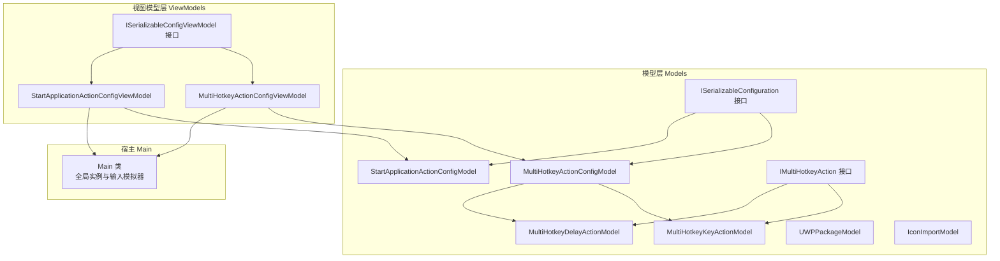
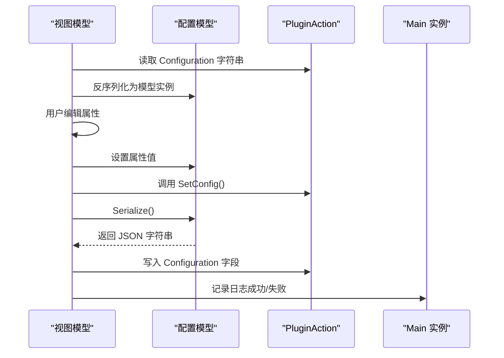
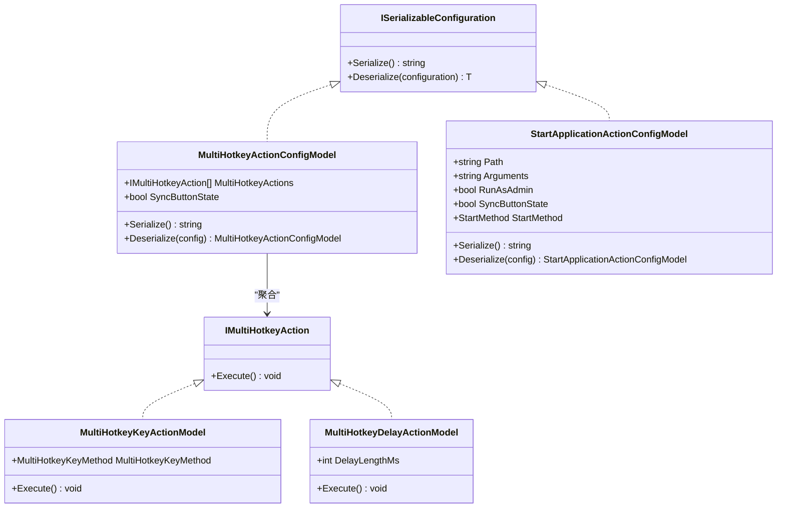
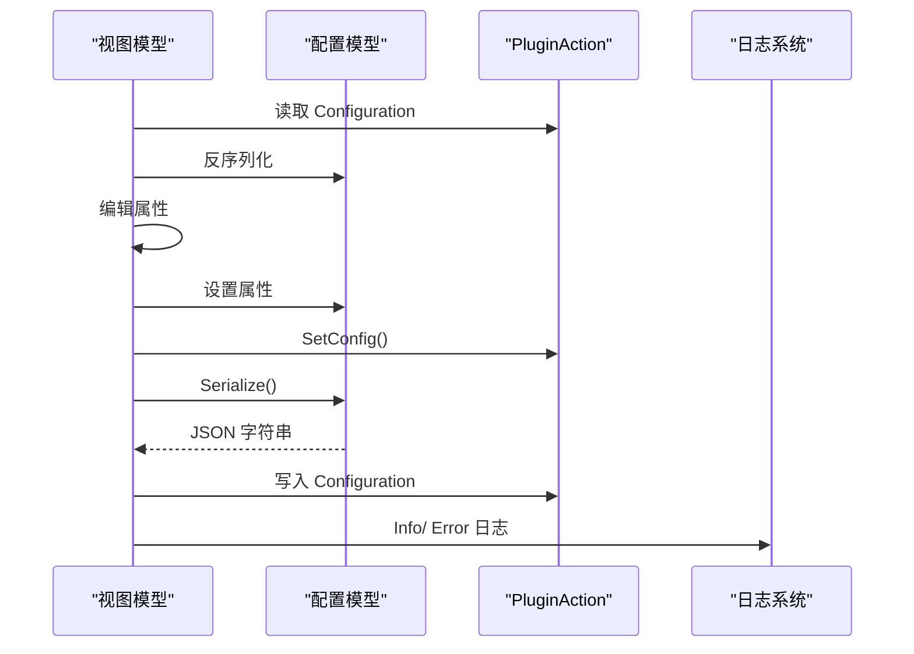
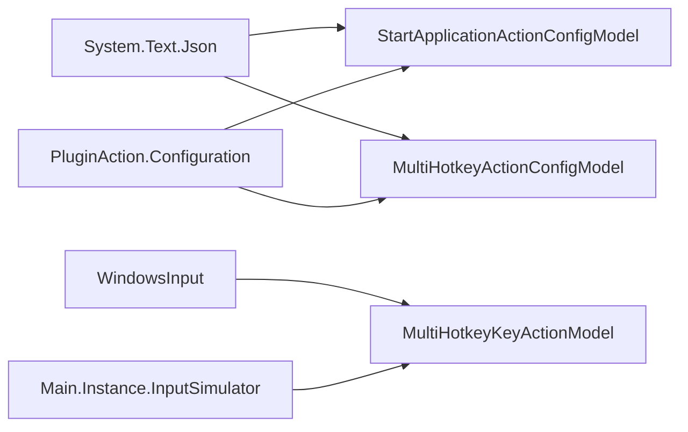

# 配置模型API

<cite>
**本文引用的文件**
- [ISerializableConfiguration.cs](file://Models/ISerializableConfiguration.cs)
- [IMultiHotkeyAction.cs](file://Models/IMultiHotkeyAction.cs)
- [MultiHotkeyActionConfigModel.cs](file://Models/MultiHotkeyActionConfigModel.cs)
- [StartApplicationActionConfigModel.cs](file://Models/StartApplicationActionConfigModel.cs)
- [MultiHotkeyDelayActionModel.cs](file://Models/MultiHotkeyDelayActionModel.cs)
- [MultiHotkeyKeyActionModel.cs](file://Models/MultiHotkeyKeyActionModel.cs)
- [UWPPackageModel.cs](file://Models/UWPPackageModel.cs)
- [IconImportModel.cs](file://Models/IconImportModel.cs)
- [ISerializableConfigViewModel.cs](file://ViewModels/ISerializableConfigViewModel.cs)
- [MultiHotkeyActionConfigViewModel.cs](file://ViewModels/MultiHotkeyActionConfigViewModel.cs)
- [StartApplicationActionConfigViewModel.cs](file://ViewModels/StartApplicationActionConfigViewModel.cs)
- [Main.cs](file://Main.cs)
- [Windows Utils.csproj](file://Windows Utils.csproj)
</cite>

## 目录
1. [简介](#简介)
2. [项目结构](#项目结构)
3. [核心组件](#核心组件)
4. [架构总览](#架构总览)
5. [详细组件分析](#详细组件分析)
6. [依赖分析](#依赖分析)
7. [性能考虑](#性能考虑)
8. [故障排查指南](#故障排查指南)
9. [结论](#结论)
10. [附录](#附录)

## 简介
本文件为 Macro Deck Windows Utils 插件中的“配置模型API”完整参考文档，聚焦于配置数据模型的字段定义、数据类型、验证规则与序列化机制；明确 ISerializableConfiguration 接口的实现规范与 JSON 序列化格式；梳理各配置模型的构造函数、属性访问器与配置验证逻辑；说明配置模型间的继承关系、组合模式与版本兼容性处理；并提供使用示例与最佳实践。

## 项目结构
该插件采用“模型-视图模型-视图”的分层组织方式，配置模型位于 Models 命名空间，视图模型位于 ViewModels 命名空间，二者通过接口进行契约约束，配合 Main 类中的全局实例与定时器等基础设施协同工作。

图表来源
- [ISerializableConfiguration.cs:5-11](file://Models/ISerializableConfiguration.cs#L5-L11)
- [MultiHotkeyActionConfigModel.cs:6-21](file://Models/MultiHotkeyActionConfigModel.cs#L6-L21)
- [StartApplicationActionConfigModel.cs:6-27](file://Models/StartApplicationActionConfigModel.cs#L6-L27)
- [IMultiHotkeyAction.cs:3-8](file://Models/IMultiHotkeyAction.cs#L3-L8)
- [MultiHotkeyKeyActionModel.cs:5-25](file://Models/MultiHotkeyKeyActionModel.cs#L5-L25)
- [MultiHotkeyDelayActionModel.cs:5-13](file://Models/MultiHotkeyDelayActionModel.cs#L5-L13)
- [ISerializableConfigViewModel.cs:5-12](file://ViewModels/ISerializableConfigViewModel.cs#L5-L12)
- [MultiHotkeyActionConfigViewModel.cs:9-55](file://ViewModels/MultiHotkeyActionConfigViewModel.cs#L9-L55)
- [StartApplicationActionConfigViewModel.cs:8-72](file://ViewModels/StartApplicationActionConfigViewModel.cs#L8-L72)
- [Main.cs:14-26](file://Main.cs#L14-L26)

章节来源
- [Windows Utils.csproj:1-74](file://Windows Utils.csproj#L1-L74)

## 核心组件
本节概述配置模型API的核心接口与关键模型，包括序列化契约、多热键动作组合、应用启动配置以及辅助模型。

- ISerializableConfiguration：统一的序列化契约，定义 Serialize 方法与受保护的泛型反序列化辅助方法，确保空字符串时返回默认新实例。
- IMultiHotkeyAction：多热键动作执行接口，定义 Execute 方法，用于键盘按下/抬起或延时等操作。
- MultiHotkeyActionConfigModel：多热键动作的配置容器，包含动作列表与按钮状态同步标志，支持序列化与反序列化。
- StartApplicationActionConfigModel：启动应用动作的配置容器，包含路径、参数、管理员权限、按钮状态同步与启动方法枚举，支持序列化与反序列化。
- MultiHotkeyKeyActionModel：键盘动作实现，封装按键码与按下/抬起方法。
- MultiHotkeyDelayActionModel：延时动作实现，封装延时毫秒数。
- UWPPackageModel 与 IconImportModel：通用数据传输对象，分别表示 UWP 包信息与图标导入标识。
- ISerializableConfigViewModel：视图模型的序列化配置契约，暴露可序列化配置对象并提供保存与设置配置的方法。
- MultiHotkeyActionConfigViewModel 与 StartApplicationActionConfigViewModel：具体视图模型，负责从 PluginAction 的配置字符串反序列化到模型，再在保存时序列化回字符串。

章节来源
- [ISerializableConfiguration.cs:5-11](file://Models/ISerializableConfiguration.cs#L5-L11)
- [IMultiHotkeyAction.cs:3-8](file://Models/IMultiHotkeyAction.cs#L3-L8)
- [MultiHotkeyActionConfigModel.cs:6-21](file://Models/MultiHotkeyActionConfigModel.cs#L6-L21)
- [StartApplicationActionConfigModel.cs:6-27](file://Models/StartApplicationActionConfigModel.cs#L6-L27)
- [MultiHotkeyKeyActionModel.cs:5-25](file://Models/MultiHotkeyKeyActionModel.cs#L5-L25)
- [MultiHotkeyDelayActionModel.cs:5-13](file://Models/MultiHotkeyDelayActionModel.cs#L5-L13)
- [UWPPackageModel.cs:4-16](file://Models/UWPPackageModel.cs#L4-L16)
- [IconImportModel.cs:3-15](file://Models/IconImportModel.cs#L3-L15)
- [ISerializableConfigViewModel.cs:5-12](file://ViewModels/ISerializableConfigViewModel.cs#L5-L12)
- [MultiHotkeyActionConfigViewModel.cs:9-55](file://ViewModels/MultiHotkeyActionConfigViewModel.cs#L9-L55)
- [StartApplicationActionConfigViewModel.cs:8-72](file://ViewModels/StartApplicationActionConfigViewModel.cs#L8-L72)

## 架构总览
下图展示配置模型API在插件中的整体交互流程：视图模型通过反序列化将字符串配置映射到模型，用户编辑后调用保存流程，将模型序列化回字符串并写入 PluginAction。

图表来源
- [MultiHotkeyActionConfigViewModel.cs:30-54](file://ViewModels/MultiHotkeyActionConfigViewModel.cs#L30-L54)
- [StartApplicationActionConfigViewModel.cs:47-71](file://ViewModels/StartApplicationActionConfigViewModel.cs#L47-L71)
- [ISerializableConfiguration.cs:7-10](file://Models/ISerializableConfiguration.cs#L7-L10)
- [Main.cs:16-18](file://Main.cs#L16-L18)

## 详细组件分析

### ISerializableConfiguration 接口
- 角色与职责
  - 定义统一的序列化与反序列化契约，确保所有配置模型具备一致的 JSON 序列化行为。
  - 提供受保护的泛型反序列化辅助方法，当传入配置字符串为空或空白时，返回对应类型的默认新实例，避免空引用。
- 数据类型与序列化机制
  - 使用 System.Text.Json 进行序列化与反序列化，默认行为遵循属性命名与可空性。
- 版本兼容性
  - 通过在具体模型上使用 JsonPropertyName 指定字段名称，保证旧版本字段名仍可被识别，提升向后兼容性。

章节来源
- [ISerializableConfiguration.cs:5-11](file://Models/ISerializableConfiguration.cs#L5-L11)

### MultiHotkeyActionConfigModel（多热键动作配置）
- 继承与组合
  - 实现 ISerializableConfiguration，作为容器聚合多个 IMultiHotkeyAction 动作。
- 字段与类型
  - MultiHotkeyActions: 列表，元素类型为 IMultiHotkeyAction，支持多种动作（如键盘按下/抬起、延时）。
  - SyncButtonState: 布尔值，控制是否同步按钮状态。
- 构造与序列化
  - 默认构造函数生成空列表与默认布尔值。
  - Serialize 使用 JsonSerializer.Serialize 输出 JSON。
  - Deserialize 调用接口提供的反序列化辅助方法。
- 验证规则
  - 列表可为空但不为 null；布尔值有默认值，无需显式校验。
- 使用示例
  - 在视图模型中通过 Deserialize 初始化配置，编辑后通过 Serialize 写回。

章节来源
- [MultiHotkeyActionConfigModel.cs:6-21](file://Models/MultiHotkeyActionConfigModel.cs#L6-L21)

### StartApplicationActionConfigModel（启动应用动作配置）
- 继承与组合
  - 实现 ISerializableConfiguration。
- 字段与类型
  - Path: 字符串，程序路径。
  - Arguments: 字符串，启动参数。
  - RunAsAdmin: 布尔值，是否以管理员身份运行。
  - SyncButtonState: 布尔值，是否同步按钮状态。
  - StartMethod: 枚举，支持 Start/Stop/Show/Hide。
- 版本兼容性
  - Path 与 Arguments 字段使用 JsonPropertyName 标注，确保旧版本字段名仍可识别。
- 构造与序列化
  - 默认构造函数初始化各字段为安全默认值。
  - Serialize 与 Deserialize 同样基于接口契约。
- 验证规则
  - 字段均为简单类型，无复杂校验；建议调用方在业务层补充路径存在性、参数合法性等校验。
- 使用示例
  - 视图模型通过 Deserialize 获取配置，保存时调用 Serialize 并更新 PluginAction 的 Configuration 字段。

章节来源
- [StartApplicationActionConfigModel.cs:6-27](file://Models/StartApplicationActionConfigModel.cs#L6-L27)

### IMultiHotkeyAction 及其实现
- IMultiHotkeyAction
  - 定义 Execute 方法，用于执行具体动作。
- MultiHotkeyKeyActionModel
  - 字段：MultiHotkeyKeyMethod（枚举 Down/Up），KeyCode（虚拟键码）。
  - Execute 根据方法选择按下或抬起操作，依赖 Main.Instance.InputSimulator 执行。
- MultiHotkeyDelayActionModel
  - 字段：DelayLengthMs（整数，毫秒）。
  - Execute 调用线程延时，阻塞当前线程等待指定时间。
- 组合关系
  - MultiHotkeyActionConfigModel 的 MultiHotkeyActions 列表由上述两类动作组成，形成可扩展的动作序列。

图表来源
- [ISerializableConfiguration.cs:5-11](file://Models/ISerializableConfiguration.cs#L5-L11)
- [IMultiHotkeyAction.cs:3-8](file://Models/IMultiHotkeyAction.cs#L3-L8)
- [MultiHotkeyActionConfigModel.cs:6-21](file://Models/MultiHotkeyActionConfigModel.cs#L6-L21)
- [StartApplicationActionConfigModel.cs:6-27](file://Models/StartApplicationActionConfigModel.cs#L6-L27)
- [MultiHotkeyKeyActionModel.cs:5-25](file://Models/MultiHotkeyKeyActionModel.cs#L5-L25)
- [MultiHotkeyDelayActionModel.cs:5-13](file://Models/MultiHotkeyDelayActionModel.cs#L5-L13)

章节来源
- [IMultiHotkeyAction.cs:3-8](file://Models/IMultiHotkeyAction.cs#L3-L8)
- [MultiHotkeyKeyActionModel.cs:5-25](file://Models/MultiHotkeyKeyActionModel.cs#L5-L25)
- [MultiHotkeyDelayActionModel.cs:5-13](file://Models/MultiHotkeyDelayActionModel.cs#L5-L13)

### 辅助模型
- UWPPackageModel
  - 仅包含只读属性的简单数据载体，用于封装显示名与路径。
- IconImportModel
  - 包含图标包标识与图标ID，提供 ToString 以便直观输出。

章节来源
- [UWPPackageModel.cs:4-16](file://Models/UWPPackageModel.cs#L4-L16)
- [IconImportModel.cs:3-15](file://Models/IconImportModel.cs#L3-L15)

### 视图模型与配置契约
- ISerializableConfigViewModel
  - 暴露可序列化配置对象与保存/设置配置方法，约束视图模型的行为。
- MultiHotkeyActionConfigViewModel
  - 通过 Deserialize 初始化配置，SetConfig 将模型序列化并写入 PluginAction。
  - 保存时记录日志，异常被捕获并记录错误。
- StartApplicationActionConfigViewModel
  - 同样通过 Deserialize 初始化，SetConfig 更新摘要与配置字符串。

图表来源
- [ISerializableConfigViewModel.cs:5-12](file://ViewModels/ISerializableConfigViewModel.cs#L5-L12)
- [MultiHotkeyActionConfigViewModel.cs:30-54](file://ViewModels/MultiHotkeyActionConfigViewModel.cs#L30-L54)
- [StartApplicationActionConfigViewModel.cs:47-71](file://ViewModels/StartApplicationActionConfigViewModel.cs#L47-L71)

章节来源
- [ISerializableConfigViewModel.cs:5-12](file://ViewModels/ISerializableConfigViewModel.cs#L5-L12)
- [MultiHotkeyActionConfigViewModel.cs:9-55](file://ViewModels/MultiHotkeyActionConfigViewModel.cs#L9-L55)
- [StartApplicationActionConfigViewModel.cs:8-72](file://ViewModels/StartApplicationActionConfigViewModel.cs#L8-L72)

## 依赖分析
- 外部库
  - System.Text.Json：用于配置模型的序列化与反序列化。
  - WindowsInput：用于键盘事件模拟，被 MultiHotkeyKeyActionModel 依赖。
- 内部依赖
  - Main.Instance.InputSimulator：为键盘动作提供输入模拟能力。
  - PluginAction：视图模型通过其 Configuration 字段读写配置字符串。
- 版本与兼容性
  - 通过 JsonPropertyName 标注字段名，确保旧版本字段名兼容。
  - ISerializableConfiguration 的反序列化默认行为在空字符串时返回新实例，降低升级风险。

图表来源
- [StartApplicationActionConfigModel.cs:1-27](file://Models/StartApplicationActionConfigModel.cs#L1-L27)
- [MultiHotkeyKeyActionModel.cs:1-25](file://Models/MultiHotkeyKeyActionModel.cs#L1-L25)
- [MultiHotkeyActionConfigModel.cs:1-21](file://Models/MultiHotkeyActionConfigModel.cs#L1-L21)
- [Main.cs:16-18](file://Main.cs#L16-L18)

章节来源
- [Windows Utils.csproj:36-38](file://Windows Utils.csproj#L36-L38)
- [Main.cs:14-26](file://Main.cs#L14-L26)

## 性能考虑
- 序列化开销
  - 配置模型通常较小，序列化/反序列化成本低；建议在频繁变更场景下合并多次保存操作，减少写入次数。
- 线程与阻塞
  - MultiHotkeyDelayActionModel 使用 Thread.Sleep 阻塞当前线程，可能影响UI响应；建议在后台线程执行动作序列，或采用异步调度。
- 输入模拟
  - 键盘事件模拟依赖外部库，需注意系统权限与兼容性；避免在高频率场景下过度触发。

## 故障排查指南
- 反序列化失败
  - 当配置字符串为空或格式不正确时，ISerializableConfiguration 的反序列化辅助方法会返回默认新实例，导致配置丢失或行为异常。请检查 PluginAction.Configuration 是否被正确持久化。
- 保存失败
  - 视图模型的 SaveConfig 捕获异常并记录错误日志；若保存未生效，请查看日志输出定位问题。
- 动作执行异常
  - MultiHotkeyKeyActionModel 依赖 Main.Instance.InputSimulator；若未初始化或权限不足，可能导致动作无效。确认 Main 已启用且具备必要权限。

章节来源
- [ISerializableConfiguration.cs:9-10](file://Models/ISerializableConfiguration.cs#L9-L10)
- [MultiHotkeyActionConfigViewModel.cs:36-48](file://ViewModels/MultiHotkeyActionConfigViewModel.cs#L36-L48)
- [StartApplicationActionConfigViewModel.cs:53-65](file://ViewModels/StartApplicationActionConfigViewModel.cs#L53-L65)
- [Main.cs:16-18](file://Main.cs#L16-L18)

## 结论
本API通过 ISerializableConfiguration 统一了配置模型的序列化契约，结合 JsonPropertyName 实现版本兼容；通过 IMultiHotkeyAction 的组合模式实现了灵活的动作序列；视图模型层以轻量方式桥接配置与 UI，确保配置的读写一致性与可维护性。建议在实际使用中补充必要的业务校验与异常处理，并关注动作执行的线程与性能影响。

## 附录

### JSON 序列化格式与字段对照
- MultiHotkeyActionConfigModel
  - 字段：MultiHotkeyActions（数组，元素为动作对象）、SyncButtonState（布尔）
  - 示例键名：见具体模型属性
- StartApplicationActionConfigModel
  - 字段：Path（字符串）、Arguments（字符串）、RunAsAdmin（布尔）、SyncButtonState（布尔）、StartMethod（枚举）
  - 兼容字段名：Path、Arguments（通过 JsonPropertyName 标注）

章节来源
- [MultiHotkeyActionConfigModel.cs:6-21](file://Models/MultiHotkeyActionConfigModel.cs#L6-L21)
- [StartApplicationActionConfigModel.cs:6-27](file://Models/StartApplicationActionConfigModel.cs#L6-L27)

### 最佳实践
- 在反序列化前检查 PluginAction.Configuration 的有效性，避免空字符串导致的默认实例覆盖。
- 对外部输入（如路径、参数）进行业务校验（存在性、合法性），并在视图层提供即时反馈。
- 将动作执行放入后台线程，避免阻塞UI；对高频动作采用节流策略。
- 使用 JsonPropertyName 明确字段映射，确保跨版本兼容。
- 在 SaveConfig 中捕获并记录异常，便于问题追踪与修复。