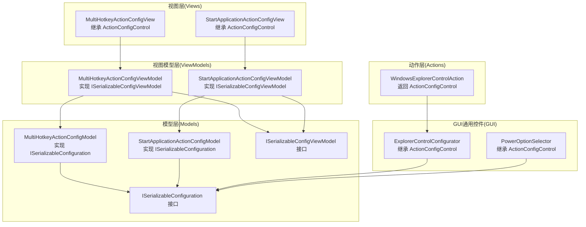
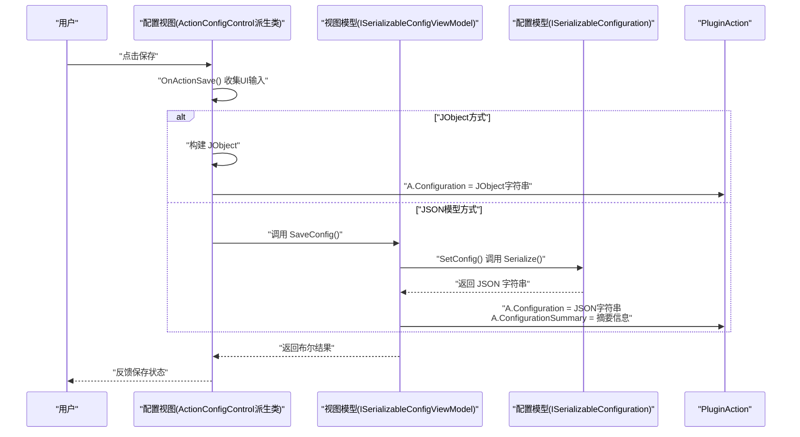
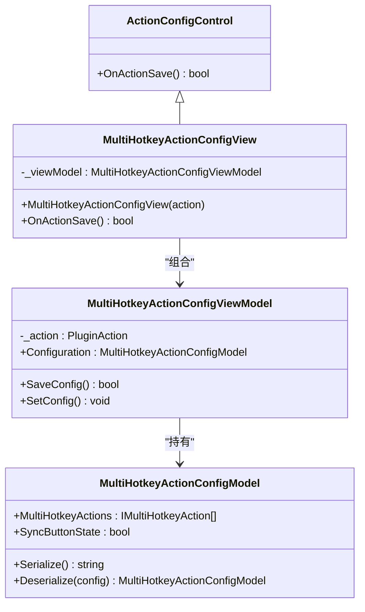
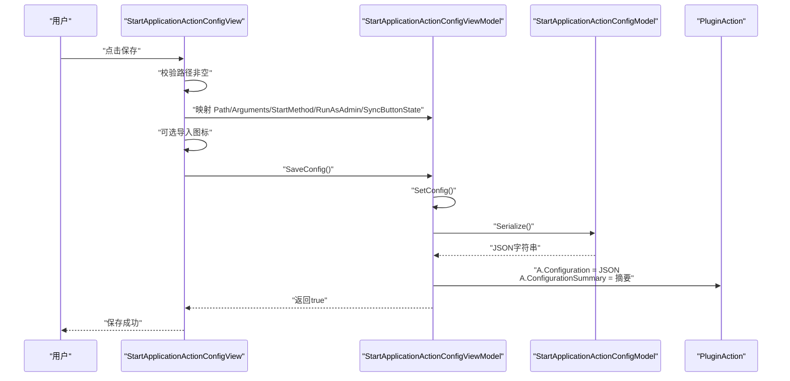
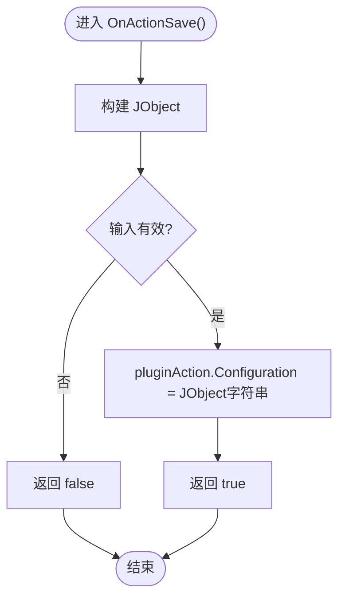
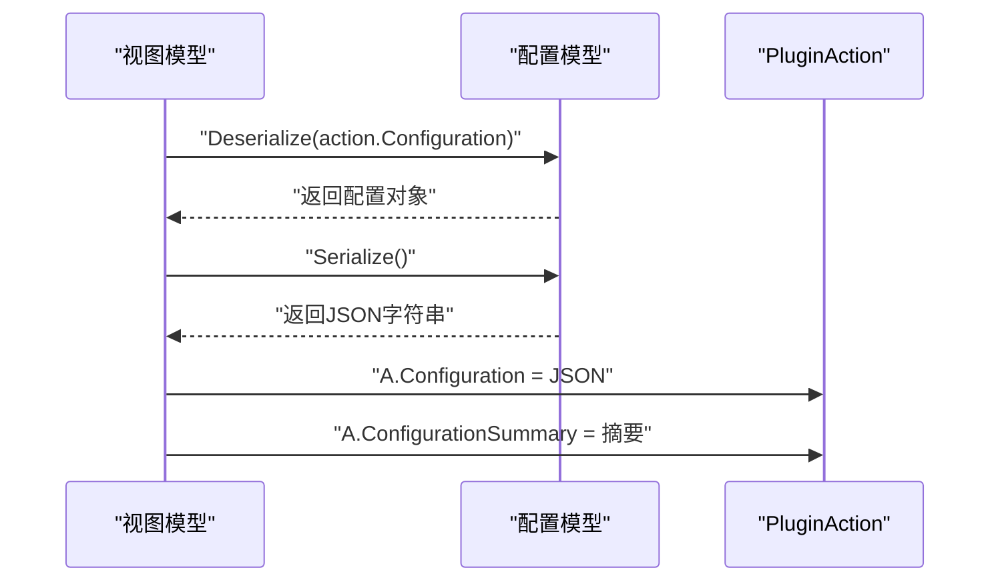
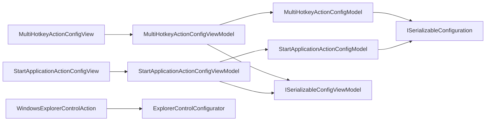

# ActionConfigControl基类使用

<cite>
**本文引用的文件**
- [Views/MultiHotkeyActionConfigView.cs](file://Views/MultiHotkeyActionConfigView.cs)
- [Views/StartApplicationActionConfigView.cs](file://Views/StartApplicationActionConfigView.cs)
- [ViewModels/MultiHotkeyActionConfigViewModel.cs](file://ViewModels/MultiHotkeyActionConfigViewModel.cs)
- [ViewModels/StartApplicationActionConfigViewModel.cs](file://ViewModels/StartApplicationActionConfigViewModel.cs)
- [ViewModels/ISerializableConfigViewModel.cs](file://ViewModels/ISerializableConfigViewModel.cs)
- [Models/ISerializableConfiguration.cs](file://Models/ISerializableConfiguration.cs)
- [Models/MultiHotkeyActionConfigModel.cs](file://Models/MultiHotkeyActionConfigModel.cs)
- [Models/StartApplicationActionConfigModel.cs](file://Models/StartApplicationActionConfigModel.cs)
- [GUI/ExplorerControlConfigurator.cs](file://GUI/ExplorerControlConfigurator.cs)
- [GUI/PowerOptionSelector.cs](file://GUI/PowerOptionSelector.cs)
- [Actions/WindowsExplorerControlAction.cs](file://Actions/WindowsExplorerControlAction.cs)
</cite>

## 目录
1. [简介](#简介)
2. [项目结构](#项目结构)
3. [核心组件](#核心组件)
4. [架构总览](#架构总览)
5. [详细组件分析](#详细组件分析)
6. [依赖关系分析](#依赖关系分析)
7. [性能考虑](#性能考虑)
8. [故障排除指南](#故障排除指南)
9. [结论](#结论)
10. [附录](#附录)

## 简介
本文件围绕ActionConfigControl基类在插件中的使用进行系统化技术说明，重点覆盖以下主题：
- ActionConfigControl基类的核心职责与继承方法（尤其是OnActionSave()）的实现要求与返回值处理
- 配置控件的标准开发流程：构造函数参数传递、初始化组件、配置加载机制
- 配置数据的序列化与反序列化：JObject的使用场景、Configuration属性的设置
- 实际控件开发示例：多热键动作与启动应用动作的配置保存与加载
- 数据验证、错误处理与用户体验优化的最佳实践

## 项目结构
该插件采用“视图-视图模型-模型”三层结构，配合ActionConfigControl基类实现配置界面与后端逻辑的解耦：
- 视图层（Views）：派生自ActionConfigControl，负责UI交互与调用视图模型保存配置
- 视图模型层（ViewModels）：实现ISerializableConfigViewModel，封装配置对象与保存逻辑
- 模型层（Models）：实现ISerializableConfiguration，提供JSON序列化/反序列化能力
- GUI通用控件（GUI）：部分控件直接继承ActionConfigControl并自行处理JObject配置
- 动作层（Actions）：通过PluginAction触发配置控件，并在运行时解析配置

图表来源
- [Views/MultiHotkeyActionConfigView.cs:8-27](file://Views/MultiHotkeyActionConfigView.cs#L8-L27)
- [Views/StartApplicationActionConfigView.cs:13-135](file://Views/StartApplicationActionConfigView.cs#L13-L135)
- [ViewModels/MultiHotkeyActionConfigViewModel.cs:9-55](file://ViewModels/MultiHotkeyActionConfigViewModel.cs#L9-L55)
- [ViewModels/StartApplicationActionConfigViewModel.cs:8-72](file://ViewModels/StartApplicationActionConfigViewModel.cs#L8-L72)
- [Models/MultiHotkeyActionConfigModel.cs:6-21](file://Models/MultiHotkeyActionConfigModel.cs#L6-L21)
- [Models/StartApplicationActionConfigModel.cs:6-27](file://Models/StartApplicationActionConfigModel.cs#L6-L27)
- [GUI/ExplorerControlConfigurator.cs:9-41](file://GUI/ExplorerControlConfigurator.cs#L9-L41)
- [GUI/PowerOptionSelector.cs:9-43](file://GUI/PowerOptionSelector.cs#L9-L43)
- [Actions/WindowsExplorerControlAction.cs:12-25](file://Actions/WindowsExplorerControlAction.cs#L12-L25)

章节来源
- [Views/MultiHotkeyActionConfigView.cs:1-28](file://Views/MultiHotkeyActionConfigView.cs#L1-L28)
- [Views/StartApplicationActionConfigView.cs:1-159](file://Views/StartApplicationActionConfigView.cs#L1-L159)
- [ViewModels/MultiHotkeyActionConfigViewModel.cs:1-56](file://ViewModels/MultiHotkeyActionConfigViewModel.cs#L1-L56)
- [ViewModels/StartApplicationActionConfigViewModel.cs:1-73](file://ViewModels/StartApplicationActionConfigViewModel.cs#L1-L73)
- [Models/MultiHotkeyActionConfigModel.cs:1-22](file://Models/MultiHotkeyActionConfigModel.cs#L1-L22)
- [Models/StartApplicationActionConfigModel.cs:1-36](file://Models/StartApplicationActionConfigModel.cs#L1-L36)
- [GUI/ExplorerControlConfigurator.cs:1-41](file://GUI/ExplorerControlConfigurator.cs#L1-L41)
- [GUI/PowerOptionSelector.cs:1-43](file://GUI/PowerOptionSelector.cs#L1-L43)
- [Actions/WindowsExplorerControlAction.cs:1-38](file://Actions/WindowsExplorerControlAction.cs#L1-L38)

## 核心组件
- ActionConfigControl基类：所有配置视图的基类，约束了OnActionSave()等生命周期方法的实现
- 视图（View）：负责UI初始化、用户输入收集、调用视图模型保存配置
- 视图模型（ViewModel）：持有配置模型，实现保存与设置配置的方法
- 配置模型（Model）：实现序列化接口，提供JSON序列化/反序列化
- 动作（Action）：通过GetActionConfigControl返回配置视图，并在运行时解析配置

章节来源
- [Views/MultiHotkeyActionConfigView.cs:8-27](file://Views/MultiHotkeyActionConfigView.cs#L8-L27)
- [Views/StartApplicationActionConfigView.cs:13-135](file://Views/StartApplicationActionConfigView.cs#L13-L135)
- [ViewModels/MultiHotkeyActionConfigViewModel.cs:9-55](file://ViewModels/MultiHotkeyActionConfigViewModel.cs#L9-L55)
- [ViewModels/StartApplicationActionConfigViewModel.cs:8-72](file://ViewModels/StartApplicationActionConfigViewModel.cs#L8-L72)
- [Models/ISerializableConfiguration.cs:5-11](file://Models/ISerializableConfiguration.cs#L5-L11)

## 架构总览
下图展示了从用户点击保存到配置写入PluginAction的完整流程，以及两种不同的配置存储方式：

图表来源
- [Views/StartApplicationActionConfigView.cs:87-135](file://Views/StartApplicationActionConfigView.cs#L87-L135)
- [Views/MultiHotkeyActionConfigView.cs:23-26](file://Views/MultiHotkeyActionConfigView.cs#L23-L26)
- [ViewModels/MultiHotkeyActionConfigViewModel.cs:36-54](file://ViewModels/MultiHotkeyActionConfigViewModel.cs#L36-L54)
- [ViewModels/StartApplicationActionConfigViewModel.cs:53-71](file://ViewModels/StartApplicationActionConfigViewModel.cs#L53-L71)
- [Models/MultiHotkeyActionConfigModel.cs:13-20](file://Models/MultiHotkeyActionConfigModel.cs#L13-L20)
- [Models/StartApplicationActionConfigModel.cs:19-26](file://Models/StartApplicationActionConfigModel.cs#L19-L26)

## 详细组件分析

### 多热键动作配置视图与视图模型
- 视图职责：构造函数接收PluginAction；OnActionSave()直接委托给视图模型的SaveConfig()
- 视图模型职责：从PluginAction.Configuration反序列化到配置模型；保存时调用SetConfig()设置摘要与JSON配置
- 配置模型：提供Serialize()与静态Deserialize()，基于System.Text.Json

图表来源
- [Views/MultiHotkeyActionConfigView.cs:8-27](file://Views/MultiHotkeyActionConfigView.cs#L8-L27)
- [ViewModels/MultiHotkeyActionConfigViewModel.cs:9-55](file://ViewModels/MultiHotkeyActionConfigViewModel.cs#L9-L55)
- [Models/MultiHotkeyActionConfigModel.cs:6-21](file://Models/MultiHotkeyActionConfigModel.cs#L6-L21)

章节来源
- [Views/MultiHotkeyActionConfigView.cs:12-26](file://Views/MultiHotkeyActionConfigView.cs#L12-L26)
- [ViewModels/MultiHotkeyActionConfigViewModel.cs:30-54](file://ViewModels/MultiHotkeyActionConfigViewModel.cs#L30-L54)
- [Models/MultiHotkeyActionConfigModel.cs:13-20](file://Models/MultiHotkeyActionConfigModel.cs#L13-L20)

### 启动应用动作配置视图与视图模型
- 视图职责：构造函数初始化UI与语言资源；OnActionSave()执行输入校验、映射枚举、可选图标导入，最终委托SaveConfig()
- 视图模型职责：从PluginAction.Configuration反序列化到配置模型；SetConfig()设置摘要与JSON配置
- 配置模型：包含路径、参数、管理员权限、同步按钮状态、启动方式等字段

图表来源
- [Views/StartApplicationActionConfigView.cs:19-135](file://Views/StartApplicationActionConfigView.cs#L19-L135)
- [ViewModels/StartApplicationActionConfigViewModel.cs:47-71](file://ViewModels/StartApplicationActionConfigViewModel.cs#L47-L71)
- [Models/StartApplicationActionConfigModel.cs:6-27](file://Models/StartApplicationActionConfigModel.cs#L6-L27)

章节来源
- [Views/StartApplicationActionConfigView.cs:19-135](file://Views/StartApplicationActionConfigView.cs#L19-L135)
- [ViewModels/StartApplicationActionConfigViewModel.cs:47-71](file://ViewModels/StartApplicationActionConfigViewModel.cs#L47-L71)
- [Models/StartApplicationActionConfigModel.cs:6-27](file://Models/StartApplicationActionConfigModel.cs#L6-L27)

### 使用JObject的配置控件示例
- ExplorerControlConfigurator：在OnActionSave()中构建JObject并赋值给PluginAction.Configuration
- PowerOptionSelector：在OnActionSave()中解析选择并赋值给PluginAction.Configuration
- 运行时解析：WindowsExplorerControlAction在Trigger中使用JObject解析配置

图表来源
- [GUI/ExplorerControlConfigurator.cs:29-41](file://GUI/ExplorerControlConfigurator.cs#L29-L41)
- [GUI/PowerOptionSelector.cs:35-43](file://GUI/PowerOptionSelector.cs#L35-L43)
- [Actions/WindowsExplorerControlAction.cs:27-38](file://Actions/WindowsExplorerControlAction.cs#L27-L38)

章节来源
- [GUI/ExplorerControlConfigurator.cs:29-41](file://GUI/ExplorerControlConfigurator.cs#L29-L41)
- [GUI/PowerOptionSelector.cs:35-43](file://GUI/PowerOptionSelector.cs#L35-L43)
- [Actions/WindowsExplorerControlAction.cs:27-38](file://Actions/WindowsExplorerControlAction.cs#L27-L38)

### 序列化与反序列化流程
- 反序列化：视图模型构造函数中调用模型的Deserialize()，若配置为空则返回新实例
- 序列化：SetConfig()调用模型Serialize()生成JSON字符串
- 配置写回：SetConfig()同时更新PluginAction.Configuration与ConfigurationSummary

图表来源
- [Models/ISerializableConfiguration.cs:9-10](file://Models/ISerializableConfiguration.cs#L9-L10)
- [ViewModels/MultiHotkeyActionConfigViewModel.cs:30-34](file://ViewModels/MultiHotkeyActionConfigViewModel.cs#L30-L34)
- [ViewModels/StartApplicationActionConfigViewModel.cs:47-51](file://ViewModels/StartApplicationActionConfigViewModel.cs#L47-L51)
- [ViewModels/MultiHotkeyActionConfigViewModel.cs:50-54](file://ViewModels/MultiHotkeyActionConfigViewModel.cs#L50-L54)
- [ViewModels/StartApplicationActionConfigViewModel.cs:67-71](file://ViewModels/StartApplicationActionConfigViewModel.cs#L67-L71)

章节来源
- [Models/ISerializableConfiguration.cs:9-10](file://Models/ISerializableConfiguration.cs#L9-L10)
- [ViewModels/MultiHotkeyActionConfigViewModel.cs:30-54](file://ViewModels/MultiHotkeyActionConfigViewModel.cs#L30-L54)
- [ViewModels/StartApplicationActionConfigViewModel.cs:47-71](file://ViewModels/StartApplicationActionConfigViewModel.cs#L47-L71)

## 依赖关系分析
- 视图与视图模型：通过组合关系耦合，视图仅暴露OnActionSave()入口
- 视图模型与模型：视图模型持有配置模型实例，实现配置的读写
- 模型与接口：配置模型实现ISerializableConfiguration，统一序列化/反序列化契约
- 动作与视图：动作通过GetActionConfigControl返回具体配置视图，运行时由动作解析配置

图表来源
- [Views/MultiHotkeyActionConfigView.cs:8-27](file://Views/MultiHotkeyActionConfigView.cs#L8-L27)
- [Views/StartApplicationActionConfigView.cs:13-135](file://Views/StartApplicationActionConfigView.cs#L13-L135)
- [ViewModels/MultiHotkeyActionConfigViewModel.cs:9-55](file://ViewModels/MultiHotkeyActionConfigViewModel.cs#L9-L55)
- [ViewModels/StartApplicationActionConfigViewModel.cs:8-72](file://ViewModels/StartApplicationActionConfigViewModel.cs#L8-L72)
- [Models/MultiHotkeyActionConfigModel.cs:6-21](file://Models/MultiHotkeyActionConfigModel.cs#L6-L21)
- [Models/StartApplicationActionConfigModel.cs:6-27](file://Models/StartApplicationActionConfigModel.cs#L6-L27)
- [Actions/WindowsExplorerControlAction.cs:22-25](file://Actions/WindowsExplorerControlAction.cs#L22-L25)

章节来源
- [Views/MultiHotkeyActionConfigView.cs:8-27](file://Views/MultiHotkeyActionConfigView.cs#L8-L27)
- [Views/StartApplicationActionConfigView.cs:13-135](file://Views/StartApplicationActionConfigView.cs#L13-L135)
- [ViewModels/MultiHotkeyActionConfigViewModel.cs:9-55](file://ViewModels/MultiHotkeyActionConfigViewModel.cs#L9-L55)
- [ViewModels/StartApplicationActionConfigViewModel.cs:8-72](file://ViewModels/StartApplicationActionConfigViewModel.cs#L8-L72)
- [Models/MultiHotkeyActionConfigModel.cs:6-21](file://Models/MultiHotkeyActionConfigModel.cs#L6-L21)
- [Models/StartApplicationActionConfigModel.cs:6-27](file://Models/StartApplicationActionConfigModel.cs#L6-L27)
- [Actions/WindowsExplorerControlAction.cs:22-25](file://Actions/WindowsExplorerControlAction.cs#L22-L25)

## 性能考虑
- 序列化成本：JSON序列化/反序列化在配置保存/加载时发生，建议避免频繁调用或在批量操作中合并保存
- UI线程阻塞：若存在耗时操作（如图标导入），应异步执行并提供进度反馈
- 配置大小：尽量精简配置字段，避免过大的JSON导致IO与内存压力

## 故障排除指南
- 保存失败返回false：当OnActionSave()返回false时，通常表示输入校验未通过或配置无效
- 日志记录：视图模型在保存过程中捕获异常并记录日志，便于定位问题
- 配置为空：反序列化接口对空配置返回新实例，确保后续逻辑稳定

章节来源
- [Views/StartApplicationActionConfigView.cs:89-92](file://Views/StartApplicationActionConfigView.cs#L89-L92)
- [ViewModels/MultiHotkeyActionConfigViewModel.cs:36-47](file://ViewModels/MultiHotkeyActionConfigViewModel.cs#L36-L47)
- [ViewModels/StartApplicationActionConfigViewModel.cs:53-64](file://ViewModels/StartApplicationActionConfigViewModel.cs#L53-L64)
- [Models/ISerializableConfiguration.cs:9-10](file://Models/ISerializableConfiguration.cs#L9-L10)

## 结论
- ActionConfigControl基类提供了统一的配置界面生命周期入口，推荐通过视图模型模式实现配置保存与加载
- 对于需要复杂结构的配置，优先使用JSON模型方式（ISerializableConfiguration），以获得强类型与可维护性
- 对于简单配置，可直接使用JObject方式，注意输入校验与错误处理
- 建议在保存前进行数据验证，在保存后及时更新摘要信息，提升用户体验

## 附录

### 开发步骤清单（标准流程）
- 继承ActionConfigControl并实现构造函数，接收PluginAction
- 在OnActionSave()中：
  - 收集UI输入并进行数据验证
  - 将输入映射到配置模型或构建JObject
  - 调用SaveConfig()或直接设置PluginAction.Configuration
- 视图模型职责：
  - 在构造函数中反序列化配置
  - 在SaveConfig()中调用SetConfig()完成序列化与摘要更新
- 最佳实践：
  - 输入校验：在OnActionSave()中尽早返回false
  - 错误处理：捕获异常并记录日志
  - 用户体验：提供即时反馈（如消息框确认、进度提示）

章节来源
- [Views/MultiHotkeyActionConfigView.cs:12-26](file://Views/MultiHotkeyActionConfigView.cs#L12-L26)
- [Views/StartApplicationActionConfigView.cs:87-135](file://Views/StartApplicationActionConfigView.cs#L87-L135)
- [ViewModels/MultiHotkeyActionConfigViewModel.cs:30-54](file://ViewModels/MultiHotkeyActionConfigViewModel.cs#L30-L54)
- [ViewModels/StartApplicationActionConfigViewModel.cs:47-71](file://ViewModels/StartApplicationActionConfigViewModel.cs#L47-L71)