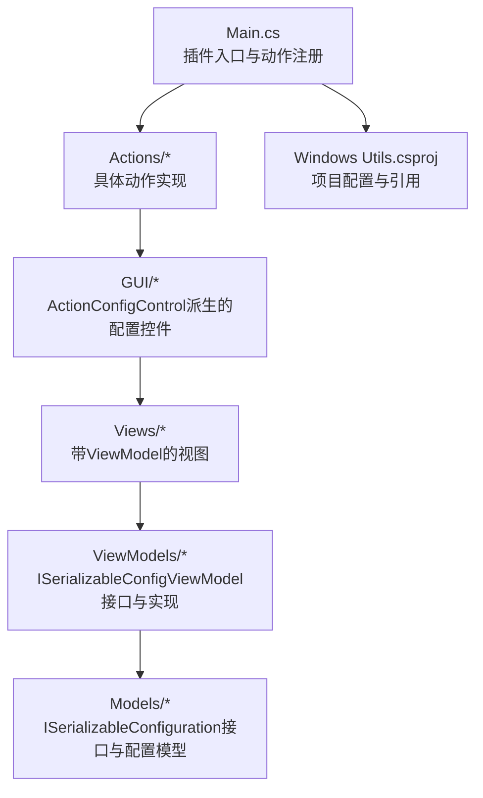
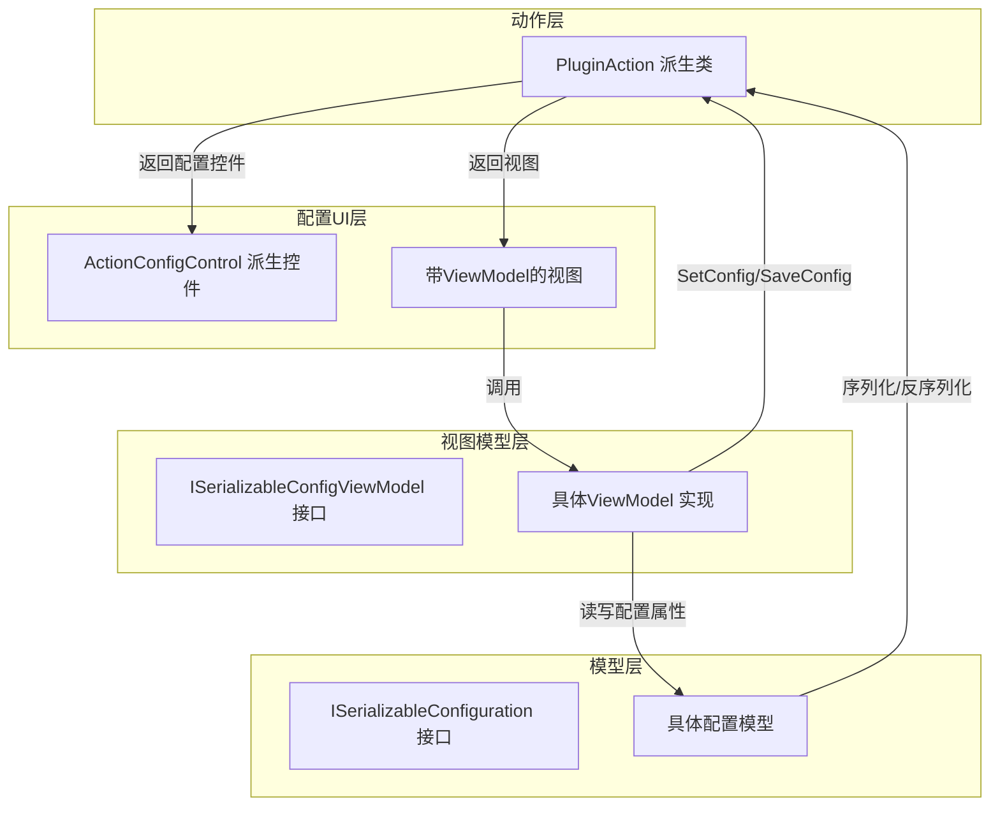
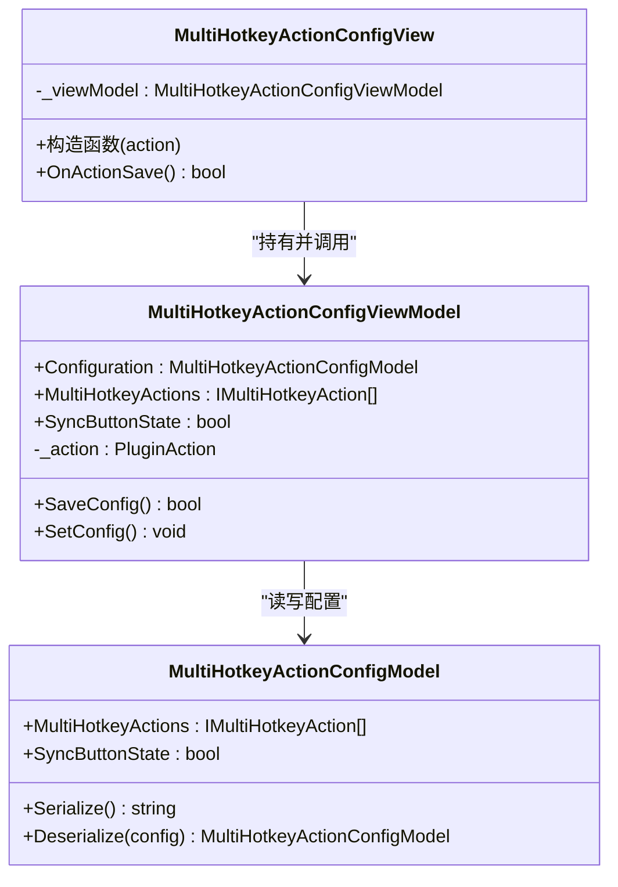
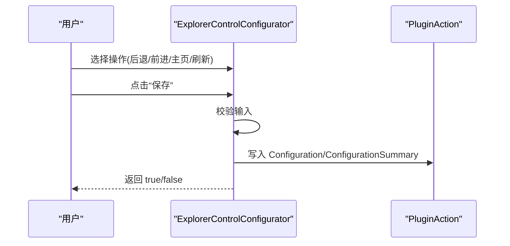
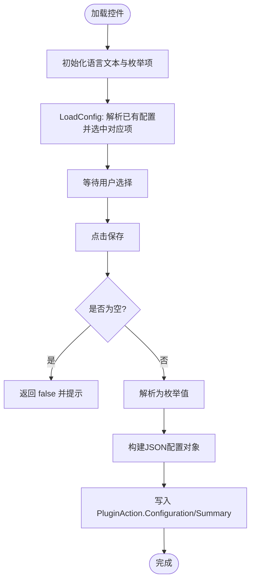
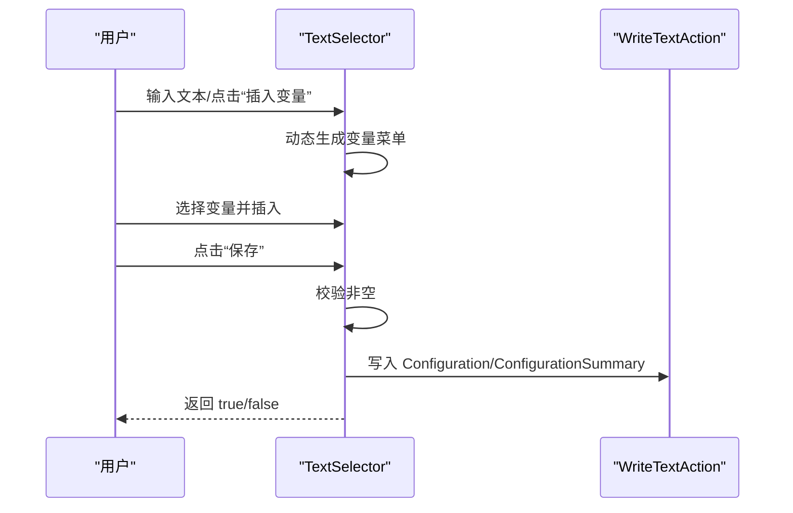
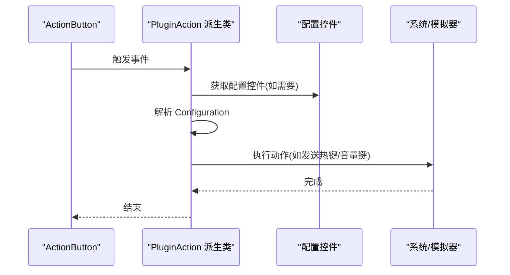
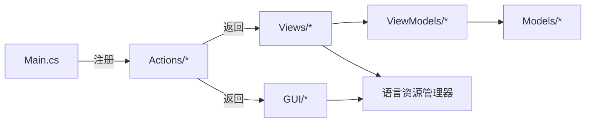

# GUI组件开发

<cite>
**本文引用的文件**
- [Main.cs](file://Main.cs)
- [Windows Utils.csproj](file://Windows Utils.csproj)
- [README.md](file://README.md)
- [Views/MultiHotkeyActionConfigView.cs](file://Views/MultiHotkeyActionConfigView.cs)
- [Views/MultiHotkeyActionConfigView.Designer.cs](file://Views/MultiHotkeyActionConfigView.Designer.cs)
- [ViewModels/ISerializableConfigViewModel.cs](file://ViewModels/ISerializableConfigViewModel.cs)
- [ViewModels/MultiHotkeyActionConfigViewModel.cs](file://ViewModels/MultiHotkeyActionConfigViewModel.cs)
- [Models/ISerializableConfiguration.cs](file://Models/ISerializableConfiguration.cs)
- [Models/MultiHotkeyActionConfigModel.cs](file://Models/MultiHotkeyActionConfigModel.cs)
- [GUI/ExplorerControlConfigurator.cs](file://GUI/ExplorerControlConfigurator.cs)
- [GUI/PowerOptionSelector.cs](file://GUI/PowerOptionSelector.cs)
- [GUI/TextSelector.cs](file://GUI/TextSelector.cs)
- [Actions/WindowsExplorerControlAction.cs](file://Actions/WindowsExplorerControlAction.cs)
- [Actions/HotkeyAction.cs](file://Actions/HotkeyAction.cs)
- [Actions/MultiHotkeyAction.cs](file://Actions/MultiHotkeyAction.cs)
- [Actions/IncreaseVolumeAction.cs](file://Actions/IncreaseVolumeAction.cs)
- [Actions/DecreaseVolumeAction.cs](file://Actions/DecreaseVolumeAction.cs)
</cite>

## 目录
1. [简介](#简介)
2. [项目结构](#项目结构)
3. [核心组件](#核心组件)
4. [架构总览](#架构总览)
5. [详细组件分析](#详细组件分析)
6. [依赖关系分析](#依赖关系分析)
7. [性能考虑](#性能考虑)
8. [故障排查指南](#故障排查指南)
9. [结论](#结论)
10. [附录：最佳实践与示例](#附录最佳实践与示例)

## 简介
本文件面向GUI组件开发者，围绕ActionConfigControl基类与自定义配置控件的开发流程展开，系统阐述MVVM模式在GUI中的应用（ViewModels设计与绑定机制）、配置视图的创建、数据绑定与状态管理，并提供数据验证、用户交互与响应式设计的最佳实践。同时给出基于仓库中现有控件的实际开发示例与常见问题解决方案。

## 项目结构
该插件采用“插件入口 + 动作(Action) + 配置控件(GUI) + 视图模型(ViewModels) + 数据模型(Models)”的分层组织方式，目标框架为 .NET 10，启用Windows Forms以适配Macro Deck 2的GUI环境。

图表来源
- [Main.cs:28-58](file://Main.cs#L28-L58)
- [Windows Utils.csproj:1-74](file://Windows Utils.csproj#L1-L74)

章节来源
- [Main.cs:14-58](file://Main.cs#L14-L58)
- [Windows Utils.csproj:1-74](file://Windows Utils.csproj#L1-L74)
- [README.md:1-40](file://README.md#L1-L40)

## 核心组件
- ActionConfigControl基类：所有配置控件均继承自该基类，负责承载配置UI、处理保存逻辑（OnActionSave）以及与PluginAction的配置数据交换。
- ViewModel层：通过ISerializableConfigViewModel接口统一配置设置(SetConfig)与保存(SaveConfig)流程；具体ViewModel持有配置模型并负责日志记录与异常处理。
- Model层：ISerializableConfiguration接口提供序列化/反序列化能力；具体配置模型封装业务配置项。
- Views：部分复杂配置采用“视图+ViewModel”的MVVM组合，简化UI与业务逻辑分离。
- Actions：动作类负责触发执行逻辑，并通过GetActionConfigControl返回对应的配置控件。

章节来源
- [Views/MultiHotkeyActionConfigView.cs:8-27](file://Views/MultiHotkeyActionConfigView.cs#L8-L27)
- [ViewModels/ISerializableConfigViewModel.cs:5-12](file://ViewModels/ISerializableConfigViewModel.cs#L5-L12)
- [ViewModels/MultiHotkeyActionConfigViewModel.cs:9-56](file://ViewModels/MultiHotkeyActionConfigViewModel.cs#L9-L56)
- [Models/ISerializableConfiguration.cs:5-12](file://Models/ISerializableConfiguration.cs#L5-L12)
- [Models/MultiHotkeyActionConfigModel.cs:6-22](file://Models/MultiHotkeyActionConfigModel.cs#L6-L22)

## 架构总览
下图展示了从动作到配置控件、再到ViewModel与Model的数据流与职责边界。

图表来源
- [Actions/WindowsExplorerControlAction.cs:22-25](file://Actions/WindowsExplorerControlAction.cs#L22-L25)
- [Views/MultiHotkeyActionConfigView.cs:12-26](file://Views/MultiHotkeyActionConfigView.cs#L12-L26)
- [ViewModels/MultiHotkeyActionConfigViewModel.cs:30-54](file://ViewModels/MultiHotkeyActionConfigViewModel.cs#L30-L54)
- [Models/MultiHotkeyActionConfigModel.cs:13-20](file://Models/MultiHotkeyActionConfigModel.cs#L13-L20)

## 详细组件分析

### 组件一：多热键配置视图（MVVM）
该组件采用“视图+ViewModel”的MVVM模式，视图负责UI呈现，ViewModel负责配置读取、设置与保存。

图表来源
- [Views/MultiHotkeyActionConfigView.cs:8-27](file://Views/MultiHotkeyActionConfigView.cs#L8-L27)
- [ViewModels/MultiHotkeyActionConfigViewModel.cs:9-56](file://ViewModels/MultiHotkeyActionConfigViewModel.cs#L9-L56)
- [Models/MultiHotkeyActionConfigModel.cs:6-22](file://Models/MultiHotkeyActionConfigModel.cs#L6-L22)

图表来源
- [Views/MultiHotkeyActionConfigView.cs:23-26](file://Views/MultiHotkeyActionConfigView.cs#L23-L26)
- [ViewModels/MultiHotkeyActionConfigViewModel.cs:36-54](file://ViewModels/MultiHotkeyActionConfigViewModel.cs#L36-L54)

章节来源
- [Views/MultiHotkeyActionConfigView.cs:8-27](file://Views/MultiHotkeyActionConfigView.cs#L8-L27)
- [Views/MultiHotkeyActionConfigView.Designer.cs:30-40](file://Views/MultiHotkeyActionConfigView.Designer.cs#L30-L40)
- [ViewModels/MultiHotkeyActionConfigViewModel.cs:9-56](file://ViewModels/MultiHotkeyActionConfigViewModel.cs#L9-L56)
- [Models/MultiHotkeyActionConfigModel.cs:6-22](file://Models/MultiHotkeyActionConfigModel.cs#L6-L22)

### 组件二：浏览器控制配置控件（传统模式）
该控件直接继承ActionConfigControl，集中处理配置读取、保存与校验。

图表来源
- [GUI/ExplorerControlConfigurator.cs:29-51](file://GUI/ExplorerControlConfigurator.cs#L29-L51)
- [Actions/WindowsExplorerControlAction.cs:22-25](file://Actions/WindowsExplorerControlAction.cs#L22-L25)

章节来源
- [GUI/ExplorerControlConfigurator.cs:9-82](file://GUI/ExplorerControlConfigurator.cs#L9-L82)
- [Actions/WindowsExplorerControlAction.cs:12-38](file://Actions/WindowsExplorerControlAction.cs#L12-L38)

### 组件三：电源选项选择器（枚举绑定）
该控件通过动态填充枚举值实现配置选择，并在保存时进行校验与序列化。

图表来源
- [GUI/PowerOptionSelector.cs:15-66](file://GUI/PowerOptionSelector.cs#L15-L66)

章节来源
- [GUI/PowerOptionSelector.cs:9-75](file://GUI/PowerOptionSelector.cs#L9-L75)

### 组件四：文本输入选择器（变量插入）
该控件支持占位符文本与变量插入功能，保存时进行非空校验与摘要截断。

图表来源
- [GUI/TextSelector.cs:25-41](file://GUI/TextSelector.cs#L25-L41)
- [GUI/TextSelector.cs:53-76](file://GUI/TextSelector.cs#L53-L76)

章节来源
- [GUI/TextSelector.cs:11-77](file://GUI/TextSelector.cs#L11-L77)

### 组件五：动作触发与配置联动
动作类通过GetActionConfigControl返回配置控件，并在Trigger中读取配置执行相应操作。

图表来源
- [Actions/HotkeyAction.cs:24-38](file://Actions/HotkeyAction.cs#L24-L38)
- [Actions/IncreaseVolumeAction.cs:14-17](file://Actions/IncreaseVolumeAction.cs#L14-L17)
- [Actions/DecreaseVolumeAction.cs:14-17](file://Actions/DecreaseVolumeAction.cs#L14-L17)
- [Actions/MultiHotkeyAction.cs:23-48](file://Actions/MultiHotkeyAction.cs#L23-L48)

章节来源
- [Actions/HotkeyAction.cs:15-38](file://Actions/HotkeyAction.cs#L15-L38)
- [Actions/IncreaseVolumeAction.cs:8-18](file://Actions/IncreaseVolumeAction.cs#L8-L18)
- [Actions/DecreaseVolumeAction.cs:8-18](file://Actions/DecreaseVolumeAction.cs#L8-L18)
- [Actions/MultiHotkeyAction.cs:11-56](file://Actions/MultiHotkeyAction.cs#L11-L56)

## 依赖关系分析
- 插件入口Main.cs注册所有动作，形成“动作集合”。
- 动作类通过GetActionConfigControl返回对应的配置控件，建立“动作-配置控件”映射。
- MVVM视图通过ViewModel访问Model，ViewModel依赖ISerializableConfiguration接口实现序列化/反序列化。
- GUI控件直接或间接依赖语言资源管理器进行本地化文本显示。

图表来源
- [Main.cs:31-50](file://Main.cs#L31-L50)
- [Actions/WindowsExplorerControlAction.cs:22-25](file://Actions/WindowsExplorerControlAction.cs#L22-L25)
- [Views/MultiHotkeyActionConfigView.cs:12-16](file://Views/MultiHotkeyActionConfigView.cs#L12-L16)
- [ViewModels/MultiHotkeyActionConfigViewModel.cs:30-34](file://ViewModels/MultiHotkeyActionConfigViewModel.cs#L30-L34)
- [Models/MultiHotkeyActionConfigModel.cs:17-20](file://Models/MultiHotkeyActionConfigModel.cs#L17-L20)

章节来源
- [Main.cs:28-58](file://Main.cs#L28-L58)
- [Windows Utils.csproj:42-47](file://Windows Utils.csproj#L42-L47)

## 性能考虑
- 异步执行：多热键动作在独立线程中执行，避免阻塞UI线程；注意在同步按钮状态时及时重置状态。
- 序列化开销：配置模型使用JSON序列化，建议保持配置字段精简，避免频繁大对象序列化。
- UI更新：ViewModel在保存时仅更新必要的摘要信息，减少不必要的UI刷新。
- 计时器：插件主类启动定时器用于周期性任务，需合理设置间隔，避免占用过多CPU。

章节来源
- [Actions/MultiHotkeyAction.cs:31-47](file://Actions/MultiHotkeyAction.cs#L31-L47)
- [Main.cs:52-57](file://Main.cs#L52-L57)

## 故障排查指南
- 保存失败
  - 现象：OnActionSave返回false。
  - 原因：控件未通过输入校验（如文本为空、未选择枚举项）。
  - 处理：在控件中增加必填字段校验与提示，确保返回true后再提交。
  - 参考路径：[GUI/PowerOptionSelector.cs:37-40](file://GUI/PowerOptionSelector.cs#L37-L40)、[GUI/TextSelector.cs:27-30](file://GUI/TextSelector.cs#L27-L30)
- 配置丢失或异常
  - 现象：配置无法正确读取或反序列化。
  - 原因：配置字符串为空或格式不正确。
  - 处理：在ViewModel的SaveConfig中捕获异常并记录日志；在LoadConfig中进行容错处理。
  - 参考路径：[ViewModels/MultiHotkeyActionConfigViewModel.cs:36-48](file://ViewModels/MultiHotkeyActionConfigViewModel.cs#L36-L48)、[GUI/PowerOptionSelector.cs:55-66](file://GUI/PowerOptionSelector.cs#L55-L66)
- UI不更新
  - 现象：更改配置后界面未反映最新值。
  - 原因：未正确调用LoadConfig或未更新控件绑定。
  - 处理：在控件构造函数中调用LoadConfig；确保ViewModel.SetConfig更新摘要。
  - 参考路径：[GUI/ExplorerControlConfigurator.cs:14-27](file://GUI/ExplorerControlConfigurator.cs#L14-L27)、[ViewModels/MultiHotkeyActionConfigViewModel.cs:50-54](file://ViewModels/MultiHotkeyActionConfigViewModel.cs#L50-L54)

章节来源
- [GUI/PowerOptionSelector.cs:35-66](file://GUI/PowerOptionSelector.cs#L35-L66)
- [GUI/TextSelector.cs:25-41](file://GUI/TextSelector.cs#L25-L41)
- [ViewModels/MultiHotkeyActionConfigViewModel.cs:36-54](file://ViewModels/MultiHotkeyActionConfigViewModel.cs#L36-L54)
- [GUI/ExplorerControlConfigurator.cs:54-78](file://GUI/ExplorerControlConfigurator.cs#L54-L78)

## 结论
本项目通过ActionConfigControl基类统一了配置控件的生命周期与保存机制，结合MVVM模式实现了清晰的职责分离。ViewModel层承担配置读取、设置与保存，Model层提供可序列化的配置结构，GUI层专注于用户交互与本地化。遵循本文的最佳实践与排障建议，可高效开发稳定可靠的GUI组件。

## 附录：最佳实践与示例

### 最佳实践
- 数据验证
  - 在OnActionSave中进行必填字段与格式校验，失败时返回false并提示用户。
  - 对于枚举/列表等离散值，先解析再赋值，避免类型不匹配。
- 用户交互
  - 使用占位符文本提升输入体验；提供上下文菜单快速插入变量。
  - 控件初始化时调用LoadConfig，确保默认值正确显示。
- 响应式设计
  - 尽量使用异步执行长耗时操作，避免阻塞UI。
  - 在ViewModel中集中处理配置摘要生成，减少UI层负担。
- 状态管理
  - 对于需要同步按钮状态的动作，在执行前切换状态并在完成后恢复。
  - 使用Try/Catch包裹配置保存逻辑，记录错误日志便于排障。

### 开发流程示例（以“文本输入选择器”为例）
- 步骤1：创建控件类，继承ActionConfigControl，构造函数接收PluginAction并初始化UI与语言资源。
- 步骤2：实现OnActionSave：校验输入、构建JSON配置对象、写入PluginAction.Configuration与ConfigurationSummary。
- 步骤3：实现LoadConfig：解析已有配置并回填到控件。
- 步骤4：在动作类的GetActionConfigControl中返回该控件实例。

章节来源
- [GUI/TextSelector.cs:14-51](file://GUI/TextSelector.cs#L14-L51)
- [Actions/WindowsExplorerControlAction.cs:22-25](file://Actions/WindowsExplorerControlAction.cs#L22-L25)