# GUI组件开发

<cite>
**本文引用的文件**
- [Main.cs](file://Main.cs)
- [Windows Utils.csproj](file://Windows Utils.csproj)
- [README.md](file://README.md)
- [Views/MultiHotkeyActionConfigView.cs](file://Views/MultiHotkeyActionConfigView.cs)
- [Views/MultiHotkeyActionConfigView.Designer.cs](file://Views/MultiHotkeyActionConfigView.Designer.cs)
- [Views/StartApplicationActionConfigView.cs](file://Views/StartApplicationActionConfigView.cs)
- [ViewModels/ISerializableConfigViewModel.cs](file://ViewModels/ISerializableConfigViewModel.cs)
- [ViewModels/MultiHotkeyActionConfigViewModel.cs](file://ViewModels/MultiHotkeyActionConfigViewModel.cs)
- [ViewModels/StartApplicationActionConfigViewModel.cs](file://ViewModels/StartApplicationActionConfigViewModel.cs)
- [Models/ISerializableConfiguration.cs](file://Models/ISerializableConfiguration.cs)
- [Models/MultiHotkeyActionConfigModel.cs](file://Models/MultiHotkeyActionConfigModel.cs)
- [Models/StartApplicationActionConfigModel.cs](file://Models/StartApplicationActionConfigModel.cs)
- [GUI/ExplorerControlConfigurator.cs](file://GUI/ExplorerControlConfigurator.cs)
- [GUI/PowerOptionSelector.cs](file://GUI/PowerOptionSelector.cs)
- [GUI/TextSelector.cs](file://GUI/TextSelector.cs)
- [GUI/FileFolderSelector.cs](file://GUI/FileFolderSelector.cs)
- [GUI/CommandSelector.cs](file://GUI/CommandSelector.cs)
- [GUI/HotkeyConfigurator.cs](file://GUI/HotkeyConfigurator.cs)
- [GUI/IconPackSelector.cs](file://GUI/IconPackSelector.cs)
- [GUI/NotificationConfigurator.cs](file://GUI/NotificationConfigurator.cs)
- [GUI/WindowSwitchConfigurator.cs](file://GUI/WindowSwitchConfigurator.cs)
- [Utils/FontHelper.cs](file://Utils/FontHelper.cs)
- [Actions/WindowsExplorerControlAction.cs](file://Actions/WindowsExplorerControlAction.cs)
- [Actions/HotkeyAction.cs](file://Actions/HotkeyAction.cs)
- [Actions/MultiHotkeyAction.cs](file://Actions/MultiHotkeyAction.cs)
- [Actions/IncreaseVolumeAction.cs](file://Actions/IncreaseVolumeAction.cs)
- [Actions/DecreaseVolumeAction.cs](file://Actions/DecreaseVolumeAction.cs)
- [Actions/CommandlineAction.cs](file://Actions/CommandlineAction.cs)
- [Actions/PowerOptionAction.cs](file://Actions/PowerOptionAction.cs)
- [Actions/WriteTextAction.cs](file://Actions/WriteTextAction.cs)
- [Actions/NotificationAction.cs](file://Actions/NotificationAction.cs)
- [Actions/WindowSwitchAction.cs](file://Actions/WindowSwitchAction.cs)
</cite>

## 更新摘要
**所做更改**
- 新增字体系统集成章节，详细介绍FontHelper类的字体应用机制
- 更新所有GUI组件分析，突出字体一致性的改进
- 添加字体系统在MVVM视图中的应用说明
- 增强字体配置的错误处理和兼容性说明

## 目录
1. [简介](#简介)
2. [项目结构](#项目结构)
3. [核心组件](#核心组件)
4. [架构总览](#架构总览)
5. [字体系统集成](#字体系统集成)
6. [详细组件分析](#详细组件分析)
7. [依赖关系分析](#依赖关系分析)
8. [性能考虑](#性能考虑)
9. [故障排查指南](#故障排查指南)
10. [结论](#结论)
11. [附录：最佳实践与示例](#附录最佳实践与示例)

## 简介
本文件面向GUI组件开发者，围绕ActionConfigControl基类与自定义配置控件的开发流程展开，系统阐述MVVM模式在GUI中的应用（ViewModels设计与绑定机制）、配置视图的创建、数据绑定与状态管理，并提供数据验证、用户交互与响应式设计的最佳实践。同时给出基于仓库中现有控件的实际开发示例与常见问题解决方案。

**更新** 新增CommandSelector、HotkeyConfigurator、PowerOptionSelector等GUI组件的详细分析，增强FileFolderSelector和TextSelector功能说明。重点介绍字体系统集成改进，所有GUI组件现已统一应用Macro Deck字体配置，确保视觉一致性。

## 项目结构
该插件采用"插件入口 + 动作(Action) + 配置控件(GUI) + 视图模型(ViewModels) + 数据模型(Models)"的分层组织方式，目标框架为 .NET 10，启用Windows Forms以适配Macro Deck 2的GUI环境。

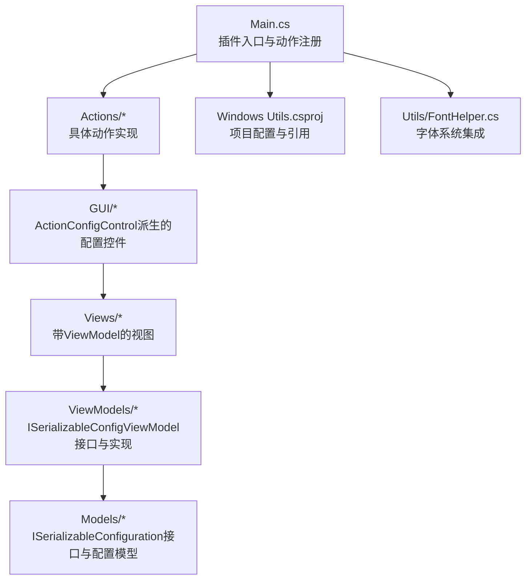

**图表来源**
- [Main.cs:28-58](file://Main.cs#L28-L58)
- [Windows Utils.csproj:1-74](file://Windows Utils.csproj#L1-L74)
- [Utils/FontHelper.cs:10-37](file://Utils/FontHelper.cs#L10-L37)

**章节来源**
- [Main.cs:14-58](file://Main.cs#L14-L58)
- [Windows Utils.csproj:1-74](file://Windows Utils.csproj#L1-L74)
- [README.md:1-40](file://README.md#L1-L40)

## 核心组件
- ActionConfigControl基类：所有配置控件均继承自该基类，负责承载配置UI、处理保存逻辑（OnActionSave）以及与PluginAction的配置数据交换。
- ViewModel层：通过ISerializableConfigViewModel接口统一配置设置(SetConfig)与保存(SaveConfig)流程；具体ViewModel持有配置模型并负责日志记录与异常处理。
- Model层：ISerializableConfiguration接口提供序列化/反序列化能力；具体配置模型封装业务配置项。
- Views：部分复杂配置采用"视图+ViewModel"的MVVM组合，简化UI与业务逻辑分离。
- Actions：动作类负责触发执行逻辑，并通过GetActionConfigControl返回对应的配置控件。
- **字体系统**：FontHelper类提供统一字体应用机制，确保所有GUI组件使用一致的字体配置。

**章节来源**
- [Views/MultiHotkeyActionConfigView.cs:8-27](file://Views/MultiHotkeyActionConfigView.cs#L8-L27)
- [ViewModels/ISerializableConfigViewModel.cs:5-12](file://ViewModels/ISerializableConfigViewModel.cs#L5-L12)
- [ViewModels/MultiHotkeyActionConfigViewModel.cs:9-56](file://ViewModels/MultiHotkeyActionConfigViewModel.cs#L9-L56)
- [Models/ISerializableConfiguration.cs:5-12](file://Models/ISerializableConfiguration.cs#L5-L12)
- [Models/MultiHotkeyActionConfigModel.cs:6-22](file://Models/MultiHotkeyActionConfigModel.cs#L6-L22)
- [Utils/FontHelper.cs:16-37](file://Utils/FontHelper.cs#L16-L37)

## 架构总览
下图展示了从动作到配置控件、再到ViewModel与Model的数据流与职责边界，包括新增的字体系统集成层。

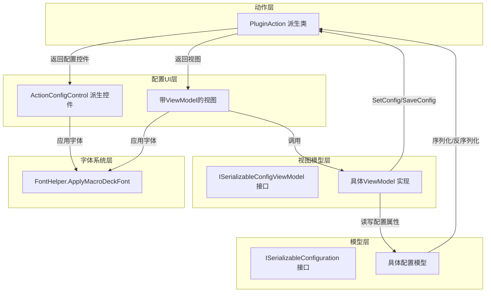

**图表来源**
- [Actions/WindowsExplorerControlAction.cs:22-25](file://Actions/WindowsExplorerControlAction.cs#L22-L25)
- [Views/MultiHotkeyActionConfigView.cs:12-26](file://Views/MultiHotkeyActionConfigView.cs#L12-L26)
- [Views/StartApplicationActionConfigView.cs:28-31](file://Views/StartApplicationActionConfigView.cs#L28-L31)
- [Utils/FontHelper.cs:16-29](file://Utils/FontHelper.cs#L16-L29)
- [ViewModels/MultiHotkeyActionConfigViewModel.cs:30-54](file://ViewModels/MultiHotkeyActionConfigViewModel.cs#L30-L54)
- [Models/MultiHotkeyActionConfigModel.cs:13-20](file://Models/MultiHotkeyActionConfigModel.cs#L13-L20)

## 字体系统集成

### FontHelper类概述
FontHelper是一个静态工具类，提供统一的字体应用机制，确保所有GUI组件使用一致的Macro Deck字体配置。

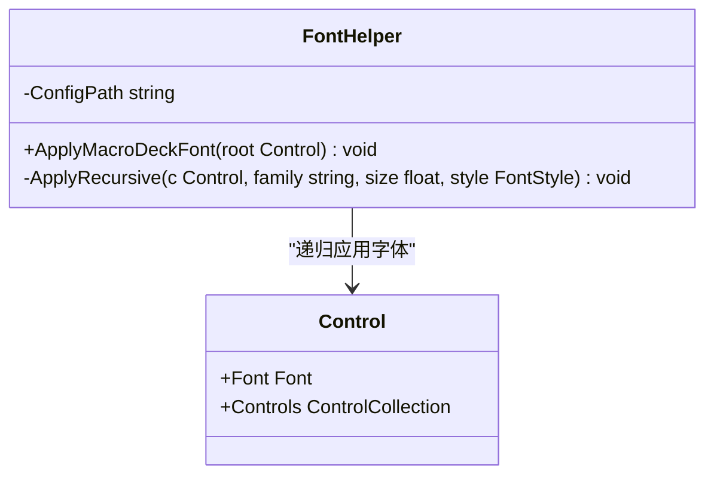

**图表来源**
- [Utils/FontHelper.cs:10-37](file://Utils/FontHelper.cs#L10-L37)

### 字体配置来源
字体配置从Macro Deck的配置文件中读取，支持以下配置项：
- Font：字体族名称（默认使用系统默认字体）
- Font.Size：字体大小（默认使用系统默认字体大小）
- Font.Bold：是否粗体（默认false）

### 字体应用机制
字体系统采用递归应用策略，确保所有子控件都使用相同的字体配置：

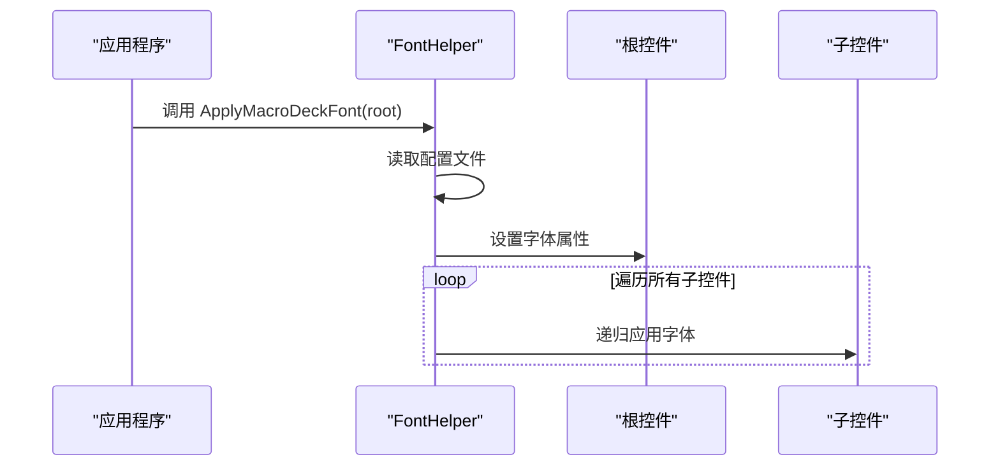

**图表来源**
- [Utils/FontHelper.cs:16-36](file://Utils/FontHelper.cs#L16-L36)

### 错误处理与兼容性
字体系统具备完善的错误处理机制：
- 设计时模式检测：避免在设计器中执行字体应用
- 配置文件异常处理：文件不存在或格式错误时使用系统默认字体
- 递归应用的安全性：确保不会因为单个控件异常影响整体应用

**章节来源**
- [Utils/FontHelper.cs:16-37](file://Utils/FontHelper.cs#L16-L37)

## 详细组件分析

### 组件一：多热键配置视图（MVVM + 字体集成）
该组件采用"视图+ViewModel"的MVVM模式，视图负责UI呈现，ViewModel负责配置读取、设置与保存，并集成了字体系统。

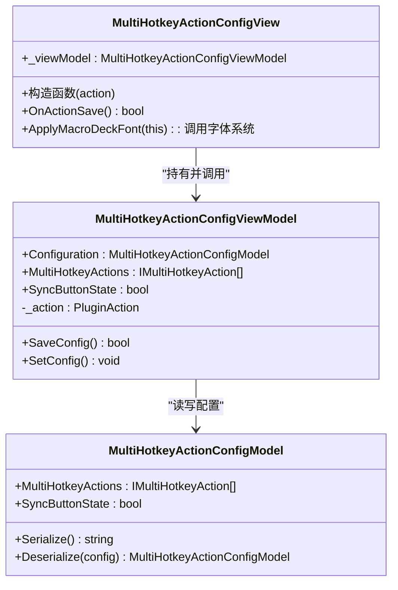

**图表来源**
- [Views/MultiHotkeyActionConfigView.cs:8-27](file://Views/MultiHotkeyActionConfigView.cs#L8-L27)
- [Views/MultiHotkeyActionConfigView.cs:22-24](file://Views/MultiHotkeyActionConfigView.cs#L22-L24)
- [ViewModels/MultiHotkeyActionConfigViewModel.cs:9-56](file://ViewModels/MultiHotkeyActionConfigViewModel.cs#L9-L56)
- [Models/MultiHotkeyActionConfigModel.cs:6-22](file://Models/MultiHotkeyActionConfigModel.cs#L6-L22)

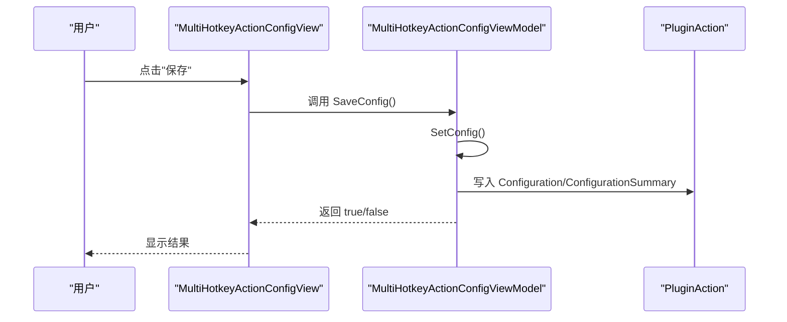

**图表来源**
- [Views/MultiHotkeyActionConfigView.cs:23-26](file://Views/MultiHotkeyActionConfigView.cs#L23-L26)
- [ViewModels/MultiHotkeyActionConfigViewModel.cs:36-54](file://ViewModels/MultiHotkeyActionConfigViewModel.cs#L36-L54)

**章节来源**
- [Views/MultiHotkeyActionConfigView.cs:8-27](file://Views/MultiHotkeyActionConfigView.cs#L8-L27)
- [Views/MultiHotkeyActionConfigView.Designer.cs:30-40](file://Views/MultiHotkeyActionConfigView.Designer.cs#L30-L40)
- [ViewModels/MultiHotkeyActionConfigViewModel.cs:9-56](file://ViewModels/MultiHotkeyActionConfigViewModel.cs#L9-L56)
- [Models/MultiHotkeyActionConfigModel.cs:6-22](file://Models/MultiHotkeyActionConfigModel.cs#L6-L22)

### 组件二：浏览器控制配置控件（传统模式 + 字体集成）
该控件直接继承ActionConfigControl，集中处理配置读取、保存与校验，并集成了字体系统。

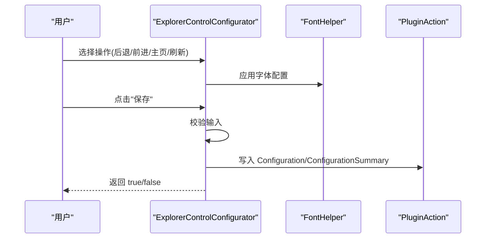

**图表来源**
- [GUI/ExplorerControlConfigurator.cs:26-27](file://GUI/ExplorerControlConfigurator.cs#L26-L27)
- [GUI/ExplorerControlConfigurator.cs:29-51](file://GUI/ExplorerControlConfigurator.cs#L29-L51)
- [Actions/WindowsExplorerControlAction.cs:22-25](file://Actions/WindowsExplorerControlAction.cs#L22-L25)

**章节来源**
- [GUI/ExplorerControlConfigurator.cs:9-100](file://GUI/ExplorerControlConfigurator.cs#L9-L100)
- [Actions/WindowsExplorerControlAction.cs:12-38](file://Actions/WindowsExplorerControlAction.cs#L12-L38)

### 组件三：电源选项选择器（枚举绑定 + 字体集成）
该控件通过动态填充枚举值实现配置选择，并在保存时进行校验与序列化，集成了字体系统。

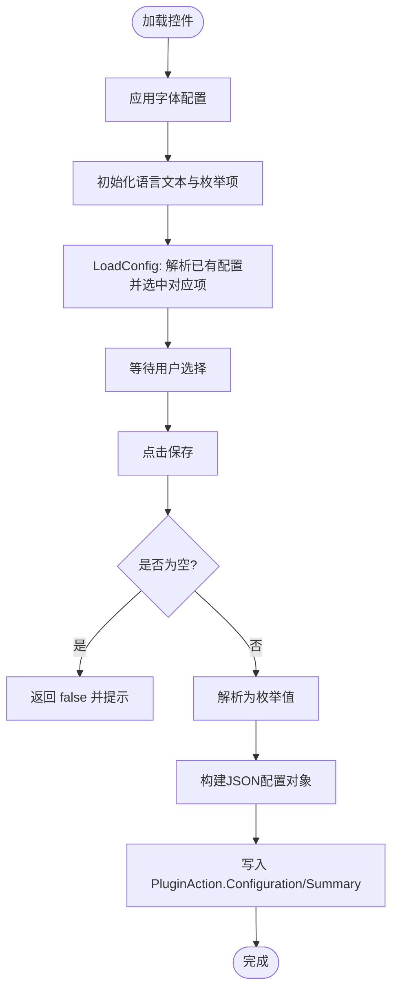

**图表来源**
- [GUI/PowerOptionSelector.cs:26-41](file://GUI/PowerOptionSelector.cs#L26-L41)
- [GUI/PowerOptionSelector.cs:47-63](file://GUI/PowerOptionSelector.cs#L47-L63)

**章节来源**
- [GUI/PowerOptionSelector.cs:9-99](file://GUI/PowerOptionSelector.cs#L9-L99)

### 组件四：文本输入选择器（变量插入 + 字体集成）
该控件支持占位符文本与变量插入功能，保存时进行非空校验与摘要截断，集成了字体系统。

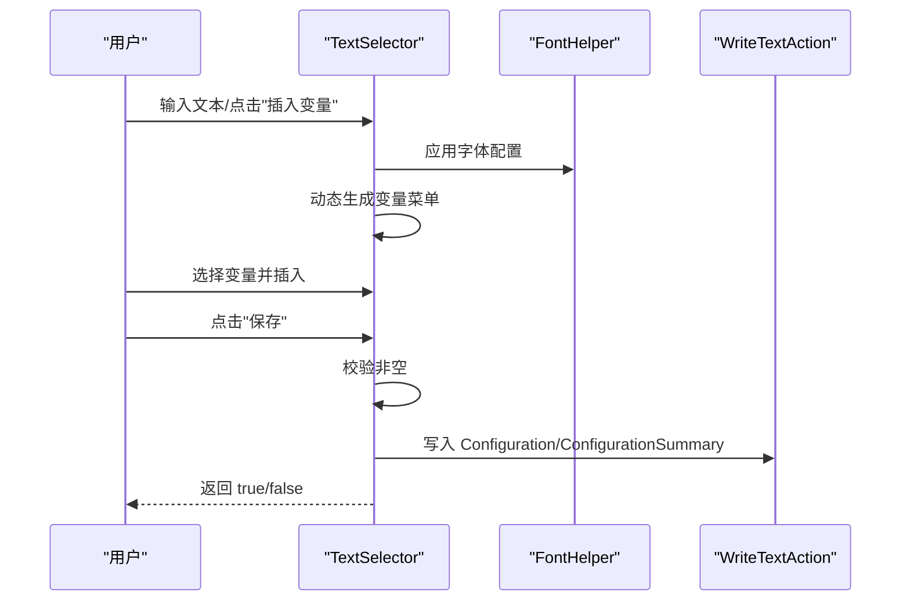

**图表来源**
- [GUI/TextSelector.cs:25-26](file://GUI/TextSelector.cs#L25-L26)
- [GUI/TextSelector.cs:27-30](file://GUI/TextSelector.cs#L27-L30)
- [GUI/TextSelector.cs:53-76](file://GUI/TextSelector.cs#L53-L76)

**章节来源**
- [GUI/TextSelector.cs:11-106](file://GUI/TextSelector.cs#L11-L106)

### 组件五：命令行执行器（增强功能 + 字体集成）
新增的CommandSelector组件提供完整的命令行执行配置界面，支持工作目录、输出变量保存等功能，集成了字体系统。

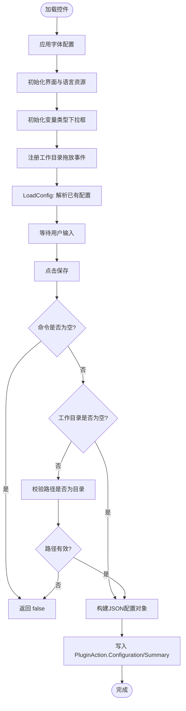

**图表来源**
- [GUI/CommandSelector.cs:28-29](file://GUI/CommandSelector.cs#L28-L29)
- [GUI/CommandSelector.cs:60-99](file://GUI/CommandSelector.cs#L60-L99)
- [GUI/CommandSelector.cs:133-150](file://GUI/CommandSelector.cs#L133-L150)

**章节来源**
- [GUI/CommandSelector.cs:15-189](file://GUI/CommandSelector.cs#L15-L189)

### 组件六：热键配置器（修饰键组合 + 字体集成）
HotkeyConfigurator提供完整的热键配置界面，支持多种修饰键组合和主键选择，集成了字体系统。

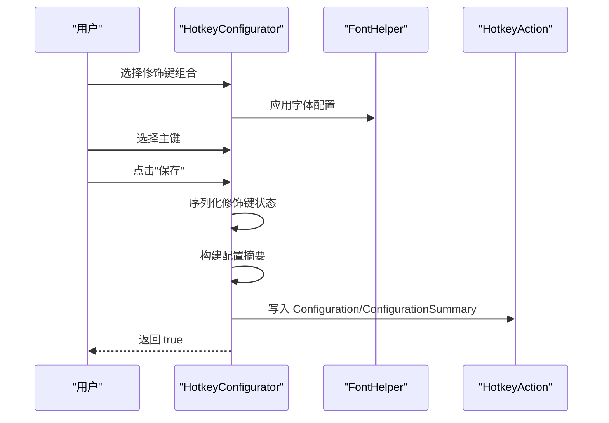

**图表来源**
- [GUI/HotkeyConfigurator.cs:26-27](file://GUI/HotkeyConfigurator.cs#L26-L27)
- [GUI/HotkeyConfigurator.cs:35-67](file://GUI/HotkeyConfigurator.cs#L35-L67)
- [Actions/HotkeyAction.cs:42-131](file://Actions/HotkeyAction.cs#L42-L131)

**章节来源**
- [GUI/HotkeyConfigurator.cs:15-103](file://GUI/HotkeyConfigurator.cs#L15-L103)

### 组件七：文件/文件夹选择器（增强拖放功能 + 字体集成）
FileFolderSelector支持拖放操作和路径类型验证，提供更友好的用户交互体验，集成了字体系统。

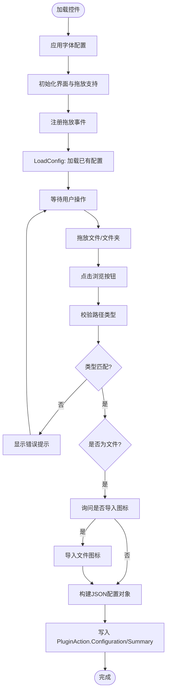

**图表来源**
- [GUI/FileFolderSelector.cs:35-36](file://GUI/FileFolderSelector.cs#L35-L36)
- [GUI/FileFolderSelector.cs:86-141](file://GUI/FileFolderSelector.cs#L86-L141)

**章节来源**
- [GUI/FileFolderSelector.cs:17-225](file://GUI/FileFolderSelector.cs#L17-L225)

### 组件八：图标包选择器（字体集成）
IconPackSelector提供图标包选择功能，集成了字体系统以确保界面一致性。

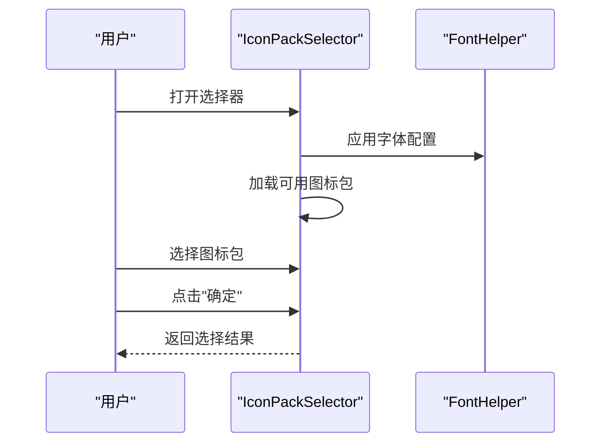

**图表来源**
- [GUI/IconPackSelector.cs:32-33](file://GUI/IconPackSelector.cs#L32-L33)

**章节来源**
- [GUI/IconPackSelector.cs:1-60](file://GUI/IconPackSelector.cs#L1-L60)

### 组件九：通知配置器（字体集成）
NotificationConfigurator提供通知配置界面，集成了字体系统。

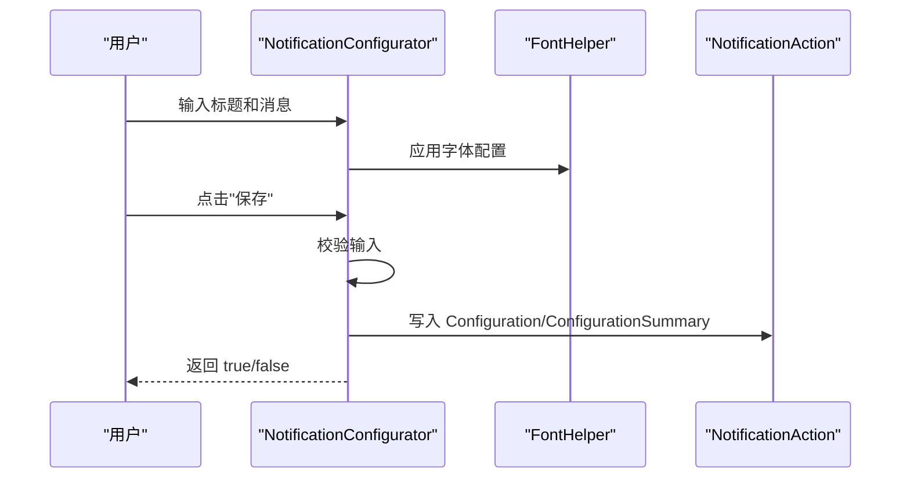

**图表来源**
- [GUI/NotificationConfigurator.cs:24-25](file://GUI/NotificationConfigurator.cs#L24-L25)

**章节来源**
- [GUI/NotificationConfigurator.cs:1-73](file://GUI/NotificationConfigurator.cs#L1-L73)

### 组件十：窗口切换配置器（字体集成）
WindowSwitchConfigurator提供窗口切换配置功能，集成了字体系统。

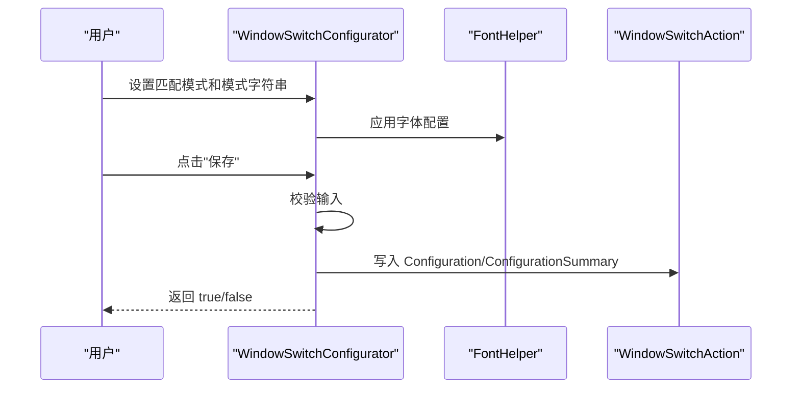

**图表来源**
- [GUI/WindowSwitchConfigurator.cs:29-30](file://GUI/WindowSwitchConfigurator.cs#L29-L30)

**章节来源**
- [GUI/WindowSwitchConfigurator.cs:1-102](file://GUI/WindowSwitchConfigurator.cs#L1-L102)

### 组件十一：启动应用程序视图（MVVM + 字体集成）
StartApplicationActionConfigView采用MVVM模式，集成了字体系统。

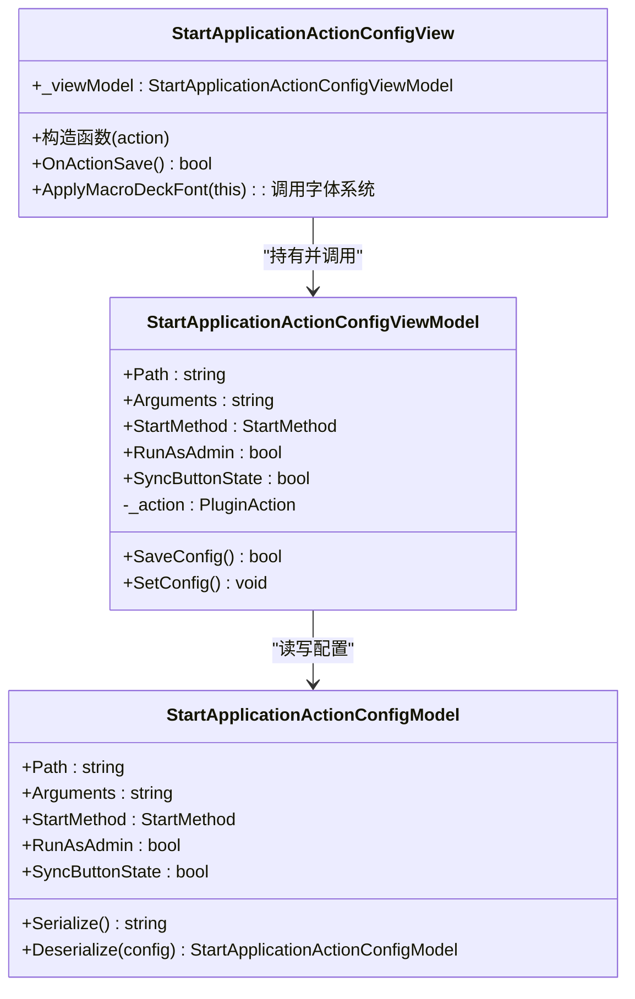

**图表来源**
- [Views/StartApplicationActionConfigView.cs:16-56](file://Views/StartApplicationActionConfigView.cs#L16-L56)
- [Views/StartApplicationActionConfigView.cs:30-31](file://Views/StartApplicationActionConfigView.cs#L30-L31)
- [ViewModels/StartApplicationActionConfigViewModel.cs:9-56](file://ViewModels/StartApplicationActionConfigViewModel.cs#L9-L56)
- [Models/StartApplicationActionConfigModel.cs:6-22](file://Models/StartApplicationActionConfigModel.cs#L6-L22)

**章节来源**
- [Views/StartApplicationActionConfigView.cs:1-191](file://Views/StartApplicationActionConfigView.cs#L1-L191)

### 组件十二：动作触发与配置联动
动作类通过GetActionConfigControl返回配置控件，并在Trigger中读取配置执行相应操作。

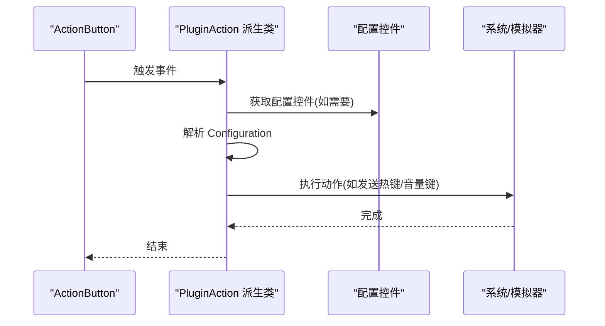

**图表来源**
- [Actions/HotkeyAction.cs:24-38](file://Actions/HotkeyAction.cs#L24-L38)
- [Actions/IncreaseVolumeAction.cs:14-17](file://Actions/IncreaseVolumeAction.cs#L14-L17)
- [Actions/DecreaseVolumeAction.cs:14-17](file://Actions/DecreaseVolumeAction.cs#L14-L17)
- [Actions/MultiHotkeyAction.cs:23-48](file://Actions/MultiHotkeyAction.cs#L23-L48)

**章节来源**
- [Actions/HotkeyAction.cs:15-38](file://Actions/HotkeyAction.cs#L15-L38)
- [Actions/IncreaseVolumeAction.cs:8-18](file://Actions/IncreaseVolumeAction.cs#L8-L18)
- [Actions/DecreaseVolumeAction.cs:8-18](file://Actions/DecreaseVolumeAction.cs#L8-L18)
- [Actions/MultiHotkeyAction.cs:11-56](file://Actions/MultiHotkeyAction.cs#L11-L56)

## 依赖关系分析
- 插件入口Main.cs注册所有动作，形成"动作集合"。
- 动作类通过GetActionConfigControl返回对应的配置控件，建立"动作-配置控件"映射。
- MVVM视图通过ViewModel访问Model，ViewModel依赖ISerializableConfiguration接口实现序列化/反序列化。
- GUI控件直接或间接依赖语言资源管理器进行本地化文本显示。
- **字体系统**：所有GUI组件通过FontHelper.ApplyMacroDeckFont方法统一应用字体配置。

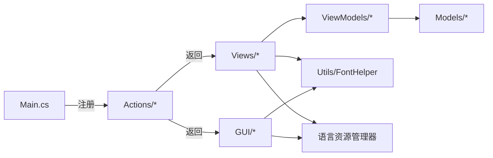

**图表来源**
- [Main.cs:31-50](file://Main.cs#L31-L50)
- [Actions/WindowsExplorerControlAction.cs:22-25](file://Actions/WindowsExplorerControlAction.cs#L22-L25)
- [Views/MultiHotkeyActionConfigView.cs:12-16](file://Views/MultiHotkeyActionConfigView.cs#L12-L16)
- [Views/StartApplicationActionConfigView.cs:28-31](file://Views/StartApplicationActionConfigView.cs#L28-L31)
- [Utils/FontHelper.cs:16-29](file://Utils/FontHelper.cs#L16-L29)
- [ViewModels/MultiHotkeyActionConfigViewModel.cs:30-34](file://ViewModels/MultiHotkeyActionConfigViewModel.cs#L30-L34)
- [Models/MultiHotkeyActionConfigModel.cs:17-20](file://Models/MultiHotkeyActionConfigModel.cs#L17-L20)

**章节来源**
- [Main.cs:28-58](file://Main.cs#L28-L58)
- [Windows Utils.csproj:42-47](file://Windows Utils.csproj#L42-L47)

## 性能考虑
- 异步执行：多热键动作在独立线程中执行，避免阻塞UI线程；注意在同步按钮状态时及时重置状态。
- 序列化开销：配置模型使用JSON序列化，建议保持配置字段精简，避免频繁大对象序列化。
- UI更新：ViewModel在保存时仅更新必要的摘要信息，减少不必要的UI刷新。
- 计时器：插件主类启动定时器用于周期性任务，需合理设置间隔，避免占用过多CPU。
- 文件操作优化：命令行执行器支持将输出保存到变量，减少重复执行成本。
- **字体系统性能**：字体应用采用递归遍历，但仅在控件初始化时执行一次，性能开销极小。

**章节来源**
- [Actions/MultiHotkeyAction.cs:31-47](file://Actions/MultiHotkeyAction.cs#L31-L47)
- [Main.cs:52-57](file://Main.cs#L52-L57)
- [Actions/CommandlineAction.cs:34-74](file://Actions/CommandlineAction.cs#L34-L74)
- [Utils/FontHelper.cs:31-36](file://Utils/FontHelper.cs#L31-L36)

## 故障排查指南
- 保存失败
  - 现象：OnActionSave返回false。
  - 原因：控件未通过输入校验（如文本为空、未选择枚举项）。
  - 处理：在控件中增加必填字段校验与提示，确保返回true后再提交。
  - 参考路径：[GUI/PowerOptionSelector.cs:37-40](file://GUI/PowerOptionSelector.cs#L37-L40)、[GUI/TextSelector.cs:27-30](file://GUI/TextSelector.cs#L27-L30)
- 配置丢失或异常
  - 现象：配置无法正确读取或反序列化。
  - 原因：配置字符串为空或格式不正确。
  - 处理：在ViewModel的SaveConfig中捕获异常并记录日志；在LoadConfig中进行容错处理。
  - 参考路径：[ViewModels/MultiHotkeyActionConfigViewModel.cs:36-48](file://ViewModels/MultiHotkeyActionConfigViewModel.cs#L36-L48)、[GUI/PowerOptionSelector.cs:55-66](file://GUI/PowerOptionSelector.cs#L55-L66)
- UI不更新
  - 现象：更改配置后界面未反映最新值。
  - 原因：未正确调用LoadConfig或未更新控件绑定。
  - 处理：在控件构造函数中调用LoadConfig；确保ViewModel.SetConfig更新摘要。
  - 参考路径：[GUI/ExplorerControlConfigurator.cs:14-27](file://GUI/ExplorerControlConfigurator.cs#L14-L27)、[ViewModels/MultiHotkeyActionConfigViewModel.cs:50-54](file://ViewModels/MultiHotkeyActionConfigViewModel.cs#L50-L54)
- 路径验证错误
  - 现象：文件/文件夹选择器提示路径类型不匹配。
  - 原因：用户选择的路径类型与预期不符。
  - 处理：确保选择正确的文件或文件夹类型，或调整选择器类型。
  - 参考路径：[GUI/FileFolderSelector.cs:112-132](file://GUI/FileFolderSelector.cs#L112-L132)
- 命令行执行失败
  - 现象：命令无法执行或输出为空。
  - 原因：命令无效、工作目录不存在或权限不足。
  - 处理：检查命令语法、确认工作目录存在且可访问。
  - 参考路径：[Actions/CommandlineAction.cs:36-74](file://Actions/CommandlineAction.cs#L36-L74)
- **字体显示异常**
  - 现象：控件字体未正确应用或显示异常。
  - 原因：配置文件格式错误、字体不可用或设计时模式。
  - 处理：检查Macro Deck配置文件中的字体设置，确保字体存在于系统中；避免在设计器中使用字体应用功能。
  - 参考路径：[Utils/FontHelper.cs:18-28](file://Utils/FontHelper.cs#L18-L28)、[Utils/FontHelper.cs:21-26](file://Utils/FontHelper.cs#L21-L26)

**章节来源**
- [GUI/PowerOptionSelector.cs:35-66](file://GUI/PowerOptionSelector.cs#L35-L66)
- [GUI/TextSelector.cs:25-41](file://GUI/TextSelector.cs#L25-L41)
- [ViewModels/MultiHotkeyActionConfigViewModel.cs:36-54](file://ViewModels/MultiHotkeyActionConfigViewModel.cs#L36-L54)
- [GUI/ExplorerControlConfigurator.cs:54-78](file://GUI/ExplorerControlConfigurator.cs#L54-L78)
- [GUI/FileFolderSelector.cs:112-132](file://GUI/FileFolderSelector.cs#L112-L132)
- [Actions/CommandlineAction.cs:36-74](file://Actions/CommandlineAction.cs#L36-L74)
- [Utils/FontHelper.cs:18-28](file://Utils/FontHelper.cs#L18-L28)

## 结论
本项目通过ActionConfigControl基类统一了配置控件的生命周期与保存机制，结合MVVM模式实现了清晰的职责分离。新增的CommandSelector、HotkeyConfigurator、PowerOptionSelector等组件丰富了GUI组件库，增强了文件/文件夹选择器和文本选择器的功能。**字体系统集成**显著提升了用户体验的一致性和专业性，所有GUI组件现在都使用统一的字体配置，确保在不同环境下都有良好的视觉效果。

ViewModel层承担配置读取、设置与保存，Model层提供可序列化的配置结构，GUI层专注于用户交互与本地化。**字体系统的递归应用机制**确保了从根控件到所有子控件的字体一致性，同时具备完善的错误处理和兼容性保障。遵循本文的最佳实践与排障建议，可高效开发稳定可靠的GUI组件。

## 附录：最佳实践与示例

### 最佳实践
- 数据验证
  - 在OnActionSave中进行必填字段与格式校验，失败时返回false并提示用户。
  - 对于枚举/列表等离散值，先解析再赋值，避免类型不匹配。
  - 路径验证应包含存在性检查和类型检查。
- 用户交互
  - 使用占位符文本提升输入体验；提供上下文菜单快速插入变量。
  - 控件初始化时调用LoadConfig，确保默认值正确显示。
  - 支持拖放操作提升用户体验。
- 响应式设计
  - 尽量使用异步执行长耗时操作，避免阻塞UI。
  - 在ViewModel中集中处理配置摘要生成，减少UI层负担。
  - 合理使用消息框进行用户确认。
- 状态管理
  - 对于需要同步按钮状态的动作，在执行前切换状态并在完成后恢复。
  - 使用Try/Catch包裹配置保存逻辑，记录错误日志便于排障。
  - 提供详细的错误提示和回退机制。
- **字体系统应用**
  - 在控件构造函数中立即调用FontHelper.ApplyMacroDeckFont(this)。
  - 确保字体应用在所有其他UI初始化之前执行。
  - 避免在设计器中使用字体应用功能，系统会自动检测设计时模式。

### 开发流程示例（以"命令行执行器"为例）
- 步骤1：创建控件类，继承ActionConfigControl，构造函数接收PluginAction并初始化UI与语言资源。
- 步骤2：在控件初始化过程中调用Utils.FontHelper.ApplyMacroDeckFont(this)应用字体配置。
- 步骤3：实现OnActionSave：校验命令和工作目录、构建JSON配置对象、写入PluginAction.Configuration与ConfigurationSummary。
- 步骤4：实现LoadConfig：解析已有配置并回填到控件。
- 步骤5：在动作类的GetActionConfigControl中返回该控件实例。
- 步骤6：在动作类中实现Trigger方法，解析配置并执行相应操作。

**章节来源**
- [GUI/CommandSelector.cs:15-189](file://GUI/CommandSelector.cs#L15-L189)
- [Actions/CommandlineAction.cs:17-84](file://Actions/CommandlineAction.cs#L17-L84)
- [Actions/WindowsExplorerControlAction.cs:22-25](file://Actions/WindowsExplorerControlAction.cs#L22-L25)
- [Utils/FontHelper.cs:16-37](file://Utils/FontHelper.cs#L16-L37)

### 字体系统集成示例
所有新的GUI组件都应该按照以下模式集成字体系统：

```csharp
public partial class NewConfigurator : ActionConfigControl
{
    public NewConfigurator(PluginAction pluginAction)
    {
        InitializeComponent();
        Utils.FontHelper.ApplyMacroDeckFont(this); // 字体系统集成
        
        // 其他初始化代码...
    }
}
```

**章节来源**
- [GUI/CommandSelector.cs:28-29](file://GUI/CommandSelector.cs#L28-L29)
- [GUI/HotkeyConfigurator.cs:26-27](file://GUI/HotkeyConfigurator.cs#L26-L27)
- [GUI/PowerOptionSelector.cs:26-28](file://GUI/PowerOptionSelector.cs#L26-L28)
- [GUI/TextSelector.cs:25-26](file://GUI/TextSelector.cs#L25-L26)
- [GUI/FileFolderSelector.cs:35-36](file://GUI/FileFolderSelector.cs#L35-L36)
- [GUI/IconPackSelector.cs:32-33](file://GUI/IconPackSelector.cs#L32-L33)
- [GUI/NotificationConfigurator.cs:24-25](file://GUI/NotificationConfigurator.cs#L24-L25)
- [GUI/WindowSwitchConfigurator.cs:29-30](file://GUI/WindowSwitchConfigurator.cs#L29-L30)
- [Views/MultiHotkeyActionConfigView.cs:22-23](file://Views/MultiHotkeyActionConfigView.cs#L22-L23)
- [Views/StartApplicationActionConfigView.cs:29-31](file://Views/StartApplicationActionConfigView.cs#L29-L31)