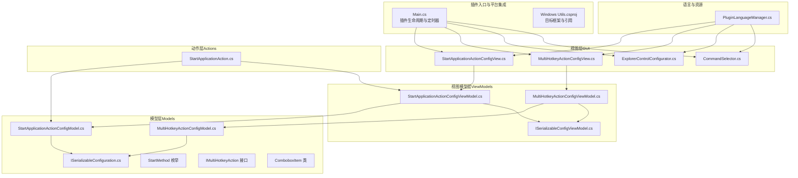
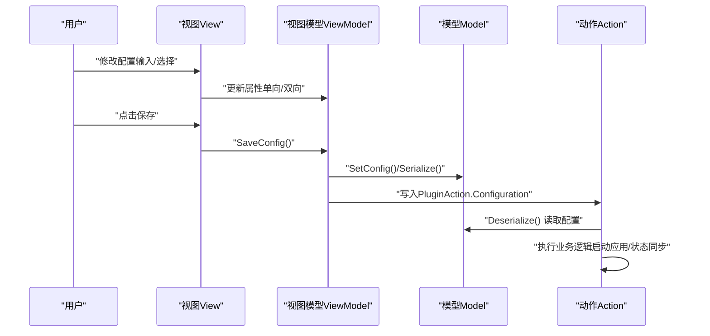
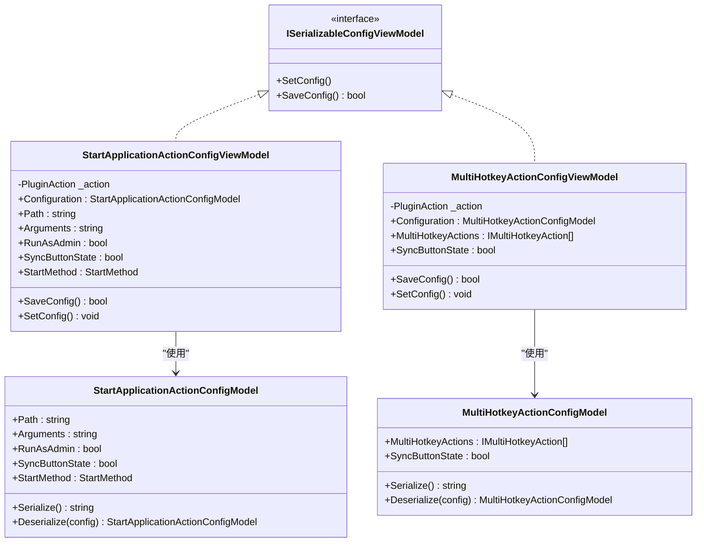
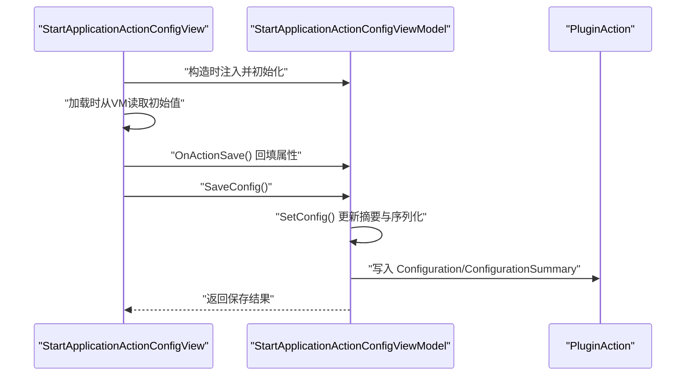
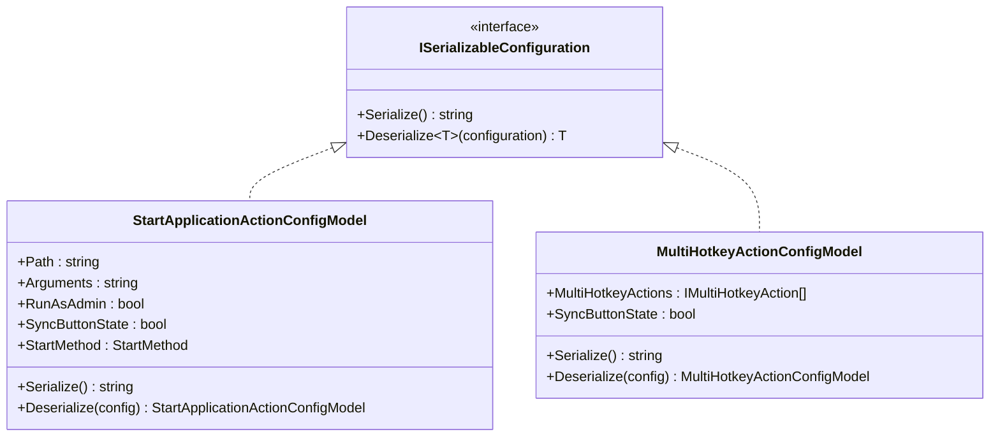
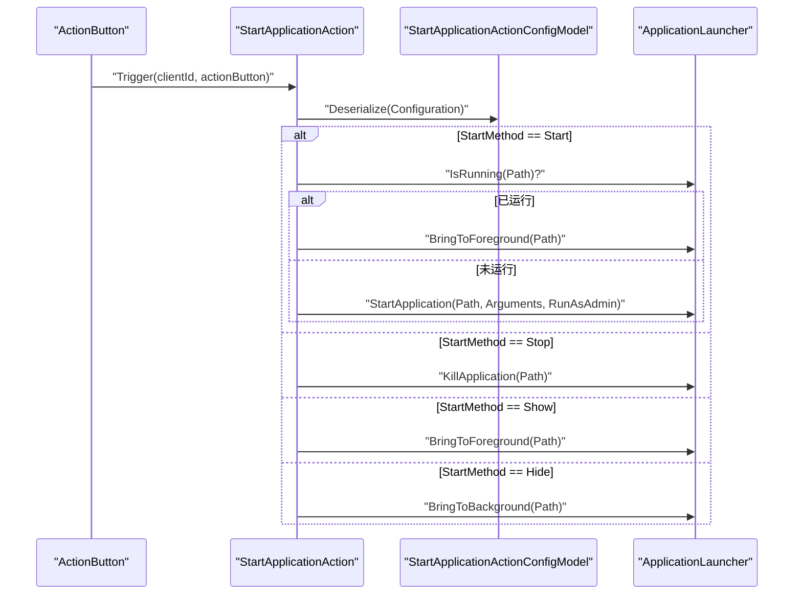
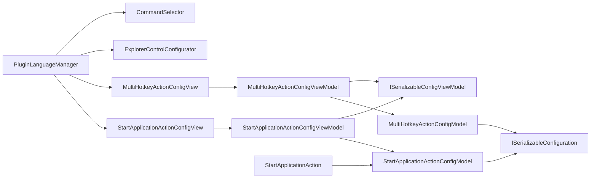

# MVVM模式在GUI中的应用

<cite>
**本文引用的文件**
- [Windows Utils.csproj](file://Windows Utils.csproj)
- [Main.cs](file://Main.cs)
- [README.md](file://README.md)
- [ISerializableConfigViewModel.cs](file://ViewModels/ISerializableConfigViewModel.cs)
- [MultiHotkeyActionConfigViewModel.cs](file://ViewModels/MultiHotkeyActionConfigViewModel.cs)
- [StartApplicationActionConfigViewModel.cs](file://ViewModels/StartApplicationActionConfigViewModel.cs)
- [ISerializableConfiguration.cs](file://Models/ISerializableConfiguration.cs)
- [MultiHotkeyActionConfigModel.cs](file://Models/MultiHotkeyActionConfigModel.cs)
- [StartApplicationActionConfigModel.cs](file://Models/StartApplicationActionConfigModel.cs)
- [MultiHotkeyActionConfigView.cs](file://Views/MultiHotkeyActionConfigView.cs)
- [StartApplicationActionConfigView.cs](file://Views/StartApplicationActionConfigView.cs)
- [ExplorerControlConfigurator.cs](file://GUI/ExplorerControlConfigurator.cs)
- [ComboboxItem.cs](file://Models/ComboboxItem.cs)
- [IMultiHotkeyAction.cs](file://Models/IMultiHotkeyAction.cs)
- [CommandSelector.cs](file://GUI/CommandSelector.cs)
- [StartApplicationAction.cs](file://Actions/StartApplicationAction.cs)
- [PluginLanguageManager.cs](file://Language/PluginLanguageManager.cs)
</cite>

## 目录
1. [引言](#引言)
2. [项目结构](#项目结构)
3. [核心组件](#核心组件)
4. [架构总览](#架构总览)
5. [详细组件分析](#详细组件分析)
6. [依赖关系分析](#依赖关系分析)
7. [性能考虑](#性能考虑)
8. [故障排除指南](#故障排除指南)
9. [结论](#结论)
10. [附录](#附录)

## 引言
本文件系统性阐述该仓库中MVVM（Model-View-ViewModel）模式在Windows Forms GUI中的落地实践。项目围绕“配置视图”场景，通过ViewModel封装配置状态与保存逻辑，View负责UI交互与输入校验，Model承载序列化配置数据。文档重点覆盖：
- ViewModel设计原则与职责边界
- 数据绑定与属性变更通知的实现路径
- 命令绑定与事件处理的协作方式
- View与ViewModel之间的单向/双向数据流
- 配置视图的MVVM实现流程：创建ViewModel、数据绑定、状态管理与持久化
- 实际示例与最佳实践：数据验证、命令处理、响应式更新与性能优化

## 项目结构
该项目采用分层组织：Actions（动作）、GUI（配置视图）、ViewModels（视图模型）、Models（数据模型）、Services（服务）、语言资源等。其中，MVVM相关的核心位于GUI、ViewModels与Models三层。

图表来源
- [Main.cs:14-59](file://Main.cs#L14-L59)
- [StartApplicationActionConfigView.cs:13-44](file://Views/StartApplicationActionConfigView.cs#L13-L44)
- [MultiHotkeyActionConfigView.cs:8-16](file://Views/MultiHotkeyActionConfigView.cs#L8-L16)
- [StartApplicationActionConfigViewModel.cs:8-51](file://ViewModels/StartApplicationActionConfigViewModel.cs#L8-L51)
- [MultiHotkeyActionConfigViewModel.cs:9-34](file://ViewModels/MultiHotkeyActionConfigViewModel.cs#L9-L34)
- [StartApplicationActionConfigModel.cs:6-26](file://Models/StartApplicationActionConfigModel.cs#L6-L26)
- [MultiHotkeyActionConfigModel.cs:6-21](file://Models/MultiHotkeyActionConfigModel.cs#L6-L21)
- [ISerializableConfiguration.cs:5-11](file://Models/ISerializableConfiguration.cs#L5-L11)
- [ISerializableConfigViewModel.cs:5-12](file://ViewModels/ISerializableConfigViewModel.cs#L5-L12)
- [StartApplicationAction.cs:14-83](file://Actions/StartApplicationAction.cs#L14-L83)
- [PluginLanguageManager.cs:8-33](file://Language/PluginLanguageManager.cs#L8-L33)

章节来源
- [Windows Utils.csproj:1-74](file://Windows Utils.csproj#L1-L74)
- [Main.cs:14-59](file://Main.cs#L14-L59)
- [README.md:1-40](file://README.md#L1-L40)

## 核心组件
- 视图（View）
  - 负责UI呈现、用户交互与输入校验，如文件选择、拖拽、下拉项设置等。
  - 示例：StartApplicationActionConfigView、MultiHotkeyActionConfigView、ExplorerControlConfigurator、CommandSelector。
- 视图模型（ViewModel）
  - 封装配置状态、提供属性访问器、执行保存逻辑，并与Model进行序列化/反序列化交互。
  - 示例：StartApplicationActionConfigViewModel、MultiHotkeyActionConfigViewModel，均实现ISerializableConfigViewModel。
- 模型（Model）
  - 承载可序列化的配置数据，提供Serialize/Deserialize能力。
  - 示例：StartApplicationActionConfigModel、MultiHotkeyActionConfigModel，实现ISerializableConfiguration。
- 动作（Action）
  - 插件动作类，读取配置模型并执行业务逻辑；部分动作支持按钮状态同步与定时刷新。
  - 示例：StartApplicationAction。

章节来源
- [StartApplicationActionConfigView.cs:13-44](file://Views/StartApplicationActionConfigView.cs#L13-L44)
- [MultiHotkeyActionConfigView.cs:8-16](file://Views/MultiHotkeyActionConfigView.cs#L8-L16)
- [StartApplicationActionConfigViewModel.cs:8-51](file://ViewModels/StartApplicationActionConfigViewModel.cs#L8-L51)
- [MultiHotkeyActionConfigViewModel.cs:9-34](file://ViewModels/MultiHotkeyActionConfigViewModel.cs#L9-L34)
- [StartApplicationActionConfigModel.cs:6-26](file://Models/StartApplicationActionConfigModel.cs#L6-L26)
- [MultiHotkeyActionConfigModel.cs:6-21](file://Models/MultiHotkeyActionConfigModel.cs#L6-L21)
- [ISerializableConfiguration.cs:5-11](file://Models/ISerializableConfiguration.cs#L5-L11)
- [ISerializableConfigViewModel.cs:5-12](file://ViewModels/ISerializableConfigViewModel.cs#L5-L12)
- [StartApplicationAction.cs:14-83](file://Actions/StartApplicationAction.cs#L14-L83)

## 架构总览
MVVM在本项目中的典型流程：
- View在构造时注入对应的ViewModel，随后在加载阶段将ViewModel的属性映射到控件。
- 用户在View上进行操作后，调用ViewModel的保存方法，ViewModel将当前状态写回Model并持久化到PluginAction.Configuration。
- 动作类在触发时读取Model并执行相应业务逻辑，必要时通过定时器与按钮状态联动。

图表来源
- [StartApplicationActionConfigView.cs:64-85](file://Views/StartApplicationActionConfigView.cs#L64-L85)
- [StartApplicationActionConfigViewModel.cs:53-71](file://ViewModels/StartApplicationActionConfigViewModel.cs#L53-L71)
- [StartApplicationActionConfigModel.cs:19-26](file://Models/StartApplicationActionConfigModel.cs#L19-L26)
- [StartApplicationAction.cs:22-50](file://Actions/StartApplicationAction.cs#L22-L50)

## 详细组件分析

### 视图模型层（ViewModels）
- 设计原则
  - 单一职责：仅负责配置状态与保存流程，不直接操作UI控件。
  - 可测试性：通过构造函数注入PluginAction，便于单元测试替换。
  - 状态一致性：通过SetConfig统一写回配置摘要与序列化字符串。
- 关键接口与实现
  - ISerializableConfigViewModel：定义保存与设置配置的契约。
  - StartApplicationActionConfigViewModel：封装路径、参数、管理员权限、同步按钮状态、启动方式等属性。
  - MultiHotkeyActionConfigViewModel：封装多热键动作列表与按钮状态同步标志。

图表来源
- [ISerializableConfigViewModel.cs:5-12](file://ViewModels/ISerializableConfigViewModel.cs#L5-L12)
- [StartApplicationActionConfigViewModel.cs:8-72](file://ViewModels/StartApplicationActionConfigViewModel.cs#L8-L72)
- [MultiHotkeyActionConfigViewModel.cs:9-55](file://ViewModels/MultiHotkeyActionConfigViewModel.cs#L9-L55)
- [StartApplicationActionConfigModel.cs:6-27](file://Models/StartApplicationActionConfigModel.cs#L6-L27)
- [MultiHotkeyActionConfigModel.cs:6-21](file://Models/MultiHotkeyActionConfigModel.cs#L6-L21)

章节来源
- [ISerializableConfigViewModel.cs:5-12](file://ViewModels/ISerializableConfigViewModel.cs#L5-L12)
- [StartApplicationActionConfigViewModel.cs:8-72](file://ViewModels/StartApplicationActionConfigViewModel.cs#L8-L72)
- [MultiHotkeyActionConfigViewModel.cs:9-55](file://ViewModels/MultiHotkeyActionConfigViewModel.cs#L9-L55)

### 视图层（Views）
- 职责
  - 初始化界面、绑定语言资源、处理拖拽与浏览事件。
  - 在加载时从ViewModel读取初始值，保存时将控件值回填至ViewModel并调用保存。
- 典型流程
  - StartApplicationActionConfigView：在加载时将ViewModel属性映射到文本框、复选框与下拉框；保存时进行必填校验并调用ViewModel.SaveConfig。
  - MultiHotkeyActionConfigView：构造时注入ViewModel，保存时委托ViewModel完成配置持久化。

图表来源
- [StartApplicationActionConfigView.cs:64-85](file://Views/StartApplicationActionConfigView.cs#L64-L85)
- [StartApplicationActionConfigView.cs:87-135](file://Views/StartApplicationActionConfigView.cs#L87-L135)
- [StartApplicationActionConfigViewModel.cs:53-71](file://ViewModels/StartApplicationActionConfigViewModel.cs#L53-L71)

章节来源
- [StartApplicationActionConfigView.cs:13-44](file://Views/StartApplicationActionConfigView.cs#L13-L44)
- [StartApplicationActionConfigView.cs:64-85](file://Views/StartApplicationActionConfigView.cs#L64-L85)
- [StartApplicationActionConfigView.cs:87-135](file://Views/StartApplicationActionConfigView.cs#L87-L135)
- [MultiHotkeyActionConfigView.cs:8-27](file://Views/MultiHotkeyActionConfigView.cs#L8-L27)

### 模型层（Models）
- 序列化契约
  - ISerializableConfiguration：定义Serialize与通用Deserialize方法，确保版本兼容与空配置安全。
  - 具体模型：StartApplicationActionConfigModel、MultiHotkeyActionConfigModel分别实现序列化与反序列化。
- 数据结构复杂度
  - StartApplicationActionConfigModel：O(1)序列化/反序列化，字段数量固定。
  - MultiHotkeyActionConfigModel：List存储多热键动作，序列化/反序列化时间复杂度O(n)，n为动作数量。
- 关键枚举
  - StartMethod：Start/Stop/Show/Hide四种启动方式，用于控制应用行为。

图表来源
- [ISerializableConfiguration.cs:5-11](file://Models/ISerializableConfiguration.cs#L5-L11)
- [StartApplicationActionConfigModel.cs:6-27](file://Models/StartApplicationActionConfigModel.cs#L6-L27)
- [MultiHotkeyActionConfigModel.cs:6-21](file://Models/MultiHotkeyActionConfigModel.cs#L6-L21)

章节来源
- [ISerializableConfiguration.cs:5-11](file://Models/ISerializableConfiguration.cs#L5-L11)
- [StartApplicationActionConfigModel.cs:6-27](file://Models/StartApplicationActionConfigModel.cs#L6-L27)
- [MultiHotkeyActionConfigModel.cs:6-21](file://Models/MultiHotkeyActionConfigModel.cs#L6-L21)

### 动作层（Actions）
- 职责
  - 读取配置模型并执行业务逻辑；支持配置视图、按钮状态同步与定时刷新。
- 关键流程
  - 触发时根据StartMethod执行启动/停止/显示/隐藏等操作。
  - 若启用按钮状态同步，则注册定时器周期性检查应用运行状态并更新按钮状态。

图表来源
- [StartApplicationAction.cs:22-50](file://Actions/StartApplicationAction.cs#L22-L50)
- [StartApplicationAction.cs:57-82](file://Actions/StartApplicationAction.cs#L57-L82)
- [StartApplicationActionConfigModel.cs:19-26](file://Models/StartApplicationActionConfigModel.cs#L19-L26)

章节来源
- [StartApplicationAction.cs:14-83](file://Actions/StartApplicationAction.cs#L14-L83)

### 语言与本地化
- PluginLanguageManager负责动态加载语言资源，视图在初始化时读取并设置控件文本，保证多语言支持。

章节来源
- [PluginLanguageManager.cs:8-33](file://Language/PluginLanguageManager.cs#L8-L33)
- [StartApplicationActionConfigView.cs:25-33](file://Views/StartApplicationActionConfigView.cs#L25-L33)
- [ExplorerControlConfigurator.cs:20-26](file://GUI/ExplorerControlConfigurator.cs#L20-L26)
- [CommandSelector.cs:22-26](file://GUI/CommandSelector.cs#L22-L26)

## 依赖关系分析
- 组件耦合
  - View与ViewModel：通过构造注入关联，耦合度低，便于测试。
  - ViewModel与Model：通过接口ISerializableConfiguration解耦，支持不同配置类型。
  - Action与ViewModel/Model：通过配置字符串间接耦合，遵循单一职责。
- 外部依赖
  - 宏命令平台API（MacroDeckPlugin、ActionConfigControl等）。
  - JSON序列化（System.Text.Json）与第三方输入模拟库（H.InputSimulator）。

图表来源
- [StartApplicationActionConfigView.cs:13-44](file://Views/StartApplicationActionConfigView.cs#L13-L44)
- [MultiHotkeyActionConfigView.cs:8-16](file://Views/MultiHotkeyActionConfigView.cs#L8-L16)
- [StartApplicationActionConfigViewModel.cs:8-51](file://ViewModels/StartApplicationActionConfigViewModel.cs#L8-L51)
- [MultiHotkeyActionConfigViewModel.cs:9-34](file://ViewModels/MultiHotkeyActionConfigViewModel.cs#L9-L34)
- [StartApplicationActionConfigModel.cs:6-27](file://Models/StartApplicationActionConfigModel.cs#L6-L27)
- [MultiHotkeyActionConfigModel.cs:6-21](file://Models/MultiHotkeyActionConfigModel.cs#L6-L21)
- [ISerializableConfiguration.cs:5-11](file://Models/ISerializableConfiguration.cs#L5-L11)
- [ISerializableConfigViewModel.cs:5-12](file://ViewModels/ISerializableConfigViewModel.cs#L5-L12)
- [StartApplicationAction.cs:14-83](file://Actions/StartApplicationAction.cs#L14-L83)
- [PluginLanguageManager.cs:8-33](file://Language/PluginLanguageManager.cs#L8-L33)

章节来源
- [Windows Utils.csproj:42-47](file://Windows Utils.csproj#L42-L47)
- [Windows Utils.csproj:36-38](file://Windows Utils.csproj#L36-L38)

## 性能考虑
- 序列化开销
  - 配置模型序列化为JSON，开销极小；多热键场景需注意List规模，避免频繁大规模序列化。
- UI线程与后台任务
  - 按钮状态同步使用定时器触发异步更新，避免阻塞UI线程。
- 资源加载
  - 语言资源按需加载，切换语言时重新解析XML，建议缓存常用字符串以减少重复解析。

## 故障排除指南
- 保存失败或配置为空
  - 视图保存前进行必填校验，若校验失败返回false；请检查视图的输入控件是否已正确赋值。
- 配置读取异常
  - 反序列化失败时返回默认空配置，确保不会抛出异常；请检查配置字符串格式。
- 日志记录
  - 保存与错误信息通过日志输出，便于定位问题；可在视图保存流程中查看日志。

章节来源
- [StartApplicationActionConfigView.cs:89-92](file://Views/StartApplicationActionConfigView.cs#L89-L92)
- [StartApplicationActionConfigViewModel.cs:55-64](file://ViewModels/StartApplicationActionConfigViewModel.cs#L55-L64)
- [StartApplicationActionConfigViewModel.cs:43-47](file://ViewModels/StartApplicationActionConfigViewModel.cs#L43-L47)

## 结论
本项目通过清晰的MVVM分层实现了配置视图与业务逻辑的解耦：View专注UI交互与输入校验，ViewModel负责状态管理与持久化，Model承担配置数据的序列化契约。配合宏命令平台的ActionConfigControl与定时器机制，实现了可靠的配置保存与按钮状态同步。建议在后续扩展中进一步引入属性变更通知接口以实现真正的双向绑定，并对大列表配置进行懒加载与增量序列化以优化性能。

## 附录
- 最佳实践清单
  - 使用接口约束（ISerializableConfiguration/ISerializableConfigViewModel）提升可替换性。
  - 在ViewModel中集中处理保存逻辑，避免在View中直接写入配置。
  - 对关键配置进行输入校验并在保存前提示用户确认。
  - 利用定时器异步更新按钮状态，避免阻塞UI线程。
  - 通过语言管理器统一处理多语言资源，保持界面一致性。