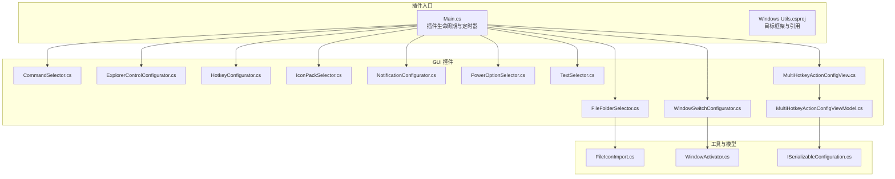
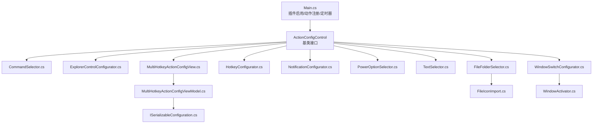
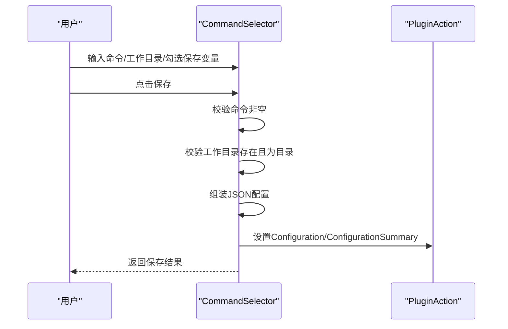
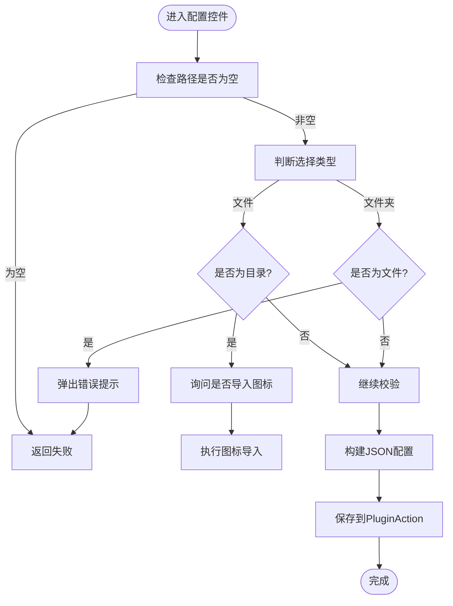
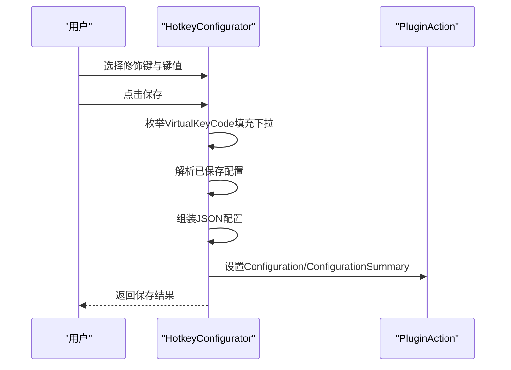
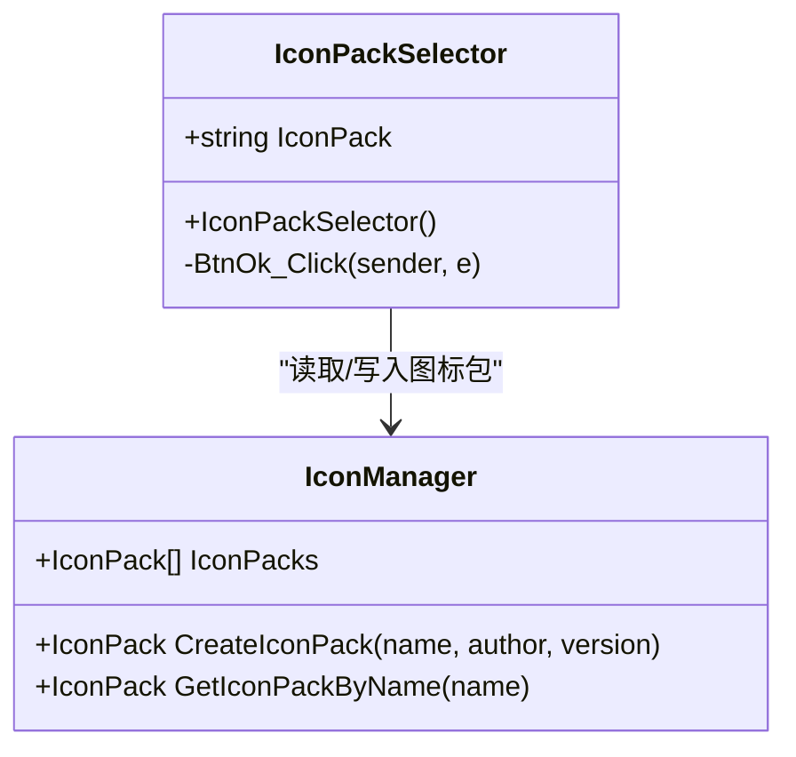
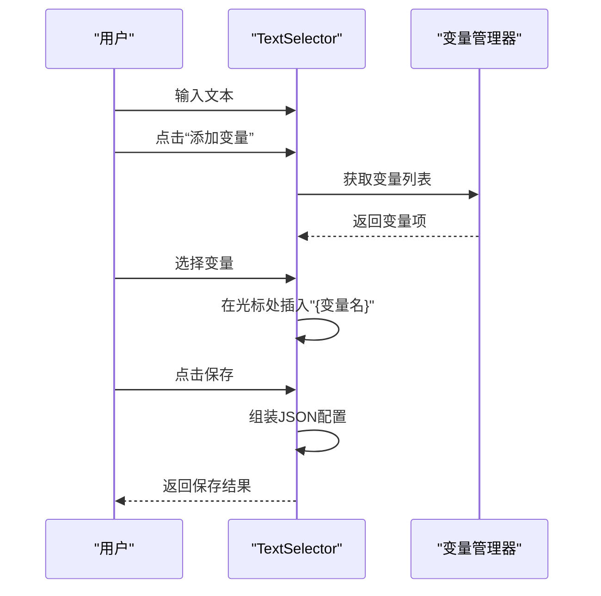
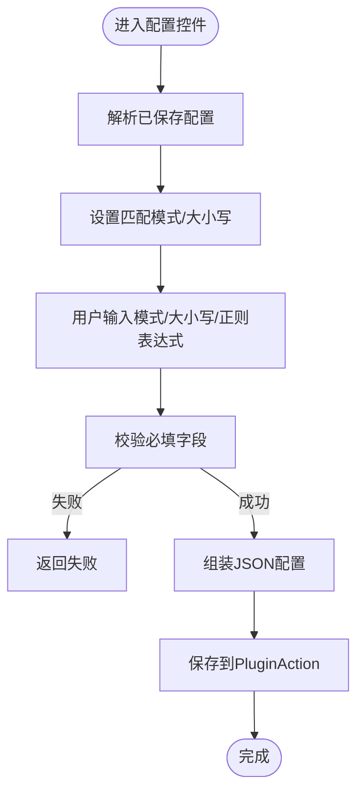
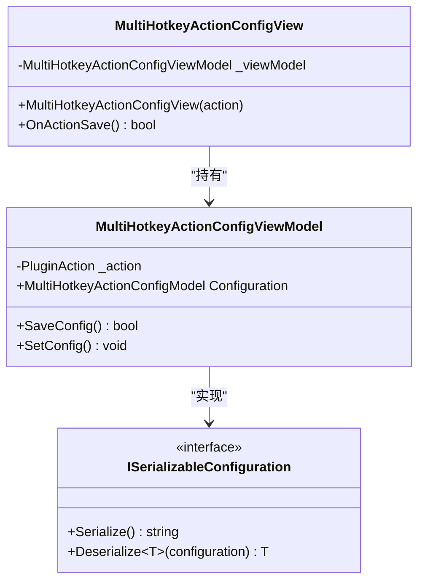
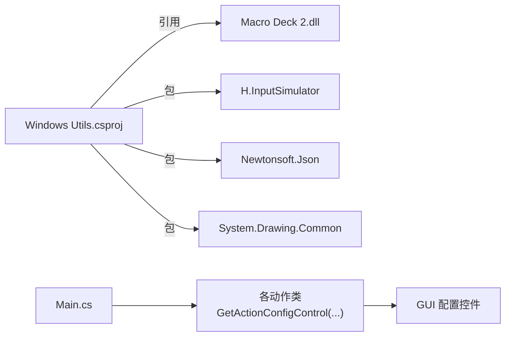

# 自定义控件开发

<cite>
**本文引用的文件**
- [Main.cs](file://Main.cs)
- [Windows Utils.csproj](file://Windows Utils.csproj)
- [CommandSelector.cs](file://GUI/CommandSelector.cs)
- [ExplorerControlConfigurator.cs](file://GUI/ExplorerControlConfigurator.cs)
- [FileFolderSelector.cs](file://GUI/FileFolderSelector.cs)
- [HotkeyConfigurator.cs](file://GUI/HotkeyConfigurator.cs)
- [IconPackSelector.cs](file://GUI/IconPackSelector.cs)
- [NotificationConfigurator.cs](file://GUI/NotificationConfigurator.cs)
- [PowerOptionSelector.cs](file://GUI/PowerOptionSelector.cs)
- [TextSelector.cs](file://GUI/TextSelector.cs)
- [WindowSwitchConfigurator.cs](file://GUI/WindowSwitchConfigurator.cs)
- [FileIconImport.cs](file://Utils/FileIconImport.cs)
- [WindowActivator.cs](file://Utils/WindowActivator.cs)
- [MultiHotkeyActionConfigView.cs](file://Views/MultiHotkeyActionConfigView.cs)
- [MultiHotkeyActionConfigViewModel.cs](file://ViewModels/MultiHotkeyActionConfigViewModel.cs)
- [ISerializableConfiguration.cs](file://Models/ISerializableConfiguration.cs)
</cite>

## 目录
1. [简介](#简介)
2. [项目结构](#项目结构)
3. [核心组件](#核心组件)
4. [架构总览](#架构总览)
5. [组件详细分析](#组件详细分析)
6. [依赖关系分析](#依赖关系分析)
7. [性能考虑](#性能考虑)
8. [故障排查指南](#故障排查指南)
9. [结论](#结论)
10. [附录](#附录)

## 简介
本技术文档面向在 Macro Deck 平台上开发自定义 GUI 控件的工程师与高级用户，系统讲解基于 WinForms 的自定义控件开发流程，涵盖控件创建、布局设计、事件处理、生命周期管理（初始化、配置加载、资源清理）、用户交互最佳实践（输入验证、错误提示、用户体验优化），以及复杂功能实现示例（热键组合、窗口切换、图标导入、多热键序列等）。同时提供控件复用、主题适配与可访问性支持的实现建议。

## 项目结构
该仓库为 Macro Deck 插件工程，采用“按功能域分层”的组织方式：GUI 控件位于 GUI 目录，业务逻辑与工具类位于 Utils，视图模型位于 ViewModels，数据模型位于 Models，入口与插件生命周期在 Main.cs 中定义。项目使用 Windows Forms，并通过 Macro Deck 提供的控件基类 ActionConfigControl 实现配置界面。

图表来源
- [Main.cs:14-59](file://Main.cs#L14-L59)
- [Windows Utils.csproj:1-74](file://Windows Utils.csproj#L1-L74)
- [CommandSelector.cs:12-44](file://GUI/CommandSelector.cs#L12-L44)
- [ExplorerControlConfigurator.cs:9-27](file://GUI/ExplorerControlConfigurator.cs#L9-L27)
- [FileFolderSelector.cs:13-45](file://GUI/FileFolderSelector.cs#L13-L45)
- [HotkeyConfigurator.cs:12-22](file://GUI/HotkeyConfigurator.cs#L12-L22)
- [IconPackSelector.cs:9-36](file://GUI/IconPackSelector.cs#L9-L36)
- [NotificationConfigurator.cs:9-23](file://GUI/NotificationConfigurator.cs#L9-L23)
- [PowerOptionSelector.cs:9-33](file://GUI/PowerOptionSelector.cs#L9-L33)
- [TextSelector.cs:11-23](file://GUI/TextSelector.cs#L11-L23)
- [WindowSwitchConfigurator.cs:10-37](file://GUI/WindowSwitchConfigurator.cs#L10-L37)
- [MultiHotkeyActionConfigView.cs:8-27](file://Views/MultiHotkeyActionConfigView.cs#L8-L27)
- [MultiHotkeyActionConfigViewModel.cs:9-55](file://ViewModels/MultiHotkeyActionConfigViewModel.cs#L9-L55)
- [FileIconImport.cs:11-67](file://Utils/FileIconImport.cs#L11-L67)
- [WindowActivator.cs:9-256](file://Utils/WindowActivator.cs#L9-L256)
- [ISerializableConfiguration.cs:5-11](file://Models/ISerializableConfiguration.cs#L5-L11)

章节来源
- [Main.cs:14-59](file://Main.cs#L14-L59)
- [Windows Utils.csproj:1-74](file://Windows Utils.csproj#L1-L74)

## 核心组件
- 插件主类与生命周期：Main 类继承自 MacroDeckPlugin，负责插件启用时的动作注册、语言初始化与全局定时器启动。
- 配置控件基类：所有 GUI 控件均继承自 ActionConfigControl，统一实现 OnActionSave 保存配置、InitializeComponent 初始化控件树。
- 工具与服务：FileIconImport 负责从文件提取图标并导入到图标包；WindowActivator 提供跨进程窗口激活与匹配逻辑。
- 视图模型：MultiHotkeyActionConfigViewModel 封装复杂配置的序列化/反序列化与保存流程，配合 MultiHotkeyActionConfigView 使用。

章节来源
- [Main.cs:14-59](file://Main.cs#L14-L59)
- [MultiHotkeyActionConfigView.cs:8-27](file://Views/MultiHotkeyActionConfigView.cs#L8-L27)
- [MultiHotkeyActionConfigViewModel.cs:9-55](file://ViewModels/MultiHotkeyActionConfigViewModel.cs#L9-L55)
- [FileIconImport.cs:11-67](file://Utils/FileIconImport.cs#L11-L67)
- [WindowActivator.cs:9-256](file://Utils/WindowActivator.cs#L9-L256)

## 架构总览
下图展示了插件入口、配置控件、工具类与视图模型之间的交互关系，以及配置数据在控件与插件动作之间的流转。

图表来源
- [Main.cs:28-59](file://Main.cs#L28-L59)
- [CommandSelector.cs:46-79](file://GUI/CommandSelector.cs#L46-L79)
- [ExplorerControlConfigurator.cs:29-51](file://GUI/ExplorerControlConfigurator.cs#L29-L51)
- [FileFolderSelector.cs:65-117](file://GUI/FileFolderSelector.cs#L65-L117)
- [HotkeyConfigurator.cs:24-53](file://GUI/HotkeyConfigurator.cs#L24-L53)
- [NotificationConfigurator.cs:25-40](file://GUI/NotificationConfigurator.cs#L25-L40)
- [PowerOptionSelector.cs:35-51](file://GUI/PowerOptionSelector.cs#L35-L51)
- [TextSelector.cs:25-41](file://GUI/TextSelector.cs#L25-L41)
- [WindowSwitchConfigurator.cs:39-58](file://GUI/WindowSwitchConfigurator.cs#L39-L58)
- [MultiHotkeyActionConfigView.cs:8-27](file://Views/MultiHotkeyActionConfigView.cs#L8-L27)
- [MultiHotkeyActionConfigViewModel.cs:36-54](file://ViewModels/MultiHotkeyActionConfigViewModel.cs#L36-L54)
- [ISerializableConfiguration.cs:5-11](file://Models/ISerializableConfiguration.cs#L5-L11)
- [FileIconImport.cs:14-64](file://Utils/FileIconImport.cs#L14-L64)
- [WindowActivator.cs:57-122](file://Utils/WindowActivator.cs#L57-L122)

## 组件详细分析

### 命令选择器（CommandSelector）
- 功能：允许用户输入命令、工作目录，可选保存输出到变量（类型与名称）。
- 生命周期：
  - 构造函数中初始化本地化文本、占位符、拖拽支持、加载配置。
  - OnActionSave 校验必填项并生成 JSON 配置。
- 用户交互：
  - 支持拖拽文件夹路径到输入框。
  - 变量保存开关动态显示/隐藏变量名与类型控件。
- 错误处理：路径非空且必须为目录时进行校验并弹出消息框。

图表来源
- [CommandSelector.cs:46-79](file://GUI/CommandSelector.cs#L46-L79)
- [CommandSelector.cs:100-116](file://GUI/CommandSelector.cs#L100-L116)

章节来源
- [CommandSelector.cs:12-44](file://GUI/CommandSelector.cs#L12-L44)
- [CommandSelector.cs:46-79](file://GUI/CommandSelector.cs#L46-L79)
- [CommandSelector.cs:100-116](file://GUI/CommandSelector.cs#L100-L116)

### 文件/文件夹选择器（FileFolderSelector）
- 功能：根据选择类型（文件/文件夹）选择路径，支持拖拽与对话框选择。
- 生命周期：构造时设置标题与提示文案，初始化拖拽，加载配置。
- 用户交互：根据类型限制路径必须为文件或目录；导入文件时可触发图标导入流程。
- 错误处理：类型不匹配时弹出错误提示；导入图标前询问确认。

图表来源
- [FileFolderSelector.cs:65-117](file://GUI/FileFolderSelector.cs#L65-L117)
- [FileFolderSelector.cs:121-132](file://GUI/FileFolderSelector.cs#L121-L132)
- [FileIconImport.cs:14-64](file://Utils/FileIconImport.cs#L14-L64)

章节来源
- [FileFolderSelector.cs:13-45](file://GUI/FileFolderSelector.cs#L13-L45)
- [FileFolderSelector.cs:65-117](file://GUI/FileFolderSelector.cs#L65-L117)
- [FileFolderSelector.cs:121-132](file://GUI/FileFolderSelector.cs#L121-L132)

### 热键配置器（HotkeyConfigurator）
- 功能：配置组合键（Win/Ctrl/Shift/Alt 及左右键）与具体键值。
- 生命周期：构造时加载可用键列表与已保存配置。
- 用户交互：动态拼接配置摘要字符串；点击链接打开键码参考页面。

图表来源
- [HotkeyConfigurator.cs:24-53](file://GUI/HotkeyConfigurator.cs#L24-L53)
- [HotkeyConfigurator.cs:56-81](file://GUI/HotkeyConfigurator.cs#L56-L81)

章节来源
- [HotkeyConfigurator.cs:12-22](file://GUI/HotkeyConfigurator.cs#L12-L22)
- [HotkeyConfigurator.cs:24-53](file://GUI/HotkeyConfigurator.cs#L24-L53)
- [HotkeyConfigurator.cs:56-81](file://GUI/HotkeyConfigurator.cs#L56-L81)

### 图标包选择器（IconPackSelector）
- 功能：弹窗选择图标包，用于后续图标导入。
- 生命周期：构造时确保存在非扩展商店管理的图标包，列出可用包并默认选中第一个。

图表来源
- [IconPackSelector.cs:9-36](file://GUI/IconPackSelector.cs#L9-L36)
- [FileIconImport.cs:38-58](file://Utils/FileIconImport.cs#L38-L58)

章节来源
- [IconPackSelector.cs:9-36](file://GUI/IconPackSelector.cs#L9-L36)

### 文本选择器（TextSelector）
- 功能：输入要写入的文本，支持插入变量占位符。
- 生命周期：构造时设置占位符与本地化文本，加载配置。
- 用户交互：点击“添加变量”弹出上下文菜单，选择变量后插入到文本框指定位置。

图表来源
- [TextSelector.cs:25-41](file://GUI/TextSelector.cs#L25-L41)
- [TextSelector.cs:53-75](file://GUI/TextSelector.cs#L53-L75)

章节来源
- [TextSelector.cs:11-23](file://GUI/TextSelector.cs#L11-L23)
- [TextSelector.cs:25-41](file://GUI/TextSelector.cs#L25-L41)
- [TextSelector.cs:53-75](file://GUI/TextSelector.cs#L53-L75)

### 窗口切换配置器（WindowSwitchConfigurator）
- 功能：根据多种匹配模式（全等、部分、前缀、后缀、正则）与大小写敏感性匹配窗口标题并激活。
- 生命周期：构造时动态填充匹配模式枚举，加载配置。
- 用户交互：保存时解析匹配模式与大小写选项，生成摘要。

图表来源
- [WindowSwitchConfigurator.cs:39-58](file://GUI/WindowSwitchConfigurator.cs#L39-L58)
- [WindowSwitchConfigurator.cs:60-77](file://GUI/WindowSwitchConfigurator.cs#L60-L77)
- [WindowActivator.cs:57-122](file://Utils/WindowActivator.cs#L57-L122)

章节来源
- [WindowSwitchConfigurator.cs:10-37](file://GUI/WindowSwitchConfigurator.cs#L10-L37)
- [WindowSwitchConfigurator.cs:39-58](file://GUI/WindowSwitchConfigurator.cs#L39-L58)
- [WindowSwitchConfigurator.cs:60-77](file://GUI/WindowSwitchConfigurator.cs#L60-L77)
- [WindowActivator.cs:9-256](file://Utils/WindowActivator.cs#L9-L256)

### 多热键配置视图与视图模型
- 功能：封装复杂配置的序列化/反序列化与保存流程，支持同步按钮状态。
- 生命周期：视图加载时初始化视图模型；OnActionSave 委托给视图模型保存。
- 数据模型：通过 ISerializableConfiguration 接口实现统一序列化/反序列化。

图表来源
- [MultiHotkeyActionConfigView.cs:8-27](file://Views/MultiHotkeyActionConfigView.cs#L8-L27)
- [MultiHotkeyActionConfigViewModel.cs:9-55](file://ViewModels/MultiHotkeyActionConfigViewModel.cs#L9-L55)
- [ISerializableConfiguration.cs:5-11](file://Models/ISerializableConfiguration.cs#L5-L11)

章节来源
- [MultiHotkeyActionConfigView.cs:8-27](file://Views/MultiHotkeyActionConfigView.cs#L8-L27)
- [MultiHotkeyActionConfigViewModel.cs:9-55](file://ViewModels/MultiHotkeyActionConfigViewModel.cs#L9-L55)
- [ISerializableConfiguration.cs:5-11](file://Models/ISerializableConfiguration.cs#L5-L11)

## 依赖关系分析
- 框架与平台：目标框架为 net10.0-windows7.0，启用 Windows Forms，引用 Macro Deck 2.dll 作为外部程序集。
- 第三方库：H.InputSimulator（热键模拟）、Newtonsoft.Json（配置序列化）、System.Drawing.Common（图标处理）。
- 插件入口：Main 类在启用时注册一系列动作，并启动定时器；所有动作通过各自的 GetActionConfigControl 返回对应的配置控件实例。

图表来源
- [Windows Utils.csproj:35-47](file://Windows Utils.csproj#L35-L47)
- [Main.cs:28-50](file://Main.cs#L28-L50)

章节来源
- [Windows Utils.csproj:1-74](file://Windows Utils.csproj#L1-L74)
- [Main.cs:28-50](file://Main.cs#L28-L50)

## 性能考虑
- 配置加载与保存：优先使用轻量级 JSON 序列化，避免频繁大对象分配；在 OnActionSave 中尽早返回失败以减少无效计算。
- UI 响应：避免在 UI 线程执行耗时操作（如文件系统扫描、图标提取），可使用异步任务或后台线程。
- 资源释放：控件销毁时解除事件订阅，释放非托管句柄（如图标句柄）；在插件卸载时停止定时器与取消订阅。
- 字符串与正则：正则表达式在 WindowActivator 中预编译，避免重复编译开销；匹配模式切换时尽量减少不必要的转换。

## 故障排查指南
- 配置保存失败：
  - 检查必填字段是否为空（如命令、路径、标题/消息、模式/大小写等）。
  - 查看 OnActionSave 返回值与日志记录，定位异常点。
- 路径类型错误：
  - 文件/文件夹选择器会根据类型强制校验；若报错，请确认所选路径类型与预期一致。
- 图标导入失败：
  - 确认选择了有效的图标包；检查导入质量与尺寸设置；查看消息框提示。
- 窗口激活失败：
  - 确认匹配模式与大小写设置正确；正则表达式需合法；排除无任务栏可见窗口或工具窗口。
- 定时器相关问题：
  - 确认定时器已启用且间隔合理；避免在 Tick 中执行阻塞操作。

章节来源
- [CommandSelector.cs:48-66](file://GUI/CommandSelector.cs#L48-L66)
- [FileFolderSelector.cs:85-107](file://GUI/FileFolderSelector.cs#L85-L107)
- [NotificationConfigurator.cs:27-30](file://GUI/NotificationConfigurator.cs#L27-L30)
- [WindowSwitchConfigurator.cs:41-44](file://GUI/WindowSwitchConfigurator.cs#L41-L44)
- [FileIconImport.cs:31-35](file://Utils/FileIconImport.cs#L31-L35)
- [WindowActivator.cs:74-88](file://Utils/WindowActivator.cs#L74-L88)
- [Main.cs:52-57](file://Main.cs#L52-L57)

## 结论
本项目提供了丰富的 WinForms 自定义控件示例，覆盖命令执行、文件/文件夹选择、热键组合、通知、电源选项、文本写入与窗口切换等常见场景。通过统一的 ActionConfigControl 基类、清晰的生命周期管理、完善的输入验证与错误提示，以及可扩展的视图模型与序列化接口，开发者可以快速复用并扩展控件功能。建议在新控件开发中遵循本文档的交互设计与性能优化建议，确保良好的用户体验与可维护性。

## 附录
- 控件复用建议：
  - 将通用 UI 元素抽象为自定义控件基类，统一事件与样式。
  - 使用视图模型分离业务逻辑，便于单元测试与重用。
- 主题适配建议：
  - 使用系统主题色与字体设置，避免硬编码颜色；在控件中暴露主题属性以便外部统一配置。
- 可访问性支持建议：
  - 为控件提供可读的名称与描述；确保键盘导航完整；为图标与按钮提供 ToolTip。
- 配置持久化最佳实践：
  - 使用 JSON 或二进制序列化，保持向后兼容；对敏感配置进行加密存储；提供默认值与回退策略。