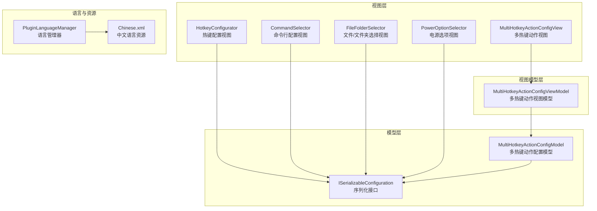
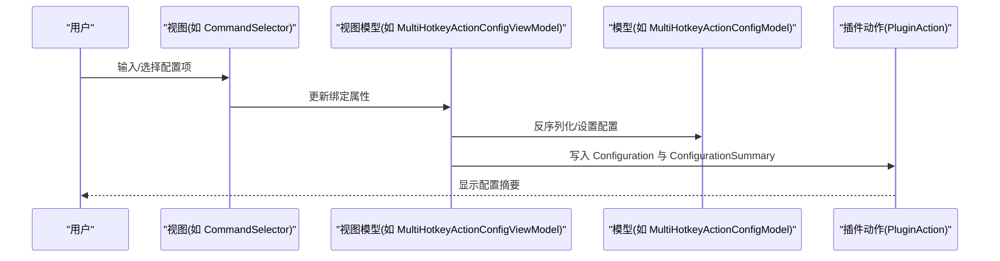
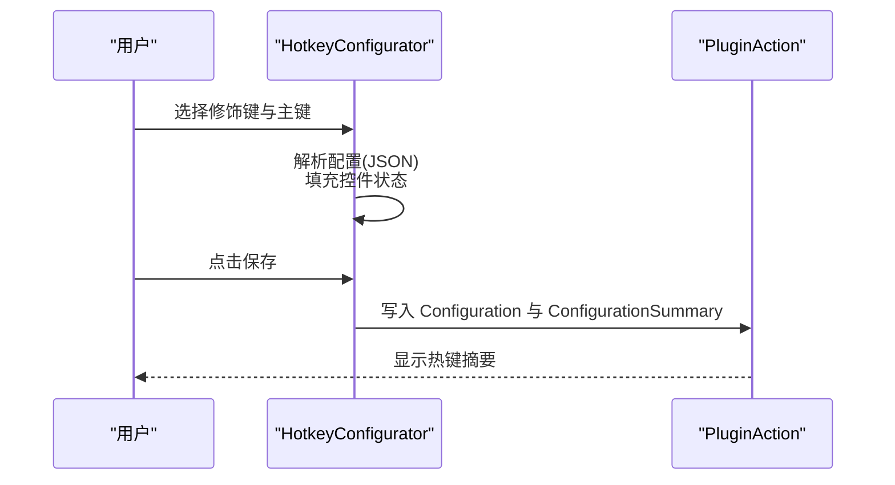
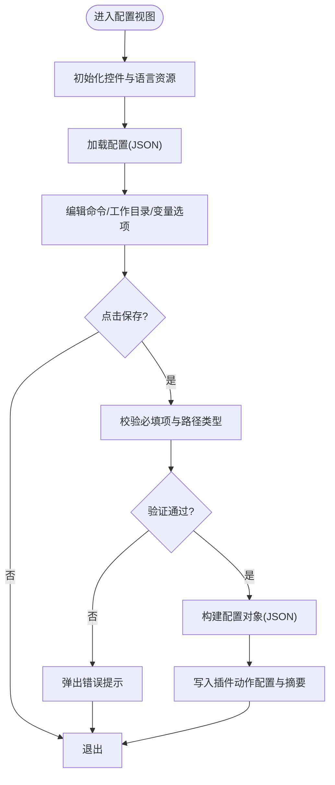
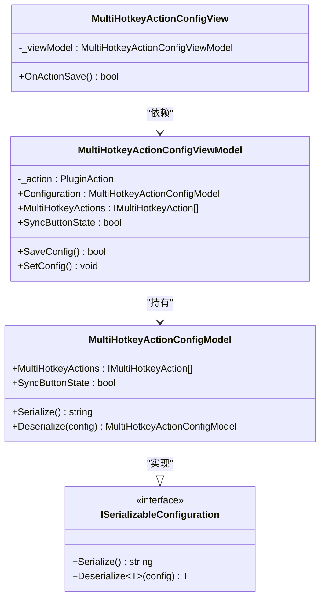
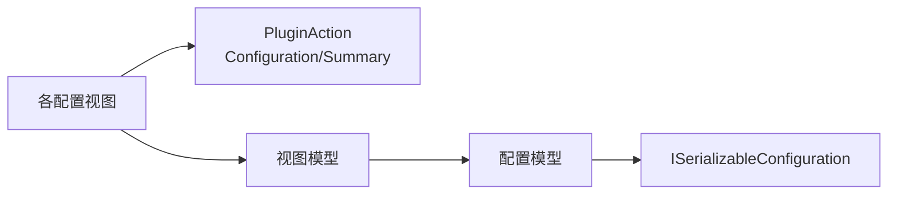

# 配置界面设计

<cite>
**本文引用的文件**
- [HotkeyConfigurator.cs](file://GUI/HotkeyConfigurator.cs)
- [HotkeyConfigurator.Designer.cs](file://GUI/HotkeyConfigurator.Designer.cs)
- [CommandSelector.cs](file://GUI/CommandSelector.cs)
- [CommandSelector.Designer.cs](file://GUI/CommandSelector.Designer.cs)
- [FileFolderSelector.cs](file://GUI/FileFolderSelector.cs)
- [PowerOptionSelector.cs](file://GUI/PowerOptionSelector.cs)
- [MultiHotkeyActionConfigView.cs](file://Views/MultiHotkeyActionConfigView.cs)
- [MultiHotkeyActionConfigViewModel.cs](file://ViewModels/MultiHotkeyActionConfigViewModel.cs)
- [MultiHotkeyActionConfigModel.cs](file://Models/MultiHotkeyActionConfigModel.cs)
- [ISerializableConfiguration.cs](file://Models/ISerializableConfiguration.cs)
- [PluginLanguageManager.cs](file://Language/PluginLanguageManager.cs)
- [Chinese.xml](file://Resources/Languages/Chinese.xml)
- [ExtensionManifest.json](file://ExtensionManifest.json)
</cite>

## 目录
1. [简介](#简介)
2. [项目结构](#项目结构)
3. [核心组件](#核心组件)
4. [架构总览](#架构总览)
5. [详细组件分析](#详细组件分析)
6. [依赖关系分析](#依赖关系分析)
7. [性能考虑](#性能考虑)
8. [故障排查指南](#故障排查指南)
9. [结论](#结论)
10. [附录](#附录)

## 简介
本技术文档围绕 Macro Deck 插件“Windows Utils”的配置界面设计展开，系统性阐述布局设计原则、用户体验优化策略、数据绑定机制、响应式适配、界面一致性与可访问性、国际化支持，以及可复用的设计范式。通过对多个配置控件（热键、命令行、文件/文件夹选择、电源选项、多热键动作视图）的代码级分析，总结出一套可迁移的配置界面设计方法论。

## 项目结构
该插件采用“视图-视图模型-模型-语言资源”的分层组织方式：
- 视图层：位于 GUI 与 Views 目录，负责用户交互与控件布局
- 视图模型层：位于 ViewModels 目录，封装配置状态与保存逻辑
- 模型层：位于 Models 目录，提供序列化/反序列化能力
- 语言与资源：Language 与 Resources/Languages 提供多语言支持

图表来源
- [HotkeyConfigurator.cs:12-96](file://GUI/HotkeyConfigurator.cs#L12-L96)
- [CommandSelector.cs:12-144](file://GUI/CommandSelector.cs#L12-L144)
- [FileFolderSelector.cs:13-189](file://GUI/FileFolderSelector.cs#L13-L189)
- [PowerOptionSelector.cs:9-75](file://GUI/PowerOptionSelector.cs#L9-L75)
- [MultiHotkeyActionConfigView.cs:8-27](file://Views/MultiHotkeyActionConfigView.cs#L8-L27)
- [MultiHotkeyActionConfigViewModel.cs:9-56](file://ViewModels/MultiHotkeyActionConfigViewModel.cs#L9-L56)
- [MultiHotkeyActionConfigModel.cs:6-22](file://Models/MultiHotkeyActionConfigModel.cs#L6-L22)
- [ISerializableConfiguration.cs:5-12](file://Models/ISerializableConfiguration.cs#L5-L12)
- [PluginLanguageManager.cs:8-51](file://Language/PluginLanguageManager.cs#L8-L51)
- [Chinese.xml:1-62](file://Resources/Languages/Chinese.xml#L1-L62)

章节来源
- [ExtensionManifest.json:1-11](file://ExtensionManifest.json#L1-L11)

## 核心组件
本节聚焦于配置界面的关键组成与职责：
- 热键配置视图：提供修饰键与主键的选择、校验与摘要生成
- 命令行配置视图：支持命令输入、工作目录选择与变量保存开关
- 文件/文件夹选择视图：拖拽、浏览、类型校验与图标导入流程
- 电源选项视图：枚举驱动的下拉选择与持久化
- 多热键动作视图与视图模型：列表型配置的 MVVM 绑定与序列化

章节来源
- [HotkeyConfigurator.cs:12-96](file://GUI/HotkeyConfigurator.cs#L12-L96)
- [CommandSelector.cs:12-144](file://GUI/CommandSelector.cs#L12-L144)
- [FileFolderSelector.cs:13-189](file://GUI/FileFolderSelector.cs#L13-L189)
- [PowerOptionSelector.cs:9-75](file://GUI/PowerOptionSelector.cs#L9-L75)
- [MultiHotkeyActionConfigView.cs:8-27](file://Views/MultiHotkeyActionConfigView.cs#L8-L27)
- [MultiHotkeyActionConfigViewModel.cs:9-56](file://ViewModels/MultiHotkeyActionConfigViewModel.cs#L9-L56)

## 架构总览
配置界面遵循“视图-视图模型-模型”三层协作：
- 视图负责呈现与事件处理
- 视图模型负责业务状态与保存流程
- 模型负责配置的序列化/反序列化

图表来源
- [CommandSelector.cs:46-79](file://GUI/CommandSelector.cs#L46-L79)
- [MultiHotkeyActionConfigView.cs:23-26](file://Views/MultiHotkeyActionConfigView.cs#L23-L26)
- [MultiHotkeyActionConfigViewModel.cs:36-54](file://ViewModels/MultiHotkeyActionConfigViewModel.cs#L36-L54)
- [MultiHotkeyActionConfigModel.cs:13-20](file://Models/MultiHotkeyActionConfigModel.cs#L13-L20)

## 详细组件分析

### 热键配置视图（HotkeyConfigurator）
- 布局设计原则
  - 修饰键采用横向排列，主键使用下拉选择，加号分隔符增强可读性
  - 使用链接标签提供外部参考入口，便于扩展学习
- 用户体验优化
  - 加载时填充所有可用虚拟键值，确保覆盖完整
  - 保存时拼接配置摘要，直观反馈最终热键组合
- 数据绑定与同步
  - 通过 JSON 对象在控件与插件动作之间双向映射
  - 在加载阶段解析配置字符串，恢复控件状态
- 错误处理
  - 未选择有效键位时拒绝保存，避免空配置

图表来源
- [HotkeyConfigurator.cs:24-53](file://GUI/HotkeyConfigurator.cs#L24-L53)
- [HotkeyConfigurator.Designer.cs:32-267](file://GUI/HotkeyConfigurator.Designer.cs#L32-L267)

章节来源
- [HotkeyConfigurator.cs:12-96](file://GUI/HotkeyConfigurator.cs#L12-L96)
- [HotkeyConfigurator.Designer.cs:6-291](file://GUI/HotkeyConfigurator.Designer.cs#L6-L291)

### 命令行配置视图（CommandSelector）
- 表单布局与控件排列
  - 标签与输入框左右对齐，命令输入区域支持多行
  - 工作目录支持拖拽与浏览按钮，变量相关控件按需显示
- 视觉层次
  - 标题标签采用统一字号与对齐方式，提升信息层级
- 数据绑定与实时预览
  - 保存时生成 Configuration 与 ConfigurationSummary
  - 变量保存开关动态控制变量名称与类型控件可见性
- 校验与提示
  - 工作目录非空时进行存在性与类型校验，错误以消息框提示

图表来源
- [CommandSelector.cs:46-79](file://GUI/CommandSelector.cs#L46-L79)
- [CommandSelector.Designer.cs:32-186](file://GUI/CommandSelector.Designer.cs#L32-L186)

章节来源
- [CommandSelector.cs:12-144](file://GUI/CommandSelector.cs#L12-L144)
- [CommandSelector.Designer.cs:6-200](file://GUI/CommandSelector.Designer.cs#L6-L200)

### 文件/文件夹选择视图（FileFolderSelector）
- 布局与交互
  - 支持拖拽文件/文件夹到输入框，自动填充路径
  - 根据选择类型（文件/文件夹）启用相应对话框
- 类型校验与导入
  - 路径类型校验，防止文件与文件夹类型不匹配
  - 文件导入时可选触发图标导入流程
- 数据绑定
  - 保存时生成 JSON 并更新 Configuration 与摘要

章节来源
- [FileFolderSelector.cs:13-189](file://GUI/FileFolderSelector.cs#L13-L189)

### 电源选项视图（PowerOptionSelector）
- 构建逻辑
  - 动态从枚举生成下拉项，设置默认值
  - 保存时解析枚举并写入配置
- 一致性与可维护性
  - 通过枚举驱动 UI，减少硬编码风险

章节来源
- [PowerOptionSelector.cs:9-75](file://GUI/PowerOptionSelector.cs#L9-L75)

### 多热键动作视图与视图模型（MultiHotkeyActionConfigView / ViewModel）
- MVVM 模式
  - 视图仅负责承载与调用视图模型
  - 视图模型持有配置模型，负责序列化与摘要生成
- 列表型配置
  - 支持动作集合与按钮状态同步标志
  - 保存时记录动作数量作为摘要

图表来源
- [MultiHotkeyActionConfigView.cs:8-27](file://Views/MultiHotkeyActionConfigView.cs#L8-L27)
- [MultiHotkeyActionConfigViewModel.cs:9-56](file://ViewModels/MultiHotkeyActionConfigViewModel.cs#L9-L56)
- [MultiHotkeyActionConfigModel.cs:6-22](file://Models/MultiHotkeyActionConfigModel.cs#L6-L22)
- [ISerializableConfiguration.cs:5-12](file://Models/ISerializableConfiguration.cs#L5-L12)

章节来源
- [MultiHotkeyActionConfigView.cs:8-27](file://Views/MultiHotkeyActionConfigView.cs#L8-L27)
- [MultiHotkeyActionConfigViewModel.cs:9-56](file://ViewModels/MultiHotkeyActionConfigViewModel.cs#L9-L56)
- [MultiHotkeyActionConfigModel.cs:6-22](file://Models/MultiHotkeyActionConfigModel.cs#L6-L22)
- [ISerializableConfiguration.cs:5-12](file://Models/ISerializableConfiguration.cs#L5-L12)

## 依赖关系分析
- 控件与插件动作的耦合
  - 所有配置视图均通过插件动作的 Configuration 与 ConfigurationSummary 进行持久化与摘要展示
- 视图与视图模型的解耦
  - 视图仅暴露 OnActionSave，具体业务由视图模型承担
- 序列化接口的统一
  - 配置模型实现统一的序列化接口，保证跨视图的一致性

图表来源
- [HotkeyConfigurator.cs:24-53](file://GUI/HotkeyConfigurator.cs#L24-L53)
- [CommandSelector.cs:46-79](file://GUI/CommandSelector.cs#L46-L79)
- [MultiHotkeyActionConfigView.cs:23-26](file://Views/MultiHotkeyActionConfigView.cs#L23-L26)
- [MultiHotkeyActionConfigViewModel.cs:36-54](file://ViewModels/MultiHotkeyActionConfigViewModel.cs#L36-L54)
- [ISerializableConfiguration.cs:5-12](file://Models/ISerializableConfiguration.cs#L5-L12)

章节来源
- [HotkeyConfigurator.cs:12-96](file://GUI/HotkeyConfigurator.cs#L12-L96)
- [CommandSelector.cs:12-144](file://GUI/CommandSelector.cs#L12-L144)
- [MultiHotkeyActionConfigView.cs:8-27](file://Views/MultiHotkeyActionConfigView.cs#L8-L27)
- [MultiHotkeyActionConfigViewModel.cs:9-56](file://ViewModels/MultiHotkeyActionConfigViewModel.cs#L9-L56)
- [ISerializableConfiguration.cs:5-12](file://Models/ISerializableConfiguration.cs#L5-L12)

## 性能考虑
- 控件初始化与渲染
  - 下拉项填充建议在后台线程或延迟初始化，避免阻塞 UI
- 序列化开销
  - 配置较大时，序列化/反序列化应避免频繁触发；可在保存时集中处理
- 事件处理
  - 开关控件的可见性切换应批量执行，减少布局重排

## 故障排查指南
- 保存失败
  - 检查必填字段是否为空（如命令、路径等）
  - 查看异常日志中的错误堆栈定位问题
- 路径类型错误
  - 确认选择的是文件还是文件夹，避免类型不匹配导致的校验失败
- 语言资源未生效
  - 确认语言资源文件存在且命名规范一致，检查语言切换事件是否正确订阅

章节来源
- [CommandSelector.cs:48-66](file://GUI/CommandSelector.cs#L48-L66)
- [FileFolderSelector.cs:85-107](file://GUI/FileFolderSelector.cs#L85-L107)
- [PluginLanguageManager.cs:12-33](file://Language/PluginLanguageManager.cs#L12-L33)

## 结论
本插件的配置界面设计以“清晰的布局、明确的校验、一致的序列化与摘要展示”为核心，结合 MVVM 模式实现了良好的可维护性与可扩展性。通过统一的语言资源与枚举驱动的 UI，进一步提升了界面一致性与国际化支持。建议在新项目中沿用该范式，优先采用视图模型承载业务逻辑，配合统一的序列化接口与摘要生成策略，确保配置界面的稳定性与用户体验。

## 附录
- 实际界面设计示例要点
  - 热键配置：修饰键横向排列 + 主键下拉 + 加号分隔 + 链接帮助
  - 命令行配置：标签对齐 + 多行命令输入 + 工作目录拖拽 + 变量保存开关
  - 文件/文件夹选择：拖拽 + 浏览 + 类型校验 + 图标导入可选
  - 电源选项：枚举驱动下拉 + 默认值设定
  - 多热键动作：列表型配置 + 摘要统计动作数
- 响应式与适配建议
  - 使用相对布局与自动缩放，确保在不同 DPI 下保持可读性
  - 控件尺寸与间距采用统一主题，避免视觉跳跃
- 可访问性与一致性
  - 为所有交互元素提供键盘可达性与屏幕阅读器友好标签
  - 统一颜色语义与禁用态样式，确保对比度满足无障碍要求
- 国际化实现
  - 通过语言管理器动态加载 XML 资源，监听语言变更事件
  - 为所有文案提供占位符与上下文，便于翻译团队维护