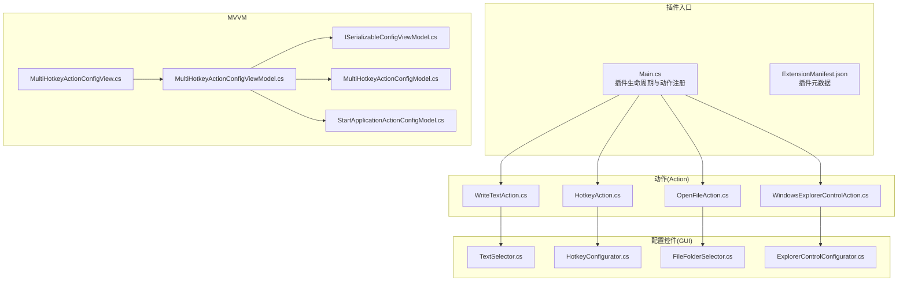
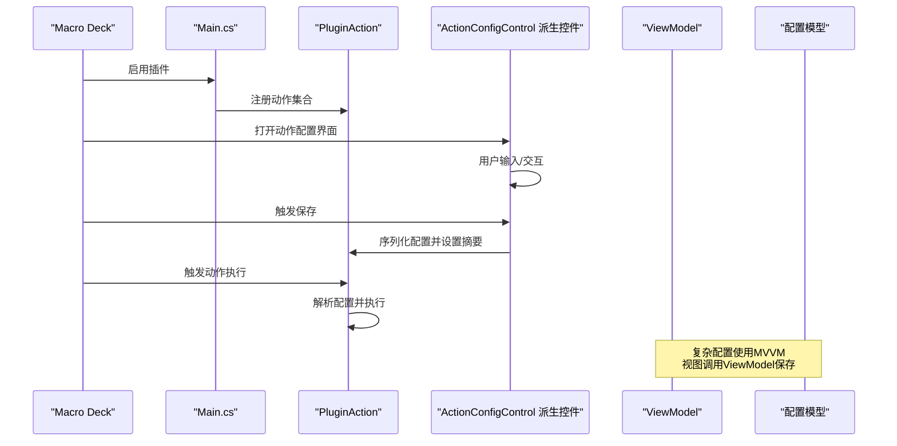
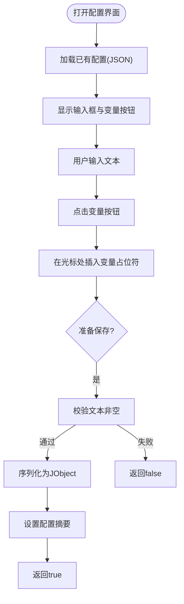
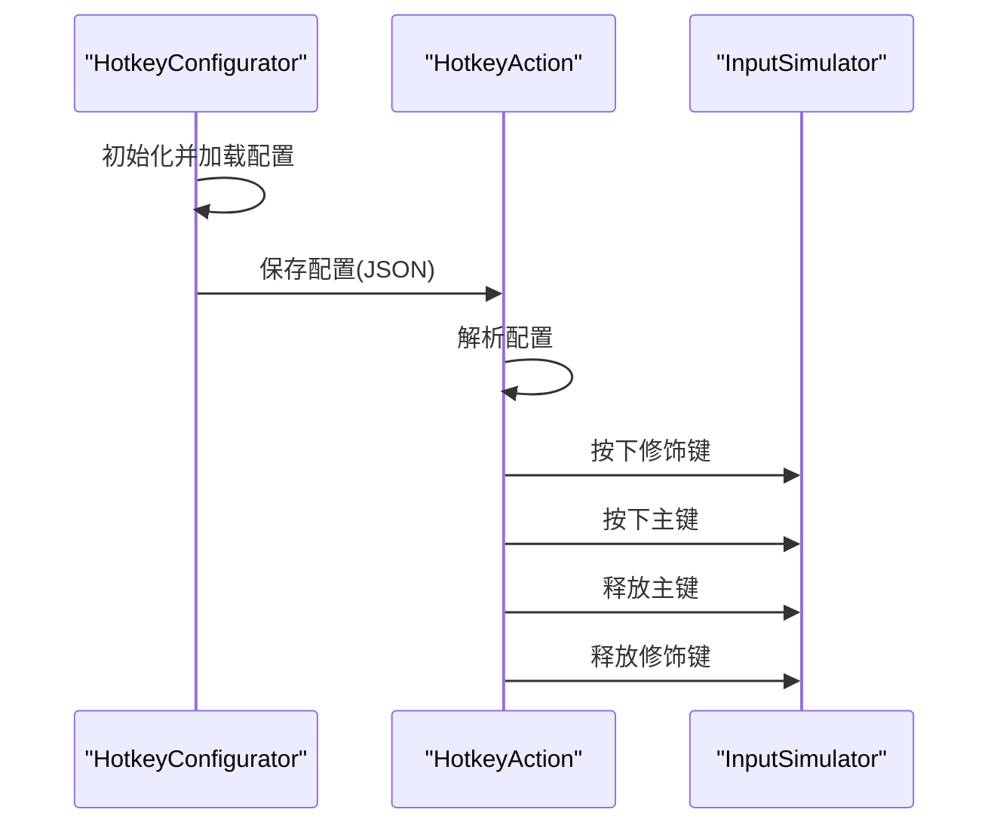
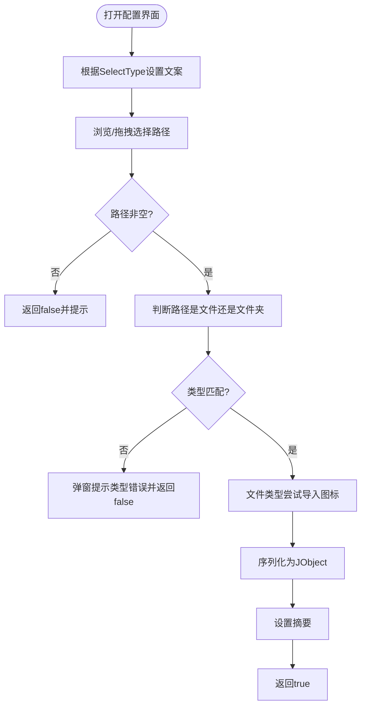
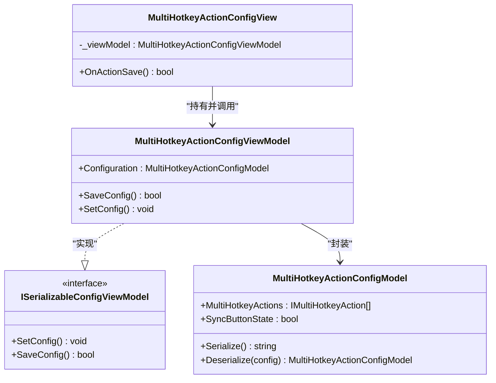
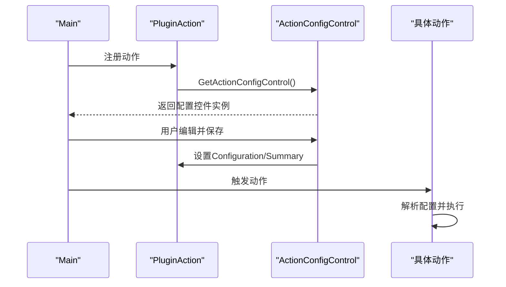
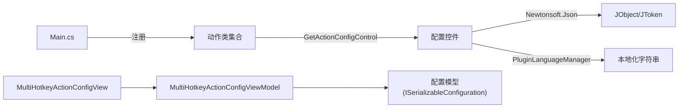

# GUI界面集成

<cite>
**本文引用的文件**
- [Main.cs](file://Main.cs)
- [ExtensionManifest.json](file://ExtensionManifest.json)
- [Actions/WriteTextAction.cs](file://Actions/WriteTextAction.cs)
- [Actions/HotkeyAction.cs](file://Actions/HotkeyAction.cs)
- [Actions/OpenFileAction.cs](file://Actions/OpenFileAction.cs)
- [Actions/WindowsExplorerControlAction.cs](file://Actions/WindowsExplorerControlAction.cs)
- [GUI/TextSelector.cs](file://GUI/TextSelector.cs)
- [GUI/HotkeyConfigurator.cs](file://GUI/HotkeyConfigurator.cs)
- [GUI/FileFolderSelector.cs](file://GUI/FileFolderSelector.cs)
- [GUI/ExplorerControlConfigurator.cs](file://GUI/ExplorerControlConfigurator.cs)
- [Views/MultiHotkeyActionConfigView.cs](file://Views/MultiHotkeyActionConfigView.cs)
- [ViewModels/MultiHotkeyActionConfigViewModel.cs](file://ViewModels/MultiHotkeyActionConfigViewModel.cs)
- [ViewModels/ISerializableConfigViewModel.cs](file://ViewModels/ISerializableConfigViewModel.cs)
- [Models/MultiHotkeyActionConfigModel.cs](file://Models/MultiHotkeyActionConfigModel.cs)
- [Models/StartApplicationActionConfigModel.cs](file://Models/StartApplicationActionConfigModel.cs)
- [Resources/Languages/English.xml](file://Resources/Languages/English.xml)
</cite>

## 目录
1. [简介](#简介)
2. [项目结构](#项目结构)
3. [核心组件](#核心组件)
4. [架构总览](#架构总览)
5. [详细组件分析](#详细组件分析)
6. [依赖关系分析](#依赖关系分析)
7. [性能考量](#性能考量)
8. [故障排除指南](#故障排除指南)
9. [结论](#结论)
10. [附录](#附录)

## 简介
本指南聚焦于该Macro Deck插件的GUI界面集成，围绕ActionConfigControl基类的使用展开，系统讲解以下内容：
- 如何通过PluginAction.GetActionConfigControl返回对应的配置控件
- 自定义控件的开发模式：用户输入处理、实时验证与状态反馈
- 典型控件实现示例：TextSelector（文本输入）、HotkeyConfigurator（热键配置）、FileFolderSelector（文件/文件夹选择）
- MVVM模式在配置界面中的应用：ViewModel与View的绑定机制
- 用户体验与无障碍访问的实践建议

## 项目结构
该项目采用“动作(Action)+配置控件(GUI)+视图/视图模型(Views/ViewModels)+模型(Models)”分层组织，核心入口为插件主类，动作类负责声明配置UI并通过GetActionConfigControl返回具体控件；GUI层提供可复用的ActionConfigControl派生控件；对于复杂场景引入MVVM以分离关注点。

图表来源
- [Main.cs:28-58](file://Main.cs#L28-L58)
- [Actions/WriteTextAction.cs:47-50](file://Actions/WriteTextAction.cs#L47-L50)
- [Actions/HotkeyAction.cs:24-27](file://Actions/HotkeyAction.cs#L24-L27)
- [Actions/OpenFileAction.cs:42-45](file://Actions/OpenFileAction.cs#L42-L45)
- [Actions/WindowsExplorerControlAction.cs:22-25](file://Actions/WindowsExplorerControlAction.cs#L22-L25)
- [Views/MultiHotkeyActionConfigView.cs:12-26](file://Views/MultiHotkeyActionConfigView.cs#L12-L26)
- [ViewModels/MultiHotkeyActionConfigViewModel.cs:30-54](file://ViewModels/MultiHotkeyActionConfigViewModel.cs#L30-L54)

章节来源
- [Main.cs:28-58](file://Main.cs#L28-L58)
- [ExtensionManifest.json:1-11](file://ExtensionManifest.json#L1-L11)

## 核心组件
- ActionConfigControl基类：所有配置控件均继承自该基类，统一提供OnActionSave保存逻辑与设计器生成的InitializeComponent初始化流程。
- PluginAction：每个动作类声明CanConfigure=true并重写GetActionConfigControl返回对应配置控件实例。
- 配置控件：TextSelector、HotkeyConfigurator、FileFolderSelector等，负责收集用户输入、进行基础校验、序列化到PluginAction.Configuration并设置ConfigurationSummary。
- MVVM视图与视图模型：MultiHotkeyActionConfigView作为视图承载UI，MultiHotkeyActionConfigViewModel封装配置模型与保存逻辑，通过ISerializableConfigViewModel接口约束序列化契约。

章节来源
- [GUI/TextSelector.cs:11-23](file://GUI/TextSelector.cs#L11-L23)
- [GUI/HotkeyConfigurator.cs:12-22](file://GUI/HotkeyConfigurator.cs#L12-L22)
- [GUI/FileFolderSelector.cs:13-45](file://GUI/FileFolderSelector.cs#L13-L45)
- [Views/MultiHotkeyActionConfigView.cs:8-26](file://Views/MultiHotkeyActionConfigView.cs#L8-L26)
- [ViewModels/MultiHotkeyActionConfigViewModel.cs:9-54](file://ViewModels/MultiHotkeyActionConfigViewModel.cs#L9-L54)

## 架构总览
下图展示从插件启用到动作触发的完整链路，以及配置控件如何参与配置保存与摘要生成。

图表来源
- [Main.cs:28-58](file://Main.cs#L28-L58)
- [Actions/WriteTextAction.cs:47-50](file://Actions/WriteTextAction.cs#L47-L50)
- [GUI/TextSelector.cs:25-41](file://GUI/TextSelector.cs#L25-L41)
- [Views/MultiHotkeyActionConfigView.cs:23-26](file://Views/MultiHotkeyActionConfigView.cs#L23-L26)
- [ViewModels/MultiHotkeyActionConfigViewModel.cs:36-54](file://ViewModels/MultiHotkeyActionConfigViewModel.cs#L36-L54)

## 详细组件分析

### TextSelector 文本输入控件
- 职责：提供文本输入框与变量插入功能，支持占位符提示与变量上下文菜单。
- 输入处理：加载配置时解析JSON并填充文本框；保存时校验非空，序列化为JObject并设置Configuration与ConfigurationSummary。
- 实时验证与反馈：保存阶段返回布尔值指示是否成功；语言资源通过PluginLanguageManager注入本地化文本。
- 变量插入：点击按钮弹出变量列表，根据当前光标位置插入形如{变量名}的占位符。

图表来源
- [GUI/TextSelector.cs:25-50](file://GUI/TextSelector.cs#L25-L50)
- [GUI/TextSelector.cs:53-75](file://GUI/TextSelector.cs#L53-L75)

章节来源
- [GUI/TextSelector.cs:11-77](file://GUI/TextSelector.cs#L11-L77)
- [Actions/WriteTextAction.cs:22-45](file://Actions/WriteTextAction.cs#L22-L45)

### HotkeyConfigurator 热键配置控件
- 职责：配置修饰键与主键，支持枚举项填充与本地化链接。
- 输入处理：初始化时填充虚拟键枚举；加载配置时还原各修饰键与主键状态；保存时构建JObject并生成可读摘要。
- 实时验证与反馈：主键非空时才保存；提供外部文档链接帮助用户选择键码。
- 触发行为：由HotkeyAction在Trigger中解析配置，逐个按下/释放修饰键与主键，模拟组合键。

图表来源
- [GUI/HotkeyConfigurator.cs:24-53](file://GUI/HotkeyConfigurator.cs#L24-L53)
- [Actions/HotkeyAction.cs:29-111](file://Actions/HotkeyAction.cs#L29-L111)

章节来源
- [GUI/HotkeyConfigurator.cs:12-96](file://GUI/HotkeyConfigurator.cs#L12-L96)
- [Actions/HotkeyAction.cs:15-113](file://Actions/HotkeyAction.cs#L15-L113)

### FileFolderSelector 文件/文件夹选择控件
- 职责：支持文件或文件夹路径选择，拖拽支持，类型校验与摘要生成。
- 输入处理：根据SelectType区分文件/文件夹；打开对话框或FolderBrowserDialog；拖拽事件处理。
- 实时验证与反馈：保存前检查路径是否存在且类型匹配；对文件类型自动尝试导入图标；错误时弹窗提示。
- 触发行为：OpenFileAction在Trigger中使用Shell启动目标路径。

图表来源
- [GUI/FileFolderSelector.cs:65-117](file://GUI/FileFolderSelector.cs#L65-L117)
- [GUI/FileFolderSelector.cs:134-179](file://GUI/FileFolderSelector.cs#L134-L179)
- [Actions/OpenFileAction.cs:20-40](file://Actions/OpenFileAction.cs#L20-L40)

章节来源
- [GUI/FileFolderSelector.cs:13-189](file://GUI/FileFolderSelector.cs#L13-L189)
- [Actions/OpenFileAction.cs:12-47](file://Actions/OpenFileAction.cs#L12-L47)

### MVVM 模式：多热键配置视图与视图模型
- 视图：MultiHotkeyActionConfigView继承ActionConfigControl，构造时创建ViewModel并委托保存。
- 视图模型：MultiHotkeyActionConfigViewModel实现ISerializableConfigViewModel，封装配置模型（MultiHotkeyActionConfigModel），负责反序列化、保存与日志记录。
- 绑定机制：视图仅负责UI生命周期与调用ViewModel.SaveConfig；配置模型通过Json序列化/反序列化与PluginAction.Configuration互通。

图表来源
- [Views/MultiHotkeyActionConfigView.cs:8-26](file://Views/MultiHotkeyActionConfigView.cs#L8-L26)
- [ViewModels/MultiHotkeyActionConfigViewModel.cs:9-54](file://ViewModels/MultiHotkeyActionConfigViewModel.cs#L9-L54)
- [ViewModels/ISerializableConfigViewModel.cs:5-12](file://ViewModels/ISerializableConfigViewModel.cs#L5-L12)
- [Models/MultiHotkeyActionConfigModel.cs:6-21](file://Models/MultiHotkeyActionConfigModel.cs#L6-L21)

章节来源
- [Views/MultiHotkeyActionConfigView.cs:1-28](file://Views/MultiHotkeyActionConfigView.cs#L1-L28)
- [ViewModels/MultiHotkeyActionConfigViewModel.cs:1-56](file://ViewModels/MultiHotkeyActionConfigViewModel.cs#L1-L56)
- [ViewModels/ISerializableConfigViewModel.cs:1-13](file://ViewModels/ISerializableConfigViewModel.cs#L1-L13)
- [Models/MultiHotkeyActionConfigModel.cs:1-22](file://Models/MultiHotkeyActionConfigModel.cs#L1-L22)

### 动作与配置控件的协作
- 插件启用时注册多个动作，每个动作通过GetActionConfigControl返回其专属配置控件。
- 配置控件在OnActionSave中完成序列化与摘要设置，供动作在Trigger阶段使用。

图表来源
- [Main.cs:31-50](file://Main.cs#L31-L50)
- [Actions/WriteTextAction.cs:47-50](file://Actions/WriteTextAction.cs#L47-L50)
- [Actions/HotkeyAction.cs:24-27](file://Actions/HotkeyAction.cs#L24-L27)
- [Actions/OpenFileAction.cs:42-45](file://Actions/OpenFileAction.cs#L42-L45)
- [Actions/WindowsExplorerControlAction.cs:22-25](file://Actions/WindowsExplorerControlAction.cs#L22-L25)

章节来源
- [Main.cs:28-58](file://Main.cs#L28-L58)
- [Actions/WriteTextAction.cs:14-51](file://Actions/WriteTextAction.cs#L14-L51)
- [Actions/HotkeyAction.cs:15-113](file://Actions/HotkeyAction.cs#L15-L113)
- [Actions/OpenFileAction.cs:12-47](file://Actions/OpenFileAction.cs#L12-L47)
- [Actions/WindowsExplorerControlAction.cs:12-38](file://Actions/WindowsExplorerControlAction.cs#L12-L38)

## 依赖关系分析
- 插件主类Main在Enable中注册动作集合，动作类通过GetActionConfigControl返回各自配置控件。
- 配置控件依赖JSON序列化库Newtonsoft.Json进行配置对象的读写。
- 控件与语言资源解耦，通过PluginLanguageManager集中管理本地化字符串。
- MVVM路径中，视图模型依赖ISerializableConfiguration接口契约，确保配置的序列化/反序列化一致性。

图表来源
- [Main.cs:31-50](file://Main.cs#L31-L50)
- [GUI/TextSelector.cs:1-77](file://GUI/TextSelector.cs#L1-L77)
- [GUI/HotkeyConfigurator.cs:1-96](file://GUI/HotkeyConfigurator.cs#L1-L96)
- [GUI/FileFolderSelector.cs:1-189](file://GUI/FileFolderSelector.cs#L1-L189)
- [Views/MultiHotkeyActionConfigView.cs:1-28](file://Views/MultiHotkeyActionConfigView.cs#L1-L28)
- [ViewModels/MultiHotkeyActionConfigViewModel.cs:1-56](file://ViewModels/MultiHotkeyActionConfigViewModel.cs#L1-L56)
- [ViewModels/ISerializableConfigViewModel.cs:1-13](file://ViewModels/ISerializableConfigViewModel.cs#L1-L13)
- [Models/MultiHotkeyActionConfigModel.cs:1-22](file://Models/MultiHotkeyActionConfigModel.cs#L1-L22)

章节来源
- [Main.cs:28-58](file://Main.cs#L28-L58)
- [ViewModels/ISerializableConfigViewModel.cs:5-12](file://ViewModels/ISerializableConfigViewModel.cs#L5-L12)

## 性能考量
- 配置保存：控件在OnActionSave中进行轻量级校验与序列化，避免在UI线程执行耗时操作。
- 触发执行：热键动作在触发时进行键按下/释放的短时延迟，确保兼容性；其他动作尽量使用系统API异步执行。
- 图标导入：文件选择器在保存时对文件类型尝试导入图标，建议在后台线程执行以避免阻塞UI。
- 日志记录：视图模型保存配置时记录信息与错误日志，便于定位问题但需控制日志级别以免影响性能。

## 故障排除指南
- 文本输入为空：TextSelector在保存时若文本为空会返回false，检查用户输入与占位符逻辑。
- 路径类型不匹配：FileFolderSelector在保存时校验路径类型，若选择错误类型会弹窗提示并返回false。
- 热键主键为空：HotkeyConfigurator仅在主键非空时保存配置，确保用户选择了有效键。
- 配置解析异常：动作在Trigger中解析配置时可能抛出异常，应捕获并记录日志以便排查。

章节来源
- [GUI/TextSelector.cs:27-41](file://GUI/TextSelector.cs#L27-L41)
- [GUI/FileFolderSelector.cs:67-117](file://GUI/FileFolderSelector.cs#L67-L117)
- [GUI/HotkeyConfigurator.cs:41-53](file://GUI/HotkeyConfigurator.cs#L41-L53)
- [ViewModels/MultiHotkeyActionConfigViewModel.cs:43-47](file://ViewModels/MultiHotkeyActionConfigViewModel.cs#L43-L47)

## 结论
本项目通过ActionConfigControl基类实现了统一的配置界面框架，配合PluginAction的GetActionConfigControl机制，使每个动作都能提供直观、一致的配置体验。对于复杂配置场景，MVVM模式有效分离了视图与业务逻辑，提升了可维护性与可测试性。通过本地化资源与清晰的错误反馈，显著改善了用户体验与可访问性。

## 附录
- 语言资源：English.xml提供动作名称与描述的本地化字符串，控件通过PluginLanguageManager注入。
- 插件清单：ExtensionManifest.json定义插件类型、包标识、版本与DLL名称，确保Macro Deck正确加载插件。

章节来源
- [Resources/Languages/English.xml:1-21](file://Resources/Languages/English.xml#L1-L21)
- [ExtensionManifest.json:1-11](file://ExtensionManifest.json#L1-L11)