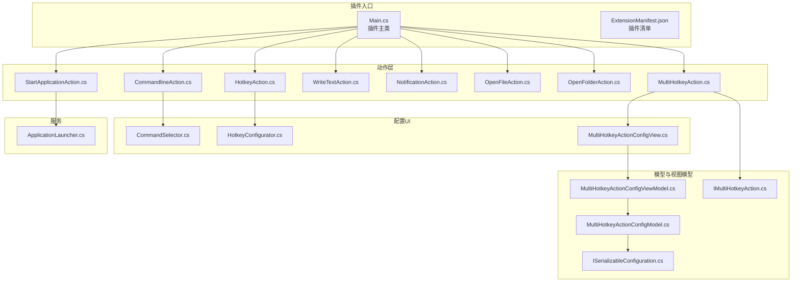
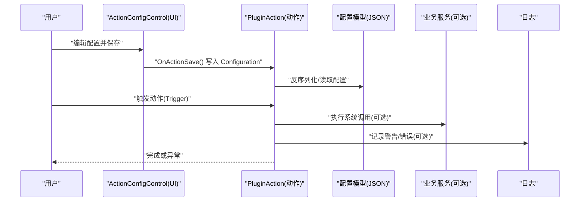
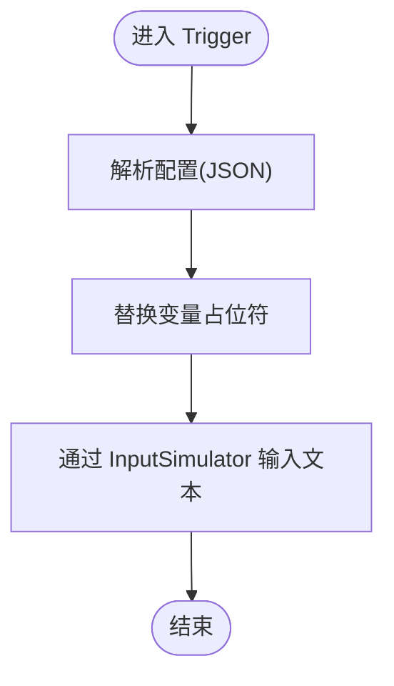
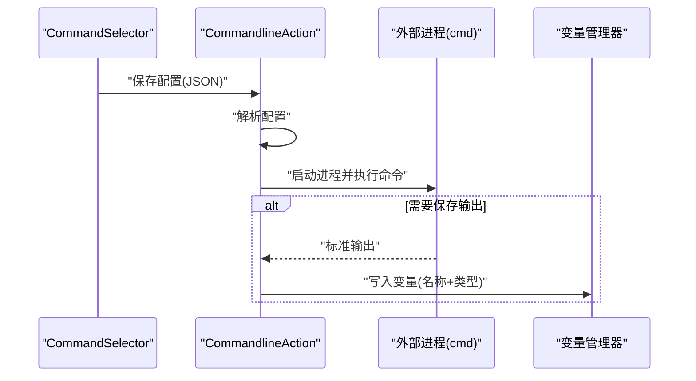
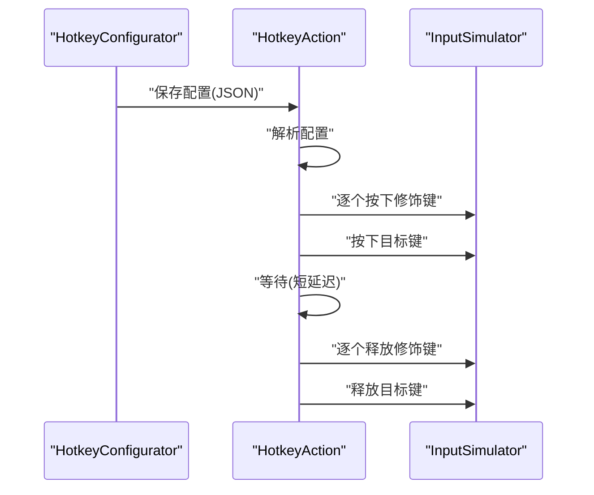
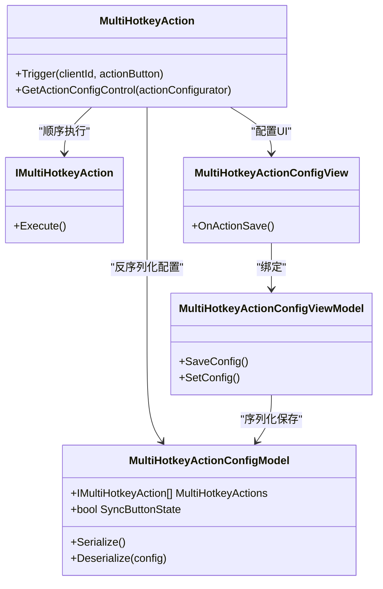
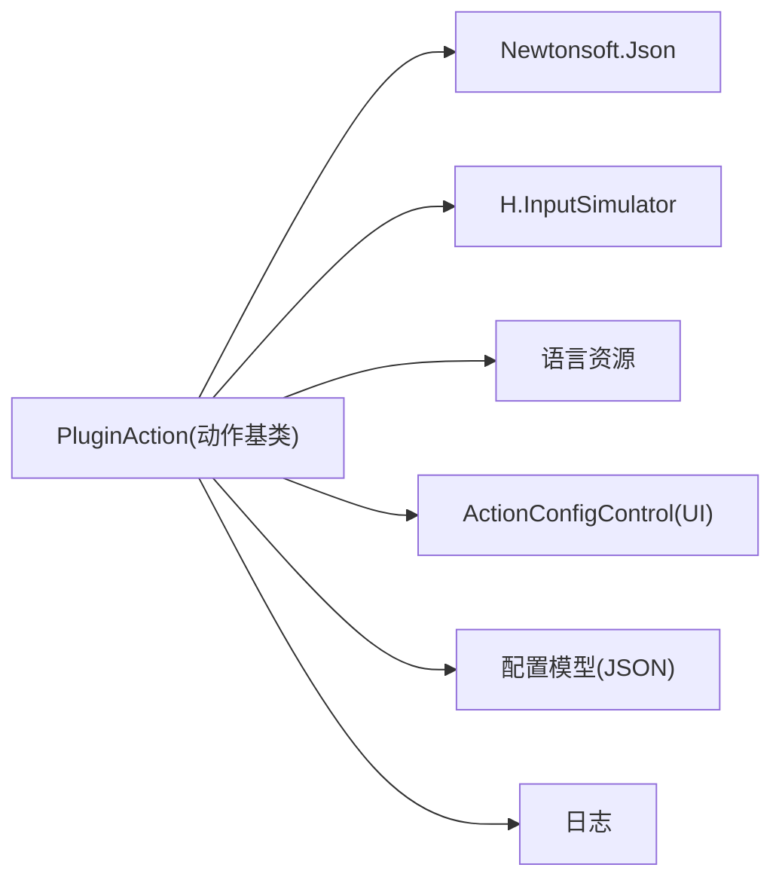

# 动作类开发

<cite>
**本文引用的文件**
- [Main.cs](file://Main.cs)
- [ExtensionManifest.json](file://ExtensionManifest.json)
- [CommandlineAction.cs](file://Actions/CommandlineAction.cs)
- [HotkeyAction.cs](file://Actions/HotkeyAction.cs)
- [MultiHotkeyAction.cs](file://Actions/MultiHotkeyAction.cs)
- [WriteTextAction.cs](file://Actions/WriteTextAction.cs)
- [NotificationAction.cs](file://Actions/NotificationAction.cs)
- [OpenFileAction.cs](file://Actions/OpenFileAction.cs)
- [OpenFolderAction.cs](file://Actions/OpenFolderAction.cs)
- [StartApplicationAction.cs](file://Actions/StartApplicationAction.cs)
- [CommandSelector.cs](file://GUI/CommandSelector.cs)
- [HotkeyConfigurator.cs](file://GUI/HotkeyConfigurator.cs)
- [MultiHotkeyActionConfigView.cs](file://Views/MultiHotkeyActionConfigView.cs)
- [MultiHotkeyActionConfigModel.cs](file://Models/MultiHotkeyActionConfigModel.cs)
- [MultiHotkeyActionConfigViewModel.cs](file://ViewModels/MultiHotkeyActionConfigViewModel.cs)
- [ISerializableConfiguration.cs](file://Models/ISerializableConfiguration.cs)
- [IMultiHotkeyAction.cs](file://Models/IMultiHotkeyAction.cs)
- [ApplicationLauncher.cs](file://Services/ApplicationLauncher.cs)
- [README.md](file://README.md)
</cite>

## 目录
1. [简介](#简介)
2. [项目结构](#项目结构)
3. [核心组件](#核心组件)
4. [架构总览](#架构总览)
5. [详细组件分析](#详细组件分析)
6. [依赖分析](#依赖分析)
7. [性能考虑](#性能考虑)
8. [故障排查指南](#故障排查指南)
9. [结论](#结论)
10. [附录](#附录)

## 简介
本指南面向希望在 Macro Deck 插件中开发“动作类”的开发者，基于现有 Windows Utils 插件仓库，系统讲解如何继承 PluginAction 基类创建自定义动作，涵盖以下主题：
- 继承 PluginAction 创建动作类，实现名称、描述、可配置性与触发逻辑
- 配置模型的定义与序列化/反序列化
- UI 控件与配置视图的集成
- 不同类型动作的开发模式：简单动作、带配置的动作、复杂交互动作
- 生命周期管理、错误处理与性能优化策略
- 测试方法与调试技巧

## 项目结构
该仓库采用按功能模块划分的组织方式：
- Actions：动作类集合（每个动作类负责一个具体操作）
- GUI：动作配置界面控件（用于收集用户输入）
- Views：MVVM 视图包装器（绑定 ViewModel 并保存配置）
- Models：配置模型与序列化接口
- ViewModels：MVVM 的视图模型（封装配置读写与保存）
- Services：业务服务（如应用启动、窗口控制等）
- Utils：通用工具（图标、窗口激活等）
- Language：本地化资源与语言管理
- 根目录：插件入口 Main 类与清单文件

图表来源
- [Main.cs:28-58](file://Main.cs#L28-L58)
- [ExtensionManifest.json:1-11](file://ExtensionManifest.json#L1-L11)
- [CommandlineAction.cs:14-64](file://Actions/CommandlineAction.cs#L14-L64)
- [HotkeyAction.cs:15-113](file://Actions/HotkeyAction.cs#L15-L113)
- [MultiHotkeyAction.cs:11-57](file://Actions/MultiHotkeyAction.cs#L11-L57)
- [WriteTextAction.cs:14-52](file://Actions/WriteTextAction.cs#L14-L52)
- [NotificationAction.cs:14-48](file://Actions/NotificationAction.cs#L14-L48)
- [OpenFileAction.cs:12-46](file://Actions/OpenFileAction.cs#L12-L46)
- [OpenFolderAction.cs:14-48](file://Actions/OpenFolderAction.cs#L14-L48)
- [StartApplicationAction.cs:14-36](file://Actions/StartApplicationAction.cs#L14-L36)
- [CommandSelector.cs:12-144](file://GUI/CommandSelector.cs#L12-L144)
- [HotkeyConfigurator.cs:12-96](file://GUI/HotkeyConfigurator.cs#L12-L96)
- [MultiHotkeyActionConfigView.cs:8-28](file://Views/MultiHotkeyActionConfigView.cs#L8-L28)
- [MultiHotkeyActionConfigModel.cs:6-22](file://Models/MultiHotkeyActionConfigModel.cs#L6-L22)
- [MultiHotkeyActionConfigViewModel.cs:9-56](file://ViewModels/MultiHotkeyActionConfigViewModel.cs#L9-L56)
- [ISerializableConfiguration.cs:5-12](file://Models/ISerializableConfiguration.cs#L5-L12)
- [IMultiHotkeyAction.cs:3-9](file://Models/IMultiHotkeyAction.cs#L3-L9)
- [ApplicationLauncher.cs:13-165](file://Services/ApplicationLauncher.cs#L13-L165)

章节来源
- [Main.cs:14-59](file://Main.cs#L14-L59)
- [ExtensionManifest.json:1-11](file://ExtensionManifest.json#L1-L11)

## 核心组件
- 插件入口 Main：注册所有动作，初始化语言与定时器
- 动作基类 PluginAction：所有动作类的父类，需实现 Name、Description、CanConfigure、Trigger、GetActionConfigControl 等
- 配置模型与序列化接口：通过 JSON 序列化存储配置；支持默认值与空配置安全反序列化
- UI 控件与视图：ActionConfigControl 子类负责收集用户输入，保存为 JSON 字符串
- MVVM 视图包装器：将 ViewModel 与视图绑定，统一保存流程
- 服务层：封装系统调用（如应用启动、窗口控制）

章节来源
- [Main.cs:28-58](file://Main.cs#L28-L58)
- [ISerializableConfiguration.cs:5-12](file://Models/ISerializableConfiguration.cs#L5-L12)
- [MultiHotkeyActionConfigModel.cs:6-22](file://Models/MultiHotkeyActionConfigModel.cs#L6-L22)
- [MultiHotkeyActionConfigViewModel.cs:9-56](file://ViewModels/MultiHotkeyActionConfigViewModel.cs#L9-L56)
- [MultiHotkeyActionConfigView.cs:8-28](file://Views/MultiHotkeyActionConfigView.cs#L8-L28)

## 架构总览
下图展示了从按钮触发到动作执行、配置收集与持久化的整体流程。

图表来源
- [CommandSelector.cs:46-79](file://GUI/CommandSelector.cs#L46-L79)
- [HotkeyConfigurator.cs:24-53](file://GUI/HotkeyConfigurator.cs#L24-L53)
- [MultiHotkeyActionConfigView.cs:23-26](file://Views/MultiHotkeyActionConfigView.cs#L23-L26)
- [MultiHotkeyActionConfigViewModel.cs:36-54](file://ViewModels/MultiHotkeyActionConfigViewModel.cs#L36-L54)
- [CommandlineAction.cs:22-58](file://Actions/CommandlineAction.cs#L22-L58)
- [HotkeyAction.cs:29-112](file://Actions/HotkeyAction.cs#L29-L112)
- [MultiHotkeyAction.cs:23-48](file://Actions/MultiHotkeyAction.cs#L23-L48)
- [ApplicationLauncher.cs:45-58](file://Services/ApplicationLauncher.cs#L45-L58)

## 详细组件分析

### 简单动作：文本输入 WriteTextAction
- 实现要点
  - 名称与描述由语言资源提供
  - 可配置，使用 TextSelector 配置文本
  - 触发时解析配置，替换变量占位符后通过 InputSimulator 输入文本
- 错误处理
  - 使用日志记录异常信息，避免中断
- 性能建议
  - 文本替换遍历变量列表，建议在配置阶段预处理或缓存

图表来源
- [WriteTextAction.cs:22-45](file://Actions/WriteTextAction.cs#L22-L45)

章节来源
- [WriteTextAction.cs:14-52](file://Actions/WriteTextAction.cs#L14-L52)
- [README.md:13-18](file://README.md#L13-L18)

### 带配置的动作：命令行 CommandlineAction
- 实现要点
  - 配置项：工作目录、命令、是否保存输出到变量、变量名、变量类型
  - 触发时启动 cmd 进程执行命令，必要时重定向标准输出并写入变量
  - UI 使用 CommandSelector 收集输入，支持拖拽选择工作目录
- 错误处理
  - 捕获异常并记录日志
- 性能建议
  - 异步执行外部命令，避免阻塞 UI
  - 对输出读取进行超时控制

图表来源
- [CommandSelector.cs:46-79](file://GUI/CommandSelector.cs#L46-L79)
- [CommandlineAction.cs:22-58](file://Actions/CommandlineAction.cs#L22-L58)

章节来源
- [CommandlineAction.cs:14-64](file://Actions/CommandlineAction.cs#L14-L64)
- [CommandSelector.cs:12-144](file://GUI/CommandSelector.cs#L12-L144)

### 复杂交互动作：热键 HotkeyAction
- 实现要点
  - 配置项：修饰键（Win/Ctrl/Shift/Alt 左右区分）与目标键
  - 触发时模拟按键按下/抬起序列，增加短暂延迟以提升兼容性
  - UI 使用 HotkeyConfigurator 提供可视化配置
- 错误处理
  - 捕获异常，避免崩溃
- 性能建议
  - 使用线程池或异步避免阻塞主线程
  - 谨慎使用 Thread.Sleep，可考虑更精确的延时方案

图表来源
- [HotkeyConfigurator.cs:24-53](file://GUI/HotkeyConfigurator.cs#L24-L53)
- [HotkeyAction.cs:29-112](file://Actions/HotkeyAction.cs#L29-L112)

章节来源
- [HotkeyAction.cs:15-113](file://Actions/HotkeyAction.cs#L15-L113)
- [HotkeyConfigurator.cs:12-96](file://GUI/HotkeyConfigurator.cs#L12-L96)

### 复杂交互动作：多热键序列 MultiHotkeyAction
- 实现要点
  - 配置模型包含多个 IMultiHotkeyAction 顺序执行
  - 支持同步按钮状态（执行期间切换按钮状态）
  - 执行过程可中断（stop 标志）
  - UI 通过 MultiHotkeyActionConfigView 绑定 ViewModel
- 错误处理
  - 通过 ViewModel 的 SaveConfig 记录日志
- 性能建议
  - 使用 Task.Run 并发执行，避免阻塞 UI
  - 在循环中检查 stop 标志，及时响应中断

图表来源
- [MultiHotkeyAction.cs:11-57](file://Actions/MultiHotkeyAction.cs#L11-L57)
- [MultiHotkeyActionConfigModel.cs:6-22](file://Models/MultiHotkeyActionConfigModel.cs#L6-L22)
- [IMultiHotkeyAction.cs:3-9](file://Models/IMultiHotkeyAction.cs#L3-L9)
- [MultiHotkeyActionConfigView.cs:8-28](file://Views/MultiHotkeyActionConfigView.cs#L8-L28)
- [MultiHotkeyActionConfigViewModel.cs:9-56](file://ViewModels/MultiHotkeyActionConfigViewModel.cs#L9-L56)

章节来源
- [MultiHotkeyAction.cs:11-57](file://Actions/MultiHotkeyAction.cs#L11-L57)
- [MultiHotkeyActionConfigModel.cs:6-22](file://Models/MultiHotkeyActionConfigModel.cs#L6-L22)
- [MultiHotkeyActionConfigViewModel.cs:9-56](file://ViewModels/MultiHotkeyActionConfigViewModel.cs#L9-L56)
- [MultiHotkeyActionConfigView.cs:8-28](file://Views/MultiHotkeyActionConfigView.cs#L8-L28)

### 其他常见动作
- 通知 NotificationAction：解析标题与消息，调用通知管理器显示并移除
- 打开文件/文件夹 OpenFileAction/OpenFolderAction：使用 UseShellExecute 打开路径
- 启动应用 StartApplicationAction：通过 ApplicationLauncher 启动程序，支持参数与管理员权限

章节来源
- [NotificationAction.cs:14-48](file://Actions/NotificationAction.cs#L14-L48)
- [OpenFileAction.cs:12-46](file://Actions/OpenFileAction.cs#L12-L46)
- [OpenFolderAction.cs:14-48](file://Actions/OpenFolderAction.cs#L14-L48)
- [StartApplicationAction.cs:14-36](file://Actions/StartApplicationAction.cs#L14-L36)
- [ApplicationLauncher.cs:45-58](file://Services/ApplicationLauncher.cs#L45-L58)

## 依赖分析
- 动作类依赖关系
  - 多数动作依赖 PluginAction 基类与语言资源
  - 部分动作依赖 InputSimulator 进行键盘/鼠标模拟
  - 复杂动作依赖配置模型与 UI 视图
- 外部依赖
  - Newtonsoft.Json 用于 JSON 解析与序列化
  - H.InputSimulator 用于输入模拟
  - MacroDeck SDK 提供 ActionButton、变量管理、通知等能力

图表来源
- [HotkeyAction.cs:1-11](file://Actions/HotkeyAction.cs#L1-L11)
- [CommandlineAction.cs:1-10](file://Actions/CommandlineAction.cs#L1-L10)
- [WriteTextAction.cs:1-11](file://Actions/WriteTextAction.cs#L1-L11)
- [MultiHotkeyAction.cs:1-8](file://Actions/MultiHotkeyAction.cs#L1-L8)

章节来源
- [README.md:33-40](file://README.md#L33-L40)

## 性能考虑
- 异步执行
  - 外部命令、网络请求、文件操作应异步执行，避免阻塞 UI
- 资源释放
  - 进程对象、句柄等应及时释放
- 日志与诊断
  - 使用日志记录关键路径与异常，便于定位性能瓶颈
- UI 响应
  - 长耗时任务使用后台线程，必要时提供进度反馈
- 输入模拟
  - 减少不必要的按键重复与过长延迟，确保兼容性同时保持低开销

## 故障排查指南
- 配置未生效
  - 检查 UI 的 OnActionSave 是否正确写入 Configuration
  - 确认动作的 Trigger 是否解析了 Configuration
- 异常与崩溃
  - 使用 try/catch 包裹关键逻辑，并记录日志
  - 对外部进程输出读取设置超时，避免卡死
- 输入模拟失败
  - 检查修饰键与目标键映射是否正确
  - 调整按键按下/抬起之间的延迟
- 多热键序列中断
  - 确保 stop 标志在中断时被正确设置与复位
- 应用启动问题
  - 检查路径有效性与管理员权限需求
  - 使用 ApplicationLauncher 的辅助方法判断运行状态

章节来源
- [CommandlineAction.cs:54-57](file://Actions/CommandlineAction.cs#L54-L57)
- [WriteTextAction.cs:40-44](file://Actions/WriteTextAction.cs#L40-L44)
- [HotkeyAction.cs:109-111](file://Actions/HotkeyAction.cs#L109-L111)
- [MultiHotkeyAction.cs:27-46](file://Actions/MultiHotkeyAction.cs#L27-L46)
- [ApplicationLauncher.cs:60-80](file://Services/ApplicationLauncher.cs#L60-L80)

## 结论
通过本指南，你可以基于 PluginAction 快速开发三类动作：
- 简单动作：直接在 Trigger 中执行逻辑
- 带配置的动作：通过 UI 收集配置并持久化为 JSON
- 复杂交互动作：结合配置模型、UI 视图与服务层，实现多步骤、可中断的流程

遵循本文的生命周期管理、错误处理与性能优化建议，可显著提升动作的稳定性与用户体验。

## 附录
- 开发步骤建议
  - 定义动作类并实现 Name/Description/CanConfigure/Trigger
  - 如需配置，创建 UI 控件并在 GetActionConfigControl 返回
  - 设计配置模型并实现序列化接口，确保空配置安全
  - 使用 MVVM 视图包装器统一保存流程
  - 编写日志记录与异常处理
  - 进行单元测试与端到端测试，验证配置与执行链路
- 调试技巧
  - 使用日志输出关键路径与中间结果
  - 对外部命令输出进行截断打印，避免日志过大
  - 在 UI 层添加最小化验证，提前发现配置错误
  - 对输入模拟动作进行小范围回归测试，确保兼容性