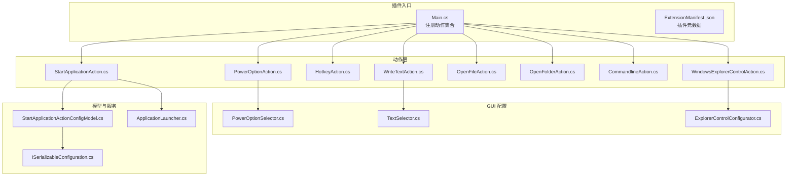
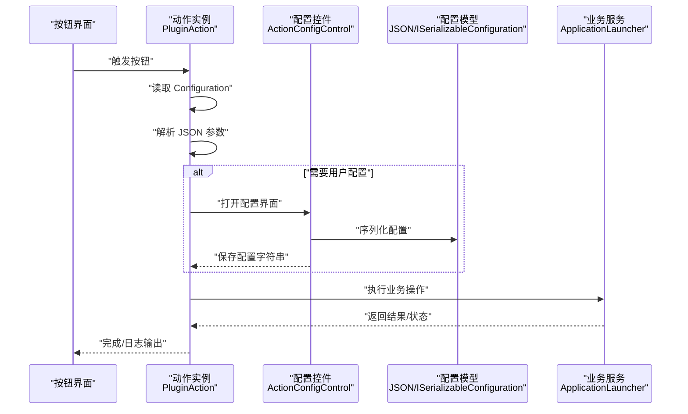
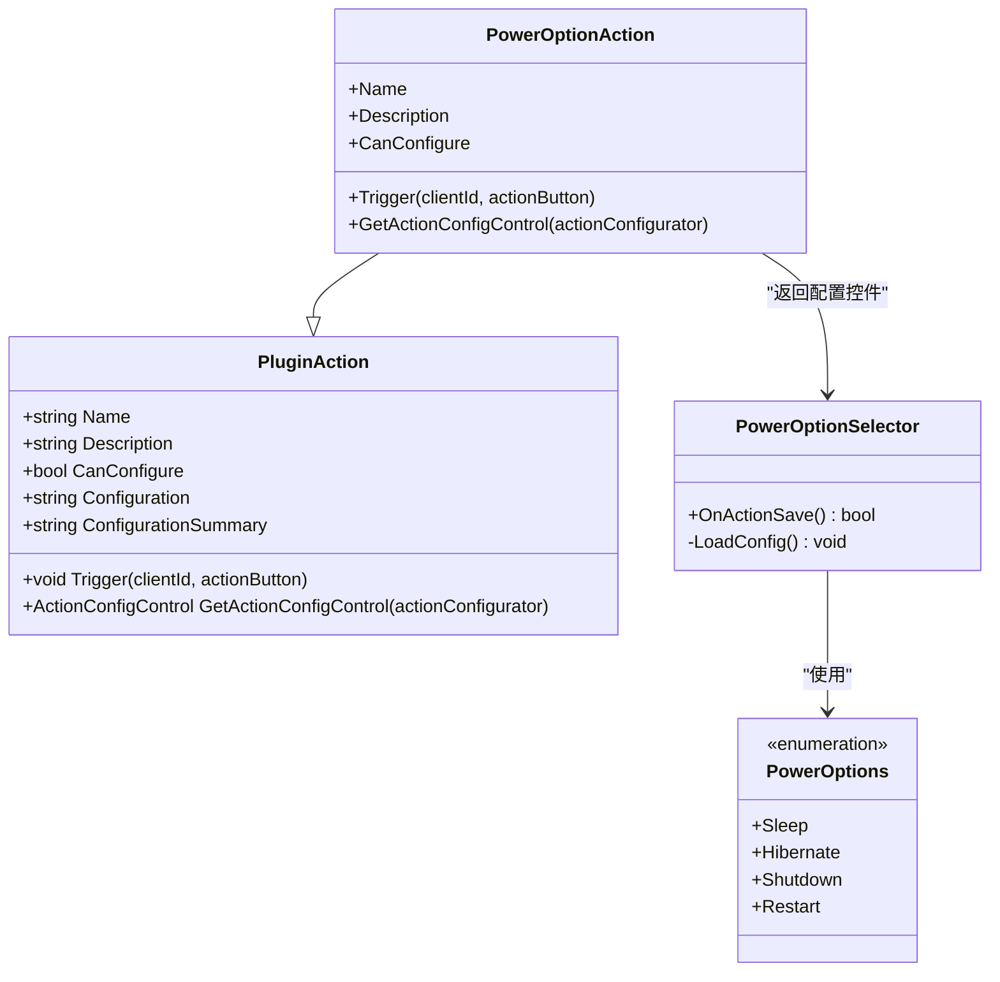
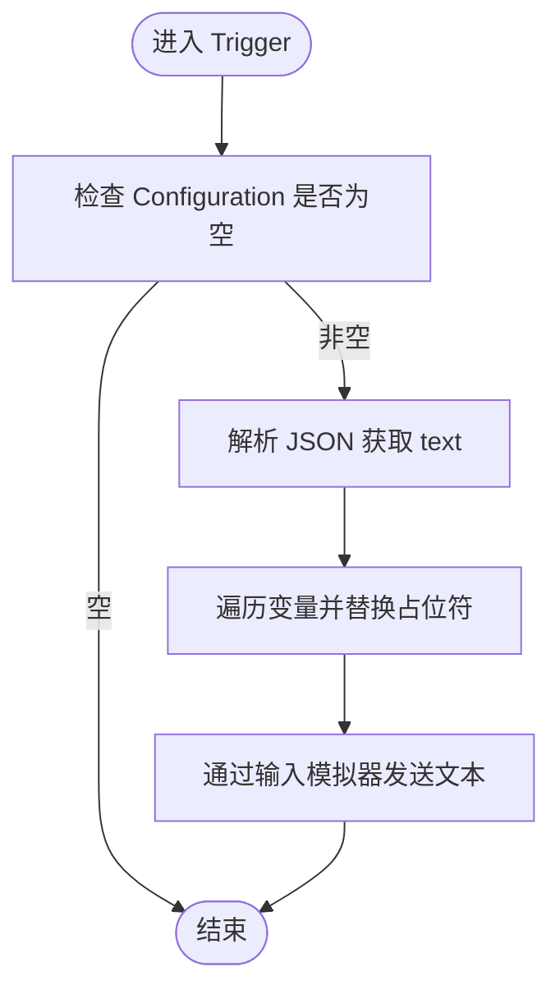
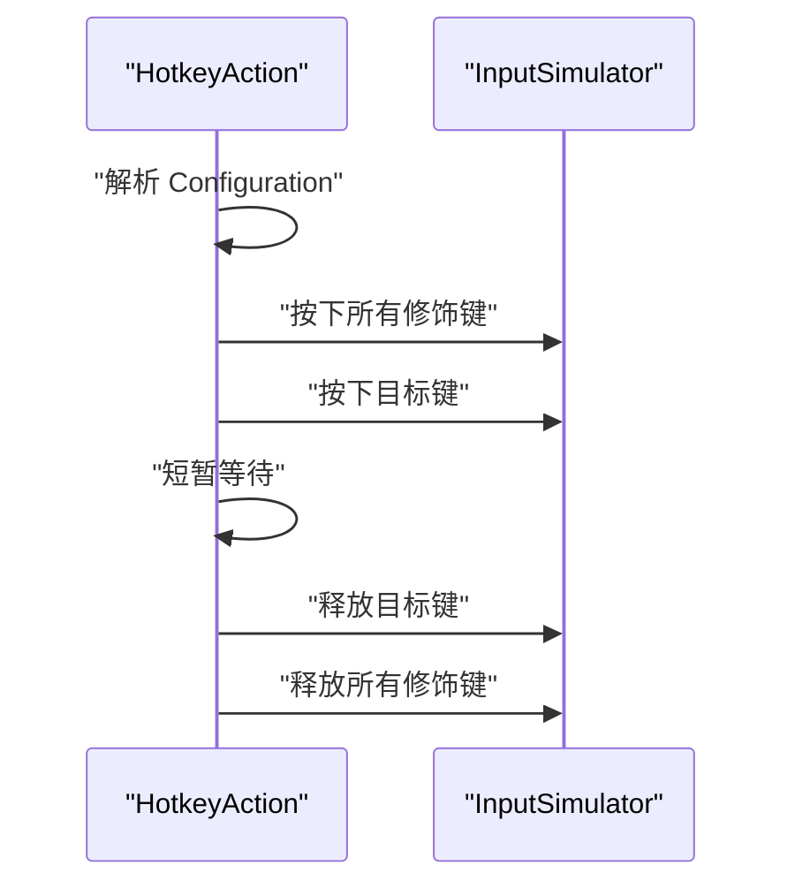
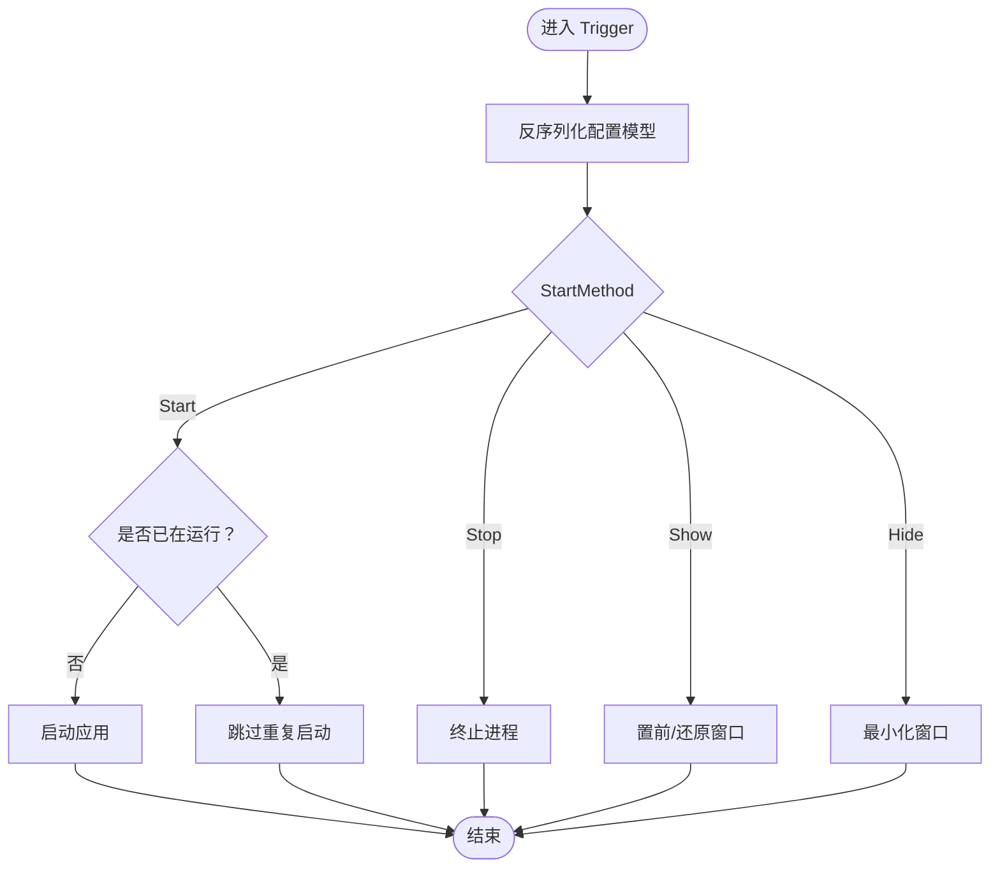
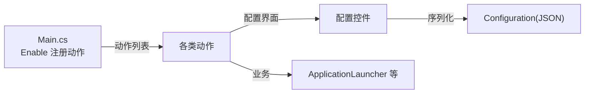

# 基础动作创建

<cite>
**本文引用的文件**
- [PowerOptionAction.cs](file://Actions/PowerOptionAction.cs)
- [Main.cs](file://Main.cs)
- [ExtensionManifest.json](file://ExtensionManifest.json)
- [PowerOptionSelector.cs](file://GUI/PowerOptionSelector.cs)
- [TextSelector.cs](file://GUI/TextSelector.cs)
- [WriteTextAction.cs](file://Actions/WriteTextAction.cs)
- [HotkeyAction.cs](file://Actions/HotkeyAction.cs)
- [StartApplicationAction.cs](file://Actions/StartApplicationAction.cs)
- [StartApplicationActionConfigModel.cs](file://Models/StartApplicationActionConfigModel.cs)
- [ISerializableConfiguration.cs](file://Models/ISerializableConfiguration.cs)
- [ApplicationLauncher.cs](file://Services/ApplicationLauncher.cs)
- [OpenFileAction.cs](file://Actions/OpenFileAction.cs)
- [OpenFolderAction.cs](file://Actions/OpenFolderAction.cs)
- [CommandlineAction.cs](file://Actions/CommandlineAction.cs)
- [WindowsExplorerControlAction.cs](file://Actions/WindowsExplorerControlAction.cs)
- [ExplorerControlConfigurator.cs](file://GUI/ExplorerControlConfigurator.cs)
- [README.md](file://README.md)
</cite>

## 目录
1. [简介](#简介)
2. [项目结构](#项目结构)
3. [核心组件](#核心组件)
4. [架构总览](#架构总览)
5. [详细组件分析](#详细组件分析)
6. [依赖关系分析](#依赖关系分析)
7. [性能考虑](#性能考虑)
8. [故障排查指南](#故障排查指南)
9. [结论](#结论)
10. [附录](#附录)

## 简介
本指南面向希望在 Macro Deck 插件生态中开发“基础动作（PluginAction）”的开发者，系统讲解如何继承 PluginAction 基类，实现必要属性与方法（Name、Description、CanConfigure、Trigger），以及如何规范地实现 Execute 模式（参数解析、异常捕获、日志记录）。文档以仓库中的现有动作为范例，提供可复用的实现模板与最佳实践，并解释动作的生命周期与触发机制。

## 项目结构
该插件采用按功能分层的组织方式：
- Actions：存放具体动作类，每个动作类负责一个独立的功能点
- GUI：存放动作配置界面控件，用于收集用户输入并序列化到 Configuration
- Models：存放可序列化的配置模型，支持 JSON 序列化/反序列化
- Services：存放业务服务（如应用启动器）
- 根目录：插件入口 Main 类注册所有动作，扩展清单声明插件元数据

图表来源
- [Main.cs:28-58](file://Main.cs#L28-L58)
- [PowerOptionAction.cs:14-61](file://Actions/PowerOptionAction.cs#L14-L61)
- [WriteTextAction.cs:14-51](file://Actions/WriteTextAction.cs#L14-L51)
- [HotkeyAction.cs:15-112](file://Actions/HotkeyAction.cs#L15-L112)
- [StartApplicationAction.cs:14-36](file://Actions/StartApplicationAction.cs#L14-L36)
- [OpenFileAction.cs:12-46](file://Actions/OpenFileAction.cs#L12-L46)
- [OpenFolderAction.cs:14-48](file://Actions/OpenFolderAction.cs#L14-L48)
- [CommandlineAction.cs:14-36](file://Actions/CommandlineAction.cs#L14-L36)
- [WindowsExplorerControlAction.cs:12-38](file://Actions/WindowsExplorerControlAction.cs#L12-L38)
- [PowerOptionSelector.cs:9-75](file://GUI/PowerOptionSelector.cs#L9-L75)
- [TextSelector.cs:11-77](file://GUI/TextSelector.cs#L11-L77)
- [ExplorerControlConfigurator.cs:9-81](file://GUI/ExplorerControlConfigurator.cs#L9-L81)
- [StartApplicationActionConfigModel.cs:6-36](file://Models/StartApplicationActionConfigModel.cs#L6-L36)
- [ISerializableConfiguration.cs:5-12](file://Models/ISerializableConfiguration.cs#L5-L12)
- [ApplicationLauncher.cs:13-165](file://Services/ApplicationLauncher.cs#L13-L165)

章节来源
- [Main.cs:28-58](file://Main.cs#L28-L58)
- [ExtensionManifest.json:1-11](file://ExtensionManifest.json#L1-L11)

## 核心组件
- PluginAction 基类：所有动作均继承自该基类，需重写 Name、Description、CanConfigure、Trigger 等成员
- 动作生命周期：
  - 配置阶段：GetActionConfigControl 返回配置界面，用户输入被序列化到 Configuration 字符串
  - 触发阶段：Trigger(clientId, actionButton) 被调用，读取 Configuration 并执行逻辑
- 典型实现模式：
  - 参数解析：使用 JSON 解析 Configuration，提取键值
  - 异常捕获：对可能失败的操作进行 try/catch 包裹
  - 日志记录：使用日志接口输出错误或警告信息
  - 配置摘要：设置 ConfigurationSummary 便于 UI 展示

章节来源
- [PowerOptionAction.cs:14-61](file://Actions/PowerOptionAction.cs#L14-L61)
- [WriteTextAction.cs:22-45](file://Actions/WriteTextAction.cs#L22-L45)
- [HotkeyAction.cs:29-111](file://Actions/HotkeyAction.cs#L29-L111)
- [PowerOptionSelector.cs:35-51](file://GUI/PowerOptionSelector.cs#L35-L51)

## 架构总览
下图展示了插件主程序、动作与配置界面之间的交互关系，以及触发时的数据流。

图表来源
- [Main.cs:31-50](file://Main.cs#L31-L50)
- [PowerOptionAction.cs:22-55](file://Actions/PowerOptionAction.cs#L22-L55)
- [PowerOptionSelector.cs:35-51](file://GUI/PowerOptionSelector.cs#L35-L51)
- [StartApplicationAction.cs:22-36](file://Actions/StartApplicationAction.cs#L22-L36)
- [ApplicationLauncher.cs:45-58](file://Services/ApplicationLauncher.cs#L45-L58)

## 详细组件分析

### PowerOptionAction：电源选项动作
- 继承 PluginAction，实现 Name、Description、CanConfigure、Trigger
- Trigger 中解析 Configuration 的 powerOption 键，根据枚举值执行休眠、Hibernate、关机或重启
- 使用日志记录异常与无效选项
- 配置界面 PowerOptionSelector 将用户选择的枚举值序列化为 JSON

图表来源
- [PowerOptionAction.cs:14-61](file://Actions/PowerOptionAction.cs#L14-L61)
- [PowerOptionSelector.cs:9-75](file://GUI/PowerOptionSelector.cs#L9-L75)
- [PowerOptionSelector.cs:69-75](file://GUI/PowerOptionSelector.cs#L69-L75)

章节来源
- [PowerOptionAction.cs:16-20](file://Actions/PowerOptionAction.cs#L16-L20)
- [PowerOptionAction.cs:22-55](file://Actions/PowerOptionAction.cs#L22-L55)
- [PowerOptionSelector.cs:35-51](file://GUI/PowerOptionSelector.cs#L35-L51)

### WriteTextAction：文本输入动作
- 从 Configuration 中读取 text，支持变量替换
- 使用输入模拟器执行键盘文本输入
- 对异常进行捕获并记录警告日志

图表来源
- [WriteTextAction.cs:22-45](file://Actions/WriteTextAction.cs#L22-L45)

章节来源
- [WriteTextAction.cs:22-45](file://Actions/WriteTextAction.cs#L22-L45)
- [TextSelector.cs:25-41](file://GUI/TextSelector.cs#L25-L41)

### HotkeyAction：热键发送动作
- 从 Configuration 中读取目标键与修饰键状态
- 通过输入模拟器依次按下/释放修饰键与目标键
- 使用延迟保证某些应用能正确识别组合键

图表来源
- [HotkeyAction.cs:29-111](file://Actions/HotkeyAction.cs#L29-L111)

章节来源
- [HotkeyAction.cs:29-111](file://Actions/HotkeyAction.cs#L29-L111)

### StartApplicationAction：启动应用动作
- 使用 StartApplicationActionConfigModel 反序列化配置
- 根据 StartMethod 决定启动、停止、显示或隐藏应用
- 通过 ApplicationLauncher 执行实际进程管理

图表来源
- [StartApplicationAction.cs:22-36](file://Actions/StartApplicationAction.cs#L22-L36)
- [StartApplicationActionConfigModel.cs:19-26](file://Models/StartApplicationActionConfigModel.cs#L19-L26)
- [ApplicationLauncher.cs:39-126](file://Services/ApplicationLauncher.cs#L39-L126)

章节来源
- [StartApplicationAction.cs:22-36](file://Actions/StartApplicationAction.cs#L22-L36)
- [StartApplicationActionConfigModel.cs:6-36](file://Models/StartApplicationActionConfigModel.cs#L6-L36)
- [ApplicationLauncher.cs:45-58](file://Services/ApplicationLauncher.cs#L45-L58)

### OpenFileAction / OpenFolderAction：打开文件/文件夹
- 从 Configuration 读取路径，使用系统外壳打开
- 使用 UseShellExecute=true 交由系统默认程序处理

章节来源
- [OpenFileAction.cs:20-40](file://Actions/OpenFileAction.cs#L20-L40)
- [OpenFolderAction.cs:22-42](file://Actions/OpenFolderAction.cs#L22-L42)

### CommandlineAction：命令行执行
- 从 Configuration 读取工作目录、命令与变量保存开关
- 通过 cmd.exe 启动子进程执行命令

章节来源
- [CommandlineAction.cs:22-36](file://Actions/CommandlineAction.cs#L22-L36)

### WindowsExplorerControlAction：浏览器/资源管理器控制
- 通过 Configuration 选择 back/forward/home/refresh 等动作
- 使用输入模拟器发送对应虚拟键

章节来源
- [WindowsExplorerControlAction.cs:27-38](file://Actions/WindowsExplorerControlAction.cs#L27-L38)
- [ExplorerControlConfigurator.cs:29-51](file://GUI/ExplorerControlConfigurator.cs#L29-L51)

## 依赖关系分析
- 插件入口 Main 在 Enable 中初始化语言与动作列表，并启动定时器
- 动作通过 GetActionConfigControl 返回对应的 ActionConfigControl
- 配置控件将用户输入序列化为 JSON 字符串并赋给 Action.Configuration
- 部分动作依赖 ApplicationLauncher 进行进程管理

图表来源
- [Main.cs:28-58](file://Main.cs#L28-L58)
- [PowerOptionSelector.cs:35-51](file://GUI/PowerOptionSelector.cs#L35-L51)
- [ApplicationLauncher.cs:13-165](file://Services/ApplicationLauncher.cs#L13-L165)

章节来源
- [Main.cs:28-58](file://Main.cs#L28-L58)
- [ExtensionManifest.json:1-11](file://ExtensionManifest.json#L1-L11)

## 性能考虑
- 避免在 Trigger 中执行阻塞操作；如需长时间任务，考虑异步或后台线程
- 对频繁触发的动作（如热键）尽量减少解析与对象创建开销
- 合理使用日志级别，避免在高频路径中产生大量日志
- 对外部进程启动与系统调用进行必要的存在性检查与容错处理

## 故障排查指南
- 配置为空或格式错误
  - 症状：动作不生效或直接返回
  - 处理：在 Trigger 开头检查 Configuration 非空与 JSON 结构合法性
- JSON 解析异常
  - 症状：抛出异常导致动作中断
  - 处理：使用 try/catch 包裹解析逻辑，并记录错误日志
- 权限问题（如以管理员身份启动）
  - 症状：启动失败或无响应
  - 处理：确认 ApplicationLauncher 的 Verb 设置与路径有效性
- 输入模拟失败
  - 症状：热键未被目标应用识别
  - 处理：增加短延迟并确保修饰键与目标键的按下/释放顺序正确

章节来源
- [PowerOptionAction.cs:46-53](file://Actions/PowerOptionAction.cs#L46-L53)
- [WriteTextAction.cs:40-43](file://Actions/WriteTextAction.cs#L40-L43)
- [HotkeyAction.cs:89-105](file://Actions/HotkeyAction.cs#L89-L105)
- [ApplicationLauncher.cs:60-80](file://Services/ApplicationLauncher.cs#L60-L80)

## 结论
通过遵循本指南的实现模式，开发者可以快速、稳定地创建新的基础动作。关键在于：
- 正确实现基类成员并提供可配置的 UI
- 在 Trigger 中进行健壮的参数解析与异常处理
- 使用统一的日志策略与配置模型
- 遵循生命周期与触发机制，确保用户体验一致

## 附录
- 快速开始模板（步骤说明）
  - 新建类继承 PluginAction，实现 Name/Description/CanConfigure/Trigger
  - 如需配置，重写 GetActionConfigControl 并在 OnActionSave 中序列化配置
  - 在 Main.Enable 中将新动作加入 Actions 列表
  - 编写单元测试或手动测试验证触发链路

章节来源
- [Main.cs:31-50](file://Main.cs#L31-L50)
- [README.md:1-40](file://README.md#L1-L40)