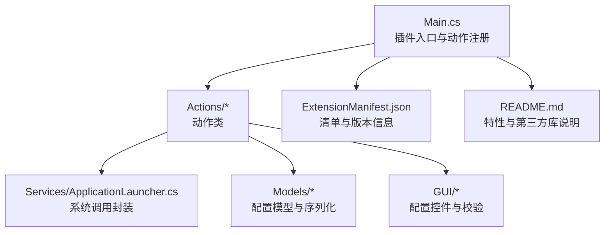
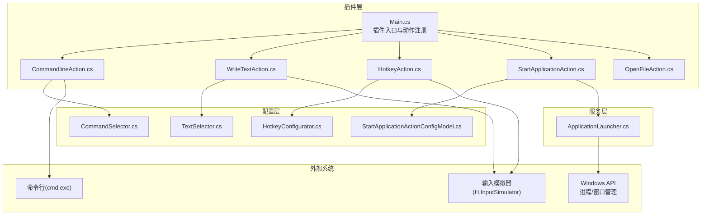
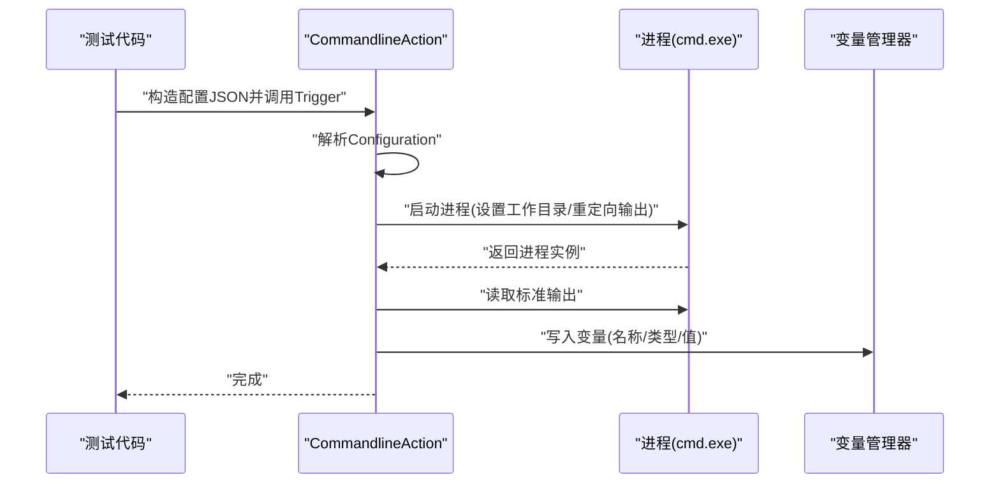
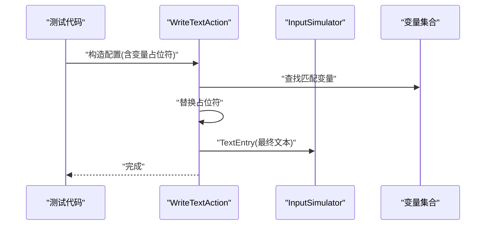
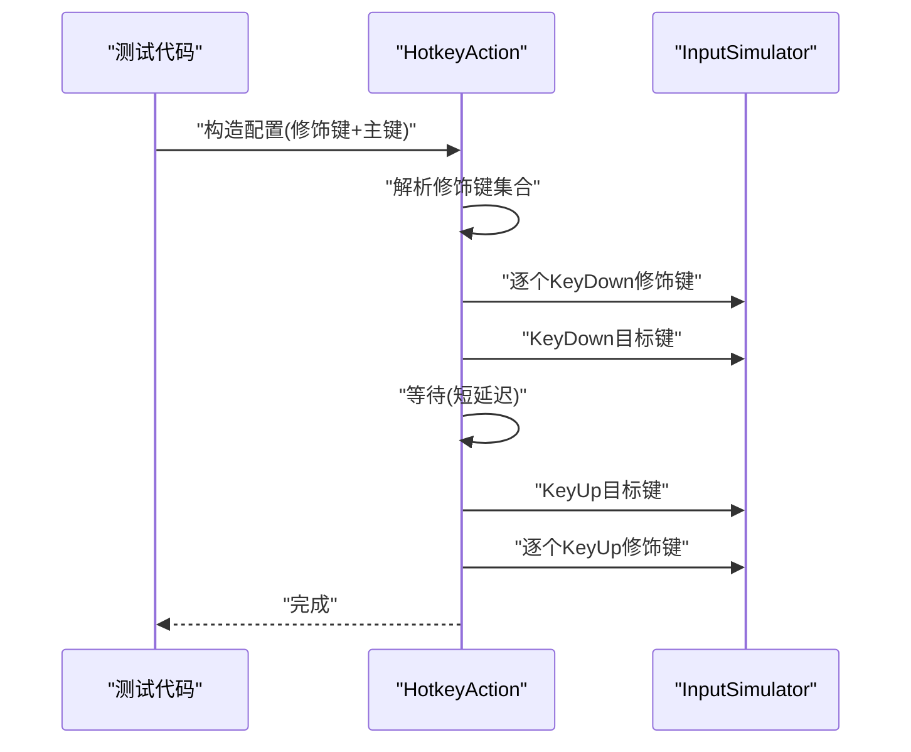
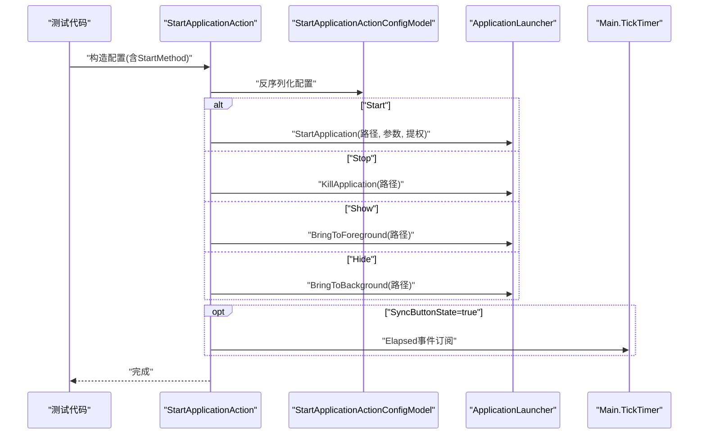
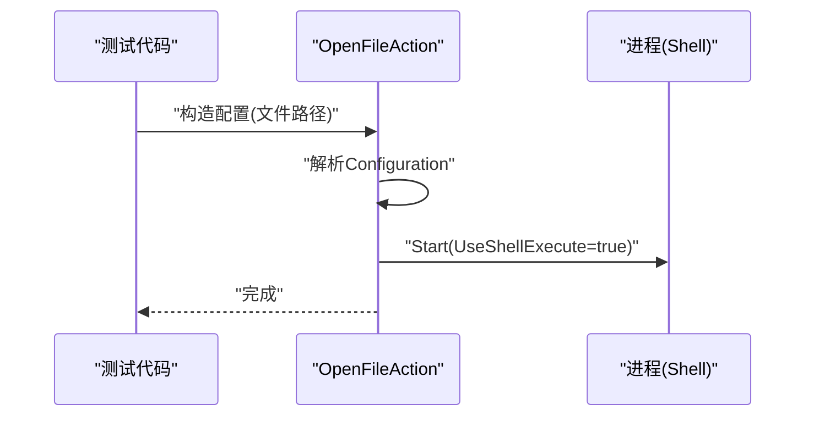
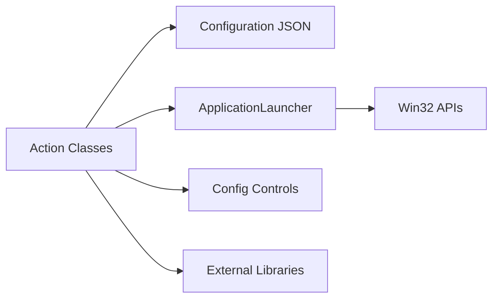

# 测试与调试

<cite>
**本文引用的文件**
- [Main.cs](file://Main.cs)
- [ExtensionManifest.json](file://ExtensionManifest.json)
- [README.md](file://README.md)
- [Actions/CommandlineAction.cs](file://Actions/CommandlineAction.cs)
- [Actions/WriteTextAction.cs](file://Actions/WriteTextAction.cs)
- [Actions/HotkeyAction.cs](file://Actions/HotkeyAction.cs)
- [Actions/StartApplicationAction.cs](file://Actions/StartApplicationAction.cs)
- [Actions/OpenFileAction.cs](file://Actions/OpenFileAction.cs)
- [Services/ApplicationLauncher.cs](file://Services/ApplicationLauncher.cs)
- [Models/StartApplicationActionConfigModel.cs](file://Models/StartApplicationActionConfigModel.cs)
- [GUI/CommandSelector.cs](file://GUI/CommandSelector.cs)
- [GUI/TextSelector.cs](file://GUI/TextSelector.cs)
- [GUI/HotkeyConfigurator.cs](file://GUI/HotkeyConfigurator.cs)
- [.github/workflows/build.yml](file://.github/workflows/build.yml)
</cite>

## 目录
1. 引言
2. 项目结构
3. 核心组件
4. 架构总览
5. 详细组件分析
6. 依赖关系分析
7. 性能考量
8. 故障排查指南
9. 结论
10. 附录

## 引言
本指南面向为 Macro Deck 插件“Windows Utils”编写与执行动作类测试与调试的工程师与高级用户。内容覆盖单元测试（含模拟 Macro Deck 环境）、集成测试（真实系统调用与用户交互）、调试技巧（日志、异常捕获、性能分析）、常见问题诊断（权限、兼容性、内存泄漏）以及测试自动化与持续集成配置建议。目标是帮助你在不直接启动 Macro Deck 主程序的情况下，也能稳定地验证各动作类的行为与配置校验逻辑。

## 项目结构
该仓库采用按功能域分层的组织方式：核心插件入口在 Main 类中注册所有动作；动作类位于 Actions 目录；配置模型与序列化接口在 Models；服务层封装系统调用（如应用启动/前台切换等）；GUI 控件负责配置界面与输入校验；语言资源与第三方库信息在 Language 与根目录中维护。

图表来源
- [Main.cs:28-58](file://Main.cs#L28-L58)
- [ExtensionManifest.json:1-11](file://ExtensionManifest.json#L1-L11)
- [README.md:1-40](file://README.md#L1-L40)

章节来源
- [Main.cs:14-58](file://Main.cs#L14-L58)
- [ExtensionManifest.json:1-11](file://ExtensionManifest.json#L1-L11)
- [README.md:1-40](file://README.md#L1-L40)

## 核心组件
- 动作基类与触发流程
  - 所有动作类继承自插件框架提供的基类，实现名称、描述、是否可配置、配置控件以及 Trigger 方法。Trigger 是动作执行的核心入口，通常解析 Configuration JSON 并调用系统或服务层能力。
- 配置模型与序列化
  - 配置通过 JSON 字符串存储，部分动作提供专用配置模型以支持反序列化与序列化，便于统一校验与状态同步。
- 服务层
  - ApplicationLauncher 封装了进程查找、启动、终止、前后台切换等 Win32 API 调用，是系统级动作（如“启动应用”）的关键依赖。
- GUI 配置控件
  - 每个动作的配置控件负责收集用户输入、进行基础校验（如路径存在性、必填项），并将结果序列化为 Configuration 字符串。

章节来源
- [Actions/CommandlineAction.cs:14-64](file://Actions/CommandlineAction.cs#L14-L64)
- [Actions/WriteTextAction.cs:14-51](file://Actions/WriteTextAction.cs#L14-L51)
- [Actions/HotkeyAction.cs:15-113](file://Actions/HotkeyAction.cs#L15-L113)
- [Actions/StartApplicationAction.cs:14-84](file://Actions/StartApplicationAction.cs#L14-L84)
- [Actions/OpenFileAction.cs:12-47](file://Actions/OpenFileAction.cs#L12-L47)
- [Services/ApplicationLauncher.cs:13-165](file://Services/ApplicationLauncher.cs#L13-L165)
- [Models/StartApplicationActionConfigModel.cs:6-36](file://Models/StartApplicationActionConfigModel.cs#L6-L36)
- [GUI/CommandSelector.cs:12-144](file://GUI/CommandSelector.cs#L12-L144)
- [GUI/TextSelector.cs:11-77](file://GUI/TextSelector.cs#L11-L77)
- [GUI/HotkeyConfigurator.cs:12-96](file://GUI/HotkeyConfigurator.cs#L12-L96)

## 架构总览
下图展示了动作类、配置控件、服务层与外部系统之间的交互关系，以及触发链路。

图表来源
- [Main.cs:28-58](file://Main.cs#L28-L58)
- [Actions/CommandlineAction.cs:14-64](file://Actions/CommandlineAction.cs#L14-L64)
- [Actions/WriteTextAction.cs:14-51](file://Actions/WriteTextAction.cs#L14-L51)
- [Actions/HotkeyAction.cs:15-113](file://Actions/HotkeyAction.cs#L15-L113)
- [Actions/StartApplicationAction.cs:14-84](file://Actions/StartApplicationAction.cs#L14-L84)
- [Actions/OpenFileAction.cs:12-47](file://Actions/OpenFileAction.cs#L12-L47)
- [Services/ApplicationLauncher.cs:13-165](file://Services/ApplicationLauncher.cs#L13-L165)
- [Models/StartApplicationActionConfigModel.cs:6-36](file://Models/StartApplicationActionConfigModel.cs#L6-L36)
- [GUI/CommandSelector.cs:12-144](file://GUI/CommandSelector.cs#L12-L144)
- [GUI/TextSelector.cs:11-77](file://GUI/TextSelector.cs#L11-L77)
- [GUI/HotkeyConfigurator.cs:12-96](file://GUI/HotkeyConfigurator.cs#L12-L96)

## 详细组件分析

### 命令行动作（CommandlineAction）
- 触发流程
  - 解析 Configuration JSON，读取工作目录、命令、是否保存输出到变量、变量名与类型。
  - 使用命令行启动进程，必要时重定向标准输出并写入变量。
- 关键测试点
  - 配置有效性（命令、工作目录、保存变量选项）。
  - 进程启动与输出捕获。
  - 异常处理与日志记录。
- 单元测试建议
  - 使用配置字符串构造 JSON，断言触发后是否正确设置进程参数与输出重定向。
  - 模拟变量管理器，断言输出写入指定变量与类型转换。
- 集成测试建议
  - 在受控目录执行简单命令（如 echo），验证输出与变量值。
  - 验证工作目录变更对命令执行的影响。

图表来源
- [Actions/CommandlineAction.cs:22-58](file://Actions/CommandlineAction.cs#L22-L58)

章节来源
- [Actions/CommandlineAction.cs:14-64](file://Actions/CommandlineAction.cs#L14-L64)

### 文本输入动作（WriteTextAction）
- 触发流程
  - 解析 Configuration，替换文本中的变量占位符，调用输入模拟器进行文本输入。
- 关键测试点
  - 变量替换逻辑（大小写不敏感、占位符格式）。
  - 输入模拟器调用是否成功。
  - 异常捕获与日志告警。
- 单元测试建议
  - 构造包含变量占位符的文本，断言替换后的最终文本。
  - 断言日志警告未出现（无异常）。
- 集成测试建议
  - 在前台打开文本输入框，触发动作，验证实际输入内容。

图表来源
- [Actions/WriteTextAction.cs:22-45](file://Actions/WriteTextAction.cs#L22-L45)

章节来源
- [Actions/WriteTextAction.cs:14-51](file://Actions/WriteTextAction.cs#L14-L51)

### 热键动作（HotkeyAction）
- 触发流程
  - 解析 Configuration，构建修饰键列表与目标键，依次按下/释放，中间加入短暂延迟以提升识别率。
- 关键测试点
  - 修饰键组合解析与顺序。
  - 延迟与按键释放的时序。
  - 异常吞吐（try/catch 空块）。
- 单元测试建议
  - 构造不同修饰键组合的配置，断言按键序列与释放顺序。
  - 断言延迟时间与按键释放。
- 集成测试建议
  - 在前台运行支持热键的应用（如记事本），触发动作，验证快捷键生效。

图表来源
- [Actions/HotkeyAction.cs:29-112](file://Actions/HotkeyAction.cs#L29-L112)

章节来源
- [Actions/HotkeyAction.cs:15-113](file://Actions/HotkeyAction.cs#L15-L113)

### 启动应用动作（StartApplicationAction）
- 触发流程
  - 反序列化配置模型，根据启动方式（启动/停止/显示/隐藏）调用 ApplicationLauncher。
  - 若启用按钮状态同步，则通过定时器周期更新按钮状态。
- 关键测试点
  - 配置模型字段完整性与默认值。
  - ApplicationLauncher 的进程查找、启动、终止、前后台切换行为。
  - 定时器事件绑定与解绑。
- 单元测试建议
  - 构造不同 StartMethod 的配置，断言调用对应 Launcher 方法。
  - 断言按钮状态同步开启/关闭时定时器事件的挂载/移除。
- 集成测试建议
  - 选择一个已安装的应用路径，触发“启动/停止/显示/隐藏”，验证进程状态与窗口状态变化。

图表来源
- [Actions/StartApplicationAction.cs:22-83](file://Actions/StartApplicationAction.cs#L22-L83)
- [Models/StartApplicationActionConfigModel.cs:19-26](file://Models/StartApplicationActionConfigModel.cs#L19-L26)
- [Services/ApplicationLauncher.cs:39-126](file://Services/ApplicationLauncher.cs#L39-L126)

章节来源
- [Actions/StartApplicationAction.cs:14-84](file://Actions/StartApplicationAction.cs#L14-L84)
- [Models/StartApplicationActionConfigModel.cs:6-36](file://Models/StartApplicationActionConfigModel.cs#L6-L36)
- [Services/ApplicationLauncher.cs:13-165](file://Services/ApplicationLauncher.cs#L13-L165)

### 打开文件动作（OpenFileAction）
- 触发流程
  - 解析 Configuration，使用 Shell 执行打开路径。
- 关键测试点
  - 配置有效性与路径合法性。
  - 异常吞吐（空 catch）。
- 单元测试建议
  - 构造有效文件路径配置，断言进程启动。
- 集成测试建议
  - 选择一个本地文件，触发动作，验证系统默认程序打开。

图表来源
- [Actions/OpenFileAction.cs:20-40](file://Actions/OpenFileAction.cs#L20-L40)

章节来源
- [Actions/OpenFileAction.cs:12-47](file://Actions/OpenFileAction.cs#L12-L47)

### 配置控件与验证（CommandSelector、TextSelector、HotkeyConfigurator）
- 验证要点
  - 必填项校验（如命令、文本、路径）。
  - 文件/目录存在性检查与提示。
  - 配置序列化为 JSON 并生成摘要。
- 单元测试建议
  - 构造空输入与非法路径，断言保存失败与错误提示。
  - 构造合法输入，断言 Configuration 与摘要生成。

章节来源
- [GUI/CommandSelector.cs:46-79](file://GUI/CommandSelector.cs#L46-L79)
- [GUI/TextSelector.cs:25-41](file://GUI/TextSelector.cs#L25-L41)
- [GUI/HotkeyConfigurator.cs:24-53](file://GUI/HotkeyConfigurator.cs#L24-L53)

## 依赖关系分析
- 组件耦合
  - 动作类依赖配置控件生成的 Configuration JSON 与服务层（ApplicationLauncher）。
  - 写入文本与发送热键依赖输入模拟器；启动应用依赖 Win32 API。
- 外部依赖
  - 第三方库：输入模拟器、JSON 序列化等。
- 潜在循环依赖
  - 当前结构清晰，动作类与服务层通过显式调用解耦，未见循环依赖迹象。

图表来源
- [Services/ApplicationLauncher.cs:13-165](file://Services/ApplicationLauncher.cs#L13-L165)
- [Actions/WriteTextAction.cs:38](file://Actions/WriteTextAction.cs#L38)
- [Actions/HotkeyAction.cs:96-105](file://Actions/HotkeyAction.cs#L96-L105)

章节来源
- [README.md:33-39](file://README.md#L33-L39)

## 性能考量
- 输入模拟器调用
  - 热键动作中按键按下/释放的顺序与延迟会影响识别率，应避免过长延迟影响响应速度。
- 进程启动与 IO
  - 命令行动作的输出重定向与读取可能阻塞，建议在测试中控制命令复杂度与输出大小。
- 定时器与状态同步
  - 启动应用动作的状态同步使用定时器轮询，需注意频率与线程安全，避免频繁访问 UI 状态。
- 内存与句柄
  - Win32 API 调用涉及进程句柄与字符串缓冲区，确保在 finally 中释放句柄，防止泄漏。

章节来源
- [Actions/HotkeyAction.cs:89-105](file://Actions/HotkeyAction.cs#L89-L105)
- [Actions/CommandlineAction.cs:40-52](file://Actions/CommandlineAction.cs#L40-L52)
- [Actions/StartApplicationAction.cs:71-82](file://Actions/StartApplicationAction.cs#L71-L82)
- [Services/ApplicationLauncher.cs:139-163](file://Services/ApplicationLauncher.cs#L139-L163)

## 故障排查指南
- 权限问题
  - 启动应用动作支持以管理员身份运行，若失败，检查 UAC 提示与路径有效性。
  - 终止进程需要目标进程句柄，若失败，确认进程是否存在且可被枚举。
- 系统兼容性问题
  - 输入模拟器依赖虚拟键码，确保键值在当前系统可用。
  - 窗口前后台切换依赖窗口句柄，若句柄为空，回退最小化/还原操作。
- 内存泄漏
  - Win32 API 调用需在 finally 中关闭句柄；避免长时间持有进程引用。
- 日志与异常
  - 文本输入动作使用日志告警；命令行动作使用调试输出；热键动作存在空 catch，建议补充日志。
- 用户交互测试
  - 使用配置控件进行必填项与路径校验，确保保存失败时弹出提示。

章节来源
- [Services/ApplicationLauncher.cs:60-80](file://Services/ApplicationLauncher.cs#L60-L80)
- [Services/ApplicationLauncher.cs:100-126](file://Services/ApplicationLauncher.cs#L100-L126)
- [Actions/WriteTextAction.cs:40-43](file://Actions/WriteTextAction.cs#L40-L43)
- [Actions/CommandlineAction.cs:54-57](file://Actions/CommandlineAction.cs#L54-L57)
- [Actions/HotkeyAction.cs:109-111](file://Actions/HotkeyAction.cs#L109-L111)
- [GUI/CommandSelector.cs:53-66](file://GUI/CommandSelector.cs#L53-L66)

## 结论
通过对动作类的触发流程、配置模型与服务层调用的深入分析，可以建立完善的单元与集成测试体系。建议优先覆盖配置校验、关键系统调用与异常路径，结合日志与性能分析工具，持续改进稳定性与用户体验。

## 附录

### 单元测试编写要点（基于源码）
- 模拟 Macro Deck 环境
  - 使用插件入口注册动作，构造 Configuration JSON，调用动作的 Trigger 方法。
  - 对于依赖全局实例的动作（如写入文本、热键），可通过测试框架注入或反射设置全局实例。
- Execute 方法测试
  - 命令行动作：断言进程参数、输出重定向与变量写入。
  - 文本输入动作：断言变量替换与输入模拟器调用。
  - 热键动作：断言修饰键与主键序列、延迟与释放顺序。
  - 启动应用动作：断言不同启动方式对应的 Launcher 方法调用与定时器事件挂载。
  - 打开文件动作：断言进程启动。
- 配置验证测试
  - 命令选择器：断言必填项校验、路径存在性检查与 JSON 序列化。
  - 文本选择器：断言文本非空与摘要生成。
  - 热键配置器：断言修饰键与主键序列化与摘要生成。

章节来源
- [Main.cs:28-58](file://Main.cs#L28-L58)
- [Actions/CommandlineAction.cs:22-58](file://Actions/CommandlineAction.cs#L22-L58)
- [Actions/WriteTextAction.cs:22-45](file://Actions/WriteTextAction.cs#L22-L45)
- [Actions/HotkeyAction.cs:29-112](file://Actions/HotkeyAction.cs#L29-L112)
- [Actions/StartApplicationAction.cs:22-83](file://Actions/StartApplicationAction.cs#L22-L83)
- [Actions/OpenFileAction.cs:20-40](file://Actions/OpenFileAction.cs#L20-L40)
- [GUI/CommandSelector.cs:46-79](file://GUI/CommandSelector.cs#L46-L79)
- [GUI/TextSelector.cs:25-41](file://GUI/TextSelector.cs#L25-L41)
- [GUI/HotkeyConfigurator.cs:24-53](file://GUI/HotkeyConfigurator.cs#L24-L53)

### 集成测试策略
- 真实系统调用测试
  - 命令行动作：在受控目录执行简单命令，验证输出与变量值。
  - 启动应用动作：选择常用应用，验证启动/停止/显示/隐藏。
  - 热键动作：在前台应用中验证快捷键生效。
- 用户交互测试
  - 配置控件：输入空值与非法路径，验证错误提示与保存失败。
  - 文本选择器：插入变量占位符，验证替换与光标位置。

章节来源
- [Actions/CommandlineAction.cs:44-52](file://Actions/CommandlineAction.cs#L44-L52)
- [Actions/StartApplicationAction.cs:27-49](file://Actions/StartApplicationAction.cs#L27-L49)
- [GUI/CommandSelector.cs:48-66](file://GUI/CommandSelector.cs#L48-L66)
- [GUI/TextSelector.cs:53-75](file://GUI/TextSelector.cs#L53-L75)

### 调试技巧与工具
- 日志记录
  - 文本输入动作使用日志告警；命令行动作使用调试输出；建议在热键动作补充异常日志。
- 异常捕获
  - 命令行动作与打开文件动作存在空 catch，建议细化异常类型并记录堆栈。
- 性能分析
  - 使用计时器测量动作执行耗时；关注进程启动与 IO 读取瓶颈。
- 内存与句柄
  - 确保 Win32 API 句柄在 finally 中关闭；避免长期持有进程引用。

章节来源
- [Actions/WriteTextAction.cs:40-43](file://Actions/WriteTextAction.cs#L40-L43)
- [Actions/CommandlineAction.cs:54-57](file://Actions/CommandlineAction.cs#L54-L57)
- [Actions/OpenFileAction.cs:38](file://Actions/OpenFileAction.cs#L38)
- [Services/ApplicationLauncher.cs:139-163](file://Services/ApplicationLauncher.cs#L139-L163)

### 常见问题诊断
- 权限问题
  - 管理员启动失败：检查 UAC 与路径；终止进程失败：确认进程存在与句柄有效。
- 兼容性问题
  - 键盘映射：确保键值在当前系统可用；窗口句柄：为空时回退最小化/还原。
- 内存泄漏
  - 句柄泄漏：确保 CloseHandle 被调用；进程引用：避免长期持有。

章节来源
- [Services/ApplicationLauncher.cs:60-80](file://Services/ApplicationLauncher.cs#L60-L80)
- [Services/ApplicationLauncher.cs:100-126](file://Services/ApplicationLauncher.cs#L100-L126)
- [Services/ApplicationLauncher.cs:139-163](file://Services/ApplicationLauncher.cs#L139-L163)

### 测试自动化与持续集成
- 构建与发布
  - 使用现有构建工作流进行编译与打包，确保清单与版本一致。
- 单元测试
  - 为每个动作类编写独立测试用例，覆盖配置校验、关键分支与异常路径。
- 集成测试
  - 在 CI 环境中准备受控应用与目录，执行真实系统调用测试。
- 日志与报告
  - 收集动作触发日志与异常信息，生成测试报告。

章节来源
- [ExtensionManifest.json:1-11](file://ExtensionManifest.json#L1-L11)
- [.github/workflows/build.yml](file://.github/workflows/build.yml)