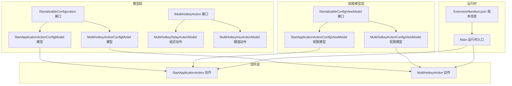
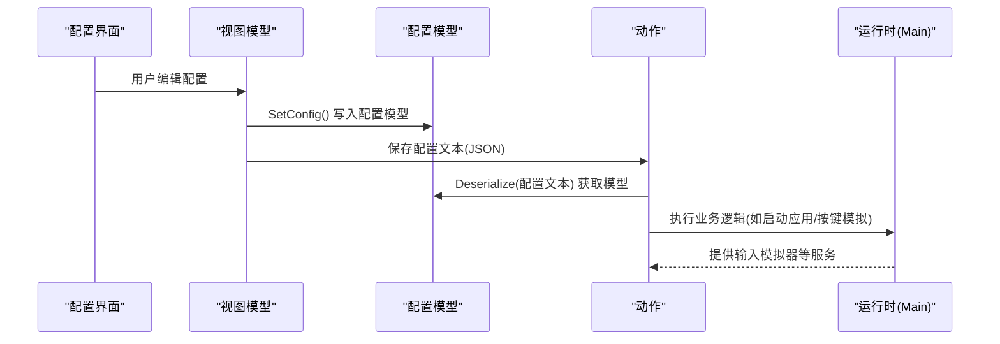
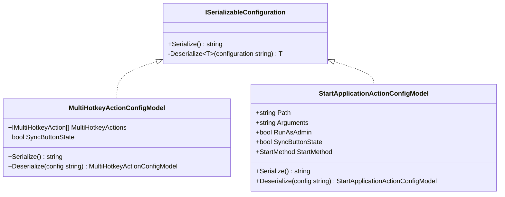
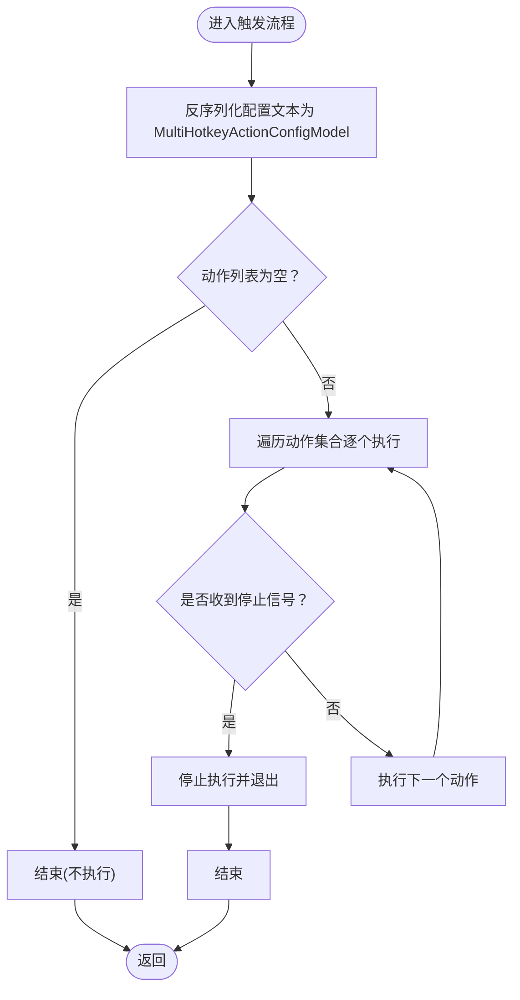
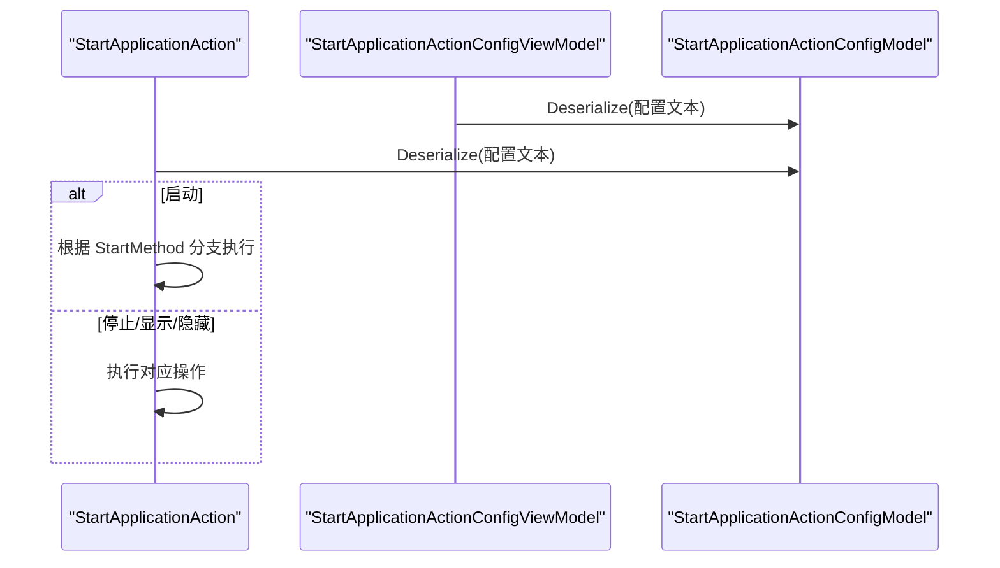
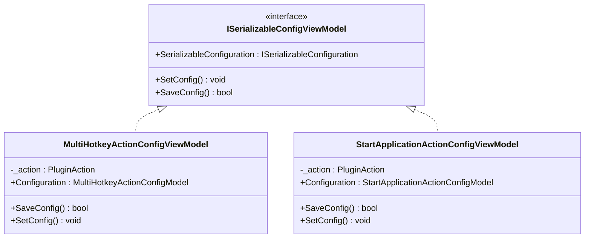
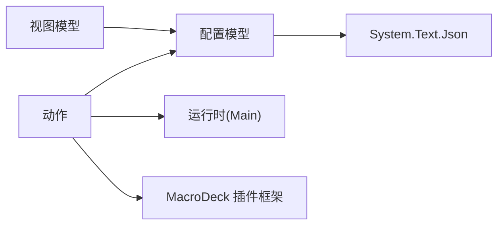

# 配置模型开发

<cite>
**本文引用的文件**
- [ISerializableConfiguration.cs](file://Models/ISerializableConfiguration.cs)
- [MultiHotkeyActionConfigModel.cs](file://Models/MultiHotkeyActionConfigModel.cs)
- [StartApplicationActionConfigModel.cs](file://Models/StartApplicationActionConfigModel.cs)
- [ISerializableConfigViewModel.cs](file://ViewModels/ISerializableConfigViewModel.cs)
- [MultiHotkeyActionConfigViewModel.cs](file://ViewModels/MultiHotkeyActionConfigViewModel.cs)
- [StartApplicationActionConfigViewModel.cs](file://ViewModels/StartApplicationActionConfigViewModel.cs)
- [MultiHotkeyDelayActionModel.cs](file://Models/MultiHotkeyDelayActionModel.cs)
- [MultiHotkeyKeyActionModel.cs](file://Models/MultiHotkeyKeyActionModel.cs)
- [IMultiHotkeyAction.cs](file://Models/IMultiHotkeyAction.cs)
- [StartApplicationAction.cs](file://Actions/StartApplicationAction.cs)
- [MultiHotkeyAction.cs](file://Actions/MultiHotkeyAction.cs)
- [Main.cs](file://Main.cs)
- [ExtensionManifest.json](file://ExtensionManifest.json)
</cite>

## 目录
1. [简介](#简介)
2. [项目结构](#项目结构)
3. [核心组件](#核心组件)
4. [架构总览](#架构总览)
5. [详细组件分析](#详细组件分析)
6. [依赖关系分析](#依赖关系分析)
7. [性能考虑](#性能考虑)
8. [故障排除指南](#故障排除指南)
9. [结论](#结论)
10. [附录](#附录)

## 简介
本指南面向在 Macro Deck 插件生态中进行“配置模型开发”的工程师与高级用户，系统阐述如何基于 ISerializableConfiguration 接口设计可序列化的配置模型，涵盖以下主题：
- ISerializableConfiguration 的职责与实现模式：定义 Serialize 与通用 Deserialize 工具方法
- 配置数据结构设计原则：字段命名、默认值、可选字段与向后兼容
- JSON 配置格式最佳实践：字段名稳定化、枚举序列化、类型安全
- 复杂配置模型示例：MultiHotkeyActionConfigModel 与 StartApplicationActionConfigModel
- 配置验证、默认值设置与向后兼容性处理策略
- 配置迁移与版本管理建议（基于现有实现的扩展点）

## 项目结构
该仓库围绕“动作(Action)”与“配置模型(Model)/视图模型(ViewModel)”分层组织，配置模型通过 ISerializableConfiguration 实现统一的序列化/反序列化契约；视图模型负责桥接 UI 与配置模型；动作在运行时读取配置并执行。

图表来源
- [ISerializableConfiguration.cs:5-11](file://Models/ISerializableConfiguration.cs#L5-L11)
- [MultiHotkeyActionConfigModel.cs:6-21](file://Models/MultiHotkeyActionConfigModel.cs#L6-L21)
- [StartApplicationActionConfigModel.cs:6-27](file://Models/StartApplicationActionConfigModel.cs#L6-L27)
- [IMultiHotkeyAction.cs:3-8](file://Models/IMultiHotkeyAction.cs#L3-L8)
- [MultiHotkeyDelayActionModel.cs:5-13](file://Models/MultiHotkeyDelayActionModel.cs#L5-L13)
- [MultiHotkeyKeyActionModel.cs:5-25](file://Models/MultiHotkeyKeyActionModel.cs#L5-L25)
- [ISerializableConfigViewModel.cs:5-12](file://ViewModels/ISerializableConfigViewModel.cs#L5-L12)
- [MultiHotkeyActionConfigViewModel.cs:9-55](file://ViewModels/MultiHotkeyActionConfigViewModel.cs#L9-L55)
- [StartApplicationActionConfigViewModel.cs:8-72](file://ViewModels/StartApplicationActionConfigViewModel.cs#L8-L72)
- [StartApplicationAction.cs:14-83](file://Actions/StartApplicationAction.cs#L14-L83)
- [MultiHotkeyAction.cs:11-56](file://Actions/MultiHotkeyAction.cs#L11-L56)
- [Main.cs:14-59](file://Main.cs#L14-L59)
- [ExtensionManifest.json:1-11](file://ExtensionManifest.json#L1-L11)

章节来源
- [Main.cs:14-59](file://Main.cs#L14-L59)
- [ExtensionManifest.json:1-11](file://ExtensionManifest.json#L1-L11)

## 核心组件
本节聚焦于配置模型的核心契约与两个典型实现，阐明序列化/反序列化流程、默认值与向后兼容策略。

- ISerializableConfiguration 接口
  - 职责：定义 Serialize 方法用于序列化配置；提供受保护的泛型 Deserialize 工具方法，支持空字符串时返回新实例，确保反序列化安全。
  - 关键点：使用 System.Text.Json；Deserialize 泛型约束要求实现类可 new()，便于无配置时自动初始化默认值。
  
- MultiHotkeyActionConfigModel
  - 字段：包含动作列表与同步按钮状态布尔标志；默认值通过字段初始化设定。
  - 序列化：直接序列化当前实例。
  - 反序列化：调用接口提供的静态工具方法，实现与 ISerializableConfiguration 的解耦。
  
- StartApplicationActionConfigModel
  - 字段：路径、参数、管理员权限、同步按钮状态、启动方式（枚举）。
  - 默认值：所有字段均提供默认值，确保新实例可用。
  - 向后兼容：使用 JsonPropertyName 标注字段名，保证旧版 JSON 字段名变更时仍可正确映射。
  - 序列化/反序列化：遵循 ISerializableConfiguration 约定。

章节来源
- [ISerializableConfiguration.cs:5-11](file://Models/ISerializableConfiguration.cs#L5-L11)
- [MultiHotkeyActionConfigModel.cs:6-21](file://Models/MultiHotkeyActionConfigModel.cs#L6-L21)
- [StartApplicationActionConfigModel.cs:6-27](file://Models/StartApplicationActionConfigModel.cs#L6-L27)

## 架构总览
下图展示从 UI 到动作执行的完整链路，以及配置模型在其中的位置与职责边界。

图表来源
- [MultiHotkeyActionConfigViewModel.cs:30-54](file://ViewModels/MultiHotkeyActionConfigViewModel.cs#L30-L54)
- [StartApplicationActionConfigViewModel.cs:47-71](file://ViewModels/StartApplicationActionConfigViewModel.cs#L47-L71)
- [MultiHotkeyActionConfigModel.cs:13-20](file://Models/MultiHotkeyActionConfigModel.cs#L13-L20)
- [StartApplicationActionConfigModel.cs:19-26](file://Models/StartApplicationActionConfigModel.cs#L19-L26)
- [StartApplicationAction.cs:22-50](file://Actions/StartApplicationAction.cs#L22-L50)
- [Main.cs:14-26](file://Main.cs#L14-L26)

## 详细组件分析

### ISerializableConfiguration 接口与实现模式
- 设计要点
  - 将序列化细节封装在接口内，避免各模型重复实现相同逻辑。
  - 受保护的 Deserialize<T> 提供“空配置即默认值”语义，降低上层调用复杂度。
  - 使用 System.Text.Json，具备高性能与跨平台特性。
- 使用建议
  - 所有配置模型均实现该接口，保持一致的序列化/反序列化行为。
  - 对于需要向后兼容的字段，使用 JsonPropertyName 标注稳定字段名。

图表来源
- [ISerializableConfiguration.cs:5-11](file://Models/ISerializableConfiguration.cs#L5-L11)
- [MultiHotkeyActionConfigModel.cs:6-21](file://Models/MultiHotkeyActionConfigModel.cs#L6-L21)
- [StartApplicationActionConfigModel.cs:6-27](file://Models/StartApplicationActionConfigModel.cs#L6-L27)

章节来源
- [ISerializableConfiguration.cs:5-11](file://Models/ISerializableConfiguration.cs#L5-L11)

### MultiHotkeyActionConfigModel：复杂配置模型示例
- 数据结构
  - 动作集合：List<IMultiHotkeyAction>，支持延迟与键盘等不同动作类型。
  - 同步按钮状态：SyncButtonState 控制执行期间按钮状态同步。
- 默认值与可扩展性
  - 字段初始化提供默认值，确保新实例可用。
  - IMultiHotkeyAction 为未来新增动作类型预留扩展点。
- 序列化/反序列化
  - 直接序列化当前实例；反序列化委托给接口工具方法。

图表来源
- [MultiHotkeyAction.cs:23-48](file://Actions/MultiHotkeyAction.cs#L23-L48)
- [MultiHotkeyActionConfigModel.cs:13-20](file://Models/MultiHotkeyActionConfigModel.cs#L13-L20)

章节来源
- [MultiHotkeyActionConfigModel.cs:6-21](file://Models/MultiHotkeyActionConfigModel.cs#L6-L21)
- [MultiHotkeyDelayActionModel.cs:5-13](file://Models/MultiHotkeyDelayActionModel.cs#L5-L13)
- [MultiHotkeyKeyActionModel.cs:5-25](file://Models/MultiHotkeyKeyActionModel.cs#L5-L25)
- [IMultiHotkeyAction.cs:3-8](file://Models/IMultiHotkeyAction.cs#L3-L8)
- [MultiHotkeyAction.cs:11-56](file://Actions/MultiHotkeyAction.cs#L11-L56)

### StartApplicationActionConfigModel：复杂配置模型示例
- 数据结构
  - 路径与参数：string 类型，提供默认空字符串。
  - 权限与同步：RunAsAdmin、SyncButtonState，默认 false。
  - 启动方式：StartMethod 枚举，提供默认 Start。
- 向后兼容
  - 使用 JsonPropertyName 标注字段名，确保旧版 JSON 字段名变更时仍可正确映射。
- 序列化/反序列化
  - 遵循 ISerializableConfiguration 约定；反序列化时若配置为空则返回默认实例。

图表来源
- [StartApplicationActionConfigViewModel.cs:47-71](file://ViewModels/StartApplicationActionConfigViewModel.cs#L47-L71)
- [StartApplicationActionConfigModel.cs:19-26](file://Models/StartApplicationActionConfigModel.cs#L19-L26)
- [StartApplicationAction.cs:22-50](file://Actions/StartApplicationAction.cs#L22-L50)

章节来源
- [StartApplicationActionConfigModel.cs:6-27](file://Models/StartApplicationActionConfigModel.cs#L6-L27)
- [StartApplicationActionConfigViewModel.cs:8-72](file://ViewModels/StartApplicationActionConfigViewModel.cs#L8-L72)
- [StartApplicationAction.cs:14-83](file://Actions/StartApplicationAction.cs#L14-L83)

### 视图模型与配置契约
- ISerializableConfigViewModel
  - 定义 SerializableConfiguration 属性与 SetConfig()/SaveConfig() 方法，作为 UI 与配置模型之间的桥梁。
- MultiHotkeyActionConfigViewModel / StartApplicationActionConfigViewModel
  - 在构造函数中通过 Deserialize 初始化配置模型。
  - SetConfig() 将配置模型序列化为 JSON 并写回动作；同时更新配置摘要。
  - SaveConfig() 包裹异常并记录日志，保证 UI 交互稳定性。

图表来源
- [ISerializableConfigViewModel.cs:5-12](file://ViewModels/ISerializableConfigViewModel.cs#L5-L12)
- [MultiHotkeyActionConfigViewModel.cs:9-55](file://ViewModels/MultiHotkeyActionConfigViewModel.cs#L9-L55)
- [StartApplicationActionConfigViewModel.cs:8-72](file://ViewModels/StartApplicationActionConfigViewModel.cs#L8-L72)

章节来源
- [ISerializableConfigViewModel.cs:5-12](file://ViewModels/ISerializableConfigViewModel.cs#L5-L12)
- [MultiHotkeyActionConfigViewModel.cs:9-55](file://ViewModels/MultiHotkeyActionConfigViewModel.cs#L9-L55)
- [StartApplicationActionConfigViewModel.cs:8-72](file://ViewModels/StartApplicationActionConfigViewModel.cs#L8-L72)

## 依赖关系分析
- 组件耦合
  - 动作层依赖配置模型：动作在触发或加载时通过 Deserialize 获取模型实例。
  - 视图模型依赖配置模型：视图模型持有配置模型并在 UI 编辑后写回。
  - 运行时 Main 提供全局服务（如输入模拟器），动作在执行阶段使用。
- 外部依赖
  - System.Text.Json：用于序列化/反序列化。
  - MacroDeck 插件框架：提供 PluginAction、ActionButton、日志等基础设施。

图表来源
- [StartApplicationAction.cs:22-50](file://Actions/StartApplicationAction.cs#L22-L50)
- [MultiHotkeyAction.cs:23-48](file://Actions/MultiHotkeyAction.cs#L23-L48)
- [Main.cs:14-26](file://Main.cs#L14-L26)

章节来源
- [StartApplicationAction.cs:14-83](file://Actions/StartApplicationAction.cs#L14-L83)
- [MultiHotkeyAction.cs:11-56](file://Actions/MultiHotkeyAction.cs#L11-L56)
- [Main.cs:14-26](file://Main.cs#L14-L26)

## 性能考虑
- 序列化成本
  - 配置通常较小且不频繁变更，JSON 序列化开销可忽略。
  - 若配置体量增大，可考虑缓存已序列化字符串或按需序列化。
- 反序列化安全
  - 使用接口提供的 Deserialize<T> 可避免空配置导致的异常。
- UI 交互
  - 视图模型 SaveConfig() 中的异常捕获与日志记录有助于快速定位问题，避免 UI 卡顿。

## 故障排除指南
- 常见问题
  - 配置为空或格式错误：接口 Deserialize<T> 返回默认实例，避免上层崩溃；可在 UI 层提示用户重新配置。
  - 字段名变更导致反序列化失败：使用 JsonPropertyName 标注稳定字段名，确保向后兼容。
  - 日志定位：视图模型 SaveConfig() 中记录异常堆栈，便于排查。
- 建议
  - 在动作触发前增加对关键字段的非空校验（如路径、参数）。
  - 对外部进程控制（如启动/停止应用）增加幂等判断，避免重复操作。

章节来源
- [ISerializableConfiguration.cs:9-10](file://Models/ISerializableConfiguration.cs#L9-L10)
- [StartApplicationActionConfigViewModel.cs:53-65](file://ViewModels/StartApplicationActionConfigViewModel.cs#L53-L65)
- [StartApplicationAction.cs:22-50](file://Actions/StartApplicationAction.cs#L22-L50)

## 结论
通过 ISerializableConfiguration 接口，项目实现了配置模型的统一序列化/反序列化契约，配合视图模型与动作层形成清晰的职责边界。StartApplicationActionConfigModel 与 MultiHotkeyActionConfigModel 展示了如何在保证默认值与向后兼容的前提下，设计可扩展的配置结构。建议在后续迭代中引入显式的配置验证与版本迁移机制，以进一步提升健壮性与可维护性。

## 附录

### 配置数据结构设计原则
- 字段命名
  - 使用稳定字段名并通过 JsonPropertyName 标注，避免未来字段重命名破坏兼容。
- 默认值
  - 所有字段提供明确默认值，确保新实例可用。
- 可选字段
  - 对于可选字段，优先使用可空类型或布尔标志位，避免歧义。
- 枚举与状态
  - 枚举字段提供默认值，避免未赋值导致的未知状态。

### JSON 配置格式最佳实践
- 字段名稳定化：使用 JsonPropertyName 固定字段名，便于版本演进。
- 枚举序列化：采用字符串枚举值，提高可读性与兼容性。
- 嵌套对象与集合：集合字段提供空集合初始化，避免空引用。

### 配置验证、默认值与向后兼容
- 验证
  - 在动作触发前对关键字段进行非空与有效性检查。
- 默认值
  - 字段初始化提供默认值；反序列化空配置时由接口工具方法返回默认实例。
- 向后兼容
  - 通过 JsonPropertyName 标注字段名，兼容旧版 JSON。

### 配置迁移与版本管理策略
- 版本标识
  - 使用插件清单中的版本号作为迁移依据。
- 迁移策略
  - 新增字段：提供默认值，保持向后兼容。
  - 字段重命名：保留旧字段名映射，逐步淘汰旧字段。
  - 枚举扩展：为新增枚举值提供默认映射，避免反序列化失败。
- 建议
  - 引入配置版本号字段，在 Deserialize 流程中根据版本执行差异化处理。
  - 对高风险变更提供“降级回退”逻辑，确保系统稳定。

章节来源
- [StartApplicationActionConfigModel.cs:8-15](file://Models/StartApplicationActionConfigModel.cs#L8-L15)
- [ExtensionManifest.json:7](file://ExtensionManifest.json#L7)