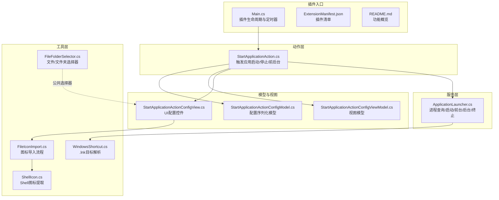
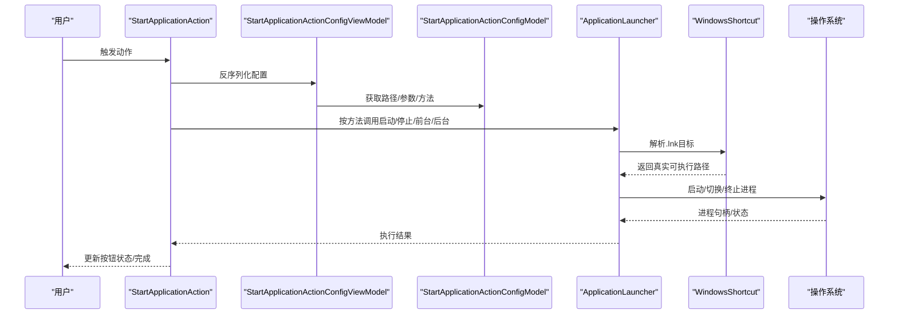
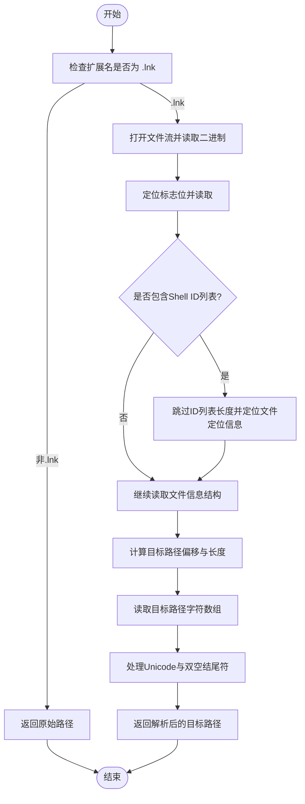
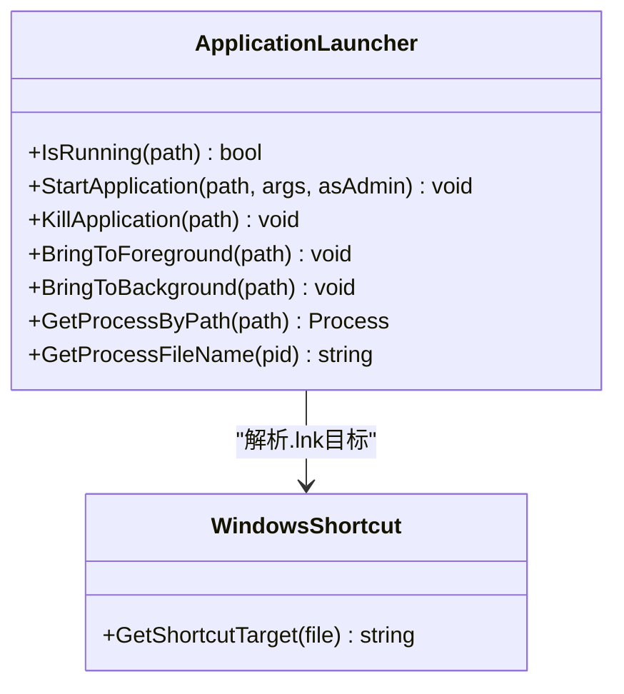
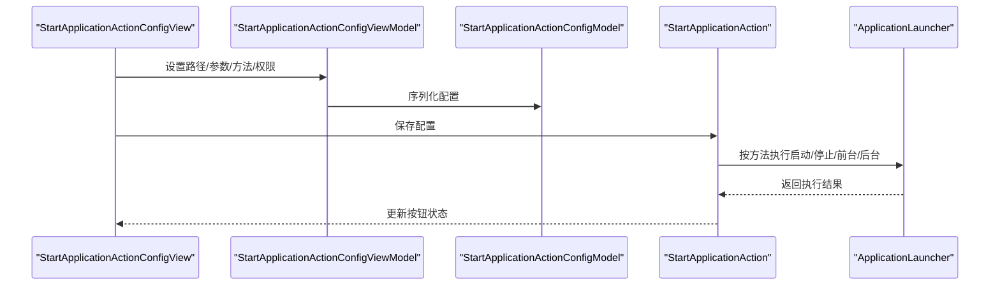
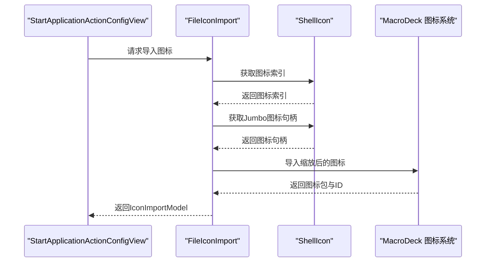
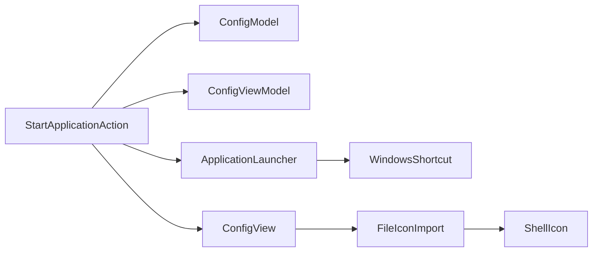

# Windows快捷方式

<cite>
**本文档引用的文件**
- [WindowsShortcut.cs](file://Utils/WindowsShortcut.cs)
- [ApplicationLauncher.cs](file://Services/ApplicationLauncher.cs)
- [StartApplicationAction.cs](file://Actions/StartApplicationAction.cs)
- [StartApplicationActionConfigModel.cs](file://Models/StartApplicationActionConfigModel.cs)
- [StartApplicationActionConfigViewModel.cs](file://ViewModels/StartApplicationActionConfigViewModel.cs)
- [StartApplicationActionConfigView.cs](file://Views/StartApplicationActionConfigView.cs)
- [ShellIcon.cs](file://Utils/ShellIcon.cs)
- [FileIconImport.cs](file://Utils/FileIconImport.cs)
- [FileFolderSelector.cs](file://GUI/FileFolderSelector.cs)
- [Main.cs](file://Main.cs)
- [README.md](file://README.md)
- [ExtensionManifest.json](file://ExtensionManifest.json)
</cite>

## 目录
1. [简介](#简介)
2. [项目结构](#项目结构)
3. [核心组件](#核心组件)
4. [架构总览](#架构总览)
5. [详细组件分析](#详细组件分析)
6. [依赖关系分析](#依赖关系分析)
7. [性能考虑](#性能考虑)
8. [故障排除指南](#故障排除指南)
9. [结论](#结论)
10. [附录](#附录)

## 简介
本指南面向使用 Macro Deck 插件“Windows Utils”的用户与开发者，系统讲解如何在该插件中进行 Windows 快捷方式（.lnk）的读取与解析，以及如何结合应用启动、图标提取等能力实现快捷方式相关的管理与操作。重点覆盖以下方面：
- 快捷方式读取：从 .lnk 文件中解析目标路径、参数与工作目录等信息
- 应用程序启动：支持以管理员权限运行、前台/后台切换、进程终止等
- 图标引用：通过系统 Shell 提取文件图标并导入到 Macro Deck 图标包
- 实际使用示例：创建应用快捷方式、批量处理与验证
- 最佳实践与故障排除

## 项目结构
该项目为 Macro Deck 2 的插件工程，采用分层组织：
- Utils：底层工具类，如快捷方式解析、Shell 图标提取、文件图标导入
- Services：业务服务，如应用启动器封装
- Actions：宏动作定义，如“启动应用”、“命令行”等
- Models/ViewModels/Views：配置模型、视图模型与界面控件
- GUI：通用选择器与配置控件
- 根目录：插件入口、清单与说明

**图表来源**
- [Main.cs:14-59](file://Main.cs#L14-L59)
- [StartApplicationAction.cs:14-84](file://Actions/StartApplicationAction.cs#L14-L84)
- [StartApplicationActionConfigModel.cs:6-36](file://Models/StartApplicationActionConfigModel.cs#L6-L36)
- [StartApplicationActionConfigViewModel.cs:8-73](file://ViewModels/StartApplicationActionConfigViewModel.cs#L8-L73)
- [StartApplicationActionConfigView.cs:13-159](file://Views/StartApplicationActionConfigView.cs#L13-L159)
- [ApplicationLauncher.cs:13-165](file://Services/ApplicationLauncher.cs#L13-L165)
- [WindowsShortcut.cs:5-66](file://Utils/WindowsShortcut.cs#L5-L66)
- [ShellIcon.cs:48-337](file://Utils/ShellIcon.cs#L48-L337)
- [FileIconImport.cs:11-66](file://Utils/FileIconImport.cs#L11-L66)
- [FileFolderSelector.cs:13-189](file://GUI/FileFolderSelector.cs#L13-L189)

**章节来源**
- [Main.cs:14-59](file://Main.cs#L14-L59)
- [README.md:1-40](file://README.md#L1-L40)
- [ExtensionManifest.json:1-11](file://ExtensionManifest.json#L1-L11)

## 核心组件
- 快捷方式解析器：用于从 .lnk 文件中读取目标路径，支持跳过 Shell ID 列表与定位文件信息结构，最终返回可执行目标或原始路径（非 .lnk）
- 应用启动器：封装进程启动、前台/后台切换、最小化、终止等操作；内部会先解析 .lnk 再匹配对应进程
- 配置模型与视图：提供路径、参数、管理员权限、同步按钮状态、启动方法等配置项
- 图标提取与导入：通过 Shell API 获取大尺寸图标，支持缩放与导入到 Macro Deck 图标包

**章节来源**
- [WindowsShortcut.cs:8-64](file://Utils/WindowsShortcut.cs#L8-L64)
- [ApplicationLauncher.cs:39-137](file://Services/ApplicationLauncher.cs#L39-L137)
- [StartApplicationActionConfigModel.cs:6-36](file://Models/StartApplicationActionConfigModel.cs#L6-L36)
- [StartApplicationActionConfigViewModel.cs:8-73](file://ViewModels/StartApplicationActionConfigViewModel.cs#L8-L73)
- [ShellIcon.cs:313-335](file://Utils/ShellIcon.cs#L313-L335)
- [FileIconImport.cs:14-64](file://Utils/FileIconImport.cs#L14-L64)

## 架构总览
下图展示了“启动应用”动作从触发到执行的关键调用链，以及与快捷方式解析、进程查询的关系。

**图表来源**
- [StartApplicationAction.cs:22-50](file://Actions/StartApplicationAction.cs#L22-L50)
- [StartApplicationActionConfigViewModel.cs:47-71](file://ViewModels/StartApplicationActionConfigViewModel.cs#L47-L71)
- [StartApplicationActionConfigModel.cs:19-26](file://Models/StartApplicationActionConfigModel.cs#L19-L26)
- [ApplicationLauncher.cs:45-137](file://Services/ApplicationLauncher.cs#L45-L137)
- [WindowsShortcut.cs:8-64](file://Utils/WindowsShortcut.cs#L8-L64)

## 详细组件分析

### 快捷方式解析器（.lnk 目标读取）
- 功能概述
  - 当输入为 .lnk 文件时，解析其二进制头部与文件信息结构，跳过 Shell ID 列表（若存在），定位目标路径字段
  - 处理 Unicode 路径与双空结尾符，拼接可能被截断的部分，返回最终目标路径
  - 若输入不是 .lnk，则直接返回原路径
- 关键点
  - 通过偏移与标志位判断是否需要跳过 Shell ID 列表
  - 基于结构起始位置与偏移计算目标路径的起止范围
  - 异常兜底：解析失败时返回空字符串
- 使用场景
  - 在启动应用前先解析 .lnk，确保能正确找到真实可执行文件
  - 与进程查询配合，判断应用是否已在运行

**图表来源**
- [WindowsShortcut.cs:8-64](file://Utils/WindowsShortcut.cs#L8-L64)

**章节来源**
- [WindowsShortcut.cs:8-64](file://Utils/WindowsShortcut.cs#L8-L64)

### 应用启动器（进程控制与前台/后台）
- 功能概述
  - 支持以管理员权限启动、设置工作目录、传入参数
  - 查询进程：根据真实可执行路径匹配进程，支持 .lnk 解析
  - 前台/后台：通过窗口 API 将目标窗口最小化或还原
  - 终止进程：按名称枚举并终止所有相关进程
- 关键点
  - 启动时自动设置工作目录为可执行文件所在目录
  - 前台切换失败时提供回退逻辑（最小化再还原）
  - 进程查询基于模块文件名精确匹配
- 与快捷方式的关系
  - 在进程查询与前台/后台切换前，先通过快捷方式解析器获取真实路径

**图表来源**
- [ApplicationLauncher.cs:13-165](file://Services/ApplicationLauncher.cs#L13-L165)
- [WindowsShortcut.cs:5-66](file://Utils/WindowsShortcut.cs#L5-L66)

**章节来源**
- [ApplicationLauncher.cs:39-137](file://Services/ApplicationLauncher.cs#L39-L137)

### 启动应用动作（触发与配置）
- 动作行为
  - 根据配置中的“启动方法”执行不同操作：启动、停止、显示、隐藏
  - 启动时若应用未运行则启动，否则将窗口置前
- 配置模型
  - 包含路径、参数、管理员权限、同步按钮状态、启动方法等字段
- 视图与视图模型
  - UI 支持拖拽选择文件、浏览对话框、方法选择、管理员权限勾选
  - 保存配置时序列化为 JSON 字符串，更新配置摘要

**图表来源**
- [StartApplicationActionConfigView.cs:13-159](file://Views/StartApplicationActionConfigView.cs#L13-L159)
- [StartApplicationActionConfigViewModel.cs:8-73](file://ViewModels/StartApplicationActionConfigViewModel.cs#L8-L73)
- [StartApplicationActionConfigModel.cs:6-36](file://Models/StartApplicationActionConfigModel.cs#L6-L36)
- [StartApplicationAction.cs:22-50](file://Actions/StartApplicationAction.cs#L22-L50)

**章节来源**
- [StartApplicationAction.cs:22-50](file://Actions/StartApplicationAction.cs#L22-L50)
- [StartApplicationActionConfigModel.cs:19-26](file://Models/StartApplicationActionConfigModel.cs#L19-L26)
- [StartApplicationActionConfigViewModel.cs:47-71](file://ViewModels/StartApplicationActionConfigViewModel.cs#L47-L71)
- [StartApplicationActionConfigView.cs:64-135](file://Views/StartApplicationActionConfigView.cs#L64-L135)

### 图标提取与导入（ShellIcon 与 FileIconImport）
- 功能概述
  - 通过 Shell API 获取系统图标索引，再获取大尺寸图标句柄
  - 将图标缩放到指定像素后导入到 Macro Deck 图标包
  - 支持在配置界面中询问是否导入文件类型图标
- 关键点
  - 使用 Jumbo 图像列表获取 256x256 图标
  - 导入成功后返回图标包名与图标ID，可用于后续按钮配置

**图表来源**
- [FileIconImport.cs:14-64](file://Utils/FileIconImport.cs#L14-L64)
- [ShellIcon.cs:313-335](file://Utils/ShellIcon.cs#L313-L335)

**章节来源**
- [FileIconImport.cs:14-64](file://Utils/FileIconImport.cs#L14-L64)
- [ShellIcon.cs:313-335](file://Utils/ShellIcon.cs#L313-L335)

## 依赖关系分析
- 组件耦合
  - StartApplicationAction 依赖配置模型/视图模型/视图，以及 ApplicationLauncher
  - ApplicationLauncher 依赖 WindowsShortcut 进行 .lnk 解析
  - 图标导入流程依赖 ShellIcon 与 MacroDeck 图标系统
- 外部依赖
  - Windows 用户态 API（窗口管理、进程枚举）
  - Shell API（图标与文件信息）
  - MacroDeck 插件框架（动作、配置、日志）

**图表来源**
- [StartApplicationAction.cs:14-84](file://Actions/StartApplicationAction.cs#L14-L84)
- [ApplicationLauncher.cs:13-165](file://Services/ApplicationLauncher.cs#L13-L165)
- [WindowsShortcut.cs:5-66](file://Utils/WindowsShortcut.cs#L5-L66)
- [FileIconImport.cs:11-66](file://Utils/FileIconImport.cs#L11-L66)
- [ShellIcon.cs:48-337](file://Utils/ShellIcon.cs#L48-L337)

**章节来源**
- [StartApplicationAction.cs:14-84](file://Actions/StartApplicationAction.cs#L14-L84)
- [ApplicationLauncher.cs:13-165](file://Services/ApplicationLauncher.cs#L13-L165)
- [WindowsShortcut.cs:5-66](file://Utils/WindowsShortcut.cs#L5-L66)
- [FileIconImport.cs:11-66](file://Utils/FileIconImport.cs#L11-L66)
- [ShellIcon.cs:48-337](file://Utils/ShellIcon.cs#L48-L337)

## 性能考虑
- 快捷方式解析
  - 仅在扩展名为 .lnk 时进行二进制解析，避免对普通文件的额外 IO
  - 二进制读取为顺序访问，复杂度 O(n)（n 为 .lnk 文件大小），通常很小
- 进程查询
  - 枚举进程并逐个比较模块文件名，建议在必要时缓存最近查询结果
  - 前台/后台切换失败时的回退逻辑仅在异常分支执行
- 图标导入
  - 获取 Jumbo 图标与缩放操作为 CPU 密集型，建议限制导入频率与尺寸

[本节为通用指导，不涉及具体文件分析]

## 故障排除指南
- 快捷方式无法解析
  - 确认文件扩展名为 .lnk；非 .lnk 文件将直接返回原路径
  - 若解析异常，返回空字符串；请检查文件完整性与权限
  - 参考：[WindowsShortcut.cs:8-64](file://Utils/WindowsShortcut.cs#L8-L64)
- 应用无法启动或找不到进程
  - 确认路径指向真实可执行文件，.lnk 会被解析为目标
  - 管理员权限启动需具备相应权限
  - 参考：[ApplicationLauncher.cs:45-58](file://Services/ApplicationLauncher.cs#L45-L58)、[ApplicationLauncher.cs:128-137](file://Services/ApplicationLauncher.cs#L128-L137)
- 前台/后台切换无效
  - 可能无主窗口或切换失败，系统会尝试最小化再还原
  - 参考：[ApplicationLauncher.cs:100-126](file://Services/ApplicationLauncher.cs#L100-L126)
- 图标导入失败
  - 检查文件是否存在且可访问
  - 导入过程出现异常会记录错误日志
  - 参考：[FileIconImport.cs:23-36](file://Utils/FileIconImport.cs#L23-L36)、[StartApplicationActionConfigView.cs:128-132](file://Views/StartApplicationActionConfigView.cs#L128-L132)
- 配置保存失败
  - UI 层会在保存时弹出消息提示，检查路径有效性与权限
  - 参考：[StartApplicationActionConfigView.cs:89-92](file://Views/StartApplicationActionConfigView.cs#L89-L92)

**章节来源**
- [WindowsShortcut.cs:8-64](file://Utils/WindowsShortcut.cs#L8-L64)
- [ApplicationLauncher.cs:45-58](file://Services/ApplicationLauncher.cs#L45-L58)
- [ApplicationLauncher.cs:100-126](file://Services/ApplicationLauncher.cs#L100-L126)
- [FileIconImport.cs:23-36](file://Utils/FileIconImport.cs#L23-L36)
- [StartApplicationActionConfigView.cs:89-92](file://Views/StartApplicationActionConfigView.cs#L89-L92)

## 结论
本插件围绕“启动应用”动作，提供了完整的快捷方式解析、应用启动与图标导入能力。通过快捷方式解析器与应用启动器的协作，用户可以稳定地管理 .lnk 目标、控制应用生命周期，并在界面上直观地配置路径、参数与权限。结合图标导入流程，可进一步提升按钮的可视化体验。

[本节为总结性内容，不涉及具体文件分析]

## 附录

### 快速上手：创建应用程序快捷方式
- 步骤
  - 在“启动应用”动作中，拖拽或浏览选择一个 .lnk 或 .exe 文件
  - 配置参数与管理员权限（如需）
  - 保存配置并测试执行
- 参考
  - [StartApplicationActionConfigView.cs:137-156](file://Views/StartApplicationActionConfigView.cs#L137-L156)
  - [StartApplicationActionConfigModel.cs:8-15](file://Models/StartApplicationActionConfigModel.cs#L8-L15)

**章节来源**
- [StartApplicationActionConfigView.cs:137-156](file://Views/StartApplicationActionConfigView.cs#L137-L156)
- [StartApplicationActionConfigModel.cs:8-15](file://Models/StartApplicationActionConfigModel.cs#L8-L15)

### 批量处理与验证
- 批量处理
  - 使用多个“启动应用”动作实例，分别指向不同的 .lnk 或 .exe
  - 通过“同步按钮状态”选项，使按钮状态随应用运行状态变化
- 验证
  - 触发动作后，检查按钮状态与应用窗口是否处于预期（前台/后台/最小化）
  - 参考：[StartApplicationAction.cs:71-82](file://Actions/StartApplicationAction.cs#L71-L82)

**章节来源**
- [StartApplicationAction.cs:71-82](file://Actions/StartApplicationAction.cs#L71-L82)

### 快捷方式解析与路径处理要点
- .lnk 目标解析
  - 仅对 .lnk 文件进行二进制解析；非 .lnk 直接返回原路径
  - 支持跳过 Shell ID 列表与 Unicode 路径处理
- 相对路径处理
  - 启动时默认工作目录为可执行文件所在目录
  - 参数中的相对路径以工作目录为基准
- 参考
  - [WindowsShortcut.cs:8-64](file://Utils/WindowsShortcut.cs#L8-L64)
  - [ApplicationLauncher.cs:45-58](file://Services/ApplicationLauncher.cs#L45-L58)

**章节来源**
- [WindowsShortcut.cs:8-64](file://Utils/WindowsShortcut.cs#L8-L64)
- [ApplicationLauncher.cs:45-58](file://Services/ApplicationLauncher.cs#L45-L58)

### 最佳实践
- 使用 .lnk 作为统一入口，便于集中管理目标与参数
- 对需要管理员权限的应用，明确标注并测试权限请求
- 定期清理无效 .lnk，保持配置简洁
- 在 UI 中启用图标导入，提升识别度

[本节为通用指导，不涉及具体文件分析]