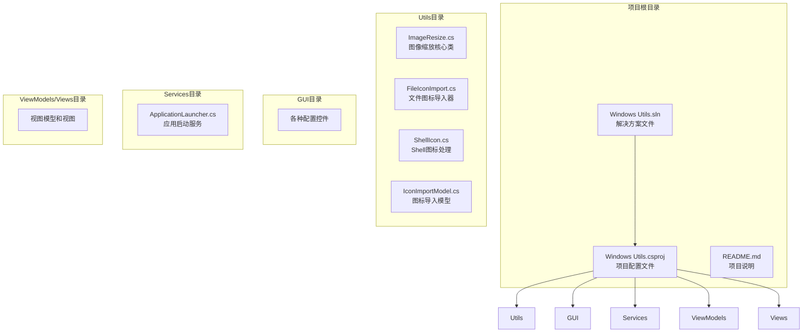
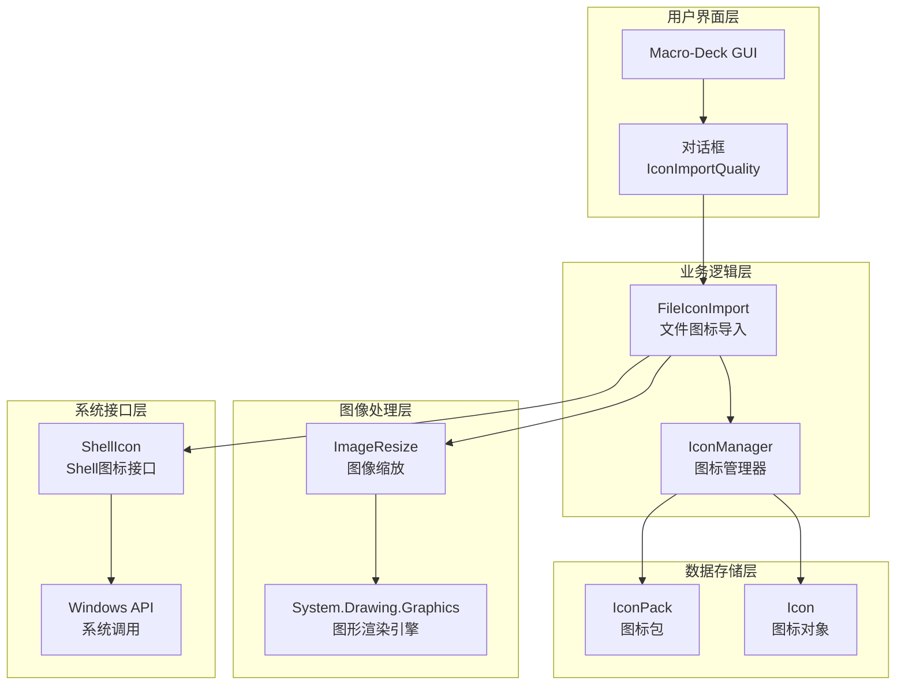
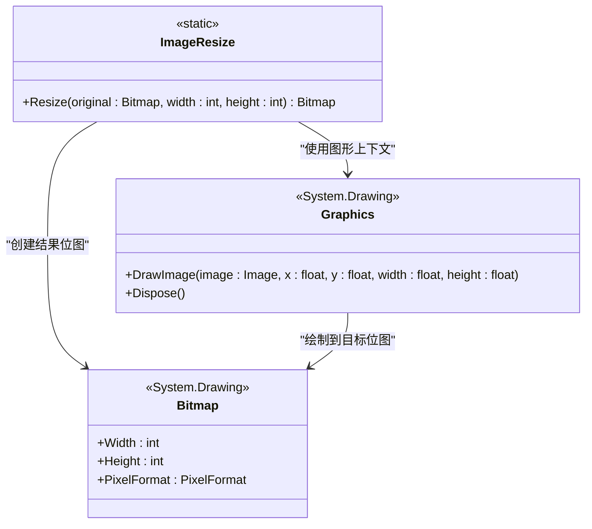
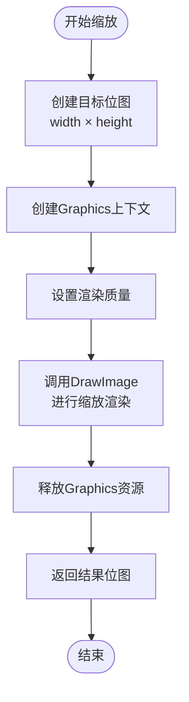
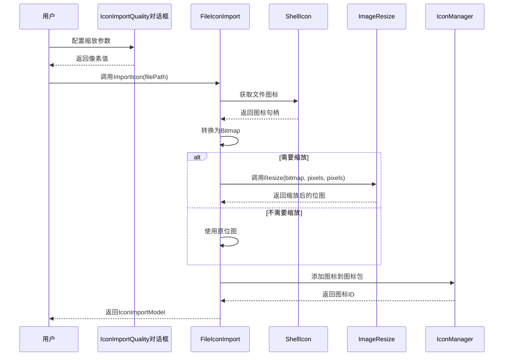
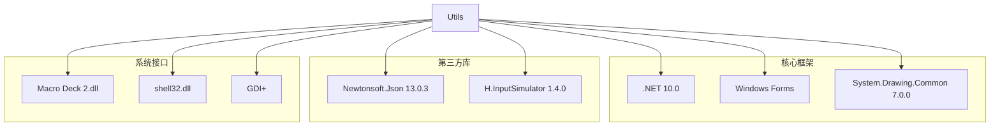
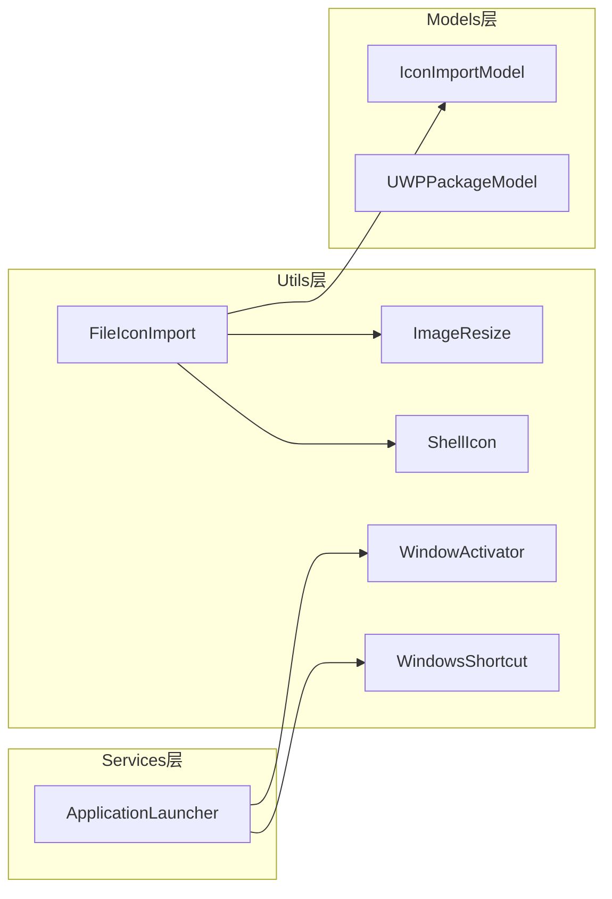
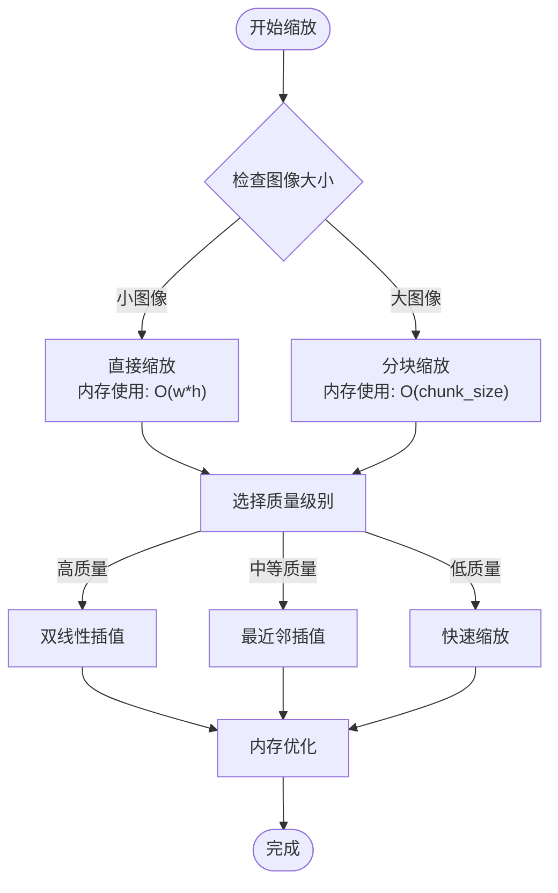

# 图像缩放工具

<cite>
**本文档引用的文件**
- [ImageResize.cs](file://Utils/ImageResize.cs)
- [FileIconImport.cs](file://Utils/FileIconImport.cs)
- [ShellIcon.cs](file://Utils/ShellIcon.cs)
- [IconImportModel.cs](file://Models/IconImportModel.cs)
- [Windows Utils.csproj](file://Windows Utils.csproj)
- [README.md](file://README.md)
</cite>

## 目录
1. [简介](#简介)
2. [项目结构](#项目结构)
3. [核心组件](#核心组件)
4. [架构概览](#架构概览)
5. [详细组件分析](#详细组件分析)
6. [依赖关系分析](#依赖关系分析)
7. [性能考虑](#性能考虑)
8. [故障排除指南](#故障排除指南)
9. [结论](#结论)

## 简介

ImageResize是Macro-Deck Windows Utils插件中的一个核心图像处理工具类，专门用于执行高质量的图像缩放操作。该工具基于.NET Framework的System.Drawing命名空间实现，提供了简单易用的静态方法来调整位图图像的尺寸。

该项目是一个为Macro-Deck 2开发的Windows实用工具插件，包含了多种系统控制功能，其中图像缩放是其核心特性之一。通过ImageResize工具，用户可以轻松地调整图标、图片和其他图形资源的尺寸，以满足不同的显示需求。

## 项目结构

项目采用标准的.NET桌面应用程序结构，主要包含以下关键目录和文件：



**图表来源**
- [Windows Utils.csproj:1-74](file://Windows Utils.csproj#L1-L74)
- [README.md:1-40](file://README.md#L1-L40)

**章节来源**
- [Windows Utils.csproj:1-74](file://Windows Utils.csproj#L1-L74)
- [README.md:1-40](file://README.md#L1-L40)

## 核心组件

### ImageResize类

ImageResize是整个图像处理系统的核心组件，提供了简洁而强大的图像缩放功能。该类采用静态方法设计，确保了易于使用的API接口。

#### 主要特性
- **高质量缩放**：利用System.Drawing.Graphics的内置算法进行图像缩放
- **内存安全**：自动管理位图资源的生命周期
- **简单易用**：提供单一的静态方法接口
- **跨格式支持**：支持所有System.Drawing支持的图像格式

#### 关键方法
- `Resize(Bitmap original, int width, int height)`: 执行图像缩放操作

**章节来源**
- [ImageResize.cs:1-21](file://Utils/ImageResize.cs#L1-L21)

### FileIconImport类

FileIconImport类展示了ImageResize在实际应用场景中的使用方式，特别是在文件图标导入过程中的缩放操作。

#### 功能特点
- **动态尺寸选择**：根据用户选择的像素值决定是否进行缩放
- **错误处理**：完善的异常处理机制
- **集成性**：与Macro-Deck的图标管理系统无缝集成

**章节来源**
- [FileIconImport.cs:1-67](file://Utils/FileIconImport.cs#L1-L67)

## 架构概览

ImageResize工具在整个系统中扮演着图像处理层的角色，负责将原始图像转换为目标尺寸的最终输出。



**图表来源**
- [FileIconImport.cs:14-64](file://Utils/FileIconImport.cs#L14-L64)
- [ImageResize.cs:8-17](file://Utils/ImageResize.cs#L8-L17)
- [ShellIcon.cs:48-164](file://Utils/ShellIcon.cs#L48-L164)

## 详细组件分析

### ImageResize类深度分析

#### 类结构设计



**图表来源**
- [ImageResize.cs:5-20](file://Utils/ImageResize.cs#L5-L20)

#### 实现细节

ImageResize类采用了极简但高效的实现策略：

1. **内存分配**：为结果位图预先分配指定尺寸的内存空间
2. **图形上下文**：创建专用的Graphics对象进行渲染
3. **缩放渲染**：利用Graphics.DrawImage的内置缩放算法
4. **资源管理**：使用using语句确保资源正确释放

#### 缩放算法分析

当前实现使用了System.Drawing.Graphics的默认缩放算法，该算法通常基于双线性插值技术：



**图表来源**
- [ImageResize.cs:8-17](file://Utils/ImageResize.cs#L8-L17)

**章节来源**
- [ImageResize.cs:1-21](file://Utils/ImageResize.cs#L1-L21)

### FileIconImport类集成分析

FileIconImport展示了ImageResize在实际工作流中的应用模式：



**图表来源**
- [FileIconImport.cs:14-64](file://Utils/FileIconImport.cs#L14-L64)
- [ImageResize.cs:8-17](file://Utils/ImageResize.cs#L8-L17)

**章节来源**
- [FileIconImport.cs:1-67](file://Utils/FileIconImport.cs#L1-L67)

### ShellIcon类系统集成

ShellIcon类提供了与Windows Shell系统的深度集成，支持从文件系统获取图标并进行处理：

#### 主要功能
- **文件类型识别**：通过SHGetFileInfo确定文件类型
- **图标索引获取**：获取对应文件类型的系统图标索引
- **大图标提取**：支持获取256×256的大图标
- **COM接口支持**：实现IImageList接口进行图标列表操作

**章节来源**
- [ShellIcon.cs:1-227](file://Utils/ShellIcon.cs#L1-L227)

## 依赖关系分析

### 外部依赖

项目的主要外部依赖包括：



**图表来源**
- [Windows Utils.csproj:35-47](file://Windows Utils.csproj#L35-L47)

### 内部模块依赖



**图表来源**
- [FileIconImport.cs:11-67](file://Utils/FileIconImport.cs#L11-L67)
- [ImageResize.cs:5-20](file://Utils/ImageResize.cs#L5-L20)

**章节来源**
- [Windows Utils.csproj:35-47](file://Windows Utils.csproj#L35-L47)

## 性能考虑

### 内存管理策略

ImageResize实现了严格的内存管理机制：

1. **及时释放**：使用using语句确保Graphics对象及时释放
2. **垃圾回收**：依赖.NET垃圾回收器管理位图内存
3. **资源池化**：避免不必要的位图复制操作

### 缩放性能优化

虽然当前实现相对简单，但仍有一些优化空间：

#### 当前实现的性能特征
- **时间复杂度**：O(w×h)，其中w和h为目标图像的宽高
- **空间复杂度**：O(w×h)，用于存储结果图像
- **内存峰值**：同时持有源图像和目标图像的内存

#### 潜在优化方案
1. **多线程处理**：对大型图像进行分块处理
2. **硬件加速**：利用GPU进行并行缩放
3. **缓存机制**：缓存常用尺寸的缩放结果
4. **质量级别**：提供不同的缩放质量选项

### 内存使用优化建议



## 故障排除指南

### 常见问题及解决方案

#### 图像缩放失败
**症状**：缩放操作返回null或抛出异常
**可能原因**：
1. 输入位图为空或已释放
2. 目标尺寸为负数或零
3. 内存不足导致位图创建失败

**解决方案**：
```csharp
// 安全的缩放调用示例
public static Bitmap SafeResize(Bitmap original, int width, int height)
{
    if (original == null) return null;
    if (width <= 0 || height <= 0) return null;
    
    try
    {
        return ImageResize.Resize(original, width, height);
    }
    catch (OutOfMemoryException)
    {
        // 处理内存不足情况
        return null;
    }
}
```

#### 图像质量不佳
**症状**：缩放后的图像模糊或锯齿严重
**解决方案**：
1. 使用更高分辨率的源图像
2. 考虑使用更高质量的缩放算法
3. 在缩放前进行锐化处理

#### 内存泄漏问题
**症状**：长时间运行后内存使用持续增长
**解决方案**：
1. 确保所有位图对象都正确释放
2. 避免创建过多的临时位图
3. 使用弱引用避免循环引用

**章节来源**
- [FileIconImport.cs:29-36](file://Utils/FileIconImport.cs#L29-L36)

### 性能监控

建议在生产环境中实施以下监控措施：

1. **内存使用监控**：跟踪位图对象的内存占用
2. **执行时间统计**：记录缩放操作的耗时
3. **错误率统计**：监控缩放失败的频率
4. **缓存命中率**：如果实现缓存，监控缓存效果

## 结论

ImageResize图像缩放工具虽然实现简洁，但在Macro-Deck插件生态系统中发挥着重要作用。其设计体现了以下优点：

1. **简洁性**：API设计直观易用，学习成本低
2. **可靠性**：基于成熟的System.Drawing框架，稳定性好
3. **集成性**：与Macro-Deck的其他组件无缝集成
4. **可扩展性**：为未来的功能增强预留了空间

### 改进建议

基于当前实现，建议考虑以下改进方向：

1. **算法优化**：引入更高级的缩放算法（如双三次插值）
2. **质量控制**：提供可配置的质量参数
3. **批量处理**：支持批量图像缩放操作
4. **进度报告**：为大型图像提供进度反馈
5. **错误恢复**：增强错误处理和恢复能力

该工具为Macro-Deck插件提供了可靠的图像缩放基础，通过合理的使用和适当的优化，能够满足大多数图像处理需求。