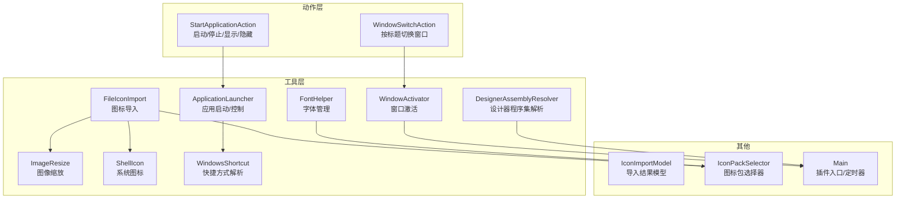
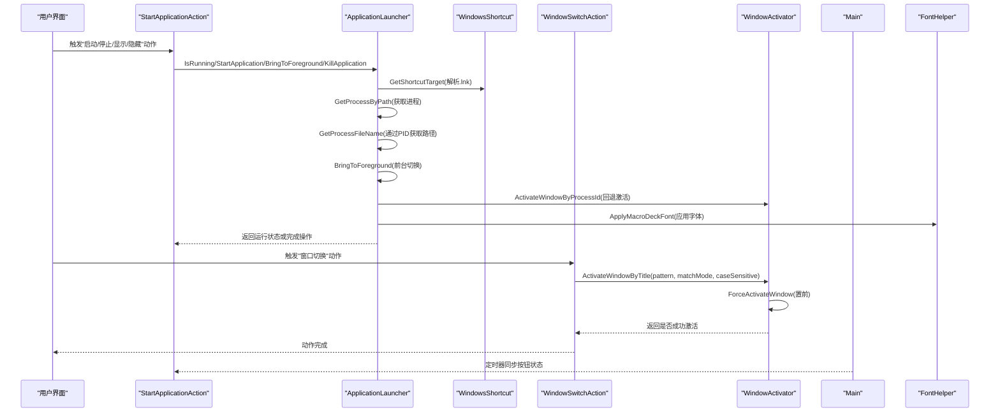
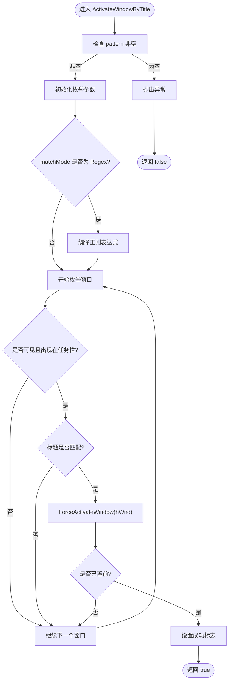
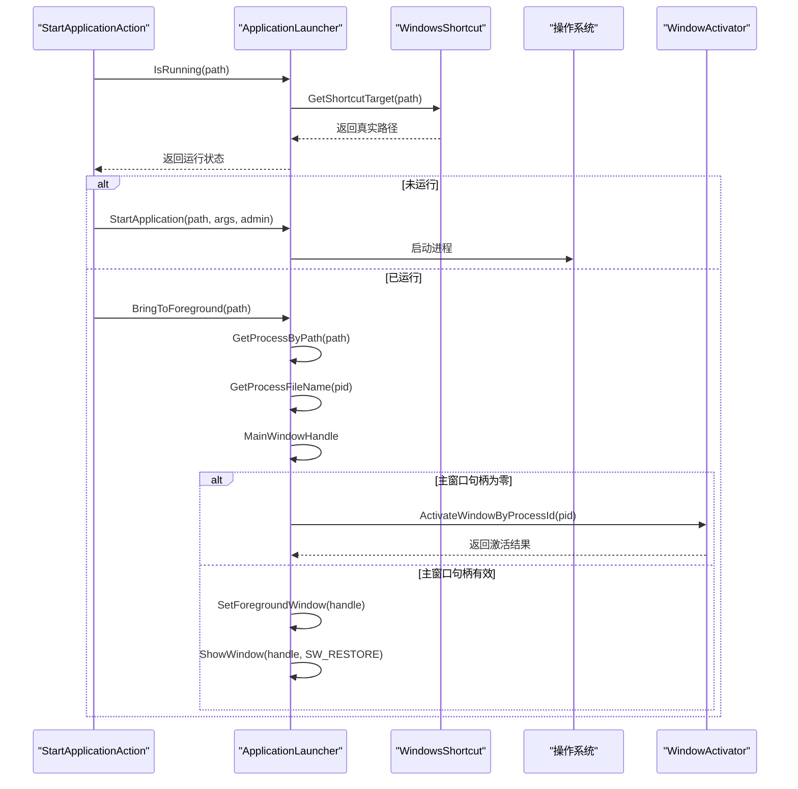
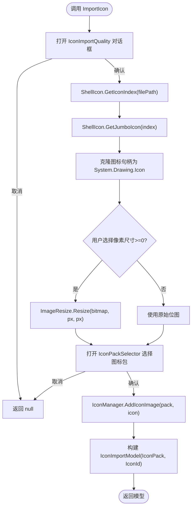
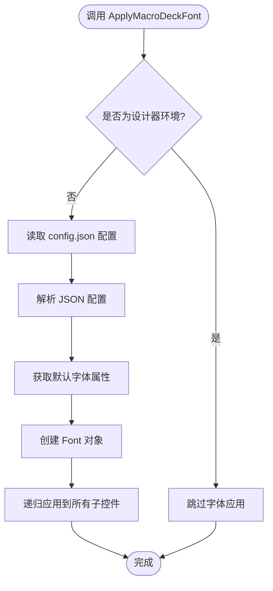
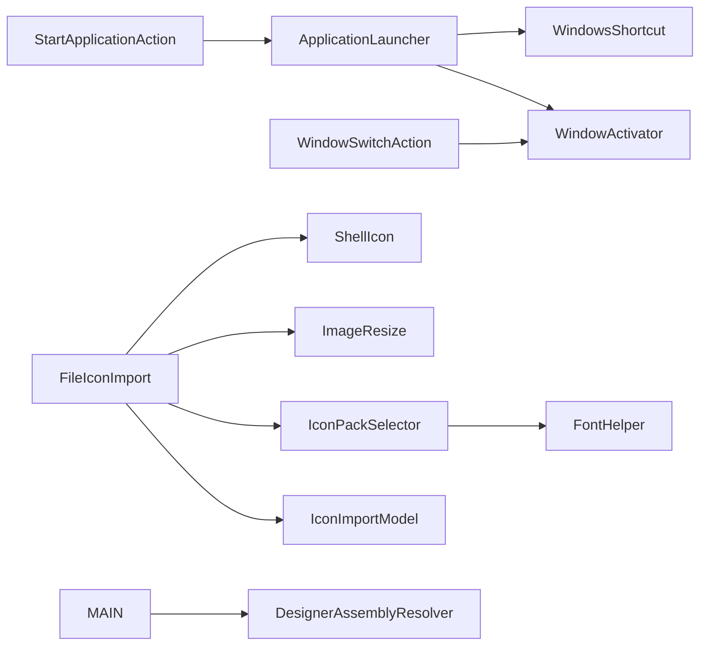

# 工具函数库

<cite>
**本文引用的文件列表**
- [WindowActivator.cs](file://Utils/WindowActivator.cs)
- [ApplicationLauncher.cs](file://Services/ApplicationLauncher.cs)
- [FileIconImport.cs](file://Utils/FileIconImport.cs)
- [ImageResize.cs](file://Utils/ImageResize.cs)
- [ShellIcon.cs](file://Utils/ShellIcon.cs)
- [WindowsShortcut.cs](file://Utils/WindowsShortcut.cs)
- [FontHelper.cs](file://Utils/FontHelper.cs)
- [DesignerAssemblyResolver.cs](file://Utils/DesignerAssemblyResolver.cs)
- [IconImportModel.cs](file://Models/IconImportModel.cs)
- [StartApplicationAction.cs](file://Actions/StartApplicationAction.cs)
- [WindowSwitchAction.cs](file://Actions/WindowSwitchAction.cs)
- [Main.cs](file://Main.cs)
- [IconPackSelector.cs](file://GUI/IconPackSelector.cs)
</cite>

## 目录
1. [简介](#简介)
2. [项目结构](#项目结构)
3. [核心组件](#核心组件)
4. [架构总览](#架构总览)
5. [详细组件分析](#详细组件分析)
6. [依赖关系分析](#依赖关系分析)
7. [性能考虑](#性能考虑)
8. [故障排查指南](#故障排查指南)
9. [结论](#结论)
10. [附录](#附录)

## 简介
本指南面向"工具函数库"的使用者与维护者，系统性介绍以下工具类的功能、API、参数与返回值，并结合项目中的实际使用场景（如窗口切换、应用启动等）给出最佳实践与性能优化建议：
- WindowActivator：基于标题匹配的窗口激活与前置，支持基于进程ID的激活回退机制
- ApplicationLauncher：应用程序启动、前台/后台切换、终止与运行状态检测，具备完整的窗口激活回退策略
- FileIconImport：从文件提取系统图标并导入到图标包
- ImageResize：基础图像缩放工具
- ShellIcon：通过系统 Shell 提取大尺寸图标句柄
- WindowsShortcut：解析 Windows 快捷方式目标路径
- **新增**：FontHelper：提供宏命令字体管理功能，自动应用配置文件中的字体设置到控件树
- **新增**：DesignerAssemblyResolver：解决Visual Studio设计器中的Sentry依赖加载问题，通过自定义程序集解析器确保设计器环境下的依赖完整性

同时，文档将展示各工具类在插件动作中的协作关系与调用序列，帮助读者快速上手并正确使用。

## 项目结构
该仓库为 Macro Deck 插件工程的一部分，工具类位于 Utils 与 Services 目录，业务动作位于 Actions 目录，模型与 GUI 组件用于配置与交互。

**图表来源**
- [WindowActivator.cs:1-313](file://Utils/WindowActivator.cs#L1-L313)
- [ApplicationLauncher.cs:1-224](file://Services/ApplicationLauncher.cs#L1-L224)
- [FileIconImport.cs:1-78](file://Utils/FileIconImport.cs#L1-L78)
- [ImageResize.cs:1-31](file://Utils/ImageResize.cs#L1-L31)
- [ShellIcon.cs:1-367](file://Utils/ShellIcon.cs#L1-L367)
- [WindowsShortcut.cs:1-77](file://Utils/WindowsShortcut.cs#L1-L77)
- [FontHelper.cs:1-38](file://Utils/FontHelper.cs#L1-L38)
- [DesignerAssemblyResolver.cs:1-78](file://Utils/DesignerAssemblyResolver.cs#L1-L78)
- [StartApplicationAction.cs:1-128](file://Actions/StartApplicationAction.cs#L1-L128)
- [WindowSwitchAction.cs:1-64](file://Actions/WindowSwitchAction.cs#L1-L64)
- [Main.cs:1-85](file://Main.cs#L1-L85)
- [IconPackSelector.cs:1-60](file://GUI/IconPackSelector.cs#L1-L60)

**章节来源**
- [Main.cs:1-85](file://Main.cs#L1-L85)

## 核心组件
- WindowActivator：提供按标题模式匹配的窗口查找与激活能力，支持部分匹配、全等匹配、前缀/后缀匹配以及正则表达式匹配，并对任务栏可见性进行过滤。**新增**：基于进程ID的窗口激活功能，专门处理最小化窗口的激活场景。
- ApplicationLauncher：封装应用启动、前台/后台切换、终止与运行状态检测；内部使用快捷方式解析以定位真实可执行路径。具备完整的窗口激活回退机制，当进程主窗口句柄为零时自动降级到基于进程ID的激活策略。**新增**：通过PID获取进程可执行路径的能力，提高进程识别的准确性。
- FileIconImport：从文件提取系统图标，按用户选择的像素尺寸缩放，再导入到指定图标包，返回导入结果模型。
- ImageResize：提供基础位图缩放能力，便于统一图标尺寸。
- ShellIcon：通过 Shell API 获取系统图标索引与大尺寸图标句柄，支持 Jumbo 图标（如 256×256）。
- WindowsShortcut：解析 .lnk 快捷方式文件，提取真实目标路径。
- **新增**：FontHelper：提供宏命令字体管理功能，通过扩展方法自动应用配置文件中的字体设置到控件树，支持粗体/常规样式切换。
- **新增**：DesignerAssemblyResolver：解决Visual Studio设计器中的Sentry依赖加载问题，通过ModuleInitializer注册自定义程序集解析器，在设计器加载插件时强制加载所需的依赖项。

**章节来源**
- [WindowActivator.cs:1-313](file://Utils/WindowActivator.cs#L1-L313)
- [ApplicationLauncher.cs:1-224](file://Services/ApplicationLauncher.cs#L1-L224)
- [FileIconImport.cs:1-78](file://Utils/FileIconImport.cs#L1-L78)
- [ImageResize.cs:1-31](file://Utils/ImageResize.cs#L1-L31)
- [ShellIcon.cs:1-367](file://Utils/ShellIcon.cs#L1-L367)
- [WindowsShortcut.cs:1-77](file://Utils/WindowsShortcut.cs#L1-L77)
- [FontHelper.cs:1-38](file://Utils/FontHelper.cs#L1-L38)
- [DesignerAssemblyResolver.cs:1-78](file://Utils/DesignerAssemblyResolver.cs#L1-L78)

## 架构总览
下图展示了工具类在插件动作中的协作关系与数据流。

**图表来源**
- [StartApplicationAction.cs:38-70](file://Actions/StartApplicationAction.cs#L38-L70)
- [ApplicationLauncher.cs:135-170](file://Services/ApplicationLauncher.cs#L135-L170)
- [WindowsShortcut.cs:16-75](file://Utils/WindowsShortcut.cs#L16-L75)
- [WindowSwitchAction.cs:46](file://Actions/WindowSwitchAction.cs#L46)
- [WindowActivator.cs:190-214](file://Utils/WindowActivator.cs#L190-L214)
- [Main.cs:77-82](file://Main.cs#L77-L82)
- [FontHelper.cs:16-29](file://Utils/FontHelper.cs#L16-L29)

## 详细组件分析

### WindowActivator（窗口激活）
- 功能概述
  - 按标题模式匹配查找可见且出现在任务栏的窗口，并将其置前。
  - 支持多种匹配模式：部分匹配、全等匹配、前缀匹配、后缀匹配、正则匹配。
  - 内部通过枚举所有顶层窗口，过滤不可见或工具窗口，再根据匹配规则判断。
  - **新增**：基于进程ID的窗口激活功能，专门处理最小化窗口的激活场景。
- 关键 API
  - ActivateWindowByTitle(pattern, matchMode = Partial, caseSensitive = true) -> bool
    - 参数
      - pattern：标题匹配字符串或正则表达式
      - matchMode：匹配模式（Partial/Full/StartsWith/EndsWith/Regex）
      - caseSensitive：大小写敏感
    - 返回值：是否找到并成功激活
  - **新增**：ActivateWindowByProcessId(processId) -> bool
    - 参数：processId：目标进程ID
    - 返回值：是否找到并成功激活对应进程的主窗口
  - ForceActivateWindow(hWnd)：强制将指定窗口置前
- 匹配流程（算法概要）

**图表来源**
- [WindowActivator.cs:57-126](file://Utils/WindowActivator.cs#L57-L126)
- [WindowActivator.cs:220-262](file://Utils/WindowActivator.cs#L220-L262)
- [WindowActivator.cs:190-214](file://Utils/WindowActivator.cs#L190-L214)

**章节来源**
- [WindowActivator.cs:1-313](file://Utils/WindowActivator.cs#L1-L313)
- [WindowSwitchAction.cs:1-64](file://Actions/WindowSwitchAction.cs#L1-L64)

### ApplicationLauncher（应用启动/控制）
- 功能概述
  - 启动应用（支持管理员权限）、检测运行状态、前台/后台切换、终止进程。
  - 内部使用快捷方式解析以解析 .lnk 目标路径，确保能正确识别真实可执行文件。
  - **新增**：完整的窗口激活回退机制，当进程主窗口句柄为零时自动使用基于进程ID的激活策略。
  - **新增**：通过PID获取进程可执行路径的能力，提高进程识别的准确性。
- 关键 API
  - IsRunning(path) -> bool：判断给定路径的应用是否正在运行
  - StartApplication(path, arguments, asAdmin)：启动应用
  - KillApplication(path)：终止应用进程
  - BringToBackground(path)：最小化前台窗口
  - **增强**：BringToForeground(path)：置前窗口（包含基于进程ID的回退逻辑）
  - **新增**：GetProcessByPath(path) -> Process：根据路径获取进程（解析 .lnk）
  - **新增**：GetProcessFileName(pid) -> string：通过PID查询进程可执行路径
- 调用序列（启动/前台切换）

**图表来源**
- [StartApplicationAction.cs:53-60](file://Actions/StartApplicationAction.cs#L53-L60)
- [ApplicationLauncher.cs:135-170](file://Services/ApplicationLauncher.cs#L135-L170)
- [WindowsShortcut.cs:16-75](file://Utils/WindowsShortcut.cs#L16-L75)
- [WindowActivator.cs:190-214](file://Utils/WindowActivator.cs#L190-L214)

**章节来源**
- [ApplicationLauncher.cs:1-224](file://Services/ApplicationLauncher.cs#L1-L224)
- [StartApplicationAction.cs:1-128](file://Actions/StartApplicationAction.cs#L1-L128)

### FileIconImport（图标导入）
- 功能概述
  - 打开质量选择对话框，获取用户期望的像素尺寸；从文件提取系统图标，按需缩放；打开图标包选择器，将图标添加到选定图标包；返回导入结果模型。
- 关键 API
  - ImportIcon(filePath) -> IconImportModel 或 null：执行导入流程
- 数据模型
  - IconImportModel：包含 IconPack 与 IconId 字段，用于标识导入后的图标位置
- 使用流程

**图表来源**
- [FileIconImport.cs:21-75](file://Utils/FileIconImport.cs#L21-L75)
- [ShellIcon.cs:353-365](file://Utils/ShellIcon.cs#L353-L365)
- [ImageResize.cs:17-27](file://Utils/ImageResize.cs#L17-L27)
- [IconImportModel.cs:6-22](file://Models/IconImportModel.cs#L6-L22)
- [IconPackSelector.cs:13-58](file://GUI/IconPackSelector.cs#L13-L58)

**章节来源**
- [FileIconImport.cs:1-78](file://Utils/FileIconImport.cs#L1-L78)
- [IconImportModel.cs:1-23](file://Models/IconImportModel.cs#L1-L23)

### ImageResize（图像缩放）
- 功能概述
  - 将输入位图按指定宽高进行重采样缩放，返回新的位图对象。
- 关键 API
  - Resize(original, width, height) -> Bitmap：缩放图像
- 注意事项
  - 缩放过程会创建新位图并释放旧资源，注意及时释放返回对象以避免内存泄漏。

**章节来源**
- [ImageResize.cs:1-31](file://Utils/ImageResize.cs#L1-L31)

### ShellIcon（系统图标）
- 功能概述
  - 通过 Shell API 获取文件的系统图标索引，并从系统图像列表中提取大尺寸图标句柄（如 256×256 的 Jumbo 图标）。
- 关键 API
  - GetIconIndex(pszFile) -> int：获取系统图标索引
  - GetJumboIcon(iImage) -> IntPtr：获取 Jumbo 图标句柄
- 常量与结构
  - SHIL_*：大中小图标级别常量
  - SHGFI_*：查询标志位集合
  - IImageList 接口：系统图像列表接口
- 使用建议
  - 获取到的图标句柄需妥善释放，避免 GDI 资源泄露。

**章节来源**
- [ShellIcon.cs:1-367](file://Utils/ShellIcon.cs#L1-L367)

### WindowsShortcut（快捷方式解析）
- 功能概述
  - 解析 .lnk 文件，提取其目标路径（包括可能存在的 Unicode 路径片段拼接）。
- 关键 API
  - GetShortcutTarget(file) -> string：解析 .lnk 并返回目标路径
- 行为说明
  - 若不是 .lnk 文件，直接返回原路径。
  - 解析失败时返回空字符串，调用方应做好容错处理。

**章节来源**
- [WindowsShortcut.cs:1-77](file://Utils/WindowsShortcut.cs#L1-L77)

### FontHelper（字体管理）
- 功能概述
  - 提供宏命令字体管理功能，通过扩展方法自动应用配置文件中的字体设置到控件树。
  - 支持从应用数据目录读取配置文件，动态应用字体族、大小和粗体样式。
  - 在设计器环境下自动跳过字体应用，避免设计器冲突。
- 关键 API
  - ApplyMacroDeckFont(root) -> void：扩展方法，将字体设置应用到控件树
- 配置文件格式
  - config.json：包含 Font、Font.Size、Font.Bold 等配置项
- 使用流程

**图表来源**
- [FontHelper.cs:16-36](file://Utils/FontHelper.cs#L16-L36)

**章节来源**
- [FontHelper.cs:1-38](file://Utils/FontHelper.cs#L1-L38)

### DesignerAssemblyResolver（设计器程序集解析器）
- 功能概述
  - 解决Visual Studio设计器中的Sentry依赖加载问题，通过自定义程序集解析器确保设计器环境下的依赖完整性。
  - 仅在DEBUG配置下编译，使用ModuleInitializer在插件DLL加载时自动注册解析器。
  - 通过扫描Macro Deck安装目录查找缺失的依赖项，强制加载到程序集加载上下文中。
- 关键 API
  - Register() -> void：ModuleInitializer方法，注册程序集解析器并强制加载Sentry依赖
- 解析策略
  - 监听AssemblyLoadContext.Resolving事件
  - 在指定目录（如 "C:\Program Files\Macro Deck"）查找依赖项
  - 使用LoadFromAssemblyPath加载找到的程序集
- 设计原理
  - 通过typeof(SentryOptions)在元数据层面声明对Sentry的依赖
  - 在ModuleInitializer中立即force-load Sentry，确保后续解析命中缓存

**章节来源**
- [DesignerAssemblyResolver.cs:1-78](file://Utils/DesignerAssemblyResolver.cs#L1-L78)

## 依赖关系分析
- 动作到工具类
  - StartApplicationAction 依赖 ApplicationLauncher 与 WindowsShortcut
  - WindowSwitchAction 依赖 WindowActivator
  - FileIconImport 依赖 ShellIcon、ImageResize、IconPackSelector、IconImportModel
- 工具类间耦合
  - ApplicationLauncher 间接依赖 WindowsShortcut（解析 .lnk）
  - **新增**：ApplicationLauncher 依赖 WindowActivator（基于进程ID的激活回退）
  - FileIconImport 依赖 ShellIcon 与 ImageResize
  - WindowActivator 依赖系统 P/Invoke（user32.dll/shell32.dll）
  - **新增**：IconPackSelector 依赖 FontHelper（应用字体）
  - **新增**：Main 类依赖 DesignerAssemblyResolver（设计器支持）
- 外部依赖
  - Windows API（user32.dll、shell32.dll、psapi.dll、kernel32.dll）
  - MacroDeck GUI/Icons/语言模块（MessageBox、IconManager、语言资源）
  - **新增**：Newtonsoft.Json（JSON配置解析）
  - **新增**：Sentry（调试器依赖，通过DesignerAssemblyResolver解决）

**图表来源**
- [StartApplicationAction.cs:1-128](file://Actions/StartApplicationAction.cs#L1-L128)
- [WindowSwitchAction.cs:1-64](file://Actions/WindowSwitchAction.cs#L1-L64)
- [FileIconImport.cs:1-78](file://Utils/FileIconImport.cs#L1-L78)
- [ApplicationLauncher.cs:1-224](file://Services/ApplicationLauncher.cs#L1-L224)
- [WindowActivator.cs:1-313](file://Utils/WindowActivator.cs#L1-L313)
- [ShellIcon.cs:1-367](file://Utils/ShellIcon.cs#L1-L367)
- [ImageResize.cs:1-31](file://Utils/ImageResize.cs#L1-L31)
- [WindowsShortcut.cs:1-77](file://Utils/WindowsShortcut.cs#L1-L77)
- [IconPackSelector.cs:1-60](file://GUI/IconPackSelector.cs#L1-L60)
- [IconImportModel.cs:1-23](file://Models/IconImportModel.cs#L1-L23)
- [FontHelper.cs:1-38](file://Utils/FontHelper.cs#L1-L38)
- [DesignerAssemblyResolver.cs:1-78](file://Utils/DesignerAssemblyResolver.cs#L1-L78)

## 性能考虑
- 窗口枚举与匹配
  - WindowActivator 在全局枚举窗口，建议：
    - 使用更精确的匹配模式（如 StartsWith/EndsWith）减少正则开销
    - 控制匹配范围（如仅搜索当前用户会话），避免不必要的系统调用
    - **新增**：对于最小化的窗口，优先使用基于进程ID的激活方法，避免全局窗口枚举
- 图标提取与缩放
  - ShellIcon 获取 Jumbo 图标成本较高，建议：
    - 缓存常用文件的图标索引与句柄
    - 对高频缩放场景复用缩放结果，避免重复创建位图
- 应用启动与状态轮询
  - ApplicationLauncher 的 IsRunning 与定时器轮询应合理设置间隔，避免频繁查询导致 CPU 占用
  - **新增**：GetProcessFileName 方法使用了高效的进程句柄访问，但需要注意权限限制
- I/O 与 UI 交互
  - FileIconImport 弹出多个对话框，建议：
    - 在批量导入时合并 UI 流程，减少用户交互次数
    - 对异常路径与解析失败进行快速短路，避免无谓的后续调用
- **新增**：FontHelper 性能优化
  - 配置文件读取应在应用启动时缓存，避免重复解析
  - 递归应用字体到控件树时，可以考虑延迟应用策略
- **新增**：DesignerAssemblyResolver 性能考虑
  - 程序集解析器仅在设计器环境下工作，不影响运行时性能
  - 目录扫描应限制在必要的路径范围内

## 故障排查指南
- 窗口无法激活
  - 确认目标窗口是否出现在任务栏（工具窗口、无主窗口等会被过滤）
  - 检查匹配模式与大小写设置是否正确
  - 若使用正则，请确认正则表达式有效
  - **新增**：对于最小化的窗口，检查是否可以通过基于进程ID的方法激活
- 应用启动失败或路径错误
  - 确认传入路径是否为 .lnk，必要时先解析 .lnk 再启动
  - 管理员权限启动需要正确的 UAC 提示与权限
  - **新增**：检查进程句柄权限，某些系统进程可能无法通过 GetProcessFileName 访问
- 图标导入失败
  - 检查文件是否存在且可访问
  - 确认用户选择了有效的图标包
  - 缩放尺寸是否合理（过小可能导致失真）
- 进程状态不同步
  - 定时器间隔过长会导致按钮状态更新滞后，适当缩短轮询间隔
  - 确保路径解析一致（始终使用 GetShortcutTarget）
  - **新增**：检查基于进程ID的激活回退机制是否正常工作
- **新增**：字体应用问题
  - 确认 config.json 文件存在且格式正确
  - 检查设计器环境下的字体应用是否被正确跳过
  - 验证字体族名称是否在系统中可用
- **新增**：设计器依赖加载问题
  - 确认 Macro Deck 安装目录存在且可访问
  - 检查Sentry.dll文件是否存在于指定路径
  - 验证程序集解析器是否正确注册

**章节来源**
- [WindowActivator.cs:57-126](file://Utils/WindowActivator.cs#L57-L126)
- [ApplicationLauncher.cs:135-170](file://Services/ApplicationLauncher.cs#L135-L170)
- [FileIconImport.cs:21-75](file://Utils/FileIconImport.cs#L21-L75)
- [FontHelper.cs:16-29](file://Utils/FontHelper.cs#L16-L29)
- [DesignerAssemblyResolver.cs:42-59](file://Utils/DesignerAssemblyResolver.cs#L42-L59)

## 结论
本工具函数库围绕"窗口管理、应用控制、图标处理、图像缩放、快捷方式解析、字体管理和设计器支持"提供了稳定、可组合的工具集。通过与插件动作的紧密协作，能够满足自动化桌面操作与图标管理的常见需求。

**最新增强功能总结**：
- **ApplicationLauncher**：实现了完整的窗口激活回退机制，当进程主窗口句柄为零时自动使用基于进程ID的激活策略，显著提高了窗口激活的成功率
- **WindowActivator**：新增基于进程ID的窗口激活功能，专门处理最小化窗口的激活场景，增强了工具的鲁棒性
- **进程管理**：新增通过PID获取进程可执行路径的能力，提高了进程识别的准确性和安全性
- **快捷方式解析**：新增独立的 WindowsShortcut 工具类，专门处理 .lnk 文件解析，提升了代码的模块化程度
- **FontHelper**：新增宏命令字体管理功能，自动应用配置文件中的字体设置到控件树，提升用户体验一致性
- **DesignerAssemblyResolver**：新增设计器程序集解析器，解决Visual Studio设计器中的Sentry依赖加载问题，确保开发环境稳定性

建议在生产环境中遵循性能与健壮性原则，合理缓存与短路处理，提升整体响应速度与用户体验。

## 附录
- 最佳使用模式
  - 窗口切换：优先使用前缀/后缀匹配，避免正则开销；若需跨进程置前，使用 ForceActivateWindow；对于最小化窗口，优先考虑基于进程ID的激活方法
  - 应用启动：先解析 .lnk，再根据运行状态决定启动或置前；管理员权限需谨慎使用；利用回退机制处理各种窗口状态
  - 图标导入：统一缩放到目标尺寸，批量导入时合并 UI 交互
  - **新增**：字体应用：在控件初始化时调用 ApplyMacroDeckFont 扩展方法，确保字体设置的一致性
  - **新增**：设计器支持：确保 DesignerAssemblyResolver 在DEBUG配置下正确编译和注册
- 常见问题速查
  - 如何区分 .lnk 与真实可执行文件？使用 GetShortcutTarget
  - 如何获取大尺寸系统图标？使用 ShellIcon.GetJumboIcon
  - 如何避免频繁轮询导致的性能问题？合理设置定时器间隔并缓存结果
  - **新增**：如何处理最小化窗口的激活？使用基于进程ID的激活方法
  - **新增**：如何获取系统进程的可执行路径？使用 GetProcessFileName 方法
  - **新增**：如何解析复杂的 .lnk 文件格式？使用 WindowsShortcut 类的二进制解析逻辑
  - **新增**：如何应用宏命令字体？使用 FontHelper.ApplyMacroDeckFont 扩展方法
  - **新增**：如何解决设计器依赖问题？确保 DesignerAssemblyResolver 正确注册并扫描 Macro Deck 安装目录