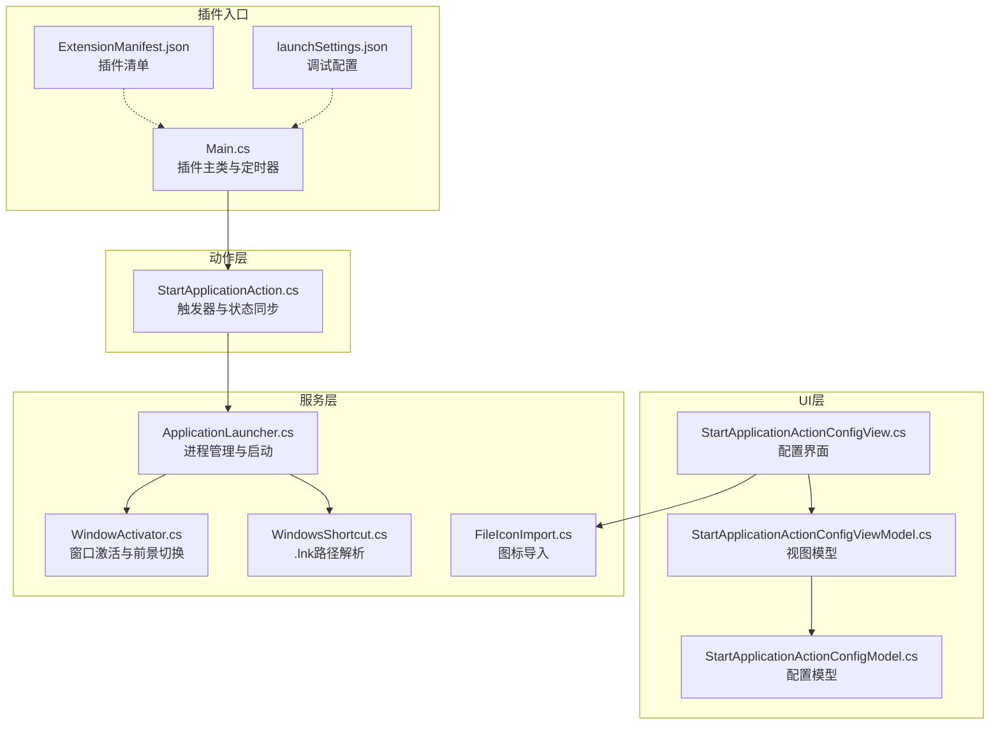
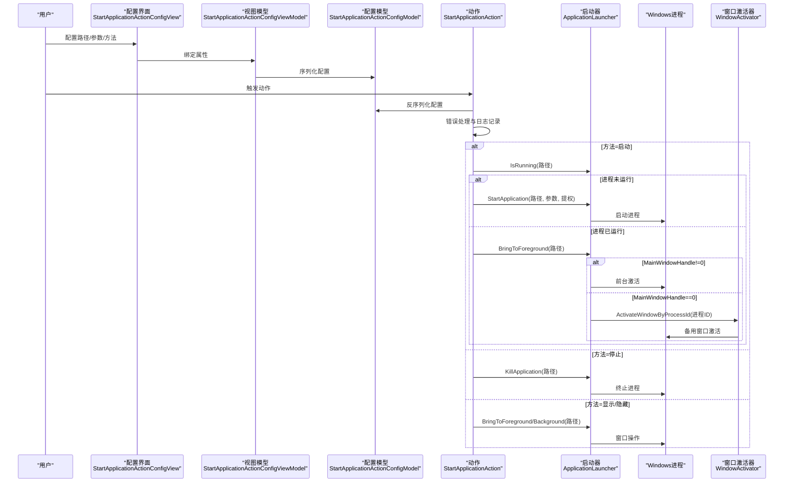
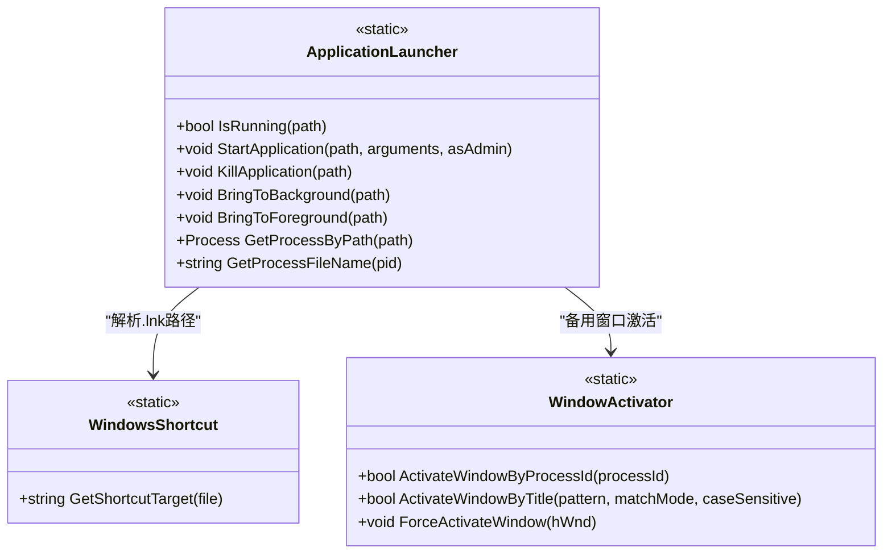
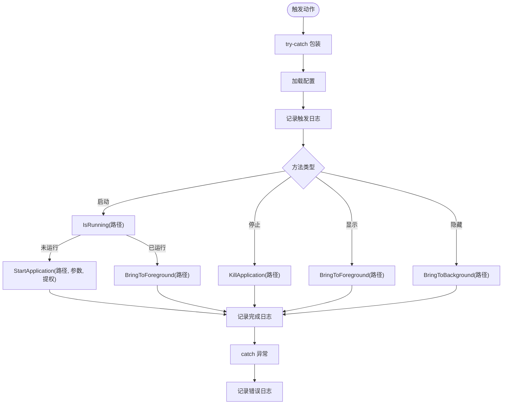
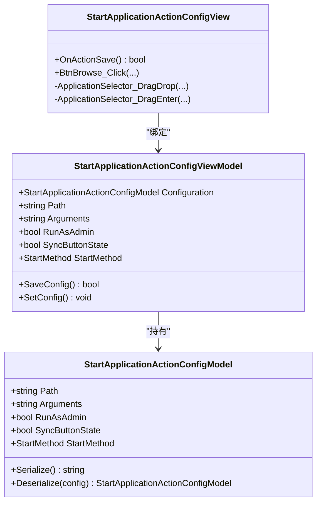
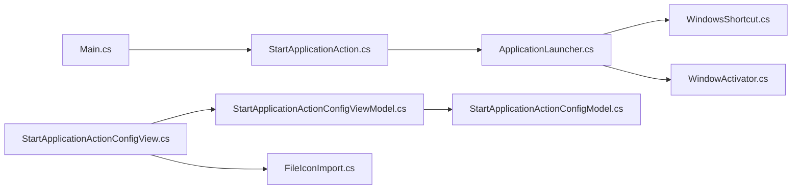

# 应用程序启动器

<cite>
**本文档引用的文件**
- [ApplicationLauncher.cs](file://Services/ApplicationLauncher.cs)
- [StartApplicationAction.cs](file://Actions/StartApplicationAction.cs)
- [StartApplicationActionConfigModel.cs](file://Models/StartApplicationActionConfigModel.cs)
- [StartApplicationActionConfigViewModel.cs](file://ViewModels/StartApplicationActionConfigViewModel.cs)
- [StartApplicationActionConfigView.cs](file://Views/StartApplicationActionConfigView.cs)
- [WindowsShortcut.cs](file://Utils/WindowsShortcut.cs)
- [WindowActivator.cs](file://Utils/WindowActivator.cs)
- [Main.cs](file://Main.cs)
- [FileIconImport.cs](file://Utils/FileIconImport.cs)
- [README.md](file://README.md)
- [ExtensionManifest.json](file://ExtensionManifest.json)
- [launchSettings.json](file://Properties/launchSettings.json)
</cite>

## 更新摘要
**所做更改**
- 更新了 ApplicationLauncher.GetProcessByPath 方法中的空值比较，修复了 NullReferenceException 错误
- 增强了 StartApplicationAction.Trigger 方法的错误处理和诊断日志记录
- 添加了详细的错误处理和日志记录改进说明
- 更新了故障排除指南以包含新的错误处理机制

## 目录
1. [简介](#简介)
2. [项目结构](#项目结构)
3. [核心组件](#核心组件)
4. [架构总览](#架构总览)
5. [详细组件分析](#详细组件分析)
6. [依赖关系分析](#依赖关系分析)
7. [性能考量](#性能考量)
8. [故障排除指南](#故障排除指南)
9. [结论](#结论)
10. [附录](#附录)

## 简介
本指南面向Macro Deck插件"Windows Utils"中的应用程序启动器（ApplicationLauncher），系统性介绍如何通过可执行文件路径、命令行参数、工作目录与启动选项进行应用启动；说明进程管理能力（监控、验证、前台/后台切换、终止）；提供常见启动场景与错误处理策略；解释启动权限、路径解析与环境变量处理；并给出性能优化与安全注意事项。该插件为Macro Deck 2的扩展，不作为独立应用运行。

**重要更新**：最新版本修复了关键的 NullReferenceException 错误，改进了进程路径解析的空值安全比较，并增强了错误处理和诊断日志记录功能。

## 项目结构
该项目采用按职责分层的组织方式：
- Services 层：核心业务逻辑（ApplicationLauncher）
- Actions 层：宏动作实现（StartApplicationAction）
- Models 层：配置模型（StartApplicationActionConfigModel）
- ViewModels 层：视图模型（StartApplicationActionConfigViewModel）
- Views 层：配置界面（StartApplicationActionConfigView）
- Utils 层：工具类（WindowsShortcut、FileIconImport、WindowActivator等）
- 其他：Main入口、语言资源、清单与调试配置

**图表来源**
- [Main.cs:16-62](file://Main.cs#L16-L62)
- [StartApplicationAction.cs:14-99](file://Actions/StartApplicationAction.cs#L14-L99)
- [ApplicationLauncher.cs:13-176](file://Services/ApplicationLauncher.cs#L13-L176)
- [WindowsShortcut.cs:5-66](file://Utils/WindowsShortcut.cs#L5-L66)
- [StartApplicationActionConfigView.cs:13-159](file://Views/StartApplicationActionConfigView.cs#L13-L159)
- [StartApplicationActionConfigViewModel.cs:8-73](file://ViewModels/StartApplicationActionConfigViewModel.cs#L8-L73)
- [StartApplicationActionConfigModel.cs:6-36](file://Models/StartApplicationActionConfigModel.cs#L6-L36)
- [FileIconImport.cs:11-67](file://Utils/FileIconImport.cs#L11-L67)
- [WindowActivator.cs:9-289](file://Utils/WindowActivator.cs#L9-L289)
- [ExtensionManifest.json:1-11](file://ExtensionManifest.json#L1-L11)
- [launchSettings.json:1-9](file://Properties/launchSettings.json#L1-L9)

**章节来源**
- [README.md:1-40](file://README.md#L1-L40)
- [ExtensionManifest.json:1-11](file://ExtensionManifest.json#L1-L11)
- [launchSettings.json:1-9](file://Properties/launchSettings.json#L1-L9)

## 核心组件
- **ApplicationLauncher**：提供进程检测、启动、终止、前台/后台切换、路径解析与进程文件名查询。**已修复**：改进了空值安全比较，防止 NullReferenceException。
- **StartApplicationAction**：根据配置触发启动、停止、显示或隐藏操作，并支持按钮状态同步。**已增强**：增加了全面的错误处理和诊断日志记录。
- 配置模型与视图模型：序列化/反序列化配置，绑定UI控件。
- 视图：提供文件选择、拖拽、图标导入与保存配置流程。
- **WindowActivator**：新增的窗口激活工具，用于处理MainWindowHandle为零的情况。
- 工具类：Windows快捷方式解析与图标导入。

**章节来源**
- [ApplicationLauncher.cs:13-176](file://Services/ApplicationLauncher.cs#L13-L176)
- [StartApplicationAction.cs:14-99](file://Actions/StartApplicationAction.cs#L14-L99)
- [StartApplicationActionConfigModel.cs:6-36](file://Models/StartApplicationActionConfigModel.cs#L6-L36)
- [StartApplicationActionConfigViewModel.cs:8-73](file://ViewModels/StartApplicationActionConfigViewModel.cs#L8-L73)
- [StartApplicationActionConfigView.cs:13-159](file://Views/StartApplicationActionConfigView.cs#L13-L159)
- [WindowsShortcut.cs:5-66](file://Utils/WindowsShortcut.cs#L5-L66)
- [WindowActivator.cs:9-289](file://Utils/WindowActivator.cs#L9-L289)
- [FileIconImport.cs:11-67](file://Utils/FileIconImport.cs#L11-L67)

## 架构总览
ApplicationLauncher作为核心服务，被StartApplicationAction调用以完成启动与进程管理。配置从UI层传入，经视图模型与模型序列化后持久化到插件配置中。路径解析通过WindowsShortcut处理.lnk文件，确保指向真实目标。**新增**：WindowActivator提供备用窗口激活机制。

**图表来源**
- [StartApplicationAction.cs:22-65](file://Actions/StartApplicationAction.cs#L22-L65)
- [ApplicationLauncher.cs:39-135](file://Services/ApplicationLauncher.cs#L39-L135)
- [StartApplicationActionConfigView.cs:87-135](file://Views/StartApplicationActionConfigView.cs#L87-L135)
- [StartApplicationActionConfigViewModel.cs:53-71](file://ViewModels/StartApplicationActionConfigViewModel.cs#L53-L71)
- [StartApplicationActionConfigModel.cs:19-26](file://Models/StartApplicationActionConfigModel.cs#L19-L26)
- [WindowActivator.cs:180-204](file://Utils/WindowActivator.cs#L180-L204)

## 详细组件分析

### ApplicationLauncher（进程管理与启动）
- **进程检测**：通过路径解析与进程文件名匹配判断是否已在运行。**已修复**：使用 string.Equals 进行空值安全比较，防止 NullReferenceException。
- **启动应用**：使用Shell执行，自动设置工作目录为可执行文件所在目录，支持管理员权限与命令行参数。
- **终止应用**：查找进程并终止所有同名进程实例。**已增强**：添加了详细的警告日志记录。
- **前台/后台**：通过窗口句柄最小化或恢复窗口，必要时回退到最小化再还原。**已增强**：添加了空值检查和警告日志。
- **路径解析**：支持.lnk快捷方式，解析真实目标路径。
- **性能优化**：进程文件名查询使用内联优化，减少开销。

**图表来源**
- [ApplicationLauncher.cs:13-176](file://Services/ApplicationLauncher.cs#L13-L176)
- [WindowsShortcut.cs:5-66](file://Utils/WindowsShortcut.cs#L5-L66)
- [WindowActivator.cs:9-289](file://Utils/WindowActivator.cs#L9-L289)

**章节来源**
- [ApplicationLauncher.cs:39-176](file://Services/ApplicationLauncher.cs#L39-L176)
- [WindowsShortcut.cs:8-64](file://Utils/WindowsShortcut.cs#L8-L64)
- [WindowActivator.cs:180-204](file://Utils/WindowActivator.cs#L180-L204)

### StartApplicationAction（动作触发与状态同步）
- **触发逻辑**：根据配置的方法类型执行启动、停止、显示或隐藏。
- **启动策略**：若进程未运行则启动，否则将窗口置前。
- **状态同步**：启用按钮状态同步时，定时器周期检查进程运行状态并更新按钮状态。
- **错误处理**：**已增强**：增加了全面的 try-catch 块，记录详细的错误信息和堆栈跟踪。
- **诊断日志**：**已增强**：添加了触发、完成和错误的完整日志记录。

**图表来源**
- [StartApplicationAction.cs:22-65](file://Actions/StartApplicationAction.cs#L22-L65)

**章节来源**
- [StartApplicationAction.cs:22-99](file://Actions/StartApplicationAction.cs#L22-L99)

### 配置模型与视图模型
- 配置模型：包含路径、参数、是否以管理员身份运行、是否同步按钮状态、启动方法枚举。
- 视图模型：封装配置读写、摘要生成与保存流程，记录日志。
- 视图：提供文件选择器、拖拽支持、图标导入对话框与保存确认。

**图表来源**
- [StartApplicationActionConfigModel.cs:6-36](file://Models/StartApplicationActionConfigModel.cs#L6-L36)
- [StartApplicationActionConfigViewModel.cs:8-73](file://ViewModels/StartApplicationActionConfigViewModel.cs#L8-L73)
- [StartApplicationActionConfigView.cs:13-159](file://Views/StartApplicationActionConfigView.cs#L13-L159)

**章节来源**
- [StartApplicationActionConfigModel.cs:6-36](file://Models/StartApplicationActionConfigModel.cs#L6-L36)
- [StartApplicationActionConfigViewModel.cs:8-73](file://ViewModels/StartApplicationActionConfigViewModel.cs#L8-L73)
- [StartApplicationActionConfigView.cs:13-159](file://Views/StartApplicationActionConfigView.cs#L13-L159)

### 工具类：Windows快捷方式解析与图标导入
- **WindowsShortcut**：解析.lnk快捷方式，提取真实目标路径，兼容相对路径与网络路径片段拼接。
- **FileIconImport**：从文件提取大图标，提供尺寸调整与图标包导入，便于在Macro Deck中使用。
- **WindowActivator**：**新增**：提供备用窗口激活机制，处理MainWindowHandle为零的情况。

**章节来源**
- [WindowsShortcut.cs:8-64](file://Utils/WindowsShortcut.cs#L8-L64)
- [FileIconImport.cs:14-64](file://Utils/FileIconImport.cs#L14-L64)
- [WindowActivator.cs:180-204](file://Utils/WindowActivator.cs#L180-L204)

## 依赖关系分析
- 插件入口与定时器：Main类负责注册动作与启动定时器，用于按钮状态同步。
- 动作依赖：StartApplicationAction依赖ApplicationLauncher与配置模型。
- 启动器依赖：ApplicationLauncher依赖WindowsShortcut进行路径解析，并通过Windows API进行进程与窗口操作。**新增**：依赖WindowActivator处理特殊窗口激活场景。
- UI依赖：视图依赖视图模型与语言资源，保存时调用图标导入工具。

**图表来源**
- [Main.cs:30-61](file://Main.cs#L30-L61)
- [StartApplicationAction.cs:14-99](file://Actions/StartApplicationAction.cs#L14-L99)
- [ApplicationLauncher.cs:13-176](file://Services/ApplicationLauncher.cs#L13-L176)
- [WindowsShortcut.cs:5-66](file://Utils/WindowsShortcut.cs#L5-L66)
- [WindowActivator.cs:9-289](file://Utils/WindowActivator.cs#L9-L289)
- [StartApplicationActionConfigView.cs:13-159](file://Views/StartApplicationActionConfigView.cs#L13-L159)
- [StartApplicationActionConfigViewModel.cs:8-73](file://ViewModels/StartApplicationActionConfigViewModel.cs#L8-L73)
- [StartApplicationActionConfigModel.cs:6-36](file://Models/StartApplicationActionConfigModel.cs#L6-L36)
- [FileIconImport.cs:11-67](file://Utils/FileIconImport.cs#L11-L67)

**章节来源**
- [Main.cs:30-61](file://Main.cs#L30-L61)
- [StartApplicationAction.cs:14-99](file://Actions/StartApplicationAction.cs#L14-L99)
- [ApplicationLauncher.cs:13-176](file://Services/ApplicationLauncher.cs#L13-L176)
- [WindowsShortcut.cs:5-66](file://Utils/WindowsShortcut.cs#L5-L66)
- [WindowActivator.cs:9-289](file://Utils/WindowActivator.cs#L9-L289)
- [StartApplicationActionConfigView.cs:13-159](file://Views/StartApplicationActionConfigView.cs#L13-L159)
- [StartApplicationActionConfigViewModel.cs:8-73](file://ViewModels/StartApplicationActionConfigViewModel.cs#L8-L73)
- [StartApplicationActionConfigModel.cs:6-36](file://Models/StartApplicationActionConfigModel.cs#L6-L36)
- [FileIconImport.cs:11-67](file://Utils/FileIconImport.cs#L11-L67)

## 性能考量
- **进程扫描与文件名查询**：ApplicationLauncher对进程列表进行过滤与排序，建议仅在必要时调用（如按钮状态同步间隔2秒）。**已优化**：GetProcessFileName使用内联优化并及时关闭句柄，降低资源泄漏风险。
- **内存与句柄**：GetProcessFileName使用内联优化并及时关闭句柄，降低资源泄漏风险。
- **UI线程**：按钮状态同步在后台任务中执行，避免阻塞UI。
- **启动效率**：使用UseShellExecute可利用系统默认行为，减少手动解析开销；但需注意工作目录与参数传递的一致性。
- **错误处理开销**：**新增**：增强的日志记录和错误处理不会显著影响性能，但提供了更好的诊断能力。

**章节来源**
- [ApplicationLauncher.cs:150-176](file://Services/ApplicationLauncher.cs#L150-L176)
- [StartApplicationAction.cs:86-98](file://Actions/StartApplicationAction.cs#L86-L98)
- [Main.cs:55-61](file://Main.cs#L55-L61)

## 故障排除指南
- **启动失败**
  - 检查路径是否有效且存在，支持.exe/.lnk/.url等类型。
  - 若为.lnk，确认目标路径正确解析。
  - 尝试以管理员身份运行（RunAsAdmin）。
- **进程未找到**
  - 确认目标进程名称与路径一致；不同安装位置可能产生多个实例。
  - 使用"停止"方法先终止现有实例，再尝试启动。
  - **新增**：检查日志中是否有"当前进程不存在"警告信息。
- **窗口无法置前**
  - 某些应用可能处于最小化或非活动状态，回退逻辑会尝试最小化后再还原。
  - **新增**：如果MainWindowHandle为零，系统会使用WindowActivator进行备用激活。
- **空引用异常**
  - **已修复**：ApplicationLauncher现在使用string.Equals进行空值安全比较，防止NullReferenceException。
  - **新增**：检查日志中是否有相关的空值比较错误信息。
- **图标导入失败**
  - 确认文件存在且可访问；调整图标尺寸与格式。
- **日志定位**
  - 使用Macro Deck日志查看器，关注插件命名空间下的警告与错误信息。
  - **新增**：StartApplicationAction现在提供详细的触发、完成和错误日志记录。

**章节来源**
- [ApplicationLauncher.cs:60-135](file://Services/ApplicationLauncher.cs#L60-L135)
- [StartApplicationAction.cs:24-65](file://Actions/StartApplicationAction.cs#L24-L65)
- [StartApplicationActionConfigView.cs:117-133](file://Views/StartApplicationActionConfigView.cs#L117-L133)
- [StartApplicationActionConfigViewModel.cs:55-64](file://ViewModels/StartApplicationActionConfigViewModel.cs#L55-L64)

## 结论
ApplicationLauncher提供了简洁而强大的Windows应用启动与进程管理能力，结合Macro Deck的动作系统，可覆盖常见的启动、停止、显示/隐藏与状态同步场景。**最新版本**通过以下改进显著提升了稳定性：
- 修复了关键的 NullReferenceException 错误
- 改进了空值安全的进程路径比较
- 增强了错误处理和诊断日志记录
- 新增了WindowActivator备用窗口激活机制

通过.lnk解析与管理员权限支持，满足多样化的部署需求。建议在生产环境中合理设置按钮状态同步频率，并谨慎使用提权选项以保障系统安全。

## 附录

### 使用示例与最佳实践
- **启动可执行文件（带参数）**
  - 在配置界面设置路径为可执行文件或.lnk快捷方式，填写参数字段，选择"启动"方法。
  - 如需管理员权限，勾选"以管理员身份运行"，首次启动将弹出UAC提示。
- **启动后置前**
  - 若应用已运行，动作将自动将其置前；若未运行，则启动并置前。
  - **新增**：即使MainWindowHandle为零，也能通过WindowActivator成功激活窗口。
- **停止应用**
  - 选择"停止"方法，系统将终止所有同名进程实例。
  - **新增**：详细的警告日志会记录无法找到进程的情况。
- **显示/隐藏窗口**
  - 使用"显示/隐藏"方法控制窗口可见性，适用于多实例或无窗口应用。
- **图标导入**
  - 保存配置时可选择导入文件图标，提升按钮识别度。

**章节来源**
- [StartApplicationAction.cs:35-57](file://Actions/StartApplicationAction.cs#L35-L57)
- [StartApplicationActionConfigView.cs:87-135](file://Views/StartApplicationActionConfigView.cs#L87-L135)
- [FileIconImport.cs:14-64](file://Utils/FileIconImport.cs#L14-L64)

### 安全与权限
- **提权启动**：仅在必要时启用"以管理员身份运行"，避免不必要的权限暴露。
- **路径校验**：优先使用绝对路径，避免相对路径导致的工作目录问题。
- **快捷方式**：.lnk目标可能指向网络路径，注意访问权限与可用性。
- **错误隔离**：**新增**：增强的错误处理确保单个动作失败不会影响其他功能。

**章节来源**
- [ApplicationLauncher.cs:45-58](file://Services/ApplicationLauncher.cs#L45-L58)
- [WindowsShortcut.cs:8-64](file://Utils/WindowsShortcut.cs#L8-L64)

### 环境变量与工作目录
- **工作目录**：启动时自动设置为可执行文件所在目录，确保相对路径与资源加载正常。
- **环境变量**：通过Shell执行继承当前用户环境，如需自定义可在外部脚本中设置。
- **进程文件名获取**：**已优化**：使用内联方法和适当的句柄管理，提高性能并减少资源泄漏。

**章节来源**
- [ApplicationLauncher.cs:47-57](file://Services/ApplicationLauncher.cs#L47-L57)
- [ApplicationLauncher.cs:150-176](file://Services/ApplicationLauncher.cs#L150-L176)

### 错误处理与诊断
- **NullReferenceException修复**：ApplicationLauncher.GetProcessByPath现在使用string.Equals进行空值安全比较。
- **增强的日志记录**：StartApplicationAction提供完整的触发、执行和错误日志。
- **备用窗口激活**：WindowActivator处理MainWindowHandle为零的特殊情况。
- **性能监控**：日志记录不会显著影响性能，但提供了强大的诊断能力。

**章节来源**
- [ApplicationLauncher.cs:137-148](file://Services/ApplicationLauncher.cs#L137-L148)
- [StartApplicationAction.cs:22-65](file://Actions/StartApplicationAction.cs#L22-L65)
- [WindowActivator.cs:180-204](file://Utils/WindowActivator.cs#L180-L204)