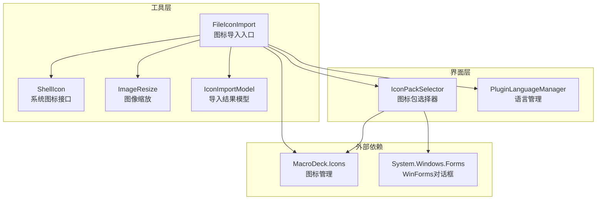
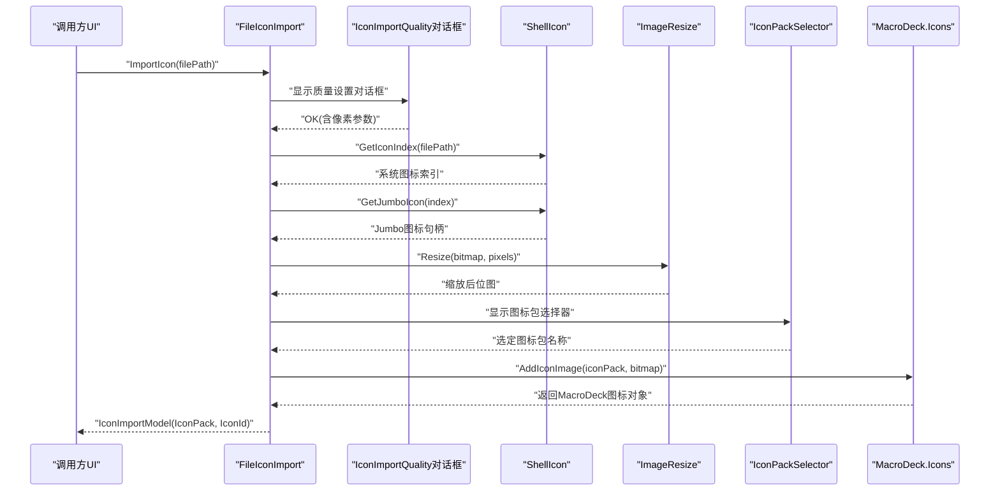
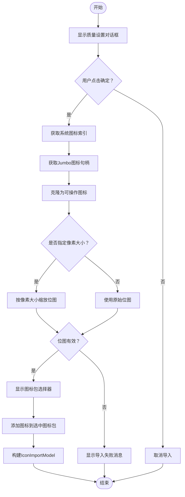
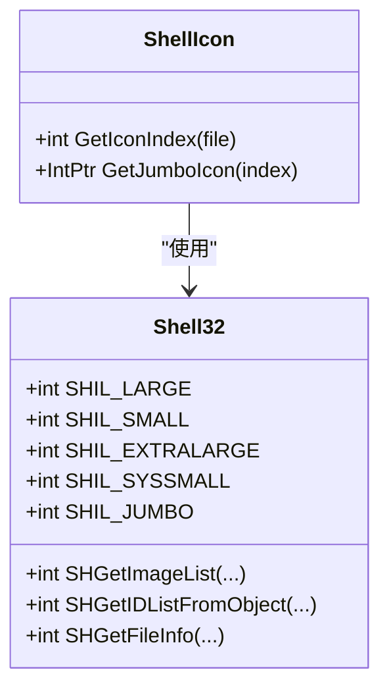
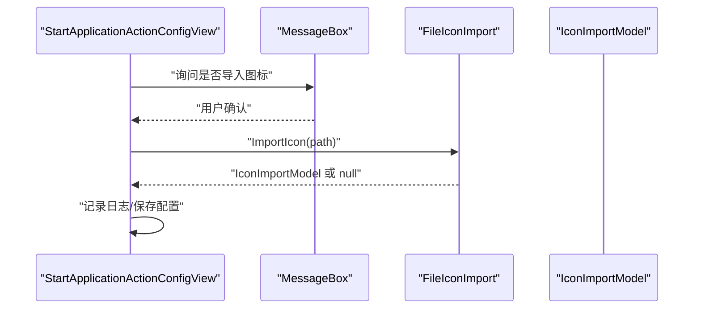
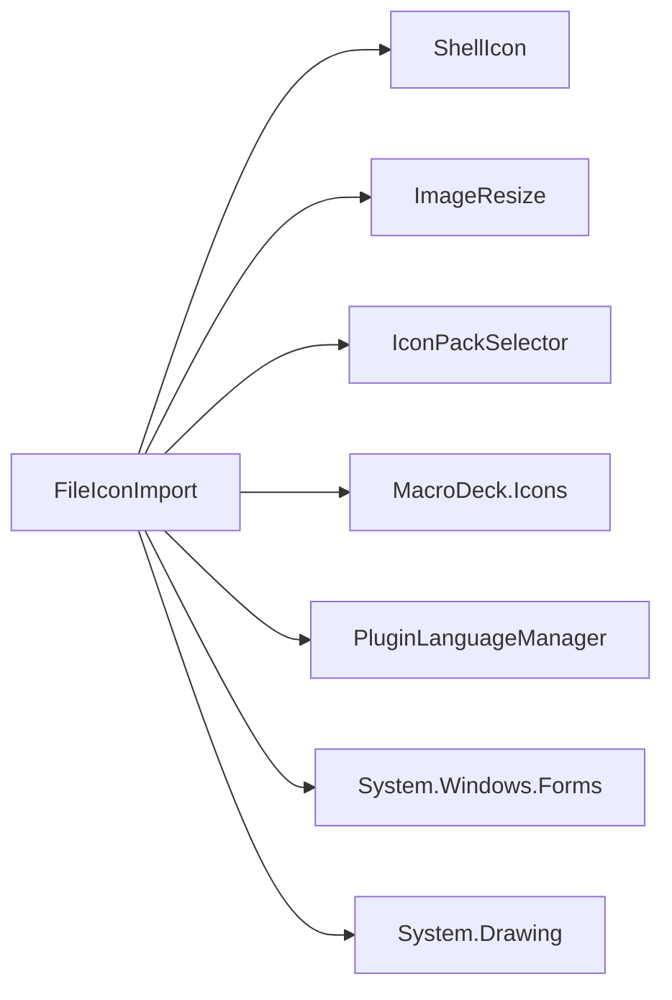

# 文件图标导入器

<cite>
**本文档引用的文件**
- [FileIconImport.cs](file://Utils/FileIconImport.cs)
- [ShellIcon.cs](file://Utils/ShellIcon.cs)
- [ImageResize.cs](file://Utils/ImageResize.cs)
- [IconImportModel.cs](file://Models/IconImportModel.cs)
- [IconPackSelector.cs](file://GUI/IconPackSelector.cs)
- [IconPackSelector.Designer.cs](file://GUI/IconPackSelector.Designer.cs)
- [PluginLanguageManager.cs](file://Language/PluginLanguageManager.cs)
- [README.md](file://README.md)
- [StartApplicationActionConfigView.cs](file://Views/StartApplicationActionConfigView.cs)
- [FileFolderSelector.cs](file://GUI/FileFolderSelector.cs)
</cite>

## 目录
1. [简介](#简介)
2. [项目结构](#项目结构)
3. [核心组件](#核心组件)
4. [架构概览](#架构概览)
5. [详细组件分析](#详细组件分析)
6. [依赖关系分析](#依赖关系分析)
7. [性能考量](#性能考量)
8. [故障排除指南](#故障排除指南)
9. [结论](#结论)
10. [附录](#附录)

## 简介
本指南面向使用者与开发者，详细介绍 Windows Utils 插件中的文件图标导入器（FileIconImport）。该组件负责从任意文件（如 EXE、DLL、图片、文档等）中提取系统图标，并将其导入到 Macro Deck 的图标包中，支持用户选择目标图标尺寸与目标图标包。文档涵盖图标提取机制、系统图标获取、自定义图标处理、尺寸适配、导入流程、错误处理与最佳实践。

## 项目结构
文件图标导入器位于 Utils 命名空间下，核心入口为静态类 FileIconImport，配合 ShellIcon 提供系统图标索引与大尺寸图标句柄获取，ImageResize 负责图像缩放，IconImportModel 作为返回结果模型，IconPackSelector 提供图标包选择界面，PluginLanguageManager 提供本地化字符串。

**图表来源**
- [FileIconImport.cs:11-66](file://Utils/FileIconImport.cs#L11-L66)
- [ShellIcon.cs:48-337](file://Utils/ShellIcon.cs#L48-L337)
- [ImageResize.cs:5-21](file://Utils/ImageResize.cs#L5-L21)
- [IconImportModel.cs:3-15](file://Models/IconImportModel.cs#L3-L15)
- [IconPackSelector.cs:9-43](file://GUI/IconPackSelector.cs#L9-L43)
- [PluginLanguageManager.cs:8-51](file://Language/PluginLanguageManager.cs#L8-L51)

**章节来源**
- [README.md:1-40](file://README.md#L1-L40)
- [FileIconImport.cs:11-66](file://Utils/FileIconImport.cs#L11-L66)

## 核心组件
- FileIconImport：图标导入主流程控制，负责弹出质量设置对话框、调用系统图标接口、执行缩放、选择图标包并写入图标管理器。
- ShellIcon：封装 Windows Shell API，提供文件系统图标索引与 Jumbo 图标句柄获取。
- ImageResize：提供基础的位图缩放能力，确保输出符合用户指定像素大小。
- IconImportModel：封装导入后的图标包名称与图标 ID，便于后续使用。
- IconPackSelector：提供用户选择目标图标包的界面，若无可用图标包则自动创建默认包。
- PluginLanguageManager：加载插件语言资源，用于界面提示文本的本地化显示。

**章节来源**
- [FileIconImport.cs:14-64](file://Utils/FileIconImport.cs#L14-L64)
- [ShellIcon.cs:313-335](file://Utils/ShellIcon.cs#L313-L335)
- [ImageResize.cs:8-17](file://Utils/ImageResize.cs#L8-L17)
- [IconImportModel.cs:6-13](file://Models/IconImportModel.cs#L6-L13)
- [IconPackSelector.cs:20-36](file://GUI/IconPackSelector.cs#L20-L36)
- [PluginLanguageManager.cs:18-33](file://Language/PluginLanguageManager.cs#L18-L33)

## 架构概览
文件图标导入器采用“对话框驱动 + 系统 API + 图像处理 + 图标管理”的分层设计。调用链从 UI 触发开始，经由 FileIconImport 组织流程，通过 ShellIcon 获取系统图标，使用 ImageResize 进行尺寸调整，最终由 MacroDeck.Icons 将图标写入选定的图标包。

**图表来源**
- [FileIconImport.cs:16-64](file://Utils/FileIconImport.cs#L16-L64)
- [ShellIcon.cs:313-335](file://Utils/ShellIcon.cs#L313-L335)
- [ImageResize.cs:8-17](file://Utils/ImageResize.cs#L8-L17)
- [IconPackSelector.cs:38-42](file://GUI/IconPackSelector.cs#L38-L42)

## 详细组件分析

### FileIconImport：图标导入主流程
- 输入：文件路径
- 流程要点：
  - 弹出 IconImportQuality 对话框，获取用户期望的像素大小。
  - 使用 ShellIcon 获取系统图标索引，再获取 Jumbo 图标句柄，转换为可克隆的 System.Drawing.Icon。
  - 若用户选择了特定像素，则对位图进行缩放；否则直接使用原始位图。
  - 弹出 IconPackSelector 选择目标图标包，调用 MacroDeck.Icons 将位图添加为图标。
  - 返回包含图标包名称与图标 ID 的模型对象。
- 错误处理：当缩放或添加图标失败时，弹出错误消息框并返回空值。

**图表来源**
- [FileIconImport.cs:16-64](file://Utils/FileIconImport.cs#L16-L64)

**章节来源**
- [FileIconImport.cs:14-64](file://Utils/FileIconImport.cs#L14-L64)

### ShellIcon：系统图标获取
- 功能：通过 Windows Shell API 获取文件的系统图标索引，并从 Jumbo 图标列表中提取高分辨率图标句柄。
- 关键点：
  - GetIconIndex：基于文件路径查询系统图标索引。
  - GetJumboIcon：通过 IImageList 接口获取指定索引的透明图标句柄，确保 256x256 的大尺寸图标。
- COM 互操作：使用 DllImport 调用 shell32.dll 与 IImageList 接口，保证与系统资源管理器一致的图标呈现。

**图表来源**
- [ShellIcon.cs:20-46](file://Utils/ShellIcon.cs#L20-L46)
- [ShellIcon.cs:313-335](file://Utils/ShellIcon.cs#L313-L335)

**章节来源**
- [ShellIcon.cs:313-335](file://Utils/ShellIcon.cs#L313-L335)

### ImageResize：图标尺寸适配
- 功能：将输入位图按指定宽高进行重采样，生成新位图。
- 注意：当前实现为简单拉伸缩放，未引入抗锯齿或高质量重采样策略。在大幅缩小或放大时可能影响视觉质量。

**章节来源**
- [ImageResize.cs:8-17](file://Utils/ImageResize.cs#L8-L17)

### IconImportModel：导入结果模型
- 字段：IconPack（图标包名称）、IconId（图标唯一标识），提供 ToString 以便调试与日志输出。

**章节来源**
- [IconImportModel.cs:6-13](file://Models/IconImportModel.cs#L6-L13)

### IconPackSelector：图标包选择器
- 功能：列出所有非扩展商店托管的图标包供用户选择；若不存在则自动创建默认图标包。
- 行为：按钮文本使用语言管理器提供的本地化字符串，确保多语言环境下的友好体验。

**章节来源**
- [IconPackSelector.cs:20-36](file://GUI/IconPackSelector.cs#L20-L36)
- [IconPackSelector.Designer.cs:34-71](file://GUI/IconPackSelector.Designer.cs#L34-L71)

### PluginLanguageManager：语言资源管理
- 功能：根据 Macro Deck 当前语言动态加载插件语言资源 XML，并提供本地化字符串。
- 作用：确保导入对话框与消息框的文本随系统语言变化。

**章节来源**
- [PluginLanguageManager.cs:18-33](file://Language/PluginLanguageManager.cs#L18-L33)

### 实际使用示例
- 启动应用动作配置视图：当用户确认导入图标时，调用 FileIconImport.ImportIcon 并记录异常日志。
- 文件/文件夹选择器：拖拽文件后询问是否导入对应类型的图标，随后调用导入器。

**图表来源**
- [StartApplicationActionConfigView.cs:117-134](file://Views/StartApplicationActionConfigView.cs#L117-L134)
- [FileIconImport.cs:14-64](file://Utils/FileIconImport.cs#L14-L64)

**章节来源**
- [StartApplicationActionConfigView.cs:117-134](file://Views/StartApplicationActionConfigView.cs#L117-L134)
- [FileFolderSelector.cs:73-84](file://GUI/FileFolderSelector.cs#L73-L84)

## 依赖关系分析
- FileIconImport 依赖：
  - ShellIcon：系统图标索引与句柄获取
  - ImageResize：位图缩放
  - IconPackSelector：图标包选择
  - MacroDeck.Icons：图标写入与管理
  - PluginLanguageManager：本地化文本
- 外部依赖：
  - System.Drawing：图标与位图处理
  - System.Windows.Forms：WinForms 对话框与消息框
  - MacroDeck.GUI 与 Language：UI 控件与语言资源

**图表来源**
- [FileIconImport.cs:1-7](file://Utils/FileIconImport.cs#L1-L7)
- [IconPackSelector.cs:1-5](file://GUI/IconPackSelector.cs#L1-L5)

**章节来源**
- [FileIconImport.cs:1-7](file://Utils/FileIconImport.cs#L1-L7)
- [IconPackSelector.cs:1-5](file://GUI/IconPackSelector.cs#L1-L5)

## 性能考量
- 图标尺寸与内存占用：
  - Jumbo 图标通常为 256x256，内存占用较高；建议根据实际显示需求选择合适的像素大小，避免不必要的大尺寸位图。
  - 缩放操作会创建新的位图对象，频繁缩放可能增加内存分配与 GC 压力。
- 图像缩放质量：
  - 当前缩放实现为简单拉伸，未启用高质量重采样；在大幅缩放时可能出现模糊或锯齿。可考虑引入更高质量的缩放算法以提升视觉效果。
- UI 响应性：
  - 在大文件或大量缩放操作时，建议在后台线程执行缩放与写入，避免阻塞 UI 线程。
- 缓存策略：
  - 可考虑对已导入的图标进行缓存（基于文件路径与像素大小），避免重复提取与缩放，提高重复导入场景的效率。

[本节为通用性能建议，不直接分析具体文件，故无章节来源]

## 故障排除指南
- 导入失败：
  - 现象：缩放或添加图标失败时，弹出“导入失败”消息框并返回空值。
  - 排查：检查输入文件是否存在且可访问；确认目标图标包存在且可写；查看异常日志定位具体错误。
- 图标显示异常：
  - 现象：导入后图标模糊或比例不对。
  - 排查：确认像素参数设置合理；尝试更高的像素值；评估是否需要更高质量的缩放算法。
- 语言显示问题：
  - 现象：对话框文本未按预期语言显示。
  - 排查：确认 Macro Deck 已正确加载语言资源；检查语言资源文件是否完整。

**章节来源**
- [FileIconImport.cs:29-36](file://Utils/FileIconImport.cs#L29-L36)
- [StartApplicationActionConfigView.cs:128-131](file://Views/StartApplicationActionConfigView.cs#L128-L131)
- [PluginLanguageManager.cs:23-33](file://Language/PluginLanguageManager.cs#L23-L33)

## 结论
文件图标导入器通过系统 Shell API 获取高分辨率图标，结合用户自定义像素大小与图标包选择，实现了从多种文件类型中稳定提取并导入图标的完整流程。建议在生产环境中关注内存与缩放质量，并结合缓存策略提升重复导入场景的性能与用户体验。

## 附录
- 支持的文件类型示例：EXE、DLL、图片（PNG/JPEG/BMP 等）、文档（PDF/DOCX 等）。导入器依赖系统为这些文件关联的图标，因此兼容性取决于系统资源管理器的图标映射。
- 最佳实践：
  - 优先使用 256x256 的 Jumbo 图标作为源，再按需缩放至目标尺寸。
  - 避免在 UI 线程执行耗时的缩放与写入操作。
  - 对于高频导入场景，建立基于文件路径与像素大小的缓存机制。
  - 在导入前验证文件路径有效性与可读性，减少异常分支。

[本节为概念性总结，不直接分析具体文件，故无章节来源]