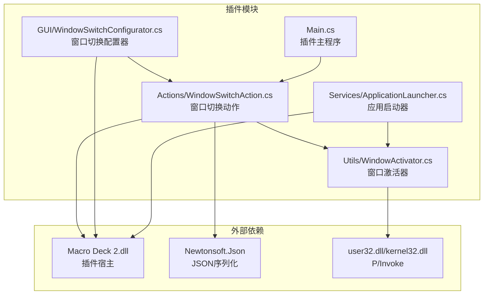
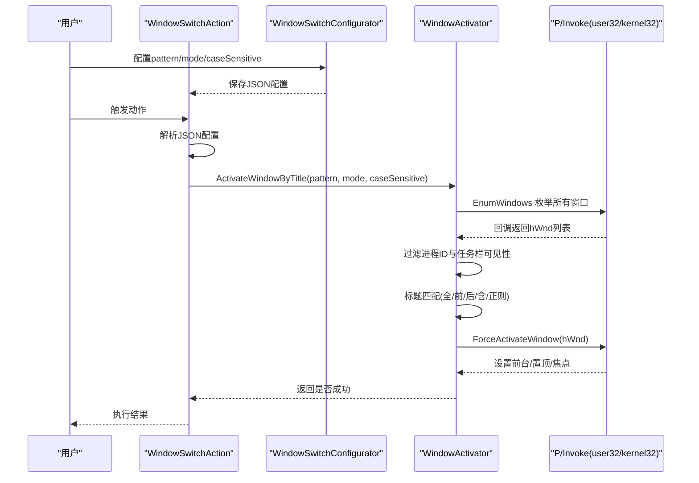
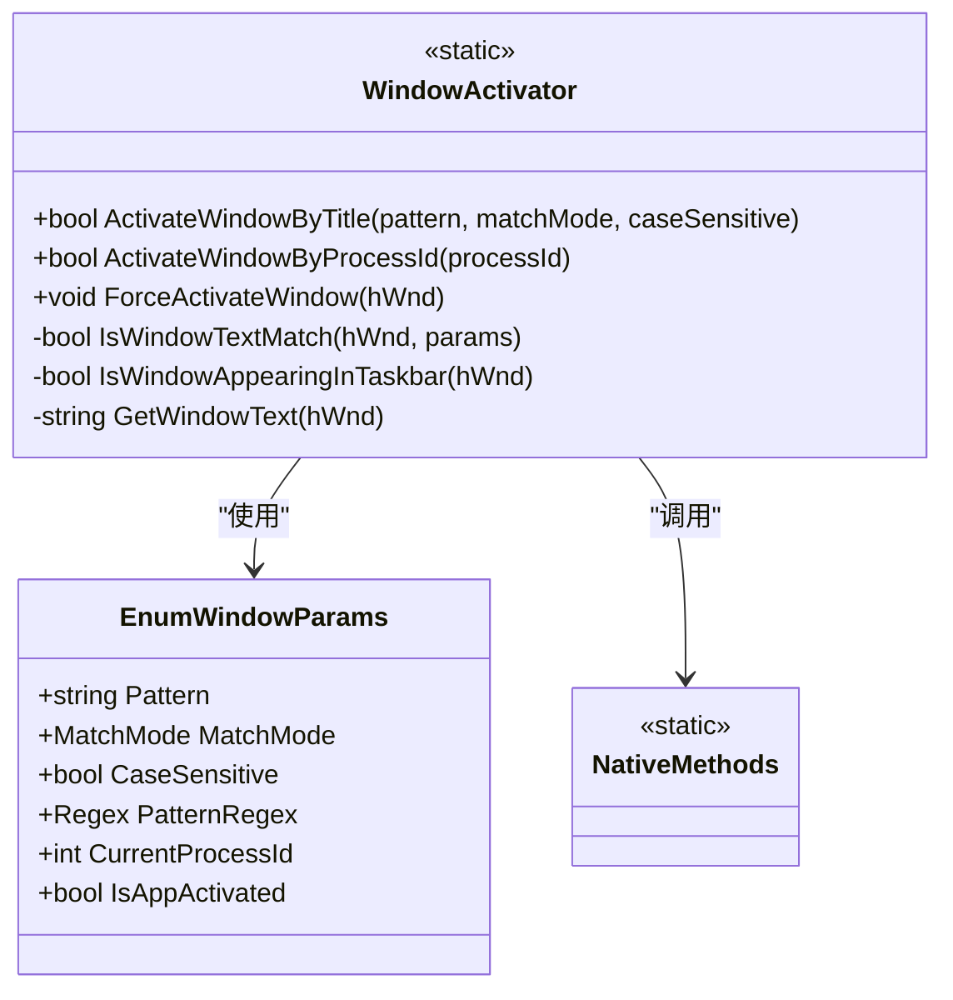
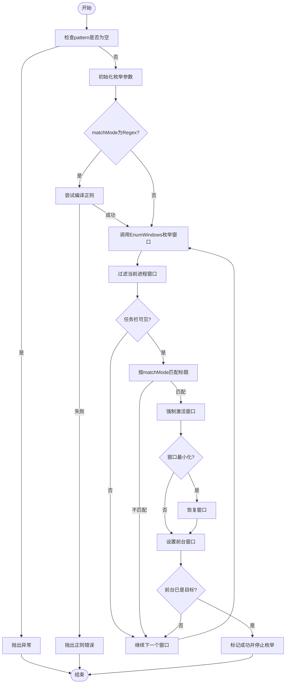

# 窗口激活器

<cite>
**本文引用的文件**
- [WindowActivator.cs](file://Utils/WindowActivator.cs)
- [WindowSwitchAction.cs](file://Actions/WindowSwitchAction.cs)
- [WindowSwitchConfigurator.cs](file://GUI/WindowSwitchConfigurator.cs)
- [ApplicationLauncher.cs](file://Services/ApplicationLauncher.cs)
- [Windows Utils.csproj](file://Windows Utils.csproj)
- [ExtensionManifest.json](file://ExtensionManifest.json)
- [README.md](file://README.md)
- [Main.cs](file://Main.cs)
</cite>

## 更新摘要
**变更内容**
- 新增基于进程ID的窗口激活功能（ActivateWindowByProcessId方法）
- 增强了窗口过滤逻辑，包含更详细的样式和扩展样式检查
- 改进了强制激活机制，增加了最小化窗口恢复功能
- 更新了P/Invoke底层实现，包含更多Windows API调用
- 新增了完整的使用示例，包括基于进程ID的窗口激活场景

## 目录
1. [简介](#简介)
2. [项目结构](#项目结构)
3. [核心组件](#核心组件)
4. [架构总览](#架构总览)
5. [详细组件分析](#详细组件分析)
6. [依赖关系分析](#依赖关系分析)
7. [性能考量](#性能考量)
8. [故障排除指南](#故障排除指南)
9. [结论](#结论)
10. [附录：使用示例与最佳实践](#附录使用示例与最佳实践)

## 简介
本指南面向需要在Macro Deck插件中实现"窗口激活"功能的用户与开发者，系统讲解WindowActivator窗口激活器的使用方法，包括：
- 窗口标题匹配模式（部分匹配、完全匹配、前缀匹配、后缀匹配、正则表达式）
- 基于进程ID的窗口激活功能（新增）
- 激活算法与流程控制
- P/Invoke底层实现细节
- ActivateWindowByTitle和ActivateWindowByProcessId方法的参数配置与使用场景
- 大小写敏感性设置与正则表达式模式
- 实际使用示例（精确匹配、前缀匹配、后缀匹配、正则表达式、进程ID匹配）
- 窗口过滤逻辑（任务栏可见性检查、进程ID过滤）
- 强制激活机制（最小化还原、前台置顶、焦点设置）
- 性能优化建议与常见问题解决方案

## 项目结构
该插件为Macro Deck 2的扩展，核心功能集中在Utils/WindowActivator.cs中，通过Actions/WindowSwitchAction.cs与GUI/WindowSwitchConfigurator.cs提供配置界面与触发入口。项目基于.NET 10目标框架，使用Windows Forms作为UI基础，并通过P/Invoke调用user32.dll与kernel32.dll完成窗口枚举与激活。

**图表来源**
- [WindowActivator.cs:1-289](file://Utils/WindowActivator.cs#L1-L289)
- [WindowSwitchAction.cs:1-50](file://Actions/WindowSwitchAction.cs#L1-L50)
- [WindowSwitchConfigurator.cs:1-79](file://GUI/WindowSwitchConfigurator.cs#L1-L79)
- [ApplicationLauncher.cs:1-176](file://Services/ApplicationLauncher.cs#L1-L176)
- [Main.cs:1-63](file://Main.cs#L1-L63)
- [Windows Utils.csproj:1-74](file://Windows Utils.csproj#L1-L74)

**章节来源**
- [README.md:1-40](file://README.md#L1-L40)
- [ExtensionManifest.json:1-11](file://ExtensionManifest.json#L1-L11)
- [Windows Utils.csproj:1-74](file://Windows Utils.csproj#L1-L74)

## 核心组件
- 窗口激活器（WindowActivator）
  - 提供ActivateWindowByTitle方法，支持多种标题匹配模式与大小写敏感性控制
  - **新增** ActivateWindowByProcessId方法，支持基于进程ID的窗口激活，专门处理MainWindowHandle为0（最小化）的情况
  - 内置窗口过滤逻辑（任务栏可见性、进程ID过滤）
  - 强制激活机制（最小化还原、前台置顶、焦点设置）
  - P/Invoke封装，直接调用Windows API完成窗口枚举与操作
- 窗口切换动作（WindowSwitchAction）
  - 从配置中解析pattern、matchMode、caseSensitive
  - 调用WindowActivator.ActivateWindowByTitle执行激活
- 窗口切换配置器（WindowSwitchConfigurator）
  - 提供图形化界面选择匹配模式与大小写选项
  - 将配置序列化为JSON字符串保存到插件动作
- 应用启动器（ApplicationLauncher）
  - **新增** 使用ActivateWindowByProcessId方法处理最小化窗口的场景
  - 集成窗口激活与应用启动的完整工作流

**章节来源**
- [WindowActivator.cs:9-204](file://Utils/WindowActivator.cs#L9-L204)
- [WindowSwitchAction.cs:14-46](file://Actions/WindowSwitchAction.cs#L14-L46)
- [WindowSwitchConfigurator.cs:10-79](file://GUI/WindowSwitchConfigurator.cs#L10-L79)
- [ApplicationLauncher.cs:100-135](file://Services/ApplicationLauncher.cs#L100-L135)
- [Main.cs:30-52](file://Main.cs#L30-L52)

## 架构总览
下图展示从用户触发到窗口激活的整体流程，包括配置解析、匹配与激活步骤以及底层P/Invoke调用。

**图表来源**
- [WindowSwitchAction.cs:22-40](file://Actions/WindowSwitchAction.cs#L22-L40)
- [WindowSwitchConfigurator.cs:39-58](file://GUI/WindowSwitchConfigurator.cs#L39-L58)
- [WindowActivator.cs:57-122](file://Utils/WindowActivator.cs#L57-L122)
- [WindowActivator.cs:206-243](file://Utils/WindowActivator.cs#L206-L243)

## 详细组件分析

### 窗口标题匹配模式（MatchMode）
- Partial（默认）：在窗口标题中任意位置查找子串
- Full：要求标题与模式完全一致
- StartsWith：要求标题以模式开头
- EndsWith：要求标题以模式结尾
- Regex：将模式作为正则表达式进行匹配

大小写敏感性由caseSensitive参数控制：
- true：区分大小写（Ordinal）
- false：不区分大小写（OrdinalIgnoreCase）

**章节来源**
- [WindowActivator.cs:14-36](file://Utils/WindowActivator.cs#L14-L36)
- [WindowActivator.cs:57](file://Utils/WindowActivator.cs#L57)
- [WindowActivator.cs:142-171](file://Utils/WindowActivator.cs#L142-L171)

### ActivateWindowByTitle方法参数与行为
- 参数
  - pattern：要匹配的标题模式（可为字面量或正则）
  - matchMode：匹配模式，默认Partial
  - caseSensitive：是否区分大小写，默认true
- 行为
  - 预编译正则（仅在Regex模式下）
  - 枚举所有顶层窗口
  - 排除当前进程窗口
  - 过滤非任务栏可见窗口
  - 根据匹配模式判断是否命中
  - 命中后执行强制激活
  - 若前台已是目标窗口，则标记成功并停止继续枚举

**章节来源**
- [WindowActivator.cs:57-122](file://Utils/WindowActivator.cs#L57-L122)

### ActivateWindowByProcessId方法（新增功能）
- 参数
  - processId：目标进程的ID
- 行为
  - 枚举所有顶层窗口
  - 查找与指定进程ID匹配的窗口
  - 过滤非任务栏可见窗口
  - 执行强制激活
  - 返回激活结果

**更新** 新增基于进程ID的窗口激活功能，专门解决MainWindowHandle为0（窗口最小化）的情况，增强了窗口激活的可靠性

**章节来源**
- [WindowActivator.cs:180-204](file://Utils/WindowActivator.cs#L180-L204)

### 窗口过滤逻辑
- 进程ID过滤：跳过与当前进程相同的窗口句柄
- 任务栏可见性检查：通过窗口样式与扩展样式判断是否出现在任务栏
  - 必须可见（WS_VISIBLE）
  - 排除工具窗口（WS_EX_TOOLWINDOW）
  - 排除无重定向位图窗口（WS_EX_NOREDIRECTIONBITMAP）
  - 若存在拥有者窗口且未标记为应用窗口或拥有者已最小化，则排除

**章节来源**
- [WindowActivator.cs:124-140](file://Utils/WindowActivator.cs#L124-L140)
- [WindowActivator.cs:281-286](file://Utils/WindowActivator.cs#L281-L286)

### 强制激活机制（ForceActivateWindow）
- 若窗口最小化则恢复
- 若当前前台线程与调用线程不同，先附加输入
- 设置前台窗口、置顶、显示、获取焦点
- 最后解除输入附加，避免影响其他应用

**更新** 增强了最小化窗口处理逻辑，确保即使窗口被最小化也能正确激活

**章节来源**
- [WindowActivator.cs:206-243](file://Utils/WindowActivator.cs#L206-L243)

### P/Invoke底层实现
- 窗口枚举与文本获取
  - EnumWindows：遍历所有顶层窗口
  - GetWindowText/GetWindowTextLength：读取窗口标题
- 前台管理
  - GetForegroundWindow/SetForegroundWindow：获取/设置前台窗口
  - SetFocus：将焦点设置到目标窗口
  - BringWindowToTop：置顶窗口
- 显示控制
  - ShowWindowAsync：显示/还原窗口
- 线程与输入
  - GetWindowThreadProcessId/GetCurrentThreadId：获取线程ID
  - AttachThreadInput：附加/分离线程输入
- 窗口定位与样式
  - SetWindowPos：异步更新窗口位置/尺寸
  - GetWindowLongPtr：读取窗口样式/扩展样式
  - IsIconic：判断窗口是否最小化

**章节来源**
- [WindowActivator.cs:255-289](file://Utils/WindowActivator.cs#L255-L289)

### 类关系与内部状态

**图表来源**
- [WindowActivator.cs:9-47](file://Utils/WindowActivator.cs#L9-L47)
- [WindowActivator.cs:255-289](file://Utils/WindowActivator.cs#L255-L289)

## 依赖关系分析
- 宏观依赖
  - Macro Deck 2.dll：插件宿主，提供Action Button与GUI框架
  - Newtonsoft.Json：用于JSON配置的序列化与反序列化
  - user32.dll/kernel32.dll：Windows API，完成窗口枚举与前台管理
- 项目属性
  - TargetFramework：net10.0-windows7.0
  - RuntimeIdentifier：win-x64
  - 平台：AnyCPU/x64
  - 使用Windows Forms

**章节来源**
- [Windows Utils.csproj:1-74](file://Windows Utils.csproj#L1-L74)
- [ExtensionManifest.json:1-11](file://ExtensionManifest.json#L1-L11)

## 性能考量
- 正则预编译：仅在Regex模式下对pattern进行一次编译，避免重复开销
- 早期短路：一旦找到并成功激活目标窗口，立即停止枚举
- 任务栏可见性快速过滤：减少无效标题读取与比较
- 线程附加成本：仅在前台线程与调用线程不同时才附加输入，降低不必要的系统调用
- 建议
  - 在高频触发场景下，优先使用Partial/StartsWith/EndsWith等简单匹配，避免复杂正则
  - 对于长标题窗口，尽量使用StartsWith/EndsWith以减少搜索范围
  - 合理设置大小写敏感性，避免不必要的大小写转换
  - 使用ActivateWindowByProcessId方法替代Process.MainWindowHandle为0的情况

## 故障排除指南
- "Pattern cannot be null or empty"
  - 现象：调用ActivateWindowByTitle时抛出异常
  - 原因：传入的pattern为空或null
  - 处理：确保配置中pattern非空
  - 参考
    - [WindowActivator.cs:59-62](file://Utils/WindowActivator.cs#L59-L62)
- "Invalid regular expression"
  - 现象：Regex模式下pattern语法错误导致异常
  - 原因：正则表达式格式不合法
  - 处理：修正正则表达式语法；可先在正则测试工具验证
  - 参考
    - [WindowActivator.cs:76-88](file://Utils/WindowActivator.cs#L76-L88)
- 窗口未被激活
  - 现象：返回false，未找到匹配窗口或激活失败
  - 可能原因
    - 标题不匹配（大小写、子串位置）
    - 窗口不在任务栏（如工具窗口、无重定向位图窗口）
    - 当前进程窗口被排除
    - 前台线程不同导致输入附加失败
    - 窗口最小化且Process.MainWindowHandle为0
  - 处理
    - 调整matchMode与caseSensitive
    - 使用Partial或StartsWith扩大匹配范围
    - 确认窗口确实出现在任务栏
    - 使用ActivateWindowByProcessId方法处理最小化窗口
    - 参考过滤逻辑与强制激活流程
  - 参考
    - [WindowActivator.cs:124-140](file://Utils/WindowActivator.cs#L124-L140)
    - [WindowActivator.cs:206-243](file://Utils/WindowActivator.cs#L206-L243)
- 配置无法保存/加载
  - 现象：配置界面保存失败或加载异常
  - 原因：配置字段缺失或JSON格式错误
  - 处理：确认pattern、matchMode、caseSensitive均填写完整；检查JSON序列化/反序列化
  - 参考
    - [WindowSwitchConfigurator.cs:39-58](file://GUI/WindowSwitchConfigurator.cs#L39-L58)
    - [WindowSwitchAction.cs:24-40](file://Actions/WindowSwitchAction.cs#L24-L40)

## 结论
WindowActivator提供了稳定、灵活的窗口激活能力，结合多种匹配模式与大小写敏感性控制，能够满足大多数窗口切换需求。新增的基于进程ID的激活功能进一步增强了实用性，特别适用于处理最小化窗口的场景。通过任务栏可见性过滤与强制激活机制，确保在不同窗口状态（最小化、隐藏、后台）下仍能可靠地将目标窗口置前。建议在实际使用中根据具体场景选择合适的匹配模式与大小写策略，并注意正则表达式的正确性与性能影响。

## 附录：使用示例与最佳实践

### 使用步骤
- 在Macro Deck中添加"窗口切换"动作
- 打开配置器，设置以下参数：
  - Pattern：要匹配的标题片段或正则
  - Match Mode：Partial/Full/StartsWith/EndsWith/Regex
  - Case Sensitive：勾选区分大小写，或取消勾选不区分大小写
- 保存配置并绑定到按钮，点击触发

**章节来源**
- [WindowSwitchConfigurator.cs:25-37](file://GUI/WindowSwitchConfigurator.cs#L25-L37)
- [WindowSwitchConfigurator.cs:39-58](file://GUI/WindowSwitchConfigurator.cs#L39-L58)

### 实际使用示例
- 精确匹配（Full）
  - 场景：只激活标题完全等于"记事本"的窗口
  - 建议：使用Full + 区分大小写，避免误触其他标题相似的应用
  - 参考
    - [WindowActivator.cs:161-162](file://Utils/WindowActivator.cs#L161-L162)
- 前缀匹配（StartsWith）
  - 场景：激活以"Visual Studio"开头的IDE窗口
  - 建议：使用StartsWith + 不区分大小写，兼容不同版本命名
  - 参考
    - [WindowActivator.cs:163-164](file://Utils/WindowActivator.cs#L163-L164)
- 后缀匹配（EndsWith）
  - 场景：激活以".pdf"结尾的PDF阅读器窗口
  - 建议：使用EndsWith + 区分大小写，避免误匹配到非PDF文件
  - 参考
    - [WindowActivator.cs:165-166](file://Utils/WindowActivator.cs#L165-L166)
- 部分匹配（Partial）
  - 场景：激活包含"浏览器"关键词的窗口
  - 建议：使用Partial + 不区分大小写，覆盖多浏览器名称
  - 参考
    - [WindowActivator.cs:167-170](file://Utils/WindowActivator.cs#L167-L170)
- 正则表达式（Regex）
  - 场景：激活标题符合"^Chrome.*[0-9]{2}$"的Chrome窗口（例如带两位数字后缀）
  - 建议：先在正则测试工具验证，避免性能问题
  - 参考
    - [WindowActivator.cs:150-153](file://Utils/WindowActivator.cs#L150-L153)
    - [WindowActivator.cs:74-88](file://Utils/WindowActivator.cs#L74-L88)
- 基于进程ID的激活（新增）
  - 场景：激活指定进程ID的窗口，特别适用于最小化的应用程序
  - 建议：当Process.MainWindowHandle为0时使用此方法
  - 参考
    - [WindowActivator.cs:180-204](file://Utils/WindowActivator.cs#L180-L204)
    - [ApplicationLauncher.cs:116-122](file://Services/ApplicationLauncher.cs#L116-L122)

### 窗口过滤与强制激活流程

**图表来源**
- [WindowActivator.cs:57-122](file://Utils/WindowActivator.cs#L57-L122)
- [WindowActivator.cs:124-140](file://Utils/WindowActivator.cs#L124-L140)
- [WindowActivator.cs:142-171](file://Utils/WindowActivator.cs#L142-L171)
- [WindowActivator.cs:206-243](file://Utils/WindowActivator.cs#L206-L243)

### 最佳实践
- 优先使用Partial/StartsWith/EndsWith，避免复杂正则
- 对于多语言环境，建议使用不区分大小写的匹配
- 避免使用过于宽泛的匹配，防止误激活
- 在频繁触发场景下，尽量缩短pattern长度
- 如需跨应用窗口切换，确保目标窗口出现在任务栏
- 当遇到Process.MainWindowHandle为0的情况时，使用ActivateWindowByProcessId方法
- 对于最小化的窗口，ForceActivateWindow会自动处理恢复操作
- 在应用启动器中集成进程ID激活逻辑，处理最小化窗口的场景

### 新增功能使用场景
- **应用启动后窗口激活**：当应用程序启动但窗口被最小化时，使用进程ID激活
- **多实例应用处理**：同一应用程序的多个实例，通过进程ID精确定位目标实例
- **后台服务窗口激活**：某些服务程序可能返回0的MainWindowHandle，需要通过进程ID激活
- **自动化脚本**：在无人值守环境中，通过进程ID稳定激活目标窗口

**章节来源**
- [ApplicationLauncher.cs:100-135](file://Services/ApplicationLauncher.cs#L100-L135)
- [WindowActivator.cs:180-204](file://Utils/WindowActivator.cs#L180-L204)