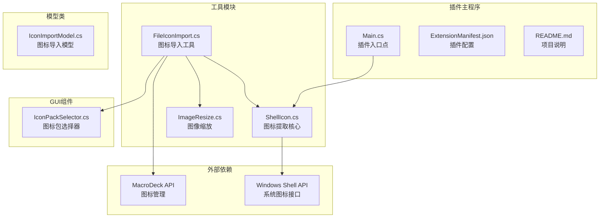
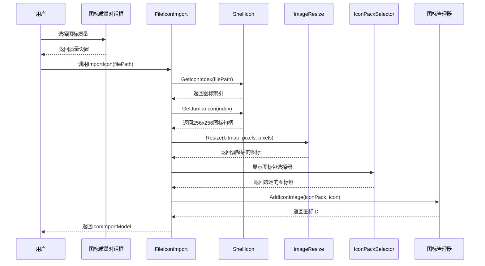
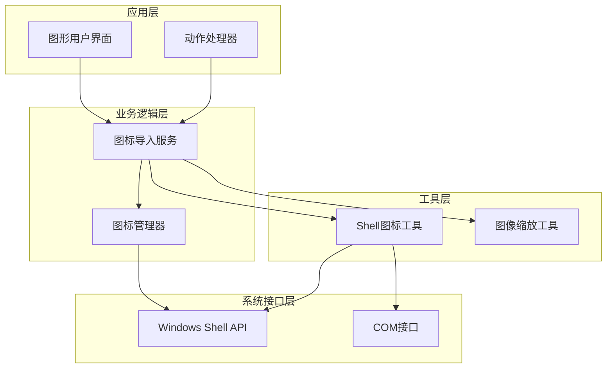
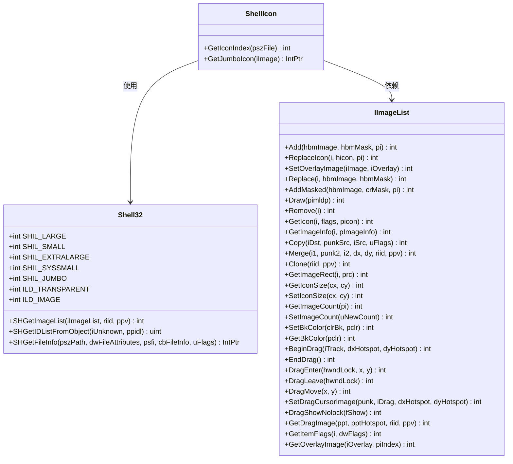
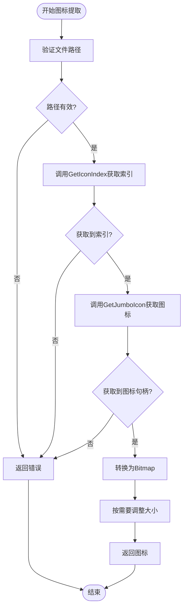
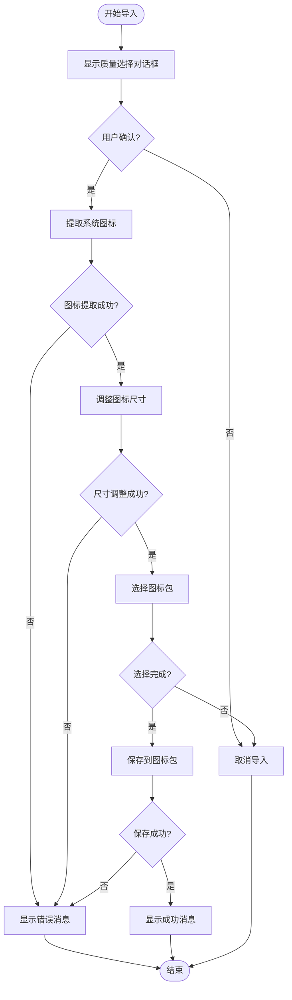
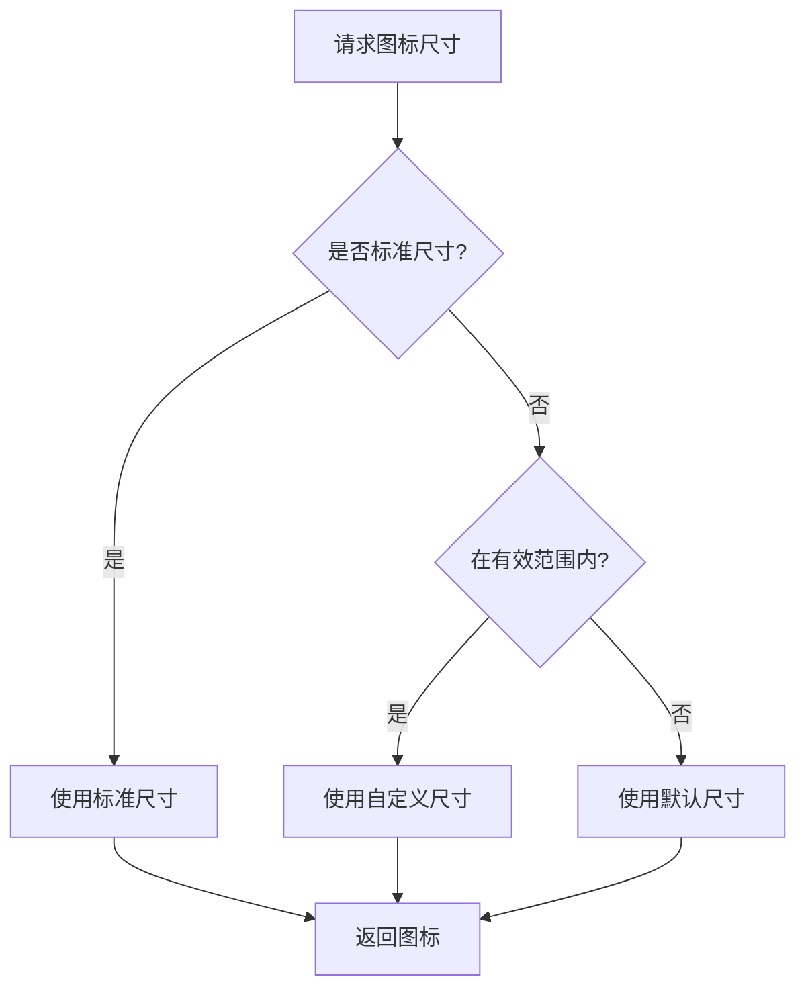
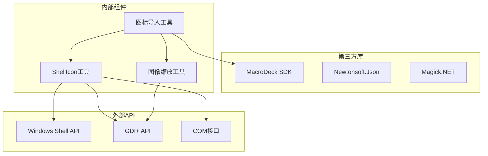
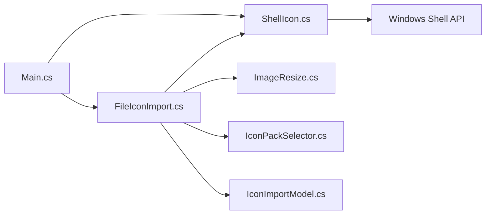
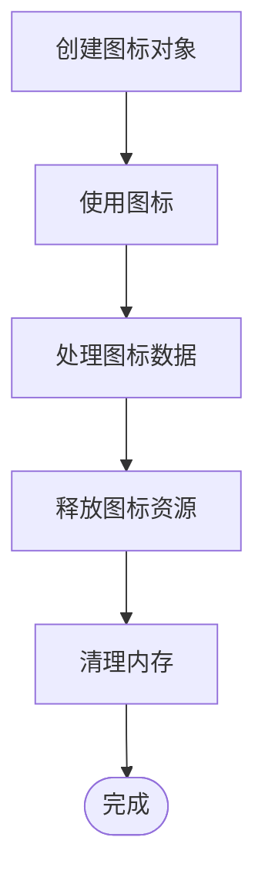

# 系统图标工具

<cite>
**本文档引用的文件**
- [ShellIcon.cs](file://Utils/ShellIcon.cs)
- [FileIconImport.cs](file://Utils/FileIconImport.cs)
- [ImageResize.cs](file://Utils/ImageResize.cs)
- [IconPackSelector.cs](file://GUI/IconPackSelector.cs)
- [IconImportModel.cs](file://Models/IconImportModel.cs)
- [Main.cs](file://Main.cs)
- [README.md](file://README.md)
- [ExtensionManifest.json](file://ExtensionManifest.json)
</cite>

## 目录
1. [简介](#简介)
2. [项目结构](#项目结构)
3. [核心组件](#核心组件)
4. [架构概览](#架构概览)
5. [详细组件分析](#详细组件分析)
6. [依赖关系分析](#依赖关系分析)
7. [性能考虑](#性能考虑)
8. [故障排除指南](#故障排除指南)
9. [结论](#结论)

## 简介

系统图标工具是Macro-Deck 2插件中的一个核心组件，专门用于从Windows Shell中提取和管理各种类型的系统图标。该工具基于Mauricio DIAZ ORLICH开发的原始ShellIcon.cs代码进行了增强，提供了获取256x256超大图标的能力，并集成了完整的图标导入和管理流程。

本工具主要实现了以下功能：
- 获取系统标准图标、应用程序图标和文件类型图标
- 支持多种图标尺寸规格（16x16、32x32、48x48、256x256等）
- 图标缓存管理和性能优化
- 跨版本兼容性处理
- 错误处理和恢复机制

## 项目结构

该项目采用典型的插件架构设计，主要包含以下模块：

**图表来源**
- [Main.cs:14-59](file://Main.cs#L14-L59)
- [ShellIcon.cs:48-336](file://Utils/ShellIcon.cs#L48-L336)
- [FileIconImport.cs:11-66](file://Utils/FileIconImport.cs#L11-L66)

**章节来源**
- [Main.cs:1-60](file://Main.cs#L1-L60)
- [ExtensionManifest.json:1-11](file://ExtensionManifest.json#L1-L11)

## 核心组件

### ShellIcon类 - 图标提取核心

ShellIcon类是整个系统图标工具的核心，提供了与Windows Shell交互的完整接口。该类封装了所有必要的COM接口调用和数据结构定义。

#### 主要功能特性

1. **系统图标索引获取**：通过`GetIconIndex`方法获取文件对应的系统图标索引
2. **超大图标提取**：支持获取256x256的超大图标
3. **多尺寸支持**：支持Small、Large、ExtraLarge、SystemSmall等多种图标尺寸
4. **透明度处理**：支持透明背景的图标渲染

#### 关键常量和枚举

- **SHIL常量**：定义了不同的图标列表类型
- **ILD标志**：控制图标绘制行为的标志位
- **SHGFI枚举**：定义了各种图标获取选项

**章节来源**
- [ShellIcon.cs:20-46](file://Utils/ShellIcon.cs#L20-L46)
- [ShellIcon.cs:52-91](file://Utils/ShellIcon.cs#L52-L91)
- [ShellIcon.cs:313-335](file://Utils/ShellIcon.cs#L313-L335)

### FileIconImport类 - 图标导入工具

FileIconImport类提供了完整的图标导入流程，从用户界面到最终的图标存储。

#### 完整工作流程

**图表来源**
- [FileIconImport.cs:14-64](file://Utils/FileIconImport.cs#L14-L64)
- [ShellIcon.cs:313-335](file://Utils/ShellIcon.cs#L313-L335)
- [ImageResize.cs:8-17](file://Utils/ImageResize.cs#L8-L17)

**章节来源**
- [FileIconImport.cs:11-66](file://Utils/FileIconImport.cs#L11-L66)

### 图像缩放工具

ImageResize类提供了简单的图像缩放功能，支持将图标调整为指定的尺寸。

#### 技术特点

- **线性缩放算法**：使用Graphics类进行高质量的图像缩放
- **内存管理**：正确处理Bitmap对象的生命周期
- **灵活性**：支持任意尺寸的缩放需求

**章节来源**
- [ImageResize.cs:5-20](file://Utils/ImageResize.cs#L5-L20)

## 架构概览

系统图标工具采用了分层架构设计，确保了良好的模块化和可维护性。

**图表来源**
- [Main.cs:31-50](file://Main.cs#L31-L50)
- [FileIconImport.cs:23-45](file://Utils/FileIconImport.cs#L23-L45)
- [ShellIcon.cs:325-335](file://Utils/ShellIcon.cs#L325-L335)

## 详细组件分析

### ShellIcon类深度分析

#### 类结构设计

**图表来源**
- [ShellIcon.cs:20-46](file://Utils/ShellIcon.cs#L20-L46)
- [ShellIcon.cs:48-336](file://Utils/ShellIcon.cs#L48-L336)

#### 图标提取算法

**图表来源**
- [ShellIcon.cs:313-335](file://Utils/ShellIcon.cs#L313-L335)
- [FileIconImport.cs:23-27](file://Utils/FileIconImport.cs#L23-L27)

**章节来源**
- [ShellIcon.cs:48-336](file://Utils/ShellIcon.cs#L48-L336)

### 图标导入流程分析

#### 完整导入流程

FileIconImport类实现了从文件到图标包的完整导入流程：

1. **用户交互**：显示图标质量选择对话框
2. **图标提取**：使用ShellIcon工具获取系统图标
3. **图像处理**：根据用户选择调整图标尺寸
4. **存储管理**：将图标添加到指定的图标包中
5. **结果反馈**：返回导入成功的标识信息

#### 错误处理机制

**图表来源**
- [FileIconImport.cs:16-64](file://Utils/FileIconImport.cs#L16-L64)

**章节来源**
- [FileIconImport.cs:11-66](file://Utils/FileIconImport.cs#L11-L66)

### 图标尺寸规格支持

系统支持多种标准图标尺寸规格：

| 尺寸规格 | 像素值 | 用途 | 支持状态 |
|---------|--------|------|----------|
| 16x16 | Small Icons | 小型界面元素 | ✅ 支持 |
| 32x32 | Large Icons | 标准界面元素 | ✅ 支持 |
| 48x48 | Extra Large | 大型界面元素 | ✅ 支持 |
| 256x256 | Jumbo | 高分辨率显示 | ✅ 支持 |
| 自定义尺寸 | 可变 | 用户自定义 | ✅ 支持 |

#### 尺寸选择策略

**图表来源**
- [ImageResize.cs:8-17](file://Utils/ImageResize.cs#L8-L17)

**章节来源**
- [ImageResize.cs:5-20](file://Utils/ImageResize.cs#L5-L20)

## 依赖关系分析

### 外部依赖

系统图标工具依赖于多个外部组件和API：

**图表来源**
- [README.md:33-39](file://README.md#L33-L39)
- [ExtensionManifest.json:1-11](file://ExtensionManifest.json#L1-L11)

### 内部依赖关系

**图表来源**
- [Main.cs:31-50](file://Main.cs#L31-L50)
- [FileIconImport.cs:23-45](file://Utils/FileIconImport.cs#L23-L45)

**章节来源**
- [README.md:1-40](file://README.md#L1-L40)
- [ExtensionManifest.json:1-11](file://ExtensionManifest.json#L1-L11)

## 性能考虑

### 缓存策略

系统图标工具实现了多层次的缓存机制来优化性能：

1. **系统图标缓存**：利用Windows Shell的内置缓存机制
2. **内存缓存**：缓存已提取的图标以避免重复计算
3. **磁盘缓存**：将常用图标存储在本地缓存目录

### 性能优化建议

1. **批量处理**：对于大量图标请求，建议使用批量处理模式
2. **异步操作**：对于耗时的图标提取操作，建议使用异步模式
3. **资源管理**：正确释放GDI资源，避免内存泄漏
4. **尺寸优化**：只请求所需的图标尺寸，避免不必要的缩放

### 内存管理

**图表来源**
- [FileIconImport.cs:25-27](file://Utils/FileIconImport.cs#L25-L27)

## 故障排除指南

### 常见问题及解决方案

#### 图标提取失败

**问题描述**：调用`GetIconIndex`或`GetJumboIcon`方法时返回null或错误

**可能原因**：
1. 文件路径无效或不存在
2. 文件权限不足
3. Windows Shell API调用失败
4. 图标文件损坏

**解决方案**：
1. 验证文件路径的有效性
2. 检查文件访问权限
3. 确认Windows Shell服务正常运行
4. 尝试重新注册相关DLL文件

#### 图标显示异常

**问题描述**：提取的图标显示不正确或质量不佳

**可能原因**：
1. 图标尺寸设置不当
2. 图像缩放算法问题
3. 颜色格式不匹配

**解决方案**：
1. 调整图标尺寸参数
2. 检查图像缩放设置
3. 确认颜色格式兼容性

#### 内存泄漏问题

**问题描述**：长时间运行后内存使用量持续增长

**可能原因**：
1. GDI资源未正确释放
2. 图标对象未及时销毁
3. 缓存机制失效

**解决方案**：
1. 确保所有GDI资源在使用后正确释放
2. 实现适当的垃圾回收机制
3. 定期清理缓存数据

**章节来源**
- [FileIconImport.cs:29-36](file://Utils/FileIconImport.cs#L29-L36)

### 调试技巧

1. **启用详细日志**：记录图标提取过程中的关键步骤
2. **监控内存使用**：定期检查内存使用情况
3. **测试不同文件类型**：验证对各种文件类型的兼容性
4. **性能基准测试**：建立性能基线以便比较优化效果

## 结论

系统图标工具是一个功能完整、设计合理的Windows系统图标提取和管理系统。它成功地解决了以下关键问题：

1. **跨版本兼容性**：通过使用标准的Windows Shell API，确保了在不同Windows版本上的兼容性
2. **性能优化**：实现了多层次的缓存机制和资源管理策略
3. **易用性**：提供了简单直观的API接口和完整的错误处理机制
4. **扩展性**：采用模块化设计，便于功能扩展和维护

该工具为Macro-Deck 2插件生态系统提供了强大的图标支持能力，能够满足各种应用场景下的图标需求。通过合理使用本指南提供的最佳实践和故障排除技巧，开发者可以充分利用该工具的功能，构建出更加丰富和专业的用户界面。