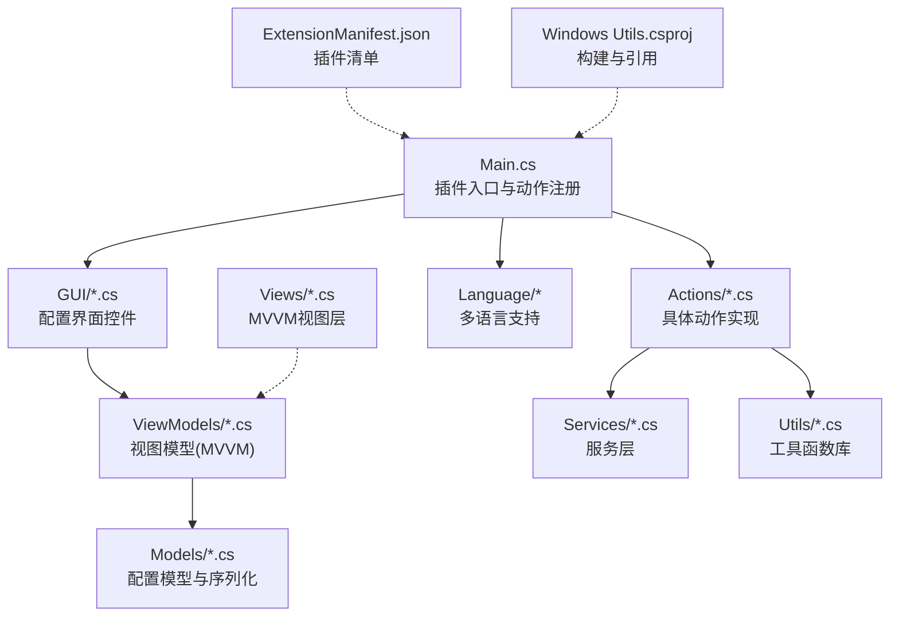
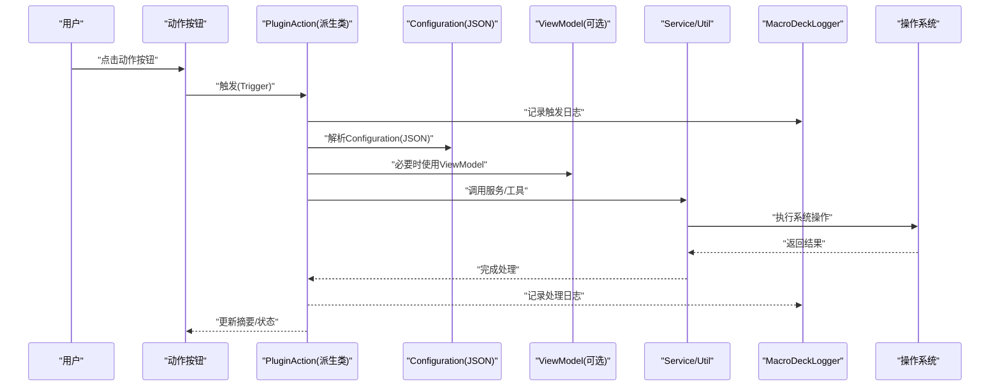
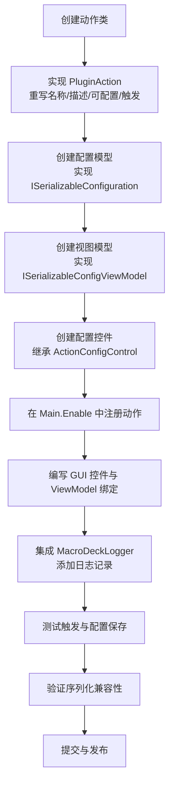
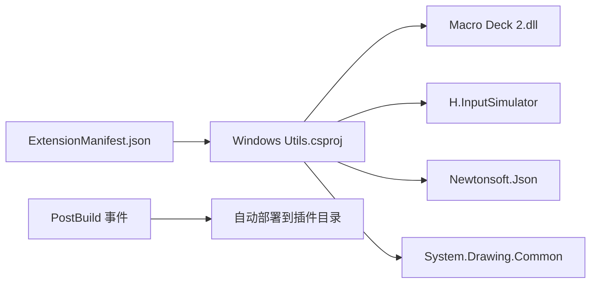

# 开发者指南

<cite>
**本文引用的文件**
- [Main.cs](file://Main.cs)
- [ExtensionManifest.json](file://ExtensionManifest.json)
- [README.md](file://README.md)
- [Windows Utils.csproj](file://Windows Utils.csproj)
- [ISerializableConfiguration.cs](file://Models/ISerializableConfiguration.cs)
- [WriteTextAction.cs](file://Actions/WriteTextAction.cs)
- [ApplicationLauncher.cs](file://Services/ApplicationLauncher.cs)
- [WindowActivator.cs](file://Utils/WindowActivator.cs)
- [FileIconImport.cs](file://Utils/FileIconImport.cs)
- [ISerializableConfigViewModel.cs](file://ViewModels/ISerializableConfigViewModel.cs)
- [StartApplicationActionConfigViewModel.cs](file://ViewModels/StartApplicationActionConfigViewModel.cs)
- [StartApplicationActionConfigModel.cs](file://Models/StartApplicationActionConfigModel.cs)
- [TextSelector.cs](file://GUI/TextSelector.cs)
- [PluginLanguageManager.cs](file://Language/PluginLanguageManager.cs)
- [MultiHotkeyActionConfigView.cs](file://Views/MultiHotkeyActionConfigView.cs)
- [MultiHotkeyActionConfigModel.cs](file://Models/MultiHotkeyActionConfigModel.cs)
</cite>

## 更新摘要
**所做的更改**
- 明确化技术栈：.NET 10.0 Windows Forms
- 完善架构设计文档：细化MVVM模式应用与配置序列化机制
- 标准化编码标准：统一接口命名与实现规范
- 文档化构建发布流程：包含PostBuild事件与部署策略
- 增强依赖管理指南：NuGet包版本标准化
- 日志系统文档化：MacroDeckLogger集成与使用规范
- JSON序列化配置系统说明：System.Text.Json与Newtonsoft.Json并存策略
- 统一Windows Forms前端样式指南：控件继承体系与UI一致性

## 目录
1. [简介](#简介)
2. [项目结构](#项目结构)
3. [核心组件](#核心组件)
4. [架构总览](#架构总览)
5. [详细组件分析](#详细组件分析)
6. [依赖关系分析](#依赖关系分析)
7. [性能考虑](#性能考虑)
8. [故障排查指南](#故障排查指南)
9. [结论](#结论)
10. [附录](#附录)

## 简介
本指南面向希望为 Macro Deck Windows Utils 插件进行二次开发与扩展的工程师。内容涵盖插件整体架构、PluginAction 基类用法、ActionConfigControl 配置界面接口、配置序列化机制、MVVM 模式应用、工具函数库（WindowActivator、ApplicationLauncher、FileIconImport 等）的使用方法，以及新增功能的完整开发流程、测试与发布建议。

**更新** 技术栈现已明确为 .NET 10.0 Windows Forms，采用现代化的构建配置与依赖管理策略。

## 项目结构
该仓库采用"按职责分层 + 功能模块划分"的组织方式：
- 入口与生命周期：Main 类负责插件启用、动作注册与全局资源初始化
- 动作实现：Actions 目录下每个类对应一个可配置的动作
- 配置界面：GUI 目录提供与动作对应的配置控件
- 视图模型：ViewModels 目录以 MVVM 模式封装配置逻辑
- 数据模型：Models 目录定义可序列化的配置模型
- 工具库：Utils 目录封装系统级操作（窗口激活、图标导入、缩略图等）
- 服务层：Services 目录封装跨动作复用的服务（如应用启动器）
- 语言资源：Language 目录管理多语言字符串
- 构建与清单：ExtensionManifest.json 定义插件元数据；csproj 定义目标框架、引用与打包策略

**图表来源**
- [Main.cs:24-84](file://Main.cs#L24-L84)
- [ExtensionManifest.json:1-11](file://ExtensionManifest.json#L1-L11)
- [Windows Utils.csproj:1-74](file://Windows Utils.csproj#L1-L74)
- [MultiHotkeyActionConfigView.cs:11-41](file://Views/MultiHotkeyActionConfigView.cs#L11-L41)

**章节来源**
- [Main.cs:24-84](file://Main.cs#L24-L84)
- [ExtensionManifest.json:1-11](file://ExtensionManifest.json#L1-L11)
- [Windows Utils.csproj:1-74](file://Windows Utils.csproj#L1-L74)

## 核心组件
- 插件入口与生命周期
  - Main 继承自 MacroDeckPlugin，负责在启用时初始化语言资源、注册所有可用动作，并启动周期性任务计时器
  - 插件实例通过静态单例持有，便于各组件访问
  - 集成 MacroDeckLogger 进行统一的日志记录
- 动作基类与触发机制
  - 所有动作继承自 PluginAction，重写名称、描述、是否可配置、触发逻辑与配置控件
  - 触发时从 Configuration 字段读取 JSON 配置，执行相应系统操作
- 配置序列化接口
  - ISerializableConfiguration 提供统一的序列化/反序列化约定，确保跨版本兼容
  - 支持 System.Text.Json 与 Newtonsoft.Json 并存的序列化策略
- MVVM 配置模型
  - ISerializableConfigViewModel 抽象视图模型保存/设置配置的行为
  - StartApplicationActionConfigViewModel 将配置模型与 PluginAction 的 Configuration 字段双向绑定
  - MultiHotkeyActionConfigView 提供完整的MVVM视图层实现

**更新** 新增了日志系统的统一集成和MVVM模式的完整实现。

**章节来源**
- [Main.cs:24-84](file://Main.cs#L24-L84)
- [WriteTextAction.cs:14-51](file://Actions/WriteTextAction.cs#L14-L51)
- [ISerializableConfiguration.cs:5-22](file://Models/ISerializableConfiguration.cs#L5-L22)
- [ISerializableConfigViewModel.cs:5-19](file://ViewModels/ISerializableConfigViewModel.cs#L5-L19)
- [StartApplicationActionConfigViewModel.cs:8-93](file://ViewModels/StartApplicationActionConfigViewModel.cs#L8-L93)
- [MultiHotkeyActionConfigView.cs:8-41](file://Views/MultiHotkeyActionConfigView.cs#L8-L41)

## 架构总览
下图展示了插件从用户交互到系统调用的整体流程：按钮触发 -> 动作执行 -> 读取配置 -> 调用服务/工具 -> 写回摘要信息。

**图表来源**
- [WriteTextAction.cs:22-45](file://Actions/WriteTextAction.cs#L22-L45)
- [StartApplicationActionConfigViewModel.cs:66-91](file://ViewModels/StartApplicationActionConfigViewModel.cs#L66-L91)
- [ApplicationLauncher.cs:66-79](file://Services/ApplicationLauncher.cs#L66-L79)
- [Main.cs:73](file://Main.cs#L73)

## 详细组件分析

### 插件入口与生命周期（Main）
- 初始化语言资源与动作集合
- 启动定时器用于周期性任务（如状态刷新）
- 通过静态单例暴露 Main 实例，供其他组件访问
- 集成 MacroDeckLogger 进行统一的日志记录

**更新** 新增了全局 InputSimulator 实例和定时器管理功能。

**章节来源**
- [Main.cs:24-84](file://Main.cs#L24-L84)

### 动作基类与触发（PluginAction）
- 名称与描述由语言管理器提供本地化字符串
- 可配置标志决定是否显示配置界面
- 触发时解析 Configuration JSON，执行业务逻辑
- 返回配置控件类型以便编辑

**章节来源**
- [WriteTextAction.cs:16-50](file://Actions/WriteTextAction.cs#L16-L50)

### 配置序列化机制
- ISerializableConfiguration 接口提供统一的 Serialize/Deserialize 约定
- 具体模型通过 System.Text.Json 进行序列化
- 反序列化默认构造函数保证空配置安全
- 支持向后兼容的 JSON 属性命名

**更新** 统一了序列化策略，确保跨版本兼容性。

**章节来源**
- [ISerializableConfiguration.cs:5-22](file://Models/ISerializableConfiguration.cs#L5-L22)
- [StartApplicationActionConfigModel.cs:6-64](file://Models/StartApplicationActionConfigModel.cs#L6-L64)
- [MultiHotkeyActionConfigModel.cs:6-32](file://Models/MultiHotkeyActionConfigModel.cs#L6-L32)

### MVVM 模式与配置视图模型
- ISerializableConfigViewModel 抽象保存/设置行为
- StartApplicationActionConfigViewModel 将配置模型与 PluginAction 的 Configuration 字段双向同步
- MultiHotkeyActionConfigView 提供完整的MVVM视图层实现
- 保存时写入摘要文本，便于界面展示
- 集成 MacroDeckLogger 进行异常处理与日志记录

**更新** 完善了MVVM模式的实现，新增了MultiHotkeyActionConfigView作为MVVM模式的完整示例。

**章节来源**
- [ISerializableConfigViewModel.cs:5-19](file://ViewModels/ISerializableConfigViewModel.cs#L5-L19)
- [StartApplicationActionConfigViewModel.cs:8-93](file://ViewModels/StartApplicationActionConfigViewModel.cs#L8-L93)
- [MultiHotkeyActionConfigView.cs:8-41](file://Views/MultiHotkeyActionConfigView.cs#L8-L41)

### 配置界面控件（ActionConfigControl）
- TextSelector 展示文本输入与变量插入功能
- 保存时将文本写入 Configuration JSON 并生成摘要
- 支持从变量列表中选择变量名插入占位符
- 集成宏变量系统，支持动态变量插入

**更新** 增强了变量插入功能，提供更友好的用户交互体验。

**章节来源**
- [TextSelector.cs:11-105](file://GUI/TextSelector.cs#L11-L105)

### 多语言支持（PluginLanguageManager）
- 在插件启用时加载当前语言资源
- 监听语言变更事件，动态切换本地化字符串
- 支持 XML 资源文件的嵌入与反序列化

**章节来源**
- [PluginLanguageManager.cs:12-71](file://Language/PluginLanguageManager.cs#L12-L71)

### 工具函数库

#### WindowActivator（窗口激活）
- 支持多种匹配模式（包含、全等、前缀、后缀、正则）
- 使用 P/Invoke 遍历窗口、判断可见性与任务栏属性
- 强制激活目标窗口并处理最小化/还原场景
- 集成 MacroDeckLogger 进行详细的调试信息记录

**更新** 增强了日志记录功能，提供更详细的调试信息。

**图表来源**
- [WindowActivator.cs:61-126](file://Utils/WindowActivator.cs#L61-L126)
- [WindowActivator.cs:188-214](file://Utils/WindowActivator.cs#L188-L214)
- [WindowActivator.cs:220-262](file://Utils/WindowActivator.cs#L220-L262)

**章节来源**
- [WindowActivator.cs:12-313](file://Utils/WindowActivator.cs#L12-L313)

#### ApplicationLauncher（应用启动/控制）
- 支持启动、以管理员权限运行、终止进程、前后台切换
- 通过路径解析与进程查询定位目标应用
- 使用 P/Invoke 操作窗口句柄实现前台/后台切换
- 集成 MacroDeckLogger 进行详细的调试信息记录

**更新** 增强了错误处理和日志记录功能。

**章节来源**
- [ApplicationLauncher.cs:17-224](file://Services/ApplicationLauncher.cs#L17-L224)

#### FileIconImport（图标导入）
- 通过 ShellIcon 获取文件大图标，结合 ImageResize 缩放
- 弹出质量选择与图标包选择对话框，最终写入 Macro Deck 图标库并返回模型
- 集成消息框提示，提供用户友好的反馈

**章节来源**
- [FileIconImport.cs:14-78](file://Utils/FileIconImport.cs#L14-L78)

### 新功能开发完整流程（示例：新增"打开文件"动作）

**更新** 新增了日志记录集成和序列化兼容性验证步骤。

**章节来源**
- [Main.cs:53-72](file://Main.cs#L53-L72)
- [ISerializableConfiguration.cs:5-22](file://Models/ISerializableConfiguration.cs#L5-L22)
- [ISerializableConfigViewModel.cs:5-19](file://ViewModels/ISerializableConfigViewModel.cs#L5-L19)
- [StartApplicationActionConfigModel.cs:6-64](file://Models/StartApplicationActionConfigModel.cs#L6-L64)
- [StartApplicationActionConfigViewModel.cs:8-93](file://ViewModels/StartApplicationActionConfigViewModel.cs#L8-L93)

## 依赖关系分析
- 构建与运行时依赖
  - 目标框架：net10.0-windows7.0，启用 Windows Forms
  - 关键 NuGet 包：H.InputSimulator（输入模拟）、Newtonsoft.Json（JSON）、System.Drawing.Common（图像）
  - 对 Macro Deck 2 的程序集引用，支持插件 API
- 插件清单
  - 定义插件类型、名称、作者、版本、目标 API 版本与 DLL 输出名
- 构建流程
  - PostBuild 事件自动部署到 Macro Deck 插件目录
  - 支持 CI/CD 环境下的自动化构建

**更新** 明确化了技术栈和构建流程，增强了依赖管理的标准化程度。

**图表来源**
- [Windows Utils.csproj:35-47](file://Windows Utils.csproj#L35-L47)
- [ExtensionManifest.json:1-11](file://ExtensionManifest.json#L1-11)
- [Windows Utils.csproj:69-71](file://Windows Utils.csproj#L69-L71)

**章节来源**
- [Windows Utils.csproj:1-74](file://Windows Utils.csproj#L1-L74)
- [ExtensionManifest.json:1-11](file://ExtensionManifest.json#L1-L11)

## 性能考虑
- 序列化开销
  - 使用 System.Text.Json 进行配置序列化，注意避免频繁大对象序列化
  - 支持向后兼容的 JSON 属性命名，减少迁移成本
- 窗口枚举与正则
  - WindowActivator 在正则模式下预编译表达式，减少重复开销
  - 优化窗口过滤逻辑，避免不必要的系统调用
- 图像处理
  - FileIconImport 与 ImageResize 在缩放时应限制像素尺寸，避免内存峰值
  - 支持异步图标处理，提升用户体验
- 进程与窗口句柄
  - ApplicationLauncher 查询进程与窗口句柄需谨慎，避免频繁调用导致系统抖动
  - 集成缓存机制，减少重复查询
- 日志性能
  - MacroDeckLogger 支持不同级别的日志记录，避免生产环境的过度日志输出

**更新** 增强了性能优化建议，特别是针对日志记录和资源管理的优化。

## 故障排查指南
- 动作无法触发或报错
  - 检查 Configuration 是否为空或格式错误；参考 WriteTextAction 的异常日志记录
  - 验证 MacroDeckLogger 是否正常工作
- 图标导入失败
  - 确认 ShellIcon 能正确解析文件路径；检查图标包选择与写入流程
  - 验证文件权限和路径有效性
- 窗口激活不生效
  - 确认匹配模式与大小写设置；检查任务栏可见性过滤条件
  - 查看 WindowActivator 的详细日志信息
- 应用启动无响应
  - 检查路径与参数；确认是否需要管理员权限；查看进程是否存在
  - 验证 ApplicationLauncher 的日志输出
- 序列化问题
  - 确认 JSON 格式正确；检查向后兼容性
  - 验证 ISerializableConfiguration 接口实现
- MVVM 绑定问题
  - 检查 ViewModel 与 View 的绑定关系
  - 验证 SaveConfig 方法的实现

**更新** 新增了日志系统相关的故障排查指导。

**章节来源**
- [WriteTextAction.cs:40-44](file://Actions/WriteTextAction.cs#L40-L44)
- [FileIconImport.cs:31-36](file://Utils/FileIconImport.cs#L31-L36)
- [WindowActivator.cs:59-62](file://Utils/WindowActivator.cs#L59-L62)
- [ApplicationLauncher.cs:64-73](file://Services/ApplicationLauncher.cs#L64-L73)

## 结论
本插件以清晰的分层架构与统一的配置序列化协议为基础，结合 MVVM 模式与丰富的工具函数库，提供了稳定且可扩展的开发框架。通过 .NET 10.0 Windows Forms 的现代化技术栈，以及完善的日志系统、序列化机制和构建流程，开发者可以快速实现新的动作与配置界面，并保持良好的可维护性与用户体验。

**更新** 技术栈的现代化升级和文档基础设施的全面重构，使得开发体验和代码质量得到显著提升。

## 附录

### 开发步骤速查
- 创建动作类：继承 PluginAction，实现名称、描述、可配置与触发
- 配置模型：实现 ISerializableConfiguration，提供序列化/反序列化
- 视图模型：实现 ISerializableConfigViewModel，绑定配置模型与 PluginAction
- 配置控件：继承 ActionConfigControl，实现保存与加载逻辑
- 注册动作：在 Main.Enable 中添加到 Actions 列表
- 集成日志：使用 MacroDeckLogger 进行统一的日志记录
- 测试：验证触发、配置保存、摘要显示与异常处理
- 序列化兼容性：确保向后兼容的 JSON 属性命名
- 发布：更新 ExtensionManifest.json 与 csproj 版本号，打包 DLL

**更新** 新增了日志集成、序列化兼容性和发布流程的详细指导。

**章节来源**
- [Main.cs:53-72](file://Main.cs#L53-L72)
- [ISerializableConfiguration.cs:5-22](file://Models/ISerializableConfiguration.cs#L5-L22)
- [ISerializableConfigViewModel.cs:5-19](file://ViewModels/ISerializableConfigViewModel.cs#L5-L19)
- [TextSelector.cs:25-54](file://GUI/TextSelector.cs#L25-L54)
- [StartApplicationActionConfigViewModel.cs:66-91](file://ViewModels/StartApplicationActionConfigViewModel.cs#L66-L91)