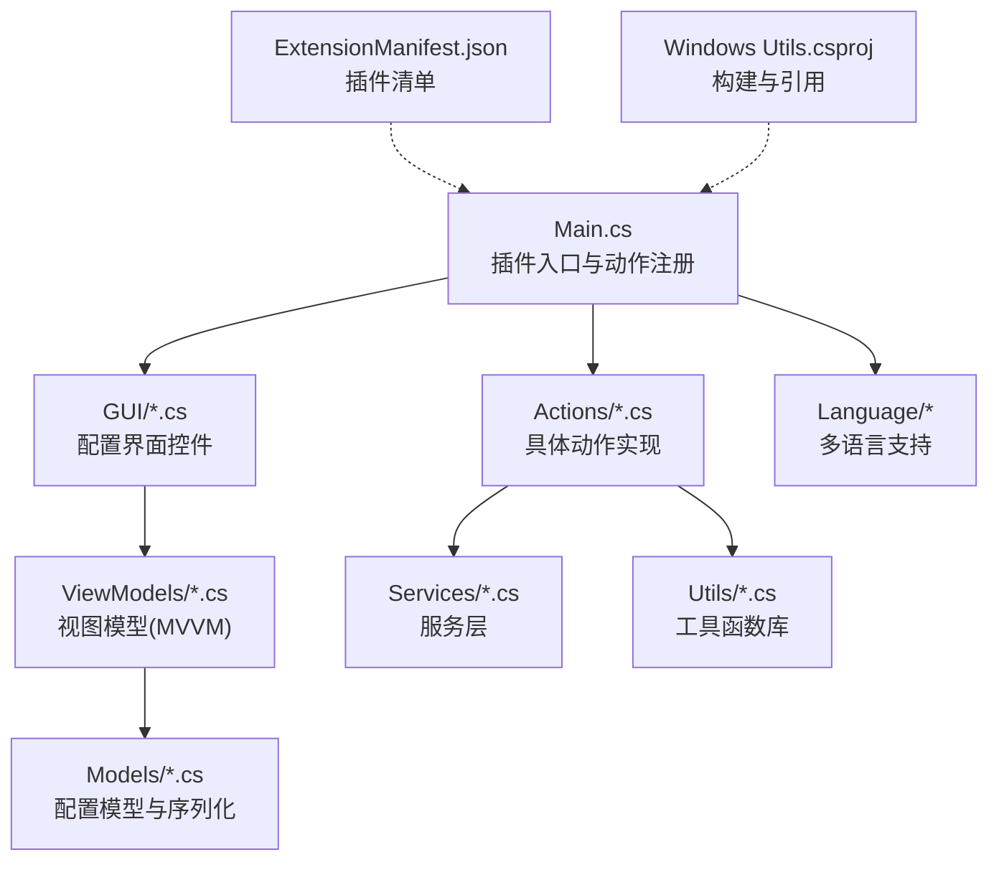
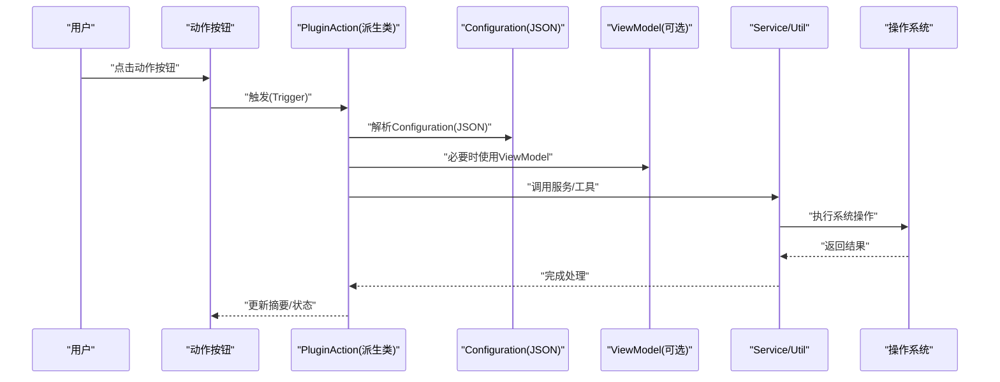
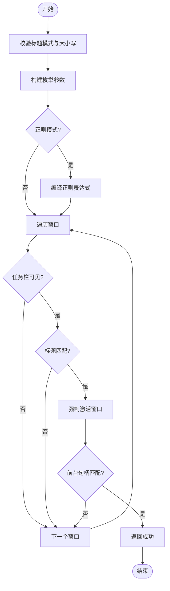
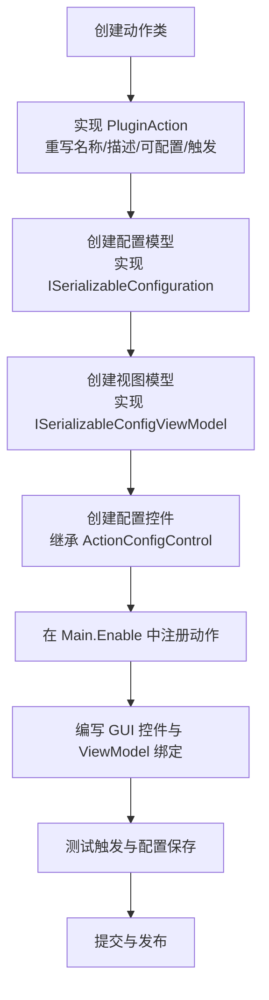
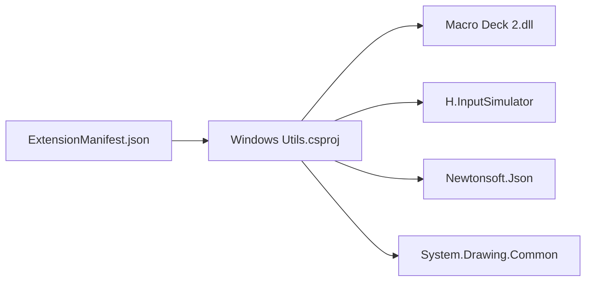

# 开发者指南

<cite>
**本文引用的文件**
- [Main.cs](file://Main.cs)
- [ExtensionManifest.json](file://ExtensionManifest.json)
- [README.md](file://README.md)
- [Windows Utils.csproj](file://Windows Utils.csproj)
- [ISerializableConfiguration.cs](file://Models/ISerializableConfiguration.cs)
- [WriteTextAction.cs](file://Actions/WriteTextAction.cs)
- [ApplicationLauncher.cs](file://Services/ApplicationLauncher.cs)
- [WindowActivator.cs](file://Utils/WindowActivator.cs)
- [FileIconImport.cs](file://Utils/FileIconImport.cs)
- [ISerializableConfigViewModel.cs](file://ViewModels/ISerializableConfigViewModel.cs)
- [StartApplicationActionConfigViewModel.cs](file://ViewModels/StartApplicationActionConfigViewModel.cs)
- [StartApplicationActionConfigModel.cs](file://Models/StartApplicationActionConfigModel.cs)
- [TextSelector.cs](file://GUI/TextSelector.cs)
- [PluginLanguageManager.cs](file://Language/PluginLanguageManager.cs)
</cite>

## 目录
1. [简介](#简介)
2. [项目结构](#项目结构)
3. [核心组件](#核心组件)
4. [架构总览](#架构总览)
5. [详细组件分析](#详细组件分析)
6. [依赖关系分析](#依赖关系分析)
7. [性能考虑](#性能考虑)
8. [故障排查指南](#故障排查指南)
9. [结论](#结论)
10. [附录](#附录)

## 简介
本指南面向希望为 Macro Deck Windows Utils 插件进行二次开发与扩展的工程师。内容涵盖插件整体架构、PluginAction 基类用法、ActionConfigControl 配置界面接口、配置序列化机制、MVVM 模式应用、工具函数库（WindowActivator、ApplicationLauncher、FileIconImport 等）的使用方法，以及新增功能的完整开发流程、测试与发布建议。

## 项目结构
该仓库采用“按职责分层 + 功能模块划分”的组织方式：
- 入口与生命周期：Main 类负责插件启用、动作注册与全局资源初始化
- 动作实现：Actions 目录下每个类对应一个可配置的动作
- 配置界面：GUI 目录提供与动作对应的配置控件
- 视图模型：ViewModels 目录以 MVVM 模式封装配置逻辑
- 数据模型：Models 目录定义可序列化的配置模型
- 工具库：Utils 目录封装系统级操作（窗口激活、图标导入、缩略图等）
- 服务层：Services 目录封装跨动作复用的服务（如应用启动器）
- 语言资源：Language 目录管理多语言字符串
- 构建与清单：ExtensionManifest.json 定义插件元数据；csproj 定义目标框架、引用与打包策略

图表来源
- [Main.cs:28-58](file://Main.cs#L28-L58)
- [ExtensionManifest.json:1-11](file://ExtensionManifest.json#L1-L11)
- [Windows Utils.csproj:1-74](file://Windows Utils.csproj#L1-L74)

章节来源
- [Main.cs:14-58](file://Main.cs#L14-L58)
- [ExtensionManifest.json:1-11](file://ExtensionManifest.json#L1-L11)
- [Windows Utils.csproj:1-74](file://Windows Utils.csproj#L1-L74)

## 核心组件
- 插件入口与生命周期
  - Main 继承自 MacroDeckPlugin，负责在启用时初始化语言资源、注册所有可用动作，并启动周期性任务计时器
  - 插件实例通过静态单例持有，便于各组件访问
- 动作基类与触发机制
  - 所有动作继承自 PluginAction，重写名称、描述、是否可配置、触发逻辑与配置控件
  - 触发时从 Configuration 字段读取 JSON 配置，执行相应系统操作
- 配置序列化接口
  - ISerializableConfiguration 提供统一的序列化/反序列化约定，确保跨版本兼容
- MVVM 配置模型
  - ISerializableConfigViewModel 抽象视图模型保存/设置配置的行为
  - StartApplicationActionConfigViewModel 将配置模型与 PluginAction 的 Configuration 字段双向绑定

章节来源
- [Main.cs:14-58](file://Main.cs#L14-L58)
- [WriteTextAction.cs:14-51](file://Actions/WriteTextAction.cs#L14-L51)
- [ISerializableConfiguration.cs:5-11](file://Models/ISerializableConfiguration.cs#L5-L11)
- [ISerializableConfigViewModel.cs:5-12](file://ViewModels/ISerializableConfigViewModel.cs#L5-L12)
- [StartApplicationActionConfigViewModel.cs:8-72](file://ViewModels/StartApplicationActionConfigViewModel.cs#L8-L72)

## 架构总览
下图展示了插件从用户交互到系统调用的整体流程：按钮触发 -> 动作执行 -> 读取配置 -> 调用服务/工具 -> 写回摘要信息。

图表来源
- [WriteTextAction.cs:22-45](file://Actions/WriteTextAction.cs#L22-L45)
- [StartApplicationActionConfigViewModel.cs:53-71](file://ViewModels/StartApplicationActionConfigViewModel.cs#L53-L71)
- [ApplicationLauncher.cs:45-58](file://Services/ApplicationLauncher.cs#L45-L58)

## 详细组件分析

### 插件入口与生命周期（Main）
- 初始化语言资源与动作集合
- 启动定时器用于周期性任务（如状态刷新）
- 通过静态单例暴露 Main 实例，供其他组件访问

章节来源
- [Main.cs:28-58](file://Main.cs#L28-L58)

### 动作基类与触发（PluginAction）
- 名称与描述由语言管理器提供本地化字符串
- 可配置标志决定是否显示配置界面
- 触发时解析 Configuration JSON，执行业务逻辑
- 返回配置控件类型以便编辑

章节来源
- [WriteTextAction.cs:16-50](file://Actions/WriteTextAction.cs#L16-L50)

### 配置序列化机制
- ISerializableConfiguration 接口提供统一的 Serialize/Deserialize 约定
- 具体模型通过 System.Text.Json 进行序列化
- 反序列化默认构造函数保证空配置安全

章节来源
- [ISerializableConfiguration.cs:5-11](file://Models/ISerializableConfiguration.cs#L5-L11)
- [StartApplicationActionConfigModel.cs:6-27](file://Models/StartApplicationActionConfigModel.cs#L6-L27)

### MVVM 模式与配置视图模型
- ISerializableConfigViewModel 抽象保存/设置行为
- StartApplicationActionConfigViewModel 将配置模型与 PluginAction 的 Configuration 字段双向同步
- 保存时写入摘要文本，便于界面展示

章节来源
- [ISerializableConfigViewModel.cs:5-12](file://ViewModels/ISerializableConfigViewModel.cs#L5-L12)
- [StartApplicationActionConfigViewModel.cs:8-72](file://ViewModels/StartApplicationActionConfigViewModel.cs#L8-L72)
- [StartApplicationActionConfigModel.cs:19-26](file://Models/StartApplicationActionConfigModel.cs#L19-L26)

### 配置界面控件（ActionConfigControl）
- TextSelector 展示文本输入与变量插入功能
- 保存时将文本写入 Configuration JSON 并生成摘要
- 支持从变量列表中选择变量名插入占位符

章节来源
- [TextSelector.cs:11-50](file://GUI/TextSelector.cs#L11-L50)
- [TextSelector.cs:53-76](file://GUI/TextSelector.cs#L53-L76)

### 多语言支持（PluginLanguageManager）
- 在插件启用时加载当前语言资源
- 监听语言变更事件，动态切换本地化字符串

章节来源
- [PluginLanguageManager.cs:12-33](file://Language/PluginLanguageManager.cs#L12-L33)

### 工具函数库

#### WindowActivator（窗口激活）
- 支持多种匹配模式（包含、全等、前缀、后缀、正则）
- 使用 P/Invoke 遍历窗口、判断可见性与任务栏属性
- 强制激活目标窗口并处理最小化/还原场景

图表来源
- [WindowActivator.cs:57-122](file://Utils/WindowActivator.cs#L57-L122)
- [WindowActivator.cs:142-171](file://Utils/WindowActivator.cs#L142-L171)
- [WindowActivator.cs:173-210](file://Utils/WindowActivator.cs#L173-L210)

章节来源
- [WindowActivator.cs:9-256](file://Utils/WindowActivator.cs#L9-L256)

#### ApplicationLauncher（应用启动/控制）
- 支持启动、以管理员权限运行、终止进程、前后台切换
- 通过路径解析与进程查询定位目标应用
- 使用 P/Invoke 操作窗口句柄实现前台/后台切换

章节来源
- [ApplicationLauncher.cs:13-165](file://Services/ApplicationLauncher.cs#L13-L165)

#### FileIconImport（图标导入）
- 通过 ShellIcon 获取文件大图标，结合 ImageResize 缩放
- 弹出质量选择与图标包选择对话框，最终写入 Macro Deck 图标库并返回模型

章节来源
- [FileIconImport.cs:11-67](file://Utils/FileIconImport.cs#L11-L67)

### 新功能开发完整流程（示例：新增“打开文件”动作）

章节来源
- [Main.cs:31-50](file://Main.cs#L31-L50)
- [ISerializableConfiguration.cs:5-11](file://Models/ISerializableConfiguration.cs#L5-L11)
- [ISerializableConfigViewModel.cs:5-12](file://ViewModels/ISerializableConfigViewModel.cs#L5-L12)
- [StartApplicationActionConfigModel.cs:6-27](file://Models/StartApplicationActionConfigModel.cs#L6-L27)
- [StartApplicationActionConfigViewModel.cs:8-72](file://ViewModels/StartApplicationActionConfigViewModel.cs#L8-L72)

## 依赖关系分析
- 构建与运行时依赖
  - 目标框架：net10.0-windows7.0，启用 Windows Forms
  - 关键 NuGet 包：H.InputSimulator（输入模拟）、Newtonsoft.Json（JSON）、System.Drawing.Common（图像）
  - 对 Macro Deck 2 的程序集引用，支持插件 API
- 插件清单
  - 定义插件类型、名称、作者、版本、目标 API 版本与 DLL 输出名

图表来源
- [Windows Utils.csproj:35-47](file://Windows Utils.csproj#L35-L47)
- [ExtensionManifest.json:1-11](file://ExtensionManifest.json#L1-L11)

章节来源
- [Windows Utils.csproj:1-74](file://Windows Utils.csproj#L1-L74)
- [ExtensionManifest.json:1-11](file://ExtensionManifest.json#L1-L11)

## 性能考虑
- 序列化开销
  - 使用 System.Text.Json 进行配置序列化，注意避免频繁大对象序列化
- 窗口枚举与正则
  - WindowActivator 在正则模式下预编译表达式，减少重复开销
- 图像处理
  - FileIconImport 与 ImageResize 在缩放时应限制像素尺寸，避免内存峰值
- 进程与窗口句柄
  - ApplicationLauncher 查询进程与窗口句柄需谨慎，避免频繁调用导致系统抖动

## 故障排查指南
- 动作无法触发或报错
  - 检查 Configuration 是否为空或格式错误；参考 WriteTextAction 的异常日志记录
- 图标导入失败
  - 确认 ShellIcon 能正确解析文件路径；检查图标包选择与写入流程
- 窗口激活不生效
  - 确认匹配模式与大小写设置；检查任务栏可见性过滤条件
- 应用启动无响应
  - 检查路径与参数；确认是否需要管理员权限；查看进程是否存在

章节来源
- [WriteTextAction.cs:40-44](file://Actions/WriteTextAction.cs#L40-L44)
- [FileIconImport.cs:31-36](file://Utils/FileIconImport.cs#L31-L36)
- [WindowActivator.cs:59-62](file://Utils/WindowActivator.cs#L59-L62)
- [ApplicationLauncher.cs:64-73](file://Services/ApplicationLauncher.cs#L64-L73)

## 结论
本插件以清晰的分层架构与统一的配置序列化协议为基础，结合 MVVM 模式与丰富的工具函数库，提供了稳定且可扩展的开发框架。遵循本文档的流程与最佳实践，开发者可以快速实现新的动作与配置界面，并保持良好的可维护性与用户体验。

## 附录

### 开发步骤速查
- 创建动作类：继承 PluginAction，实现名称、描述、可配置与触发
- 配置模型：实现 ISerializableConfiguration，提供序列化/反序列化
- 视图模型：实现 ISerializableConfigViewModel，绑定配置模型与 PluginAction
- 配置控件：继承 ActionConfigControl，实现保存与加载逻辑
- 注册动作：在 Main.Enable 中添加到 Actions 列表
- 测试：验证触发、配置保存、摘要显示与异常处理
- 发布：更新 ExtensionManifest.json 与 csproj 版本号，打包 DLL

章节来源
- [Main.cs:31-50](file://Main.cs#L31-L50)
- [ISerializableConfiguration.cs:5-11](file://Models/ISerializableConfiguration.cs#L5-L11)
- [ISerializableConfigViewModel.cs:5-12](file://ViewModels/ISerializableConfigViewModel.cs#L5-L12)
- [TextSelector.cs:25-41](file://GUI/TextSelector.cs#L25-L41)