# 插件架构设计

<cite>
**本文档引用的文件**
- [Main.cs](file://Main.cs)
- [ExtensionManifest.json](file://ExtensionManifest.json)
- [Windows Utils.csproj](file://Windows Utils.csproj)
- [README.md](file://README.md)
- [ISerializableConfiguration.cs](file://Models/ISerializableConfiguration.cs)
- [StartApplicationActionConfigModel.cs](file://Models/StartApplicationActionConfigModel.cs)
- [MultiHotkeyActionConfigModel.cs](file://Models/MultiHotkeyActionConfigModel.cs)
- [IMultiHotkeyAction.cs](file://Models/IMultiHotkeyAction.cs)
- [ISerializableConfigViewModel.cs](file://ViewModels/ISerializableConfigViewModel.cs)
- [StartApplicationActionConfigViewModel.cs](file://ViewModels/StartApplicationActionConfigViewModel.cs)
- [MultiHotkeyActionConfigViewModel.cs](file://ViewModels/MultiHotkeyActionConfigViewModel.cs)
- [MultiHotkeyAction.cs](file://Actions/MultiHotkeyAction.cs)
- [WriteTextAction.cs](file://Actions/WriteTextAction.cs)
- [StartApplicationAction.cs](file://Actions/StartApplicationAction.cs)
- [PluginLanguageManager.cs](file://Language/PluginLanguageManager.cs)
- [ApplicationLauncher.cs](file://Services/ApplicationLauncher.cs)
- [TextSelector.cs](file://GUI/TextSelector.cs)
- [CommandSelector.cs](file://GUI/CommandSelector.cs)
- [PowerOptionSelector.cs](file://GUI/PowerOptionSelector.cs)
- [NotificationConfigurator.cs](file://GUI/NotificationConfigurator.cs)
</cite>

## 目录
1. [引言](#引言)
2. [项目结构](#项目结构)
3. [核心组件](#核心组件)
4. [架构总览](#架构总览)
5. [详细组件分析](#详细组件分析)
6. [依赖关系分析](#依赖关系分析)
7. [性能考虑](#性能考虑)
8. [故障排除指南](#故障排除指南)
9. [结论](#结论)
10. [附录](#附录)

## 引言
本文件面向Macro Deck Windows Utils插件的架构设计与实现进行系统性梳理，重点围绕以下主题展开：PluginAction基类的设计理念、MacroDeckPlugin继承体系与插件生命周期管理、插件初始化流程、动作注册机制、配置序列化接口ISerializableConfiguration的实现方式、Main类的职责（动作列表管理、定时器机制、全局实例管理）、以及插件扩展点的设计思路与最佳实践。文中通过架构图与流程图直观展示组件间依赖关系与数据流向，并提供可操作的排障建议与优化建议。

## 项目结构
该插件采用“按功能域分层”的组织方式，主要目录与职责如下：
- Actions：具体动作实现，每个动作继承自PluginAction，负责触发逻辑与配置UI绑定
- GUI：动作配置界面控件，用于编辑动作配置并保存到PluginAction.Configuration
- Models：配置模型与序列化接口，定义可序列化的配置结构与反序列化策略
- ViewModels：配置视图模型，桥接GUI与Model，封装保存与摘要生成逻辑
- Services：系统服务封装（如应用启动、窗口控制等）
- Utils：通用工具（图标、窗口激活等）
- Language：语言资源加载与动态切换
- 根目录：Main类作为插件入口，ExtensionManifest.json声明插件元数据，csproj定义构建与依赖

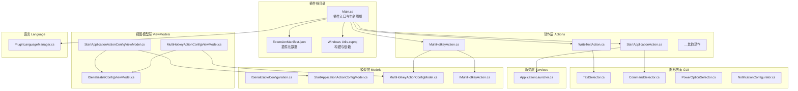

**图表来源**
- [Main.cs:14-59](file://Main.cs#L14-L59)
- [ExtensionManifest.json:1-11](file://ExtensionManifest.json#L1-L11)
- [Windows Utils.csproj:1-74](file://Windows Utils.csproj#L1-L74)
- [WriteTextAction.cs:14-51](file://Actions/WriteTextAction.cs#L14-L51)
- [StartApplicationAction.cs:34-76](file://Actions/StartApplicationAction.cs#L34-L76)
- [MultiHotkeyAction.cs:11-56](file://Actions/MultiHotkeyAction.cs#L11-L56)
- [ISerializableConfiguration.cs:5-11](file://Models/ISerializableConfiguration.cs#L5-L11)
- [StartApplicationActionConfigModel.cs:6-27](file://Models/StartApplicationActionConfigModel.cs#L6-L27)
- [MultiHotkeyActionConfigModel.cs:6-21](file://Models/MultiHotkeyActionConfigModel.cs#L6-L21)
- [IMultiHotkeyAction.cs:3-9](file://Models/IMultiHotkeyAction.cs#L3-L9)
- [ISerializableConfigViewModel.cs:5-12](file://ViewModels/ISerializableConfigViewModel.cs#L5-L12)
- [StartApplicationActionConfigViewModel.cs:8-72](file://ViewModels/StartApplicationActionConfigViewModel.cs#L8-L72)
- [MultiHotkeyActionConfigViewModel.cs:9-55](file://ViewModels/MultiHotkeyActionConfigViewModel.cs#L9-L55)
- [TextSelector.cs:41-76](file://GUI/TextSelector.cs#L41-L76)
- [CommandSelector.cs:73-109](file://GUI/CommandSelector.cs#L73-L109)
- [PowerOptionSelector.cs:9-43](file://GUI/PowerOptionSelector.cs#L9-L43)
- [NotificationConfigurator.cs:39-55](file://GUI/NotificationConfigurator.cs#L39-L55)
- [ApplicationLauncher.cs:13-165](file://Services/ApplicationLauncher.cs#L13-L165)
- [PluginLanguageManager.cs:8-51](file://Language/PluginLanguageManager.cs#L8-L51)

**章节来源**
- [Main.cs:14-59](file://Main.cs#L14-L59)
- [ExtensionManifest.json:1-11](file://ExtensionManifest.json#L1-L11)
- [Windows Utils.csproj:1-74](file://Windows Utils.csproj#L1-L74)
- [README.md:1-40](file://README.md#L1-L40)

## 核心组件
本节聚焦于插件架构中的关键构件及其职责边界。

- Main类（插件入口与生命周期）
  - 继承自MacroDeckPlugin，负责插件启用时的语言初始化、动作注册、全局实例维护与定时器启动
  - 提供全局静态实例访问，便于其他组件通过PluginInstance.Main调用共享资源（如InputSimulator）

- PluginAction基类与动作体系
  - 每个具体动作均继承自PluginAction，覆盖Name、Description、CanConfigure与Trigger方法
  - 动作通过GetActionConfigControl绑定对应的GUI配置控件，实现可视化配置

- 配置序列化接口ISerializableConfiguration
  - 定义统一的Serialize与Deserialize契约，确保配置在不同版本间保持兼容
  - 通过System.Text.Json进行序列化，支持字段别名以兼容旧版本

- 视图模型与GUI
  - ISerializableConfigViewModel抽象配置保存流程，由具体ViewModel实现SetConfig与SaveConfig
  - GUI控件负责用户交互与配置加载，最终写回PluginAction.Configuration

- 服务层
  - ApplicationLauncher封装进程管理、窗口前后台切换等系统级操作，供动作使用

**章节来源**
- [Main.cs:14-59](file://Main.cs#L14-L59)
- [WriteTextAction.cs:14-51](file://Actions/WriteTextAction.cs#L14-L51)
- [StartApplicationAction.cs:34-76](file://Actions/StartApplicationAction.cs#L34-L76)
- [MultiHotkeyAction.cs:11-56](file://Actions/MultiHotkeyAction.cs#L11-L56)
- [ISerializableConfiguration.cs:5-11](file://Models/ISerializableConfiguration.cs#L5-L11)
- [ISerializableConfigViewModel.cs:5-12](file://ViewModels/ISerializableConfigViewModel.cs#L5-L12)
- [ApplicationLauncher.cs:13-165](file://Services/ApplicationLauncher.cs#L13-L165)

## 架构总览
下图展示了从插件启用到动作执行的关键流程，包括动作注册、配置序列化、GUI交互与系统服务调用。

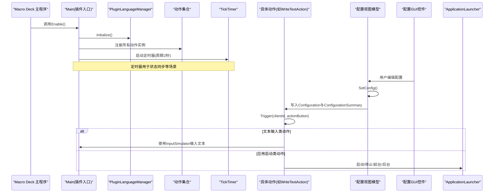

**图表来源**
- [Main.cs:28-59](file://Main.cs#L28-L59)
- [PluginLanguageManager.cs:12-16](file://Language/PluginLanguageManager.cs#L12-L16)
- [WriteTextAction.cs:22-45](file://Actions/WriteTextAction.cs#L22-L45)
- [StartApplicationAction.cs:34-76](file://Actions/StartApplicationAction.cs#L34-L76)
- [ApplicationLauncher.cs:45-126](file://Services/ApplicationLauncher.cs#L45-L126)

## 详细组件分析

### Main类：插件入口与生命周期
- 职责
  - 插件启用：初始化语言、注册动作、启动定时器
  - 全局实例：维护Main.Instance与PluginInstance.Main，供其他模块访问
  - 资源管理：持有InputSimulator实例，供文本输入等动作使用

- 生命周期要点
  - 构造函数设置静态实例，保证单例式访问
  - Enable中完成动作注册与定时器启动，确保后续动作可用

- 定时器机制
  - 周期2秒，用于需要定期刷新的状态更新（例如应用启动动作的按钮状态同步）

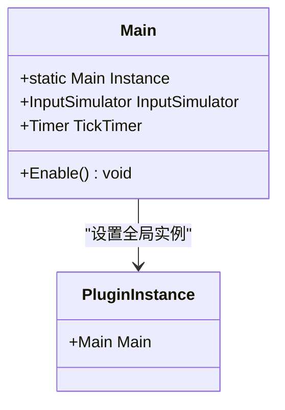

**图表来源**
- [Main.cs:14-26](file://Main.cs#L14-L26)
- [Main.cs:28-59](file://Main.cs#L28-L59)

**章节来源**
- [Main.cs:14-59](file://Main.cs#L14-L59)

### 动作注册机制与动作列表管理
- 注册流程
  - 在Enable中创建动作列表并赋值给this.Actions，供Macro Deck主程序发现与使用
  - 列表包含多种动作类型，涵盖文本输入、命令行、文件/文件夹打开、音量控制、热键发送、通知、麦克风静音、电源选项、窗口切换等

- 动作接口约定
  - 每个动作需实现名称、描述、是否可配置与触发逻辑
  - 可通过GetActionConfigControl返回对应GUI控件，实现可视化配置

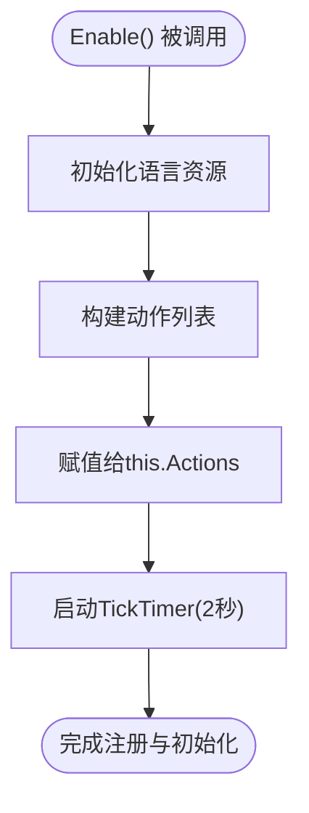

**图表来源**
- [Main.cs:28-59](file://Main.cs#L28-L59)

**章节来源**
- [Main.cs:28-59](file://Main.cs#L28-L59)

### 配置序列化接口ISerializableConfiguration与模型
- 设计原则
  - 统一Serialize/Deserialize契约，避免各动作重复实现序列化逻辑
  - 通过System.Text.Json进行序列化，支持字段别名以兼容旧版本配置

- 典型实现
  - StartApplicationActionConfigModel与MultiHotkeyActionConfigModel均实现ISerializableConfiguration
  - 提供静态Deserialize方法，简化动作内部的配置解析

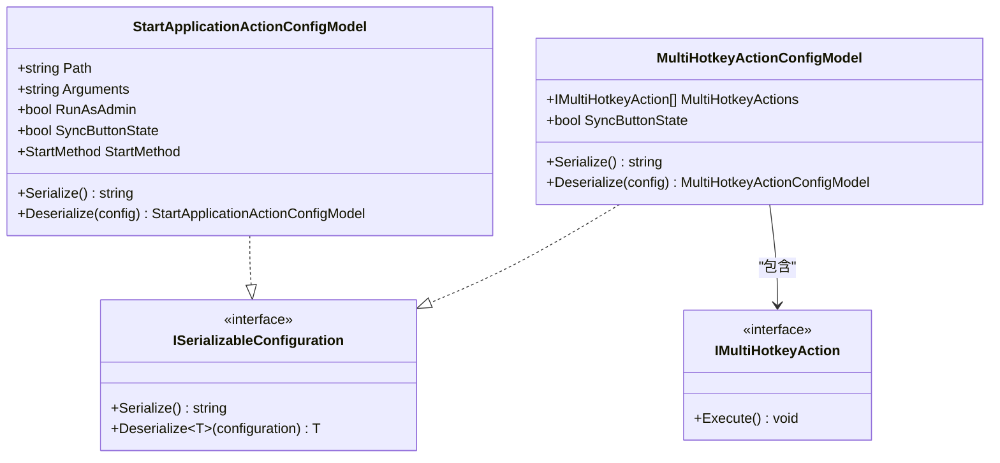

**图表来源**
- [ISerializableConfiguration.cs:5-11](file://Models/ISerializableConfiguration.cs#L5-L11)
- [StartApplicationActionConfigModel.cs:6-27](file://Models/StartApplicationActionConfigModel.cs#L6-L27)
- [MultiHotkeyActionConfigModel.cs:6-21](file://Models/MultiHotkeyActionConfigModel.cs#L6-L21)
- [IMultiHotkeyAction.cs:3-9](file://Models/IMultiHotkeyAction.cs#L3-L9)

**章节来源**
- [ISerializableConfiguration.cs:5-11](file://Models/ISerializableConfiguration.cs#L5-L11)
- [StartApplicationActionConfigModel.cs:6-27](file://Models/StartApplicationActionConfigModel.cs#L6-L27)
- [MultiHotkeyActionConfigModel.cs:6-21](file://Models/MultiHotkeyActionConfigModel.cs#L6-L21)
- [IMultiHotkeyAction.cs:3-9](file://Models/IMultiHotkeyAction.cs#L3-L9)

### 视图模型与GUI：配置保存与摘要生成
- 视图模型职责
  - ISerializableConfigViewModel抽象保存流程，具体ViewModel实现SetConfig与SaveConfig
  - SetConfig负责将配置序列化并写入PluginAction.Configuration，同时生成ConfigurationSummary

- 典型流程
  - 用户在GUI中编辑配置后点击保存，ViewModel调用SetConfig写回动作
  - 动作在OnActionButtonLoaded中根据SyncButtonState订阅定时器事件，实现状态同步

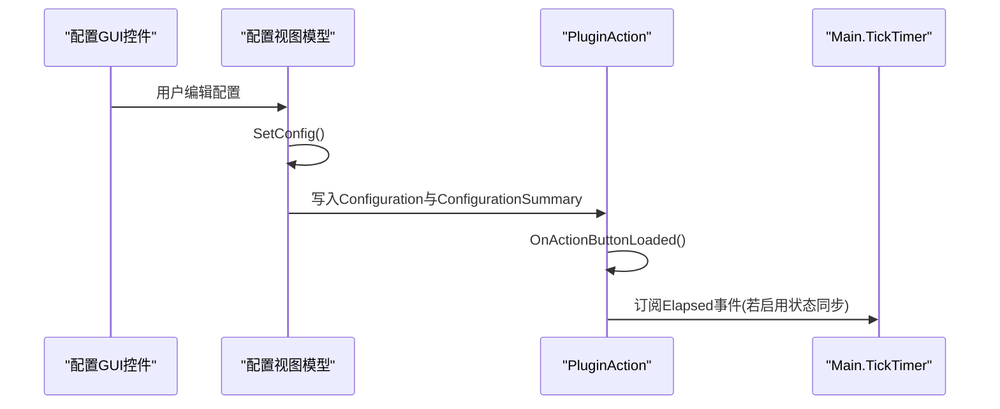

**图表来源**
- [StartApplicationActionConfigViewModel.cs:47-72](file://ViewModels/StartApplicationActionConfigViewModel.cs#L47-L72)
- [MultiHotkeyActionConfigViewModel.cs:30-55](file://ViewModels/MultiHotkeyActionConfigViewModel.cs#L30-L55)
- [StartApplicationAction.cs:57-78](file://Actions/StartApplicationAction.cs#L57-L78)

**章节来源**
- [ISerializableConfigViewModel.cs:5-12](file://ViewModels/ISerializableConfigViewModel.cs#L5-L12)
- [StartApplicationActionConfigViewModel.cs:8-72](file://ViewModels/StartApplicationActionConfigViewModel.cs#L8-L72)
- [MultiHotkeyActionConfigViewModel.cs:9-55](file://ViewModels/MultiHotkeyActionConfigViewModel.cs#L9-L55)
- [StartApplicationAction.cs:57-78](file://Actions/StartApplicationAction.cs#L57-L78)

### 具体动作实现示例

#### 文本输入动作（WriteTextAction）
- 触发流程
  - 解析配置JSON，替换变量占位符后通过Main.InputSimulator输入文本
  - 异常时记录警告日志

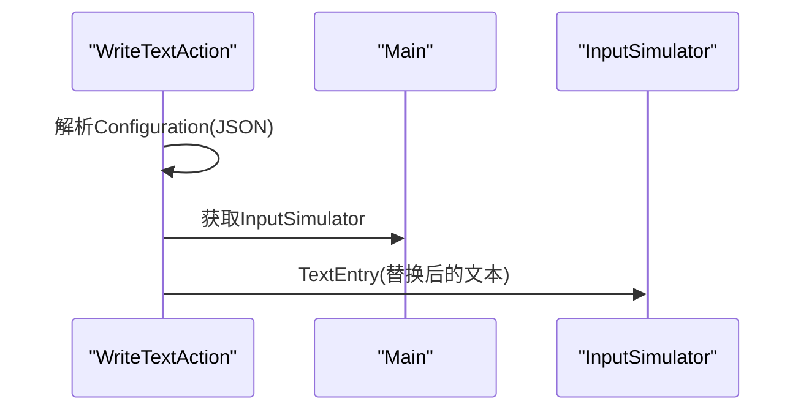

**图表来源**
- [WriteTextAction.cs:22-45](file://Actions/WriteTextAction.cs#L22-L45)
- [Main.cs:18](file://Main.cs#L18)

**章节来源**
- [WriteTextAction.cs:14-51](file://Actions/WriteTextAction.cs#L14-L51)
- [Main.cs:18](file://Main.cs#L18)

#### 应用启动动作（StartApplicationAction）
- 行为特性
  - 支持Start/Stop/Show/Hide四种启动方式
  - 当SyncButtonState启用时，通过定时器周期检查应用运行状态并更新按钮状态
  - 通过ApplicationLauncher封装系统进程与窗口操作

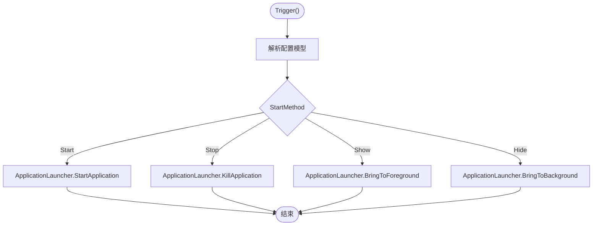

**图表来源**
- [StartApplicationAction.cs:34-76](file://Actions/StartApplicationAction.cs#L34-L76)
- [ApplicationLauncher.cs:45-126](file://Services/ApplicationLauncher.cs#L45-L126)

**章节来源**
- [StartApplicationAction.cs:34-76](file://Actions/StartApplicationAction.cs#L34-L76)
- [ApplicationLauncher.cs:13-165](file://Services/ApplicationLauncher.cs#L13-L165)

#### 多按键组合动作（MultiHotkeyAction）
- 行为特性
  - 读取配置模型中的按键序列，逐个执行
  - 支持同步按钮状态与中断执行（stop标志）

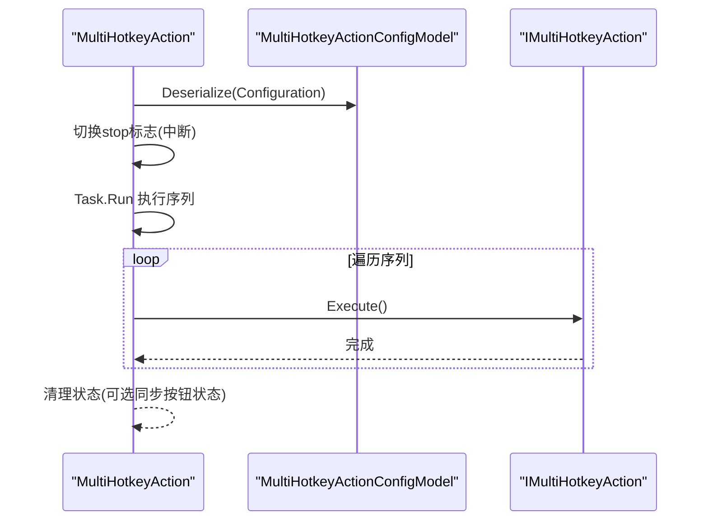

**图表来源**
- [MultiHotkeyAction.cs:23-48](file://Actions/MultiHotkeyAction.cs#L23-L48)
- [MultiHotkeyActionConfigModel.cs:6-21](file://Models/MultiHotkeyActionConfigModel.cs#L6-L21)
- [IMultiHotkeyAction.cs:3-9](file://Models/IMultiHotkeyAction.cs#L3-L9)

**章节来源**
- [MultiHotkeyAction.cs:11-56](file://Actions/MultiHotkeyAction.cs#L11-L56)
- [MultiHotkeyActionConfigModel.cs:6-21](file://Models/MultiHotkeyActionConfigModel.cs#L6-L21)
- [IMultiHotkeyAction.cs:3-9](file://Models/IMultiHotkeyAction.cs#L3-L9)

### 语言国际化与资源加载
- 初始化流程
  - PluginLanguageManager.Initialize在插件启用时加载语言资源
  - 监听语言变更事件，动态重新加载对应语言XML

- 资源定位
  - 通过嵌入式资源定位语言文件，若未找到则回退至默认语言

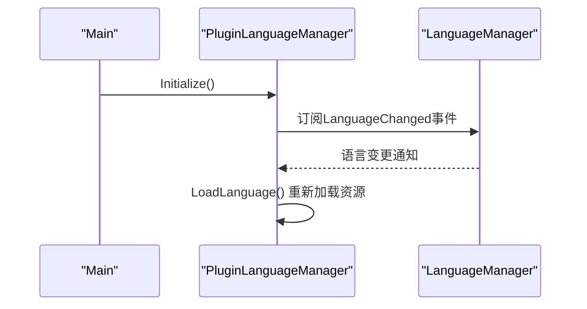

**图表来源**
- [Main.cs:30](file://Main.cs#L30)
- [PluginLanguageManager.cs:12-16](file://Language/PluginLanguageManager.cs#L12-L16)
- [PluginLanguageManager.cs:18-33](file://Language/PluginLanguageManager.cs#L18-L33)

**章节来源**
- [PluginLanguageManager.cs:8-51](file://Language/PluginLanguageManager.cs#L8-L51)
- [Main.cs:28-30](file://Main.cs#L28-L30)

## 依赖关系分析
- 外部依赖
  - Macro Deck 2运行时（通过引用Macro Deck 2.dll）
  - WindowsInput库用于模拟输入
  - Newtonsoft.Json用于部分动作的配置解析
  - System.Drawing.Common用于图像处理

- 内部耦合
  - Main对动作集合有直接依赖；动作对GUI与模型有依赖；视图模型对模型与动作有依赖
  - ApplicationLauncher被多个动作复用，形成跨动作的服务依赖

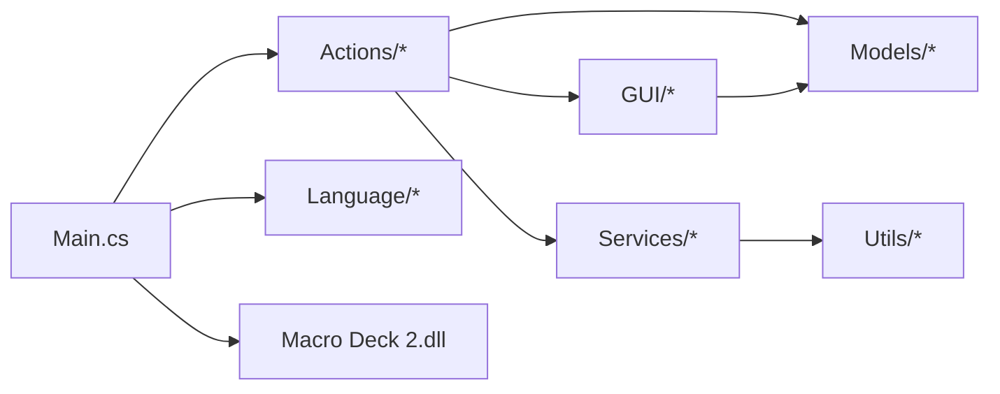

**图表来源**
- [Windows Utils.csproj:42-47](file://Windows Utils.csproj#L42-L47)
- [Main.cs:14-59](file://Main.cs#L14-L59)

**章节来源**
- [Windows Utils.csproj:35-47](file://Windows Utils.csproj#L35-L47)
- [Main.cs:14-59](file://Main.cs#L14-L59)

## 性能考虑
- 定时器频率与开销
  - TickTimer周期为2秒，适用于低频状态同步；若未来增加更频繁的任务，应评估线程池与UI线程阻塞风险

- 异步执行
  - 多数动作使用Task.Run或异步I/O，避免阻塞主线程；注意异常捕获与日志记录

- 序列化成本
  - JSON序列化/反序列化在配置保存/加载时发生；可通过缓存常用配置或延迟序列化减少开销

- 进程与窗口操作
  - ApplicationLauncher涉及Win32 API调用与进程枚举，应避免频繁调用；必要时引入轻量级缓存

[本节为通用指导，不直接分析具体文件]

## 故障排除指南
- 配置无法保存
  - 检查视图模型的SaveConfig是否抛出异常，确认SetConfig正确写入Configuration与ConfigurationSummary
  - 关注日志输出，定位序列化/反序列化错误

- 动作无响应
  - 确认动作已注册到Main.Actions且未被注释
  - 对于需要管理员权限的动作，检查RunAsAdmin配置与UAC提示

- 文本输入失败
  - 确保Main.InputSimulator可用，检查WriteTextAction的异常日志

- 应用启动/停止无效
  - 核对路径与参数，确认ApplicationLauncher相关方法调用成功
  - 若启用了状态同步，检查定时器事件订阅与取消

**章节来源**
- [StartApplicationActionConfigViewModel.cs:53-72](file://ViewModels/StartApplicationActionConfigViewModel.cs#L53-L72)
- [WriteTextAction.cs:40-44](file://Actions/WriteTextAction.cs#L40-L44)
- [StartApplicationAction.cs:65-78](file://Actions/StartApplicationAction.cs#L65-L78)
- [ApplicationLauncher.cs:45-126](file://Services/ApplicationLauncher.cs#L45-L126)

## 结论
本插件通过清晰的层次划分与标准化的配置序列化接口，实现了可扩展的动作体系。Main类承担入口与生命周期管理职责，动作通过GUI与视图模型实现配置可视化，服务层封装系统操作。整体架构具备良好的可维护性与扩展性，适合在此基础上新增动作与功能。

[本节为总结性内容，不直接分析具体文件]

## 附录

### 插件清单与构建信息
- 插件清单（ExtensionManifest.json）定义了插件类型、名称、作者、版本、目标API版本与DLL名称
- 构建脚本（csproj）指定了目标框架、平台、第三方包与宏任务自动部署逻辑

**章节来源**
- [ExtensionManifest.json:1-11](file://ExtensionManifest.json#L1-L11)
- [Windows Utils.csproj:1-74](file://Windows Utils.csproj#L1-L74)