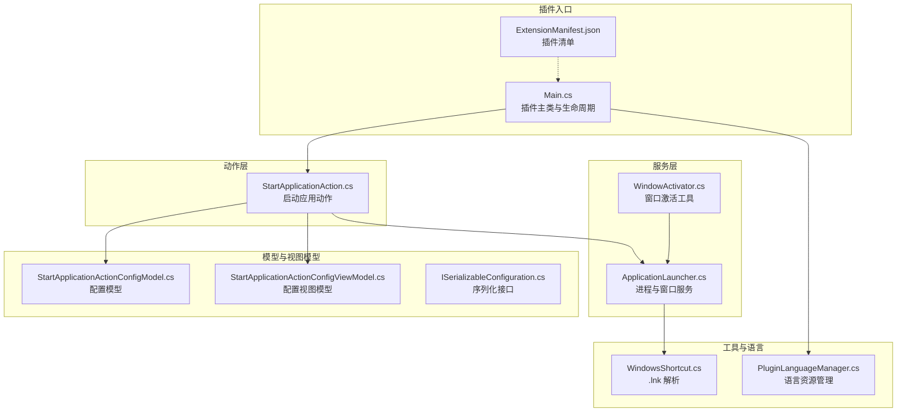
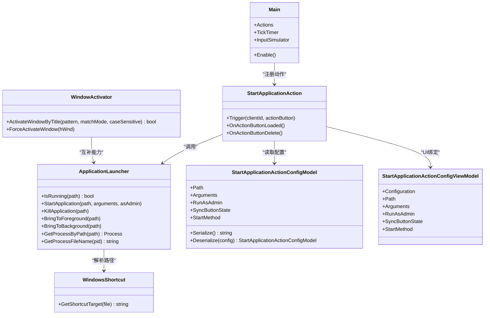
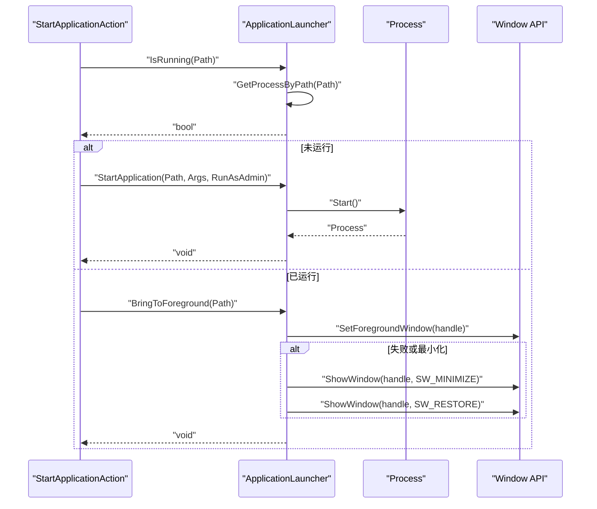
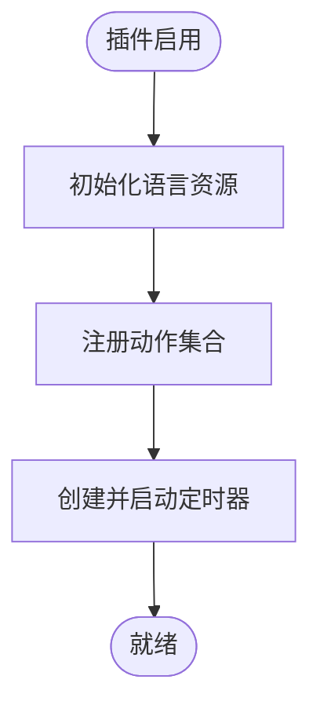
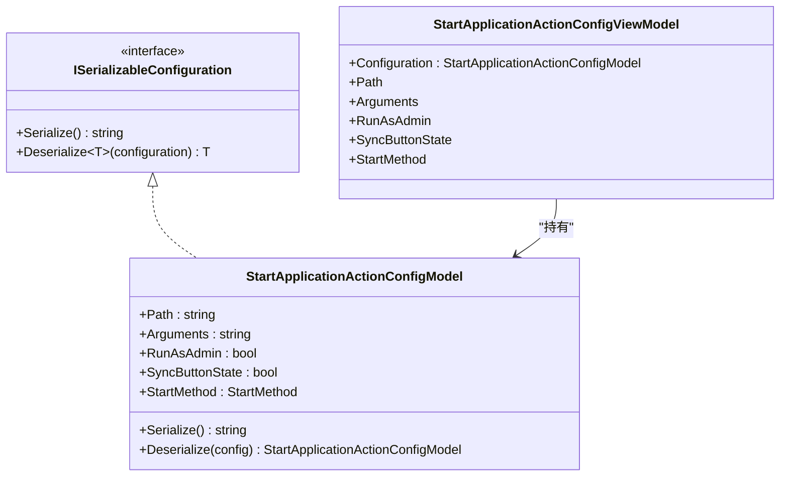
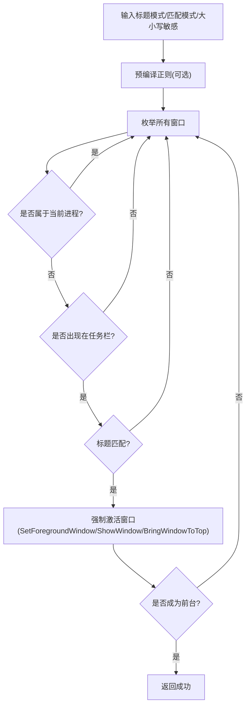
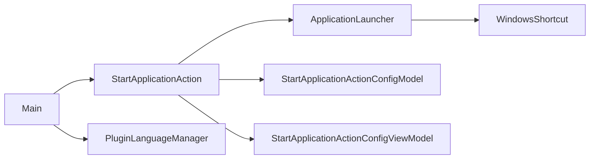

# 服务层封装

<cite>
**本文引用的文件**
- [Main.cs](file://Main.cs)
- [ApplicationLauncher.cs](file://Services/ApplicationLauncher.cs)
- [StartApplicationAction.cs](file://Actions/StartApplicationAction.cs)
- [StartApplicationActionConfigModel.cs](file://Models/StartApplicationActionConfigModel.cs)
- [StartApplicationActionConfigViewModel.cs](file://ViewModels/StartApplicationActionConfigViewModel.cs)
- [WindowActivator.cs](file://Utils/WindowActivator.cs)
- [WindowsShortcut.cs](file://Utils/WindowsShortcut.cs)
- [PluginLanguageManager.cs](file://Language/PluginLanguageManager.cs)
- [ExtensionManifest.json](file://ExtensionManifest.json)
- [ISerializableConfiguration.cs](file://Models/ISerializableConfiguration.cs)
</cite>

## 目录
1. [简介](#简介)
2. [项目结构](#项目结构)
3. [核心组件](#核心组件)
4. [架构总览](#架构总览)
5. [详细组件分析](#详细组件分析)
6. [依赖关系分析](#依赖关系分析)
7. [性能考虑](#性能考虑)
8. [故障排除指南](#故障排除指南)
9. [结论](#结论)
10. [附录](#附录)

## 简介
本文件面向服务层封装，聚焦于服务层的设计原则与架构模式，重点解析 ApplicationLauncher 服务在进程管理、应用启动与窗口控制方面的功能与实现细节；同时阐述 Main 类中服务的集成方式与生命周期管理，并提供服务层扩展指南与最佳实践，涵盖服务间通信、错误处理与性能监控等主题。

## 项目结构
该项目是一个 Macro Deck 2 插件，采用分层组织：主程序入口 Main 负责插件初始化与动作注册；服务层 Services 提供系统级能力（如进程与窗口操作）；模型层 Models 定义可序列化配置；视图模型层 ViewModels 将配置与界面交互绑定；工具层 Utils 提供底层系统调用与辅助逻辑；语言层 Language 支持多语言资源加载。

图表来源
- [Main.cs:14-59](file://Main.cs#L14-L59)
- [ApplicationLauncher.cs:13-165](file://Services/ApplicationLauncher.cs#L13-L165)
- [StartApplicationAction.cs:14-84](file://Actions/StartApplicationAction.cs#L14-L84)
- [StartApplicationActionConfigModel.cs:6-27](file://Models/StartApplicationActionConfigModel.cs#L6-L27)
- [StartApplicationActionConfigViewModel.cs:8-49](file://ViewModels/StartApplicationActionConfigViewModel.cs#L8-L49)
- [WindowActivator.cs:9-256](file://Utils/WindowActivator.cs#L9-L256)
- [WindowsShortcut.cs:5-66](file://Utils/WindowsShortcut.cs#L5-L66)
- [PluginLanguageManager.cs:8-51](file://Language/PluginLanguageManager.cs#L8-L51)
- [ExtensionManifest.json:1-11](file://ExtensionManifest.json#L1-L11)

章节来源
- [Main.cs:14-59](file://Main.cs#L14-L59)
- [ExtensionManifest.json:1-11](file://ExtensionManifest.json#L1-L11)

## 核心组件
- ApplicationLauncher：提供进程查询、启动、终止、前台/后台切换等能力，封装了用户态窗口 API 与进程句柄访问。
- StartApplicationAction：插件动作，根据配置触发 ApplicationLauncher 的不同方法，支持按钮状态同步与定时刷新。
- 配置模型与视图模型：统一序列化接口，保证配置的跨版本兼容与 UI 绑定。
- WindowActivator：通用窗口激活工具，支持多种匹配模式与线程输入附加。
- WindowsShortcut：解析 Windows 快捷方式目标路径，提升路径识别准确性。
- PluginLanguageManager：动态加载语言资源，支持语言切换事件。

章节来源
- [ApplicationLauncher.cs:13-165](file://Services/ApplicationLauncher.cs#L13-L165)
- [StartApplicationAction.cs:14-84](file://Actions/StartApplicationAction.cs#L14-L84)
- [StartApplicationActionConfigModel.cs:6-27](file://Models/StartApplicationActionConfigModel.cs#L6-L27)
- [StartApplicationActionConfigViewModel.cs:8-49](file://ViewModels/StartApplicationActionConfigViewModel.cs#L8-L49)
- [WindowActivator.cs:9-256](file://Utils/WindowActivator.cs#L9-L256)
- [WindowsShortcut.cs:5-66](file://Utils/WindowsShortcut.cs#L5-L66)
- [PluginLanguageManager.cs:8-51](file://Language/PluginLanguageManager.cs#L8-L51)

## 架构总览
服务层采用“动作-服务-工具”的分层设计：
- 动作层负责业务语义与用户交互，通过配置驱动服务层行为。
- 服务层封装系统 API，提供稳定、可测试的接口。
- 工具层提供底层能力（如快捷方式解析、窗口枚举），被服务层复用。

图表来源
- [Main.cs:14-59](file://Main.cs#L14-L59)
- [StartApplicationAction.cs:14-84](file://Actions/StartApplicationAction.cs#L14-L84)
- [ApplicationLauncher.cs:13-165](file://Services/ApplicationLauncher.cs#L13-L165)
- [WindowActivator.cs:9-256](file://Utils/WindowActivator.cs#L9-L256)
- [StartApplicationActionConfigModel.cs:6-27](file://Models/StartApplicationActionConfigModel.cs#L6-L27)
- [StartApplicationActionConfigViewModel.cs:8-49](file://ViewModels/StartApplicationActionConfigViewModel.cs#L8-L49)
- [WindowsShortcut.cs:5-66](file://Utils/WindowsShortcut.cs#L5-L66)

## 详细组件分析

### ApplicationLauncher 服务
- 设计原则
  - 单一职责：集中处理进程与窗口操作，避免分散在多个动作中。
  - 可测试性：通过 P/Invoke 封装底层 API，便于单元测试替换或模拟。
  - 兼容性：使用 AggressiveInlining 提升热点路径性能；对异常路径进行日志记录与安全返回。
- 关键能力
  - 进程检测：基于路径解析与进程名匹配，支持快捷方式目标解析。
  - 应用启动：支持以管理员权限运行、传递参数、设置工作目录。
  - 进程终止：按路径查找并终止所有同名进程实例。
  - 前台/后台切换：最小化或还原窗口，必要时使用 SetForegroundWindow 与 ShowWindow 的组合策略。
- 实现要点
  - 使用 Windows API 进行进程句柄打开、模块文件名查询与句柄关闭，确保资源释放。
  - 对窗口操作提供回退策略，若直接置顶失败则先最小化再还原。
  - 日志记录：在关键分支记录警告与跟踪信息，便于问题定位。

图表来源
- [StartApplicationAction.cs:22-50](file://Actions/StartApplicationAction.cs#L22-L50)
- [ApplicationLauncher.cs:39-126](file://Services/ApplicationLauncher.cs#L39-L126)

章节来源
- [ApplicationLauncher.cs:13-165](file://Services/ApplicationLauncher.cs#L13-L165)

### Main 类中的服务集成与生命周期
- 插件入口：Main 继承自 MacroDeckPlugin，构造函数中建立静态实例与全局插件实例引用，便于各组件通过静态访问。
- 动作注册：Enable 中初始化语言资源并注册所有可用动作，形成插件功能集合。
- 定时器：创建并启用定时器，用于按钮状态同步等周期性任务。

图表来源
- [Main.cs:28-58](file://Main.cs#L28-L58)

章节来源
- [Main.cs:14-59](file://Main.cs#L14-L59)

### 配置模型与序列化
- ISerializableConfiguration：定义统一的序列化接口与反序列化辅助方法，确保配置在版本升级时的向后兼容。
- StartApplicationActionConfigModel：包含路径、参数、管理员权限、按钮状态同步与启动方式等字段，提供序列化与反序列化。
- StartApplicationActionConfigViewModel：将配置模型暴露为可绑定属性，供 UI 控件使用。

图表来源
- [ISerializableConfiguration.cs:5-11](file://Models/ISerializableConfiguration.cs#L5-L11)
- [StartApplicationActionConfigModel.cs:6-27](file://Models/StartApplicationActionConfigModel.cs#L6-L27)
- [StartApplicationActionConfigViewModel.cs:8-49](file://ViewModels/StartApplicationActionConfigViewModel.cs#L8-L49)

章节来源
- [ISerializableConfiguration.cs:5-11](file://Models/ISerializableConfiguration.cs#L5-L11)
- [StartApplicationActionConfigModel.cs:6-27](file://Models/StartApplicationActionConfigModel.cs#L6-L27)
- [StartApplicationActionConfigViewModel.cs:8-49](file://ViewModels/StartApplicationActionConfigViewModel.cs#L8-L49)

### WindowActivator 工具
- 匹配模式：支持部分匹配、全等匹配、前缀匹配、后缀匹配与正则匹配。
- 窗口过滤：排除非可见、工具窗口、无重定向位图等不符合条件的窗口。
- 激活策略：通过线程输入附加与 SetForegroundWindow 等 API 实现跨线程激活。

图表来源
- [WindowActivator.cs:57-122](file://Utils/WindowActivator.cs#L57-L122)

章节来源
- [WindowActivator.cs:9-256](file://Utils/WindowActivator.cs#L9-L256)

### WindowsShortcut 解析
- 功能：解析 .lnk 快捷方式文件，提取真实目标路径，处理 Shell Item ID 列表与 Unicode 路径。
- 异常处理：捕获解析异常并返回空字符串，避免影响上层逻辑。

章节来源
- [WindowsShortcut.cs:5-66](file://Utils/WindowsShortcut.cs#L5-L66)

## 依赖关系分析
- 组件耦合
  - StartApplicationAction 依赖 ApplicationLauncher 与配置模型，耦合度适中，便于替换与测试。
  - ApplicationLauncher 依赖 Windows API 与快捷方式解析工具，内部高内聚。
  - Main 作为全局入口，通过静态引用被广泛使用，需谨慎管理其生命周期。
- 外部依赖
  - Macro Deck 插件框架提供的日志、语言、动作按钮等基础设施。
  - Windows 用户态 API（user32、kernel32、psapi）用于进程与窗口控制。

图表来源
- [StartApplicationAction.cs:14-84](file://Actions/StartApplicationAction.cs#L14-L84)
- [ApplicationLauncher.cs:13-165](file://Services/ApplicationLauncher.cs#L13-L165)
- [StartApplicationActionConfigModel.cs:6-27](file://Models/StartApplicationActionConfigModel.cs#L6-L27)
- [StartApplicationActionConfigViewModel.cs:8-49](file://ViewModels/StartApplicationActionConfigViewModel.cs#L8-L49)
- [WindowsShortcut.cs:5-66](file://Utils/WindowsShortcut.cs#L5-L66)
- [Main.cs:14-59](file://Main.cs#L14-L59)
- [PluginLanguageManager.cs:8-51](file://Language/PluginLanguageManager.cs#L8-L51)

章节来源
- [StartApplicationAction.cs:14-84](file://Actions/StartApplicationAction.cs#L14-L84)
- [ApplicationLauncher.cs:13-165](file://Services/ApplicationLauncher.cs#L13-L165)
- [Main.cs:14-59](file://Main.cs#L14-L59)

## 性能考虑
- 热点路径优化
  - ApplicationLauncher 中对进程文件名查询使用 AggressiveInlining，减少调用开销。
  - 窗口激活采用最小化-还原的回退策略，避免无效循环。
- 资源管理
  - 进程句柄在 finally 块中关闭，防止句柄泄漏。
- 并发与定时器
  - StartApplicationAction 使用异步任务更新按钮状态，避免阻塞 UI。
  - Main 的定时器周期为 2 秒，平衡实时性与 CPU 开销。

章节来源
- [ApplicationLauncher.cs:139-163](file://Services/ApplicationLauncher.cs#L139-L163)
- [StartApplicationAction.cs:71-82](file://Actions/StartApplicationAction.cs#L71-L82)
- [Main.cs:52-57](file://Main.cs#L52-L57)

## 故障排除指南
- 进程无法启动或无响应
  - 检查路径与参数是否正确，确认 RunAsAdmin 权限是否满足需求。
  - 观察日志输出，定位启动阶段的异常。
- 窗口无法置顶
  - 使用 WindowActivator 的调试模式验证标题匹配与任务栏可见性过滤。
  - 确认目标窗口不是工具窗口或无重定向位图类型。
- 按钮状态不同步
  - 确认已启用 SyncButtonState，并检查定时器是否正常运行。
  - 在触发器中打印当前进程状态，排查 IsRunning 返回值。

章节来源
- [ApplicationLauncher.cs:60-80](file://Services/ApplicationLauncher.cs#L60-L80)
- [WindowActivator.cs:124-140](file://Utils/WindowActivator.cs#L124-L140)
- [StartApplicationAction.cs:61-82](file://Actions/StartApplicationAction.cs#L61-L82)

## 结论
该服务层通过 ApplicationLauncher 将进程与窗口控制抽象为稳定的 API，配合配置模型与动作层实现灵活的业务语义。Main 类承担插件生命周期与全局资源管理，形成清晰的分层架构。建议在扩展新服务时遵循单一职责、可测试性与资源管理原则，并结合日志与性能监控持续优化。

## 附录

### 服务层扩展指南
- 新增服务步骤
  - 定义服务接口与实现类，保持单一职责。
  - 在 Main.Enable 中注册必要的初始化逻辑（如语言、定时器等）。
  - 在动作层通过依赖注入或静态访问使用服务。
- 自定义服务开发流程
  - 明确服务边界与输入输出。
  - 编写单元测试与集成测试。
  - 添加日志记录与异常处理。
  - 评估性能影响并进行优化。

### 服务间通信与依赖注入
- 当前实现采用静态访问与动作直接调用的方式，简单直观但耦合度较高。
- 推荐引入轻量依赖注入容器，将服务注册为单例，动作通过构造函数注入，提升可测试性与解耦。

### 错误处理与性能监控最佳实践
- 错误处理
  - 对外部系统调用进行 try-catch 包裹，记录详细日志。
  - 对关键路径添加断言与前置校验，提前发现非法输入。
- 性能监控
  - 使用定时器或采样器统计关键方法耗时。
  - 对高频调用的方法启用内联与缓存策略。
  - 监控句柄数量与内存占用，避免泄漏。