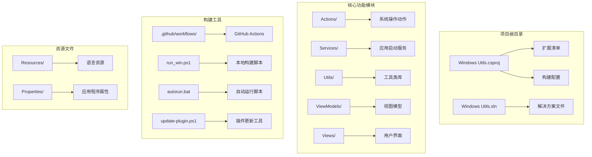
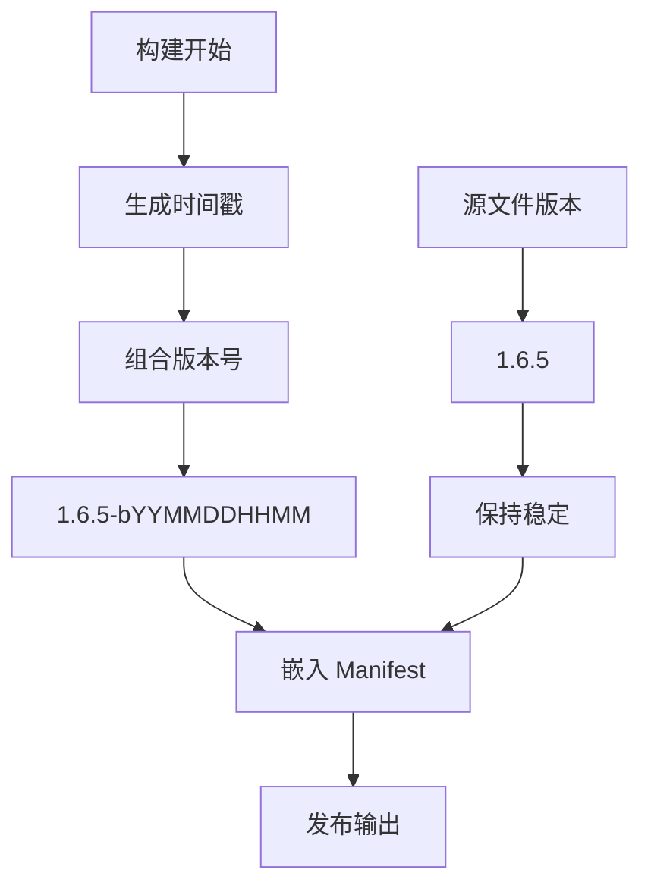
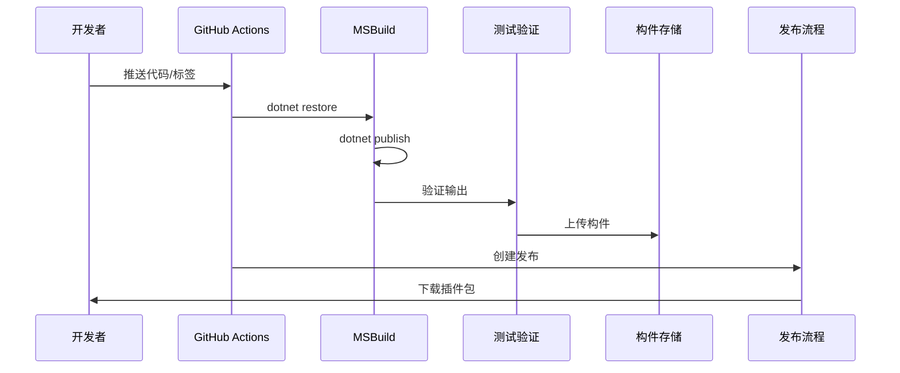
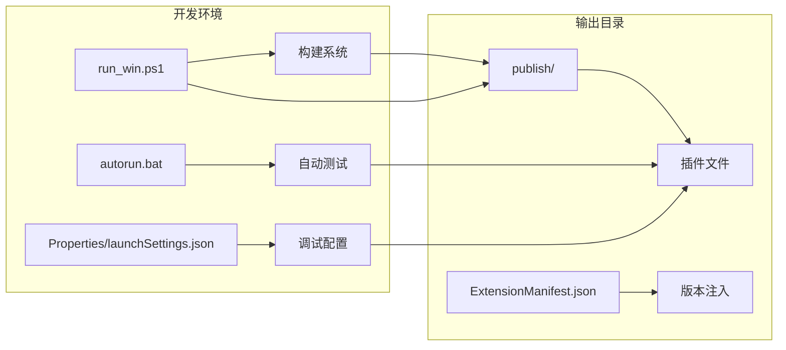
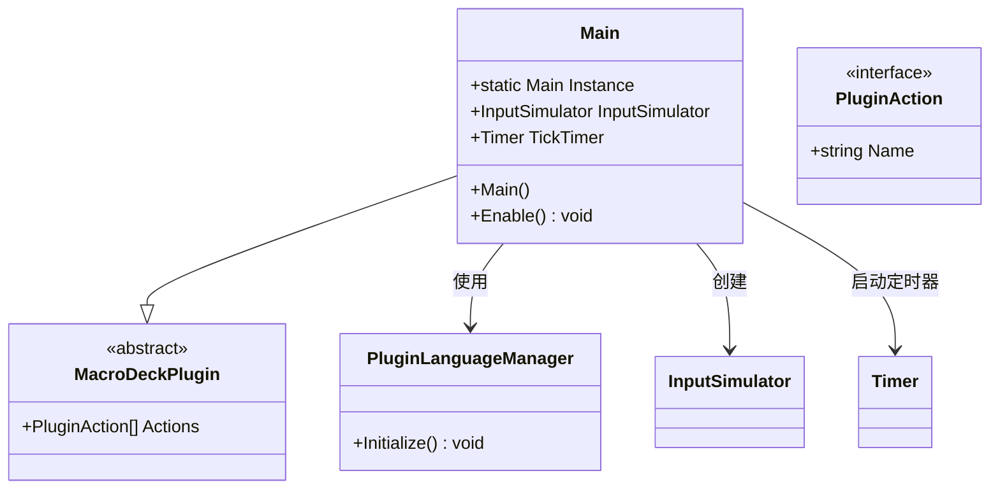
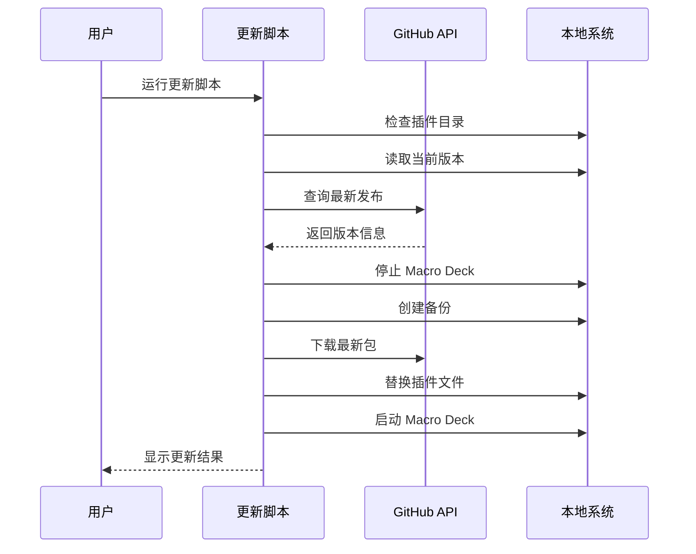
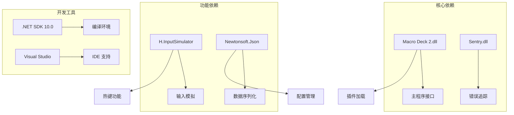
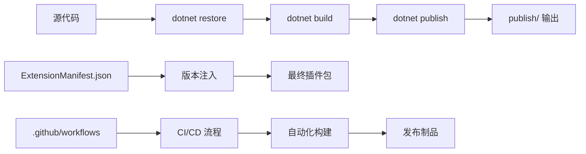
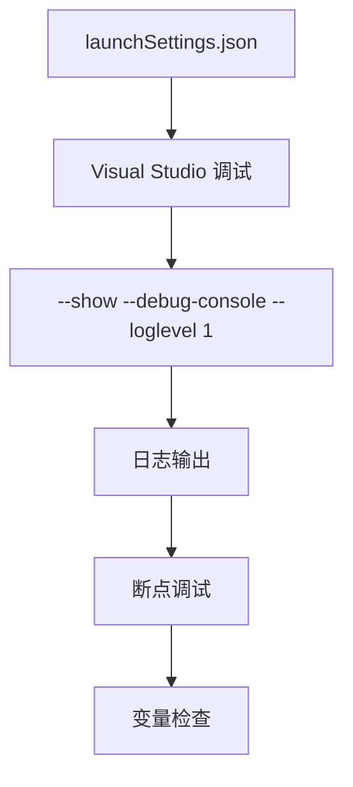

# 构建系统增强

<cite>
**本文档中引用的文件**
- [Windows Utils.csproj](file://Windows Utils.csproj)
- [.github/workflows/build.yml](file://.github/workflows/build.yml)
- [Main.cs](file://Main.cs)
- [ExtensionManifest.json](file://ExtensionManifest.json)
- [run_win.ps1](file://run_win.ps1)
- [autorun.bat](file://autorun.bat)
- [update-plugin.ps1](file://update-plugin.ps1)
- [Windows Utils.sln](file://Windows Utils.sln)
- [Properties/launchSettings.json](file://Properties/launchSettings.json)
</cite>

## 目录
1. [简介](#简介)
2. [项目结构](#项目结构)
3. [核心组件](#核心组件)
4. [架构概览](#架构概览)
5. [详细组件分析](#详细组件分析)
6. [依赖关系分析](#依赖关系分析)
7. [性能考虑](#性能考虑)
8. [故障排除指南](#故障排除指南)
9. [结论](#结论)

## 简介

这是一个为 Macro Deck 2 开发的 Windows 工具插件项目，采用 .NET 10.0 开发，提供了丰富的 Windows 系统控制功能。该项目的构建系统经过精心设计，支持本地开发、自动化 CI/CD 和生产环境部署。

## 项目结构

项目采用标准的 .NET 插件架构，主要包含以下核心模块：



**图表来源**
- [Windows Utils.csproj:1-129](file://Windows Utils.csproj#L1-L129)
- [Windows Utils.sln:1-32](file://Windows Utils.sln#L1-L32)

**章节来源**
- [Windows Utils.csproj:1-129](file://Windows Utils.csproj#L1-L129)
- [Windows Utils.sln:1-32](file://Windows Utils.sln#L1-L32)

## 核心组件

### 构建配置系统

项目采用多目标框架配置，支持 Windows Forms 应用程序开发：

- **目标框架**: net10.0-windows7.0
- **平台支持**: AnyCPU, x64
- **运行时标识符**: win-x64
- **安全配置**: Release 配置允许非安全代码块

### 版本管理系统

实现了智能版本控制机制：



**图表来源**
- [Windows Utils.csproj:14-22](file://Windows Utils.csproj#L14-L22)

**章节来源**
- [Windows Utils.csproj:14-22](file://Windows Utils.csproj#L14-L22)

### 依赖管理策略

项目采用混合依赖管理模式：

| 依赖类型 | 包名称 | 版本 | 配置说明 |
|---------|--------|------|----------|
| 输入模拟 | H.InputSimulator | 1.4.0 | 核心功能依赖 |
| JSON 处理 | Newtonsoft.Json | 13.0.3 | 数据序列化 |
| 错误追踪 | Sentry | 6.6.0 | 设计器兼容性 |
| 宏命令接口 | Macro Deck 2 | 引用程序集 | 主程序集成 |

**章节来源**
- [Windows Utils.csproj:43-78](file://Windows Utils.csproj#L43-L78)

## 架构概览

### 构建流水线架构



**图表来源**
- [.github/workflows/build.yml:14-74](file://.github/workflows/build.yml#L14-L74)

### 本地开发环境



**图表来源**
- [run_win.ps1:1-103](file://run_win.ps1#L1-L103)
- [autorun.bat:1-6](file://autorun.bat#L1-L6)

**章节来源**
- [.github/workflows/build.yml:14-74](file://.github/workflows/build.yml#L14-L74)
- [run_win.ps1:1-103](file://run_win.ps1#L1-L103)

## 详细组件分析

### 主插件类分析

Main 类是插件的核心入口点，负责整个插件的生命周期管理：



**图表来源**
- [Main.cs:24-84](file://Main.cs#L24-L84)

### 构建目标系统

项目定义了专门的构建目标来处理扩展清单：

```mermaid
flowchart TD
A[dotnet publish] --> B[AfterTargets="Publish">
B --> C[StampExtensionManifest]
C --> D[读取 ExtensionManifest.json]
D --> E[替换版本号]
E --> F[写入新文件]
F --> G[输出到 publish/]
H[源文件] --> I[1.6.5]
I --> J[保持不变]
J --> G
```

**图表来源**
- [Windows Utils.csproj:116-126](file://Windows Utils.csproj#L116-L126)

**章节来源**
- [Main.cs:24-84](file://Main.cs#L24-L84)
- [Windows Utils.csproj:116-126](file://Windows Utils.csproj#L116-L126)

### 自动化构建脚本

#### run_win.ps1 脚本功能

该脚本提供了完整的本地开发工作流：

| 参数 | 默认值 | 功能描述 |
|------|--------|----------|
| -Build | false | 执行构建操作 |
| -Run | false | 替换插件并重启 Macro Deck |
| -Clean | false | 清理构建缓存 |
| -Configuration | Release | 构建配置 |
| -PluginDir | %APPDATA%\Macro Deck\plugins\SuchByte.WindowsUtils | 插件安装目录 |
| -MacroDeckExe | C:\Program Files\Macro Deck\Macro Deck 2.exe | 宏命令可执行文件路径 |

**章节来源**
- [run_win.ps1:1-103](file://run_win.ps1#L1-L103)

### 插件更新机制

#### update-plugin.ps1 脚本分析

该脚本实现了完整的插件更新流程：



**图表来源**
- [update-plugin.ps1:103-170](file://update-plugin.ps1#L103-L170)

**章节来源**
- [update-plugin.ps1:1-192](file://update-plugin.ps1#L1-192)

## 依赖关系分析

### 外部依赖关系



**图表来源**
- [Windows Utils.csproj:43-78](file://Windows Utils.csproj#L43-L78)

### 构建时序关系



**图表来源**
- [.github/workflows/build.yml:27-31](file://.github/workflows/build.yml#L27-L31)

**章节来源**
- [Windows Utils.csproj:43-78](file://Windows Utils.csproj#L43-L78)
- [.github/workflows/build.yml:27-31](file://.github/workflows/build.yml#L27-L31)

## 性能考虑

### 构建性能优化

1. **增量构建**: 利用 .NET SDK 的增量构建特性，减少重复编译时间
2. **并行编译**: 支持多核并行编译，提高构建效率
3. **缓存利用**: NuGet 包缓存和 MSBuild 缓存的合理使用

### 运行时性能

1. **定时器优化**: 全局定时器间隔 2000ms，平衡响应性和资源消耗
2. **内存管理**: 及时释放不需要的资源和对象
3. **异步操作**: 对耗时操作采用异步模式

## 故障排除指南

### 常见构建问题

| 问题类型 | 症状 | 解决方案 |
|----------|------|----------|
| 依赖缺失 | 构建失败，提示找不到包 | 运行 `dotnet restore` |
| 版本冲突 | 编译警告，版本不匹配 | 清理 bin/obj 目录后重新构建 |
| 设计器问题 | WinForms 设计器无法加载 | 检查 Macro Deck 2.dll 路径配置 |
| 权限问题 | 无法写入插件目录 | 以管理员权限运行 PowerShell |

### 调试配置

开发环境提供了完善的调试支持：



**图表来源**
- [Properties/launchSettings.json:1-9](file://Properties/launchSettings.json#L1-L9)

**章节来源**
- [Properties/launchSettings.json:1-9](file://Properties/launchSettings.json#L1-L9)

## 结论

该构建系统展现了现代 .NET 插件开发的最佳实践，具有以下特点：

1. **自动化程度高**: 完整的 CI/CD 流水线支持
2. **开发体验佳**: 丰富的本地开发工具和脚本
3. **版本管理完善**: 智能版本控制和发布机制
4. **依赖管理清晰**: 合理的依赖分层和配置
5. **可维护性强**: 模块化设计和清晰的架构分离

建议的改进方向：
- 添加单元测试覆盖率报告
- 实现更细粒度的日志记录
- 增加构建性能监控指标
- 完善错误恢复机制