# 测试与调试

<cite>
**本文档引用的文件**
- [Main.cs](file://Main.cs)
- [ExtensionManifest.json](file://ExtensionManifest.json)
- [Windows Utils.csproj](file://Windows Utils.csproj)
- [Properties/launchSettings.json](file://Properties/launchSettings.json)
- [Actions/CommandlineAction.cs](file://Actions/CommandlineAction.cs)
- [Actions/HotkeyAction.cs](file://Actions/HotkeyAction.cs)
- [Actions/PowerOptionAction.cs](file://Actions/PowerOptionAction.cs)
- [Actions/NotificationAction.cs](file://Actions/NotificationAction.cs)
- [Actions/OpenFileAction.cs](file://Actions/OpenFileAction.cs)
- [Actions/StartApplicationAction.cs](file://Actions/StartApplicationAction.cs)
- [Actions/WindowSwitchAction.cs](file://Actions/WindowSwitchAction.cs)
- [Actions/WriteTextAction.cs](file://Actions/WriteTextAction.cs)
- [Actions/WindowsExplorerControlAction.cs](file://Actions/WindowsExplorerControlAction.cs)
- [Actions/MultiHotkeyAction.cs](file://Actions/MultiHotkeyAction.cs)
- [Actions/MuteMicrophoneAction.cs](file://Actions/MuteMicrophoneAction.cs)
- [Services/ApplicationLauncher.cs](file://Services/ApplicationLauncher.cs)
- [.github/workflows/build.yml](file://.github/workflows/build.yml)
- [run_win.ps1](file://run_win.ps1)
- [test-editplus.ps1](file://test-editplus.ps1)
- [update-plugin.ps1](file://update-plugin.ps1)
- [autorun.bat](file://autorun.bat)
</cite>

## 目录
1. 引言
2. 项目结构
3. 核心组件
4. 架构总览
5. 详细组件分析
6. 依赖关系分析
7. 性能考量
8. 故障排除指南
9. 结论
10. 附录

## 引言
本指南面向插件开发者，聚焦于 Macro Deck Windows Utils 插件在开发、测试与调试阶段的实践方法。内容覆盖单元测试、集成测试与端到端测试策略，调试宏命令与日志记录，错误追踪与常见问题（权限、兼容性、性能）的排查，以及测试环境搭建、自动化脚本与持续集成配置建议。为保证可操作性，文档以仓库中现有实现为依据，结合可扩展的最佳实践给出落地步骤。

**更新** 本次更新重点反映了插件在开发工具链方面的重大改进，包括新增PowerShell自动化脚本(run_win.ps1)、端到端测试脚本(test-editplus.ps1)、插件更新脚本(update-plugin.ps1)以及GitHub Actions持续集成配置，显著提升了开发者体验和测试效率。

## 项目结构
该插件采用"按功能域分层"的组织方式：主入口负责插件生命周期与动作注册；Actions 目录承载各类用户触发的动作；Services 提供系统级能力封装；Utils 提供底层系统调用与工具函数；GUI 与 ViewModels 负责配置界面与视图模型；语言资源与清单文件支撑国际化与插件元数据；新增的PowerShell脚本提供完整的开发自动化工具链。

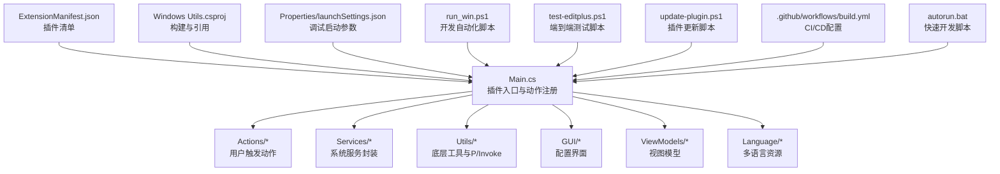

**图表来源**
- [Main.cs:14-63](file://Main.cs#L14-L63)
- [ExtensionManifest.json:1-11](file://ExtensionManifest.json#L1-L11)
- [Windows Utils.csproj:1-74](file://Windows Utils.csproj#L1-L74)
- [Properties/launchSettings.json:1-9](file://Properties/launchSettings.json#L1-L9)
- [run_win.ps1:1-79](file://run_win.ps1#L1-L79)
- [test-editplus.ps1:1-282](file://test-editplus.ps1#L1-L282)
- [update-plugin.ps1:1-192](file://update-plugin.ps1#L1-L192)
- [.github/workflows/build.yml:1-74](file://.github/workflows/build.yml#L1-L74)
- [autorun.bat:1-6](file://autorun.bat#L1-L6)

**章节来源**
- [Main.cs:14-63](file://Main.cs#L14-L63)
- [ExtensionManifest.json:1-11](file://ExtensionManifest.json#L1-L11)
- [Windows Utils.csproj:1-74](file://Windows Utils.csproj#L1-L74)
- [Properties/launchSettings.json:1-9](file://Properties/launchSettings.json#L1-L9)
- [run_win.ps1:1-79](file://run_win.ps1#L1-L79)
- [test-editplus.ps1:1-282](file://test-editplus.ps1#L1-L282)
- [update-plugin.ps1:1-192](file://update-plugin.ps1#L1-L192)
- [.github/workflows/build.yml:1-74](file://.github/workflows/build.yml#L1-L74)
- [autorun.bat:1-6](file://autorun.bat#L1-L6)

## 核心组件
- 插件入口 Main：负责初始化语言、注册动作列表、启动定时器等，并在启用时输出详细的动作列表日志。
- 动作 Action：如命令行执行、热键发送、应用启动/切换窗口、音量控制、通知、电源选项等，均通过 JSON 配置驱动，并具备完善的日志记录能力。
- 服务 Service：如 ApplicationLauncher 封装进程管理与前台/后台切换，具备详细的日志记录和异常处理。
- 工具 Utils：如 WindowActivator 使用 P/Invoke 枚举与激活窗口；ShellIcon 通过 Shell API 获取图标索引与大图标句柄。
- 开发自动化工具链：包括PowerShell脚本(run_win.ps1)提供一键构建、部署和测试功能，端到端测试脚本(test-editplus.ps1)验证完整功能链路，插件更新脚本(update-plugin.ps1)支持从GitHub发布版本自动更新。
- 日志与调试：使用 Macro Deck 日志接口与 .NET Debug 输出，涵盖 Info、Warning、Error、Trace 等多层次日志记录。

**章节来源**
- [Main.cs:30-61](file://Main.cs#L30-L61)
- [Actions/CommandlineAction.cs:14-65](file://Actions/CommandlineAction.cs#L14-L65)
- [Actions/HotkeyAction.cs:15-113](file://Actions/HotkeyAction.cs#L15-L113)
- [Services/ApplicationLauncher.cs:13-165](file://Services/ApplicationLauncher.cs#L13-L165)
- [run_win.ps1:24-43](file://run_win.ps1#L24-L43)
- [test-editplus.ps1:1-282](file://test-editplus.ps1#L1-L282)
- [update-plugin.ps1:1-192](file://update-plugin.ps1#L1-L192)

## 架构总览
下图展示插件从触发到执行的关键路径，以及与外部系统的交互点（进程、输入模拟、窗口管理、日志），并新增开发自动化工具链的集成。

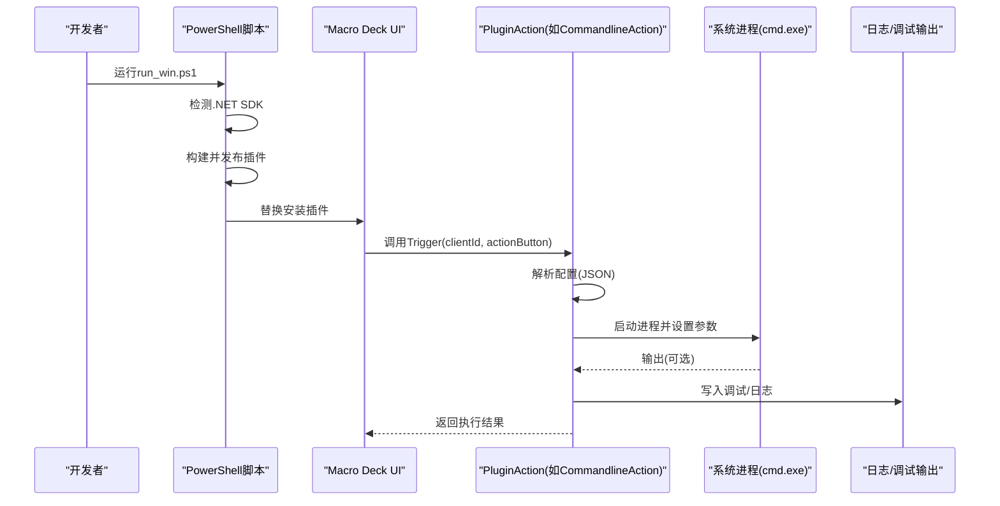

**图表来源**
- [run_win.ps1:24-43](file://run_win.ps1#L24-L43)
- [Actions/CommandlineAction.cs:22-58](file://Actions/CommandlineAction.cs#L22-L58)
- [Main.cs:30-61](file://Main.cs#L30-L61)

## 详细组件分析

### 插件初始化与动作注册（Main）
职责：初始化语言、注册动作列表、启动定时器，并输出详细的插件启用日志。
关键点：
- 在 Enable 方法中注册所有可用动作，并输出包含动作名称的详细日志。
- 启动定时器用于状态同步和按钮状态更新。
- 使用 MacroDeckLogger.Info 输出插件启用和动作列表信息。

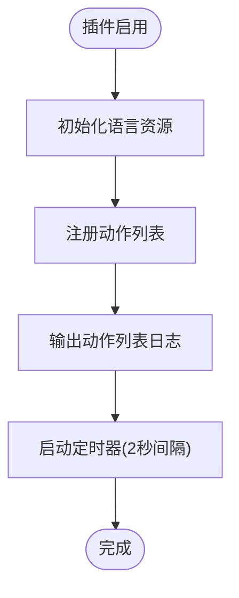

**图表来源**
- [Main.cs:30-61](file://Main.cs#L30-L61)

**章节来源**
- [Main.cs:30-61](file://Main.cs#L30-L61)

### 命令行动作（CommandlineAction）
职责：解析配置，启动 cmd.exe 执行命令，可选将输出写入变量。
关键点：
- 配置为 JSON 字符串，包含工作目录、命令、是否保存变量、变量名与类型等。
- 使用 Process 启动，支持隐藏窗口与重定向标准输出。
- 捕获异常并通过调试输出记录错误信息。

**图表来源**
- [Actions/CommandlineAction.cs:22-58](file://Actions/CommandlineAction.cs#L22-L58)

**章节来源**
- [Actions/CommandlineAction.cs:14-65](file://Actions/CommandlineAction.cs#L14-L65)

### 热键动作（HotkeyAction）
职责：根据配置组合修饰键与主键，通过输入模拟库发送热键序列。
关键点：
- 配置包含主键与多个修饰键布尔标志。
- 逐个按下修饰键，再按下主键，短暂延迟后释放，最后依次释放修饰键。
- 异常被吞掉，建议在开发阶段保留或增强日志。

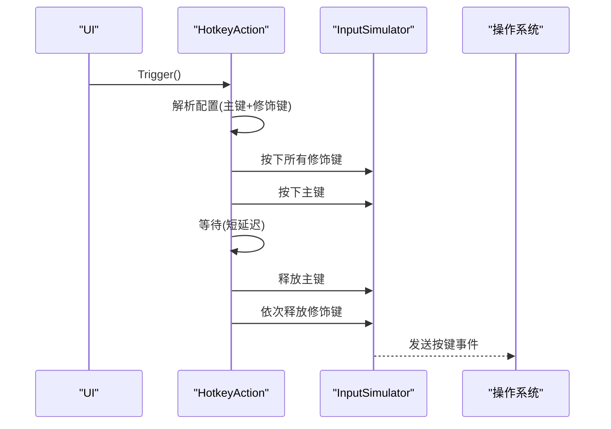

**图表来源**
- [Actions/HotkeyAction.cs:29-111](file://Actions/HotkeyAction.cs#L29-L111)

**章节来源**
- [Actions/HotkeyAction.cs:15-113](file://Actions/HotkeyAction.cs#L15-L113)

### 电源选项动作（PowerOptionAction）
职责：执行系统电源操作（睡眠、休眠、关机、重启）。
关键点：
- 具备完整的日志记录：触发时、配置解析时、执行每个操作时、失败时。
- 使用 Application.SetSuspendState 执行睡眠和休眠。
- 使用进程启动执行关机和重启命令。

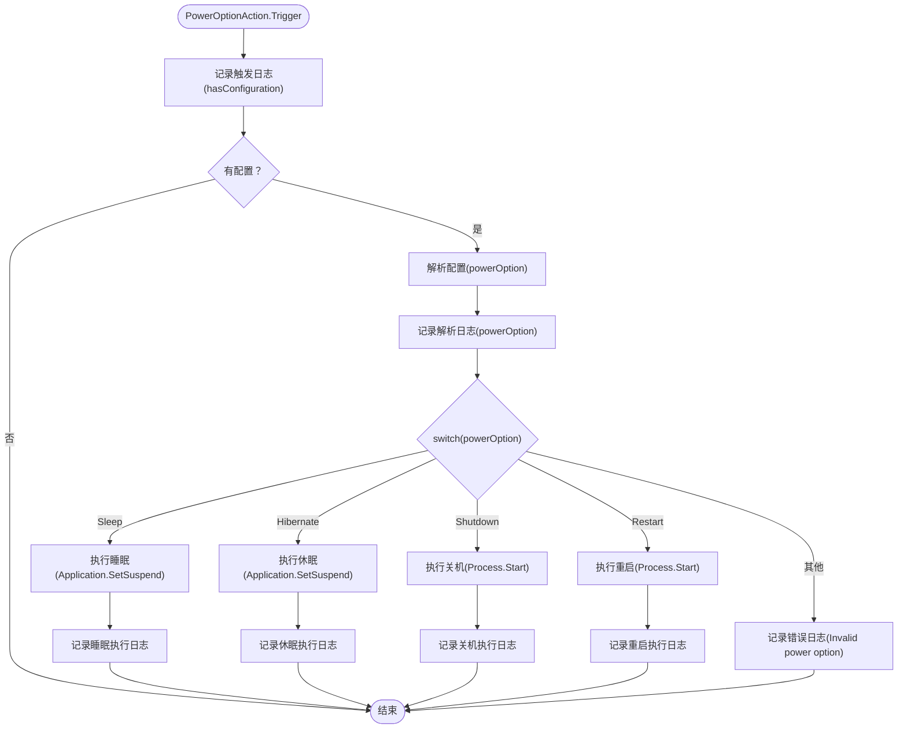

**图表来源**
- [Actions/PowerOptionAction.cs:22-61](file://Actions/PowerOptionAction.cs#L22-L61)

**章节来源**
- [Actions/PowerOptionAction.cs:14-68](file://Actions/PowerOptionAction.cs#L14-L68)

### 通知动作（NotificationAction）
职责：显示系统通知。
关键点：
- 具备完整的日志记录：触发时、配置解析时、完成时、失败时。
- 使用 NotificationManager.Notify 显示通知并立即移除。
- 记录通知ID以便跟踪。

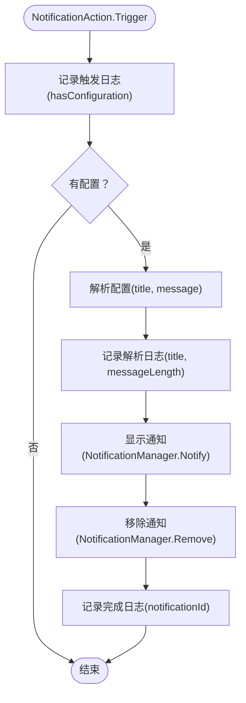

**图表来源**
- [Actions/NotificationAction.cs:22-44](file://Actions/NotificationAction.cs#L22-L44)

**章节来源**
- [Actions/NotificationAction.cs:14-51](file://Actions/NotificationAction.cs#L14-L51)

### 应用启动器（ApplicationLauncher）
职责：启动/终止应用、前后台切换、进程查询。
关键点：
- 使用 P/Invoke 调用 user32 与 kernel32 接口。
- 支持以管理员权限运行。
- 对空路径与不存在进程进行告警，避免崩溃。
- 进程文件名解析通过快捷方式目标解析。
- 具备详细的日志记录：Warning、Trace 等多层次日志。

```mermaid
flowchart TD
Start(["StartApplication"]) --> CheckArgs["校验路径/参数"]
CheckArgs --> Launch["构造Process并启动(可请求提升)"]
Launch --> Done(["完成"])
subgraph "进程管理"
Find["GetProcessByPath"] --> Kill["KillApplication(Log Warning/Trace)"]
Find --> Fore["BringToForeground(Log Warning/Trace)"]
Find --> Back["BringToBackground(Log Warning/Trace)"]
end
```

**图表来源**
- [Services/ApplicationLauncher.cs:45-165](file://Services/ApplicationLauncher.cs#L45-L165)

**章节来源**
- [Services/ApplicationLauncher.cs:13-165](file://Services/ApplicationLauncher.cs#L13-L165)

### 窗口切换动作（WindowSwitchAction）
职责：根据标题模式匹配切换到指定窗口。
关键点：
- 具备完整的日志记录：触发时、配置解析时、完成时、失败时。
- 支持多种匹配模式（全等、前缀、后缀、包含、正则）。
- 使用 P/Invoke 枚举窗口并过滤任务栏可见性。

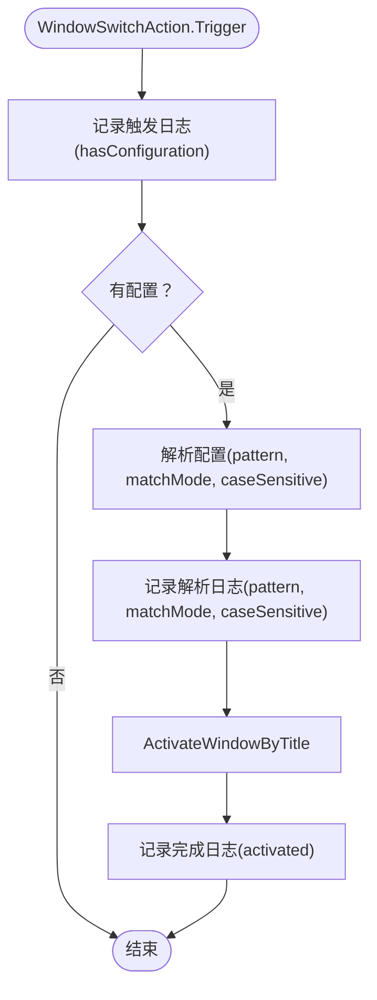

**图表来源**
- [Actions/WindowSwitchAction.cs:22-43](file://Actions/WindowSwitchAction.cs#L22-L43)

**章节来源**
- [Actions/WindowSwitchAction.cs:14-50](file://Actions/WindowSwitchAction.cs#L14-L50)

### 文本输入动作（WriteTextAction）
职责：发送文本输入到活动窗口。
关键点：
- 具备异常处理和日志记录。
- 支持变量替换：将文本中的变量占位符替换为实际变量值。
- 使用 InputSimulator.Keyboard.TextEntry 发送文本。

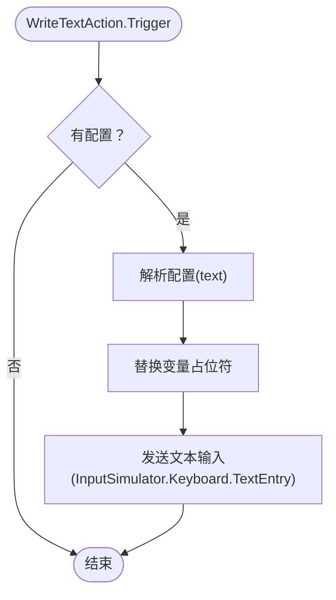

**图表来源**
- [Actions/WriteTextAction.cs:22-45](file://Actions/WriteTextAction.cs#L22-L45)

**章节来源**
- [Actions/WriteTextAction.cs:14-52](file://Actions/WriteTextAction.cs#L14-L52)

### 多热键动作（MultiHotkeyAction）
职责：执行一系列热键序列。
关键点：
- 使用异步任务执行热键序列。
- 支持停止机制和按钮状态同步。
- 具备基本的异常处理。

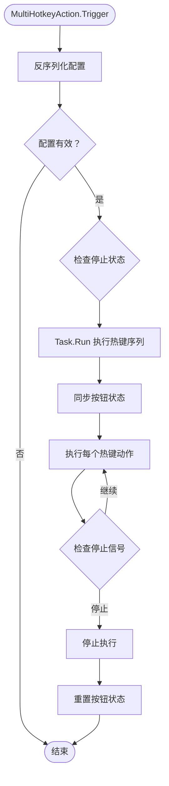

**图表来源**
- [Actions/MultiHotkeyAction.cs:23-48](file://Actions/MultiHotkeyAction.cs#L23-L48)

**章节来源**
- [Actions/MultiHotkeyAction.cs:11-57](file://Actions/MultiHotkeyAction.cs#L11-L57)

### 微信静音动作（MuteMicrophoneAction）
职责：静音当前前台应用程序的麦克风。
关键点：
- 使用 Windows API 发送 APPCOMMAND_MICROPHONE_VOLUME_MUTE 消息。
- 具备完整的日志记录：触发时、完成时、失败时。
- 记录前台窗口句柄和结果以便调试。

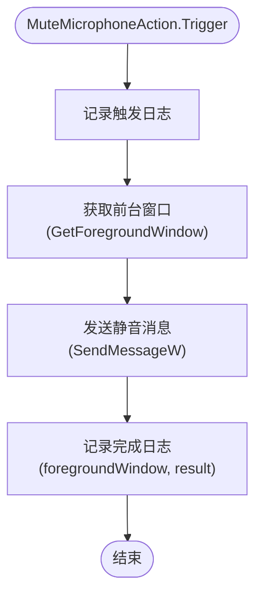

**图表来源**
- [Actions/MuteMicrophoneAction.cs:26-39](file://Actions/MuteMicrophoneAction.cs#L26-L39)

**章节来源**
- [Actions/MuteMicrophoneAction.cs:10-41](file://Actions/MuteMicrophoneAction.cs#L10-L41)

### PowerShell开发自动化脚本（run_win.ps1）
职责：提供完整的开发自动化工具链，包括.NET SDK检测、构建、部署和测试。
关键特性：
- 自动检测.NET SDK并提供友好的错误提示
- 支持构建配置选择（Debug/Release）
- 智能进程管理：自动停止运行中的Macro Deck以避免DLL锁定
- 自动复制发布输出到插件目录
- 支持自定义插件目录和Macro Deck可执行文件路径
- 集成CI环境变量支持

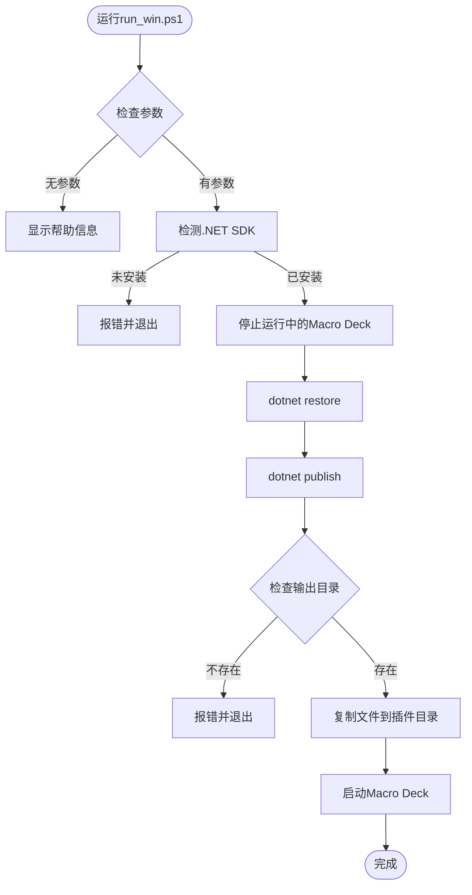

**图表来源**
- [run_win.ps1:24-78](file://run_win.ps1#L24-L78)

**章节来源**
- [run_win.ps1:1-79](file://run_win.ps1#L1-L79)

### 端到端测试脚本（test-editplus.ps1）
职责：自动化端到端测试，验证插件完整功能链路。
关键特性：
- 支持跳过更新直接测试磁盘上现有插件
- 自动连接Macro Deck WebSocket服务器
- 模拟按钮触发并验证结果
- 通过日志和进程状态双重验证
- 支持自定义客户端ID、按钮位置和期望进程
- 内置结果跟踪和详细日志输出

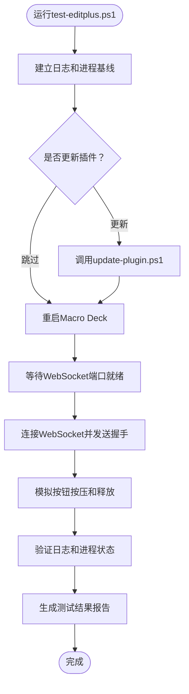

**图表来源**
- [test-editplus.ps1:64-282](file://test-editplus.ps1#L64-L282)

**章节来源**
- [test-editplus.ps1:1-282](file://test-editplus.ps1#L1-L282)

### 插件更新脚本（update-plugin.ps1）
职责：从GitHub最新发布版本自动下载并更新插件。
关键特性：
- 智能版本检测：比较当前版本与GitHub最新版本
- 支持强制重新安装
- 自动备份现有插件文件
- 下载并解压缩最新发布包
- 完整的错误处理和回滚机制
- 可选自动重启Macro Deck

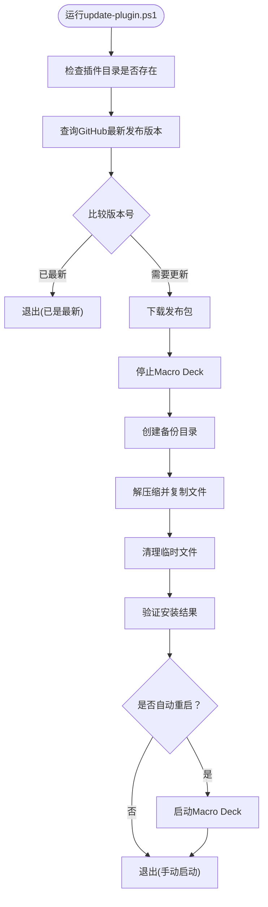

**图表来源**
- [update-plugin.ps1:52-192](file://update-plugin.ps1#L52-L192)

**章节来源**
- [update-plugin.ps1:1-192](file://update-plugin.ps1#L1-L192)

### 批处理脚本（autorun.bat）
职责：提供最简化的开发测试流程。
关键特性：
- 自动结束运行中的Macro Deck进程
- 删除旧的插件DLL文件
- 执行dotnet build构建
- 最小化启动Macro Deck

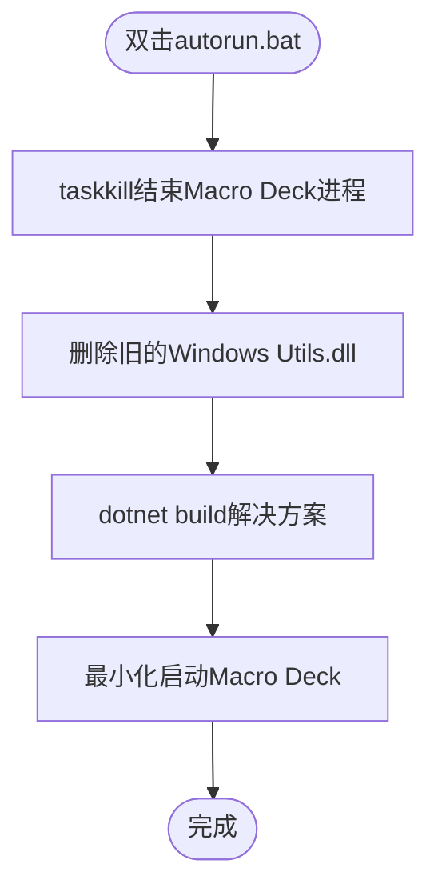

**图表来源**
- [autorun.bat:1-6](file://autorun.bat#L1-L6)

**章节来源**
- [autorun.bat:1-6](file://autorun.bat#L1-L6)

## 依赖关系分析
- 构建与运行时依赖：
  - 目标框架与平台：.NET 10，Windows Forms，x64。
  - 第三方包：H.InputSimulator、Newtonsoft.Json、System.Drawing.Common。
  - 对 Macro Deck 2 的程序集引用，支持调试时自动复制 DLL 并重启宿主。
- 清单文件定义插件类型、版本、目标 API 版本与 DLL 名称。
- 启动配置提供调试控制台与日志级别参数。
- **新增** PowerShell开发工具链依赖：PowerShell 5.0+，.NET SDK 10.0，GitHub API访问权限。

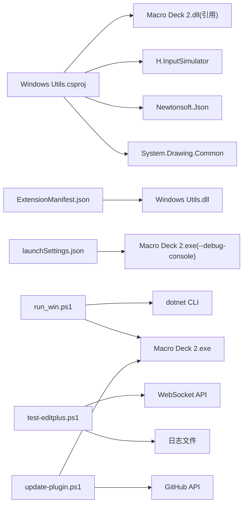

**图表来源**
- [Windows Utils.csproj:35-47](file://Windows Utils.csproj#L35-L47)
- [ExtensionManifest.json:1-11](file://ExtensionManifest.json#L1-L11)
- [Properties/launchSettings.json:3-7](file://Properties/launchSettings.json#L3-L7)
- [run_win.ps1:25-28](file://run_win.ps1#L25-L28)
- [test-editplus.ps1:137-205](file://test-editplus.ps1#L137-L205)
- [update-plugin.ps1:74-80](file://update-plugin.ps1#L74-L80)

**章节来源**
- [Windows Utils.csproj:1-74](file://Windows Utils.csproj#L1-L74)
- [ExtensionManifest.json:1-11](file://ExtensionManifest.json#L1-L11)
- [Properties/launchSettings.json:1-9](file://Properties/launchSettings.json#L1-L9)
- [run_win.ps1:1-79](file://run_win.ps1#L1-L79)
- [test-editplus.ps1:1-282](file://test-editplus.ps1#L1-L282)
- [update-plugin.ps1:1-192](file://update-plugin.ps1#L1-L192)

## 性能考量
- 输入模拟与窗口枚举：
  - 热键动作中对修饰键与主键分别按下/释放，配合短暂延迟确保兼容性，但可能影响响应时间。可在稳定场景下调小延迟或合并按键事件。
  - 窗口激活器遍历所有顶层窗口并进行多项检查，复杂度与打开窗口数量相关。建议在高频调用场景下缓存最近匹配结果或限制搜索范围。
- 进程管理：
  - ApplicationLauncher 查询进程与读取模块路径涉及 P/Invoke，频繁调用应考虑去抖与缓存。
- I/O 与日志：
  - 命令行动作在保存变量时读取标准输出，建议避免在高频触发场景中启用变量保存，或限制输出大小。
  - 新增的日志记录功能提供了更好的性能监控手段，可通过调整日志级别来平衡详细程度和性能开销。
- **新增** 开发工具链性能：
  - PowerShell脚本在构建过程中会自动停止Macro Deck以避免DLL锁定，这可能影响开发流程的连续性。
  - 端到端测试脚本包含网络连接和文件系统操作，建议在网络不稳定或磁盘IO较慢的环境中适当增加超时时间。

## 故障排除指南
- 权限问题
  - 现象：无法启动管理员应用、无法切换前台窗口。
  - 排查：确认以管理员身份运行宿主；检查 UAC 设置；验证 ApplicationLauncher 的 Verb 参数。
  - 参考
    - [Services/ApplicationLauncher.cs:45-58](file://Services/ApplicationLauncher.cs#L45-L58)
- 系统兼容性
  - 现象：热键不生效、窗口激活失败。
  - 排查：确认目标应用是否支持快速按键序列；在 WindowActivator 中调整匹配模式与大小写敏感性；检查任务栏可见性过滤条件。
  - 参考
    - [Actions/HotkeyAction.cs:89-105](file://Actions/HotkeyAction.cs#L89-L105)
    - [Utils/WindowActivator.cs:124-140](file://Utils/WindowActivator.cs#L124-L140)
- 性能问题
  - 现象：动作触发卡顿、窗口切换迟滞。
  - 排查：减少高频窗口枚举次数；避免在触发链路中进行大量 I/O；优化日志输出频率。
  - 参考
    - [Utils/WindowActivator.cs:90-119](file://Utils/WindowActivator.cs#L90-L119)
- 调试与日志
  - 宏命令：使用宿主提供的调试控制台与日志级别参数，便于定位问题。
    - [Properties/launchSettings.json:3-7](file://Properties/launchSettings.json#L3-L7)
  - 错误追踪：在动作中捕获异常并输出到调试输出，便于快速发现配置错误或权限不足。
    - [Actions/CommandlineAction.cs:54-56](file://Actions/CommandlineAction.cs#L54-L56)
    - [Actions/HotkeyAction.cs:110](file://Actions/HotkeyAction.cs#L110)
  - 新增日志记录：利用详细的日志输出进行问题诊断和性能监控。
    - [Main.cs:53](file://Main.cs#L53)
    - [Actions/PowerOptionAction.cs:24-61](file://Actions/PowerOptionAction.cs#L24-L61)
    - [Actions/NotificationAction.cs:24-44](file://Actions/NotificationAction.cs#L24-L44)
    - [Actions/WindowSwitchAction.cs:24-43](file://Actions/WindowSwitchAction.cs#L24-L43)
- **新增** 开发工具链故障排除
  - PowerShell脚本错误：检查.NET SDK安装、PowerShell执行策略、网络连接。
    - [run_win.ps1:25-28](file://run_win.ps1#L25-L28)
  - 端到端测试失败：验证Macro Deck WebSocket端口、客户端ID配置、按钮位置设置。
    - [test-editplus.ps1:107-134](file://test-editplus.ps1#L107-L134)
  - 插件更新失败：检查GitHub访问权限、磁盘空间、文件权限。
    - [update-plugin.ps1:74-80](file://update-plugin.ps1#L74-L80)

**章节来源**
- [Services/ApplicationLauncher.cs:45-58](file://Services/ApplicationLauncher.cs#L45-L58)
- [Actions/HotkeyAction.cs:89-105](file://Actions/HotkeyAction.cs#L89-L105)
- [Utils/WindowActivator.cs:124-140](file://Utils/WindowActivator.cs#L124-L140)
- [Utils/WindowActivator.cs:90-119](file://Utils/WindowActivator.cs#L90-L119)
- [Properties/launchSettings.json:3-7](file://Properties/launchSettings.json#L3-L7)
- [Actions/CommandlineAction.cs:54-56](file://Actions/CommandlineAction.cs#L54-L56)
- [Actions/HotkeyAction.cs:110](file://Actions/HotkeyAction.cs#L110)
- [Main.cs:53](file://Main.cs#L53)
- [Actions/PowerOptionAction.cs:24-61](file://Actions/PowerOptionAction.cs#L24-L61)
- [Actions/NotificationAction.cs:24-44](file://Actions/NotificationAction.cs#L24-L44)
- [Actions/WindowSwitchAction.cs:24-43](file://Actions/WindowSwitchAction.cs#L24-L43)
- [run_win.ps1:25-28](file://run_win.ps1#L25-L28)
- [test-editplus.ps1:107-134](file://test-editplus.ps1#L107-L134)
- [update-plugin.ps1:74-80](file://update-plugin.ps1#L74-L80)

## 结论
本指南基于仓库现有实现总结了测试与调试的关键路径：以动作为中心的触发链路、服务层的系统交互、工具层的底层调用与日志调试。新增的开发自动化工具链显著提升了开发效率和测试质量，包括PowerShell脚本的完整开发流程自动化、端到端测试脚本的全面功能验证、插件更新脚本的版本管理能力，以及GitHub Actions的持续集成配置。建议在开发周期中优先完善单元测试（配置解析、异常分支）、集成测试（进程/窗口/P/Invoke 场景）与端到端测试（真实宿主环境），并结合增强的调试宏命令与日志输出建立闭环问题定位流程。新的工具链为开发者提供了从代码编写到功能验证的一站式解决方案。

## 附录

### 测试策略与实施要点
- 单元测试
  - 配置解析：针对命令行动作的 JSON 配置解析与默认值处理。
  - 热键组合：验证修饰键映射与按键序列顺序。
  - 匹配逻辑：针对 WindowActivator 的多种匹配模式与边界条件。
  - 日志记录：验证各动作的日志输出格式和内容完整性。
- 集成测试
  - 进程生命周期：启动/终止应用、前台/后台切换。
  - 窗口枚举：在多窗口环境下验证匹配与激活行为。
  - P/Invoke 行为：在受控环境中验证句柄有效性与权限。
  - 日志记录：验证日志级别的正确使用和日志内容的准确性。
- **新增** 端到端测试
  - 完整功能链路：通过test-editplus.ps1验证从按钮触发到最终结果的完整流程。
  - WebSocket通信：验证与Macro Deck的WebSocket连接和消息传递。
  - 版本兼容性：使用update-plugin.ps1测试从旧版本到新版本的升级过程。
  - 自动化回归：run_win.ps1脚本支持一键构建和部署，便于回归测试。

### 调试宏命令与日志
- 宿主调试参数
  - 参考：[Properties/launchSettings.json:3-7](file://Properties/launchSettings.json#L3-L7)
- 日志记录
  - 使用 Macro Deck 日志接口输出警告/跟踪信息。
    - 参考：[Services/ApplicationLauncher.cs:64-79](file://Services/ApplicationLauncher.cs#L64-L79)
  - 使用调试输出记录异常消息。
    - 参考：[Actions/CommandlineAction.cs:54-56](file://Actions/CommandlineAction.cs#L54-L56)
  - 新增详细日志记录：各动作的触发、配置解析、执行状态和异常处理日志。
    - 参考：[Main.cs:53](file://Main.cs#L53)
    - [Actions/PowerOptionAction.cs:24-61](file://Actions/PowerOptionAction.cs#L24-L61)
    - [Actions/NotificationAction.cs:24-44](file://Actions/NotificationAction.cs#L24-L44)
    - [Actions/WindowSwitchAction.cs:24-43](file://Actions/WindowSwitchAction.cs#L24-L43)
- **新增** 开发工具链调试
  - PowerShell脚本调试：使用-Verbose参数获取详细输出，使用-ErrorAction Stop捕获错误。
    - 参考：[run_win.ps1:1-79](file://run_win.ps1#L1-L79)
  - 端到端测试调试：通过test-editplus.ps1的详细日志输出定位问题，使用SkipUpdate参数跳过更新步骤。
    - 参考：[test-editplus.ps1:1-282](file://test-editplus.ps1#L1-L282)
  - 插件更新调试：使用update-plugin.ps1的详细日志输出，检查GitHub API访问和文件权限。
    - 参考：[update-plugin.ps1:1-192](file://update-plugin.ps1#L1-L192)

### 自动化测试与持续集成
- 构建与部署
  - 项目配置包含 PostBuild 事件，非 CI 环境下自动复制 DLL 并重启宿主。
    - 参考：[Windows Utils.csproj:69-71](file://Windows Utils.csproj#L69-L71)
- **新增** PowerShell自动化构建
  - run_win.ps1提供完整的开发自动化流程，包括.NET SDK检测、构建、部署和测试。
    - 参考：[run_win.ps1:24-78](file://run_win.ps1#L24-L78)
- **新增** 端到端自动化测试
  - test-editplus.ps1提供完整的端到端测试流程，支持跳过更新和自定义参数。
    - 参考：[test-editplus.ps1:76-101](file://test-editplus.ps1#L76-L101)
- **新增** GitHub Actions持续集成
  - 自动化构建、测试和发布流程，支持标签发布和GitHub Release创建。
    - 参考：[.github/workflows/build.yml:14-74](file://.github/workflows/build.yml#L14-L74)
- **新增** 插件自动更新机制
  - update-plugin.ps1支持从GitHub最新发布版本自动更新插件，包含备份和回滚机制。
    - 参考：[update-plugin.ps1:52-170](file://update-plugin.ps1#L52-L170)

### 实际调试案例
- 案例一：热键动作无效
  - 步骤：确认配置中主键与修饰键布尔位；在宿主中开启调试控制台；观察触发后是否有异常输出。
  - 参考：[Actions/HotkeyAction.cs:29-111](file://Actions/HotkeyAction.cs#L29-L111)，[Properties/launchSettings.json:3-7](file://Properties/launchSettings.json#L3-L7)
- 案例二：命令行动作未保存变量
  - 步骤：检查配置中"保存变量"开关与变量名/类型；确认输出是否为空；查看调试输出。
  - 参考：[Actions/CommandlineAction.cs:22-58](file://Actions/CommandlineAction.cs#L22-L58)
- 案例三：电源选项动作执行失败
  - 步骤：查看 PowerOptionAction 的错误日志，确认配置解析是否正确，检查异常堆栈信息。
  - 参考：[Actions/PowerOptionAction.cs:56-61](file://Actions/PowerOptionAction.cs#L56-L61)
- 案例四：窗口切换动作无响应
  - 步骤：查看 WindowSwitchAction 的日志输出，确认配置解析和激活结果；检查匹配模式和大小写设置。
  - 参考：[Actions/WindowSwitchAction.cs:24-43](file://Actions/WindowSwitchAction.cs#L24-L43)
- **新增** 案例五：PowerShell脚本执行失败
  - 步骤：检查.NET SDK安装状态；验证PowerShell执行策略；确认网络连接；查看详细错误输出。
  - 参考：[run_win.ps1:25-28](file://run_win.ps1#L25-L28)
- **新增** 案例六：端到端测试连接WebSocket失败
  - 步骤：确认Macro Deck WebSocket端口配置；检查客户端ID是否已在devices.json中配对；验证防火墙设置。
  - 参考：[test-editplus.ps1:107-134](file://test-editplus.ps1#L107-L134)
- **新增** 案例七：插件更新脚本无法访问GitHub
  - 步骤：检查网络连接和代理设置；验证GitHub API访问权限；查看GitHub速率限制；尝试稍后重试。
  - 参考：[update-plugin.ps1:74-80](file://update-plugin.ps1#L74-L80)