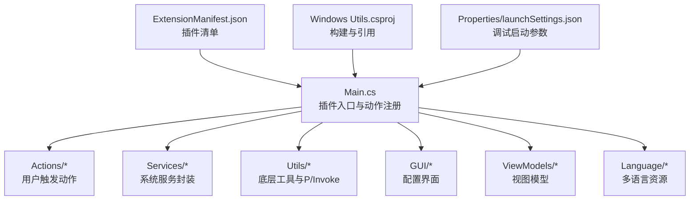
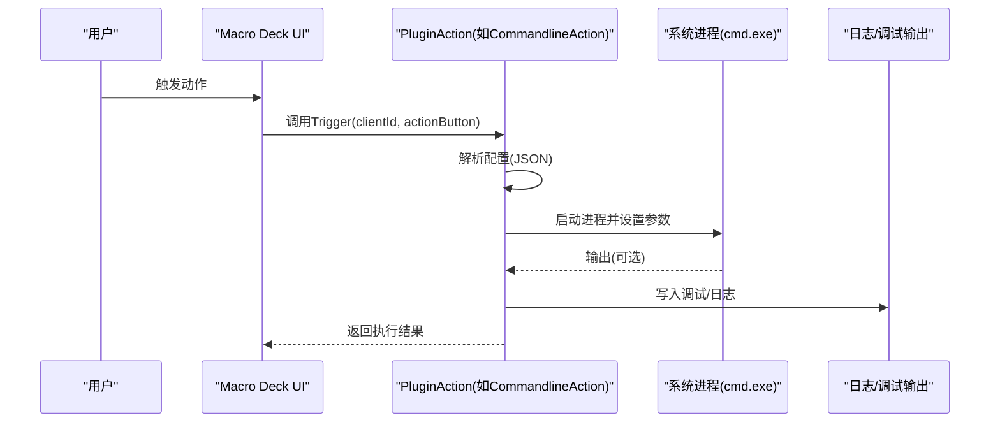
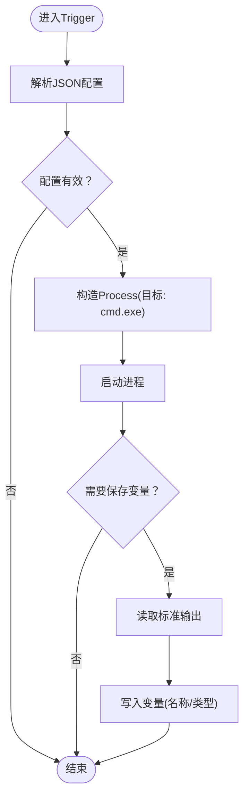
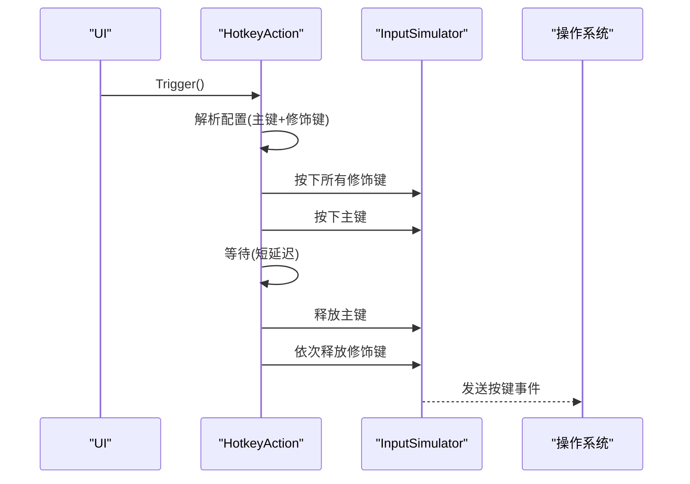
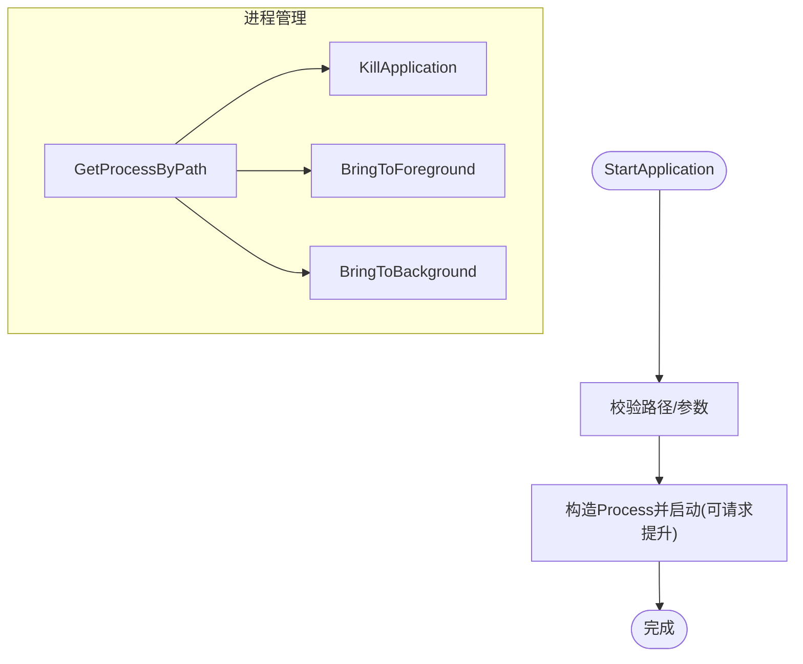
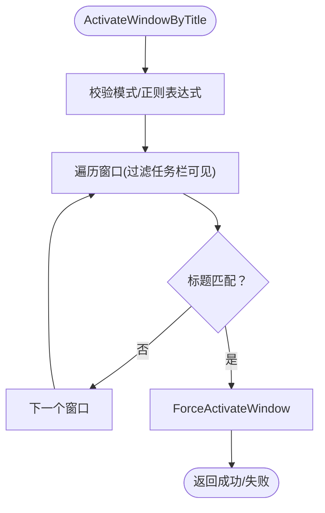
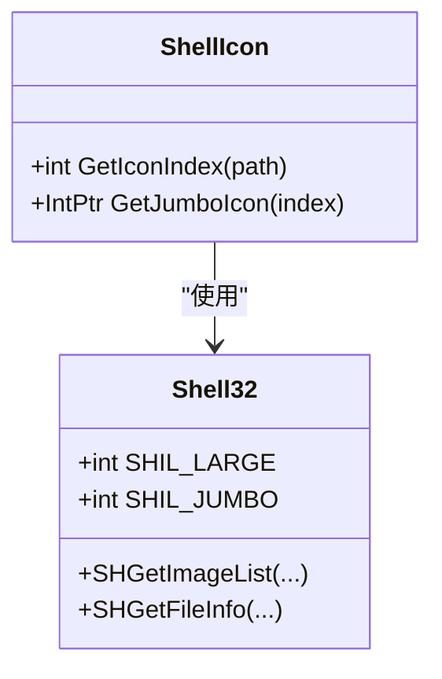
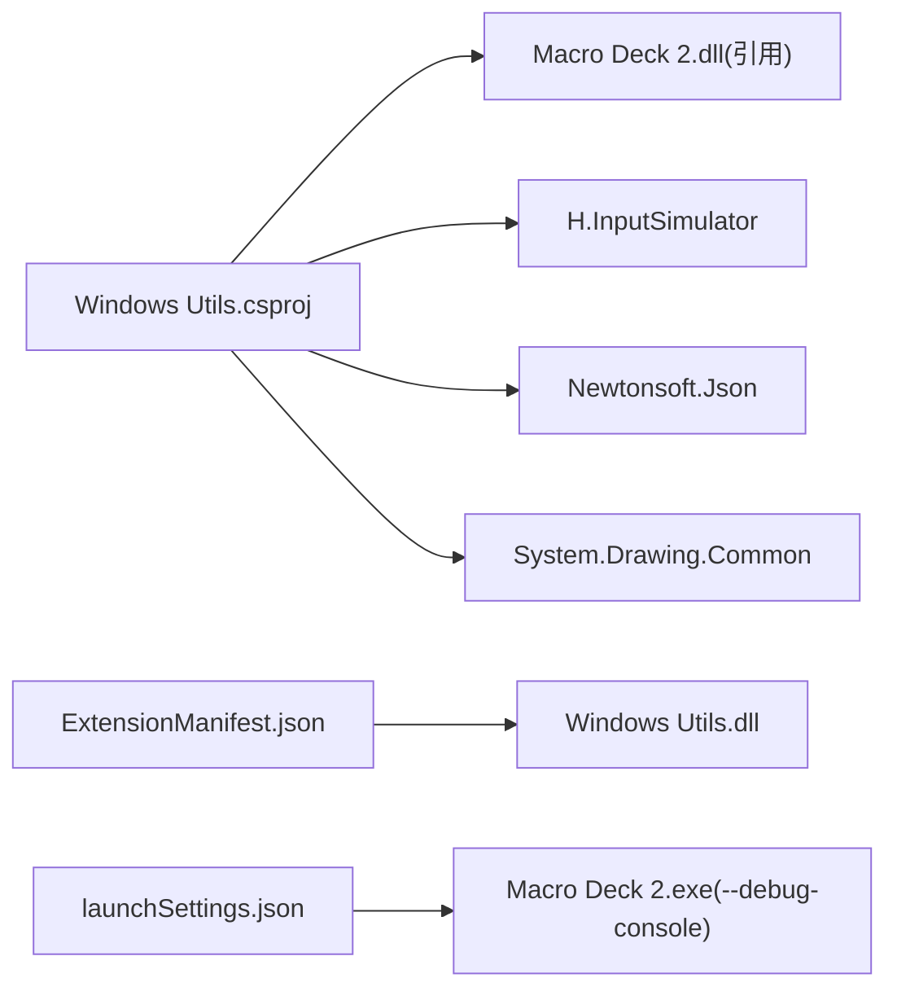

# 测试与调试

<cite>
**本文引用的文件**
- [Main.cs](file://Main.cs)
- [ExtensionManifest.json](file://ExtensionManifest.json)
- [Windows Utils.csproj](file://Windows Utils.csproj)
- [Properties/launchSettings.json](file://Properties/launchSettings.json)
- [Actions/CommandlineAction.cs](file://Actions/CommandlineAction.cs)
- [Actions/HotkeyAction.cs](file://Actions/HotkeyAction.cs)
- [Services/ApplicationLauncher.cs](file://Services/ApplicationLauncher.cs)
- [Utils/WindowActivator.cs](file://Utils/WindowActivator.cs)
- [Utils/ShellIcon.cs](file://Utils/ShellIcon.cs)
- [.github/workflows/build.yml](file://.github/workflows/build.yml)
</cite>

## 目录
1. 引言
2. 项目结构
3. 核心组件
4. 架构总览
5. 详细组件分析
6. 依赖关系分析
7. 性能考量
8. 故障排除指南
9. 结论
10. 附录

## 引言
本指南面向插件开发者，聚焦于 Macro Deck Windows Utils 插件在开发、测试与调试阶段的实践方法。内容覆盖单元测试、集成测试与端到端测试策略，调试宏命令与日志记录，错误追踪与常见问题（权限、兼容性、性能）的排查，以及测试环境搭建、自动化脚本与持续集成配置建议。为保证可操作性，文档以仓库中现有实现为依据，结合可扩展的最佳实践给出落地步骤。

## 项目结构
该插件采用“按功能域分层”的组织方式：主入口负责插件生命周期与动作注册；Actions 目录承载各类用户触发的动作；Services 提供系统级能力封装；Utils 提供底层系统调用与工具函数；GUI 与 ViewModels 负责配置界面与视图模型；语言资源与清单文件支撑国际化与插件元数据。

图表来源
- [Main.cs:14-59](file://Main.cs#L14-L59)
- [ExtensionManifest.json:1-11](file://ExtensionManifest.json#L1-L11)
- [Windows Utils.csproj:1-74](file://Windows Utils.csproj#L1-L74)
- [Properties/launchSettings.json:1-9](file://Properties/launchSettings.json#L1-L9)

章节来源
- [Main.cs:14-59](file://Main.cs#L14-L59)
- [ExtensionManifest.json:1-11](file://ExtensionManifest.json#L1-L11)
- [Windows Utils.csproj:1-74](file://Windows Utils.csproj#L1-L74)
- [Properties/launchSettings.json:1-9](file://Properties/launchSettings.json#L1-L9)

## 核心组件
- 插件入口 Main：负责初始化语言、注册动作列表、启动定时器等。
- 动作 Action：如命令行执行、热键发送、应用启动/切换窗口等，均通过 JSON 配置驱动。
- 服务 Service：如 ApplicationLauncher 封装进程管理与前台/后台切换。
- 工具 Utils：如 WindowActivator 使用 P/Invoke 枚举与激活窗口；ShellIcon 通过 Shell API 获取图标索引与大图标句柄。
- 日志与调试：使用 Macro Deck 日志接口与 .NET Debug 输出。

章节来源
- [Main.cs:14-59](file://Main.cs#L14-L59)
- [Actions/CommandlineAction.cs:14-65](file://Actions/CommandlineAction.cs#L14-L65)
- [Actions/HotkeyAction.cs:15-113](file://Actions/HotkeyAction.cs#L15-L113)
- [Services/ApplicationLauncher.cs:13-165](file://Services/ApplicationLauncher.cs#L13-L165)
- [Utils/WindowActivator.cs:9-256](file://Utils/WindowActivator.cs#L9-L256)
- [Utils/ShellIcon.cs:48-337](file://Utils/ShellIcon.cs#L48-L337)

## 架构总览
下图展示插件从触发到执行的关键路径，以及与外部系统的交互点（进程、输入模拟、窗口管理、日志）。

图表来源
- [Actions/CommandlineAction.cs:22-58](file://Actions/CommandlineAction.cs#L22-L58)
- [Main.cs:28-58](file://Main.cs#L28-L58)

## 详细组件分析

### 命令行动作（CommandlineAction）
职责：解析配置，启动 cmd.exe 执行命令，可选将输出写入变量。
关键点：
- 配置为 JSON 字符串，包含工作目录、命令、是否保存变量、变量名与类型等。
- 使用 Process 启动，支持隐藏窗口与重定向标准输出。
- 捕获异常并通过调试输出记录错误信息。

图表来源
- [Actions/CommandlineAction.cs:22-58](file://Actions/CommandlineAction.cs#L22-L58)

章节来源
- [Actions/CommandlineAction.cs:14-65](file://Actions/CommandlineAction.cs#L14-L65)

### 热键动作（HotkeyAction）
职责：根据配置组合修饰键与主键，通过输入模拟库发送热键序列。
关键点：
- 配置包含主键与多个修饰键布尔标志。
- 逐个按下修饰键，再按下主键，短暂延迟后释放，最后依次释放修饰键。
- 异常被吞掉，建议在开发阶段保留或增强日志。

图表来源
- [Actions/HotkeyAction.cs:29-111](file://Actions/HotkeyAction.cs#L29-L111)

章节来源
- [Actions/HotkeyAction.cs:15-113](file://Actions/HotkeyAction.cs#L15-L113)

### 应用启动器（ApplicationLauncher）
职责：启动/终止应用、前后台切换、进程查询。
关键点：
- 使用 P/Invoke 调用 user32 与 kernel32 接口。
- 支持以管理员权限运行。
- 对空路径与不存在进程进行告警，避免崩溃。
- 进程文件名解析通过快捷方式目标解析。

图表来源
- [Services/ApplicationLauncher.cs:45-165](file://Services/ApplicationLauncher.cs#L45-L165)

章节来源
- [Services/ApplicationLauncher.cs:13-165](file://Services/ApplicationLauncher.cs#L13-L165)

### 窗口激活器（WindowActivator）
职责：枚举窗口、匹配标题、强制置顶与激活。
关键点：
- 支持多种匹配模式（全等、前缀、后缀、包含、正则）。
- 使用 P/Invoke 枚举窗口并过滤任务栏可见性。
- 处理最小化状态恢复与线程输入附加/分离。

图表来源
- [Utils/WindowActivator.cs:57-211](file://Utils/WindowActivator.cs#L57-L211)

章节来源
- [Utils/WindowActivator.cs:9-256](file://Utils/WindowActivator.cs#L9-L256)

### Shell 图标工具（ShellIcon）
职责：通过 Shell API 获取系统图标索引与大图标句柄。
关键点：
- 定义 IImageList 接口与 SHFILEINFO 结构体。
- 提供获取系统大图标索引与 Jumbo 图标的辅助方法。

图表来源
- [Utils/ShellIcon.cs:20-46](file://Utils/ShellIcon.cs#L20-L46)
- [Utils/ShellIcon.cs:48-337](file://Utils/ShellIcon.cs#L48-L337)

章节来源
- [Utils/ShellIcon.cs:48-337](file://Utils/ShellIcon.cs#L48-L337)

## 依赖关系分析
- 构建与运行时依赖：
  - 目标框架与平台：.NET 10，Windows Forms，x64。
  - 第三方包：H.InputSimulator、Newtonsoft.Json、System.Drawing.Common。
  - 对 Macro Deck 2 的程序集引用，支持调试时自动复制 DLL 并重启宿主。
- 清单文件定义插件类型、版本、目标 API 版本与 DLL 名称。
- 启动配置提供调试控制台与日志级别参数。

图表来源
- [Windows Utils.csproj:35-47](file://Windows Utils.csproj#L35-L47)
- [ExtensionManifest.json:1-11](file://ExtensionManifest.json#L1-L11)
- [Properties/launchSettings.json:3-7](file://Properties/launchSettings.json#L3-L7)

章节来源
- [Windows Utils.csproj:1-74](file://Windows Utils.csproj#L1-L74)
- [ExtensionManifest.json:1-11](file://ExtensionManifest.json#L1-L11)
- [Properties/launchSettings.json:1-9](file://Properties/launchSettings.json#L1-L9)

## 性能考量
- 输入模拟与窗口枚举：
  - 热键动作中对修饰键与主键分别按下/释放，配合短暂延迟确保兼容性，但可能影响响应时间。可在稳定场景下调小延迟或合并按键事件。
  - 窗口激活器遍历所有顶层窗口并进行多项检查，复杂度与打开窗口数量相关。建议在高频调用场景下缓存最近匹配结果或限制搜索范围。
- 进程管理：
  - ApplicationLauncher 查询进程与读取模块路径涉及 P/Invoke，频繁调用应考虑去抖与缓存。
- I/O 与日志：
  - 命令行动作在保存变量时读取标准输出，建议避免在高频触发场景中启用变量保存，或限制输出大小。

## 故障排除指南
- 权限问题
  - 现象：无法启动管理员应用、无法切换前台窗口。
  - 排查：确认以管理员身份运行宿主；检查 UAC 设置；验证 ApplicationLauncher 的 Verb 参数。
  - 参考
    - [Services/ApplicationLauncher.cs:45-58](file://Services/ApplicationLauncher.cs#L45-L58)
- 系统兼容性
  - 现象：热键不生效、窗口激活失败。
  - 排查：确认目标应用是否支持快速按键序列；在 WindowActivator 中调整匹配模式与大小写敏感性；检查任务栏可见性过滤条件。
  - 参考
    - [Actions/HotkeyAction.cs:89-105](file://Actions/HotkeyAction.cs#L89-L105)
    - [Utils/WindowActivator.cs:124-140](file://Utils/WindowActivator.cs#L124-L140)
- 性能问题
  - 现象：动作触发卡顿、窗口切换迟滞。
  - 排查：减少高频窗口枚举次数；避免在触发链路中进行大量 I/O；优化日志输出频率。
  - 参考
    - [Utils/WindowActivator.cs:90-119](file://Utils/WindowActivator.cs#L90-L119)
- 调试与日志
  - 宏命令：使用宿主提供的调试控制台与日志级别参数，便于定位问题。
    - [Properties/launchSettings.json:3-7](file://Properties/launchSettings.json#L3-L7)
  - 错误追踪：在动作中捕获异常并输出到调试输出，便于快速发现配置错误或权限不足。
    - [Actions/CommandlineAction.cs:54-56](file://Actions/CommandlineAction.cs#L54-L56)
    - [Actions/HotkeyAction.cs:110](file://Actions/HotkeyAction.cs#L110)

章节来源
- [Services/ApplicationLauncher.cs:45-58](file://Services/ApplicationLauncher.cs#L45-L58)
- [Actions/HotkeyAction.cs:89-105](file://Actions/HotkeyAction.cs#L89-L105)
- [Utils/WindowActivator.cs:124-140](file://Utils/WindowActivator.cs#L124-L140)
- [Utils/WindowActivator.cs:90-119](file://Utils/WindowActivator.cs#L90-L119)
- [Properties/launchSettings.json:3-7](file://Properties/launchSettings.json#L3-L7)
- [Actions/CommandlineAction.cs:54-56](file://Actions/CommandlineAction.cs#L54-L56)
- [Actions/HotkeyAction.cs:110](file://Actions/HotkeyAction.cs#L110)

## 结论
本指南基于仓库现有实现总结了测试与调试的关键路径：以动作为中心的触发链路、服务层的系统交互、工具层的底层调用与日志调试。建议在开发周期中优先完善单元测试（配置解析、异常分支）、集成测试（进程/窗口/P/Invoke 场景）与端到端测试（真实宿主环境），并结合调试宏命令与日志输出建立闭环问题定位流程。

## 附录

### 测试策略与实施要点
- 单元测试
  - 配置解析：针对命令行动作的 JSON 配置解析与默认值处理。
  - 热键组合：验证修饰键映射与按键序列顺序。
  - 匹配逻辑：针对 WindowActivator 的多种匹配模式与边界条件。
- 集成测试
  - 进程生命周期：启动/终止应用、前台/后台切换。
  - 窗口枚举：在多窗口环境下验证匹配与激活行为。
  - P/Invoke 行为：在受控环境中验证句柄有效性与权限。
- 端到端测试
  - 在宿主中安装插件并执行动作，观察日志与 UI 反馈。
  - 使用不同系统版本与 UAC 级别验证兼容性。

### 调试宏命令与日志
- 宿主调试参数
  - 参考：[Properties/launchSettings.json:3-7](file://Properties/launchSettings.json#L3-L7)
- 日志记录
  - 使用 Macro Deck 日志接口输出警告/跟踪信息。
    - 参考：[Services/ApplicationLauncher.cs:64-79](file://Services/ApplicationLauncher.cs#L64-L79)
  - 使用调试输出记录异常消息。
    - 参考：[Actions/CommandlineAction.cs:54-56](file://Actions/CommandlineAction.cs#L54-L56)

### 自动化测试与持续集成
- 构建与部署
  - 项目配置包含 PostBuild 事件，非 CI 环境下自动复制 DLL 并重启宿主。
    - 参考：[Windows Utils.csproj:69-71](file://Windows Utils.csproj#L69-L71)
- 持续集成
  - 建议在 CI 中添加构建矩阵（Debug/Release、x64/AnyCPU），并在构建后运行最小化端到端测试套件。
  - 参考：[ExtensionManifest.json:1-11](file://ExtensionManifest.json#L1-L11)
  - 参考：[Windows Utils.csproj:19-25](file://Windows Utils.csproj#L19-L25)

### 实际调试案例
- 案例一：热键动作无效
  - 步骤：确认配置中主键与修饰键布尔位；在宿主中开启调试控制台；观察触发后是否有异常输出。
  - 参考：[Actions/HotkeyAction.cs:29-111](file://Actions/HotkeyAction.cs#L29-L111)，[Properties/launchSettings.json:3-7](file://Properties/launchSettings.json#L3-L7)
- 案例二：命令行动作未保存变量
  - 步骤：检查配置中“保存变量”开关与变量名/类型；确认输出是否为空；查看调试输出。
  - 参考：[Actions/CommandlineAction.cs:22-58](file://Actions/CommandlineAction.cs#L22-L58)