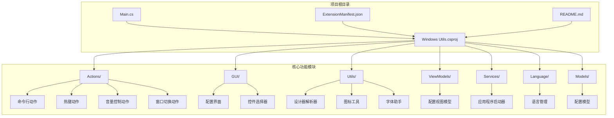
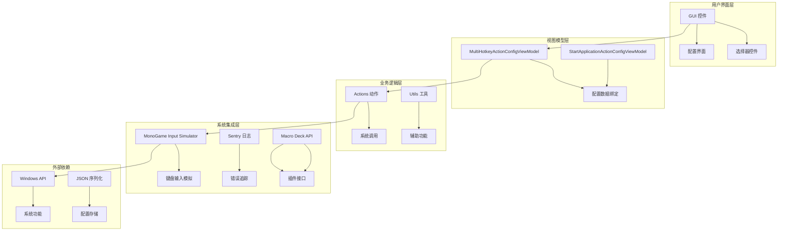
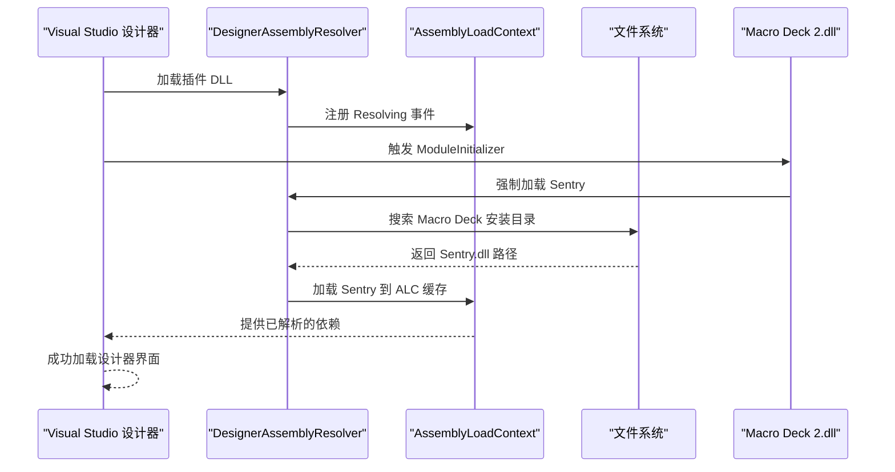
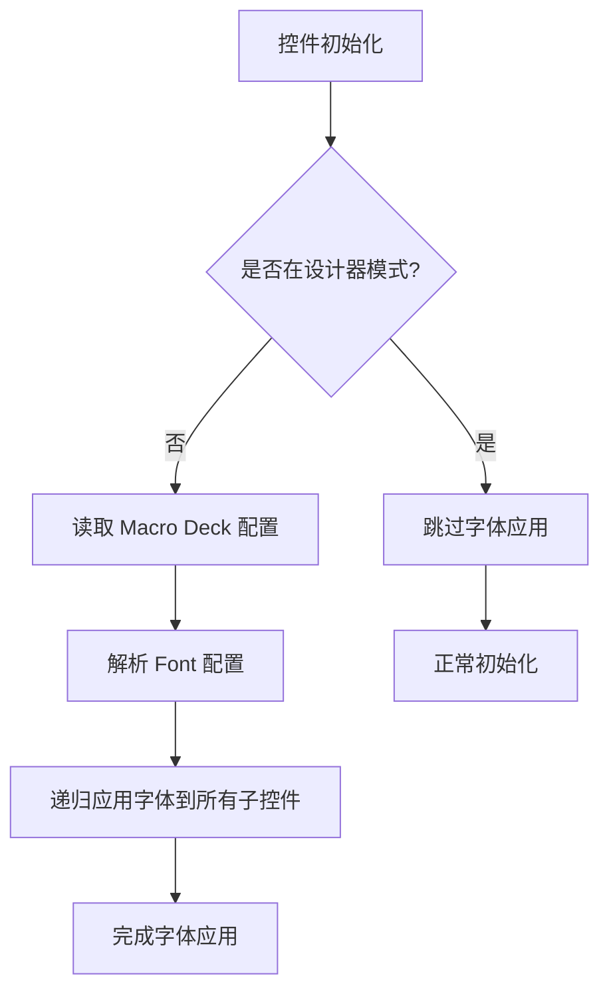
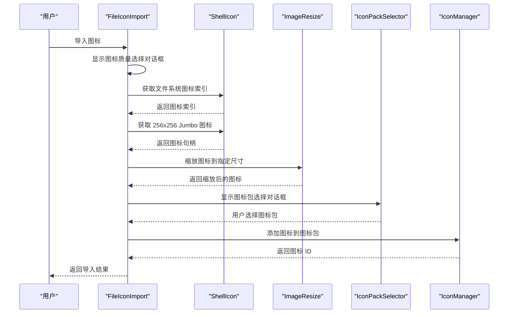
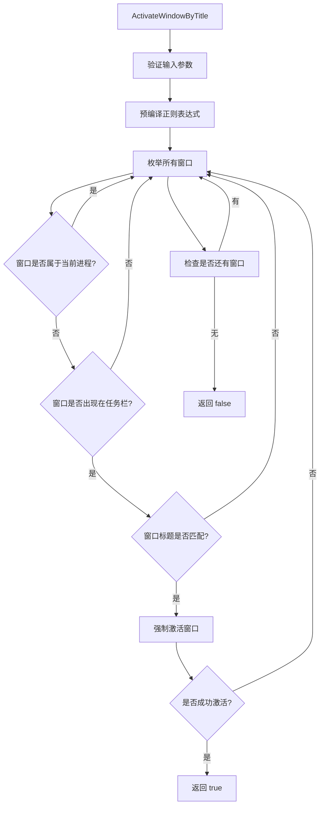
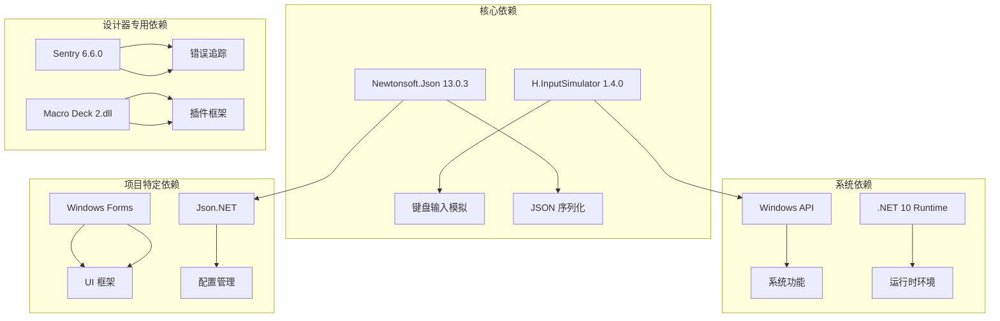

# 设计器环境修复

<cite>
**本文档引用的文件**
- [Main.cs](file://Main.cs)
- [Windows Utils.csproj](file://Windows Utils.csproj)
- [ExtensionManifest.json](file://ExtensionManifest.json)
- [README.md](file://README.md)
- [Utils/DesignerAssemblyResolver.cs](file://Utils/DesignerAssemblyResolver.cs)
- [Utils/FileIconImport.cs](file://Utils/FileIconImport.cs)
- [Utils/FontHelper.cs](file://Utils/FontHelper.cs)
- [Utils/ImageResize.cs](file://Utils/ImageResize.cs)
- [Utils/ShellIcon.cs](file://Utils/ShellIcon.cs)
- [Utils/WindowActivator.cs](file://Utils/WindowActivator.cs)
- [GUI/CommandSelector.cs](file://GUI/CommandSelector.cs)
- [GUI/HotkeyConfigurator.cs](file://GUI/HotkeyConfigurator.cs)
- [GUI/NotificationConfigurator.cs](file://GUI/NotificationConfigurator.cs)
- [ViewModels/MultiHotkeyActionConfigViewModel.cs](file://ViewModels/MultiHotkeyActionConfigViewModel.cs)
- [ViewModels/StartApplicationActionConfigViewModel.cs](file://ViewModels/StartApplicationActionConfigViewModel.cs)
</cite>

## 目录
1. [简介](#简介)
2. [项目结构](#项目结构)
3. [核心组件](#核心组件)
4. [架构概览](#架构概览)
5. [详细组件分析](#详细组件分析)
6. [依赖关系分析](#依赖关系分析)
7. [性能考虑](#性能考虑)
8. [故障排除指南](#故障排除指南)
9. [结论](#结论)

## 简介

Windows Utils 插件是一个为 Macro Deck 2 开发的实用工具插件，专门用于控制 Windows 系统的各种功能。该项目的核心目标是解决设计器环境中的依赖问题，确保在 Visual Studio 设计器中能够正确加载和显示插件的 GUI 组件。

该插件提供了多种 Windows 控制功能，包括命令行执行、应用程序启动、文件和文件夹操作、音量控制、Explorer 控制、热键发送、通知显示、麦克风静音、电源选项和窗口切换等。

## 项目结构

项目采用标准的 .NET 10 项目结构，主要分为以下几个核心部分：

**图表来源**
- [Windows Utils.csproj:1-129](file://Windows Utils.csproj#L1-L129)
- [Main.cs:24-85](file://Main.cs#L24-L85)

**章节来源**
- [Windows Utils.csproj:1-129](file://Windows Utils.csproj#L1-L129)
- [Main.cs:24-85](file://Main.cs#L24-L85)

## 核心组件

### 主插件类 (Main)

主插件类是整个插件的入口点，负责初始化和协调所有功能组件。它继承自 MacroDeckPlugin，并实现了以下关键功能：

- **插件初始化**：设置静态单例引用，供全局访问
- **动作注册**：注册所有可用的 Windows 控制动作
- **全局定时器管理**：维护每 2 秒触发一次的节拍定时器

### 设计器环境修复组件

项目中最关键的特性是针对设计器环境的修复，主要包括：

- **DesignerAssemblyResolver**：解决 Sentry 依赖在设计器中的加载问题
- **FontHelper**：确保设计器中字体的一致性
- **特殊项目配置**：处理 Macro Deck 2.dll 的引用和依赖

**章节来源**
- [Main.cs:24-85](file://Main.cs#L24-L85)
- [Utils/DesignerAssemblyResolver.cs:1-78](file://Utils/DesignerAssemblyResolver.cs#L1-L78)
- [Utils/FontHelper.cs:1-38](file://Utils/FontHelper.cs#L1-L38)

## 架构概览

插件采用分层架构设计，清晰分离了用户界面、业务逻辑和系统集成层：

**图表来源**
- [Main.cs:53-72](file://Main.cs#L53-L72)
- [Windows Utils.csproj:43-78](file://Windows Utils.csproj#L43-L78)

## 详细组件分析

### 设计器依赖解析器 (DesignerAssemblyResolver)

这是解决设计器环境问题的核心组件，专门处理 Sentry 依赖在设计器中的加载问题：

**图表来源**
- [Utils/DesignerAssemblyResolver.cs:38-59](file://Utils/DesignerAssemblyResolver.cs#L38-L59)

该组件通过以下机制解决设计器问题：

1. **元数据依赖注入**：使用 typeof(SentryOptions) 在编译时将 Sentry 添加到插件的 AssemblyRef 表中
2. **模块初始化**：在 ModuleInitializer 中注册 AssemblyLoadContext.Resolving 事件
3. **强制加载**：预先加载 Sentry 到 AssemblyLoadContext 缓存中
4. **路径探测**：扫描 Macro Deck 安装目录查找依赖文件

**章节来源**
- [Utils/DesignerAssemblyResolver.cs:1-78](file://Utils/DesignerAssemblyResolver.cs#L1-L78)

### 字体助手 (FontHelper)

字体助手确保设计器和运行时环境中字体的一致性：

**图表来源**
- [Utils/FontHelper.cs:16-36](file://Utils/FontHelper.cs#L16-L36)

**章节来源**
- [Utils/FontHelper.cs:1-38](file://Utils/FontHelper.cs#L1-L38)

### 图标导入工具 (FileIconImport)

提供从应用程序文件提取图标并导入到 Macro Deck 图标包的功能：

**图表来源**
- [Utils/FileIconImport.cs:21-75](file://Utils/FileIconImport.cs#L21-L75)

**章节来源**
- [Utils/FileIconImport.cs:1-78](file://Utils/FileIconImport.cs#L1-L78)

### 窗口激活工具 (WindowActivator)

提供通过标题模式匹配或进程 ID 查找并将窗口带到前台的功能：

**图表来源**
- [Utils/WindowActivator.cs:61-126](file://Utils/WindowActivator.cs#L61-L126)

**章节来源**
- [Utils/WindowActivator.cs:1-313](file://Utils/WindowActivator.cs#L1-L313)

### GUI 配置界面

项目包含多个专门的 GUI 配置界面，每个都继承自 ActionConfigControl：

#### 命令选择器 (CommandSelector)

负责配置命令行执行动作的界面组件，支持拖放操作和变量保存功能。

#### 热键配置器 (HotkeyConfigurator)

提供热键组合选择界面，支持所有标准修饰键和主键的选择。

#### 通知配置器 (NotificationConfigurator)

简单的通知内容输入界面，支持标题和消息的配置。

**章节来源**
- [GUI/CommandSelector.cs:1-189](file://GUI/CommandSelector.cs#L1-L189)
- [GUI/HotkeyConfigurator.cs:1-103](file://GUI/HotkeyConfigurator.cs#L1-L103)
- [GUI/NotificationConfigurator.cs:1-73](file://GUI/NotificationConfigurator.cs#L1-L73)

### 视图模型 (ViewModels)

提供 MVVM 模式的配置界面数据绑定：

#### 多键序列配置视图模型

管理多键序列动作的配置数据，支持动作列表和按键状态同步。

#### 应用程序启动配置视图模型

处理应用程序启动动作的配置，包括路径、参数、权限和启动方法。

**章节来源**
- [ViewModels/MultiHotkeyActionConfigViewModel.cs:1-73](file://ViewModels/MultiHotkeyActionConfigViewModel.cs#L1-L73)
- [ViewModels/StartApplicationActionConfigViewModel.cs:1-93](file://ViewModels/StartApplicationActionConfigViewModel.cs#L1-L93)

## 依赖关系分析

项目使用 NuGet 包管理器管理第三方依赖，主要依赖包括：

**图表来源**
- [Windows Utils.csproj:43-78](file://Windows Utils.csproj#L43-L78)

项目采用特殊的设计器依赖处理策略：

1. **Sentry 依赖**：通过 PackageReference + Reference 的组合方式处理
2. **Macro Deck 依赖**：使用条件化的 HintPath 支持不同安装路径
3. **设计器兼容性**：通过 DesignerAssemblyResolver 解决 AssemblyLoadContext 问题

**章节来源**
- [Windows Utils.csproj:43-78](file://Windows Utils.csproj#L43-L78)

## 性能考虑

### 定时器优化

插件使用全局节拍定时器每 2 秒触发一次，用于驱动需要定期检查的动作：

- **定时器间隔**：2000ms，平衡性能和响应性
- **用途**：主要用于按键状态同步等功能
- **资源管理**：确保定时器正确启动和清理

### 图标处理优化

图标导入过程包含多步骤优化：

- **Jumbo 图标获取**：直接从 256x256 图标列表获取，避免多次缩放
- **内存管理**：及时释放图标句柄和位图资源
- **用户交互**：提供进度反馈和错误处理

### 窗口激活优化

窗口激活算法包含多项优化：

- **过滤机制**：排除工具窗口和非任务栏窗口
- **正则表达式预编译**：提高正则匹配性能
- **线程输入附加**：使用 AttachThreadInput 绕过前台窗口限制

## 故障排除指南

### 设计器加载问题

**问题症状**：Visual Studio 设计器无法加载插件控件

**解决方案**：
1. 确认 Macro Deck 2.dll 已正确引用
2. 检查 DesignerAssemblyResolver 是否正常工作
3. 验证 Sentry 依赖是否正确加载

**章节来源**
- [Utils/DesignerAssemblyResolver.cs:42-59](file://Utils/DesignerAssemblyResolver.cs#L42-L59)

### 字体显示问题

**问题症状**：设计器中字体显示异常或不一致

**解决方案**：
1. 检查 Macro Deck 配置文件是否存在
2. 验证 FontHelper.ApplyMacroDeckFont 方法是否被正确调用
3. 确保配置文件格式正确

**章节来源**
- [Utils/FontHelper.cs:18-29](file://Utils/FontHelper.cs#L18-L29)

### 图标导入失败

**问题症状**：图标导入对话框无法正常工作

**解决方案**：
1. 检查文件路径是否有效
2. 验证 ShellIcon.GetJumboIcon 方法是否正确获取图标
3. 确认图标包选择器是否正常工作

**章节来源**
- [Utils/FileIconImport.cs:24-75](file://Utils/FileIconImport.cs#L24-L75)

### 窗口激活失败

**问题症状**：无法通过标题或进程 ID 激活目标窗口

**解决方案**：
1. 验证窗口标题匹配模式是否正确
2. 检查窗口是否出现在任务栏
3. 确认进程 ID 是否有效

**章节来源**
- [Utils/WindowActivator.cs:94-126](file://Utils/WindowActivator.cs#L94-L126)

## 结论

Windows Utils 插件通过精心设计的架构和专门的设计器环境修复机制，成功解决了在 Visual Studio 设计器中加载和使用插件组件的问题。项目的主要成就包括：

1. **完整的设计器支持**：通过 DesignerAssemblyResolver 解决了复杂的依赖加载问题
2. **丰富的功能集**：提供了全面的 Windows 系统控制功能
3. **良好的用户体验**：直观的 GUI 界面和灵活的配置选项
4. **可靠的架构设计**：清晰的分层结构和适当的错误处理

该插件为 Macro Deck 2 提供了强大的 Windows 系统集成能力，同时确保了开发者的良好体验。其设计模式和解决方案可以作为其他插件开发的参考模板。