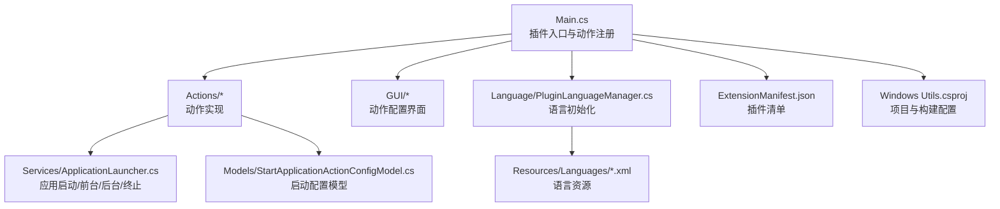
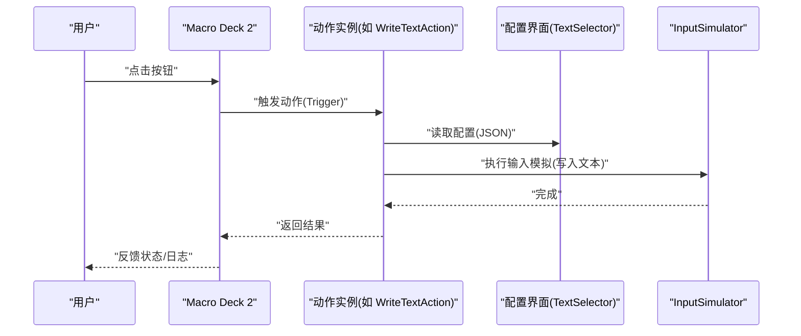
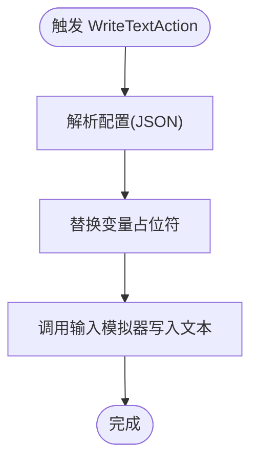
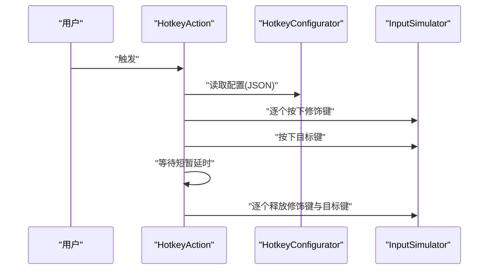
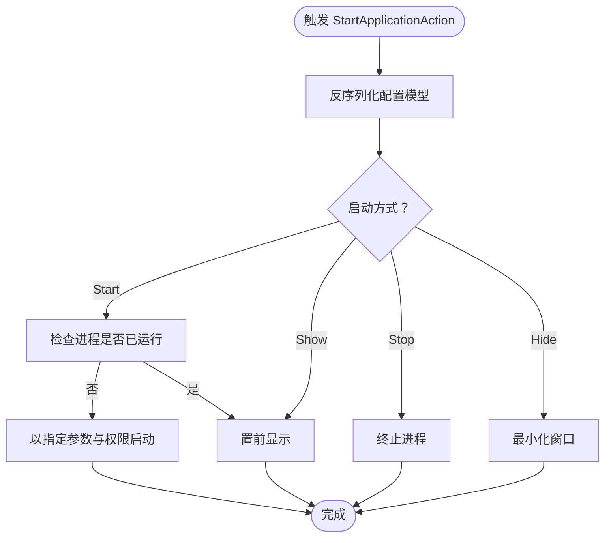
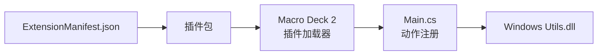

# 快速开始

<cite>
**本文引用的文件**
- [README.md](file://README.md)
- [ExtensionManifest.json](file://ExtensionManifest.json)
- [Main.cs](file://Main.cs)
- [autorun.bat](file://autorun.bat)
- [Windows Utils.csproj](file://Windows Utils.csproj)
- [WriteTextAction.cs](file://Actions/WriteTextAction.cs)
- [HotkeyAction.cs](file://Actions/HotkeyAction.cs)
- [StartApplicationAction.cs](file://Actions/StartApplicationAction.cs)
- [OpenFileAction.cs](file://Actions/OpenFileAction.cs)
- [PowerOptionAction.cs](file://Actions/PowerOptionAction.cs)
- [TextSelector.cs](file://GUI/TextSelector.cs)
- [HotkeyConfigurator.cs](file://GUI/HotkeyConfigurator.cs)
- [PowerOptionSelector.cs](file://GUI/PowerOptionSelector.cs)
- [ApplicationLauncher.cs](file://Services/ApplicationLauncher.cs)
- [StartApplicationActionConfigModel.cs](file://Models/StartApplicationActionConfigModel.cs)
- [PluginLanguageManager.cs](file://Language/PluginLanguageManager.cs)
- [English.xml](file://Resources/Languages/English.xml)
</cite>

## 目录
1. [简介](#简介)
2. [项目结构](#项目结构)
3. [核心组件](#核心组件)
4. [架构总览](#架构总览)
5. [详细组件解析](#详细组件解析)
6. [依赖关系分析](#依赖关系分析)
7. [性能与稳定性建议](#性能与稳定性建议)
8. [故障排查指南](#故障排查指南)
9. [结语](#结语)
10. [附录：从零开始的实操步骤](#附录从零开始的实操步骤)

## 简介
本指南面向首次接触 Macro Deck 2 的用户，帮助你在最短时间内完成“Windows Utils”插件的安装、配置与首个动作的创建。你将学会：
- 在 Macro Deck 中安装与启用该插件
- 添加插件动作到按钮并进行基础配置
- 创建并测试文本输入、热键模拟、应用启动、打开文件、电源操作等常用功能
- 使用变量与状态同步提升交互体验

该插件为 Macro Deck 的扩展插件，不作为独立应用运行，需配合 Macro Deck 2 使用。

章节来源
- [README.md:1-40](file://README.md#L1-L40)

## 项目结构
该仓库采用按功能域分层的组织方式：
- Actions：定义各类可触发的动作（如写入文本、发送热键、启动应用等）
- GUI：为每个动作提供可视化配置控件（如文本选择器、热键配置器、电源选项选择器）
- Services：封装系统级调用（如应用启动、窗口切换、图标提取等）
- Models：序列化配置模型（如启动应用的路径、参数、运行方式等）
- Language：本地化字符串管理与加载
- Resources/Languages：多语言资源文件（如英语 XML）

图表来源
- [Main.cs:28-58](file://Main.cs#L28-L58)
- [ExtensionManifest.json:1-11](file://ExtensionManifest.json#L1-L11)
- [Windows Utils.csproj:1-74](file://Windows Utils.csproj#L1-L74)

章节来源
- [Main.cs:14-58](file://Main.cs#L14-L58)
- [ExtensionManifest.json:1-11](file://ExtensionManifest.json#L1-L11)
- [Windows Utils.csproj:1-74](file://Windows Utils.csproj#L1-L74)

## 核心组件
- 插件入口与动作注册：在启用时初始化语言并注册所有可用动作列表
- 动作实现：覆盖名称、描述、是否可配置、触发逻辑与配置控件
- 配置界面：基于 ActionConfigControl 的自定义控件，负责保存/加载配置
- 应用启动服务：封装进程查找、前台显示、最小化、管理员权限等
- 配置模型：统一序列化/反序列化启动相关参数

章节来源
- [Main.cs:28-58](file://Main.cs#L28-L58)
- [StartApplicationAction.cs:14-84](file://Actions/StartApplicationAction.cs#L14-L84)
- [ApplicationLauncher.cs:13-165](file://Services/ApplicationLauncher.cs#L13-L165)
- [StartApplicationActionConfigModel.cs:6-36](file://Models/StartApplicationActionConfigModel.cs#L6-L36)

## 架构总览
下图展示了插件在 Macro Deck 中的典型交互流程：用户在界面上配置动作，点击按钮后由动作触发器执行相应逻辑。

图表来源
- [WriteTextAction.cs:22-45](file://Actions/WriteTextAction.cs#L22-L45)
- [TextSelector.cs:25-41](file://GUI/TextSelector.cs#L25-L41)

章节来源
- [WriteTextAction.cs:14-52](file://Actions/WriteTextAction.cs#L14-L52)
- [TextSelector.cs:11-77](file://GUI/TextSelector.cs#L11-L77)

## 详细组件解析

### 文本输入动作（WriteTextAction）
- 功能：向当前活动窗口写入指定文本，支持变量替换
- 触发流程：解析 JSON 配置 -> 替换变量占位符 -> 调用输入模拟器写入
- 配置界面：TextSelector 提供文本输入与变量插入功能

图表来源
- [WriteTextAction.cs:22-45](file://Actions/WriteTextAction.cs#L22-L45)
- [TextSelector.cs:25-41](file://GUI/TextSelector.cs#L25-L41)

章节来源
- [WriteTextAction.cs:14-52](file://Actions/WriteTextAction.cs#L14-L52)
- [TextSelector.cs:11-77](file://GUI/TextSelector.cs#L11-L77)

### 热键动作（HotkeyAction）
- 功能：组合 Win/Ctrl/Shift/Alt 与任意键发送热键
- 触发流程：解析配置 -> 按顺序按下修饰键 -> 按下目标键 -> 延时 -> 释放
- 配置界面：HotkeyConfigurator 提供修饰键勾选与目标键选择

图表来源
- [HotkeyAction.cs:29-112](file://Actions/HotkeyAction.cs#L29-L112)
- [HotkeyConfigurator.cs:24-53](file://GUI/HotkeyConfigurator.cs#L24-L53)

章节来源
- [HotkeyAction.cs:15-113](file://Actions/HotkeyAction.cs#L15-L113)
- [HotkeyConfigurator.cs:12-96](file://GUI/HotkeyConfigurator.cs#L12-L96)

### 启动应用动作（StartApplicationAction）
- 功能：启动、停止、显示或隐藏指定应用；支持管理员权限与按钮状态同步
- 触发流程：根据配置模型选择启动/停止/显示/隐藏 -> 调用 ApplicationLauncher 执行
- 配置模型：包含路径、参数、管理员权限、同步按钮状态、启动方式枚举

图表来源
- [StartApplicationAction.cs:22-50](file://Actions/StartApplicationAction.cs#L22-L50)
- [ApplicationLauncher.cs:39-126](file://Services/ApplicationLauncher.cs#L39-L126)
- [StartApplicationActionConfigModel.cs:19-36](file://Models/StartApplicationActionConfigModel.cs#L19-L36)

章节来源
- [StartApplicationAction.cs:14-84](file://Actions/StartApplicationAction.cs#L14-L84)
- [ApplicationLauncher.cs:13-165](file://Services/ApplicationLauncher.cs#L13-L165)
- [StartApplicationActionConfigModel.cs:6-36](file://Models/StartApplicationActionConfigModel.cs#L6-L36)

### 打开文件动作（OpenFileAction）
- 功能：使用系统默认程序打开文件
- 触发流程：解析配置 -> 使用 Shell 执行打开

章节来源
- [OpenFileAction.cs:12-47](file://Actions/OpenFileAction.cs#L12-L47)

### 电源操作动作（PowerOptionAction）
- 功能：睡眠、休眠、关机、重启
- 触发流程：解析配置 -> 根据选项调用系统命令或 API

章节来源
- [PowerOptionAction.cs:14-62](file://Actions/PowerOptionAction.cs#L14-L62)
- [PowerOptionSelector.cs:9-75](file://GUI/PowerOptionSelector.cs#L9-L75)

## 依赖关系分析
- 插件清单：通过 ExtensionManifest.json 声明类型、名称、版本、目标插件 API 版本与 DLL 名称
- 项目配置：引用 Macro Deck 2 外部程序集，嵌入语言资源，构建后自动复制 DLL 到插件目录
- 动作注册：Main.cs 在启用时注册全部动作，保证在 Macro Deck 中可见

图表来源
- [ExtensionManifest.json:1-11](file://ExtensionManifest.json#L1-L11)
- [Main.cs:28-58](file://Main.cs#L28-L58)
- [Windows Utils.csproj:42-47](file://Windows Utils.csproj#L42-L47)

章节来源
- [ExtensionManifest.json:1-11](file://ExtensionManifest.json#L1-L11)
- [Windows Utils.csproj:1-74](file://Windows Utils.csproj#L1-L74)
- [Main.cs:28-58](file://Main.cs#L28-L58)

## 性能与稳定性建议
- 输入延迟：热键动作在按下与释放之间有短暂延时，以提高兼容性
- 进程同步：启动应用动作可启用按钮状态同步，避免重复启动
- 管理员权限：仅在必要时启用“以管理员身份运行”，注意安全风险
- 变量替换：文本输入动作支持变量占位符，建议在长文本中谨慎使用，避免过多替换导致性能下降

章节来源
- [HotkeyAction.cs:89-105](file://Actions/HotkeyAction.cs#L89-L105)
- [StartApplicationAction.cs:57-83](file://Actions/StartApplicationAction.cs#L57-L83)

## 故障排查指南
- 插件未出现在 Macro Deck 中
  - 确认 ExtensionManifest.json 的 packageId、version、dll 正确
  - 确认 Windows Utils.dll 已复制到 Macro Deck 插件目录
- 启动应用失败
  - 检查路径与参数是否正确，确认“以管理员身份运行”是否必要
  - 使用“停止/隐藏/显示”动作辅助定位问题
- 热键无效
  - 检查修饰键与目标键组合是否被其他应用拦截
  - 尝试调整延时策略（代码内已内置延时）
- 文本未写入
  - 确认目标窗口处于活动状态
  - 检查变量名是否匹配，占位符格式是否正确

章节来源
- [ExtensionManifest.json:1-11](file://ExtensionManifest.json#L1-L11)
- [ApplicationLauncher.cs:45-126](file://Services/ApplicationLauncher.cs#L45-L126)
- [HotkeyAction.cs:89-105](file://Actions/HotkeyAction.cs#L89-L105)
- [WriteTextAction.cs:22-45](file://Actions/WriteTextAction.cs#L22-L45)

## 结语
通过本指南，你已经完成了插件的安装、动作配置与基础测试。建议进一步探索变量系统、状态同步与更多动作组合，以满足复杂自动化场景。

## 附录：从零开始的实操步骤

### 安装与启用插件
- 准备 Macro Deck 2
  - 确保已安装 Macro Deck 2 并可正常运行
- 获取插件包
  - 方法一：下载发布版压缩包，解压至 Macro Deck 插件目录对应包名文件夹
  - 方法二：克隆源码后使用项目提供的构建脚本或手动编译生成 DLL
- 验证清单
  - 确认 ExtensionManifest.json 存在且字段完整
- 启动 Macro Deck
  - 打开 Macro Deck 2，进入“插件”页面，启用“Windows Utils”

章节来源
- [ExtensionManifest.json:1-11](file://ExtensionManifest.json#L1-L11)
- [Windows Utils.csproj:69-71](file://Windows Utils.csproj#L69-L71)

### 创建你的第一个动作：文本输入
- 在 Macro Deck 中新建或编辑一个按钮
- 选择动作类型：文本输入
- 在配置界面中输入要写入的文本，或插入变量占位符
- 点击按钮，观察目标窗口是否成功写入文本

章节来源
- [WriteTextAction.cs:14-52](file://Actions/WriteTextAction.cs#L14-L52)
- [TextSelector.cs:11-77](file://GUI/TextSelector.cs#L11-L77)

### 创建第二个动作：热键模拟
- 新建按钮，选择动作类型：热键
- 在配置界面勾选需要的修饰键（如 Ctrl、Alt、Win），并选择目标键
- 点击按钮，验证目标应用是否响应该组合键

章节来源
- [HotkeyAction.cs:15-113](file://Actions/HotkeyAction.cs#L15-L113)
- [HotkeyConfigurator.cs:12-96](file://GUI/HotkeyConfigurator.cs#L12-L96)

### 创建第三个动作：启动应用
- 新建按钮，选择动作类型：启动应用
- 配置项包括：应用路径、启动参数、管理员权限、启动方式（启动/停止/显示/隐藏）、是否同步按钮状态
- 点击按钮，观察应用是否按预期启动或切换

章节来源
- [StartApplicationAction.cs:14-84](file://Actions/StartApplicationAction.cs#L14-L84)
- [StartApplicationActionConfigModel.cs:6-36](file://Models/StartApplicationActionConfigModel.cs#L6-L36)
- [ApplicationLauncher.cs:39-126](file://Services/ApplicationLauncher.cs#L39-L126)

### 创建第四个动作：打开文件
- 新建按钮，选择动作类型：打开文件
- 选择本地文件路径，点击按钮验证系统默认程序是否打开该文件

章节来源
- [OpenFileAction.cs:12-47](file://Actions/OpenFileAction.cs#L12-L47)

### 创建第五个动作：电源操作
- 新建按钮，选择动作类型：电源操作
- 选择操作（睡眠/休眠/关机/重启），点击按钮进行测试（请确保已保存工作）

章节来源
- [PowerOptionAction.cs:14-62](file://Actions/PowerOptionAction.cs#L14-L62)
- [PowerOptionSelector.cs:9-75](file://GUI/PowerOptionSelector.cs#L9-L75)

### 语言与本地化
- 插件会根据 Macro Deck 当前语言加载对应 XML 资源
- 如需新增语言，请参考语言资源目录下的 XML 文件格式

章节来源
- [PluginLanguageManager.cs:8-51](file://Language/PluginLanguageManager.cs#L8-L51)
- [English.xml:1-62](file://Resources/Languages/English.xml#L1-L62)