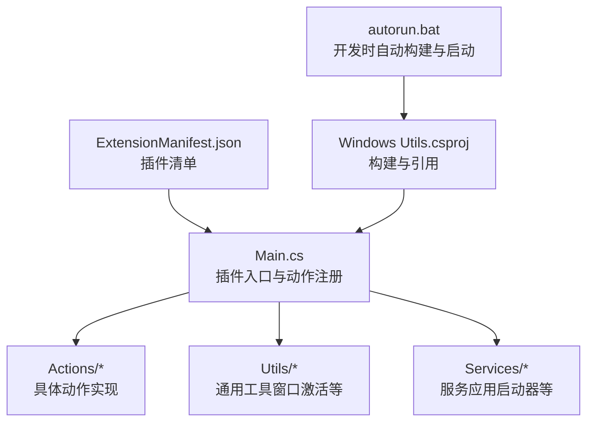
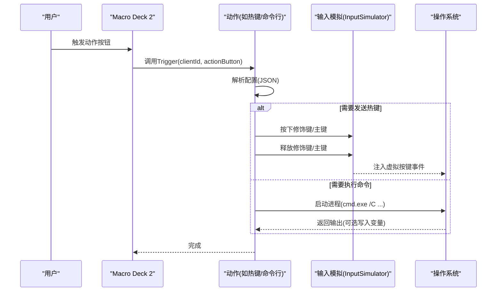
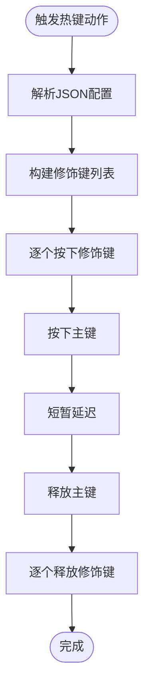
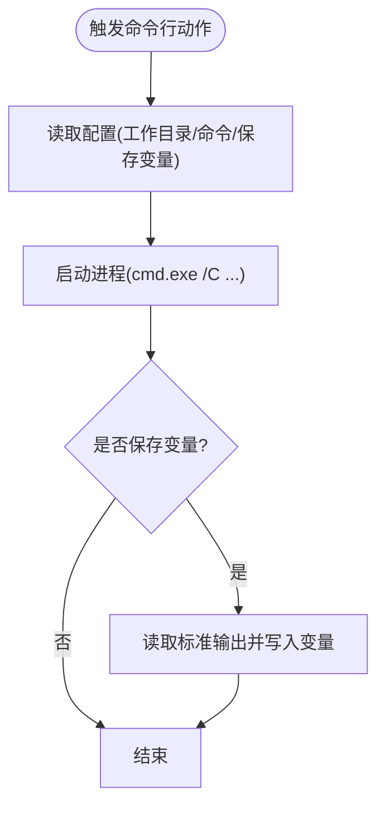
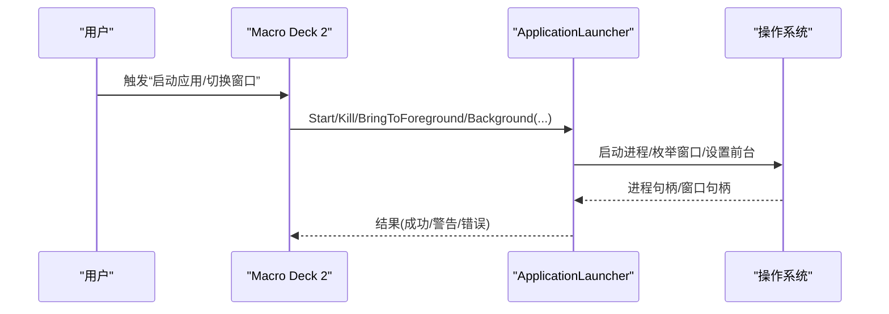
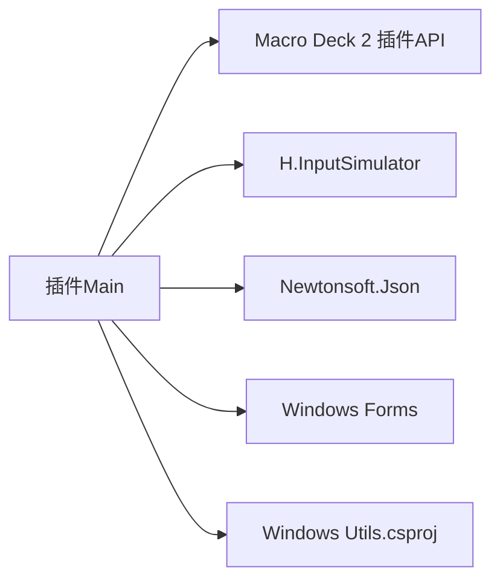

# 故障排除

<cite>
**本文引用的文件**
- [Main.cs](file://Main.cs)
- [ExtensionManifest.json](file://ExtensionManifest.json)
- [Windows Utils.csproj](file://Windows Utils.csproj)
- [autorun.bat](file://autorun.bat)
- [Services/ApplicationLauncher.cs](file://Services/ApplicationLauncher.cs)
- [Utils/WindowActivator.cs](file://Utils/WindowActivator.cs)
- [Actions/HotkeyAction.cs](file://Actions/HotkeyAction.cs)
- [Actions/PowerOptionAction.cs](file://Actions/PowerOptionAction.cs)
- [Actions/CommandlineAction.cs](file://Actions/CommandlineAction.cs)
- [Actions/IncreaseVolumeAction.cs](file://Actions/IncreaseVolumeAction.cs)
- [Actions/DecreaseVolumeAction.cs](file://Actions/DecreaseVolumeAction.cs)
- [Actions/NotificationAction.cs](file://Actions/NotificationAction.cs)
</cite>

## 目录
1. [简介](#简介)
2. [项目结构](#项目结构)
3. [核心组件](#核心组件)
4. [架构总览](#架构总览)
5. [详细组件分析](#详细组件分析)
6. [依赖关系分析](#依赖关系分析)
7. [性能考虑](#性能考虑)
8. [故障排除指南](#故障排除指南)
9. [结论](#结论)
10. [附录](#附录)

## 简介
本指南面向使用 Macro Deck 2 的“Windows Utils”插件用户与维护者，聚焦于常见问题的系统化排查与解决，涵盖安装部署、配置错误、权限与兼容性问题、启动与窗口管理异常、热键冲突与系统控制异常等。文档同时提供调试方法、日志分析要点、错误代码解释以及性能优化与安全建议，帮助快速定位并解决问题。

## 项目结构
该插件为 Macro Deck 2 的扩展，通过注册一组动作（Action）实现对 Windows 系统的常用控制：命令行执行、应用启动/切换、音量控制、热键发送、通知、电源选项、窗口激活等。构建脚本与自动部署流程由项目文件与批处理脚本共同驱动。

图表来源
- [Main.cs:14-59](file://Main.cs#L14-L59)
- [ExtensionManifest.json:1-11](file://ExtensionManifest.json#L1-L11)
- [Windows Utils.csproj:1-74](file://Windows Utils.csproj#L1-L74)
- [autorun.bat:1-6](file://autorun.bat#L1-L6)

章节来源
- [Main.cs:14-59](file://Main.cs#L14-L59)
- [ExtensionManifest.json:1-11](file://ExtensionManifest.json#L1-L11)
- [Windows Utils.csproj:1-74](file://Windows Utils.csproj#L1-L74)
- [autorun.bat:1-6](file://autorun.bat#L1-L6)

## 核心组件
- 插件入口与动作注册：在启用阶段初始化语言资源、注册所有可用动作，并启动定时器。
- 动作实现：各动作负责解析配置、调用底层输入或系统 API 执行操作。
- 工具与服务：封装窗口管理、应用启动与进程交互等底层能力。
- 构建与部署：通过项目文件与批处理脚本实现本地开发与自动部署。

章节来源
- [Main.cs:28-59](file://Main.cs#L28-L59)
- [Windows Utils.csproj:42-47](file://Windows Utils.csproj#L42-L47)

## 架构总览
下图展示插件在 Macro Deck 2 中的运行时交互：按钮触发动作，动作读取配置并通过输入模拟或系统调用执行；部分动作依赖工具与服务完成复杂逻辑。

图表来源
- [Actions/HotkeyAction.cs:29-111](file://Actions/HotkeyAction.cs#L29-L111)
- [Actions/CommandlineAction.cs:22-58](file://Actions/CommandlineAction.cs#L22-L58)
- [Main.cs:18](file://Main.cs#L18)

章节来源
- [Actions/HotkeyAction.cs:29-111](file://Actions/HotkeyAction.cs#L29-L111)
- [Actions/CommandlineAction.cs:22-58](file://Actions/CommandlineAction.cs#L22-L58)
- [Main.cs:18](file://Main.cs#L18)

## 详细组件分析

### 热键动作（HotkeyAction）
- 功能：根据配置组合修饰键与主键，通过输入模拟器发送热键序列。
- 关键点：
  - 使用 JSON 配置解析修饰键状态。
  - 采用分步按下/抬起策略以提升兼容性。
  - 异常被吞掉，建议在调试模式下捕获并记录更详细信息。
- 常见问题：
  - 修饰键未生效：检查配置中修饰键布尔值是否正确。
  - 应用不识别：尝试增加按键持续时间或调整顺序。
  - 冲突：与其他全局热键或前台应用快捷键冲突。

图表来源
- [Actions/HotkeyAction.cs:29-111](file://Actions/HotkeyAction.cs#L29-L111)

章节来源
- [Actions/HotkeyAction.cs:29-111](file://Actions/HotkeyAction.cs#L29-L111)

### 命令行动作（CommandlineAction）
- 功能：在指定工作目录执行命令，可选择将输出保存到变量。
- 关键点：
  - 使用隐藏窗口启动 cmd.exe 并传入 /C 命令。
  - 可重定向标准输出并写入变量管理器。
  - 异常会被捕获并记录到调试输出。
- 常见问题：
  - 权限不足：命令需要管理员权限时需以管理员身份运行 Macro Deck。
  - 路径错误：确认工作目录与命令路径有效。
  - 输出为空：检查命令是否产生输出或重定向设置。

图表来源
- [Actions/CommandlineAction.cs:22-58](file://Actions/CommandlineAction.cs#L22-L58)

章节来源
- [Actions/CommandlineAction.cs:22-58](file://Actions/CommandlineAction.cs#L22-L58)

### 音量控制动作（IncreaseVolumeAction / DecreaseVolumeAction）
- 功能：发送系统音量增减按键事件。
- 常见问题：
  - 设备静音：先解除静音再调节。
  - 无声音设备：确认音频设备正常。

章节来源
- [Actions/IncreaseVolumeAction.cs:14-18](file://Actions/IncreaseVolumeAction.cs#L14-L18)
- [Actions/DecreaseVolumeAction.cs:14-18](file://Actions/DecreaseVolumeAction.cs#L14-L18)

### 电源选项动作（PowerOptionAction）
- 功能：支持休眠、待机、关机、重启。
- 常见问题：
  - 权限限制：休眠/关机通常需要管理员权限。
  - 参数错误：确认配置中的枚举值合法。
  - 外部进程失败：检查 shutdown 命令可用性。

章节来源
- [Actions/PowerOptionAction.cs:22-55](file://Actions/PowerOptionAction.cs#L22-L55)

### 通知动作（NotificationAction）
- 功能：向 Macro Deck 发送通知并立即移除，绕过通知数量限制。
- 常见问题：
  - 配置缺失：标题/消息字段为空会导致异常。
  - 日志告警：异常会被记录到日志。

章节来源
- [Actions/NotificationAction.cs:22-41](file://Actions/NotificationAction.cs#L22-L41)

### 应用启动与窗口管理
- 应用启动器（ApplicationLauncher）：
  - 支持以管理员权限启动、终止进程、最小化/前置窗口。
  - 通过路径解析与进程查询定位目标程序。
- 窗口激活器（WindowActivator）：
  - 提供多种标题匹配模式（全等、前缀、后缀、包含、正则）。
  - 使用 P/Invoke 枚举窗口并强制置顶/还原。

图表来源
- [Services/ApplicationLauncher.cs:45-126](file://Services/ApplicationLauncher.cs#L45-L126)
- [Utils/WindowActivator.cs:57-210](file://Utils/WindowActivator.cs#L57-L210)

章节来源
- [Services/ApplicationLauncher.cs:45-126](file://Services/ApplicationLauncher.cs#L45-L126)
- [Utils/WindowActivator.cs:57-210](file://Utils/WindowActivator.cs#L57-L210)

## 依赖关系分析
- 插件依赖 Macro Deck 2 的插件 API（通过外部引用）。
- 输入模拟依赖第三方库（H.InputSimulator）。
- JSON 解析依赖 Newtonsoft.Json。
- 构建目标为 .NET 10，启用 Windows Forms，平台为 x64。

图表来源
- [Windows Utils.csproj:42-47](file://Windows Utils.csproj#L42-L47)
- [Windows Utils.csproj:36-39](file://Windows Utils.csproj#L36-L39)
- [Main.cs:18](file://Main.cs#L18)

章节来源
- [Windows Utils.csproj:42-47](file://Windows Utils.csproj#L42-L47)
- [Windows Utils.csproj:36-39](file://Windows Utils.csproj#L36-L39)
- [Main.cs:18](file://Main.cs#L18)

## 性能考虑
- 热键发送：按键按下/抬起之间加入短暂延迟，避免某些应用无法识别，但会增加响应时间。可根据场景调整延迟。
- 窗口枚举：遍历所有顶层窗口可能带来开销。建议使用更精确的匹配模式与条件过滤。
- 进程查询：进程名/路径查询与句柄访问需谨慎，避免频繁调用导致 CPU 占用上升。
- 变量写入：命令行输出写入变量应避免大文本，减少内存占用。

## 故障排除指南

### 一、安装与部署问题
- 现象
  - 插件未出现在 Macro Deck 列表。
  - 开发时修改代码后 Macro Deck 未更新。
- 排查步骤
  - 确认插件清单与版本号一致。
  - 检查构建目标框架与运行时标识符是否匹配当前系统。
  - 使用自动部署脚本进行本地构建与启动。
- 相关文件
  - 清单：[ExtensionManifest.json:1-11](file://ExtensionManifest.json#L1-L11)
  - 构建：[Windows Utils.csproj:6-16](file://Windows Utils.csproj#L6-L16)
  - 自动部署：[autorun.bat:1-6](file://autorun.bat#L1-L6)

章节来源
- [ExtensionManifest.json:1-11](file://ExtensionManifest.json#L1-L11)
- [Windows Utils.csproj:6-16](file://Windows Utils.csproj#L6-L16)
- [autorun.bat:1-6](file://autorun.bat#L1-L6)

### 二、配置错误
- 症状
  - 热键动作无效或误触。
  - 命令行动作无输出或报错。
  - 电源动作失败。
  - 通知动作不显示。
- 排查步骤
  - 热键：核对 JSON 配置中修饰键与主键布尔值。
  - 命令行：确认工作目录存在、命令可执行、是否需要管理员权限。
  - 电源：确认枚举值合法且当前系统允许相应操作。
  - 通知：确认标题/消息非空。
- 相关文件
  - 热键：[Actions/HotkeyAction.cs:29-111](file://Actions/HotkeyAction.cs#L29-L111)
  - 命令行：[Actions/CommandlineAction.cs:22-58](file://Actions/CommandlineAction.cs#L22-L58)
  - 电源：[Actions/PowerOptionAction.cs:22-55](file://Actions/PowerOptionAction.cs#L22-L55)
  - 通知：[Actions/NotificationAction.cs:22-41](file://Actions/NotificationAction.cs#L22-L41)

章节来源
- [Actions/HotkeyAction.cs:29-111](file://Actions/HotkeyAction.cs#L29-L111)
- [Actions/CommandlineAction.cs:22-58](file://Actions/CommandlineAction.cs#L22-L58)
- [Actions/PowerOptionAction.cs:22-55](file://Actions/PowerOptionAction.cs#L22-L55)
- [Actions/NotificationAction.cs:22-41](file://Actions/NotificationAction.cs#L22-L41)

### 三、权限问题
- 症状
  - 无法启动/终止进程。
  - 无法执行需要管理员权限的操作（如休眠/关机）。
- 排查步骤
  - 以管理员身份运行 Macro Deck 2。
  - 对于应用启动/终止，确认路径有效且具备执行权限。
- 相关文件
  - 启动器：[Services/ApplicationLauncher.cs:45-80](file://Services/ApplicationLauncher.cs#L45-L80)
  - 电源：[Actions/PowerOptionAction.cs:34-44](file://Actions/PowerOptionAction.cs#L34-L44)

章节来源
- [Services/ApplicationLauncher.cs:45-80](file://Services/ApplicationLauncher.cs#L45-L80)
- [Actions/PowerOptionAction.cs:34-44](file://Actions/PowerOptionAction.cs#L34-L44)

### 四、兼容性问题
- 症状
  - 热键在某些应用中不生效。
  - 窗口切换不按预期。
- 排查步骤
  - 尝试调整热键发送顺序与延迟。
  - 使用更严格的匹配模式（如全等/正则）定位窗口。
- 相关文件
  - 热键：[Actions/HotkeyAction.cs:89-105](file://Actions/HotkeyAction.cs#L89-L105)
  - 窗口激活：[Utils/WindowActivator.cs:57-122](file://Utils/WindowActivator.cs#L57-L122)

章节来源
- [Actions/HotkeyAction.cs:89-105](file://Actions/HotkeyAction.cs#L89-L105)
- [Utils/WindowActivator.cs:57-122](file://Utils/WindowActivator.cs#L57-L122)

### 五、启动失败与窗口管理问题
- 症状
  - 应用无法启动或启动后立即退出。
  - 窗口无法置前或被最小化后无法恢复。
- 排查步骤
  - 使用启动器检查进程是否存在与句柄有效性。
  - 通过窗口激活器验证标题匹配与任务栏可见性过滤。
- 相关文件
  - 启动器：[Services/ApplicationLauncher.cs:128-137](file://Services/ApplicationLauncher.cs#L128-L137)
  - 窗口激活：[Utils/WindowActivator.cs:124-140](file://Utils/WindowActivator.cs#L124-L140)

章节来源
- [Services/ApplicationLauncher.cs:128-137](file://Services/ApplicationLauncher.cs#L128-L137)
- [Utils/WindowActivator.cs:124-140](file://Utils/WindowActivator.cs#L124-L140)

### 六、热键冲突与系统控制异常
- 症状
  - 热键被系统或其他应用拦截。
  - 音量键无效或被屏蔽。
- 排查步骤
  - 更换热键组合，避开系统级快捷键。
  - 在不同前台应用中测试热键行为。
  - 检查音频设备状态与系统音量设置。
- 相关文件
  - 热键：[Actions/HotkeyAction.cs:29-111](file://Actions/HotkeyAction.cs#L29-L111)
  - 音量：[Actions/IncreaseVolumeAction.cs:14-18](file://Actions/IncreaseVolumeAction.cs#L14-L18), [Actions/DecreaseVolumeAction.cs:14-18](file://Actions/DecreaseVolumeAction.cs#L14-L18)

章节来源
- [Actions/HotkeyAction.cs:29-111](file://Actions/HotkeyAction.cs#L29-L111)
- [Actions/IncreaseVolumeAction.cs:14-18](file://Actions/IncreaseVolumeAction.cs#L14-L18)
- [Actions/DecreaseVolumeAction.cs:14-18](file://Actions/DecreaseVolumeAction.cs#L14-L18)

### 七、日志分析与错误代码解释
- 日志位置与级别
  - 插件内部使用日志接口记录警告、错误与跟踪信息。
  - 命令行动作异常会输出到调试输出。
- 常见错误来源
  - 配置解析失败：JSON 字段缺失或类型不匹配。
  - 进程/窗口句柄无效：路径错误或目标已退出。
  - 权限不足：需要管理员权限的操作。
- 建议
  - 在开发环境开启详细日志，复现问题时收集日志片段。
  - 对异常进行分类记录，便于后续检索。

章节来源
- [Services/ApplicationLauncher.cs:64-72](file://Services/ApplicationLauncher.cs#L64-L72)
- [Actions/PowerOptionAction.cs:50-53](file://Actions/PowerOptionAction.cs#L50-L53)
- [Actions/CommandlineAction.cs:54-56](file://Actions/CommandlineAction.cs#L54-L56)

### 八、性能优化与内存泄漏预防
- 优化建议
  - 减少不必要的进程/窗口枚举频率。
  - 控制热键发送的延迟，避免阻塞主线程。
  - 对大文本输出写入变量时进行截断或分块处理。
- 内存泄漏预防
  - 确保句柄与资源在 finally 块中释放（如进程句柄）。
  - 避免长期持有大量字符串或集合对象。

章节来源
- [Services/ApplicationLauncher.cs:159-163](file://Services/ApplicationLauncher.cs#L159-L163)

### 九、安全注意事项
- 以管理员权限运行需谨慎，仅在必要时启用。
- 命令行执行应避免敏感命令或外部参数注入。
- 热键动作不应绑定到高风险系统级操作。

## 结论
通过系统化的问题分类与针对性的排查步骤，大多数与“Windows Utils”插件相关的问题均可快速定位与修复。建议在日常使用中关注权限、配置与兼容性三大维度，并结合日志与调试工具进行深入分析。

## 附录

### A. 快速检查清单
- 插件清单与版本：[ExtensionManifest.json:1-11](file://ExtensionManifest.json#L1-L11)
- 构建目标与平台：[Windows Utils.csproj:6-16](file://Windows Utils.csproj#L6-L16)
- 开发部署脚本：[autorun.bat:1-6](file://autorun.bat#L1-L6)
- 热键动作配置：[Actions/HotkeyAction.cs:29-111](file://Actions/HotkeyAction.cs#L29-L111)
- 命令行动作配置：[Actions/CommandlineAction.cs:22-58](file://Actions/CommandlineAction.cs#L22-L58)
- 电源动作配置：[Actions/PowerOptionAction.cs:22-55](file://Actions/PowerOptionAction.cs#L22-L55)
- 通知动作配置：[Actions/NotificationAction.cs:22-41](file://Actions/NotificationAction.cs#L22-L41)
- 应用启动器：[Services/ApplicationLauncher.cs:45-126](file://Services/ApplicationLauncher.cs#L45-L126)
- 窗口激活器：[Utils/WindowActivator.cs:57-210](file://Utils/WindowActivator.cs#L57-L210)