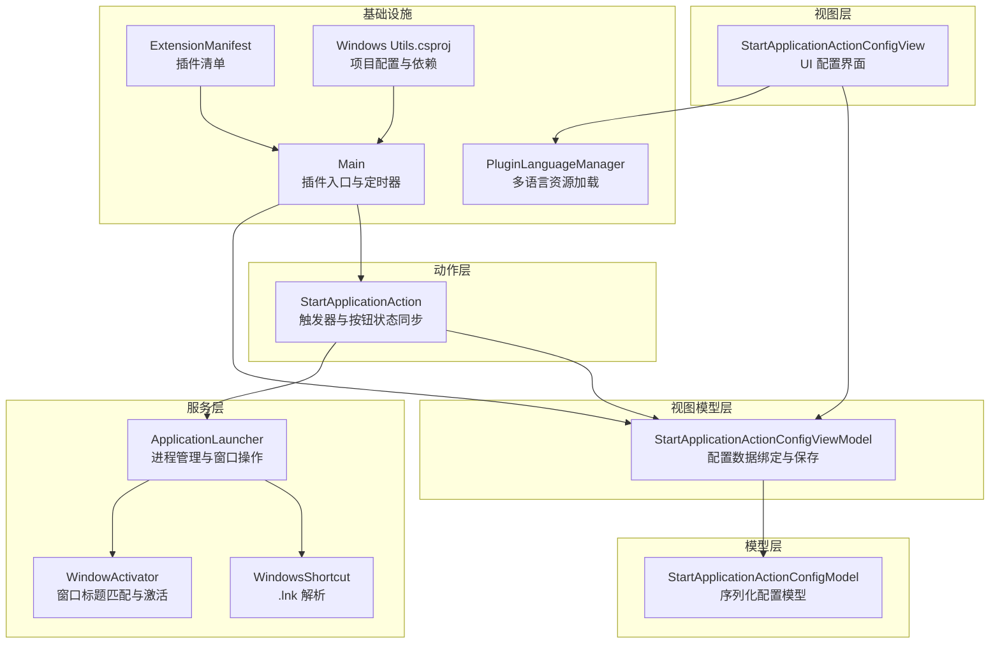
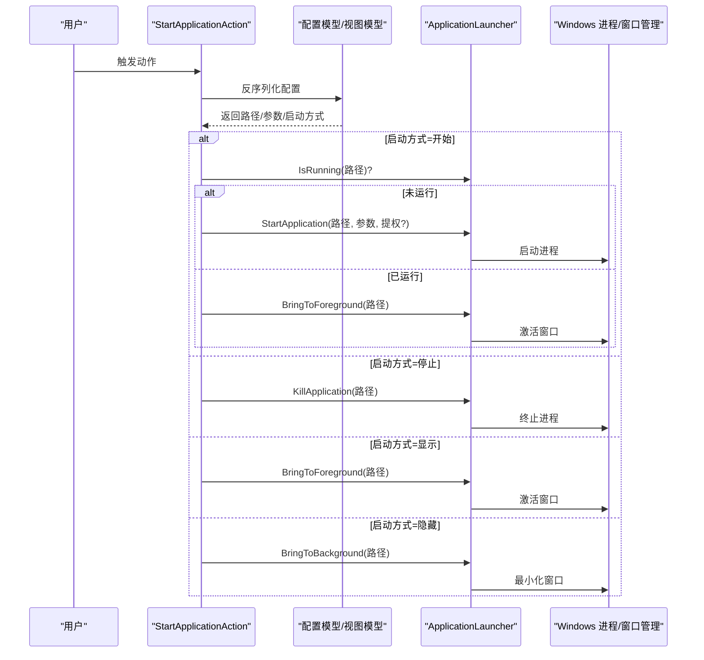
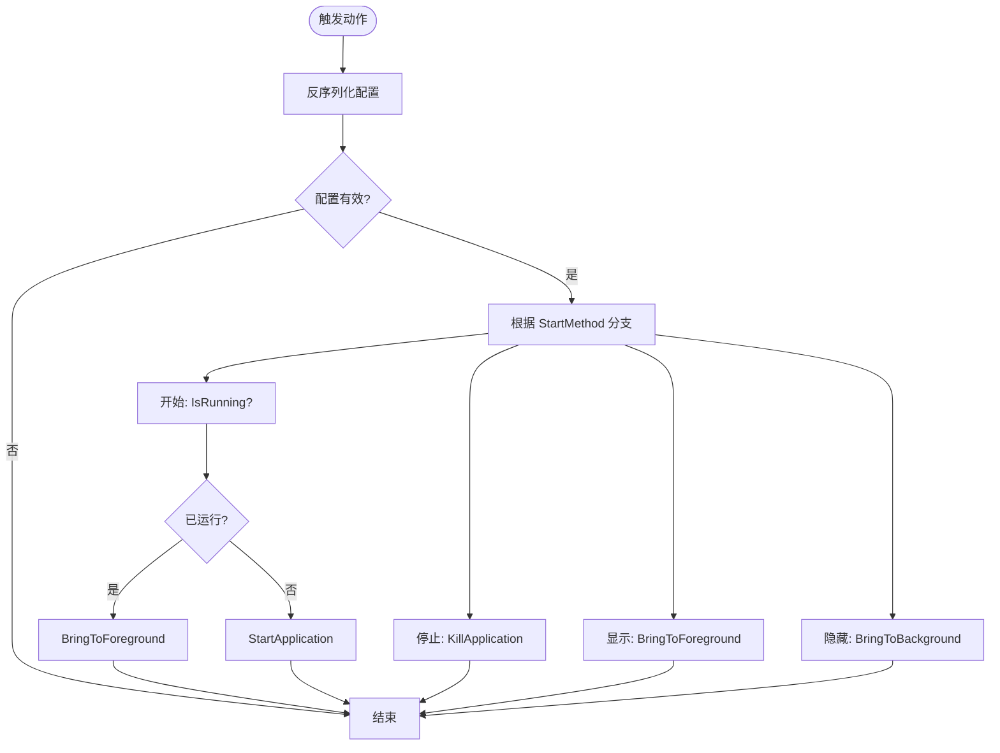
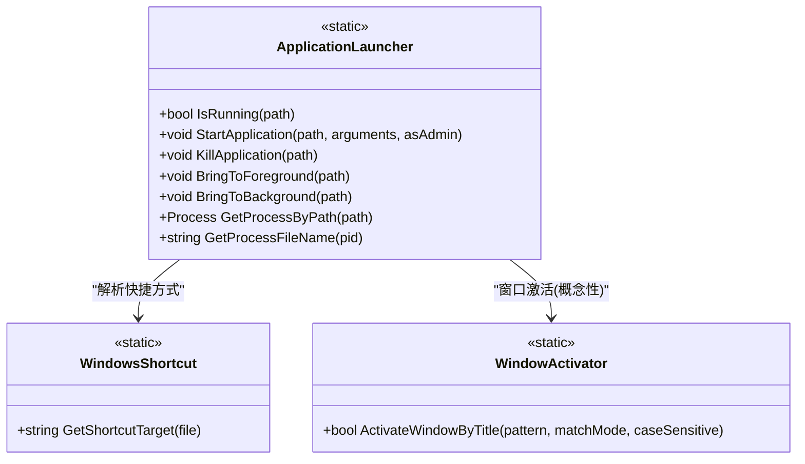
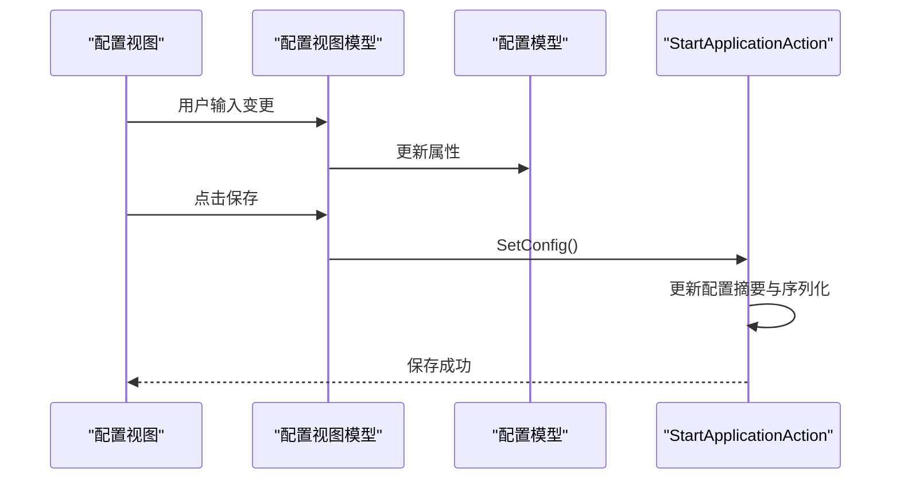
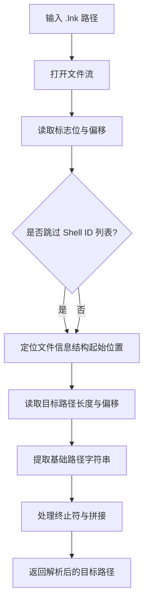
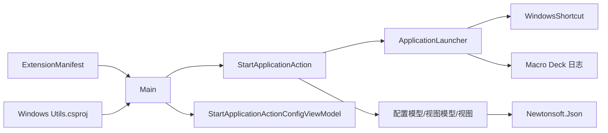

# 应用程序管理

<cite>
**本文引用的文件**
- [StartApplicationAction.cs](file://Actions/StartApplicationAction.cs)
- [ApplicationLauncher.cs](file://Services/ApplicationLauncher.cs)
- [StartApplicationActionConfigModel.cs](file://Models/StartApplicationActionConfigModel.cs)
- [StartApplicationActionConfigViewModel.cs](file://ViewModels/StartApplicationActionConfigViewModel.cs)
- [StartApplicationActionConfigView.cs](file://Views/StartApplicationActionConfigView.cs)
- [WindowActivator.cs](file://Utils/WindowActivator.cs)
- [WindowsShortcut.cs](file://Utils/WindowsShortcut.cs)
- [PluginLanguageManager.cs](file://Language/PluginLanguageManager.cs)
- [Main.cs](file://Main.cs)
- [ExtensionManifest.json](file://ExtensionManifest.json)
- [Windows Utils.csproj](file://Windows Utils.csproj)
- [README.md](file://README.md)
</cite>

## 目录
1. [简介](#简介)
2. [项目结构](#项目结构)
3. [核心组件](#核心组件)
4. [架构总览](#架构总览)
5. [详细组件分析](#详细组件分析)
6. [依赖关系分析](#依赖关系分析)
7. [性能考虑](#性能考虑)
8. [故障排除指南](#故障排除指南)
9. [结论](#结论)
10. [附录：完整配置示例](#附录完整配置示例)

## 简介
本文件为“应用程序管理”子系统提供综合技术文档，重点覆盖以下内容：
- StartApplicationAction 的应用程序启动功能：可执行文件路径配置、命令行参数设置与启动选项（开始/停止/显示/隐藏）。
- ApplicationLauncher 服务的进程管理能力：进程监控、窗口激活、最小化到前台、后台切换以及多实例处理策略。
- 完整配置示例：如何设置应用程序路径、参数与启动行为。
- 兼容性处理、权限要求与启动失败的故障排除方法。

该插件是 Macro Deck 2 的扩展，用于在 Windows 平台上控制应用程序的启动、停止与窗口状态切换。

**章节来源**
- [README.md:1-40](file://README.md#L1-L40)
- [ExtensionManifest.json:1-11](file://ExtensionManifest.json#L1-L11)

## 项目结构
该项目采用分层组织方式，围绕“动作（Action）-视图模型（ViewModel）-视图（View）-服务（Service）-模型（Model）”进行模块划分，便于职责分离与测试。

**图表来源**
- [StartApplicationAction.cs:14-84](file://Actions/StartApplicationAction.cs#L14-L84)
- [StartApplicationActionConfigView.cs:13-159](file://Views/StartApplicationActionConfigView.cs#L13-L159)
- [StartApplicationActionConfigViewModel.cs:8-73](file://ViewModels/StartApplicationActionConfigViewModel.cs#L8-L73)
- [StartApplicationActionConfigModel.cs:6-36](file://Models/StartApplicationActionConfigModel.cs#L6-L36)
- [ApplicationLauncher.cs:13-165](file://Services/ApplicationLauncher.cs#L13-L165)
- [WindowActivator.cs:9-256](file://Utils/WindowActivator.cs#L9-L256)
- [WindowsShortcut.cs:5-66](file://Utils/WindowsShortcut.cs#L5-L66)
- [PluginLanguageManager.cs:8-51](file://Language/PluginLanguageManager.cs#L8-L51)
- [Main.cs:14-60](file://Main.cs#L14-L60)
- [ExtensionManifest.json:1-11](file://ExtensionManifest.json#L1-L11)
- [Windows Utils.csproj:1-74](file://Windows Utils.csproj#L1-L74)

**章节来源**
- [Windows Utils.csproj:1-74](file://Windows Utils.csproj#L1-L74)
- [Main.cs:28-58](file://Main.cs#L28-L58)

## 核心组件
本节概述关键组件及其职责：
- StartApplicationAction：作为 Macro Deck 动作，负责根据配置触发应用启动、停止或窗口切换。
- ApplicationLauncher：封装进程启动、终止、前台/后台切换与进程查询逻辑。
- StartApplicationActionConfigModel/ViewModel/View：提供配置项的序列化、绑定与 UI 输入处理。
- WindowActivator：提供基于标题模式的窗口激活能力（用于更广泛的窗口管理场景）。
- WindowsShortcut：解析 Windows 快捷方式目标路径，提升路径识别准确性。
- PluginLanguageManager：动态加载多语言资源，支持 UI 文案本地化。
- Main：插件入口，注册动作列表与全局定时器，驱动按钮状态同步。

**章节来源**
- [StartApplicationAction.cs:14-84](file://Actions/StartApplicationAction.cs#L14-L84)
- [ApplicationLauncher.cs:13-165](file://Services/ApplicationLauncher.cs#L13-L165)
- [StartApplicationActionConfigModel.cs:6-36](file://Models/StartApplicationActionConfigModel.cs#L6-L36)
- [StartApplicationActionConfigViewModel.cs:8-73](file://ViewModels/StartApplicationActionConfigViewModel.cs#L8-L73)
- [StartApplicationActionConfigView.cs:13-159](file://Views/StartApplicationActionConfigView.cs#L13-L159)
- [WindowActivator.cs:9-256](file://Utils/WindowActivator.cs#L9-L256)
- [WindowsShortcut.cs:5-66](file://Utils/WindowsShortcut.cs#L5-L66)
- [PluginLanguageManager.cs:8-51](file://Language/PluginLanguageManager.cs#L8-L51)
- [Main.cs:14-60](file://Main.cs#L14-L60)

## 架构总览
下图展示了从用户触发到进程管理与窗口操作的整体流程。

**图表来源**
- [StartApplicationAction.cs:22-49](file://Actions/StartApplicationAction.cs#L22-L49)
- [ApplicationLauncher.cs:39-126](file://Services/ApplicationLauncher.cs#L39-L126)

## 详细组件分析

### StartApplicationAction 分析
- 角色与职责
  - 动作触发器：根据配置决定启动、停止、显示或隐藏应用。
  - 多实例处理：若应用已运行则激活前台；否则启动新实例。
  - 按钮状态同步：通过定时器周期检查应用运行状态并更新按钮状态。
- 关键流程
  - 触发时反序列化配置，依据 StartMethod 分派到不同分支。
  - 使用 ApplicationLauncher 执行具体操作。
  - 当启用按钮状态同步时，注册定时器事件以更新 ActionButton.State。
- 错误处理
  - 配置为空时直接返回。
  - 路径为空时记录警告日志（由 ApplicationLauncher 内部处理）。

**图表来源**
- [StartApplicationAction.cs:22-49](file://Actions/StartApplicationAction.cs#L22-L49)
- [ApplicationLauncher.cs:39-126](file://Services/ApplicationLauncher.cs#L39-L126)

**章节来源**
- [StartApplicationAction.cs:14-84](file://Actions/StartApplicationAction.cs#L14-L84)

### ApplicationLauncher 服务分析
- 进程管理
  - IsRunning：通过路径解析与进程枚举判断应用是否已在运行。
  - StartApplication：使用 Shell 启动，支持工作目录、参数与提权（runas）。
  - KillApplication：按路径查找进程并终止所有同名进程。
- 窗口操作
  - BringToForeground：优先使用 SetForegroundWindow，必要时最小化后恢复。
  - BringToBackground：最小化主窗口句柄。
- 路径与快捷方式
  - GetProcessByPath：先解析 .lnk 快捷方式，再匹配进程可执行文件路径。
  - GetProcessFileName：通过 Win32 API 获取进程可执行文件路径。
- 性能与健壮性
  - 使用 AggressiveInlining 优化关键路径。
  - 对空路径与不存在进程进行日志告警，避免异常传播。

**图表来源**
- [ApplicationLauncher.cs:13-165](file://Services/ApplicationLauncher.cs#L13-L165)
- [WindowsShortcut.cs:5-66](file://Utils/WindowsShortcut.cs#L5-L66)
- [WindowActivator.cs:9-256](file://Utils/WindowActivator.cs#L9-L256)

**章节来源**
- [ApplicationLauncher.cs:13-165](file://Services/ApplicationLauncher.cs#L13-L165)

### 配置模型与视图层
- 配置模型（StartApplicationActionConfigModel）
  - 字段：Path、Arguments、RunAsAdmin、SyncButtonState、StartMethod。
  - 序列化：使用 System.Text.Json。
- 视图模型（StartApplicationActionConfigViewModel）
  - 数据绑定：将 UI 控件与配置模型关联。
  - 保存：调用 SetConfig 更新 Action 的配置摘要与序列化字符串。
- 视图（StartApplicationActionConfigView）
  - UI 行为：拖拽选择文件、浏览对话框、语言文案加载。
  - 保存：校验路径非空，转换方法文本到枚举，导入图标并保存配置。

**图表来源**
- [StartApplicationActionConfigView.cs:64-135](file://Views/StartApplicationActionConfigView.cs#L64-L135)
- [StartApplicationActionConfigViewModel.cs:47-72](file://ViewModels/StartApplicationActionConfigViewModel.cs#L47-L72)
- [StartApplicationActionConfigModel.cs:19-26](file://Models/StartApplicationActionConfigModel.cs#L19-L26)

**章节来源**
- [StartApplicationActionConfigModel.cs:6-36](file://Models/StartApplicationActionConfigModel.cs#L6-L36)
- [StartApplicationActionConfigViewModel.cs:8-73](file://ViewModels/StartApplicationActionConfigViewModel.cs#L8-L73)
- [StartApplicationActionConfigView.cs:13-159](file://Views/StartApplicationActionConfigView.cs#L13-L159)

### 窗口激活与快捷方式工具
- WindowActivator
  - 支持多种标题匹配模式（部分匹配、全等、前缀、后缀、正则）。
  - 通过枚举窗口、过滤任务栏可见性与进程 ID，最终强制激活目标窗口。
- WindowsShortcut
  - 解析 .lnk 文件头结构，提取实际目标路径，处理 Unicode 与路径拼接。

**图表来源**
- [WindowsShortcut.cs:8-64](file://Utils/WindowsShortcut.cs#L8-L64)

**章节来源**
- [WindowActivator.cs:9-256](file://Utils/WindowActivator.cs#L9-L256)
- [WindowsShortcut.cs:5-66](file://Utils/WindowsShortcut.cs#L5-L66)

## 依赖关系分析
- 插件框架集成
  - 通过 Macro Deck 2 插件接口注册动作与定时器。
  - 使用 Macro Deck 日志系统输出警告与跟踪信息。
- 外部依赖
  - Newtonsoft.Json：配置序列化。
  - H.InputSimulator：输入模拟（本模块未直接使用）。
  - System.Drawing.Common：图像处理（本模块未直接使用）。
- 平台依赖
  - Windows API：user32.dll、kernel32.dll、psapi.dll。
  - .NET 10.0（Windows 7+）目标框架。

**图表来源**
- [StartApplicationAction.cs:14-84](file://Actions/StartApplicationAction.cs#L14-L84)
- [ApplicationLauncher.cs:13-165](file://Services/ApplicationLauncher.cs#L13-L165)
- [StartApplicationActionConfigView.cs:13-159](file://Views/StartApplicationActionConfigView.cs#L13-L159)
- [StartApplicationActionConfigViewModel.cs:8-73](file://ViewModels/StartApplicationActionConfigViewModel.cs#L8-L73)
- [StartApplicationActionConfigModel.cs:6-36](file://Models/StartApplicationActionConfigModel.cs#L6-L36)
- [Main.cs:14-60](file://Main.cs#L14-L60)
- [ExtensionManifest.json:1-11](file://ExtensionManifest.json#L1-11)
- [Windows Utils.csproj:35-39](file://Windows Utils.csproj#L35-L39)

**章节来源**
- [Windows Utils.csproj:35-39](file://Windows Utils.csproj#L35-L39)
- [Main.cs:28-58](file://Main.cs#L28-L58)

## 性能考虑
- 进程枚举与路径解析
  - GetProcessByPath 会遍历系统进程并调用 Win32 API 获取可执行文件名，建议仅在需要时调用，避免频繁轮询。
  - 建议配合定时器间隔（如 2 秒）平衡实时性与性能。
- UI 响应
  - 按钮状态同步在后台线程中执行，避免阻塞 UI。
- 资源释放
  - Win32 句柄在使用后及时关闭，防止资源泄漏。

[本节为通用性能建议，不直接分析特定文件]

## 故障排除指南
- 启动路径为空
  - 现象：触发动作无响应。
  - 排查：确认配置视图中已正确填写路径；检查路径是否存在。
  - 参考：视图保存逻辑对路径进行非空校验。
- 应用未启动或无法找到进程
  - 现象：IsRunning 返回 false 或窗口未激活。
  - 排查：确认路径指向正确的可执行文件；若为 .lnk，确保目标有效；检查是否被安全软件拦截。
  - 参考：ApplicationLauncher 的路径解析与进程枚举。
- 权限不足导致启动失败
  - 现象：以管理员身份运行失败或弹出 UAC。
  - 排查：勾选“以管理员身份运行”时需确保用户授权；避免在受限账户下启动受保护进程。
  - 参考：StartApplication 的 Verb 设置。
- 窗口无法激活
  - 现象：调用 BringToForeground 后窗口未置顶。
  - 排查：某些应用可能禁用前台切换；可尝试最小化后再恢复。
  - 参考：ApplicationLauncher 的最小化-恢复流程。
- 多实例冲突
  - 现象：同一应用多次启动。
  - 排查：StartApplicationAction 默认检测运行状态并激活已有实例；若需强制重启，可在外部逻辑中先调用 KillApplication。
- 日志与调试
  - 使用 Macro Deck 日志查看警告与跟踪信息，定位问题根因。

**章节来源**
- [StartApplicationActionConfigView.cs:87-135](file://Views/StartApplicationActionConfigView.cs#L87-L135)
- [ApplicationLauncher.cs:39-126](file://Services/ApplicationLauncher.cs#L39-L126)
- [StartApplicationAction.cs:71-82](file://Actions/StartApplicationAction.cs#L71-L82)

## 结论
本应用程序管理子系统通过清晰的动作-服务-配置分层设计，提供了稳定可靠的 Windows 应用启动与窗口管理能力。其特性包括：
- 简洁直观的配置界面与序列化机制。
- 基于路径与快捷方式的目标解析，增强兼容性。
- 完备的进程生命周期管理与窗口状态控制。
- 可扩展的多语言支持与日志体系。

建议在生产环境中结合定时器策略与日志监控，确保状态同步与错误快速定位。

[本节为总结性内容，不直接分析特定文件]

## 附录：完整配置示例
以下示例展示如何在 Macro Deck 中配置“启动应用程序”动作，涵盖路径、参数与启动行为。

- 步骤一：在动作面板添加“启动应用程序”
- 步骤二：打开配置视图
  - 在“路径”字段填写可执行文件绝对路径（例如：C:\Program Files\MyApp\MyApp.exe），或拖拽 .lnk 快捷方式。
  - 在“参数”字段填写命令行参数（例如：--config production --port 8080）。
  - 在“启动方式”中选择：
    - 开始：若应用未运行则启动，已运行则激活前台。
    - 停止：终止所有同名进程。
    - 显示：激活前台。
    - 隐藏：最小化到后台。
  - 如需管理员权限，勾选“以管理员身份运行”。
  - 如需按钮状态同步，勾选“同步按钮状态”，按钮将随应用运行状态变色。
- 步骤三：点击保存，完成配置。

提示：
- 若目标为 .lnk 快捷方式，系统会自动解析其目标路径。
- 参数中包含空格时请使用引号包裹，避免解析错误。
- 若应用启动后窗口未置顶，可稍后手动点击“显示”或“开始”。

**章节来源**
- [StartApplicationActionConfigView.cs:13-159](file://Views/StartApplicationActionConfigView.cs#L13-L159)
- [StartApplicationActionConfigViewModel.cs:47-72](file://ViewModels/StartApplicationActionConfigViewModel.cs#L47-L72)
- [StartApplicationActionConfigModel.cs:6-36](file://Models/StartApplicationActionConfigModel.cs#L6-L36)
- [StartApplicationAction.cs:22-49](file://Actions/StartApplicationAction.cs#L22-L49)