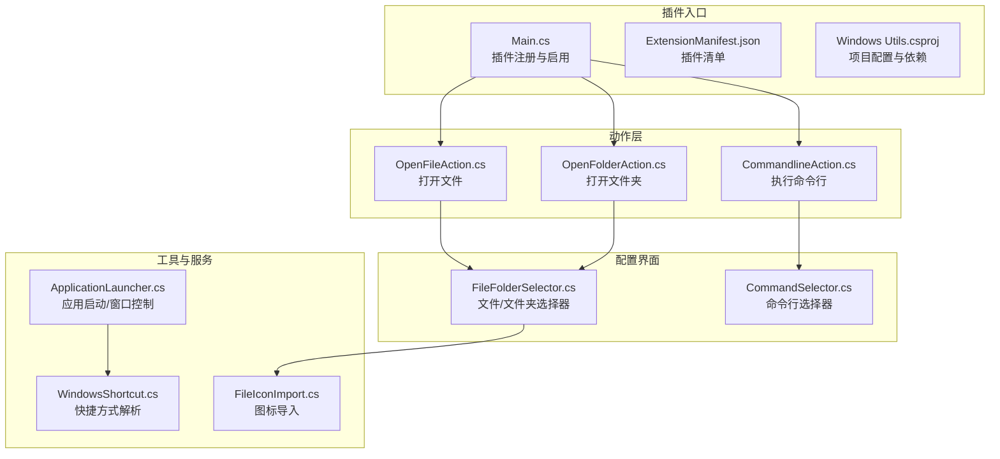
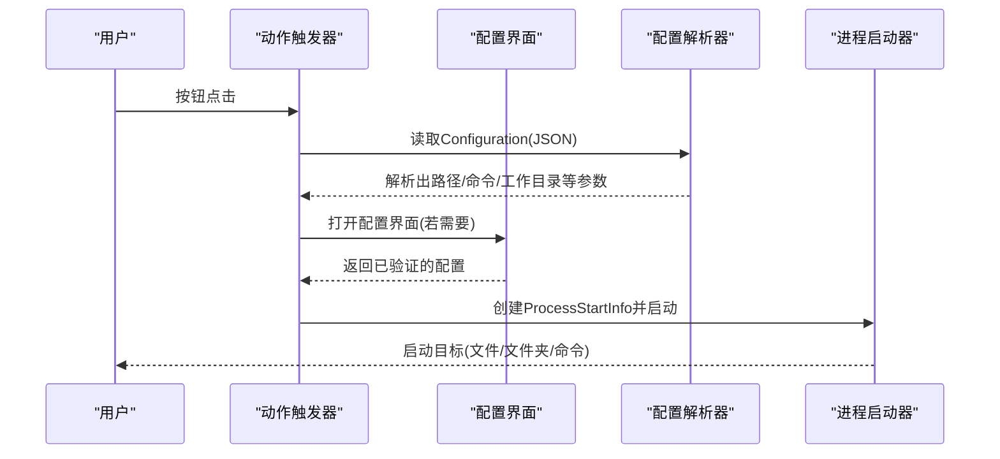
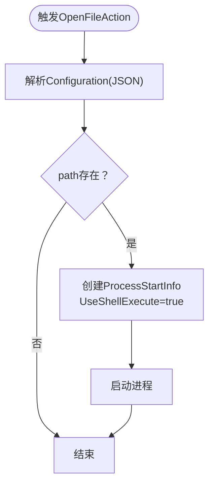
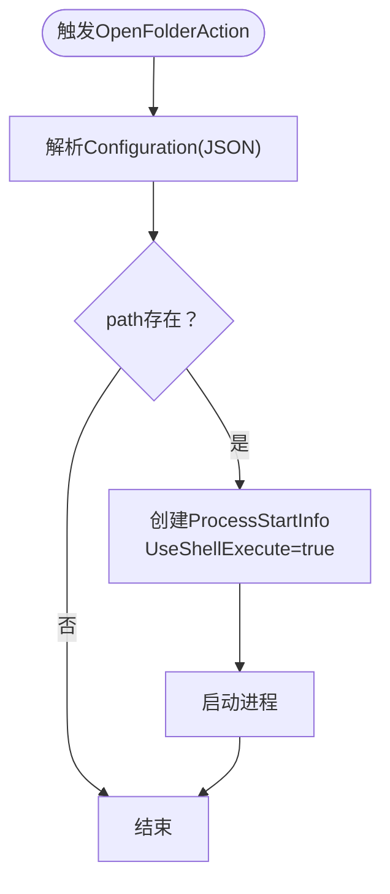
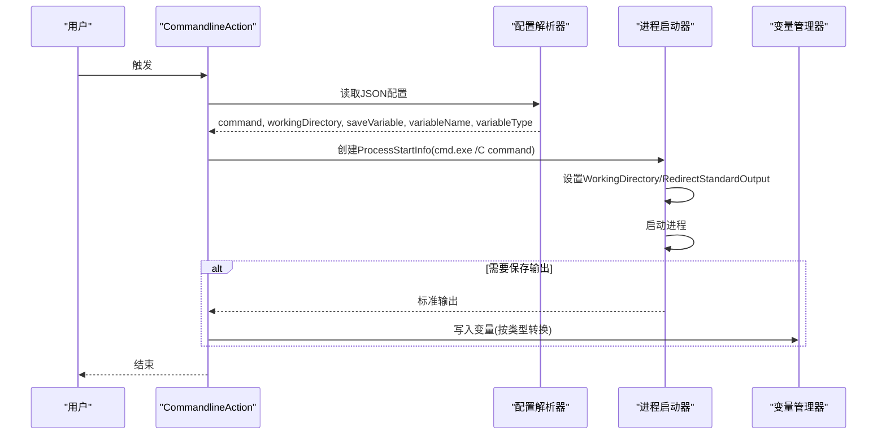
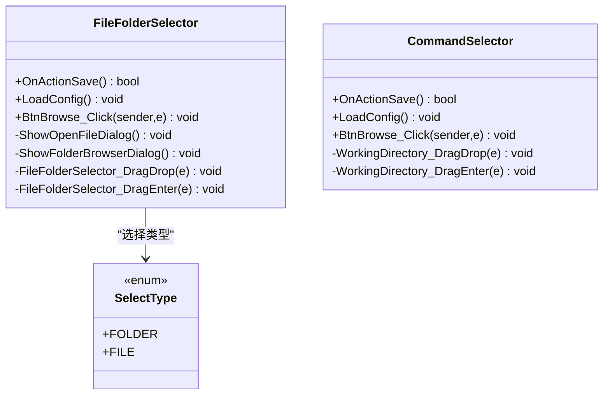
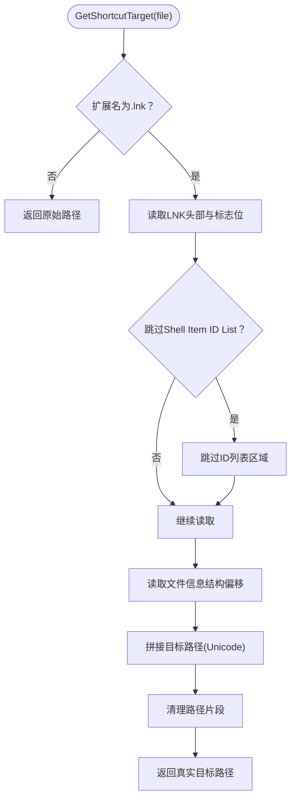
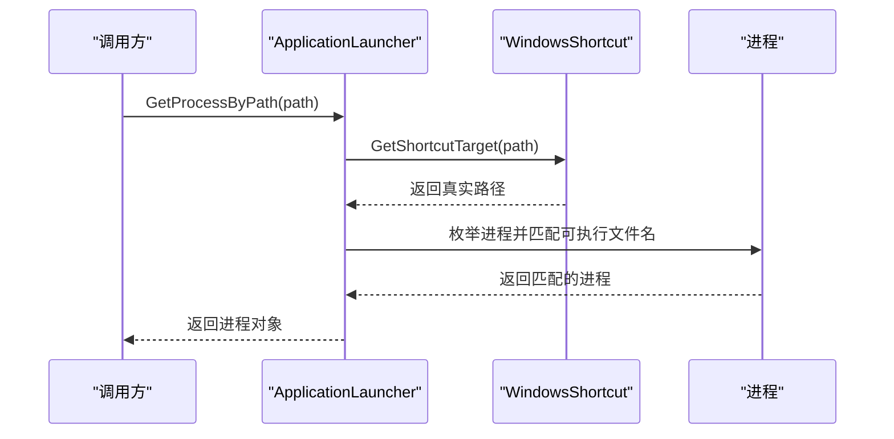
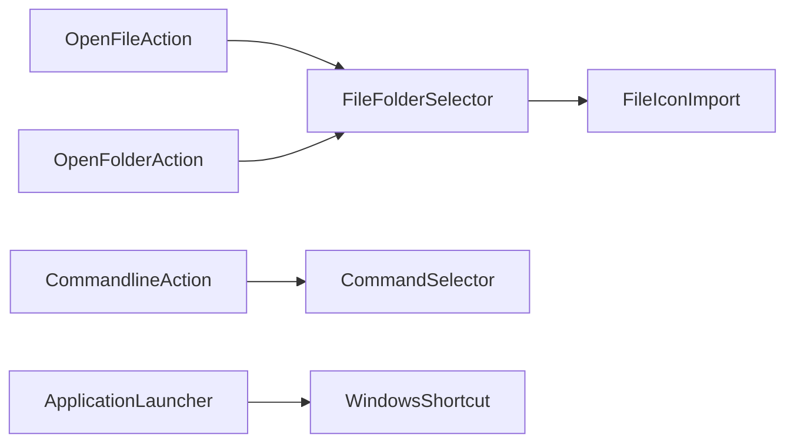

# 文件系统操作

<cite>
**本文引用的文件**
- [OpenFileAction.cs](file://Actions/OpenFileAction.cs)
- [OpenFolderAction.cs](file://Actions/OpenFolderAction.cs)
- [CommandlineAction.cs](file://Actions/CommandlineAction.cs)
- [FileFolderSelector.cs](file://GUI/FileFolderSelector.cs)
- [CommandSelector.cs](file://GUI/CommandSelector.cs)
- [WindowsShortcut.cs](file://Utils/WindowsShortcut.cs)
- [ApplicationLauncher.cs](file://Services/ApplicationLauncher.cs)
- [Main.cs](file://Main.cs)
- [FileIconImport.cs](file://Utils/FileIconImport.cs)
- [Windows Utils.csproj](file://Windows Utils.csproj)
- [ExtensionManifest.json](file://ExtensionManifest.json)
- [README.md](file://README.md)
</cite>

## 目录
1. [简介](#简介)
2. [项目结构](#项目结构)
3. [核心组件](#核心组件)
4. [架构总览](#架构总览)
5. [详细组件分析](#详细组件分析)
6. [依赖关系分析](#依赖关系分析)
7. [性能考量](#性能考量)
8. [故障排除指南](#故障排除指南)
9. [结论](#结论)
10. [附录](#附录)

## 简介
本文件系统操作模块围绕三个核心动作展开：文件打开（OpenFileAction）、文件夹浏览（OpenFolderAction）与命令行执行（CommandlineAction）。它们通过统一的配置界面（FileFolderSelector、CommandSelector）进行路径选择与参数配置，并在触发时调用系统进程启动器完成实际操作。此外，系统还提供了Windows快捷方式解析能力（WindowsShortcut），以及应用启动服务（ApplicationLauncher）用于进程级窗口控制等扩展功能。

本指南将从架构、数据流、处理逻辑、安全与权限、路径验证、命令行参数传递、Windows快捷方式处理等方面进行深入说明，并提供可操作的使用示例与最佳实践建议。

## 项目结构
该插件基于Macro Deck 2插件框架开发，采用“动作（Action）+ 配置界面（GUI）+ 工具与服务（Utils/Services）”的分层组织方式：
- Actions：定义具体可触发的动作行为（文件打开、文件夹打开、命令行执行）
- GUI：提供可视化配置界面，支持拖拽、对话框选择与配置持久化
- Utils：通用工具类（如Windows快捷方式解析、图标导入等）
- Services：系统服务（如应用启动与窗口控制）
- Main：插件入口，注册所有可用动作

图表来源
- [Main.cs:28-50](file://Main.cs#L28-L50)
- [OpenFileAction.cs:12-46](file://Actions/OpenFileAction.cs#L12-L46)
- [OpenFolderAction.cs:14-48](file://Actions/OpenFolderAction.cs#L14-L48)
- [CommandlineAction.cs:14-64](file://Actions/CommandlineAction.cs#L14-L64)
- [FileFolderSelector.cs:13-45](file://GUI/FileFolderSelector.cs#L13-L45)
- [CommandSelector.cs:12-44](file://GUI/CommandSelector.cs#L12-L44)
- [WindowsShortcut.cs:5-65](file://Utils/WindowsShortcut.cs#L5-L65)
- [ApplicationLauncher.cs:13-164](file://Services/ApplicationLauncher.cs#L13-L164)
- [FileIconImport.cs:11-66](file://Utils/FileIconImport.cs#L11-L66)

章节来源
- [Main.cs:14-58](file://Main.cs#L14-L58)
- [ExtensionManifest.json:1-11](file://ExtensionManifest.json#L1-L11)
- [Windows Utils.csproj:1-74](file://Windows Utils.csproj#L1-L74)

## 核心组件
本节聚焦于三个文件系统操作动作及其配置界面，解释其职责、输入输出与触发流程。

- OpenFileAction：负责打开任意文件（通过系统默认程序）
- OpenFolderAction：负责打开指定目录（通过资源管理器）
- CommandlineAction：负责在工作目录中执行命令行命令，并可将输出保存到变量

每个动作均具备以下特征：
- 支持配置界面（GetActionConfigControl返回对应控件）
- 触发时从Configuration中解析JSON配置
- 使用ProcessStartInfo启动外部进程，遵循UseShellExecute或重定向标准输出等策略

章节来源
- [OpenFileAction.cs:12-46](file://Actions/OpenFileAction.cs#L12-L46)
- [OpenFolderAction.cs:14-48](file://Actions/OpenFolderAction.cs#L14-L48)
- [CommandlineAction.cs:14-64](file://Actions/CommandlineAction.cs#L14-L64)

## 架构总览
下图展示了从按钮触发到系统进程启动的整体流程，包括配置解析、路径验证与进程启动的关键节点。

图表来源
- [OpenFileAction.cs:20-40](file://Actions/OpenFileAction.cs#L20-L40)
- [OpenFolderAction.cs:22-42](file://Actions/OpenFolderAction.cs#L22-L42)
- [CommandlineAction.cs:22-58](file://Actions/CommandlineAction.cs#L22-L58)
- [FileFolderSelector.cs:65-117](file://GUI/FileFolderSelector.cs#L65-L117)
- [CommandSelector.cs:46-79](file://GUI/CommandSelector.cs#L46-L79)

## 详细组件分析

### OpenFileAction（文件打开）
- 功能概述：解析配置中的文件路径，使用系统外壳打开文件（默认程序）
- 关键点
  - 配置格式：包含path字段的JSON字符串
  - 进程启动：UseShellExecute=true，交由系统关联程序处理
  - 错误处理：异常被吞掉，无反馈
- 典型使用场景
  - 双击按钮即打开图片、文档、脚本等文件
  - 建议配合FileFolderSelector进行路径选择与拖拽

图表来源
- [OpenFileAction.cs:20-40](file://Actions/OpenFileAction.cs#L20-L40)

章节来源
- [OpenFileAction.cs:12-46](file://Actions/OpenFileAction.cs#L12-L46)

### OpenFolderAction（文件夹浏览）
- 功能概述：解析配置中的目录路径，使用系统外壳打开文件夹
- 关键点
  - 与OpenFileAction类似，但目标为目录
  - 通过FileFolderSelector选择类型为FOLDER
- 典型使用场景
  - 快速打开下载目录、项目根目录等

图表来源
- [OpenFolderAction.cs:22-42](file://Actions/OpenFolderAction.cs#L22-L42)

章节来源
- [OpenFolderAction.cs:14-48](file://Actions/OpenFolderAction.cs#L14-L48)

### CommandlineAction（命令行执行）
- 功能概述：在指定工作目录执行命令行命令，可选将输出保存到变量
- 关键点
  - 配置字段：command、workingDirectory、saveVariable、variableName、variableType
  - 进程启动：cmd.exe /C 执行命令；可重定向标准输出
  - 输出变量：根据variableType转换后写入VariableManager
- 安全与权限
  - 使用隐藏窗口样式，避免干扰
  - 异常捕获并记录日志，不向用户暴露错误细节
- 典型使用场景
  - 在项目目录执行构建脚本、查询系统信息、运行批处理等

图表来源
- [CommandlineAction.cs:22-58](file://Actions/CommandlineAction.cs#L22-L58)

章节来源
- [CommandlineAction.cs:14-64](file://Actions/CommandlineAction.cs#L14-L64)

### 配置界面与路径验证
- FileFolderSelector
  - 支持文件/文件夹两种选择模式
  - 拖拽支持：接收拖拽的文件或文件夹路径
  - 路径验证：检查所选是否符合类型（文件/文件夹）
  - 图标导入：当选择文件时可导入图标到图标包
  - 配置持久化：生成包含path的JSON字符串
- CommandSelector
  - 命令文本框、工作目录选择、保存输出到变量复选框
  - 变量名与类型选择（String/Integer/Float/Bool）
  - 拖拽支持：将文件夹拖入工作目录
  - 路径验证：对工作目录进行基本属性检查

图表来源
- [FileFolderSelector.cs:13-189](file://GUI/FileFolderSelector.cs#L13-L189)
- [CommandSelector.cs:12-144](file://GUI/CommandSelector.cs#L12-L144)

章节来源
- [FileFolderSelector.cs:13-189](file://GUI/FileFolderSelector.cs#L13-L189)
- [CommandSelector.cs:12-144](file://GUI/CommandSelector.cs#L12-L144)

### Windows快捷方式处理
- WindowsShortcut
  - 作用：解析.lnk快捷方式，提取真实目标路径
  - 实现：二进制读取LNK文件头与定位信息，拼接Unicode路径
  - 边界：非.lnk文件直接返回原路径；解析失败返回空字符串
- 应用场景
  - 与ApplicationLauncher结合，通过快捷方式定位真实可执行文件路径
  - 在进程查找与窗口控制前先解析快捷方式

图表来源
- [WindowsShortcut.cs:8-64](file://Utils/WindowsShortcut.cs#L8-L64)

章节来源
- [WindowsShortcut.cs:5-65](file://Utils/WindowsShortcut.cs#L5-L65)

### 应用启动与窗口控制（补充）
- ApplicationLauncher
  - IsRunning：判断指定路径的应用是否正在运行
  - StartApplication：以管理员或普通权限启动应用（支持参数）
  - KillApplication：终止匹配路径的所有进程
  - BringToBackground/BringToForeground：将应用窗口最小化或恢复到前台
  - GetProcessByPath：解析快捷方式后查找进程
  - GetProcessFileName：通过Win32 API获取进程可执行文件路径
- 与快捷方式的关系
  - 在查找进程前先调用WindowsShortcut.GetShortcutTarget解析真实路径

图表来源
- [ApplicationLauncher.cs:128-137](file://Services/ApplicationLauncher.cs#L128-L137)
- [WindowsShortcut.cs:8-64](file://Utils/WindowsShortcut.cs#L8-L64)

章节来源
- [ApplicationLauncher.cs:13-164](file://Services/ApplicationLauncher.cs#L13-L164)

## 依赖关系分析
- 外部依赖
  - Macro Deck 2：插件框架接口与变量管理器
  - Newtonsoft.Json：JSON序列化/反序列化
  - H.InputSimulator：输入模拟（本模块未直接使用）
- 内部依赖
  - Actions依赖GUI配置控件进行配置
  - ApplicationLauncher依赖WindowsShortcut进行快捷方式解析
  - FileFolderSelector在选择文件时可调用FileIconImport导入图标

图表来源
- [OpenFileAction.cs:42-45](file://Actions/OpenFileAction.cs#L42-L45)
- [OpenFolderAction.cs:44-47](file://Actions/OpenFolderAction.cs#L44-L47)
- [CommandlineAction.cs:60-63](file://Actions/CommandlineAction.cs#L60-L63)
- [ApplicationLauncher.cs:128-137](file://Services/ApplicationLauncher.cs#L128-L137)
- [FileFolderSelector.cs:77-83](file://GUI/FileFolderSelector.cs#L77-L83)

章节来源
- [Windows Utils.csproj:35-47](file://Windows Utils.csproj#L35-L47)
- [ExtensionManifest.json:1-11](file://ExtensionManifest.json#L1-L11)

## 性能考量
- 进程启动成本
  - OpenFileAction与OpenFolderAction使用UseShellExecute，启动速度快，但无法重定向输出
  - CommandlineAction使用cmd.exe，额外进程开销，建议仅在必要时开启输出重定向
- 快捷方式解析
  - WindowsShortcut为二进制解析，I/O开销较小；对大量.lnk文件批量解析时应避免频繁调用
- 图标导入
  - FileIconImport涉及图像缩放与图标包写入，建议异步执行或缓存结果

[本节为通用指导，无需特定文件来源]

## 故障排除指南
- 打不开文件/文件夹
  - 检查配置中的path是否存在且有效
  - 确认文件/目录权限与路径格式（含空格需正确转义）
- 命令行执行无输出
  - 确认saveVariable勾选且variableName/variableType填写正确
  - 检查工作目录是否为有效目录
- 权限问题
  - 对需要管理员权限的操作，使用ApplicationLauncher的管理员启动模式
- 快捷方式无效
  - 确认.lnk文件未损坏；必要时重新创建快捷方式
- 日志与调试
  - CommandlineAction会将异常消息写入调试输出；可在IDE中查看

章节来源
- [CommandlineAction.cs:54-56](file://Actions/CommandlineAction.cs#L54-L56)
- [ApplicationLauncher.cs:60-80](file://Services/ApplicationLauncher.cs#L60-L80)

## 结论
本模块通过简洁的动作设计与直观的配置界面，实现了文件打开、文件夹浏览与命令行执行三大核心功能。配合Windows快捷方式解析与应用启动服务，能够覆盖常见的系统操作场景。在安全性方面，命令行执行默认隐藏窗口并记录异常；在易用性方面，拖拽与对话框选择简化了路径配置。建议在生产环境中为命令行执行增加更严格的白名单与参数校验，并对快捷方式解析与图标导入进行异步优化。

[本节为总结性内容，无需特定文件来源]

## 附录

### 使用示例与最佳实践
- 配置文件路径
  - 使用FileFolderSelector选择文件或文件夹，支持拖拽与对话框
  - 确保路径包含扩展名，避免系统无法识别
- 设置打开选项
  - OpenFileAction/OpenFolderAction无需额外选项，直接使用系统默认行为
  - 如需管理员权限，可改用ApplicationLauncher的StartApplication
- 执行系统命令
  - 在CommandSelector中填写命令与工作目录
  - 若需保存输出，勾选“保存输出到变量”，并选择变量类型
  - 建议将敏感命令放入受保护的工作目录，并限制变量访问范围
- 路径验证与权限
  - 在配置界面中确保选择了正确的类型（文件/文件夹）
  - 对网络路径或受限目录，提前测试访问权限
- Windows快捷方式
  - 将常用程序创建.lnk快捷方式，便于通过ApplicationLauncher解析真实路径
  - 对损坏的.lnk文件，建议删除并重新创建

章节来源
- [FileFolderSelector.cs:65-117](file://GUI/FileFolderSelector.cs#L65-L117)
- [CommandSelector.cs:46-79](file://GUI/CommandSelector.cs#L46-L79)
- [ApplicationLauncher.cs:45-58](file://Services/ApplicationLauncher.cs#L45-L58)

### 安全与合规建议
- 命令行执行
  - 限制可执行命令白名单，避免任意命令注入
  - 对用户输入进行严格转义与长度限制
  - 使用最小权限原则，避免以管理员身份执行非必要命令
- 文件与目录访问
  - 对外部路径进行存在性与类型检查
  - 避免访问系统关键目录（如C:\Windows）
- 快捷方式
  - 不信任来源不明的.lnk文件，建议手动创建
  - 定期清理失效或可疑快捷方式

[本节为通用指导，无需特定文件来源]