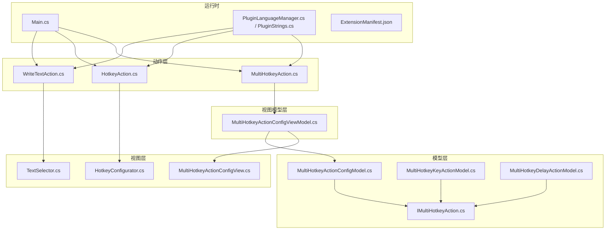
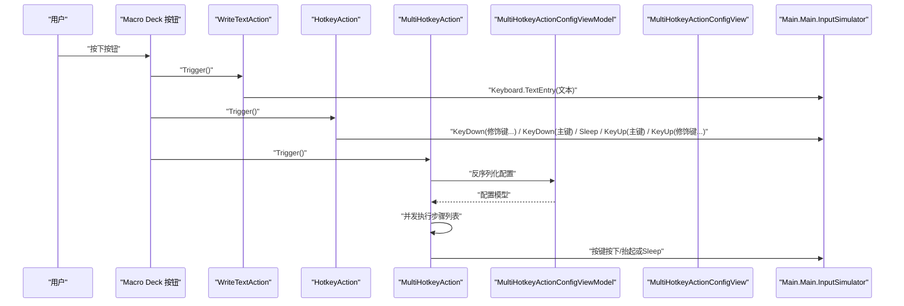
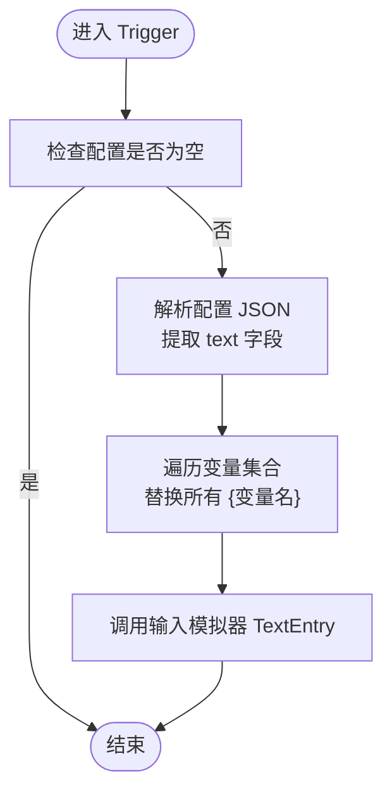
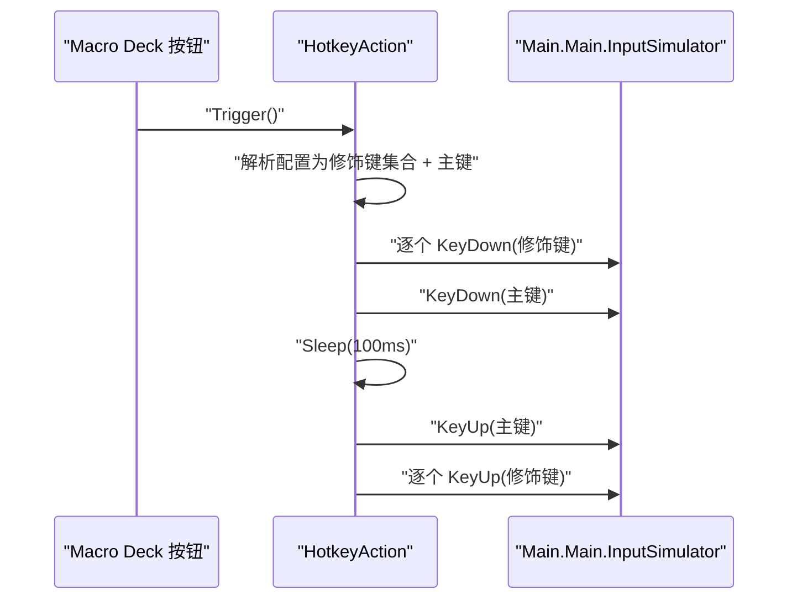
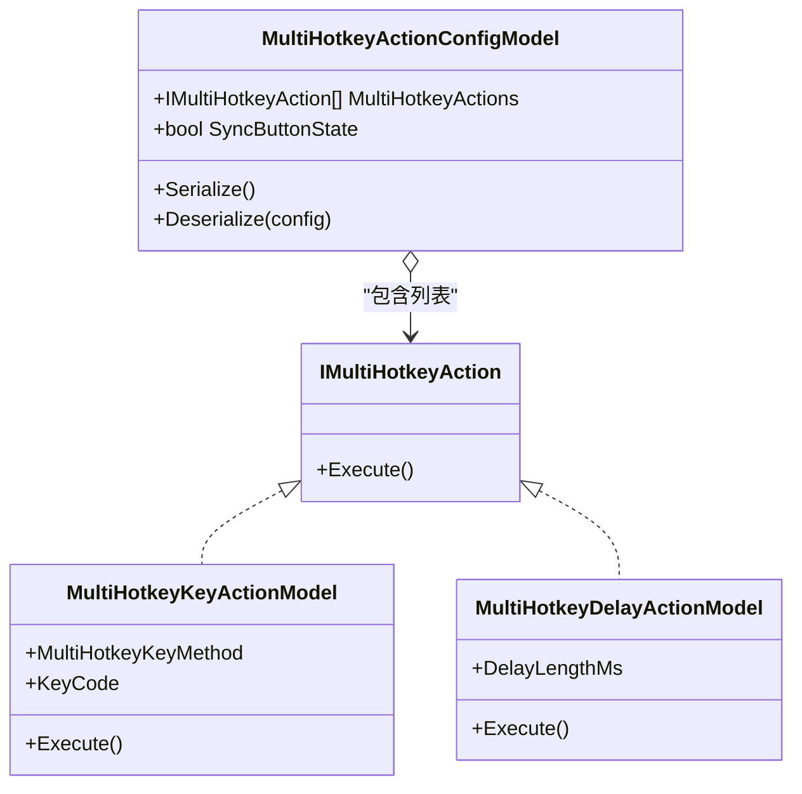
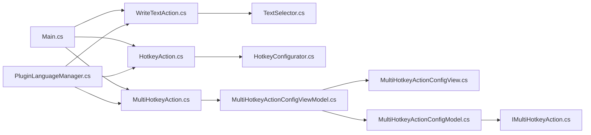

# 文本输入与热键系统

<cite>
**本文引用的文件**
- [WriteTextAction.cs](file://Actions/WriteTextAction.cs)
- [HotkeyAction.cs](file://Actions/HotkeyAction.cs)
- [MultiHotkeyAction.cs](file://Actions/MultiHotkeyAction.cs)
- [TextSelector.cs](file://GUI/TextSelector.cs)
- [HotkeyConfigurator.cs](file://GUI/HotkeyConfigurator.cs)
- [MultiHotkeyActionConfigModel.cs](file://Models/MultiHotkeyActionConfigModel.cs)
- [MultiHotkeyKeyActionModel.cs](file://Models/MultiHotkeyKeyActionModel.cs)
- [MultiHotkeyDelayActionModel.cs](file://Models/MultiHotkeyDelayActionModel.cs)
- [IMultiHotkeyAction.cs](file://Models/IMultiHotkeyAction.cs)
- [MultiHotkeyActionConfigViewModel.cs](file://ViewModels/MultiHotkeyActionConfigViewModel.cs)
- [MultiHotkeyActionConfigView.cs](file://Views/MultiHotkeyActionConfigView.cs)
- [Main.cs](file://Main.cs)
- [PluginLanguageManager.cs](file://Language/PluginLanguageManager.cs)
- [PluginStrings.cs](file://Language/PluginStrings.cs)
- [ExtensionManifest.json](file://ExtensionManifest.json)
</cite>

## 目录
1. [简介](#简介)
2. [项目结构](#项目结构)
3. [核心组件](#核心组件)
4. [架构总览](#架构总览)
5. [详细组件分析](#详细组件分析)
6. [依赖关系分析](#依赖关系分析)
7. [性能考虑](#性能考虑)
8. [故障排除指南](#故障排除指南)
9. [结论](#结论)
10. [附录](#附录)

## 简介
本文件面向“文本输入与热键系统”的使用者与维护者，系统性阐述以下三类动作的行为、配置与执行机制：
- 文本模拟：WriteTextAction，用于在当前活动窗口中输入指定文本，支持变量替换。
- 单热键：HotkeyAction，用于发送一个修饰键+主按键的组合键序列，具备延迟与兼容性处理。
- 复合热键：MultiHotkeyAction，支持以可序列化配置定义一系列按键按下/抬起与延时步骤，实现复杂快捷操作。

同时提供GUI配置界面的使用方法、最佳实践、冲突避免策略、延迟与重复触发处理建议，以及典型使用场景与参考路径。

## 项目结构
该插件基于 Macro Deck 插件框架，采用“动作（Action）+ 视图模型（ViewModel）+ 视图（View）+ 模型（Model）+ GUI 控件（GUI）”分层组织。关键目录与职责如下：
- Actions：动作实现，负责触发逻辑与配置控件绑定
- Models：配置模型与接口，描述复合热键的可序列化结构
- GUI：配置界面控件，提供可视化编辑体验
- ViewModels：配置视图模型，封装序列化与保存流程
- Views：配置视图容器，承载 ViewModel 并暴露保存接口
- Language：本地化字符串管理
- Main：插件入口，注册可用动作与全局输入模拟器实例

图表来源
- [Main.cs:31-50](file://Main.cs#L31-L50)
- [WriteTextAction.cs:14-51](file://Actions/WriteTextAction.cs#L14-L51)
- [HotkeyAction.cs:15-112](file://Actions/HotkeyAction.cs#L15-L112)
- [MultiHotkeyAction.cs:11-56](file://Actions/MultiHotkeyAction.cs#L11-L56)
- [MultiHotkeyActionConfigModel.cs:6-21](file://Models/MultiHotkeyActionConfigModel.cs#L6-L21)
- [MultiHotkeyKeyActionModel.cs:5-32](file://Models/MultiHotkeyKeyActionModel.cs#L5-L32)
- [MultiHotkeyDelayActionModel.cs:5-13](file://Models/MultiHotkeyDelayActionModel.cs#L5-L13)
- [MultiHotkeyActionConfigViewModel.cs:9-55](file://ViewModels/MultiHotkeyActionConfigViewModel.cs#L9-L55)
- [MultiHotkeyActionConfigView.cs:8-27](file://Views/MultiHotkeyActionConfigView.cs#L8-L27)
- [TextSelector.cs:11-76](file://GUI/TextSelector.cs#L11-L76)
- [HotkeyConfigurator.cs:12-95](file://GUI/HotkeyConfigurator.cs#L12-L95)
- [PluginLanguageManager.cs:8-50](file://Language/PluginLanguageManager.cs#L8-L50)
- [PluginStrings.cs:3-69](file://Language/PluginStrings.cs#L3-L69)

章节来源
- [Main.cs:28-58](file://Main.cs#L28-L58)
- [ExtensionManifest.json:1-11](file://ExtensionManifest.json#L1-L11)

## 核心组件
本节对三个核心动作进行概览式说明，包括名称、描述、是否可配置、触发入口与关键行为。

- WriteTextAction
  - 名称与描述：来自本地化字符串资源
  - 可配置：是
  - 触发入口：解析配置中的文本字段，支持变量占位符替换后通过输入模拟器写入
  - 关键点：异常捕获与日志记录；变量替换大小写不敏感
  - 配置控件：TextSelector

- HotkeyAction
  - 名称与描述：来自本地化字符串资源
  - 可配置：是
  - 触发入口：解析配置中的修饰键与主键，按“逐个按下 → 主键按下 → 延迟 → 主键抬起 → 逐个抬起”的顺序执行
  - 关键点：为兼容部分应用识别问题，采用 KeyDown/KeyUp 分步与固定延迟
  - 配置控件：HotkeyConfigurator

- MultiHotkeyAction
  - 名称与描述：来自本地化字符串资源
  - 可配置：是
  - 触发入口：反序列化配置为可执行步骤列表，异步串行执行；支持按钮状态同步与中断标志
  - 关键点：通过 IMultiHotkeyAction 接口统一执行单元；支持按键按下/抬起与延时
  - 配置控件：MultiHotkeyActionConfigView + MultiHotkeyActionConfigViewModel

章节来源
- [WriteTextAction.cs:14-51](file://Actions/WriteTextAction.cs#L14-L51)
- [HotkeyAction.cs:15-112](file://Actions/HotkeyAction.cs#L15-L112)
- [MultiHotkeyAction.cs:11-56](file://Actions/MultiHotkeyAction.cs#L11-L56)
- [PluginLanguageManager.cs:8-50](file://Language/PluginLanguageManager.cs#L8-L50)
- [PluginStrings.cs:15-69](file://Language/PluginStrings.cs#L15-L69)

## 架构总览
下图展示了从用户触发到动作执行的关键交互路径，以及各组件之间的依赖关系。

图表来源
- [WriteTextAction.cs:22-45](file://Actions/WriteTextAction.cs#L22-L45)
- [HotkeyAction.cs:29-111](file://Actions/HotkeyAction.cs#L29-L111)
- [MultiHotkeyAction.cs:23-48](file://Actions/MultiHotkeyAction.cs#L23-L48)
- [MultiHotkeyActionConfigViewModel.cs:30-54](file://ViewModels/MultiHotkeyActionConfigViewModel.cs#L30-L54)
- [MultiHotkeyActionConfigView.cs:12-26](file://Views/MultiHotkeyActionConfigView.cs#L12-L26)
- [Main.cs:18](file://Main.cs#L18)

## 详细组件分析

### WriteTextAction 文本模拟
- 功能概述
  - 解析配置 JSON，读取“text”字段
  - 在文本中查找所有匹配的变量名（大小写不敏感），用变量值替换
  - 调用输入模拟器将最终文本写入当前活动窗口
  - 异常被捕获并记录警告日志
- 触发条件
  - 配置非空且有效
- 执行机制
  - 触发时解析配置 → 替换变量 → 调用键盘文本输入
- 配置参数
  - text：要输入的文本（支持变量占位符）
- 使用场景
  - 快速填写表单字段、聊天消息、命令行输入等
- 代码示例（参考路径）
  - [WriteTextAction.Trigger:22-45](file://Actions/WriteTextAction.cs#L22-L45)
  - [WriteTextAction.GetActionConfigControl:47-50](file://Actions/WriteTextAction.cs#L47-L50)
  - [TextSelector.OnActionSave:25-41](file://GUI/TextSelector.cs#L25-L41)

图表来源
- [WriteTextAction.cs:22-45](file://Actions/WriteTextAction.cs#L22-L45)
- [TextSelector.cs:25-41](file://GUI/TextSelector.cs#L25-L41)

章节来源
- [WriteTextAction.cs:14-51](file://Actions/WriteTextAction.cs#L14-L51)
- [TextSelector.cs:11-76](file://GUI/TextSelector.cs#L11-L76)

### HotkeyAction 单热键
- 功能概述
  - 支持 lwin/rwin、ctrl/lctrl/rctrl、shift/lshift/rshift、alt/lalt/ralt 八种修饰键
  - 选择一个主键（枚举类型），按“逐个按下 → 主键按下 → 延迟 → 主键抬起 → 逐个抬起”的顺序执行
  - 为兼容性考虑，使用 KeyDown/KeyUp 分步与固定延迟
- 触发条件
  - 配置非空且包含主键与修饰键状态
- 执行机制
  - 触发时解析配置 → 组装修饰键列表 → 依次按下 → 按下主键 → 延迟 → 抬起主键 → 依次抬起修饰键
- 配置参数
  - lwin/rwin、ctrl/lctrl/rctrl、shift/lshift/rshift、alt/lalt/ralt：布尔值
  - key：主键（枚举值）
- 使用场景
  - 应用内快捷键、系统快捷键、浏览器快捷键等
- 代码示例（参考路径）
  - [HotkeyAction.Trigger:29-111](file://Actions/HotkeyAction.cs#L29-L111)
  - [HotkeyAction.GetActionConfigControl:24-27](file://Actions/HotkeyAction.cs#L24-L27)
  - [HotkeyConfigurator.OnActionSave:24-53](file://GUI/HotkeyConfigurator.cs#L24-L53)

图表来源
- [HotkeyAction.cs:29-111](file://Actions/HotkeyAction.cs#L29-L111)
- [HotkeyConfigurator.cs:24-53](file://GUI/HotkeyConfigurator.cs#L24-L53)

章节来源
- [HotkeyAction.cs:15-112](file://Actions/HotkeyAction.cs#L15-L112)
- [HotkeyConfigurator.cs:12-95](file://GUI/HotkeyConfigurator.cs#L12-L95)

### MultiHotkeyAction 复合热键
- 功能概述
  - 将多个按键动作与延时组合成一个可序列化的配置
  - 支持按键按下/抬起与延时两种执行单元
  - 触发时异步串行执行，支持按钮状态同步与中断
- 触发条件
  - 配置可正确反序列化
- 执行机制
  - 触发时反序列化配置 → 设置按钮状态（可选）→ 串行执行每个 IMultiHotkeyAction → 清理按钮状态（可选）
  - 内部维护 stop/executing 标志，允许中断当前执行链
- 配置参数
  - MultiHotkeyActions：动作列表（按键按下/抬起、延时）
  - SyncButtonState：是否同步按钮状态
- 使用场景
  - 多步骤快捷操作（如打开运行对话框、输入命令、回车确认）
  - 需要精确时序控制的自动化任务
- 代码示例（参考路径）
  - [MultiHotkeyAction.Trigger:23-48](file://Actions/MultiHotkeyAction.cs#L23-L48)
  - [MultiHotkeyActionConfigModel:6-21](file://Models/MultiHotkeyActionConfigModel.cs#L6-L21)
  - [MultiHotkeyKeyActionModel.Execute:13-24](file://Models/MultiHotkeyKeyActionModel.cs#L13-L24)
  - [MultiHotkeyDelayActionModel.Execute:9-12](file://Models/MultiHotkeyDelayActionModel.cs#L9-L12)
  - [MultiHotkeyActionConfigViewModel.SaveConfig/SetConfig:36-54](file://ViewModels/MultiHotkeyActionConfigViewModel.cs#L36-L54)
  - [MultiHotkeyActionConfigView.OnActionSave:23-26](file://Views/MultiHotkeyActionConfigView.cs#L23-L26)

图表来源
- [IMultiHotkeyAction.cs:3-8](file://Models/IMultiHotkeyAction.cs#L3-L8)
- [MultiHotkeyKeyActionModel.cs:5-32](file://Models/MultiHotkeyKeyActionModel.cs#L5-L32)
- [MultiHotkeyDelayActionModel.cs:5-13](file://Models/MultiHotkeyDelayActionModel.cs#L5-L13)
- [MultiHotkeyActionConfigModel.cs:6-21](file://Models/MultiHotkeyActionConfigModel.cs#L6-L21)

章节来源
- [MultiHotkeyAction.cs:11-56](file://Actions/MultiHotkeyAction.cs#L11-L56)
- [MultiHotkeyActionConfigModel.cs:6-21](file://Models/MultiHotkeyActionConfigModel.cs#L6-L21)
- [MultiHotkeyKeyActionModel.cs:5-32](file://Models/MultiHotkeyKeyActionModel.cs#L5-L32)
- [MultiHotkeyDelayActionModel.cs:5-13](file://Models/MultiHotkeyDelayActionModel.cs#L5-L13)
- [MultiHotkeyActionConfigViewModel.cs:9-55](file://ViewModels/MultiHotkeyActionConfigViewModel.cs#L9-L55)
- [MultiHotkeyActionConfigView.cs:8-27](file://Views/MultiHotkeyActionConfigView.cs#L8-L27)

## 依赖关系分析
- 运行时依赖
  - Main 提供 InputSimulator 实例，所有动作通过 PluginInstance.Main 访问
  - 插件在启用时注册动作列表，包含上述三个动作
- 配置依赖
  - WriteTextAction 依赖 TextSelector 的 JSON 结构
  - HotkeyAction 依赖 HotkeyConfigurator 的 JSON 结构
  - MultiHotkeyAction 依赖 MultiHotkeyActionConfigViewModel/View 的序列化结构
- 语言依赖
  - 所有动作名称与描述来自本地化资源，随语言切换自动更新

图表来源
- [Main.cs:31-50](file://Main.cs#L31-L50)
- [WriteTextAction.cs:14-18](file://Actions/WriteTextAction.cs#L14-L18)
- [HotkeyAction.cs:17-19](file://Actions/HotkeyAction.cs#L17-L19)
- [MultiHotkeyAction.cs:13-15](file://Actions/MultiHotkeyAction.cs#L13-L15)
- [PluginLanguageManager.cs:8-10](file://Language/PluginLanguageManager.cs#L8-L10)

章节来源
- [Main.cs:28-58](file://Main.cs#L28-L58)
- [PluginLanguageManager.cs:12-33](file://Language/PluginLanguageManager.cs#L12-L33)

## 性能考虑
- 输入模拟延迟
  - HotkeyAction 对主键按下后增加固定延迟，以提升兼容性；可根据目标应用调整延迟长度
- 异步执行
  - MultiHotkeyAction 在独立线程中串行执行步骤，避免阻塞主线程
- 变量替换成本
  - WriteTextAction 在每次触发时扫描变量集合进行替换；变量数量较多时可考虑预处理或缓存策略
- 按钮状态同步
  - MultiHotkeyAction 支持同步按钮状态，便于用户感知执行进度；但需注意与外部状态管理的协调

## 故障排除指南
- 文本未输入或输入错误
  - 检查 WriteTextAction 配置是否为空；确认变量名格式为 {变量名}
  - 查看日志中是否有异常警告
  - 参考路径：[WriteTextAction.Trigger:22-45](file://Actions/WriteTextAction.cs#L22-L45)
- 热键无效或被拦截
  - 确认 HotkeyAction 配置中主键与修饰键设置正确
  - 若目标应用拦截或覆盖快捷键，尝试调整修饰键组合或主键
  - 参考路径：[HotkeyAction.Trigger:29-111](file://Actions/HotkeyAction.cs#L29-L111)
- 复合热键执行异常中断
  - MultiHotkeyAction 支持中断标志；若需要重新开始，请确保上一次执行已清理状态
  - 参考路径：[MultiHotkeyAction.Trigger:23-48](file://Actions/MultiHotkeyAction.cs#L23-L48)
- GUI 配置无法保存
  - 确保 HotkeyConfigurator 中主键已选择；TextSelector 中文本非空
  - 参考路径：[HotkeyConfigurator.OnActionSave:24-53](file://GUI/HotkeyConfigurator.cs#L24-L53)、[TextSelector.OnActionSave:25-41](file://GUI/TextSelector.cs#L25-L41)

章节来源
- [WriteTextAction.cs:40-44](file://Actions/WriteTextAction.cs#L40-L44)
- [HotkeyAction.cs:109-111](file://Actions/HotkeyAction.cs#L109-L111)
- [MultiHotkeyAction.cs:27-30](file://Actions/MultiHotkeyAction.cs#L27-L30)
- [HotkeyConfigurator.cs:24-53](file://GUI/HotkeyConfigurator.cs#L24-L53)
- [TextSelector.cs:25-41](file://GUI/TextSelector.cs#L25-L41)

## 结论
本系统通过简洁的动作接口与可扩展的配置模型，实现了从简单文本输入到复杂多步骤热键序列的全栈支持。WriteTextAction 提供即开即用的文本输入能力；HotkeyAction 以兼容性优先的设计满足大多数单热键需求；MultiHotkeyAction 则通过 IMultiHotkeyAction 接口与序列化配置，为高级用户提供了强大的可定制自动化能力。配合完善的 GUI 配置界面与本地化支持，能够在不同语言环境下稳定工作。

## 附录

### GUI 配置界面使用方法与最佳实践
- 文本输入配置（WriteTextAction）
  - 在 TextSelector 中输入文本，支持点击“添加变量”插入变量占位符
  - 保存时会校验文本非空，并生成配置摘要
  - 参考路径：[TextSelector:11-76](file://GUI/TextSelector.cs#L11-L76)
- 单热键配置（HotkeyAction）
  - 在 HotkeyConfigurator 中勾选所需修饰键，选择主键
  - 保存时会生成配置摘要（修饰键+主键的可读形式）
  - 如需了解主键枚举值，可点击详情链接查看
  - 参考路径：[HotkeyConfigurator:12-95](file://GUI/HotkeyConfigurator.cs#L12-L95)
- 复合热键配置（MultiHotkeyAction）
  - 使用 MultiHotkeyActionConfigView 打开配置视图
  - 通过 MultiHotkeyActionConfigViewModel 编辑动作列表与同步按钮状态
  - 保存时序列化为 JSON，供触发时反序列化执行
  - 参考路径：[MultiHotkeyActionConfigView:8-27](file://Views/MultiHotkeyActionConfigView.cs#L8-L27)、[MultiHotkeyActionConfigViewModel:9-55](file://ViewModels/MultiHotkeyActionConfigViewModel.cs#L9-L55)

### 热键冲突避免与重复触发处理
- 冲突避免
  - 优先选择较少使用的修饰键组合
  - 避免与操作系统或目标应用的默认快捷键重叠
  - 对于浏览器或 IDE，建议使用独特的组合键
- 重复触发处理
  - MultiHotkeyAction 内部维护 executing 与 stop 标志，可在执行中中断
  - HotkeyAction 采用分步 KeyDown/KeyUp 与固定延迟，降低误触概率
  - WriteTextAction 无显式去抖逻辑，建议在按钮层面或外部系统中避免快速连点

### 典型使用场景与参考路径
- 快速输入常用短语
  - 使用 WriteTextAction，结合变量实现动态内容
  - 参考路径：[WriteTextAction.Trigger:22-45](file://Actions/WriteTextAction.cs#L22-L45)
- 打开“运行”对话框并输入命令
  - 使用 MultiHotkeyAction，按键序列：Win+R → 延时 → 输入命令 → 回车
  - 参考路径：[MultiHotkeyKeyActionModel.Execute:13-24](file://Models/MultiHotkeyKeyActionModel.cs#L13-L24)、[MultiHotkeyDelayActionModel.Execute:9-12](file://Models/MultiHotkeyDelayActionModel.cs#L9-L12)
- 发送系统快捷键（如锁屏、音量调节）
  - 使用 HotkeyAction，选择对应修饰键与主键
  - 参考路径：[HotkeyAction.Trigger:29-111](file://Actions/HotkeyAction.cs#L29-L111)