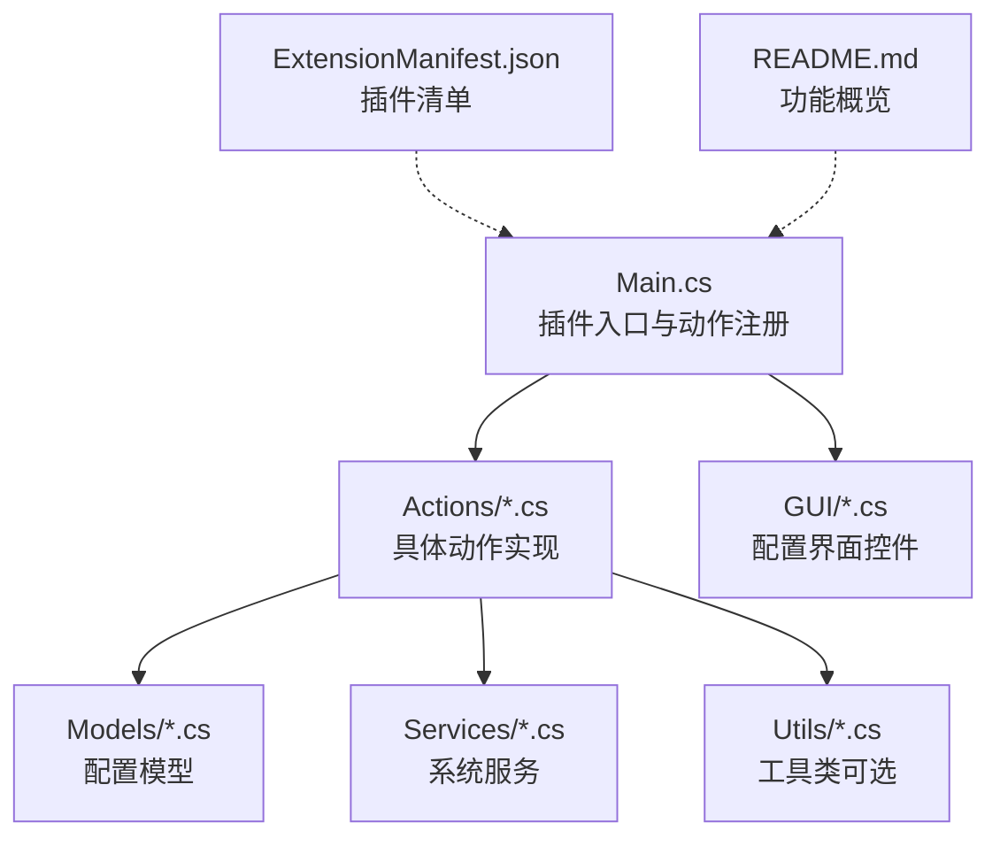
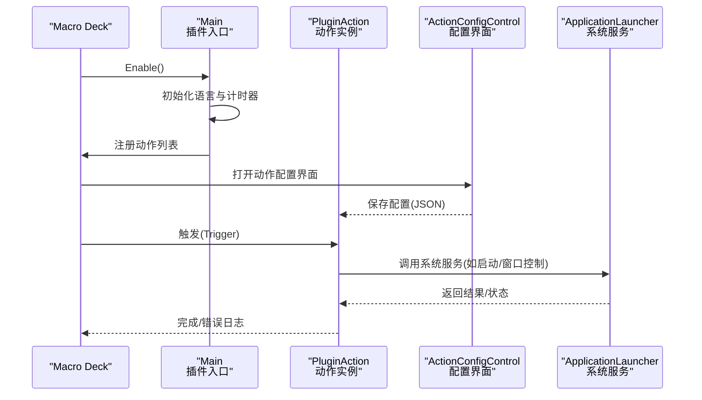
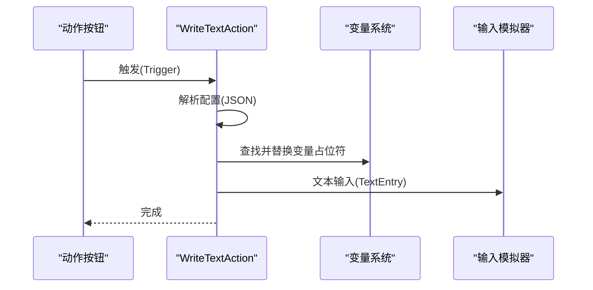
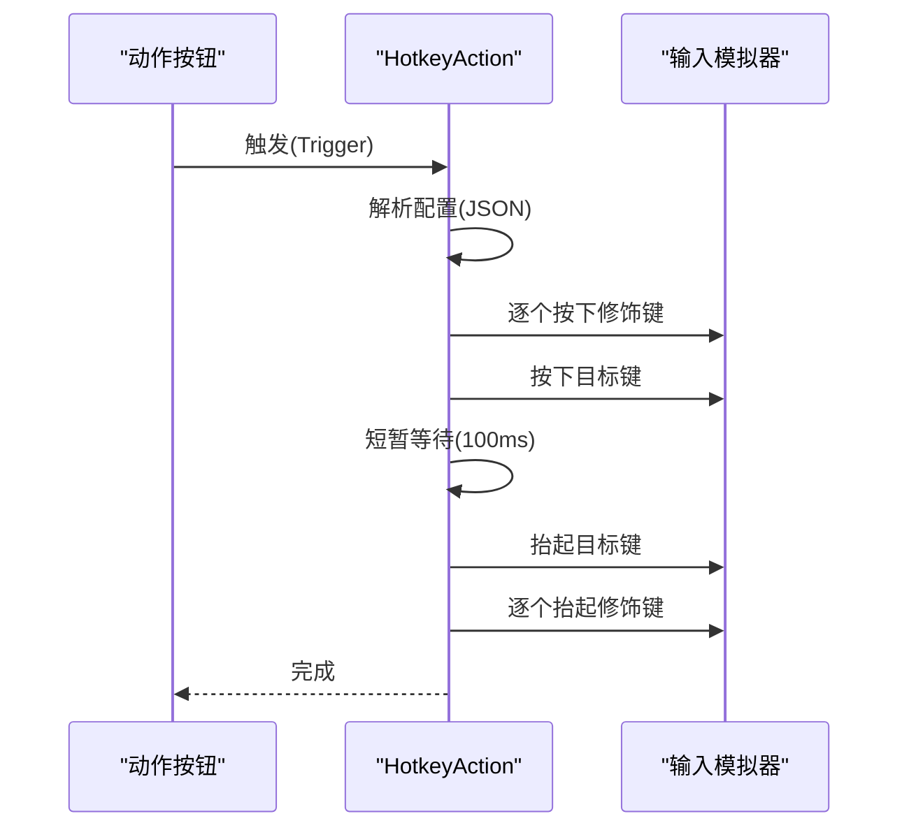
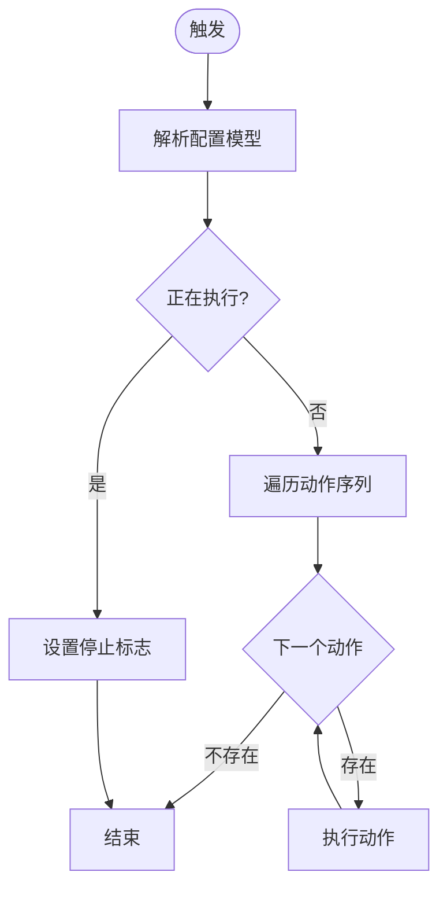
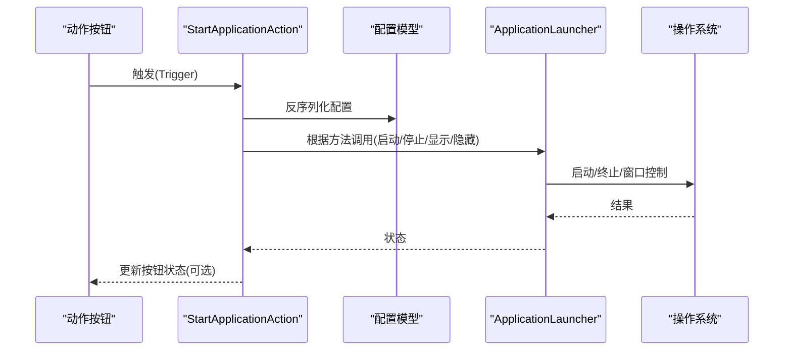
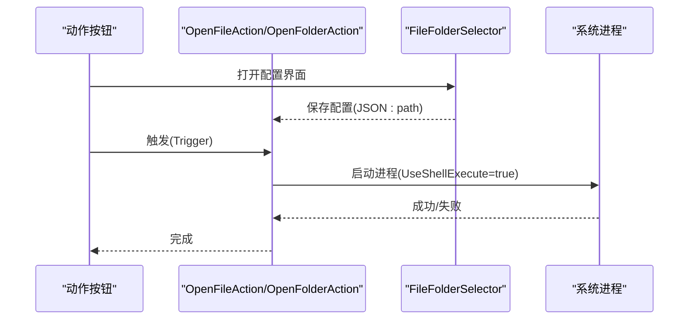
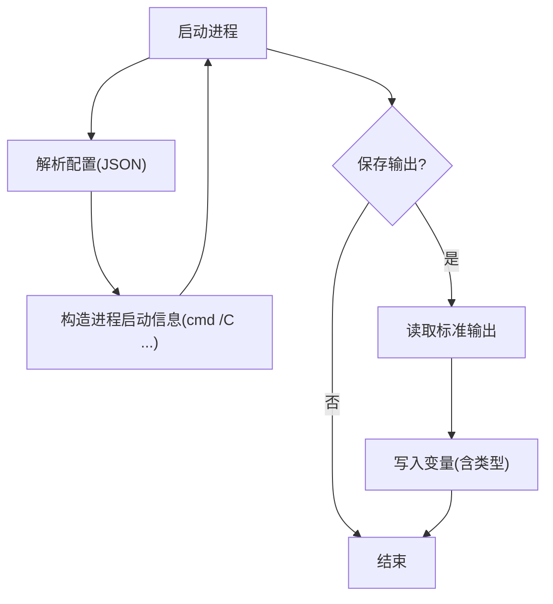
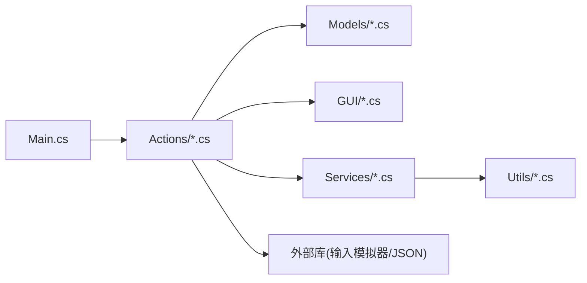

# 核心功能

<cite>
**本文引用的文件**
- [Main.cs](file://Main.cs)
- [ExtensionManifest.json](file://ExtensionManifest.json)
- [README.md](file://README.md)
- [HotkeyAction.cs](file://Actions/HotkeyAction.cs)
- [MultiHotkeyAction.cs](file://Actions/MultiHotkeyAction.cs)
- [WriteTextAction.cs](file://Actions/WriteTextAction.cs)
- [CommandlineAction.cs](file://Actions/CommandlineAction.cs)
- [StartApplicationAction.cs](file://Actions/StartApplicationAction.cs)
- [OpenFileAction.cs](file://Actions/OpenFileAction.cs)
- [OpenFolderAction.cs](file://Actions/OpenFolderAction.cs)
- [ApplicationLauncher.cs](file://Services/ApplicationLauncher.cs)
- [StartApplicationActionConfigModel.cs](file://Models/StartApplicationActionConfigModel.cs)
- [HotkeyConfigurator.cs](file://GUI/HotkeyConfigurator.cs)
- [TextSelector.cs](file://GUI/TextSelector.cs)
- [FileFolderSelector.cs](file://GUI/FileFolderSelector.cs)
</cite>

## 目录
1. [简介](#简介)
2. [项目结构](#项目结构)
3. [核心组件](#核心组件)
4. [架构总览](#架构总览)
5. [详细组件分析](#详细组件分析)
6. [依赖性分析](#依赖性分析)
7. [性能考虑](#性能考虑)
8. [故障排除指南](#故障排除指南)
9. [结论](#结论)
10. [附录](#附录)

## 简介
本文件面向Macro Deck 2的Windows Utils插件使用者与维护者，系统梳理插件提供的核心功能：文本输入与热键系统、应用程序管理、系统控制（音量、麦克风静音、电源选项）、文件与文件夹打开、Windows资源管理器控制、窗口切换以及通知系统。文档从架构、数据流、处理逻辑、配置项与使用场景出发，结合代码级图示与来源标注，帮助读者快速理解并高效使用该插件。

## 项目结构
插件采用“动作（Action）+ 配置界面（GUI）+ 模型（Model）+ 服务（Service）”分层组织，入口在主类中注册全部可用动作；各动作通过JSON配置驱动行为；GUI负责可视化配置与摘要生成；服务封装系统调用（如应用启动/窗口控制）；模型定义可序列化配置结构。

图表来源
- [Main.cs:28-58](file://Main.cs#L28-L58)
- [ExtensionManifest.json:1-11](file://ExtensionManifest.json#L1-L11)
- [README.md:1-40](file://README.md#L1-L40)

章节来源
- [Main.cs:14-58](file://Main.cs#L14-L58)
- [ExtensionManifest.json:1-11](file://ExtensionManifest.json#L1-L11)
- [README.md:1-40](file://README.md#L1-L40)

## 核心组件
- 文本输入与热键系统
  - 写入文本：解析配置中的文本，支持变量替换后通过输入模拟器写入。
  - 热键发送：解析配置中的修饰键与目标键，按顺序按下/释放，兼容部分应用对按键速度敏感的情况。
  - 多重热键：支持配置多个热键序列执行，带停止机制与按钮状态同步。
- 应用程序管理
  - 启动/停止/显示/隐藏：根据路径识别进程，执行启动、终止、前置或最小化。
  - 进程状态同步：通过定时器周期更新按钮状态，反映应用是否运行。
- 系统控制
  - 命令行执行：在指定工作目录执行命令，可选择将输出保存到变量。
  - 文件/文件夹打开：通过Shell执行打开路径。
  - 资源管理器控制：前进/后退/主页/刷新等导航控制（由对应动作实现）。
  - 通知：触发系统通知（由对应动作实现）。
  - 音量/麦克风控制：增加/减少/静音音量与麦克风（由对应动作实现）。
  - 电源选项：关机/重启/睡眠/锁定（由对应动作实现）。
  - 窗口切换：切换到已知应用窗口（由对应动作实现）。

章节来源
- [WriteTextAction.cs:22-45](file://Actions/WriteTextAction.cs#L22-L45)
- [HotkeyAction.cs:29-111](file://Actions/HotkeyAction.cs#L29-L111)
- [MultiHotkeyAction.cs:23-48](file://Actions/MultiHotkeyAction.cs#L23-L48)
- [StartApplicationAction.cs:22-83](file://Actions/StartApplicationAction.cs#L22-L83)
- [ApplicationLauncher.cs:39-163](file://Services/ApplicationLauncher.cs#L39-L163)
- [StartApplicationActionConfigModel.cs:6-36](file://Models/StartApplicationActionConfigModel.cs#L6-L36)
- [CommandlineAction.cs:22-58](file://Actions/CommandlineAction.cs#L22-L58)
- [OpenFileAction.cs:20-40](file://Actions/OpenFileAction.cs#L20-L40)
- [OpenFolderAction.cs:22-42](file://Actions/OpenFolderAction.cs#L22-L42)

## 架构总览
下图展示了插件启用时的动作注册流程、配置界面与动作触发的关系，以及与系统服务的交互。

图表来源
- [Main.cs:28-58](file://Main.cs#L28-L58)
- [StartApplicationAction.cs:52-55](file://Actions/StartApplicationAction.cs#L52-L55)
- [ApplicationLauncher.cs:45-126](file://Services/ApplicationLauncher.cs#L45-L126)

## 详细组件分析

### 文本输入（WriteTextAction）
- 功能说明
  - 解析配置中的文本内容，支持变量占位符替换，随后通过输入模拟器进行文本输入。
- 关键点
  - 变量替换：遍历变量集合，将匹配的占位符替换为变量值。
  - 输入模拟：使用全局输入模拟器进行文本输入。
- 配置要点
  - 配置字段：text（字符串），用于存储待输入的文本。
  - 摘要：截断显示，便于界面阅读。
- 使用场景
  - 在任意输入框快速输入预设文本或动态变量组合。
- 故障处理
  - 异常捕获并记录警告日志，避免中断触发链路。

图表来源
- [WriteTextAction.cs:22-45](file://Actions/WriteTextAction.cs#L22-L45)
- [TextSelector.cs:25-41](file://GUI/TextSelector.cs#L25-L41)

章节来源
- [WriteTextAction.cs:14-51](file://Actions/WriteTextAction.cs#L14-L51)
- [TextSelector.cs:11-77](file://GUI/TextSelector.cs#L11-L77)

### 热键系统（HotkeyAction）
- 功能说明
  - 支持组合键（Win/Ctrl/Shift/Alt左右键）与任意虚拟键，按顺序执行按下/延迟/抬起，提升兼容性。
- 关键点
  - 修饰键枚举与映射：解析配置中的布尔标志，构建修饰键列表。
  - 按键序列：逐个按下修饰键，按下目标键，短暂延迟，再依次抬起，最后抬起修饰键。
- 配置要点
  - 配置字段：lwin/rwin、ctrl/lctrl/rctrl、shift/lshift/rshift、alt/lalt/ralt、key（虚拟键名）。
  - 摘要：拼接修饰键与目标键，直观显示组合方式。
- 使用场景
  - 快速发送系统快捷键（如Win+D、Ctrl+C等）或应用内快捷键。
- 故障处理
  - 异常捕获，避免触发失败导致崩溃。

图表来源
- [HotkeyAction.cs:29-111](file://Actions/HotkeyAction.cs#L29-L111)
- [HotkeyConfigurator.cs:24-53](file://GUI/HotkeyConfigurator.cs#L24-L53)

章节来源
- [HotkeyAction.cs:15-113](file://Actions/HotkeyAction.cs#L15-L113)
- [HotkeyConfigurator.cs:12-96](file://GUI/HotkeyConfigurator.cs#L12-L96)

### 多重热键（MultiHotkeyAction）
- 功能说明
  - 将多个热键动作按序执行，支持停止机制与按钮状态同步。
- 关键点
  - 并发控制：使用标志位与Task异步执行，避免重复执行。
  - 停止机制：通过stop标志中断循环。
  - 状态同步：可选同步按钮状态以反映执行中/完成态。
- 配置要点
  - 配置模型：包含动作序列、同步开关等。
- 使用场景
  - 需要连续发送多个热键序列的自动化场景。
- 故障处理
  - 异常捕获与标志复位，保证后续可再次执行。

图表来源
- [MultiHotkeyAction.cs:23-48](file://Actions/MultiHotkeyAction.cs#L23-L48)

章节来源
- [MultiHotkeyAction.cs:11-57](file://Actions/MultiHotkeyAction.cs#L11-L57)

### 应用程序管理（StartApplicationAction + ApplicationLauncher）
- 功能说明
  - 启动/停止/显示/隐藏指定路径的应用；自动检测运行状态并可同步按钮状态。
- 关键点
  - 路径解析：支持快捷方式解析与真实可执行路径匹配。
  - 窗口控制：前置窗口、最小化、强制恢复等。
  - 进程管理：根据路径查找进程，支持终止同名进程。
- 配置要点
  - 配置模型：path、arguments、runAsAdmin、syncButtonState、startMethod。
  - startMethod：Start/Stop/Show/Hide。
- 使用场景
  - 快速切换常用应用、统一管理应用生命周期。
- 故障处理
  - 日志记录警告信息，避免异常传播。

图表来源
- [StartApplicationAction.cs:22-83](file://Actions/StartApplicationAction.cs#L22-L83)
- [ApplicationLauncher.cs:39-163](file://Services/ApplicationLauncher.cs#L39-L163)
- [StartApplicationActionConfigModel.cs:6-36](file://Models/StartApplicationActionConfigModel.cs#L6-L36)

章节来源
- [StartApplicationAction.cs:14-84](file://Actions/StartApplicationAction.cs#L14-L84)
- [ApplicationLauncher.cs:13-165](file://Services/ApplicationLauncher.cs#L13-L165)
- [StartApplicationActionConfigModel.cs:6-36](file://Models/StartApplicationActionConfigModel.cs#L6-L36)

### 文件与文件夹操作（OpenFileAction/OpenFolderAction + FileFolderSelector）
- 功能说明
  - 通过Shell打开文件或文件夹；支持拖拽选择与对话框选择。
- 关键点
  - 配置校验：区分文件/文件夹类型，防止误选。
  - 图标导入：文件类型可选导入图标（由界面提示决定）。
- 配置要点
  - 配置字段：path（绝对路径）。
  - 摘要：直接显示路径。
- 使用场景
  - 快速打开常用文件/文件夹，配合变量或快捷方式。

图表来源
- [OpenFileAction.cs:20-40](file://Actions/OpenFileAction.cs#L20-L40)
- [OpenFolderAction.cs:22-42](file://Actions/OpenFolderAction.cs#L22-L42)
- [FileFolderSelector.cs:65-117](file://GUI/FileFolderSelector.cs#L65-L117)

章节来源
- [OpenFileAction.cs:12-47](file://Actions/OpenFileAction.cs#L12-L47)
- [OpenFolderAction.cs:14-49](file://Actions/OpenFolderAction.cs#L14-L49)
- [FileFolderSelector.cs:13-189](file://GUI/FileFolderSelector.cs#L13-L189)

### 命令行执行（CommandlineAction）
- 功能说明
  - 在cmd中执行命令，支持工作目录与输出变量保存。
- 关键点
  - 输出读取：当开启保存变量时，读取标准输出并写入指定变量。
  - 类型转换：变量类型由配置指定，写入时进行类型转换。
- 配置要点
  - 配置字段：workingDirectory、command、saveVariable、variableName、variableType。
- 使用场景
  - 执行脚本、查询系统信息并回填到变量供后续动作使用。

图表来源
- [CommandlineAction.cs:22-58](file://Actions/CommandlineAction.cs#L22-L58)

章节来源
- [CommandlineAction.cs:14-65](file://Actions/CommandlineAction.cs#L14-L65)

## 依赖性分析
- 组件耦合
  - 动作类依赖配置模型与GUI控件；GUI控件负责配置持久化与摘要生成。
  - 动作类通过服务类访问系统能力（如应用启动、窗口控制）。
  - 主类持有输入模拟器与定时器，为动作与状态同步提供基础设施。
- 外部依赖
  - 输入模拟器库用于键盘/鼠标事件模拟。
  - JSON序列化用于配置的序列化与反序列化。
  - 宏 decks变量系统用于文本变量替换与输出写入。
- 潜在风险
  - 热键动作对按键顺序敏感，已通过延迟缓解；仍需注意目标应用的输入处理差异。
  - 应用启动/窗口控制依赖进程路径与句柄，路径不一致可能导致识别失败。

图表来源
- [Main.cs:18-26](file://Main.cs#L18-L26)
- [HotkeyAction.cs:1-12](file://Actions/HotkeyAction.cs#L1-L12)
- [StartApplicationAction.cs:1-10](file://Actions/StartApplicationAction.cs#L1-L10)

章节来源
- [Main.cs:14-58](file://Main.cs#L14-L58)
- [HotkeyAction.cs:1-12](file://Actions/HotkeyAction.cs#L1-L12)
- [StartApplicationAction.cs:1-10](file://Actions/StartApplicationAction.cs#L1-L10)

## 性能考虑
- 输入模拟器调用
  - 热键动作在修饰键与目标键之间插入短暂延迟，降低部分应用无法识别的风险，但会增加单次触发耗时。可根据目标应用调整延迟或合并按键序列。
- 应用程序管理
  - 状态同步使用定时器轮询，建议合理设置间隔，避免频繁查询造成CPU占用；仅在需要同步时启用。
- 命令行执行
  - 输出读取为阻塞式，建议在不需要输出时关闭保存变量，减少IO开销。
- GUI交互
  - 文件/文件夹选择器支持拖拽，提升用户体验；注意路径合法性校验与异常捕获。

## 故障排除指南
- 热键无效或被忽略
  - 检查目标键是否正确、修饰键勾选是否符合预期；尝试提高延迟或在目标应用中手动测试相同组合。
  - 参考来源：[HotkeyAction.cs:89-105](file://Actions/HotkeyAction.cs#L89-L105)
- 应用无法启动/找不到进程
  - 确认路径指向真实可执行文件，快捷方式会被解析为目标；检查管理员权限与参数传递。
  - 参考来源：[ApplicationLauncher.cs:128-137](file://Services/ApplicationLauncher.cs#L128-L137)
- 窗口未前置或最小化失败
  - 窗口可能处于最小化状态，回退到最小化后再还原；若句柄无效，检查进程是否仍在运行。
  - 参考来源：[ApplicationLauncher.cs:100-126](file://Services/ApplicationLauncher.cs#L100-L126)
- 文件/文件夹打开失败
  - 确认路径存在且类型匹配；文件选择器会阻止非文件/非文件夹路径。
  - 参考来源：[FileFolderSelector.cs:85-107](file://GUI/FileFolderSelector.cs#L85-L107)
- 命令行无输出或变量为空
  - 确认已启用保存变量并正确设置变量名与类型；检查命令是否产生输出。
  - 参考来源：[CommandlineAction.cs:45-52](file://Actions/CommandlineAction.cs#L45-L52)
- 文本输入变量未替换
  - 检查变量名称大小写与占位符格式；确认变量存在且有值。
  - 参考来源：[WriteTextAction.cs:31-36](file://Actions/WriteTextAction.cs#L31-L36)

## 结论
该插件围绕Windows系统常用操作提供了高可用的动作集，通过清晰的配置界面与稳定的系统服务集成，满足从文本输入、热键发送到应用生命周期管理的多种需求。建议在复杂场景中结合变量系统与状态同步功能，以获得更佳的自动化体验。

## 附录
- 插件清单与版本
  - 清单文件定义了插件类型、名称、作者、版本与目标API版本等元数据。
  - 参考来源：[ExtensionManifest.json:1-11](file://ExtensionManifest.json#L1-L11)
- 功能概览
  - README列出了命令行执行、应用启动、文件/文件夹打开、音量控制、资源管理器控制、热键发送等特性。
  - 参考来源：[README.md:4-19](file://README.md#L4-L19)