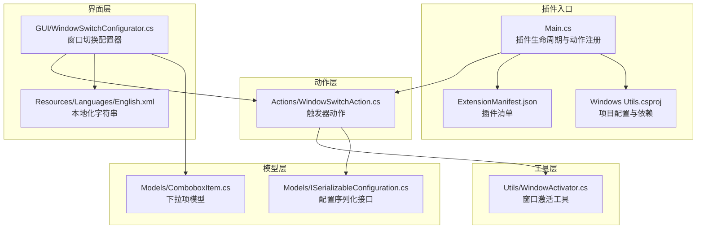
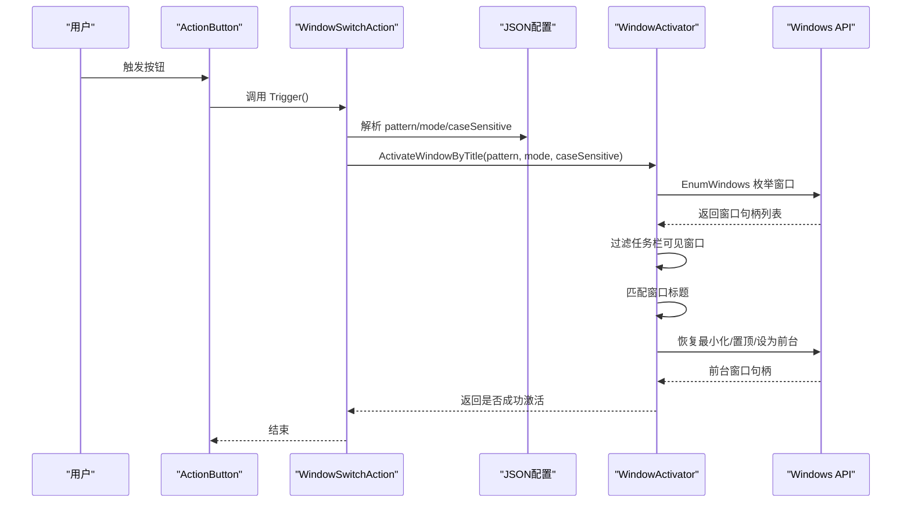
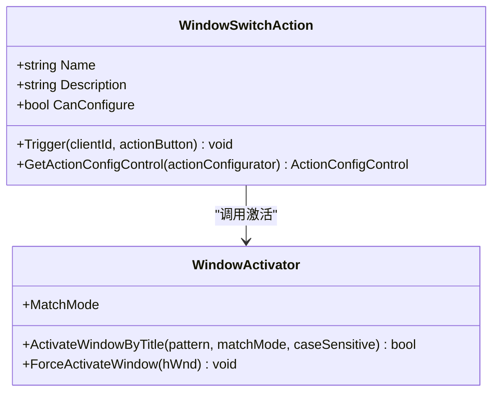
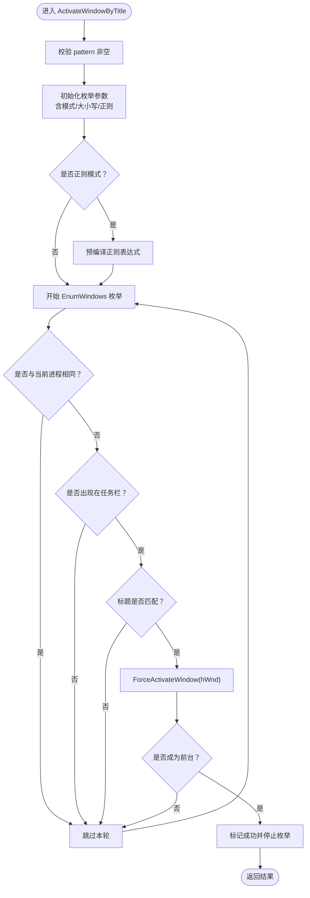
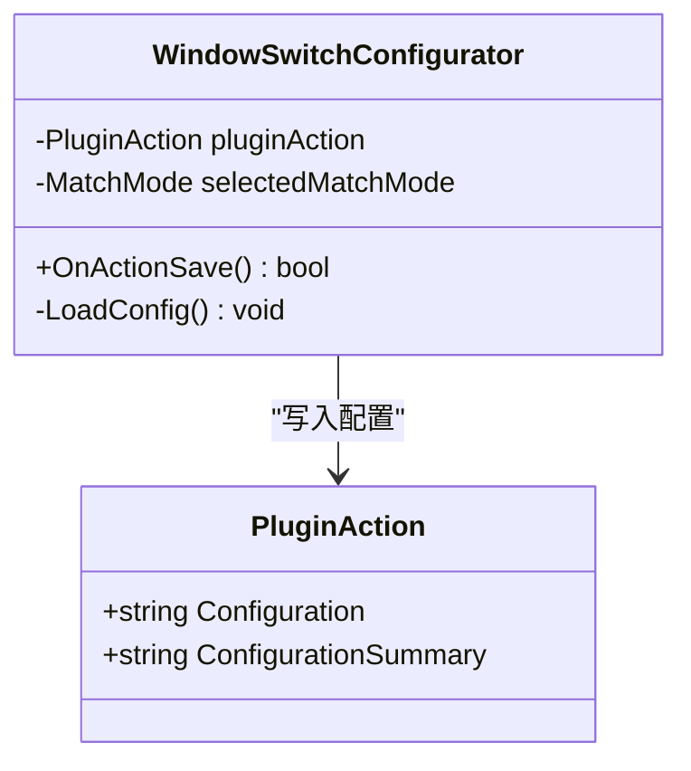
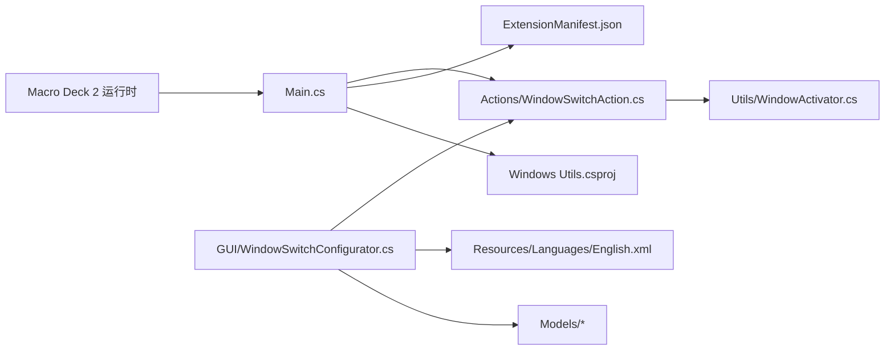

# 窗口管理系统

<cite>
**本文引用的文件**
- [WindowSwitchAction.cs](file://Actions/WindowSwitchAction.cs)
- [WindowActivator.cs](file://Utils/WindowActivator.cs)
- [WindowSwitchConfigurator.cs](file://GUI/WindowSwitchConfigurator.cs)
- [Main.cs](file://Main.cs)
- [ExtensionManifest.json](file://ExtensionManifest.json)
- [English.xml](file://Resources/Languages/English.xml)
- [Windows Utils.csproj](file://Windows Utils.csproj)
- [ISerializableConfiguration.cs](file://Models/ISerializableConfiguration.cs)
- [ComboboxItem.cs](file://Models/ComboboxItem.cs)
</cite>

## 目录
1. [简介](#简介)
2. [项目结构](#项目结构)
3. [核心组件](#核心组件)
4. [架构总览](#架构总览)
5. [详细组件分析](#详细组件分析)
6. [依赖关系分析](#依赖关系分析)
7. [性能考量](#性能考量)
8. [故障排查指南](#故障排查指南)
9. [结论](#结论)
10. [附录](#附录)

## 简介
本项目是为 Macro Deck 2 开发的“Windows 工具”插件，其中包含窗口切换与窗口管理的核心能力。本文聚焦两个关键模块：
- WindowSwitchAction：触发器动作，负责解析配置并调用窗口激活逻辑。
- WindowActivator：底层窗口管理工具，实现窗口枚举、标题匹配、最小化恢复与前台激活等。

系统通过用户在界面上配置的“模式+关键字+大小写敏感”三要素，对系统中可见且出现在任务栏的窗口进行匹配与激活；同时具备正则表达式匹配能力，以满足复杂场景需求。

## 项目结构
项目采用按功能分层的组织方式：
- Actions：宏动作定义（如窗口切换）
- Utils：通用工具（如窗口激活）
- GUI：配置界面控件（如窗口切换配置器）
- Models：配置序列化接口与简单模型
- Resources：语言资源（用于界面文案本地化）
- 根目录：插件入口、清单与构建配置

图表来源
- [Main.cs:14-58](file://Main.cs#L14-L58)
- [WindowSwitchAction.cs:14-46](file://Actions/WindowSwitchAction.cs#L14-L46)
- [WindowActivator.cs:9-256](file://Utils/WindowActivator.cs#L9-L256)
- [WindowSwitchConfigurator.cs:10-78](file://GUI/WindowSwitchConfigurator.cs#L10-L78)
- [ExtensionManifest.json:1-11](file://ExtensionManifest.json#L1-L11)
- [Windows Utils.csproj:1-74](file://Windows Utils.csproj#L1-L74)
- [English.xml:1-62](file://Resources/Languages/English.xml#L1-L62)
- [ISerializableConfiguration.cs:5-11](file://Models/ISerializableConfiguration.cs#L5-L11)
- [ComboboxItem.cs:3-12](file://Models/ComboboxItem.cs#L3-L12)

章节来源
- [Main.cs:14-58](file://Main.cs#L14-L58)
- [ExtensionManifest.json:1-11](file://ExtensionManifest.json#L1-L11)
- [Windows Utils.csproj:1-74](file://Windows Utils.csproj#L1-L74)

## 核心组件
- WindowSwitchAction：作为 Macro Deck 的插件动作，负责从 JSON 配置中读取“模式+关键字+大小写敏感”，并调用 WindowActivator 完成窗口激活。
- WindowActivator：提供多种匹配模式（完全相等、部分包含、前缀、后缀、正则），过滤非任务栏可见窗口，执行最小化恢复与前台激活。
- WindowSwitchConfigurator：图形化配置器，将用户输入序列化为 JSON 并生成配置摘要。

章节来源
- [WindowSwitchAction.cs:14-46](file://Actions/WindowSwitchAction.cs#L14-L46)
- [WindowActivator.cs:14-36](file://Utils/WindowActivator.cs#L14-L36)
- [WindowSwitchConfigurator.cs:10-78](file://GUI/WindowSwitchConfigurator.cs#L10-L78)

## 架构总览
窗口切换流程从按钮触发开始，经由动作解析配置，再委托给窗口激活工具完成实际操作。

图表来源
- [WindowSwitchAction.cs:22-40](file://Actions/WindowSwitchAction.cs#L22-L40)
- [WindowActivator.cs:57-122](file://Utils/WindowActivator.cs#L57-L122)
- [WindowActivator.cs:90-119](file://Utils/WindowActivator.cs#L90-L119)
- [WindowActivator.cs:173-210](file://Utils/WindowActivator.cs#L173-L210)

## 详细组件分析

### WindowSwitchAction 组件分析
职责与行为
- 动作名称与描述来自语言资源。
- 支持配置编辑，返回配置器实例。
- 触发时解析 JSON 配置，调用 WindowActivator 的激活方法。

关键点
- 使用 Newtonsoft.Json 解析配置对象。
- 将匹配模式转换为枚举值。
- 异常捕获并记录日志。

图表来源
- [WindowSwitchAction.cs:14-46](file://Actions/WindowSwitchAction.cs#L14-L46)
- [WindowActivator.cs:57-122](file://Utils/WindowActivator.cs#L57-L122)

章节来源
- [WindowSwitchAction.cs:14-46](file://Actions/WindowSwitchAction.cs#L14-L46)

### WindowActivator 组件分析
职责与行为
- 提供多种匹配模式：完全相等、部分包含、前缀、后缀、正则。
- 过滤非任务栏可见窗口（排除工具窗口、无重定向位图、拥有者非 AppWindow 或其图标化的窗口）。
- 对最小化的窗口先恢复，再执行置顶、设为前台、设置焦点等操作。
- 使用 P/Invoke 调用 user32/kernel32 API 完成窗口枚举与状态控制。

匹配算法与策略
- 文本匹配：根据大小写敏感性选择 Ordinal 或 OrdinalIgnoreCase。
- 正则匹配：预编译正则表达式，支持大小写敏感选项。
- 任务栏可见性：基于窗口样式与扩展样式的组合判断。

激活机制
- 若目标窗口最小化，则先恢复。
- 若当前线程与前台窗口线程不同，临时附加输入以避免前台切换失败。
- 设置置顶、显示、焦点等，确保窗口被正确激活。

图表来源
- [WindowActivator.cs:57-122](file://Utils/WindowActivator.cs#L57-L122)
- [WindowActivator.cs:90-119](file://Utils/WindowActivator.cs#L90-L119)
- [WindowActivator.cs:124-140](file://Utils/WindowActivator.cs#L124-L140)
- [WindowActivator.cs:142-171](file://Utils/WindowActivator.cs#L142-L171)
- [WindowActivator.cs:173-210](file://Utils/WindowActivator.cs#L173-L210)

章节来源
- [WindowActivator.cs:14-36](file://Utils/WindowActivator.cs#L14-L36)
- [WindowActivator.cs:57-122](file://Utils/WindowActivator.cs#L57-L122)
- [WindowActivator.cs:124-140](file://Utils/WindowActivator.cs#L124-L140)
- [WindowActivator.cs:142-171](file://Utils/WindowActivator.cs#L142-L171)
- [WindowActivator.cs:173-210](file://Utils/WindowActivator.cs#L173-L210)

### WindowSwitchConfigurator 组件分析
职责与行为
- 初始化界面元素，动态填充匹配模式下拉框。
- 保存配置到 JSON 字符串，包含 pattern、matchMode、caseSensitive。
- 生成配置摘要，便于用户快速确认。

图表来源
- [WindowSwitchConfigurator.cs:10-78](file://GUI/WindowSwitchConfigurator.cs#L10-L78)

章节来源
- [WindowSwitchConfigurator.cs:10-78](file://GUI/WindowSwitchConfigurator.cs#L10-L78)
- [English.xml:55-61](file://Resources/Languages/English.xml#L55-L61)

### 插件入口与集成
- Main 类负责插件生命周期与动作注册，将 WindowSwitchAction 注册到 Macro Deck。
- ExtensionManifest 描述插件元数据与版本要求。
- Windows Utils.csproj 定义目标框架、平台、依赖与构建后事件。

章节来源
- [Main.cs:14-58](file://Main.cs#L14-L58)
- [ExtensionManifest.json:1-11](file://ExtensionManifest.json#L1-L11)
- [Windows Utils.csproj:1-74](file://Windows Utils.csproj#L1-L74)

## 依赖关系分析
- 外部依赖：Macro Deck 2（运行时宿主）、Newtonsoft.Json（配置序列化）、H.InputSimulator（输入模拟）、System.Drawing.Common（图像处理）。
- 内部依赖：Actions 依赖 Utils；GUI 依赖语言资源与 Models；Main 负责动作注册与插件生命周期。

图表来源
- [Main.cs:28-49](file://Main.cs#L28-L49)
- [WindowSwitchAction.cs:10](file://Actions/WindowSwitchAction.cs#L10)
- [WindowActivator.cs:1-5](file://Utils/WindowActivator.cs#L1-L5)
- [WindowSwitchConfigurator.cs:1-6](file://GUI/WindowSwitchConfigurator.cs#L1-L6)
- [Windows Utils.csproj:36-39](file://Windows Utils.csproj#L36-L39)

章节来源
- [Windows Utils.csproj:36-39](file://Windows Utils.csproj#L36-L39)
- [Main.cs:28-49](file://Main.cs#L28-L49)

## 性能考量
- 窗口枚举成本：系统会遍历所有顶层窗口，匹配与文本读取存在开销。建议优先使用更精确的匹配模式（如 StartsWith/EndsWith/Full）减少回溯。
- 正则匹配：预编译正则表达式可降低重复编译开销；但正则本身较重，仅在必要时启用。
- 最小化恢复：对最小化窗口先恢复再置顶，避免不必要的多次切换。
- 线程附加：仅在当前线程与前台线程不一致时才附加输入，减少额外开销。
- 任务栏可见性过滤：提前剔除工具窗口与非 AppWindow 的拥有者窗口，缩小候选集。

[本节为通用性能建议，无需特定文件引用]

## 故障排查指南
常见问题与解决思路
- 无法找到目标窗口
  - 检查匹配模式与大小写设置是否合理。
  - 确认目标窗口是否出现在任务栏（工具窗口、无重定向位图窗口会被过滤）。
  - 若使用正则，请检查正则表达式有效性。
- 窗口未被激活
  - 确认前台切换是否成功（函数返回值与前台句柄对比）。
  - 检查是否存在多显示器环境下的焦点丢失（系统行为差异）。
- 配置保存失败
  - 界面保存时若任一字段为空会返回失败；请确保完整填写 pattern、matchMode、caseSensitive。
- 日志与异常
  - 动作触发时的异常会被记录；可在日志中查看错误信息定位问题。

章节来源
- [WindowActivator.cs:74-88](file://Utils/WindowActivator.cs#L74-L88)
- [WindowSwitchAction.cs:35-39](file://Actions/WindowSwitchAction.cs#L35-L39)
- [WindowSwitchConfigurator.cs:41-44](file://GUI/WindowSwitchConfigurator.cs#L41-L44)

## 结论
该窗口管理系统通过简洁的动作与强大的工具类实现了灵活的窗口切换能力。其设计遵循“配置驱动 + 可视化界面”的原则，既适合新手快速上手，也能满足高级用户的复杂需求。建议在生产环境中结合具体业务场景选择合适的匹配模式与大小写策略，以获得最佳性能与稳定性。

[本节为总结性内容，无需特定文件引用]

## 附录

### 配置示例与最佳实践
- 窗口标题匹配
  - 使用“部分包含”匹配通用标题片段；使用“前缀/后缀/完全相等”提高精确度。
  - 启用大小写敏感可避免误匹配，但需确保输入与标题一致。
- 正则表达式匹配
  - 适用于动态标题（如带时间戳或编号）；注意正则语法与性能。
- 进程名过滤与窗口类识别
  - 当前实现基于窗口标题匹配；若需按进程或窗口类过滤，可在现有工具基础上扩展（例如增加进程 ID 判断与窗口类名读取）。
- 窗口状态检测与最小化处理
  - 系统自动检测最小化并恢复；若需要保留最小化状态，可在调用前增加条件判断。
- 多显示器支持
  - 置顶与前台切换通常跨显示器生效；若出现焦点异常，可尝试在不同显示器间手动切换一次以刷新状态。

[本节为概念性指导，无需特定文件引用]

### 数据模型与序列化
- 配置序列化接口：提供统一的序列化与反序列化能力，便于扩展其他动作配置。
- 下拉项模型：用于界面控件的数据绑定与显示。

章节来源
- [ISerializableConfiguration.cs:5-11](file://Models/ISerializableConfiguration.cs#L5-L11)
- [ComboboxItem.cs:3-12](file://Models/ComboboxItem.cs#L3-L12)