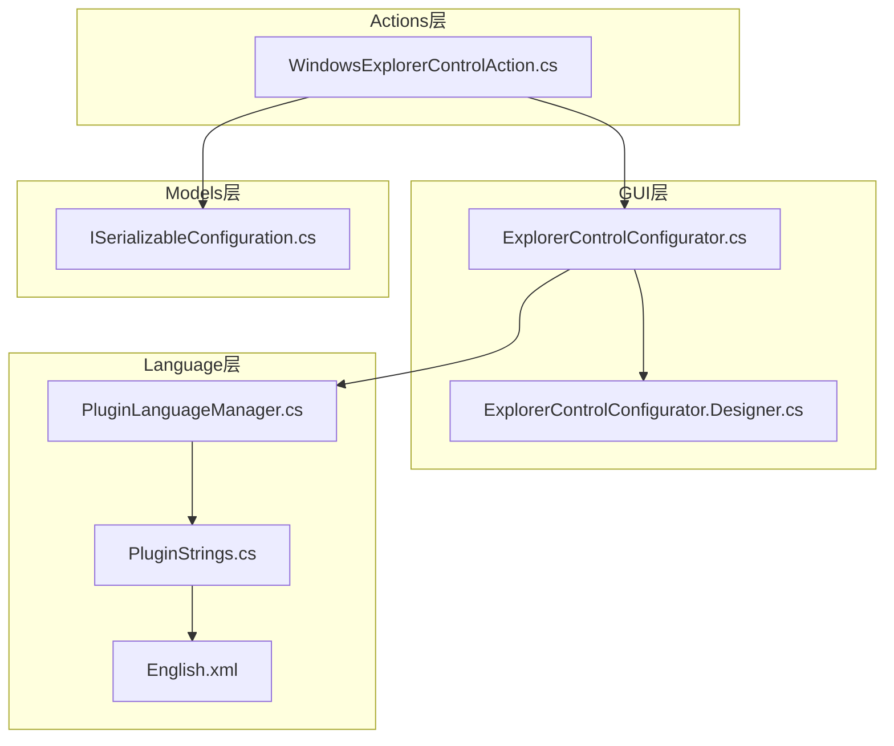
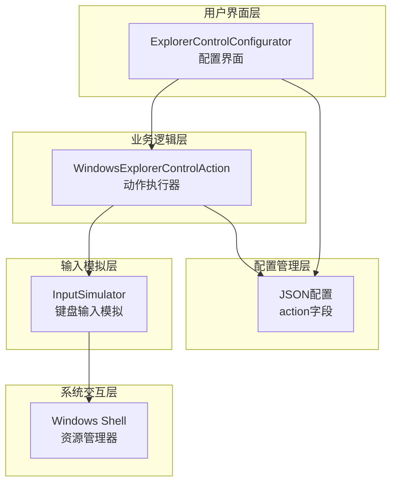
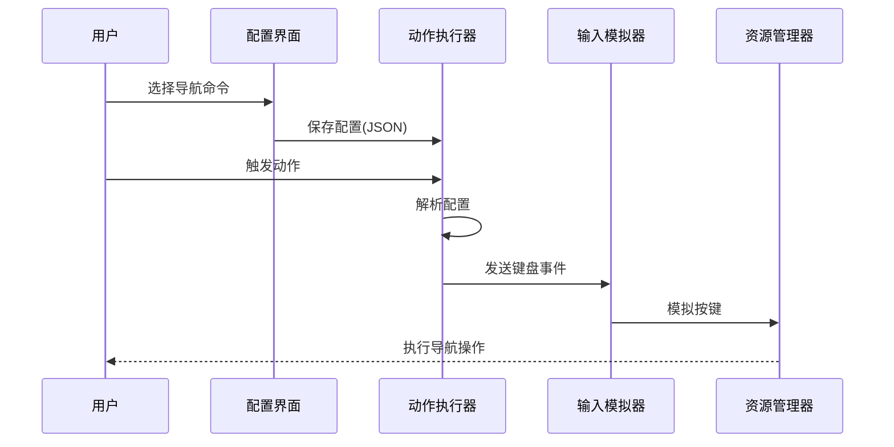
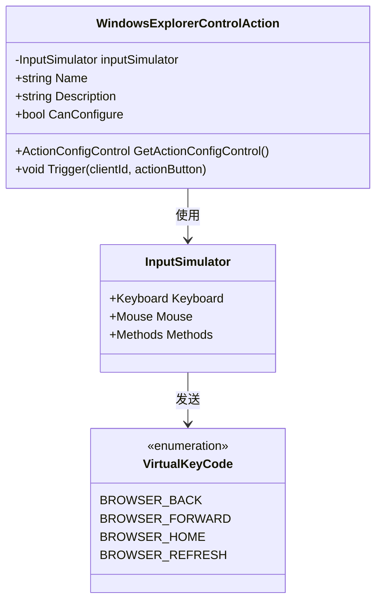
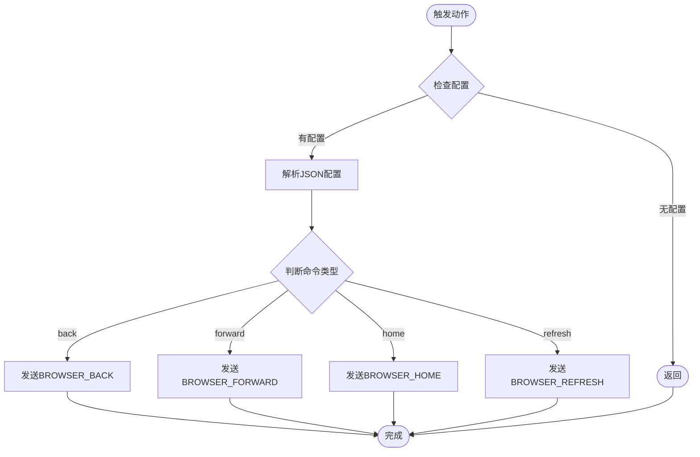
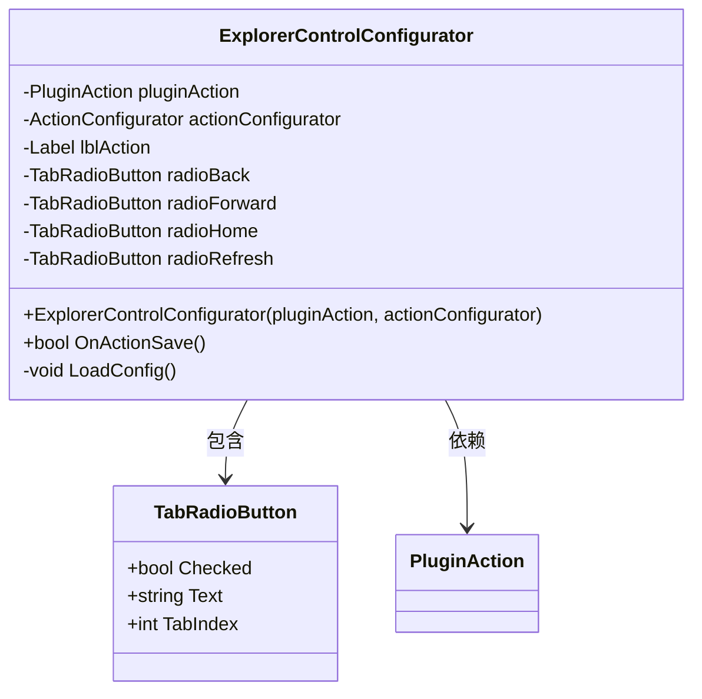
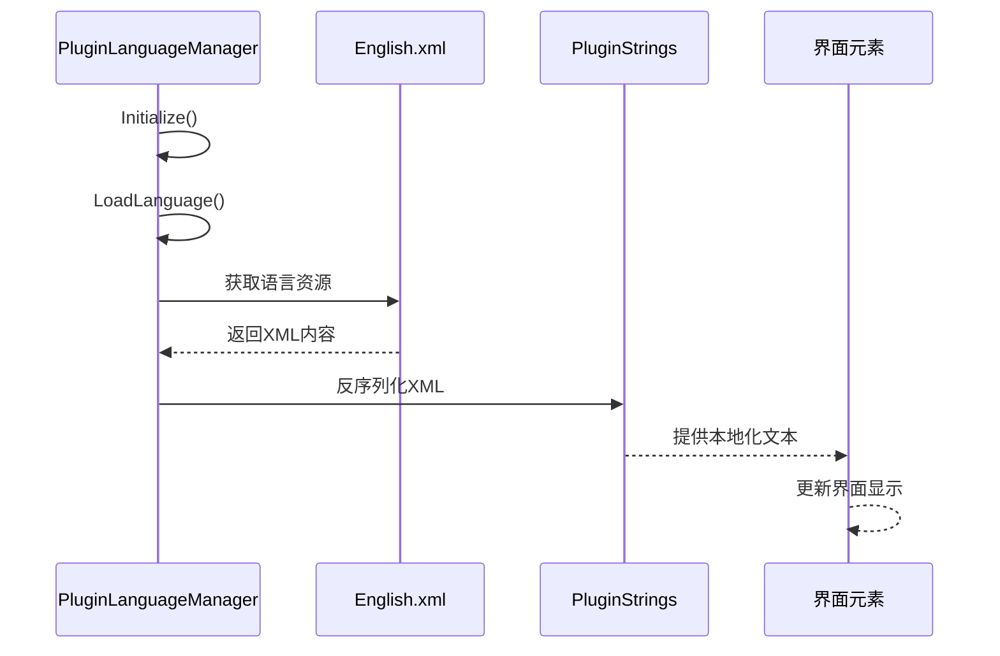
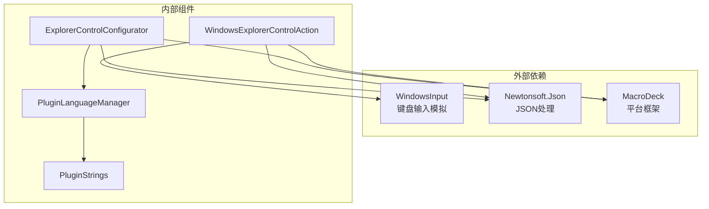

# 系统导航功能

<cite>
**本文档引用的文件**
- [WindowsExplorerControlAction.cs](file://Actions/WindowsExplorerControlAction.cs)
- [ExplorerControlConfigurator.cs](file://GUI/ExplorerControlConfigurator.cs)
- [ExplorerControlConfigurator.Designer.cs](file://GUI/ExplorerControlConfigurator.Designer.cs)
- [PluginLanguageManager.cs](file://Language/PluginLanguageManager.cs)
- [PluginStrings.cs](file://Language/PluginStrings.cs)
- [English.xml](file://Resources/Languages/English.xml)
- [ISerializableConfiguration.cs](file://Models/ISerializableConfiguration.cs)
</cite>

## 目录
1. [简介](#简介)
2. [项目结构](#项目结构)
3. [核心组件](#核心组件)
4. [架构概览](#架构概览)
5. [详细组件分析](#详细组件分析)
6. [依赖关系分析](#依赖关系分析)
7. [性能考虑](#性能考虑)
8. [故障排除指南](#故障排除指南)
9. [结论](#结论)

## 简介

系统导航功能是Macro Deck Windows Utils插件中的一个核心功能模块，专门用于控制Windows资源管理器的导航操作。该功能通过模拟键盘输入的方式，向当前活动的资源管理器窗口发送浏览器导航命令，实现前进、后退、主页跳转和页面刷新等操作。

本功能主要面向需要通过外部设备（如触摸屏控制器、按键面板等）进行资源管理器导航的用户场景，提供了直观易用的配置界面和可靠的执行机制。

## 项目结构

系统导航功能在项目中的组织结构如下：



**图表来源**
- [WindowsExplorerControlAction.cs:1-52](file://Actions/WindowsExplorerControlAction.cs#L1-L52)
- [ExplorerControlConfigurator.cs:1-82](file://GUI/ExplorerControlConfigurator.cs#L1-L82)
- [PluginLanguageManager.cs:1-51](file://Language/PluginLanguageManager.cs#L1-L51)

**章节来源**
- [WindowsExplorerControlAction.cs:1-52](file://Actions/WindowsExplorerControlAction.cs#L1-L52)
- [ExplorerControlConfigurator.cs:1-82](file://GUI/ExplorerControlConfigurator.cs#L1-L82)

## 核心组件

系统导航功能由以下核心组件构成：

### 主要功能组件

1. **WindowsExplorerControlAction**: 主要的动作执行类，负责解析配置并触发相应的导航命令
2. **ExplorerControlConfigurator**: 配置界面控件，提供用户友好的配置界面
3. **语言管理系统**: 支持多语言本地化显示
4. **配置序列化接口**: 提供配置数据的序列化和反序列化能力

### 导航命令类型

系统支持四种基本的导航操作：
- **后退 (Back)**: 模拟浏览器后退按钮功能
- **前进 (Forward)**: 模拟浏览器前进按钮功能  
- **主页 (Home)**: 模拟浏览器主页按钮功能
- **刷新 (Refresh)**: 模拟浏览器刷新按钮功能

**章节来源**
- [WindowsExplorerControlAction.cs:35-47](file://Actions/WindowsExplorerControlAction.cs#L35-L47)
- [ExplorerControlConfigurator.cs:29-51](file://GUI/ExplorerControlConfigurator.cs#L29-L51)

## 架构概览

系统导航功能采用分层架构设计，确保了良好的可维护性和扩展性：



**图表来源**
- [WindowsExplorerControlAction.cs:20](file://Actions/WindowsExplorerControlAction.cs#L20)
- [WindowsExplorerControlAction.cs:32](file://Actions/WindowsExplorerControlAction.cs#L32)

### 数据流架构



**图表来源**
- [ExplorerControlConfigurator.cs:29-51](file://GUI/ExplorerControlConfigurator.cs#L29-L51)
- [WindowsExplorerControlAction.cs:27-50](file://Actions/WindowsExplorerControlAction.cs#L27-L50)

## 详细组件分析

### WindowsExplorerControlAction 组件分析

该组件是系统导航功能的核心执行单元，实现了完整的导航命令处理逻辑。

#### 类结构设计



**图表来源**
- [WindowsExplorerControlAction.cs:12-51](file://Actions/WindowsExplorerControlAction.cs#L12-L51)

#### 导航命令实现原理

系统通过以下机制实现各种导航功能：

1. **配置解析**: 使用JSON格式存储导航命令类型
2. **键盘模拟**: 通过WindowsInput库模拟浏览器专用键
3. **异常处理**: 包装所有操作以防止崩溃

#### 触发流程分析



**图表来源**
- [WindowsExplorerControlAction.cs:27-50](file://Actions/WindowsExplorerControlAction.cs#L27-L50)

**章节来源**
- [WindowsExplorerControlAction.cs:12-51](file://Actions/WindowsExplorerControlAction.cs#L12-L51)

### ExplorerControlConfigurator 组件分析

该组件提供了用户友好的图形化配置界面，支持四种导航命令的选择。

#### 界面组件结构



**图表来源**
- [ExplorerControlConfigurator.cs:9-81](file://GUI/ExplorerControlConfigurator.cs#L9-L81)

#### 配置保存机制

配置数据以JSON格式存储，包含以下结构：
```json
{
  "action": "back"  // 可选值: back, forward, home, refresh
}
```

**章节来源**
- [ExplorerControlConfigurator.cs:29-78](file://GUI/ExplorerControlConfigurator.cs#L29-L78)

### 语言管理系统分析

系统支持多语言本地化，通过XML资源文件实现动态语言切换。

#### 语言加载流程



**图表来源**
- [PluginLanguageManager.cs:12-33](file://Language/PluginLanguageManager.cs#L12-L33)

**章节来源**
- [PluginLanguageManager.cs:8-50](file://Language/PluginLanguageManager.cs#L8-L50)
- [English.xml:21-34](file://Resources/Languages/English.xml#L21-L34)

## 依赖关系分析

系统导航功能的依赖关系清晰明确，遵循了良好的分层设计原则。



**图表来源**
- [WindowsExplorerControlAction.cs:1-8](file://Actions/WindowsExplorerControlAction.cs#L1-L8)
- [ExplorerControlConfigurator.cs:1-5](file://GUI/ExplorerControlConfigurator.cs#L1-L5)

### 外部依赖分析

1. **WindowsInput库**: 提供跨平台的输入模拟功能
2. **Newtonsoft.Json**: 处理JSON配置数据的序列化和反序列化
3. **MacroDeck框架**: 提供插件开发的基础架构

### 内部依赖关系

- ExplorerControlConfigurator依赖于PluginLanguageManager进行本地化
- WindowsExplorerControlAction依赖于ExplorerControlConfigurator进行配置管理
- 所有组件都依赖于MacroDeck的Action基类框架

**章节来源**
- [WindowsExplorerControlAction.cs:1-8](file://Actions/WindowsExplorerControlAction.cs#L1-L8)
- [ExplorerControlConfigurator.cs:1-5](file://GUI/ExplorerControlConfigurator.cs#L1-L5)

## 性能考虑

系统导航功能在设计时充分考虑了性能和资源使用效率：

### 内存使用优化
- InputSimulator实例在类级别创建，避免重复分配
- JSON解析仅在触发时进行，减少不必要的计算开销
- 配置数据存储采用轻量级JSON格式

### 执行效率
- 键盘事件发送是异步操作，不会阻塞主线程
- 每个导航操作只发送单个虚拟按键事件
- 异常处理采用最小化try-catch块，避免影响正常执行路径

### 资源管理
- 界面控件正确实现Dispose模式，防止内存泄漏
- 配置数据使用字符串存储，减少序列化开销

## 故障排除指南

### 常见问题及解决方案

#### 问题1: 导航命令无效
**症状**: 触发动作后资源管理器没有响应
**可能原因**:
- 当前活动窗口不是资源管理器
- 资源管理器未获得焦点
- 配置数据损坏

**解决方法**:
1. 确保资源管理器窗口处于前台状态
2. 重新配置导航命令
3. 检查配置数据格式是否正确

#### 问题2: 配置界面无法保存
**症状**: 修改导航命令后点击保存无反应
**可能原因**:
- 配置数据格式错误
- JSON解析异常

**解决方法**:
1. 重新选择导航命令
2. 清除现有配置并重新设置
3. 检查日志输出获取详细错误信息

#### 问题3: 语言显示异常
**症状**: 界面文本显示为英文或乱码
**可能原因**:
- 语言资源文件缺失
- XML格式错误

**解决方法**:
1. 确认English.xml文件存在且完整
2. 检查XML文件编码格式
3. 重启Macro Deck应用

**章节来源**
- [WindowsExplorerControlAction.cs:49](file://Actions/WindowsExplorerControlAction.cs#L49)
- [ExplorerControlConfigurator.cs:49](file://GUI/ExplorerControlConfigurator.cs#L49)

## 结论

系统导航功能通过简洁而高效的架构设计，成功实现了对Windows资源管理器的远程导航控制。该功能具有以下特点：

### 技术优势
- **简单可靠**: 通过模拟标准浏览器按键实现导航，技术成熟稳定
- **易于使用**: 提供直观的图形化配置界面
- **扩展性强**: 基于JSON配置，便于未来功能扩展
- **性能优秀**: 最小化资源占用和执行开销

### 应用价值
- 满足了通过外部设备控制资源管理器的需求
- 为自动化场景提供了基础的导航能力
- 体现了宏命令平台的灵活性和可扩展性

### 发展建议
- 可考虑添加更多导航选项，如地址栏操作、标签页管理等
- 增加配置验证和错误提示功能
- 考虑支持更多类型的窗口和应用程序

该功能为Macro Deck插件生态系统提供了重要的导航控制能力，为用户提供了更加便捷的资源管理体验。