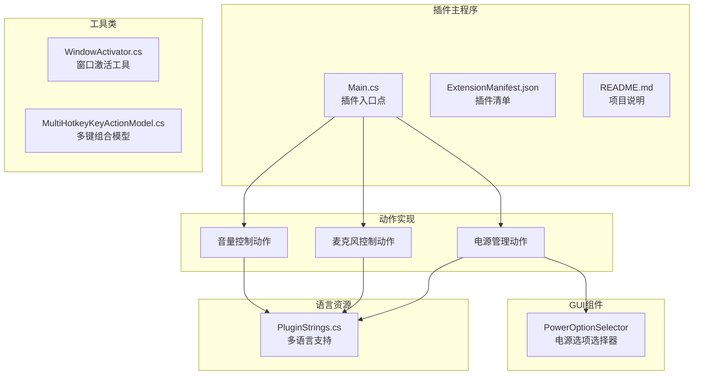
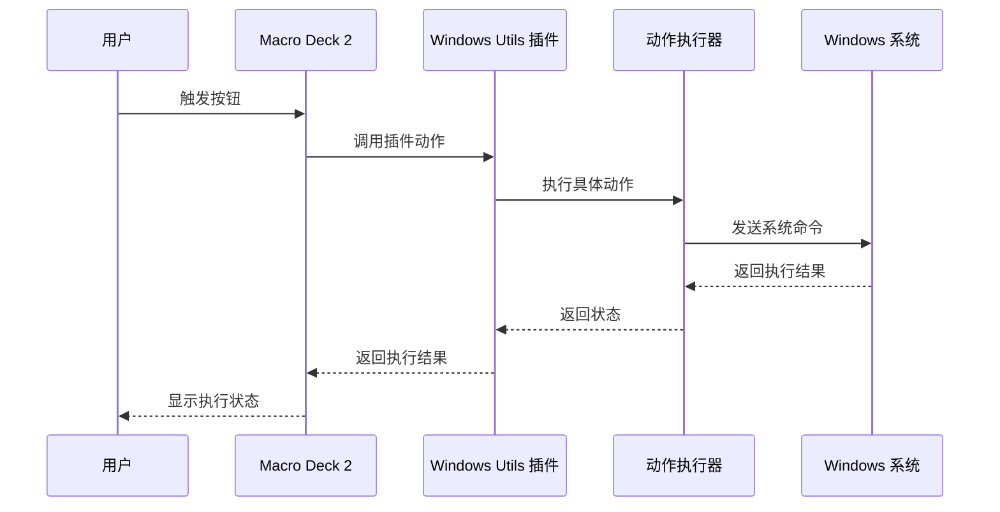
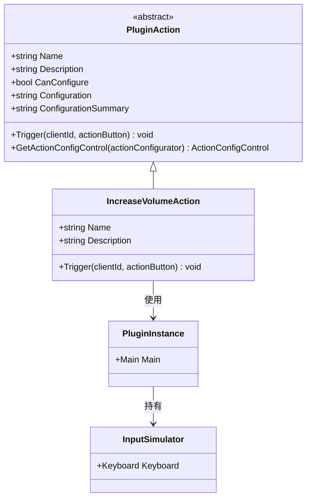
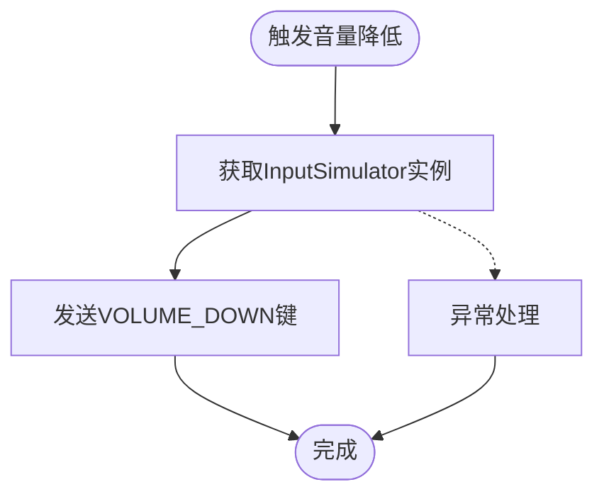
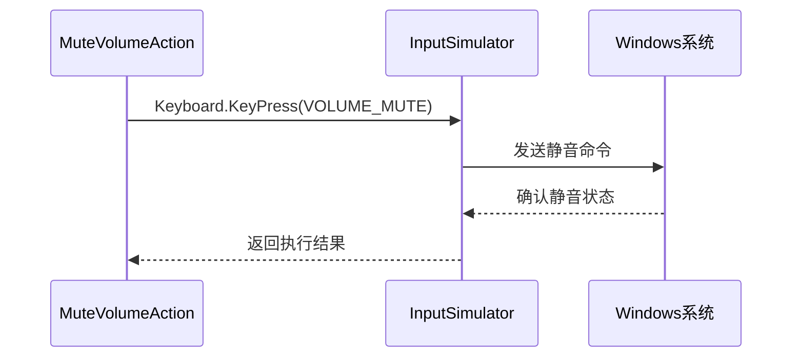
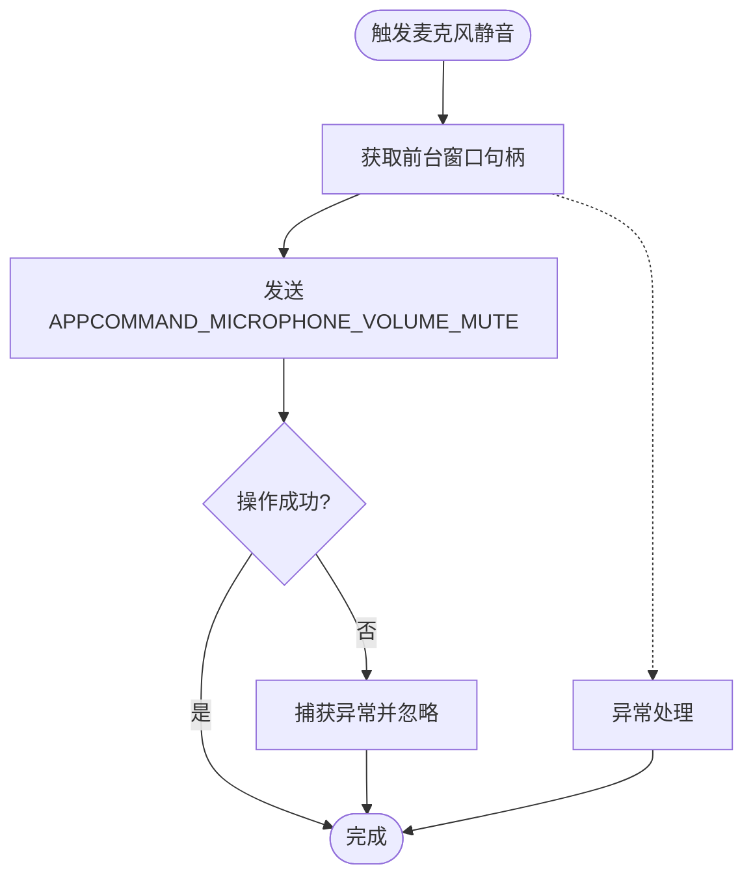
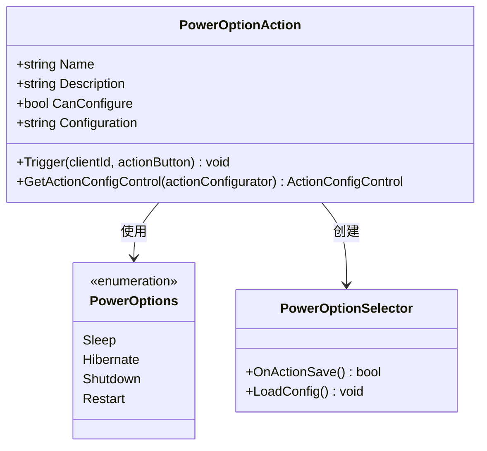
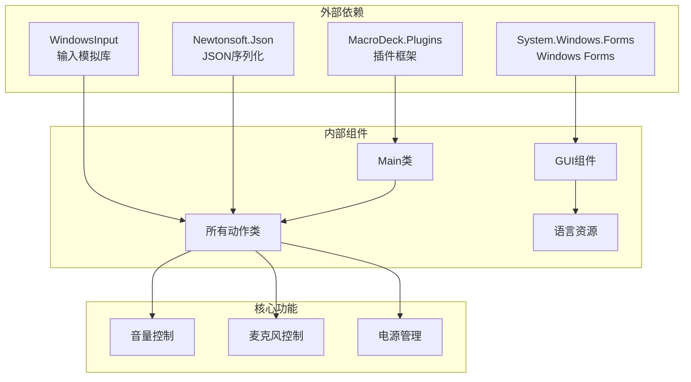

# 系统控制功能

<cite>
**本文档引用的文件**
- [IncreaseVolumeAction.cs](file://Actions/IncreaseVolumeAction.cs)
- [DecreaseVolumeAction.cs](file://Actions/DecreaseVolumeAction.cs)
- [MuteVolume.cs](file://Actions/MuteVolume.cs)
- [MuteMicrophoneAction.cs](file://Actions/MuteMicrophoneAction.cs)
- [PowerOptionAction.cs](file://Actions/PowerOptionAction.cs)
- [PowerOptionSelector.cs](file://GUI/PowerOptionSelector.cs)
- [PluginStrings.cs](file://Language/PluginStrings.cs)
- [Main.cs](file://Main.cs)
- [ExtensionManifest.json](file://ExtensionManifest.json)
- [README.md](file://README.md)
- [MultiHotkeyKeyActionModel.cs](file://Models/MultiHotkeyKeyActionModel.cs)
- [WindowActivator.cs](file://Utils/WindowActivator.cs)
</cite>

## 目录
1. [简介](#简介)
2. [项目结构](#项目结构)
3. [核心组件](#核心组件)
4. [架构概览](#架构概览)
5. [详细组件分析](#详细组件分析)
6. [依赖关系分析](#依赖关系分析)
7. [性能考虑](#性能考虑)
8. [故障排除指南](#故障排除指南)
9. [结论](#结论)

## 简介

本文件详细介绍了Macro Deck Windows Utils插件中的系统控制功能，重点涵盖音量控制系列动作（IncreaseVolume、DecreaseVolume、MuteVolume）和麦克风静音功能（MuteMicrophoneAction），以及电源管理选项（PowerOptionAction）。该插件为Macro Deck 2提供了Windows系统控制能力，通过模拟键盘输入和Windows API调用来实现各种系统级操作。

## 项目结构

该插件采用模块化设计，主要包含以下关键目录和文件：

**图表来源**
- [Main.cs:14-59](file://Main.cs#L14-L59)
- [ExtensionManifest.json:1-11](file://ExtensionManifest.json#L1-L11)

**章节来源**
- [Main.cs:14-59](file://Main.cs#L14-L59)
- [ExtensionManifest.json:1-11](file://ExtensionManifest.json#L1-L11)
- [README.md:1-40](file://README.md#L1-L40)

## 核心组件

本插件的核心功能由以下五个主要组件构成：

### 音量控制系列动作

1. **IncreaseVolumeAction** - 增加系统音量
2. **DecreaseVolumeAction** - 降低系统音量  
3. **MuteVolumeAction** - 静音系统音量

### 麦克风控制动作

4. **MuteMicrophoneAction** - 静音默认麦克风

### 电源管理动作

5. **PowerOptionAction** - 系统电源选项控制

**章节来源**
- [IncreaseVolumeAction.cs:8-18](file://Actions/IncreaseVolumeAction.cs#L8-L18)
- [DecreaseVolumeAction.cs:8-18](file://Actions/DecreaseVolumeAction.cs#L8-L18)
- [MuteVolume.cs:8-18](file://Actions/MuteVolume.cs#L8-L18)
- [MuteMicrophoneAction.cs:9-34](file://Actions/MuteMicrophoneAction.cs#L9-L34)
- [PowerOptionAction.cs:14-61](file://Actions/PowerOptionAction.cs#L14-L61)

## 架构概览

插件采用基于事件驱动的架构模式，通过Macro Deck的插件框架进行集成：

**图表来源**
- [Main.cs:31-50](file://Main.cs#L31-L50)
- [PowerOptionAction.cs:22-55](file://Actions/PowerOptionAction.cs#L22-L55)

## 详细组件分析

### 音量控制系列动作

#### IncreaseVolumeAction 实现分析

音量增加动作通过模拟键盘按键来实现系统音量调节：

**图表来源**
- [IncreaseVolumeAction.cs:8-18](file://Actions/IncreaseVolumeAction.cs#L8-L18)
- [Main.cs:18](file://Main.cs#L18)

#### DecreaseVolumeAction 实现分析

音量降低动作与增加动作类似，只是触发不同的虚拟键码：

**图表来源**
- [DecreaseVolumeAction.cs:14-17](file://Actions/DecreaseVolumeAction.cs#L14-L17)
- [Main.cs:18](file://Main.cs#L18)

#### MuteVolumeAction 实现分析

音量静音动作通过模拟VOLUME_MUTE键实现：

**图表来源**
- [MuteVolume.cs:14-17](file://Actions/MuteVolume.cs#L14-L17)
- [Main.cs:18](file://Main.cs#L18)

**章节来源**
- [IncreaseVolumeAction.cs:8-18](file://Actions/IncreaseVolumeAction.cs#L8-L18)
- [DecreaseVolumeAction.cs:8-18](file://Actions/DecreaseVolumeAction.cs#L8-L18)
- [MuteVolume.cs:8-18](file://Actions/MuteVolume.cs#L8-L18)

### 麦克风静音功能

#### MuteMicrophoneAction 技术实现

麦克风静音功能通过Windows消息机制实现，直接向前台应用程序发送APP命令：

**图表来源**
- [MuteMicrophoneAction.cs:25-33](file://Actions/MuteMicrophoneAction.cs#L25-L33)

#### Windows API调用详解

该功能使用以下Windows API：

- `GetForegroundWindow()` - 获取当前前台窗口的句柄
- `SendMessageW()` - 向指定窗口发送消息

**章节来源**
- [MuteMicrophoneAction.cs:9-34](file://Actions/MuteMicrophoneAction.cs#L9-L34)

### 电源管理选项

#### PowerOptionAction 架构分析

电源管理动作支持多种系统电源操作：

**图表来源**
- [PowerOptionAction.cs:14-61](file://Actions/PowerOptionAction.cs#L14-L61)
- [PowerOptionSelector.cs:69-75](file://GUI/PowerOptionSelector.cs#L69-L75)

#### 支持的电源操作类型

1. **Sleep (休眠)** - 使用 `Application.SetSuspendState(PowerState.Suspend, true, true)`
2. **Hibernate (休眠到磁盘)** - 使用 `Application.SetSuspendState(PowerState.Hibernate, true, true)`
3. **Shutdown (关机)** - 使用 `Process.Start("shutdown", "/s /t 0")`
4. **Restart (重启)** - 使用 `Process.Start("shutdown", "/r /t 0")`

**章节来源**
- [PowerOptionAction.cs:22-55](file://Actions/PowerOptionAction.cs#L22-L55)
- [PowerOptionSelector.cs:69-75](file://GUI/PowerOptionSelector.cs#L69-L75)

## 依赖关系分析

插件的依赖关系呈现清晰的分层结构：

**图表来源**
- [Main.cs:1-6](file://Main.cs#L1-L6)
- [PowerOptionAction.cs:1-11](file://Actions/PowerOptionAction.cs#L1-L11)

**章节来源**
- [Main.cs:1-6](file://Main.cs#L1-L6)
- [PowerOptionAction.cs:1-11](file://Actions/PowerOptionAction.cs#L1-L11)

## 性能考虑

### 内存管理

- 所有动作类都是轻量级的，只在触发时执行必要的操作
- InputSimulator实例在Main类中单例化，避免重复创建
- JSON解析仅在需要配置时进行

### 执行效率

- 键盘输入模拟通过Windows Input Simulate库实现，延迟极低
- Windows API调用直接映射到系统函数，无额外开销
- 异常处理采用try-catch块，确保操作失败时不影响主程序运行

### 资源优化

- 定时器每2秒启动一次，用于插件维护任务
- GUI组件按需加载，减少内存占用

## 故障排除指南

### 常见问题及解决方案

#### 音量控制无效

**症状**: 音量控制动作不响应
**可能原因**:
- 当前播放设备不支持音量控制
- 输入模拟库未正确初始化

**解决步骤**:
1. 确认系统音频设备正常工作
2. 检查Macro Deck插件权限
3. 重新启动Macro Deck应用

#### 麦克风静音失败

**症状**: 麦克风静音动作无效果
**可能原因**:
- 前台应用程序不支持麦克风静音命令
- 权限不足导致无法向其他应用程序发送消息

**解决步骤**:
1. 确保目标应用程序支持麦克风静音功能
2. 以管理员权限运行Macro Deck
3. 检查应用程序的麦克风访问权限

#### 电源操作失败

**症状**: 电源管理动作执行失败
**可能原因**:
- 系统策略阻止电源操作
- 权限不足执行关机或重启

**解决步骤**:
1. 检查系统电源管理设置
2. 确认用户账户具有执行电源操作的权限
3. 以管理员身份运行Macro Deck

### 调试技巧

1. **启用日志记录**: 查看Macro Deck的日志输出
2. **测试独立功能**: 分别测试每个动作的功能
3. **检查依赖项**: 确认所有必需的DLL文件存在

**章节来源**
- [PowerOptionAction.cs:45-53](file://Actions/PowerOptionAction.cs#L45-L53)
- [MuteMicrophoneAction.cs:27-32](file://Actions/MuteMicrophoneAction.cs#L27-L32)

## 结论

Macro Deck Windows Utils插件提供了完整而高效的Windows系统控制功能。通过精心设计的架构和可靠的实现方式，该插件能够：

- **可靠地控制音量**: 通过标准的键盘输入模拟实现音量调节
- **精确的麦克风管理**: 利用Windows消息机制实现应用程序级别的麦克风静音
- **全面的电源控制**: 支持多种系统电源操作，满足不同使用场景需求

该插件的设计充分考虑了性能、稳定性和易用性，在保持简洁的同时提供了强大的功能。对于需要在Macro Deck环境中进行系统控制的用户来说，这是一个值得信赖的选择。