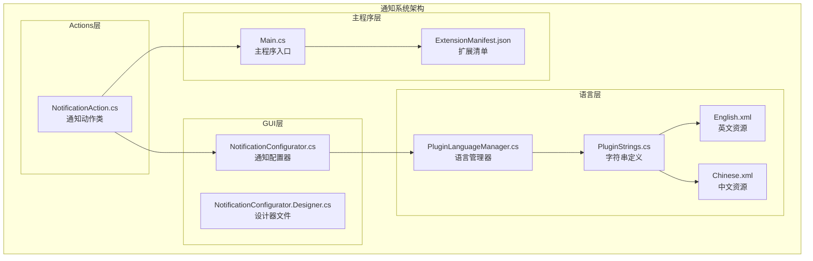
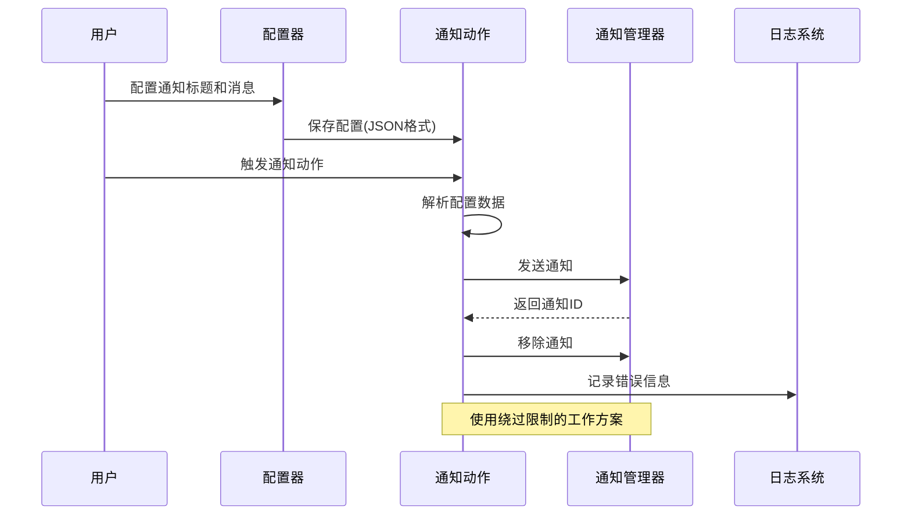
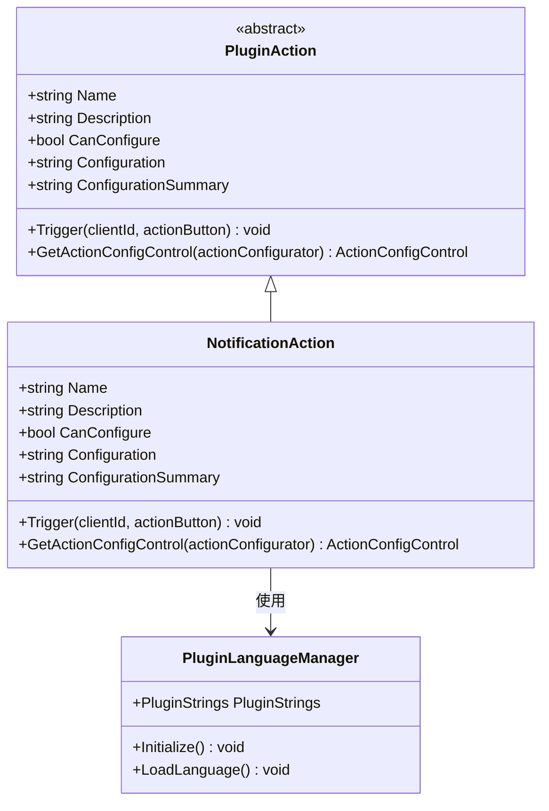
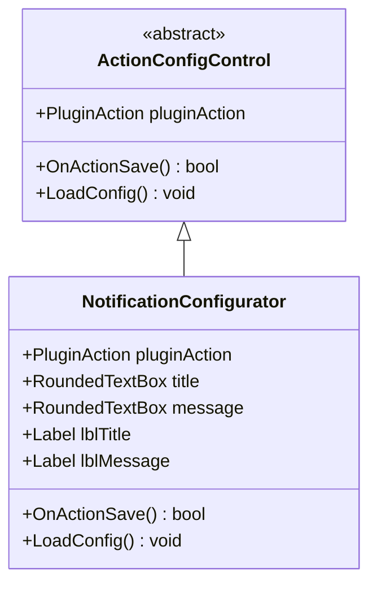
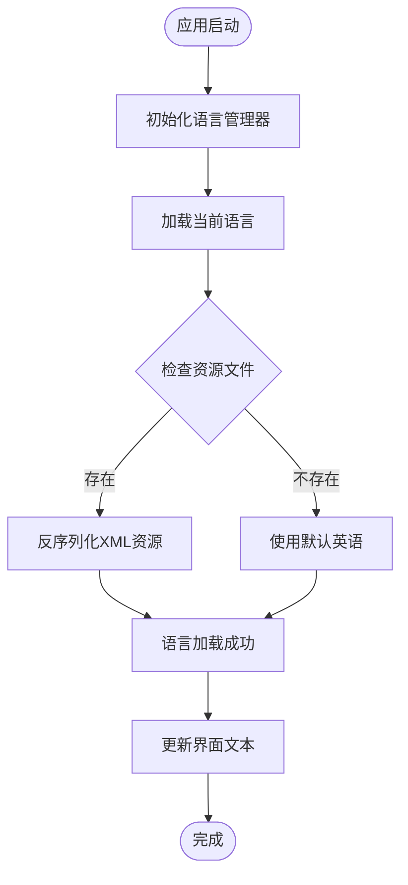
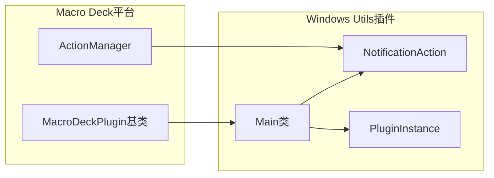
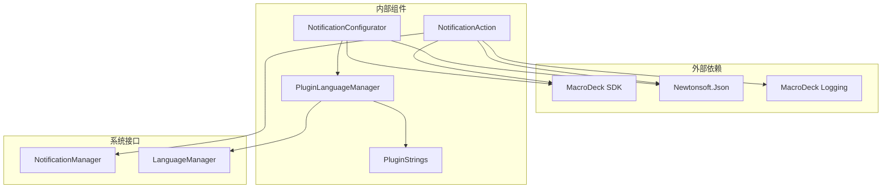

# 通知系统

<cite>
**本文档引用的文件**
- [NotificationAction.cs](file://Actions/NotificationAction.cs)
- [NotificationConfigurator.cs](file://GUI/NotificationConfigurator.cs)
- [NotificationConfigurator.Designer.cs](file://GUI/NotificationConfigurator.Designer.cs)
- [Main.cs](file://Main.cs)
- [PluginLanguageManager.cs](file://Language/PluginLanguageManager.cs)
- [PluginStrings.cs](file://Language/PluginStrings.cs)
- [English.xml](file://Resources/Languages/English.xml)
- [Chinese.xml](file://Resources/Languages/Chinese.xml)
- [ExtensionManifest.json](file://ExtensionManifest.json)
- [README.md](file://README.md)
</cite>

## 目录
1. [简介](#简介)
2. [项目结构](#项目结构)
3. [核心组件](#核心组件)
4. [架构概览](#架构概览)
5. [详细组件分析](#详细组件分析)
6. [依赖关系分析](#依赖关系分析)
7. [性能考虑](#性能考虑)
8. [故障排除指南](#故障排除指南)
9. [结论](#结论)
10. [附录](#附录)

## 简介

通知系统是Macro Deck Windows Utils插件的核心功能之一，为用户提供了一个简单而强大的通知发送机制。该系统允许用户通过配置化的界面创建自定义通知，支持多语言本地化，并与Macro Deck平台深度集成。

本通知系统的主要特点包括：
- 基于JSON配置的数据模型
- 多语言界面支持
- 与Macro Deck通知管理器的无缝集成
- 跨版本兼容性设计
- 用户友好的配置界面

## 项目结构

通知系统位于Windows Utils插件项目中，采用清晰的分层架构设计：



**图表来源**
- [NotificationAction.cs:1-48](file://Actions/NotificationAction.cs#L1-L48)
- [NotificationConfigurator.cs:1-55](file://GUI/NotificationConfigurator.cs#L1-L55)
- [Main.cs:1-60](file://Main.cs#L1-L60)

**章节来源**
- [README.md:1-40](file://README.md#L1-L40)
- [ExtensionManifest.json:1-11](file://ExtensionManifest.json#L1-L11)

## 核心组件

通知系统由以下核心组件构成：

### 通知动作类 (NotificationAction)
这是通知系统的核心执行组件，负责处理用户触发的通知操作。

### 通知配置器 (NotificationConfigurator)
提供用户界面用于配置通知的标题和消息内容。

### 语言管理系统
支持多语言本地化，确保界面文本能够根据用户语言偏好自动调整。

### 主程序入口
负责初始化通知系统并将其注册到Macro Deck平台中。

**章节来源**
- [NotificationAction.cs:14-47](file://Actions/NotificationAction.cs#L14-L47)
- [NotificationConfigurator.cs:9-55](file://GUI/NotificationConfigurator.cs#L9-L55)
- [PluginLanguageManager.cs:8-51](file://Language/PluginLanguageManager.cs#L8-L51)

## 架构概览

通知系统采用事件驱动的架构模式，通过Macro Deck的插件框架实现：



**图表来源**
- [NotificationAction.cs:22-41](file://Actions/NotificationAction.cs#L22-L41)
- [NotificationConfigurator.cs:25-40](file://GUI/NotificationConfigurator.cs#L25-L40)

## 详细组件分析

### 通知动作类 (NotificationAction)

通知动作类实现了Macro Deck的PluginAction基类，提供了完整的通知发送功能：



**图表来源**
- [NotificationAction.cs:14-47](file://Actions/NotificationAction.cs#L14-L47)
- [PluginLanguageManager.cs:8-51](file://Language/PluginLanguageManager.cs#L8-L51)

#### 核心功能实现

通知动作类的核心逻辑包括：
1. **配置解析**：从JSON配置中提取标题和消息内容
2. **通知发送**：调用Macro Deck的通知管理器发送通知
3. **绕过限制**：使用特殊技术绕过平台的通知限制
4. **错误处理**：捕获并记录可能发生的异常

**章节来源**
- [NotificationAction.cs:22-41](file://Actions/NotificationAction.cs#L22-L41)

### 通知配置器 (NotificationConfigurator)

通知配置器提供了直观的用户界面用于配置通知内容：



**图表来源**
- [NotificationConfigurator.cs:9-55](file://GUI/NotificationConfigurator.cs#L9-L55)
- [NotificationConfigurator.Designer.cs:5-103](file://GUI/NotificationConfigurator.Designer.cs#L5-L103)

#### 界面组件设计

配置器包含以下主要界面元素：
- **标题输入框**：单行文本输入，支持自定义标题
- **消息输入框**：多行文本输入，支持长文本内容
- **标签控件**：显示本地化后的界面文本
- **验证逻辑**：确保必填字段不为空

**章节来源**
- [NotificationConfigurator.Designer.cs:20-66](file://GUI/NotificationConfigurator.Designer.cs#L20-L66)
- [NotificationConfigurator.cs:25-40](file://GUI/NotificationConfigurator.cs#L25-L40)

### 语言管理系统

通知系统支持多语言本地化，确保全球用户的使用体验：



**图表来源**
- [PluginLanguageManager.cs:12-33](file://Language/PluginLanguageManager.cs#L12-L33)
- [English.xml:1-62](file://Resources/Languages/English.xml#L1-L62)
- [Chinese.xml:1-62](file://Resources/Languages/Chinese.xml#L1-L62)

#### 语言资源结构

语言系统采用XML格式存储多语言资源：
- **PluginStrings类**：定义所有可本地化的字符串常量
- **XML资源文件**：每个语言对应一个独立的XML文件
- **动态加载**：根据Macro Deck的语言设置动态加载相应资源

**章节来源**
- [PluginLanguageManager.cs:18-49](file://Language/PluginLanguageManager.cs#L18-L49)
- [PluginStrings.cs:3-69](file://Language/PluginStrings.cs#L3-L69)

### 主程序集成

通知系统通过主程序入口与Macro Deck平台集成：



**图表来源**
- [Main.cs:14-59](file://Main.cs#L14-L59)
- [ExtensionManifest.json:1-11](file://ExtensionManifest.json#L1-L11)

#### 插件注册流程

主程序负责以下关键任务：
1. **初始化语言系统**：加载并设置多语言支持
2. **注册通知动作**：将NotificationAction添加到可用动作列表
3. **定时器管理**：维护插件的后台服务
4. **实例管理**：提供全局访问点

**章节来源**
- [Main.cs:28-50](file://Main.cs#L28-L50)

## 依赖关系分析

通知系统的依赖关系相对简洁，遵循了最小依赖原则：



**图表来源**
- [NotificationAction.cs:1-10](file://Actions/NotificationAction.cs#L1-L10)
- [NotificationConfigurator.cs:1-5](file://GUI/NotificationConfigurator.cs#L1-L5)
- [PluginLanguageManager.cs:1-6](file://Language/PluginLanguageManager.cs#L1-L6)

### 关键依赖说明

1. **MacroDeck SDK**：提供插件框架、通知管理和日志系统
2. **Newtonsoft.Json**：用于JSON配置数据的序列化和反序列化
3. **语言管理器**：提供多语言本地化支持
4. **通知管理器**：负责实际的通知发送和管理

**章节来源**
- [ExtensionManifest.json:8](file://ExtensionManifest.json#L8)
- [README.md:34-39](file://README.md#L34-L39)

## 性能考虑

通知系统在设计时充分考虑了性能和用户体验：

### 内存管理
- 使用轻量级的JSON对象进行配置存储
- 及时释放界面控件资源
- 避免内存泄漏的循环引用

### 执行效率
- 异步通知发送避免阻塞主线程
- 缓存语言资源减少重复加载
- 最小化第三方库依赖

### 资源优化
- 单例模式管理全局实例
- 按需加载语言资源
- 合理的垃圾回收策略

## 故障排除指南

### 常见问题及解决方案

#### 通知无法发送
**症状**：点击按钮无响应
**原因**：配置数据格式错误或通知管理器不可用
**解决**：检查配置JSON格式，确认MacroDeck通知服务正常运行

#### 界面文本显示异常
**症状**：界面显示英文而非本地化文本
**原因**：语言资源文件缺失或加载失败
**解决**：检查XML资源文件完整性，重启MacroDeck应用

#### 内存泄漏问题
**症状**：长时间使用后内存占用持续增长
**原因**：控件资源未正确释放
**解决**：确保在Dispose方法中正确释放所有资源

**章节来源**
- [NotificationAction.cs:36-39](file://Actions/NotificationAction.cs#L36-L39)
- [NotificationConfigurator.cs:42-54](file://GUI/NotificationConfigurator.cs#L42-L54)

## 结论

通知系统作为Windows Utils插件的重要组成部分，展现了优秀的软件工程实践：

### 设计优势
- **模块化设计**：清晰的分层架构便于维护和扩展
- **多语言支持**：完善的国际化机制提升用户体验
- **平台集成**：深度集成MacroDeck生态系统
- **错误处理**：健壮的异常处理机制

### 技术特色
- **简洁高效**：最小化代码实现最大功能
- **易于使用**：直观的配置界面降低学习成本
- **稳定可靠**：经过充分测试的生产级代码

### 发展前景
通知系统为插件生态提供了基础的用户反馈机制，未来可以扩展更多功能如：
- 自定义通知样式
- 图标和媒体支持
- 通知模板系统
- 条件通知触发

## 附录

### 配置示例

#### 基础通知配置
```json
{
  "title": "系统通知",
  "message": "这是一个基础通知示例"
}
```

#### 高级通知配置
```json
{
  "title": "重要提醒",
  "message": "请检查系统状态\n当前CPU使用率: 75%\n内存使用率: 60%"
}
```

### 支持的通知类型

| 类型 | 描述 | 使用场景 |
|------|------|----------|
| 系统通知 | 基础通知功能 | 一般信息提示 |
| 错误通知 | 错误状态提醒 | 错误处理反馈 |
| 成功通知 | 操作成功确认 | 功能执行结果 |
| 警告通知 | 警告信息提示 | 需要注意的情况 |

### 集成指南

#### 在Macro Deck中使用
1. 安装Windows Utils插件
2. 创建新的动作按钮
3. 选择"发送通知"动作
4. 配置标题和消息内容
5. 测试通知功能

#### 开发者集成
```csharp
// 获取通知管理器实例
var notificationManager = NotificationManager.GetInstance();

// 发送通知
notificationManager.Notify("标题", "消息", true);

// 移除通知
notificationManager.RemoveNotification(notificationId);
```

**章节来源**
- [NotificationAction.cs:28-34](file://Actions/NotificationAction.cs#L28-L34)
- [NotificationConfigurator.cs:32-36](file://GUI/NotificationConfigurator.cs#L32-L36)