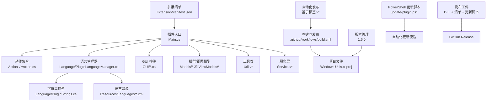
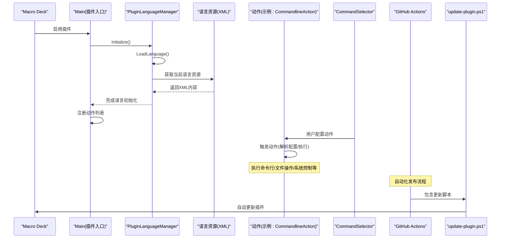
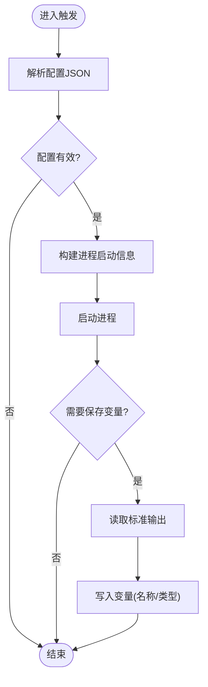
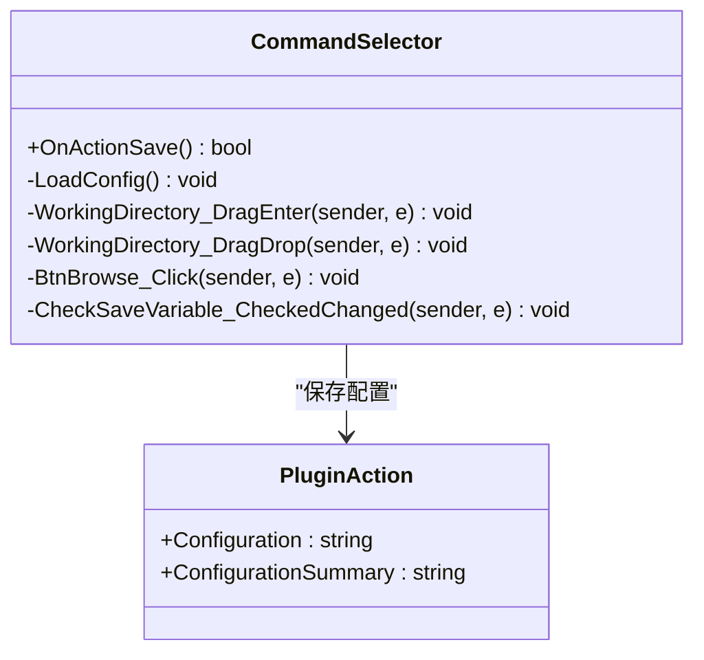
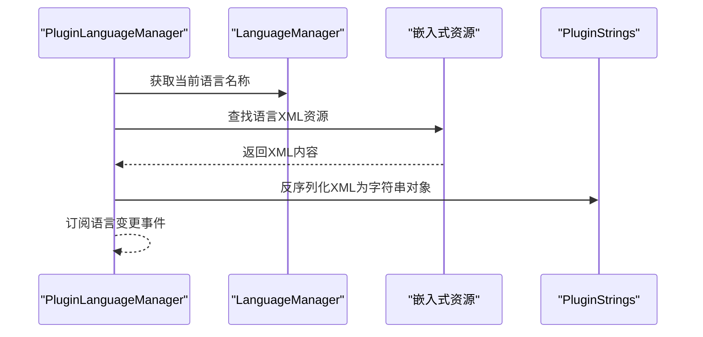
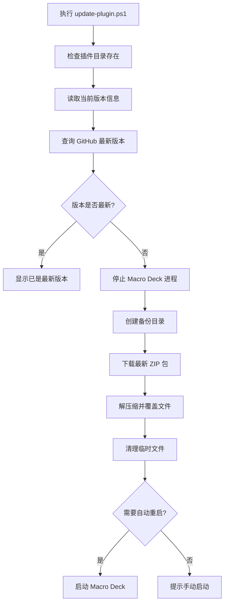
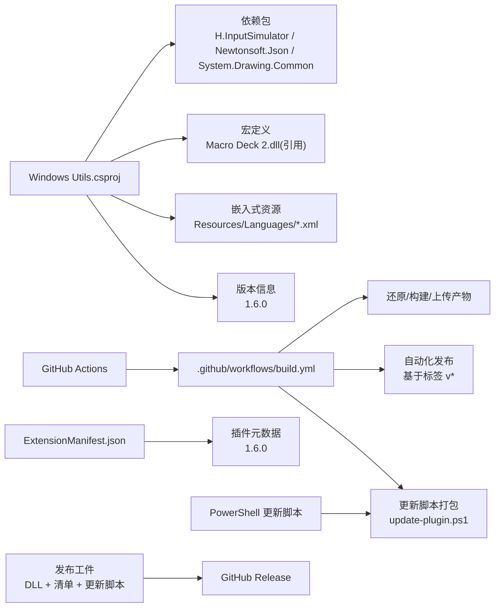
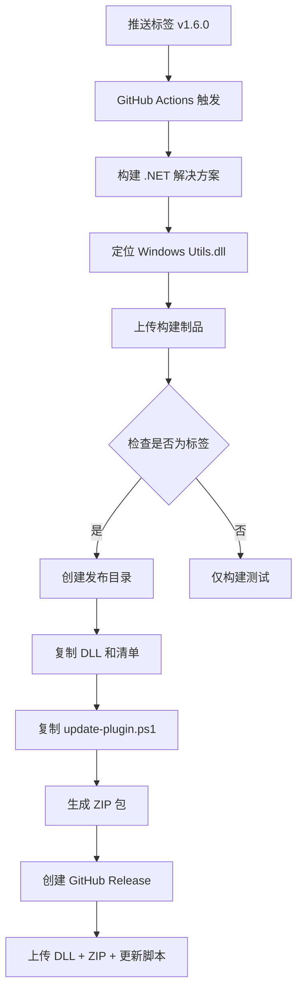

# 贡献指南

<cite>
**本文引用的文件**
- [README.md](file://README.md)
- [ExtensionManifest.json](file://ExtensionManifest.json)
- [Windows Utils.csproj](file://Windows Utils.csproj)
- [.github/workflows/build.yml](file://.github/workflows/build.yml)
- [Main.cs](file://Main.cs)
- [Language/PluginLanguageManager.cs](file://Language/PluginLanguageManager.cs)
- [Language/PluginStrings.cs](file://Language/PluginStrings.cs)
- [Language/README.md](file://Language/README.md)
- [Resources/Languages/README.md](file://Resources/Languages/README.md)
- [Resources/Languages/English.xml](file://Resources/Languages/English.xml)
- [Resources/Languages/Chinese.xml](file://Resources/Languages/Chinese.xml)
- [Actions/CommandlineAction.cs](file://Actions/CommandlineAction.cs)
- [GUI/CommandSelector.cs](file://GUI/CommandSelector.cs)
- [.gitignore](file://.gitignore)
- [.gitattributes](file://.gitattributes)
- [update-plugin.ps1](file://update-plugin.ps1)
</cite>

## 更新摘要
**所做更改**
- 更新 GitHub Actions 自动化发布工作流章节，反映 update-plugin.ps1 脚本的自动化处理
- 新增 PowerShell 更新脚本的详细说明和使用指南
- 更新发布流程，包含更新脚本的自动打包和分发
- 增强版本管理章节，体现更新脚本在发布流程中的作用

## 目录
1. 引言
2. 项目结构
3. 核心组件
4. 架构总览
5. 详细组件分析
6. 依赖关系分析
7. 性能考虑
8. 故障排查指南
9. 结论
10. 附录

## 引言
本指南面向希望为 Macro Deck Windows Utils 插件做出贡献的开发者与翻译志愿者，涵盖代码贡献流程、多语言翻译贡献、问题反馈、GitHub 工作流与分支管理、Pull Request 规范、代码风格与测试要求、文档更新规范、开发环境搭建与本地测试方法等。目标是帮助新贡献者快速上手并高质量地完成贡献。

**最新更新**：项目现已集成完整的 GitHub Actions 自动化发布工作流，支持基于版本标签的自动发布、打包和上传功能，版本管理增强至 1.6.0。发布流程现在自动包含并分发 update-plugin.ps1 PowerShell 更新脚本，简化了插件的安装和更新过程。

## 项目结构
该项目采用基于功能域的组织方式：核心插件入口在根目录，功能动作位于 Actions，图形界面控件位于 GUI，模型与视图模型位于 Models/ViewModels，工具类位于 Utils，服务层位于 Services，国际化资源位于 Resources/Languages，并通过 Language 子模块进行统一加载与管理。新增的 update-plugin.ps1 脚本为用户提供便捷的自动化更新功能。



**图表来源**
- [Main.cs:14-59](file://Main.cs#L14-L59)
- [Language/PluginLanguageManager.cs:8-50](file://Language/PluginLanguageManager.cs#L8-L50)
- [Language/PluginStrings.cs:3-70](file://Language/PluginStrings.cs#L3-L70)
- [Windows Utils.csproj:1-74](file://Windows Utils.csproj#L1-L74)
- [.github/workflows/build.yml:1-67](file://.github/workflows/build.yml#L1-L67)
- [ExtensionManifest.json:1-11](file://ExtensionManifest.json#L1-L11)
- [update-plugin.ps1:1-185](file://update-plugin.ps1#L1-185)

**章节来源**
- [README.md:1-40](file://README.md#L1-L40)
- [ExtensionManifest.json:1-11](file://ExtensionManifest.json#L1-L11)
- [Windows Utils.csproj:1-74](file://Windows Utils.csproj#L1-L74)

## 核心组件
- 插件入口与生命周期
  - 插件主类负责注册所有可用动作、初始化语言系统与定时器等。
  - 参考路径：[Main.cs:14-59](file://Main.cs#L14-L59)
- 动作系统
  - 每个具体动作继承自插件基类，实现触发逻辑与配置控件。
  - 示例：命令行动作触发与配置保存逻辑。
  - 参考路径：[Actions/CommandlineAction.cs:14-65](file://Actions/CommandlineAction.cs#L14-L65)
- GUI 配置控件
  - 动作的可视化配置界面，负责读取/保存配置、校验输入、拖拽选择路径等。
  - 参考路径：[GUI/CommandSelector.cs:12-144](file://GUI/CommandSelector.cs#L12-L144)
- 国际化系统
  - 语言管理器根据当前语言动态加载嵌入式 XML 资源，回退到默认语言。
  - 参考路径：[Language/PluginLanguageManager.cs:8-50](file://Language/PluginLanguageManager.cs#L8-L50)，[Language/PluginStrings.cs:3-70](file://Language/PluginStrings.cs#L3-L70)
- 语言资源
  - 基于 XML 的键值对资源，包含语言名称、语言代码与作者信息，以及各 UI 文案。
  - 参考路径：[Resources/Languages/English.xml:1-62](file://Resources/Languages/English.xml#L1-L62)，[Resources/Languages/Chinese.xml:1-62](file://Resources/Languages/Chinese.xml#L1-L62)
- **新增** PowerShell 更新脚本
  - 自动化下载和安装最新版本插件，支持备份、重启和参数控制。
  - 参考路径：[update-plugin.ps1:1-185](file://update-plugin.ps1#L1-185)

**章节来源**
- [Main.cs:14-59](file://Main.cs#L14-L59)
- [Actions/CommandlineAction.cs:14-65](file://Actions/CommandlineAction.cs#L14-L65)
- [GUI/CommandSelector.cs:12-144](file://GUI/CommandSelector.cs#L12-L144)
- [Language/PluginLanguageManager.cs:8-50](file://Language/PluginLanguageManager.cs#L8-L50)
- [Language/PluginStrings.cs:3-70](file://Language/PluginStrings.cs#L3-L70)
- [Resources/Languages/English.xml:1-62](file://Resources/Languages/English.xml#L1-L62)
- [Resources/Languages/Chinese.xml:1-62](file://Resources/Languages/Chinese.xml#L1-L62)
- [update-plugin.ps1:1-185](file://update-plugin.ps1#L1-185)

## 架构总览
下图展示了插件从启用到执行动作的关键交互流程，包括语言资源加载、动作注册、配置控件与动作触发之间的关系。同时体现了更新脚本在发布流程中的作用。



**图表来源**
- [Main.cs:28-58](file://Main.cs#L28-L58)
- [Language/PluginLanguageManager.cs:12-49](file://Language/PluginLanguageManager.cs#L12-L49)
- [Actions/CommandlineAction.cs:22-58](file://Actions/CommandlineAction.cs#L22-L58)
- [GUI/CommandSelector.cs:46-79](file://GUI/CommandSelector.cs#L46-L79)
- [.github/workflows/build.yml:48-67](file://.github/workflows/build.yml#L48-L67)
- [update-plugin.ps1:68-85](file://update-plugin.ps1#L68-L85)

## 详细组件分析

### 动作：命令行执行（CommandlineAction）
- 触发逻辑
  - 解析配置 JSON，构造进程启动信息，支持隐藏窗口与重定向标准输出。
  - 当勾选"保存到变量"时，读取输出并写入指定变量类型。
- 配置控件
  - 提供命令输入、工作目录选择、变量名与类型设置、拖拽选择目录等功能。
  - 校验命令非空与工作目录有效性，必要时弹出错误提示。



**图表来源**
- [Actions/CommandlineAction.cs:22-58](file://Actions/CommandlineAction.cs#L22-L58)
- [GUI/CommandSelector.cs:46-79](file://GUI/CommandSelector.cs#L46-L79)

**章节来源**
- [Actions/CommandlineAction.cs:14-65](file://Actions/CommandlineAction.cs#L14-L65)
- [GUI/CommandSelector.cs:12-144](file://GUI/CommandSelector.cs#L12-L144)

### GUI 组件：命令选择器（CommandSelector）
- 功能要点
  - 初始化时绑定语言文案，设置变量类型下拉项，启用拖拽选择目录。
  - 保存配置时进行命令与目录校验，生成配置 JSON 并设置摘要显示。
- 错误处理
  - 目录有效性检查失败时弹出错误消息框；异常捕获避免崩溃。



**图表来源**
- [GUI/CommandSelector.cs:12-144](file://GUI/CommandSelector.cs#L12-L144)

**章节来源**
- [GUI/CommandSelector.cs:12-144](file://GUI/CommandSelector.cs#L12-L144)

### 国际化系统：语言管理器与字符串模型
- 加载机制
  - 根据当前语言名称从嵌入式资源中读取对应 XML，反序列化为字符串对象。
  - 若语言资源缺失或异常，则回退到默认语言。
- 字符串模型
  - 包含语言元数据与全部 UI 文案键，便于统一访问与翻译。



**图表来源**
- [Language/PluginLanguageManager.cs:12-49](file://Language/PluginLanguageManager.cs#L12-L49)
- [Language/PluginStrings.cs:3-70](file://Language/PluginStrings.cs#L3-L70)

**章节来源**
- [Language/PluginLanguageManager.cs:8-50](file://Language/PluginLanguageManager.cs#L8-L50)
- [Language/PluginStrings.cs:3-70](file://Language/PluginStrings.cs#L3-L70)

### **新增** PowerShell 更新脚本：自动化插件管理
- 功能概述
  - 自动下载并安装最新版本的 Windows Utils 插件
  - 支持自动备份、智能版本检测和可选的自动重启
  - 提供详细的进度反馈和错误处理
- 核心特性
  - 版本比较：自动查询 GitHub Releases 并与当前版本对比
  - 智能备份：更新前自动创建备份目录
  - 安全停止：自动检测并停止正在运行的 Macro Deck 实例
  - 参数控制：支持 `-AutoRestart` 和 `-SkipBackup` 参数
- 使用场景
  - 用户无需手动下载和解压 ZIP 文件
  - 支持无人值守的插件更新流程
  - 提供完整的错误恢复机制



**图表来源**
- [update-plugin.ps1:48-85](file://update-plugin.ps1#L48-L85)
- [update-plugin.ps1:115-163](file://update-plugin.ps1#L115-L163)

**章节来源**
- [update-plugin.ps1:1-185](file://update-plugin.ps1#L1-185)

## 依赖关系分析
- 构建与打包
  - 使用 .NET SDK，目标框架为 Windows，启用 Windows Forms，平台为 AnyCPU/x64。
  - 依赖包包括输入模拟、JSON 序列化与绘图基础库。
  - 项目文件中包含 PostBuild 事件，用于本地调试时自动复制 DLL 到 Macro Deck 插件目录。
- 版本与清单
  - 扩展清单定义了插件类型、名称、作者、仓库地址、包 ID、版本、目标 API 版本与 DLL 名称。
  - **版本管理增强**：当前版本为 1.6.0，包含 AssemblyVersion、FileVersion 和 Version 属性。
- CI 工作流
  - 在 master 分支推送与 PR 时触发，使用 .NET 10 进行还原与构建，上传插件 DLL 产物。
  - **新增自动化发布**：基于标签触发的完整发布流程，包括打包、上传更新脚本和创建 GitHub Release。
- **新增** 更新脚本集成
  - 发布流程自动包含 update-plugin.ps1 到所有发布工件中
  - 更新脚本随 ZIP 包一起分发，简化用户更新体验



**图表来源**
- [Windows Utils.csproj:31-48](file://Windows Utils.csproj#L31-L48)
- [Windows Utils.csproj:69-71](file://Windows Utils.csproj#L69-L71)
- [.github/workflows/build.yml:14-67](file://.github/workflows/build.yml#L14-L67)
- [ExtensionManifest.json:1-11](file://ExtensionManifest.json#L1-11)
- [update-plugin.ps1:1-185](file://update-plugin.ps1#L1-185)

**章节来源**
- [Windows Utils.csproj:1-74](file://Windows Utils.csproj#L1-L74)
- [.github/workflows/build.yml:1-67](file://.github/workflows/build.yml#L1-L67)
- [ExtensionManifest.json:1-11](file://ExtensionManifest.json#L1-L11)

## 性能考虑
- 进程执行
  - 命令行动作以隐藏窗口方式执行，避免干扰用户桌面；仅在需要时重定向输出以减少 IO 开销。
- 界面响应
  - GUI 控件在保存配置时进行轻量级校验，避免阻塞主线程。
- 资源加载
  - 语言资源作为嵌入式资源，首次加载后由内存缓存，语言切换时重新加载，避免频繁磁盘 IO。
- **新增** 更新脚本性能
  - 使用异步下载和解压缩操作，避免阻塞用户界面
  - 智能版本检测减少不必要的网络请求
  - 失败时自动清理临时文件，避免磁盘空间浪费

**章节来源**
- [Actions/CommandlineAction.cs:33-52](file://Actions/CommandlineAction.cs#L33-L52)
- [GUI/CommandSelector.cs:46-79](file://GUI/CommandSelector.cs#L46-L79)
- [Language/PluginLanguageManager.cs:18-49](file://Language/PluginLanguageManager.cs#L18-L49)
- [update-plugin.ps1:130-140](file://update-plugin.ps1#L130-L140)

## 故障排查指南
- 语言资源未生效
  - 确认语言 XML 文件名与语言节点一致且符合 ISO 规范；检查是否正确嵌入到项目资源中。
  - 参考路径：[Resources/Languages/README.md:10-13](file://Resources/Languages/README.md#L10-L13)，[Windows Utils.csproj:31-33](file://Windows Utils.csproj#L31-L33)
- 构建失败
  - 确认已安装 .NET 10 SDK；在 CI 环境中需设置 CI=true 以跳过 PostBuild 复制。
  - 参考路径：[Windows Utils.csproj:69-71](file://Windows Utils.csproj#L69-L71)，[.github/workflows/build.yml:18-27](file://.github/workflows/build.yml#L18-L27)
- 本地调试
  - 通过 PostBuild 自动复制 DLL 到 Macro Deck 插件目录；若路径不存在，可手动放置至插件目录。
  - 参考路径：[Windows Utils.csproj:69-71](file://Windows Utils.csproj#L69-L71)
- Git 配置
  - 使用 .gitattributes 统一行尾与二进制文件处理建议；.gitignore 忽略常见构建与 IDE 临时文件。
  - 参考路径：[.gitattributes:1-64](file://.gitattributes#L1-L64)，[.gitignore:1-363](file://.gitignore#L1-L363)
- **新增** 更新脚本问题排查
  - 确认 PowerShell 执行策略允许运行脚本：`Set-ExecutionPolicy -ExecutionPolicy Bypass -Scope CurrentUser`
  - 检查网络连接和 GitHub API 可访问性
  - 验证 Macro Deck 进程权限和文件系统访问权限
  - 查看详细的错误日志输出以诊断具体问题

**章节来源**
- [Resources/Languages/README.md:10-13](file://Resources/Languages/README.md#L10-L13)
- [Windows Utils.csproj:31-33](file://Windows Utils.csproj#L31-L33)
- [Windows Utils.csproj:69-71](file://Windows Utils.csproj#L69-L71)
- [.github/workflows/build.yml:18-27](file://.github/workflows/build.yml#L18-L27)
- [.gitattributes:1-64](file://.gitattributes#L1-L64)
- [.gitignore:1-363](file://.gitignore#L1-L363)
- [update-plugin.ps1:1-185](file://update-plugin.ps1#L1-185)

## 结论
本指南提供了从开发环境搭建、代码贡献、翻译贡献到 CI 流程与故障排查的完整路径。随着 GitHub Actions 自动化发布工作流的引入、版本管理增强以及 update-plugin.ps1 更新脚本的集成，项目现在具备了更完善的持续集成、发布能力和用户体验优化。显著提升了贡献效率与质量，确保新增功能与翻译内容与现有架构保持一致，同时为用户提供了更加便捷的插件管理体验。

## 附录

### 代码贡献流程
- 分支策略
  - 建议基于 master 分支创建特性分支进行开发，完成后发起 Pull Request 至 master。
  - 参考路径：[.github/workflows/build.yml:3-8](file://.github/workflows/build.yml#L3-L8)
- 提交规范
  - 使用清晰的提交信息描述变更内容；避免提交二进制大文件与 IDE 临时文件。
  - 参考路径：[.gitignore:1-363](file://.gitignore#L1-L363)，[.gitattributes:1-64](file://.gitattributes#L1-L64)
- Pull Request 规范
  - 在 PR 描述中说明变更目的、影响范围与测试情况；确保 CI 通过后再合并。

**章节来源**
- [.github/workflows/build.yml:3-8](file://.github/workflows/build.yml#L3-L8)
- [.gitignore:1-363](file://.gitignore#L1-L363)
- [.gitattributes:1-64](file://.gitattributes#L1-L64)

### GitHub Actions 自动化发布工作流

**更新**：项目现已集成完整的自动化发布工作流，支持基于版本标签的自动发布流程，并自动包含 update-plugin.ps1 更新脚本。

#### 工作流触发条件
- 推送到 master 分支：触发构建和测试
- 推送版本标签（v*）：触发完整发布流程
- 拉取请求：触发构建和测试
- 手动触发：支持 workflow_dispatch

#### 发布流程详解
1. **构建阶段**
   - 使用 .NET 10 SDK 还原和构建解决方案
   - 定位构建的 DLL 文件并上传为构建制品

2. **打包阶段**（仅在标签触发时）
   - 创建发布目录结构 `release/SuchByte.WindowsUtils`
   - 复制 DLL 和扩展清单文件
   - **新增** 复制 update-plugin.ps1 更新脚本到 release 目录
   - 生成 ZIP 压缩包（格式：Windows-Utils-{tag}.zip）

3. **发布阶段**（仅在标签触发时）
   - 创建 GitHub Release
   - **更新** 上传 DLL、ZIP 包和 update-plugin.ps1 脚本
   - 自动生成发布说明



**图表来源**
- [.github/workflows/build.yml:48-67](file://.github/workflows/build.yml#L48-L67)

**章节来源**
- [.github/workflows/build.yml:1-67](file://.github/workflows/build.yml#L1-L67)

### 多语言翻译贡献
- 翻译文件位置
  - 语言资源位于 Resources/Languages，包含 English.xml 与 Chinese.xml 等。
  - 参考路径：[Language/README.md:1-3](file://Language/README.md#L1-L3)，[Resources/Languages/README.md:1-31](file://Resources/Languages/README.md#L1-L31)
- 文件格式与命名
  - 文件名与 XML 中的 __Language__ 节点必须一致；语言代码使用 ISO-639-1。
  - 参考路径：[Resources/Languages/README.md:10-13](file://Resources/Languages/README.md#L10-L13)，[Resources/Languages/English.xml:2-5](file://Resources/Languages/English.xml#L2-L5)
- 提交流程
  - Fork 仓库 -> 修改/新增翻译文件 -> 发起 PR。
  - 参考路径：[README.md:20-28](file://README.md#L20-L28)，[Resources/Languages/README.md:5-8](file://Resources/Languages/README.md#L5-L8)

**章节来源**
- [Language/README.md:1-3](file://Language/README.md#L1-L3)
- [Resources/Languages/README.md:1-31](file://Resources/Languages/README.md#L1-L31)
- [README.md:20-28](file://README.md#L20-L28)
- [Resources/Languages/English.xml:2-5](file://Resources/Languages/English.xml#L2-L5)

### 代码风格与测试要求
- 代码风格
  - 使用 C# 编码规范，保持命名一致、注释清晰、异常处理完备。
- 测试要求
  - 新增或修改动作后，请在本地验证配置保存、触发执行与错误场景；确保语言资源加载正常。
  - **新增** 更新脚本测试：验证 PowerShell 脚本的执行权限、网络连接和文件操作功能。
  - 参考路径：[GUI/CommandSelector.cs:46-79](file://GUI/CommandSelector.cs#L46-L79)，[Actions/CommandlineAction.cs:22-58](file://Actions/CommandlineAction.cs#L22-L58)，[update-plugin.ps1:1-185](file://update-plugin.ps1#L1-185)

**章节来源**
- [GUI/CommandSelector.cs:46-79](file://GUI/CommandSelector.cs#L46-L79)
- [Actions/CommandlineAction.cs:22-58](file://Actions/CommandlineAction.cs#L22-L58)
- [update-plugin.ps1:1-185](file://update-plugin.ps1#L1-185)

### 文档更新规范
- 更新 README 或语言资源说明时，请同步维护链接与示例，确保与实际文件结构一致。
- **新增** 更新脚本文档：当更新脚本有重大变更时，需要更新相关的使用说明和参数文档。
- 参考路径：[README.md:20-28](file://README.md#L20-L28)，[Resources/Languages/README.md:15-29](file://Resources/Languages/README.md#L15-L29)，[update-plugin.ps1:1-185](file://update-plugin.ps1#L1-185)

**章节来源**
- [README.md:20-28](file://README.md#L20-L28)
- [Resources/Languages/README.md:15-29](file://Resources/Languages/README.md#L15-L29)
- [update-plugin.ps1:1-185](file://update-plugin.ps1#L1-185)

### 开发环境搭建与本地测试
- 环境准备
  - 安装 .NET 10 SDK；确保 Visual Studio 或 VS Code 支持 .NET 开发。
  - 参考路径：[Windows Utils.csproj:6-16](file://Windows Utils.csproj#L6-L16)，[.github/workflows/build.yml:18-21](file://.github/workflows/build.yml#L18-L21)
- 本地构建与调试
  - 使用解决方案进行构建；启用 PostBuild 事件可自动复制 DLL 到 Macro Deck 插件目录。
  - 参考路径：[Windows Utils.csproj:23-25](file://Windows Utils.csproj#L23-L25)，[Windows Utils.csproj:69-71](file://Windows Utils.csproj#L69-L71)
- 验证步骤
  - 启动 Macro Deck，确认插件加载、动作注册与语言资源显示正常；执行命令行动作并检查输出变量写入。
  - **新增** 验证更新脚本：测试 PowerShell 脚本的执行、备份功能和版本检测。
  - 参考路径：[Main.cs:28-58](file://Main.cs#L28-L58)，[Actions/CommandlineAction.cs:22-58](file://Actions/CommandlineAction.cs#L22-L58)，[update-plugin.ps1:68-85](file://update-plugin.ps1#L68-L85)

**章节来源**
- [Windows Utils.csproj:6-16](file://Windows Utils.csproj#L6-L16)
- [Windows Utils.csproj:23-25](file://Windows Utils.csproj#L23-L25)
- [Windows Utils.csproj:69-71](file://Windows Utils.csproj#L69-L71)
- [Main.cs:28-58](file://Main.cs#L28-L58)
- [Actions/CommandlineAction.cs:22-58](file://Actions/CommandlineAction.cs#L22-L58)
- [update-plugin.ps1:68-85](file://update-plugin.ps1#L68-L85)

### 版本管理增强

**更新**：项目版本管理已增强至 1.6.0，包含多个版本属性和增强功能，并集成了自动化更新脚本。

#### 版本属性
- **AssemblyVersion**: 1.6.0.0（程序集版本）
- **FileVersion**: 1.6.0.0（文件版本）
- **Version**: 1.6.0（显示版本）
- **目标框架**: net10.0-windows7.0
- **运行时标识符**: win-x64

#### 扩展清单版本
- 扩展清单中的版本字段为 1.6.0
- 目标插件 API 版本为 40
- 包 ID 为 SuchByte.WindowsUtils

#### 发布标签规范
- 使用语义化版本标签：v1.6.0
- 格式：v{major}.{minor}.{patch}
- 自动触发 GitHub Actions 发布工作流

#### **新增** 更新脚本集成
- 发布流程自动包含 update-plugin.ps1 脚本
- 用户可通过 PowerShell 脚本自动更新插件
- 支持备份、重启和参数控制功能

**章节来源**
- [Windows Utils.csproj:10-16](file://Windows Utils.csproj#L10-L16)
- [ExtensionManifest.json:7](file://ExtensionManifest.json#L7)
- [.github/workflows/build.yml:6](file://.github/workflows/build.yml#L6)
- [update-plugin.ps1:1-185](file://update-plugin.ps1#L1-185)

### **新增** PowerShell 更新脚本使用指南

#### 脚本功能概览
- 自动下载并安装最新版本的 Windows Utils 插件
- 支持智能版本检测和自动备份
- 提供详细的进度反馈和错误处理

#### 使用方法
1. **基本使用**
   ```powershell
   powershell -ExecutionPolicy Bypass -File .\update-plugin.ps1
   ```

2. **自动重启模式**
   ```powershell
   powershell -ExecutionPolicy Bypass -File .\update-plugin.ps1 -AutoRestart
   ```

3. **跳过备份模式**
   ```powershell
   powershell -ExecutionPolicy Bypass -File .\update-plugin.ps1 -SkipBackup
   ```

#### 参数说明
- `-AutoRestart`: 更新完成后自动重启 Macro Deck
- `-SkipBackup`: 跳过备份步骤，直接覆盖文件

#### 系统要求
- Windows PowerShell 5.0 或更高版本
- Internet 连接访问 GitHub API
- 对 Macro Deck 插件目录的写入权限

#### 故障排除
- **执行策略错误**: 使用 `-ExecutionPolicy Bypass` 参数
- **网络连接问题**: 检查防火墙设置和代理配置
- **权限不足**: 以管理员身份运行 PowerShell
- **插件未安装**: 先手动安装插件再运行更新脚本

**章节来源**
- [update-plugin.ps1:1-185](file://update-plugin.ps1#L1-185)