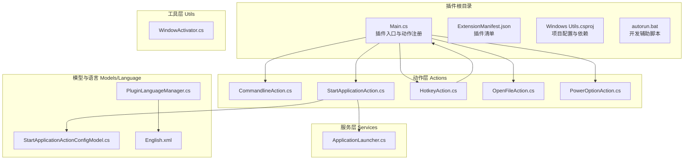
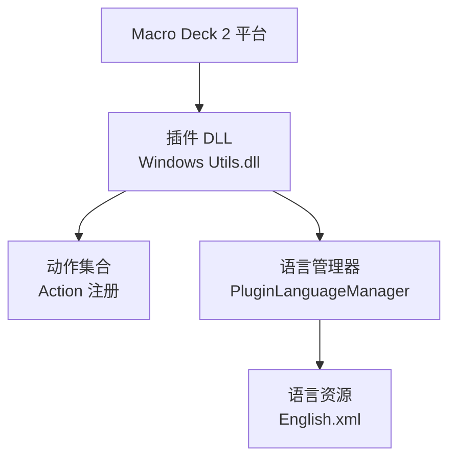
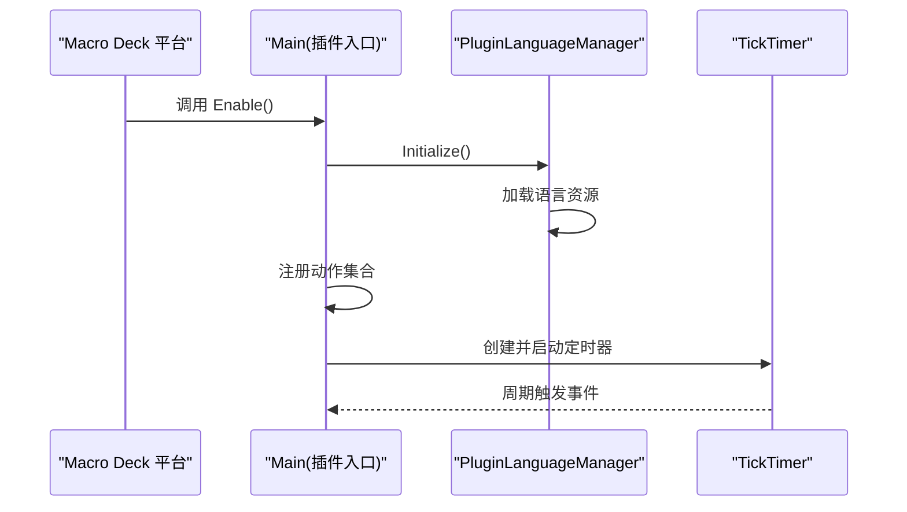
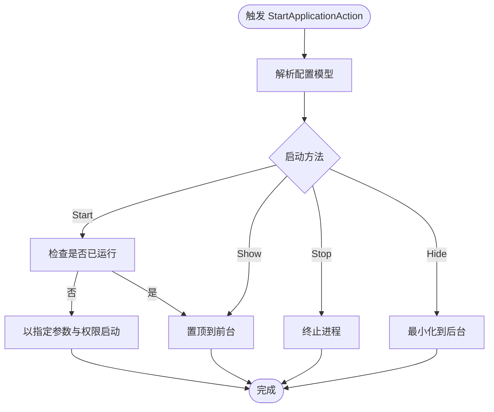
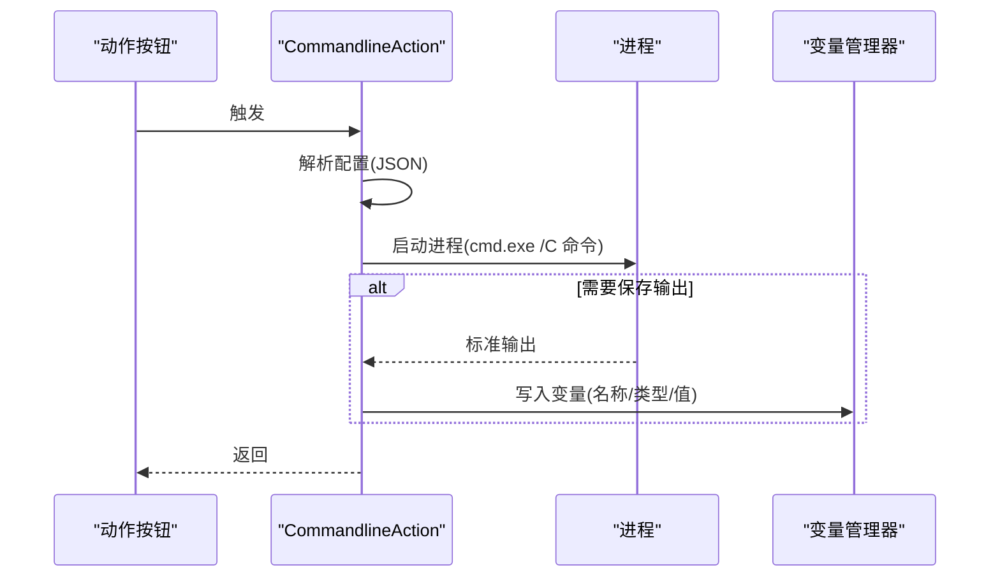
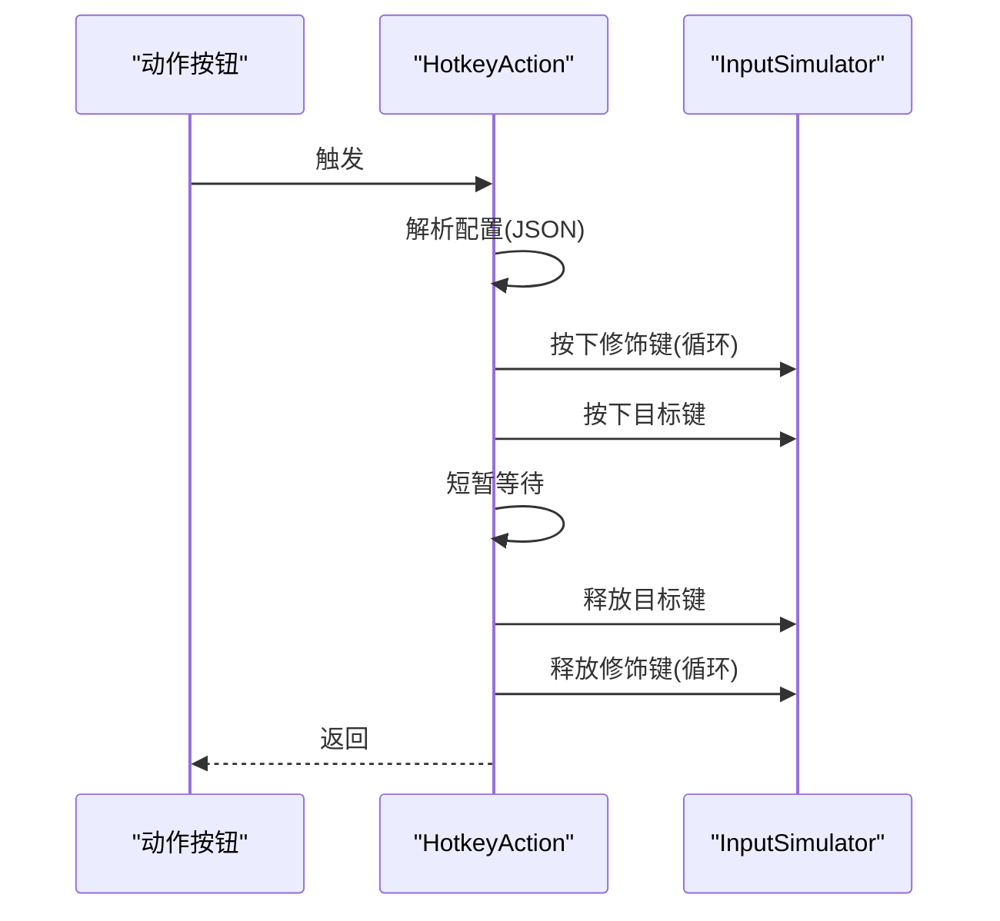
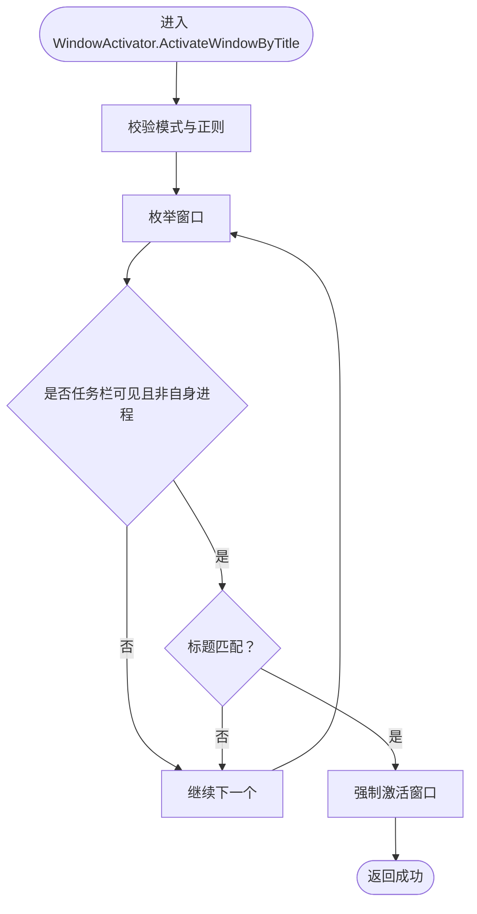
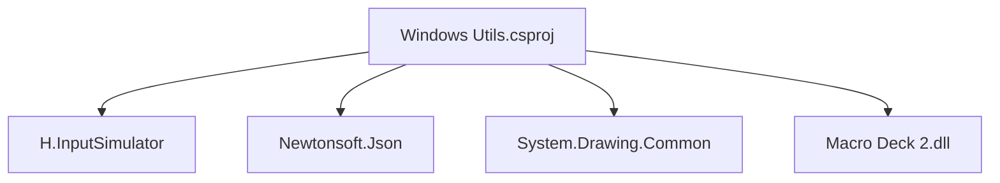

# 项目概述

<cite>
**本文引用的文件**
- [README.md](file://README.md)
- [ExtensionManifest.json](file://ExtensionManifest.json)
- [Main.cs](file://Main.cs)
- [Windows Utils.csproj](file://Windows Utils.csproj)
- [autorun.bat](file://autorun.bat)
- [Actions/CommandlineAction.cs](file://Actions/CommandlineAction.cs)
- [Actions/StartApplicationAction.cs](file://Actions/StartApplicationAction.cs)
- [Actions/HotkeyAction.cs](file://Actions/HotkeyAction.cs)
- [Actions/OpenFileAction.cs](file://Actions/OpenFileAction.cs)
- [Actions/PowerOptionAction.cs](file://Actions/PowerOptionAction.cs)
- [Services/ApplicationLauncher.cs](file://Services/ApplicationLauncher.cs)
- [Utils/WindowActivator.cs](file://Utils/WindowActivator.cs)
- [Models/StartApplicationActionConfigModel.cs](file://Models/StartApplicationActionConfigModel.cs)
- [Language/PluginLanguageManager.cs](file://Language/PluginLanguageManager.cs)
- [Resources/Languages/English.xml](file://Resources/Languages/English.xml)
</cite>

## 目录
1. [简介](#简介)
2. [项目结构](#项目结构)
3. [核心组件](#核心组件)
4. [架构总览](#架构总览)
5. [详细组件分析](#详细组件分析)
6. [依赖分析](#依赖分析)
7. [性能考虑](#性能考虑)
8. [故障排除指南](#故障排除指南)
9. [结论](#结论)
10. [附录](#附录)

## 简介
本项目是 Macro Deck 2 的 Windows 平台扩展插件，旨在通过一组实用的系统控制动作，帮助用户在 Macro Deck 生态中实现对 Windows 系统的高效自动化操作。插件提供命令行执行、应用启动与窗口切换、文件与文件夹打开、系统音量与麦克风控制、热键模拟、通知发送以及电源选项等能力，覆盖日常办公与娱乐场景的高频需求。

该插件并非独立运行的应用程序，而是作为 Macro Deck 2 的插件模块进行加载与集成，通过 Manifest 声明其类型、版本、目标 API 版本及 DLL 名称，并在启用时向平台注册一系列可配置的动作（Action）供按钮触发。

## 项目结构
仓库采用按职责分层的组织方式：
- Actions：定义各类系统控制动作及其配置界面
- GUI：提供动作配置所需的自定义控件与资源
- Language：本地化字符串管理与语言资源加载
- Models：配置模型与序列化契约
- Services：系统服务封装（如应用启动器）
- Utils：底层工具集（如窗口激活、图标处理等）
- Resources：嵌入式语言资源
- 根目录：插件入口、构建脚本与项目清单

**图表来源**
- [Main.cs:14-58](file://Main.cs#L14-L58)
- [Actions/CommandlineAction.cs:14-64](file://Actions/CommandlineAction.cs#L14-L64)
- [Actions/StartApplicationAction.cs:14-83](file://Actions/StartApplicationAction.cs#L14-L83)
- [Actions/HotkeyAction.cs:15-112](file://Actions/HotkeyAction.cs#L15-L112)
- [Actions/OpenFileAction.cs:12-46](file://Actions/OpenFileAction.cs#L12-L46)
- [Actions/PowerOptionAction.cs:14-61](file://Actions/PowerOptionAction.cs#L14-L61)
- [Services/ApplicationLauncher.cs:13-164](file://Services/ApplicationLauncher.cs#L13-L164)
- [Utils/WindowActivator.cs:9-255](file://Utils/WindowActivator.cs#L9-L255)
- [Models/StartApplicationActionConfigModel.cs:6-35](file://Models/StartApplicationActionConfigModel.cs#L6-L35)
- [Language/PluginLanguageManager.cs:8-50](file://Language/PluginLanguageManager.cs#L8-L50)
- [Resources/Languages/English.xml:1-62](file://Resources/Languages/English.xml#L1-L62)

**章节来源**
- [README.md:1-40](file://README.md#L1-L40)
- [ExtensionManifest.json:1-11](file://ExtensionManifest.json#L1-L11)
- [Windows Utils.csproj:1-74](file://Windows Utils.csproj#L1-L74)
- [Main.cs:14-58](file://Main.cs#L14-L58)

## 核心组件
- 插件入口与动作注册：在启用时初始化语言资源并注册所有可用动作，包括命令行、应用启动、文件/文件夹打开、音量控制、浏览器/资源管理器控制、热键、通知、麦克风静音、电源选项与窗口切换等。
- 应用启动服务：封装进程查找、启动、终止、前后台切换等逻辑，支持以管理员权限运行与快捷方式解析。
- 热键模拟：基于输入模拟库，支持组合键（Win/Ctrl/Alt/Shift）与任意虚拟键的按下/抬起序列。
- 命令行执行：在指定工作目录下执行命令，可选将输出保存到变量，便于后续流程使用。
- 文件/文件夹操作：通过系统外壳打开文件或文件夹，支持拖拽选择与路径校验。
- 电源选项：提供休眠、挂起到磁盘、关机、重启等操作。
- 窗口切换：根据标题匹配模式（全等、前缀、后缀、包含、正则）定位并激活窗口。
- 本地化：动态加载语言资源，支持多语言切换与回退机制。

**章节来源**
- [Main.cs:28-58](file://Main.cs#L28-L58)
- [Services/ApplicationLauncher.cs:39-164](file://Services/ApplicationLauncher.cs#L39-L164)
- [Actions/HotkeyAction.cs:29-111](file://Actions/HotkeyAction.cs#L29-L111)
- [Actions/CommandlineAction.cs:22-58](file://Actions/CommandlineAction.cs#L22-L58)
- [Actions/OpenFileAction.cs:20-40](file://Actions/OpenFileAction.cs#L20-L40)
- [Actions/PowerOptionAction.cs:22-55](file://Actions/PowerOptionAction.cs#L22-L55)
- [Utils/WindowActivator.cs:57-210](file://Utils/WindowActivator.cs#L57-L210)
- [Language/PluginLanguageManager.cs:12-33](file://Language/PluginLanguageManager.cs#L12-L33)

## 架构总览
插件遵循 Macro Deck 插件接口规范，通过清单声明类型与版本，运行时由平台加载并注册动作。动作在触发时读取配置对象，调用相应服务或系统 API 执行具体操作；部分动作还提供可视化配置控件以便用户设置参数。

**图表来源**
- [ExtensionManifest.json:1-11](file://ExtensionManifest.json#L1-L11)
- [Main.cs:28-58](file://Main.cs#L28-L58)
- [Language/PluginLanguageManager.cs:12-33](file://Language/PluginLanguageManager.cs#L12-L33)
- [Resources/Languages/English.xml:1-62](file://Resources/Languages/English.xml#L1-L62)

## 详细组件分析

### 插件入口与生命周期
- 初始化：启用时加载语言资源，注册所有动作列表。
- 定时器：启动一个周期性定时器用于按钮状态同步（例如应用启动动作的状态更新）。

**图表来源**
- [Main.cs:28-58](file://Main.cs#L28-L58)
- [Language/PluginLanguageManager.cs:12-33](file://Language/PluginLanguageManager.cs#L12-L33)

**章节来源**
- [Main.cs:14-58](file://Main.cs#L14-L58)

### 应用启动动作（StartApplicationAction）
- 功能：支持启动、停止、显示、隐藏指定路径的应用；可选以管理员权限运行；可同步按钮状态。
- 流程：解析配置模型，调用应用启动服务执行对应操作；若启用状态同步，则通过定时器轮询进程状态并更新按钮状态。

**图表来源**
- [Actions/StartApplicationAction.cs:22-83](file://Actions/StartApplicationAction.cs#L22-L83)
- [Services/ApplicationLauncher.cs:45-126](file://Services/ApplicationLauncher.cs#L45-L126)
- [Models/StartApplicationActionConfigModel.cs:6-35](file://Models/StartApplicationActionConfigModel.cs#L6-L35)

**章节来源**
- [Actions/StartApplicationAction.cs:14-83](file://Actions/StartApplicationAction.cs#L14-L83)
- [Services/ApplicationLauncher.cs:13-164](file://Services/ApplicationLauncher.cs#L13-L164)
- [Models/StartApplicationActionConfigModel.cs:6-35](file://Models/StartApplicationActionConfigModel.cs#L6-L35)

### 命令行动作（CommandlineAction）
- 功能：在指定工作目录执行命令，可选将标准输出保存到变量，便于后续流程使用。
- 流程：解析配置对象，构造进程启动信息，启动 cmd.exe 并执行命令；若启用保存变量，则读取输出并写入变量管理器。

**图表来源**
- [Actions/CommandlineAction.cs:22-58](file://Actions/CommandlineAction.cs#L22-L58)

**章节来源**
- [Actions/CommandlineAction.cs:14-64](file://Actions/CommandlineAction.cs#L14-L64)

### 热键动作（HotkeyAction）
- 功能：模拟组合键（Win/Ctrl/Alt/Shift + 任意键），通过输入模拟库发送按键序列。
- 流程：解析配置对象，收集修饰键列表，依次按下修饰键与目标键，短暂延迟后释放，确保目标应用正确识别。

**图表来源**
- [Actions/HotkeyAction.cs:29-111](file://Actions/HotkeyAction.cs#L29-L111)

**章节来源**
- [Actions/HotkeyAction.cs:15-112](file://Actions/HotkeyAction.cs#L15-L112)

### 文件打开动作（OpenFileAction）
- 功能：通过系统外壳打开任意文件，使用 Shell 执行。
- 流程：解析配置对象，获取路径并启动进程，交由系统默认程序处理。

**章节来源**
- [Actions/OpenFileAction.cs:12-46](file://Actions/OpenFileAction.cs#L12-L46)

### 电源选项动作（PowerOptionAction）
- 功能：根据配置执行休眠、挂起到磁盘、关机、重启等操作。
- 流程：解析配置对象，根据枚举值调用系统 API 或进程启动 shutdown 命令。

**章节来源**
- [Actions/PowerOptionAction.cs:14-61](file://Actions/PowerOptionAction.cs#L14-L61)

### 窗口切换工具（WindowActivator）
- 功能：根据标题匹配模式（全等、前缀、后缀、包含、正则）查找并激活窗口，支持大小写敏感与正则表达式。
- 流程：遍历桌面窗口，过滤非任务栏可见窗口，按匹配模式判断标题，必要时强制置顶与恢复窗口。

**图表来源**
- [Utils/WindowActivator.cs:57-210](file://Utils/WindowActivator.cs#L57-L210)

**章节来源**
- [Utils/WindowActivator.cs:9-255](file://Utils/WindowActivator.cs#L9-L255)

## 依赖分析
- 第三方库
  - H.InputSimulator：用于键盘与鼠标输入模拟
  - Newtonsoft.Json：JSON 序列化与反序列化
  - System.Drawing.Common：图像相关处理
- 平台依赖
  - Macro Deck 2 插件 API：通过引用 Macro Deck 2.dll 实现插件接口与交互
- 运行时要求
  - 目标框架：.NET 10（Windows 7+）
  - 平台：x64
  - 开发环境：Windows Forms

**图表来源**
- [Windows Utils.csproj:35-47](file://Windows Utils.csproj#L35-L47)

**章节来源**
- [Windows Utils.csproj:1-74](file://Windows Utils.csproj#L1-L74)

## 性能考虑
- 定时器频率：插件启用时启动定时器，周期为 2 秒，用于按钮状态同步。对于高频率状态更新需求，建议谨慎开启同步以避免不必要的 CPU 占用。
- 进程与窗口枚举：应用启动与窗口激活涉及系统 API 调用，应避免在短时间内频繁触发，以免影响系统响应。
- 输入模拟：热键发送包含短暂延迟，确保目标应用识别，但会增加单次触发的耗时，建议在需要快速连发的场景中评估策略。

**章节来源**
- [Main.cs:52-57](file://Main.cs#L52-L57)
- [Utils/WindowActivator.cs:173-210](file://Utils/WindowActivator.cs#L173-L210)
- [Actions/HotkeyAction.cs:96-105](file://Actions/HotkeyAction.cs#L96-L105)

## 故障排除指南
- 无法找到语言资源：语言管理器会在缺失时回退至默认英语资源，若出现乱码或缺失，请确认语言资源文件名与命名空间一致。
- 应用启动失败：检查路径是否有效、是否为可执行文件或支持的协议类型；若启用管理员权限，需确保具备 UAC 提权条件。
- 热键不生效：确认修饰键与目标键配置正确；某些应用可能对快速连发的组合键识别有限，可适当调整延迟或改用替代组合。
- 命令行输出未保存：确认“保存输出到变量”开关已启用，变量名与类型配置正确，且命令确实产生标准输出。
- 电源操作失败：确保当前用户具有相应权限；休眠/挂起可能受系统策略限制。

**章节来源**
- [Language/PluginLanguageManager.cs:18-33](file://Language/PluginLanguageManager.cs#L18-L33)
- [Services/ApplicationLauncher.cs:60-80](file://Services/ApplicationLauncher.cs#L60-L80)
- [Actions/HotkeyAction.cs:96-105](file://Actions/HotkeyAction.cs#L96-L105)
- [Actions/CommandlineAction.cs:45-52](file://Actions/CommandlineAction.cs#L45-L52)
- [Actions/PowerOptionAction.cs:46-54](file://Actions/PowerOptionAction.cs#L46-L54)

## 结论
本插件通过丰富而实用的动作集合，显著扩展了 Macro Deck 2 在 Windows 平台上的自动化能力。它以清晰的分层架构与稳定的第三方库集成，提供了从系统控制到应用管理的完整解决方案。对于初学者，插件提供了直观的配置界面与多语言支持；对于高级用户，其可扩展的模型与服务设计便于进一步定制与集成。

## 附录
- 系统要求与兼容性
  - 目标框架：.NET 10（Windows 7 及以上）
  - 平台：x64
  - 插件 API 版本：40
- 许可证信息
  - 第三方库许可证：MIT、MS-PL、Apache-2.0
- 开发与调试
  - 使用 autorun.bat 可一键重启 Macro Deck 并自动部署最新构建结果

**章节来源**
- [ExtensionManifest.json:7-9](file://ExtensionManifest.json#L7-L9)
- [Windows Utils.csproj:6-16](file://Windows Utils.csproj#L6-L16)
- [README.md:33-39](file://README.md#L33-L39)
- [autorun.bat:1-6](file://autorun.bat#L1-L6)