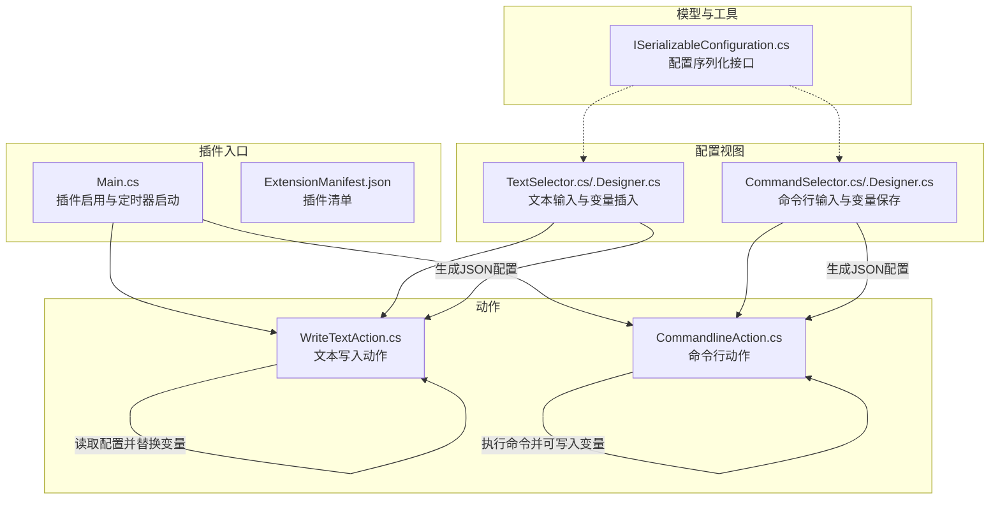
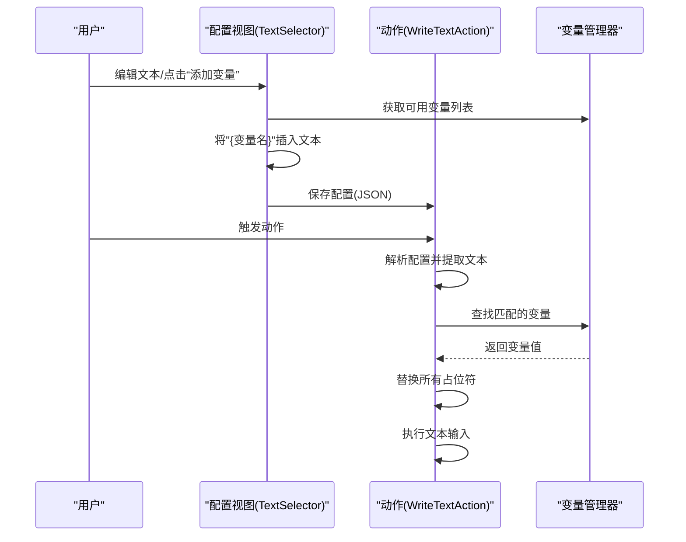
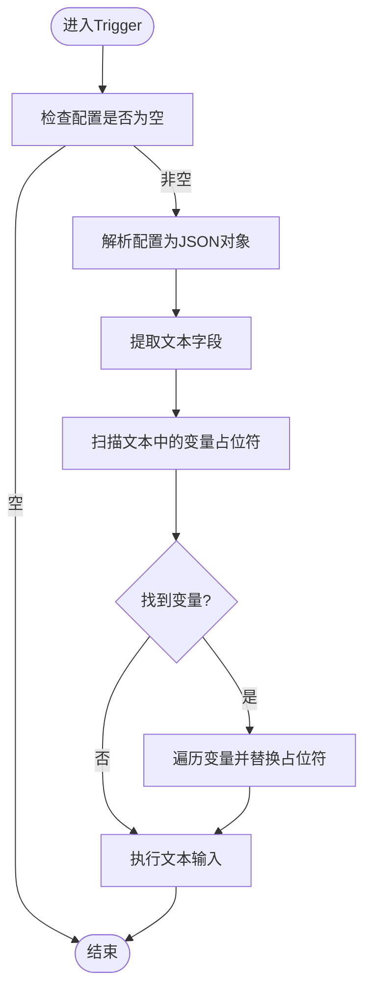
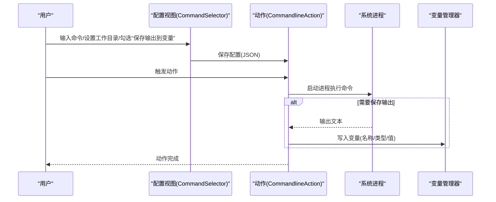
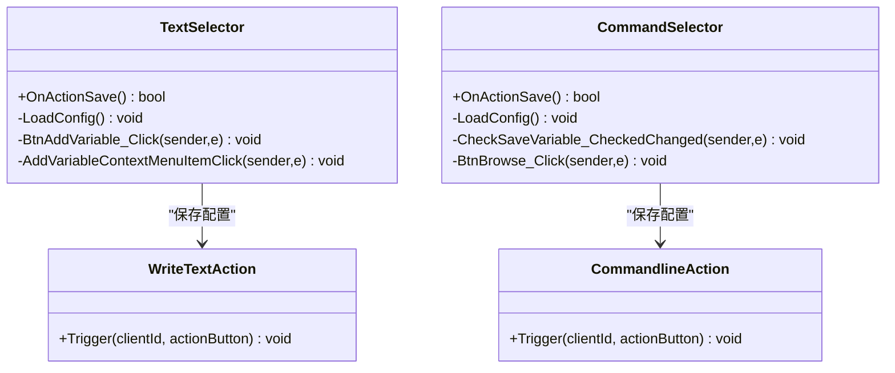
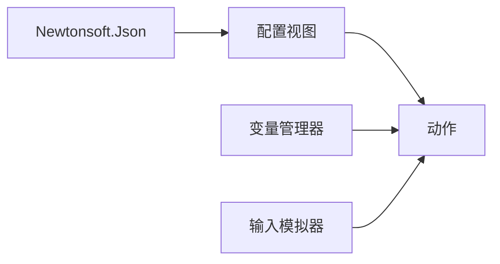

# 变量系统集成

<cite>
**本文引用的文件**
- [Main.cs](file://Main.cs)
- [ExtensionManifest.json](file://ExtensionManifest.json)
- [README.md](file://README.md)
- [Actions/WriteTextAction.cs](file://Actions/WriteTextAction.cs)
- [Actions/CommandlineAction.cs](file://Actions/CommandlineAction.cs)
- [GUI/TextSelector.cs](file://GUI/TextSelector.cs)
- [GUI/TextSelector.Designer.cs](file://GUI/TextSelector.Designer.cs)
- [GUI/CommandSelector.cs](file://GUI/CommandSelector.cs)
- [GUI/CommandSelector.Designer.cs](file://GUI/CommandSelector.Designer.cs)
- [Models/ISerializableConfiguration.cs](file://Models/ISerializableConfiguration.cs)
</cite>

## 目录
1. [简介](#简介)
2. [项目结构](#项目结构)
3. [核心组件](#核心组件)
4. [架构总览](#架构总览)
5. [详细组件分析](#详细组件分析)
6. [依赖关系分析](#依赖关系分析)
7. [性能考量](#性能考量)
8. [故障排查指南](#故障排查指南)
9. [结论](#结论)
10. [附录](#附录)

## 简介
本文件面向Macro Deck插件开发者与使用者，系统性阐述“变量系统集成”的设计与实现，重点覆盖以下方面：
- 变量语法与作用域规则：变量以花括号包裹的名称进行标识；作用域由插件实例与全局变量管理器共同决定。
- 生命周期管理：变量在运行时由变量管理器维护，插件通过配置持久化与读取实现跨会话保存。
- 动作配置中的变量使用：内置变量（由系统提供）与动态变量（通过命令行输出写入）的组合使用。
- 组件间数据流：从GUI控件到动作执行器的配置绑定与变量替换流程。
- 最佳实践与安全考虑：变量注入防护、性能优化策略。
- 实际示例与常见问题：如何在“写入文本”和“命令行”动作中使用变量。

## 项目结构
该插件采用“动作(Action) + 配置视图(View) + 插件入口(Main)”的分层组织方式。变量系统贯穿于配置视图与动作执行器之间，通过JSON配置承载变量占位符，并在触发时完成替换。

图表来源
- [Main.cs:28-58](file://Main.cs#L28-L58)
- [Actions/WriteTextAction.cs:22-45](file://Actions/WriteTextAction.cs#L22-L45)
- [Actions/CommandlineAction.cs:22-58](file://Actions/CommandlineAction.cs#L22-L58)
- [GUI/TextSelector.cs:25-41](file://GUI/TextSelector.cs#L25-L41)
- [GUI/CommandSelector.cs:46-79](file://GUI/CommandSelector.cs#L46-L79)
- [Models/ISerializableConfiguration.cs:5-11](file://Models/ISerializableConfiguration.cs#L5-L11)

章节来源
- [Main.cs:28-58](file://Main.cs#L28-L58)
- [ExtensionManifest.json:1-11](file://ExtensionManifest.json#L1-L11)
- [README.md:1-40](file://README.md#L1-L40)

## 核心组件
- 插件入口与实例
  - 插件启用时初始化语言资源与动作集合；同时启动定时器用于周期性任务。
  - 插件实例通过静态字段暴露给其他模块，便于动作访问共享资源（如输入模拟器）。
- 动作组件
  - 写入文本动作：解析配置中的文本，扫描其中的变量占位符，按名称替换为变量值后执行文本输入。
  - 命令行动作：执行命令，支持将标准输出保存为指定类型的变量，供后续动作使用。
- 配置视图
  - 文本选择器：提供文本输入框与“添加变量”按钮，点击后弹出变量列表，将变量名以占位符形式插入光标位置。
  - 命令行选择器：提供命令输入、工作目录选择、是否保存输出到变量等选项，并在保存时生成JSON配置。
- 模型与工具
  - 配置序列化接口：统一序列化/反序列化逻辑，简化视图模型与动作之间的配置交换。

章节来源
- [Main.cs:14-26](file://Main.cs#L14-L26)
- [Actions/WriteTextAction.cs:14-51](file://Actions/WriteTextAction.cs#L14-L51)
- [Actions/CommandlineAction.cs:14-64](file://Actions/CommandlineAction.cs#L14-L64)
- [GUI/TextSelector.cs:11-76](file://GUI/TextSelector.cs#L11-L76)
- [GUI/CommandSelector.cs:12-143](file://GUI/CommandSelector.cs#L12-L143)
- [Models/ISerializableConfiguration.cs:5-11](file://Models/ISerializableConfiguration.cs#L5-L11)

## 架构总览
变量系统在本插件中的角色是“占位符到值”的映射与替换。其交互路径如下：
- 配置阶段：用户在配置视图中编辑文本或命令，通过“添加变量”按钮插入占位符；视图将当前配置序列化为JSON字符串并存储到动作对象。
- 触发阶段：动作读取配置，扫描文本中的变量占位符，从变量管理器中查找对应变量并进行替换；随后执行具体操作（如文本输入或命令执行）。

图表来源
- [GUI/TextSelector.cs:53-75](file://GUI/TextSelector.cs#L53-L75)
- [Actions/WriteTextAction.cs:22-45](file://Actions/WriteTextAction.cs#L22-L45)

## 详细组件分析

### 写入文本动作（变量替换）
- 配置读取与占位符扫描
  - 动作从自身配置中读取文本内容，扫描其中是否包含变量占位符。
- 变量替换策略
  - 使用变量管理器提供的变量集合，按名称进行大小写不敏感的替换。
- 执行与异常处理
  - 替换完成后执行文本输入；捕获异常并记录警告日志。

图表来源
- [Actions/WriteTextAction.cs:22-45](file://Actions/WriteTextAction.cs#L22-L45)

章节来源
- [Actions/WriteTextAction.cs:22-45](file://Actions/WriteTextAction.cs#L22-L45)

### 命令行动作（动态变量写入）
- 命令执行与输出捕获
  - 启动进程执行命令，若勾选“保存输出到变量”，则重定向标准输出并读取结果。
- 变量写入
  - 根据用户选择的变量类型，调用变量管理器将输出写入指定变量名。
- 配置持久化
  - 视图在保存时生成包含命令、工作目录、是否保存变量及变量名与类型的JSON配置。

图表来源
- [GUI/CommandSelector.cs:46-79](file://GUI/CommandSelector.cs#L46-L79)
- [Actions/CommandlineAction.cs:22-58](file://Actions/CommandlineAction.cs#L22-L58)

章节来源
- [GUI/CommandSelector.cs:46-79](file://GUI/CommandSelector.cs#L46-L79)
- [Actions/CommandlineAction.cs:22-58](file://Actions/CommandlineAction.cs#L22-L58)

### 配置视图（变量插入与配置生成）
- 文本选择器
  - 提供文本输入框与“添加变量”按钮；点击后弹出上下文菜单展示可用变量，将变量名以占位符形式插入当前光标位置。
  - 保存时将文本写入配置对象并序列化为字符串。
- 命令行选择器
  - 提供命令输入、工作目录选择、变量名与变量类型选择；保存时生成包含上述信息的JSON配置。

图表来源
- [GUI/TextSelector.cs:25-76](file://GUI/TextSelector.cs#L25-L76)
- [GUI/CommandSelector.cs:46-143](file://GUI/CommandSelector.cs#L46-L143)
- [Actions/WriteTextAction.cs:22-51](file://Actions/WriteTextAction.cs#L22-L51)
- [Actions/CommandlineAction.cs:22-64](file://Actions/CommandlineAction.cs#L22-L64)

章节来源
- [GUI/TextSelector.cs:25-76](file://GUI/TextSelector.cs#L25-L76)
- [GUI/CommandSelector.cs:46-143](file://GUI/CommandSelector.cs#L46-L143)

## 依赖关系分析
- 外部依赖
  - JSON序列化：使用Newtonsoft.Json进行配置对象的序列化与反序列化。
  - 变量管理：通过MacroDeck.Variables命名空间下的变量管理器与变量实体进行交互。
  - 输入模拟：使用输入模拟器执行文本输入。
- 内部耦合
  - 配置视图与动作之间通过字符串化的JSON配置解耦。
  - 动作与变量管理器之间存在直接依赖，用于读取与写入变量值。
- 可能的循环依赖
  - 当前结构未见显式循环依赖；变量管理器作为外部服务被动作与视图共同依赖。

图表来源
- [Actions/WriteTextAction.cs:1-10](file://Actions/WriteTextAction.cs#L1-L10)
- [Actions/CommandlineAction.cs:1-10](file://Actions/CommandlineAction.cs#L1-L10)
- [GUI/TextSelector.cs:1-7](file://GUI/TextSelector.cs#L1-L7)
- [GUI/CommandSelector.cs:1-8](file://GUI/CommandSelector.cs#L1-L8)

章节来源
- [Actions/WriteTextAction.cs:1-10](file://Actions/WriteTextAction.cs#L1-L10)
- [Actions/CommandlineAction.cs:1-10](file://Actions/CommandlineAction.cs#L1-L10)
- [GUI/TextSelector.cs:1-7](file://GUI/TextSelector.cs#L1-L7)
- [GUI/CommandSelector.cs:1-8](file://GUI/CommandSelector.cs#L1-L8)

## 性能考量
- 变量替换复杂度
  - 对每个占位符进行一次字符串替换；若文本中变量较多，建议减少不必要的重复占位符，避免多次替换开销。
- I/O与进程执行
  - 命令行动作涉及进程启动与输出读取，建议控制命令执行频率与输出大小，必要时开启异步执行与缓冲区优化。
- 序列化成本
  - 配置对象通常较小，序列化/反序列化成本低；保持配置字段简洁有助于降低UI与动作之间的数据传输压力。

## 故障排查指南
- 变量未生效
  - 检查配置中占位符格式是否正确（花括号包裹变量名）。
  - 确认变量管理器中是否存在同名变量且值非空。
- 命令行动作无输出
  - 确认已勾选“保存输出到变量”，并正确填写变量名与类型。
  - 检查命令执行权限与工作目录有效性。
- 文本输入异常
  - 检查日志中的警告信息，确认配置解析与替换流程未抛出异常。
- 配置丢失或无效
  - 确认视图保存流程返回成功，并检查配置字符串是否符合预期格式。

章节来源
- [Actions/WriteTextAction.cs:40-44](file://Actions/WriteTextAction.cs#L40-L44)
- [Actions/CommandlineAction.cs:54-57](file://Actions/CommandlineAction.cs#L54-L57)
- [GUI/CommandSelector.cs:46-79](file://GUI/CommandSelector.cs#L46-L79)

## 结论
本插件通过清晰的“配置视图—动作—变量管理器”三层协作，实现了变量占位符的便捷插入与高效替换。写入文本与命令行动作分别展示了静态变量与动态变量的典型用法。遵循本文的最佳实践与安全建议，可在保证性能的同时提升系统的稳定性与可维护性。

## 附录

### 变量语法与作用域规则
- 语法
  - 占位符格式：{变量名}
  - 支持大小写不敏感的匹配与替换。
- 作用域
  - 由变量管理器统一维护，动作在触发时从全局管理器读取变量值。
- 生命周期
  - 通过动作配置持久化占位符；变量值可通过命令行动作更新，从而影响后续动作的执行结果。

章节来源
- [Actions/WriteTextAction.cs:31-36](file://Actions/WriteTextAction.cs#L31-L36)
- [GUI/TextSelector.cs:53-75](file://GUI/TextSelector.cs#L53-L75)

### 在动作配置中使用变量
- 写入文本
  - 在文本输入框中使用“添加变量”按钮插入占位符，保存后在触发时自动替换。
- 命令行
  - 在命令行动作中勾选“保存输出到变量”，填写变量名与类型，执行后将输出写入变量，供后续动作使用。

章节来源
- [GUI/TextSelector.cs:53-75](file://GUI/TextSelector.cs#L53-L75)
- [GUI/CommandSelector.cs:133-137](file://GUI/CommandSelector.cs#L133-L137)
- [Actions/CommandlineAction.cs:44-52](file://Actions/CommandlineAction.cs#L44-L52)

### 安全与最佳实践
- 变量注入防护
  - 仅允许来自变量管理器的受控变量值参与替换，避免直接拼接用户输入导致的安全风险。
- 性能优化
  - 减少不必要的变量占位符数量；对频繁执行的动作采用缓存策略（如对只读变量值进行本地缓存）。
- 配置健壮性
  - 在动作中增加对配置缺失或格式错误的容错处理，并记录日志以便诊断。

章节来源
- [Actions/WriteTextAction.cs:26-44](file://Actions/WriteTextAction.cs#L26-L44)
- [Actions/CommandlineAction.cs:26-57](file://Actions/CommandlineAction.cs#L26-L57)