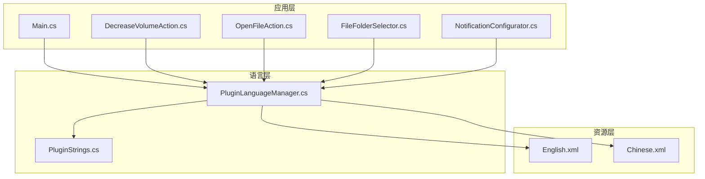
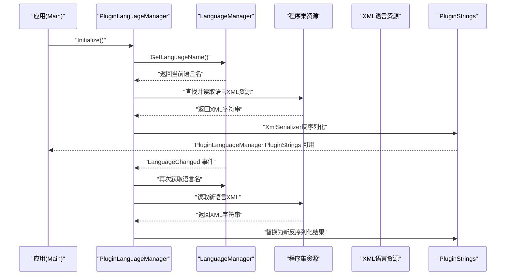
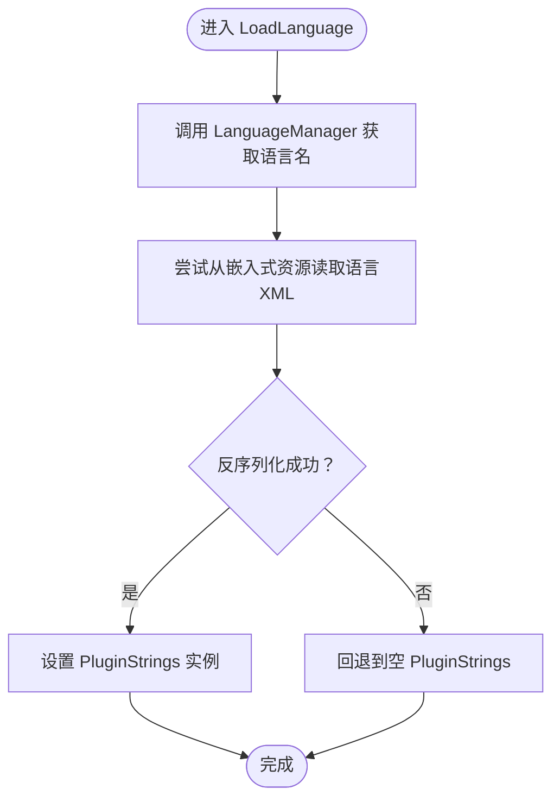
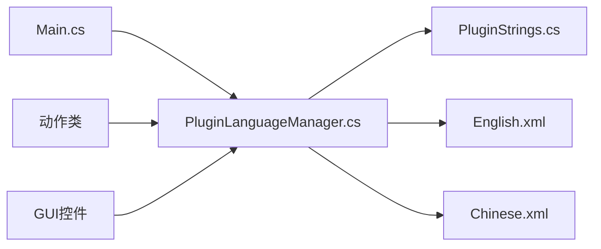

# 多语言支持

<cite>
**本文引用的文件**
- [PluginLanguageManager.cs](file://Language/PluginLanguageManager.cs)
- [PluginStrings.cs](file://Language/PluginStrings.cs)
- [Chinese.xml](file://Resources/Languages/Chinese.xml)
- [English.xml](file://Resources/Languages/English.xml)
- [README.md（语言贡献指南）](file://Resources/Languages/README.md)
- [Main.cs](file://Main.cs)
- [DecreaseVolumeAction.cs](file://Actions/DecreaseVolumeAction.cs)
- [OpenFileAction.cs](file://Actions/OpenFileAction.cs)
- [FileFolderSelector.cs](file://GUI/FileFolderSelector.cs)
- [NotificationConfigurator.cs](file://GUI/NotificationConfigurator.cs)
- [README.md（语言模块入口）](file://Language/README.md)
</cite>

## 目录
1. [简介](#简介)
2. [项目结构](#项目结构)
3. [核心组件](#核心组件)
4. [架构总览](#架构总览)
5. [详细组件分析](#详细组件分析)
6. [依赖关系分析](#依赖关系分析)
7. [性能考量](#性能考量)
8. [故障排查指南](#故障排查指南)
9. [结论](#结论)
10. [附录](#附录)

## 简介
本文件系统性阐述该插件的多语言支持体系，重点围绕 PluginLanguageManager 的语言管理机制展开，覆盖语言包加载、切换与回退策略；解析 XML 语言资源文件的结构与组织方式，并给出中文与英文语言包的具体实现对照；提供新增语言支持的完整流程（含 XML 编写规范、键名命名约定与资源管理方法）；最后附上语言切换示例与调试技巧，帮助开发者快速理解与扩展多语言能力。

## 项目结构
多语言相关的核心位置集中在 Language 与 Resources/Languages 两个目录：
- Language：包含语言管理器与字符串模型
- Resources/Languages：包含各语言的 XML 资源文件
- GUI 与 Actions：在运行时通过 PluginLanguageManager 获取本地化字符串进行展示

图表来源
- [PluginLanguageManager.cs:1-51](file://Language/PluginLanguageManager.cs#L1-L51)
- [PluginStrings.cs:1-70](file://Language/PluginStrings.cs#L1-L70)
- [English.xml:1-62](file://Resources/Languages/English.xml#L1-L62)
- [Chinese.xml:1-62](file://Resources/Languages/Chinese.xml#L1-L62)
- [Main.cs:1-60](file://Main.cs#L1-L60)
- [DecreaseVolumeAction.cs:1-19](file://Actions/DecreaseVolumeAction.cs#L1-L19)
- [OpenFileAction.cs:1-47](file://Actions/OpenFileAction.cs#L1-L47)
- [FileFolderSelector.cs:1-189](file://GUI/FileFolderSelector.cs#L1-L189)
- [NotificationConfigurator.cs:1-55](file://GUI/NotificationConfigurator.cs#L1-L55)

章节来源
- [PluginLanguageManager.cs:1-51](file://Language/PluginLanguageManager.cs#L1-L51)
- [PluginStrings.cs:1-70](file://Language/PluginStrings.cs#L1-L70)
- [English.xml:1-62](file://Resources/Languages/English.xml#L1-L62)
- [Chinese.xml:1-62](file://Resources/Languages/Chinese.xml#L1-L62)
- [Main.cs:1-60](file://Main.cs#L1-L60)

## 核心组件
- PluginLanguageManager：负责初始化、监听语言变更事件、从嵌入式资源读取对应语言的 XML 并反序列化为 PluginStrings 实例，同时提供回退机制。
- PluginStrings：承载所有本地化键值，字段名即为键名，值为对应语言的显示文本。
- XML 语言资源：以 XML 形式存放，根节点为 PluginStrings，包含语言元信息（语言名、语言代码、作者）以及若干键值对。

章节来源
- [PluginLanguageManager.cs:8-51](file://Language/PluginLanguageManager.cs#L8-L51)
- [PluginStrings.cs:3-70](file://Language/PluginStrings.cs#L3-L70)
- [English.xml:1-62](file://Resources/Languages/English.xml#L1-L62)
- [Chinese.xml:1-62](file://Resources/Languages/Chinese.xml#L1-L62)

## 架构总览
下图展示了语言切换与加载的关键流程：应用启动时初始化语言管理器；当语言发生变更时，管理器重新读取对应语言的 XML 资源并反序列化为字符串对象，供各组件直接访问。

图表来源
- [PluginLanguageManager.cs:12-49](file://Language/PluginLanguageManager.cs#L12-L49)
- [Main.cs:28-30](file://Main.cs#L28-L30)

## 详细组件分析

### PluginLanguageManager 组件分析
- 初始化与事件绑定：在初始化时立即加载一次语言，随后订阅语言变更事件，确保语言切换即时生效。
- 加载逻辑：从 LanguageManager 获取当前语言名，尝试从程序集的嵌入式资源中定位对应语言的 XML 文件，使用 XmlSerializer 将其反序列化为 PluginStrings 实例。
- 回退策略：反序列化过程中若出现异常，将回退到空的 PluginStrings 实例，保证应用稳定运行。
- 资源定位：若语言名为空或未找到对应 XML，则回退到默认语言（英文），确保始终有可用资源。

图表来源
- [PluginLanguageManager.cs:18-33](file://Language/PluginLanguageManager.cs#L18-L33)

章节来源
- [PluginLanguageManager.cs:12-49](file://Language/PluginLanguageManager.cs#L12-L49)

### PluginStrings 数据模型
- 字段即键：每个公共字符串字段代表一个本地化键，例如“动作名称”、“描述”、“界面提示”等。
- 元信息字段：包含语言名、语言代码与作者信息，便于识别与统计。
- 命名约定：采用语义化的 PascalCase 命名，如 ActionXxx、UIXxx、ErrorXxx 等，保持一致性与可读性。

章节来源
- [PluginStrings.cs:3-70](file://Language/PluginStrings.cs#L3-L70)

### XML 语言资源文件结构与组织
- 根节点：PluginStrings
- 元信息：__Language__、__LanguageCode__、__Author__
- 键值对：与 PluginStrings 中的字段一一对应，字段名为 XML 子元素名，文本为翻译内容
- 默认语言：英文作为回退语言，确保在未知语言或资源缺失时仍能正常工作
- 语言文件命名：与 LanguageManager 支持的语言名称一致，且文件名与 __Language__ 内容匹配

章节来源
- [English.xml:1-62](file://Resources/Languages/English.xml#L1-L62)
- [Chinese.xml:1-62](file://Resources/Languages/Chinese.xml#L1-L62)
- [README.md（语言贡献指南）:10-13](file://Resources/Languages/README.md#L10-L13)

### 应用侧使用示例
- 动作类：通过 PluginLanguageManager.PluginStrings 访问动作名称与描述，实现动态本地化展示。
- GUI 控件：在控件初始化阶段设置标签、提示与消息框文本，确保界面随语言切换而更新。
- 配置视图：在保存配置前进行校验，使用本地化文本弹出错误提示，提升用户体验。

章节来源
- [DecreaseVolumeAction.cs:10-12](file://Actions/DecreaseVolumeAction.cs#L10-L12)
- [FileFolderSelector.cs:26-36](file://GUI/FileFolderSelector.cs#L26-L36)
- [NotificationConfigurator.cs:19-20](file://GUI/NotificationConfigurator.cs#L19-L20)

## 依赖关系分析
- 启动依赖：Main 在启用时调用 PluginLanguageManager.Initialize 完成首次加载与事件绑定。
- 运行时依赖：各动作与 GUI 组件通过 PluginLanguageManager.PluginStrings 访问本地化文本。
- 资源依赖：PluginLanguageManager 依赖程序集中的嵌入式 XML 资源，资源名遵循固定命名规则。
- 事件依赖：依赖 LanguageManager 的语言变更事件，实现无重启的语言切换。

图表来源
- [Main.cs:28-30](file://Main.cs#L28-L30)
- [PluginLanguageManager.cs:10-16](file://Language/PluginLanguageManager.cs#L10-L16)
- [PluginStrings.cs:3-70](file://Language/PluginStrings.cs#L3-L70)
- [English.xml:1-62](file://Resources/Languages/English.xml#L1-L62)
- [Chinese.xml:1-62](file://Resources/Languages/Chinese.xml#L1-L62)

章节来源
- [Main.cs:28-30](file://Main.cs#L28-L30)
- [PluginLanguageManager.cs:10-16](file://Language/PluginLanguageManager.cs#L10-L16)

## 性能考量
- 反序列化成本：每次语言切换都会触发一次 XML 反序列化，建议在语言切换频率较低的场景下使用；若需频繁切换，可考虑在内存中缓存已反序列化的实例并在切换时复用。
- 资源读取：嵌入式资源读取为内存操作，通常开销较小；避免在同一帧内多次触发语言切换。
- 回退策略：回退到空实例不会抛出异常，但后续访问可能需要额外判空处理，建议在访问前统一检查 PluginStrings 是否有效。

## 故障排查指南
- 语言未生效：确认 LanguageManager 返回的语言名与资源文件名一致；检查资源是否正确嵌入程序集。
- 切换无效：确认 LanguageManager.LanguageChanged 事件是否被触发；检查 PluginLanguageManager 是否正确订阅事件。
- 回退到默认：若资源缺失或反序列化失败，将回退到空实例；此时应检查 English.xml 是否存在且格式正确。
- 调试技巧：
  - 在 PluginLanguageManager.LoadLanguage 中增加日志记录，打印当前语言名与资源读取状态
  - 在反序列化前后对比 PluginStrings 的字段数量，验证 XML 是否完整
  - 使用最小化配置重现问题，逐步排除资源与事件绑定的影响

章节来源
- [PluginLanguageManager.cs:18-33](file://Language/PluginLanguageManager.cs#L18-L33)
- [README.md（语言模块入口）:1-3](file://Language/README.md#L1-L3)

## 结论
该多语言系统通过简洁的 PluginLanguageManager 实现了基于 XML 的本地化资源管理，结合 LanguageManager 的语言变更事件，实现了无需重启即可动态切换语言的能力。English.xml 作为默认回退资源，确保了系统的健壮性。开发者可通过新增 XML 语言文件的方式扩展新语言，并遵循既定的命名与结构规范，即可无缝集成到现有框架中。

## 附录

### 新增语言支持的完整流程
- 准备工作
  - 确认目标语言在 LanguageManager 中受支持，语言名与 ISO 名称一致
  - 参考现有 English.xml 与 Chinese.xml 的结构与字段，确保键集合一致
- 创建 XML 文件
  - 文件命名为 ISO 语言名（如 German.xml）
  - 根节点为 PluginStrings，包含 __Language__、__LanguageCode__、__Author__ 与全部键值对
  - __LanguageCode__ 使用 ISO-639-1 代码
- 资源嵌入
  - 将 XML 文件加入项目并设置为“嵌入式资源”
  - 确保构建后资源存在于程序集清单中
- 验证与测试
  - 在应用中切换至新语言，观察界面文本是否正确更新
  - 若出现回退，检查 XML 格式与字段完整性
- 提交与维护
  - 按贡献指南提交 Pull Request，补充必要的元信息与作者署名

章节来源
- [README.md（语言贡献指南）:5-13](file://Resources/Languages/README.md#L5-L13)
- [English.xml:1-62](file://Resources/Languages/English.xml#L1-L62)
- [Chinese.xml:1-62](file://Resources/Languages/Chinese.xml#L1-L62)

### XML 编写规范与键名命名约定
- 规范
  - 根节点：PluginStrings
  - 元信息：__Language__（ISO 名称）、__LanguageCode__（ISO-639-1）、__Author__（作者）
  - 键名：与 PluginStrings 字段名完全一致，大小写敏感
- 命名约定
  - 动作类：ActionXxx、ActionXxxDescription
  - 界面提示：UIXxx、MessageXxx、TitleXxx
  - 错误与校验：ErrorXxx、ValidationXxx
  - 资源选择：ChooseXxx、ImportXxx、Path、Arguments 等
- 示例参考
  - 英文与中文语言包可作为模板，逐项对照翻译

章节来源
- [PluginStrings.cs:3-70](file://Language/PluginStrings.cs#L3-L70)
- [README.md（语言贡献指南）:10-13](file://Resources/Languages/README.md#L10-L13)
- [English.xml:1-62](file://Resources/Languages/English.xml#L1-L62)
- [Chinese.xml:1-62](file://Resources/Languages/Chinese.xml#L1-L62)

### 实际语言切换示例
- 启动时加载
  - 应用启用时调用 PluginLanguageManager.Initialize，立即加载当前语言资源
- 运行时切换
  - 当 LanguageManager.LanguageChanged 事件触发时，PluginLanguageManager 自动重新加载对应语言资源
- 访问本地化文本
  - 动作类与 GUI 组件通过 PluginLanguageManager.PluginStrings 直接访问键值，无需手动拼接或条件判断

章节来源
- [Main.cs:28-30](file://Main.cs#L28-L30)
- [PluginLanguageManager.cs:12-16](file://Language/PluginLanguageManager.cs#L12-L16)
- [DecreaseVolumeAction.cs:10-12](file://Actions/DecreaseVolumeAction.cs#L10-L12)
- [FileFolderSelector.cs:26-36](file://GUI/FileFolderSelector.cs#L26-L36)