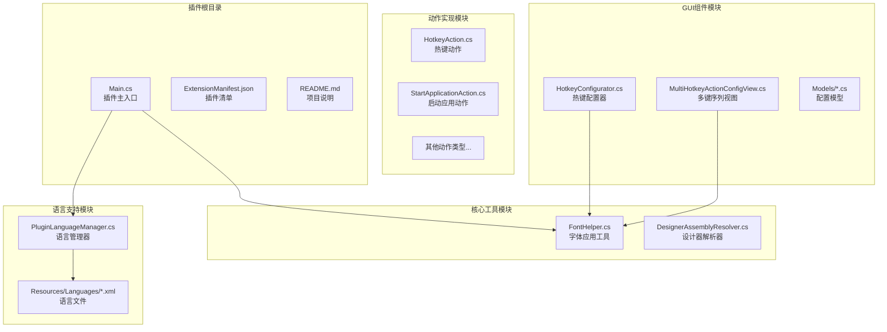
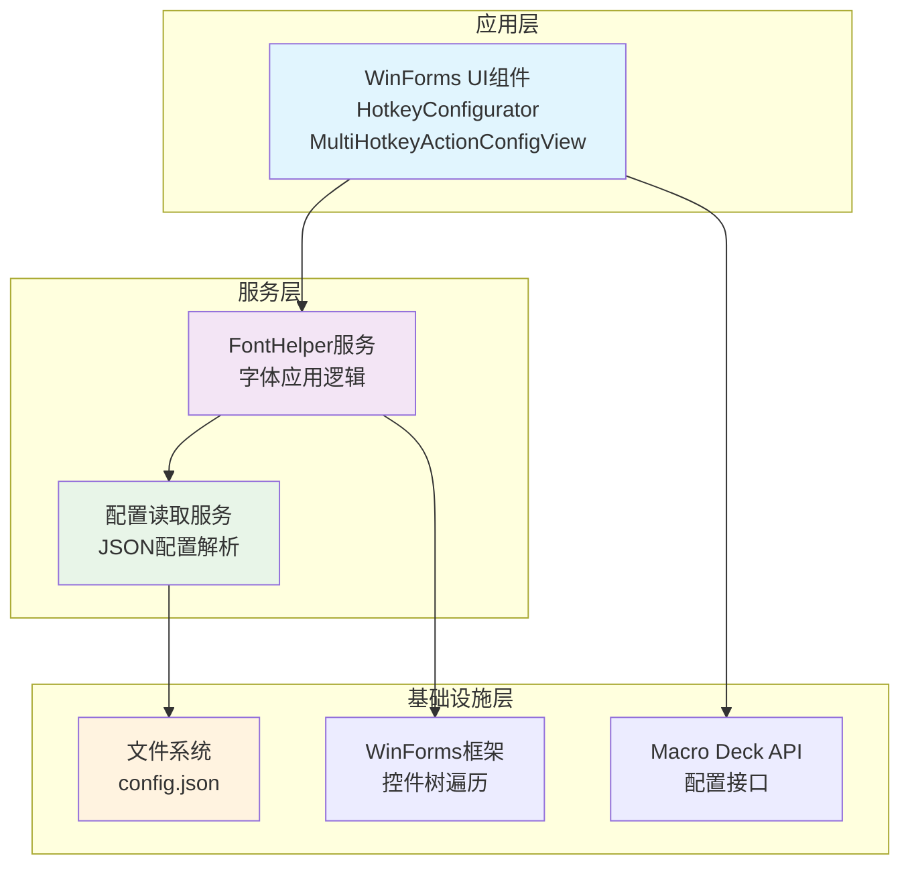
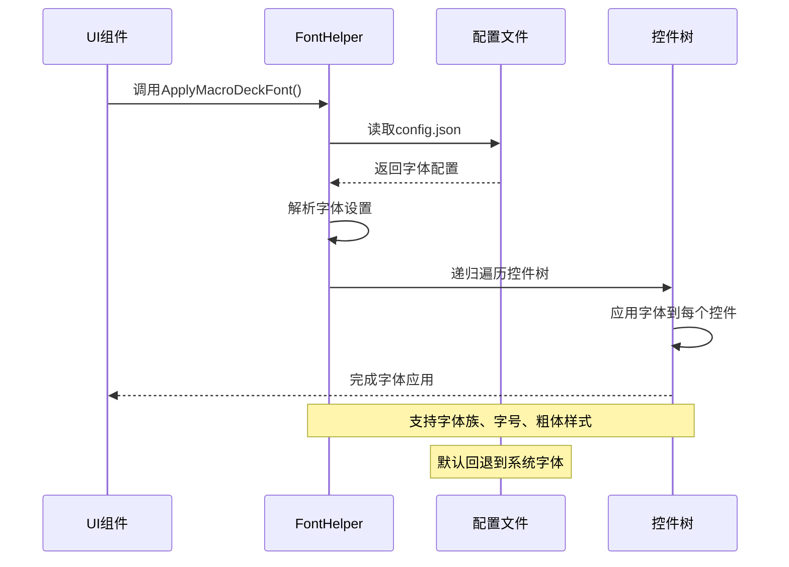
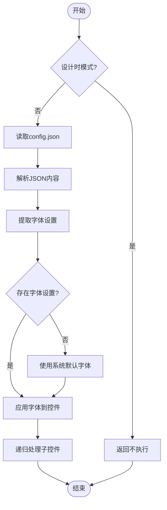
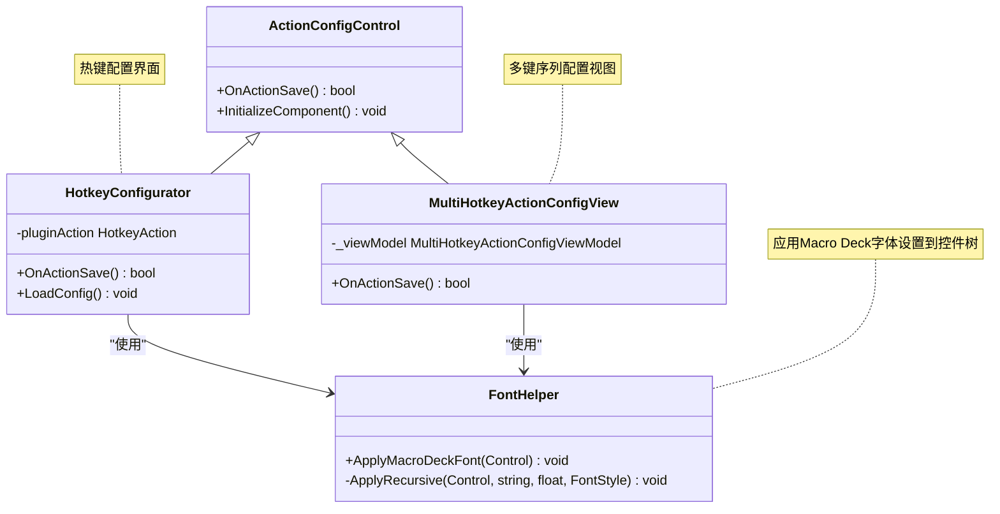
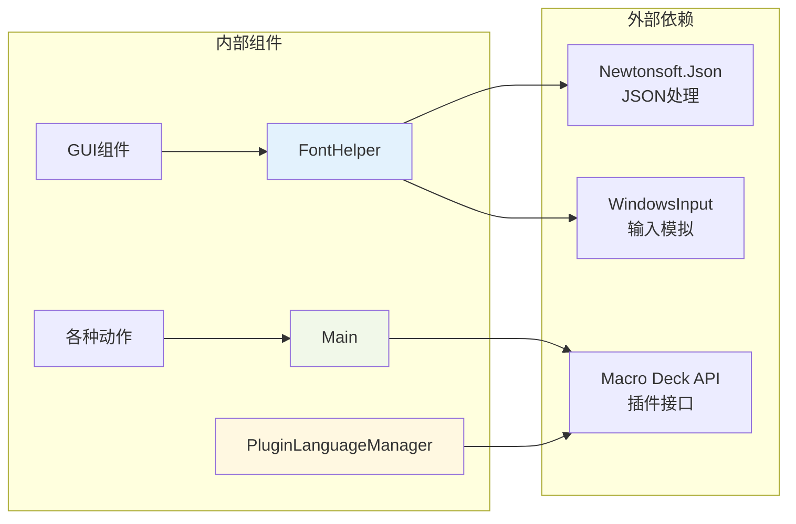

# 字体管理系统

<cite>
**本文档引用的文件**
- [Main.cs](file://Main.cs)
- [FontHelper.cs](file://Utils/FontHelper.cs)
- [DesignerAssemblyResolver.cs](file://Utils/DesignerAssemblyResolver.cs)
- [PluginLanguageManager.cs](file://Language/PluginLanguageManager.cs)
- [HotkeyAction.cs](file://Actions/HotkeyAction.cs)
- [HotkeyConfigurator.cs](file://GUI/HotkeyConfigurator.cs)
- [MultiHotkeyActionConfigModel.cs](file://Models/MultiHotkeyActionConfigModel.cs)
- [StartApplicationActionConfigModel.cs](file://Models/StartApplicationActionConfigModel.cs)
- [MultiHotkeyActionConfigView.cs](file://Views/MultiHotkeyActionConfigView.cs)
- [ExtensionManifest.json](file://ExtensionManifest.json)
- [README.md](file://README.md)
</cite>

## 目录
1. [简介](#简介)
2. [项目结构](#项目结构)
3. [核心组件](#核心组件)
4. [架构概览](#架构概览)
5. [详细组件分析](#详细组件分析)
6. [依赖关系分析](#依赖关系分析)
7. [性能考虑](#性能考虑)
8. [故障排除指南](#故障排除指南)
9. [结论](#结论)

## 简介

字体管理系统是Macro Deck Windows Utils插件的核心功能模块，负责统一管理和应用Macro Deck的字体设置到插件的所有UI组件中。该系统通过读取Macro Deck的配置文件，动态获取用户设置的字体、字号和粗体样式，并递归应用到所有WinForms控件上，确保插件界面与Macro Deck的整体视觉风格保持一致。

该系统主要服务于插件的用户界面渲染，提供了一种标准化的方式来处理不同语言环境下的字体显示问题，特别是针对多语言支持场景下的字体适配需求。

## 项目结构

该项目采用标准的插件架构设计，主要分为以下几个核心目录：



**图表来源**
- [Main.cs:1-85](file://Main.cs#L1-L85)
- [FontHelper.cs:1-38](file://Utils/FontHelper.cs#L1-L38)
- [PluginLanguageManager.cs:1-71](file://Language/PluginLanguageManager.cs#L1-L71)

**章节来源**
- [Main.cs:1-85](file://Main.cs#L1-L85)
- [ExtensionManifest.json:1-11](file://ExtensionManifest.json#L1-L11)
- [README.md:1-40](file://README.md#L1-L40)

## 核心组件

### FontHelper字体助手

FontHelper是字体管理系统的核心组件，提供了静态方法来应用Macro Deck的字体设置到WinForms控件树上。

**主要功能特性：**
- 从Macro Deck配置文件读取字体设置
- 支持字体族、字号和粗体样式的动态应用
- 递归遍历控件树，确保所有子控件都应用相同的字体设置
- 提供设计时保护，避免在设计器环境中执行

**关键实现细节：**
- 配置文件路径：`%APPDATA%\Macro Deck\config.json`
- 默认字体回退机制：如果配置缺失，使用系统默认字体
- 字体样式处理：根据配置决定是否应用粗体样式

**章节来源**
- [FontHelper.cs:10-38](file://Utils/FontHelper.cs#L10-L38)

### 插件主入口Main

Main类作为插件的全局入口点，负责初始化字体系统和其他核心功能。

**主要职责：**
- 管理插件生命周期和全局状态
- 初始化语言包和字体系统
- 注册所有可用的动作类型
- 提供全局定时器服务

**章节来源**
- [Main.cs:24-85](file://Main.cs#L24-L85)

### 设计器装配解析器

DesignerAssemblyResolver专门处理Visual Studio设计器环境中的程序集解析问题，确保插件在设计时能够正确加载所需的依赖项。

**解决的问题：**
- WinForms Designer的独立AssemblyLoadContext问题
- Sentry.dll等第三方库的加载冲突
- 设计时环境下的程序集解析机制差异

**章节来源**
- [DesignerAssemblyResolver.cs:26-78](file://Utils/DesignerAssemblyResolver.cs#L26-L78)

## 架构概览

字体管理系统采用分层架构设计，确保了良好的模块分离和可维护性：



**图表来源**
- [FontHelper.cs:16-37](file://Utils/FontHelper.cs#L16-L37)
- [HotkeyConfigurator.cs:23-30](file://GUI/HotkeyConfigurator.cs#L23-L30)
- [MultiHotkeyActionConfigView.cs:21-25](file://Views/MultiHotkeyActionConfigView.cs#L21-L25)

## 详细组件分析

### 字体应用流程

字体管理系统的工作流程遵循以下步骤：



**图表来源**
- [FontHelper.cs:16-37](file://Utils/FontHelper.cs#L16-L37)
- [HotkeyConfigurator.cs:26-27](file://GUI/HotkeyConfigurator.cs#L26-L27)

### 配置文件结构分析

字体系统依赖于Macro Deck的配置文件来获取字体设置：



**图表来源**
- [FontHelper.cs:18-36](file://Utils/FontHelper.cs#L18-L36)

**章节来源**
- [FontHelper.cs:12-29](file://Utils/FontHelper.cs#L12-L29)

### UI组件集成模式

所有GUI组件都遵循统一的字体应用模式：



**图表来源**
- [HotkeyConfigurator.cs:15-30](file://GUI/HotkeyConfigurator.cs#L15-L30)
- [MultiHotkeyActionConfigView.cs:11-25](file://Views/MultiHotkeyActionConfigView.cs#L11-L25)
- [FontHelper.cs:10-16](file://Utils/FontHelper.cs#L10-L16)

**章节来源**
- [HotkeyConfigurator.cs:23-30](file://GUI/HotkeyConfigurator.cs#L23-L30)
- [MultiHotkeyActionConfigView.cs:21-25](file://Views/MultiHotkeyActionConfigView.cs#L21-L25)

### 配置模型分析

系统使用多种配置模型来支持不同的功能需求：

```mermaid
erDiagram
MULTI_HOTKEY_CONFIG_MODEL {
List~IMultiHotkeyAction~ MultiHotkeyActions
bool SyncButtonState
string Serialize()
static MultiHotkeyActionConfigModel Deserialize(string)
}
START_APPLICATION_CONFIG_MODEL {
string Path
string Arguments
bool RunAsAdmin
bool SyncButtonState
StartMethod StartMethod
string Serialize()
static StartApplicationActionConfigModel Deserialize(string)
}
ISERIALIZABLE_CONFIGURATION {
<<interface>>
string Serialize()
static Deserialize(config)
}
MULTI_HOTKEY_ACTION_CONFIG_MODEL <|.. ISERIALIZABLE_CONFIGURATION
START_APPLICATION_CONFIG_MODEL <|.. ISERIALIZABLE_CONFIGURATION
note for MULTI_HOTKEY_CONFIG_MODEL "多键序列配置"
note for START_APPLICATION_CONFIG_MODEL "应用启动配置"
note for ISERIALIZABLE_CONFIGURATION "序列化接口"
```

**图表来源**
- [MultiHotkeyActionConfigModel.cs:9-32](file://Models/MultiHotkeyActionConfigModel.cs#L9-L32)
- [StartApplicationActionConfigModel.cs:9-48](file://Models/StartApplicationActionConfigModel.cs#L9-L48)

**章节来源**
- [MultiHotkeyActionConfigModel.cs:6-32](file://Models/MultiHotkeyActionConfigModel.cs#L6-L32)
- [StartApplicationActionConfigModel.cs:6-64](file://Models/StartApplicationActionConfigModel.cs#L6-L64)

## 依赖关系分析

字体管理系统与其他组件的依赖关系如下：



**图表来源**
- [FontHelper.cs:1-7](file://Utils/FontHelper.cs#L1-L7)
- [Main.cs:1-8](file://Main.cs#L1-L8)
- [PluginLanguageManager.cs:1-5](file://Language/PluginLanguageManager.cs#L1-L5)

**章节来源**
- [ExtensionManifest.json:1-11](file://ExtensionManifest.json#L1-L11)
- [README.md:33-40](file://README.md#L33-L40)

## 性能考虑

字体管理系统在设计时充分考虑了性能优化：

### 内存管理
- 使用静态方法避免重复实例化
- 递归遍历时采用深度优先策略
- 配置读取采用一次性解析，避免重复I/O操作

### 执行效率
- 设计时保护机制避免不必要的计算
- 字体应用操作批量执行，减少WinForms刷新次数
- 配置解析使用高效的JSON库

### 资源优化
- 配置文件只在初始化时读取
- 字体对象复用，避免频繁创建销毁
- 错误处理采用异常抑制，确保不影响主流程

## 故障排除指南

### 常见问题及解决方案

**问题1：字体未正确应用**
- 检查Macro Deck配置文件是否存在
- 确认config.json中包含Font相关设置
- 验证控件是否正确调用ApplyMacroDeckFont方法

**问题2：设计器环境异常**
- 确认DesignerAssemblyResolver已正确编译
- 检查Macro Deck安装路径配置
- 验证第三方库的程序集版本兼容性

**问题3：多语言显示问题**
- 确认语言文件资源已正确嵌入
- 检查语言文件的XML格式有效性
- 验证语言切换事件的订阅状态

**章节来源**
- [FontHelper.cs:18-29](file://Utils/FontHelper.cs#L18-L29)
- [DesignerAssemblyResolver.cs:42-59](file://Utils/DesignerAssemblyResolver.cs#L42-L59)

## 结论

字体管理系统作为Macro Deck Windows Utils插件的重要组成部分，通过简洁而高效的设计实现了字体设置的统一管理。系统的主要优势包括：

1. **统一性**：确保所有插件UI组件使用一致的字体设置
2. **灵活性**：支持动态配置和运行时字体调整
3. **兼容性**：与Macro Deck的配置系统无缝集成
4. **可维护性**：清晰的模块分离和标准化的接口设计

该系统为插件开发者提供了一个可靠的字体管理基础，使得复杂的UI布局能够在不同语言环境下保持一致的用户体验。通过合理的错误处理和性能优化，系统能够在各种使用场景下稳定运行。