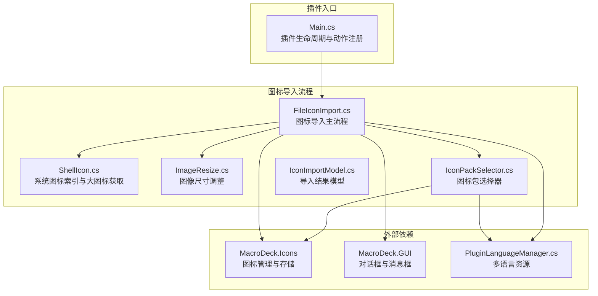
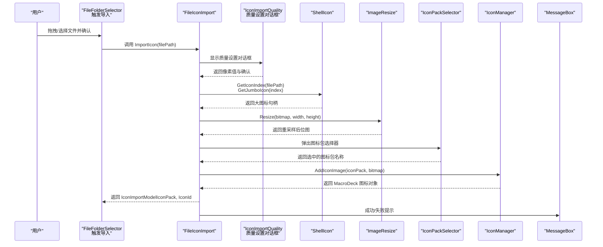
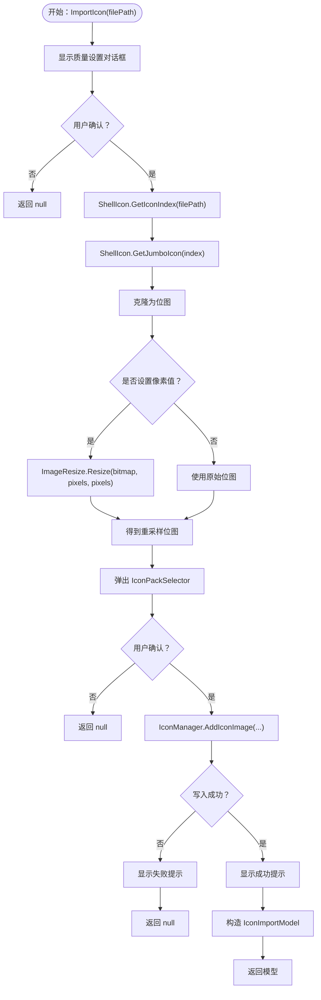
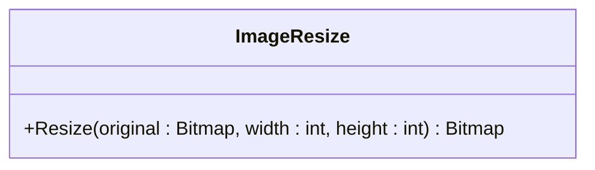
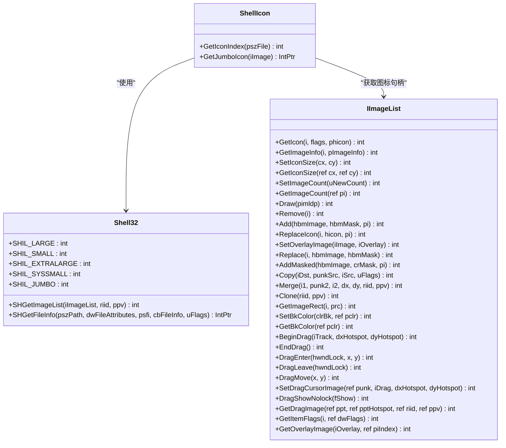
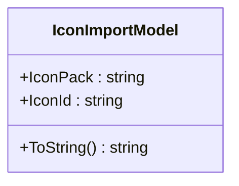
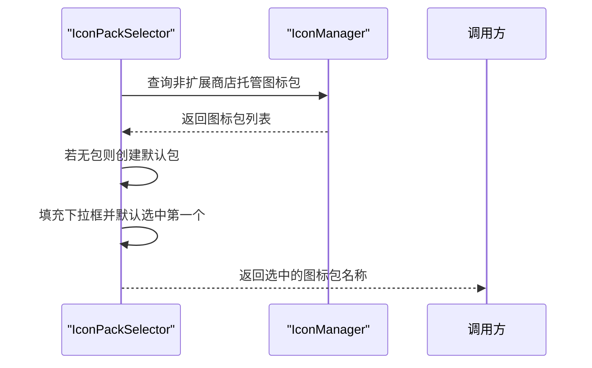
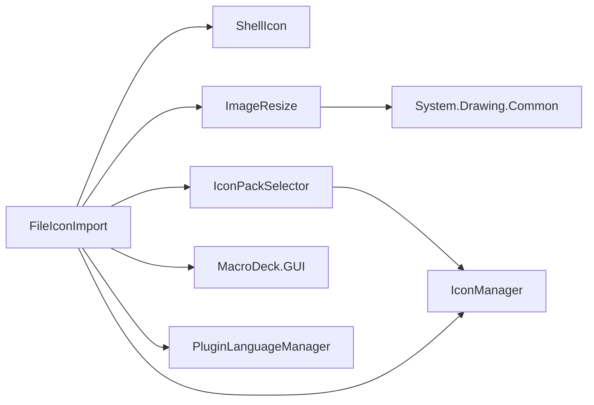

# 自定义图标导入

<cite>
**本文档引用的文件**
- [FileIconImport.cs](file://Utils/FileIconImport.cs)
- [ImageResize.cs](file://Utils/ImageResize.cs)
- [ShellIcon.cs](file://Utils/ShellIcon.cs)
- [IconImportModel.cs](file://Models/IconImportModel.cs)
- [IconPackSelector.cs](file://GUI/IconPackSelector.cs)
- [IconPackSelector.Designer.cs](file://GUI/IconPackSelector.Designer.cs)
- [WindowsShortcut.cs](file://Utils/WindowsShortcut.cs)
- [PluginLanguageManager.cs](file://Language/PluginLanguageManager.cs)
- [Main.cs](file://Main.cs)
- [Windows Utils.csproj](file://Windows Utils.csproj)
- [README.md](file://README.md)
</cite>

## 目录
1. [简介](#简介)
2. [项目结构](#项目结构)
3. [核心组件](#核心组件)
4. [架构总览](#架构总览)
5. [详细组件分析](#详细组件分析)
6. [依赖关系分析](#依赖关系分析)
7. [性能考虑](#性能考虑)
8. [故障排除指南](#故障排除指南)
9. [结论](#结论)
10. [附录](#附录)

## 简介
本技术文档聚焦于“自定义图标导入”功能，围绕以下关键模块展开：FileIconImport 图标提取与导入流程、ImageResize 图像处理工具、ShellIcon Windows Shell 集成、IconImportModel 数据模型，以及与之配套的 GUI 选择器与语言资源管理。文档旨在帮助开发者理解图标从文件系统到 Macro Deck 图标包的完整链路，并提供最佳实践、性能优化建议与故障排除指导。

## 项目结构
该插件基于 Macro Deck 2 的扩展框架构建，采用分层组织：Utils（工具类）、GUI（界面控件）、Models（数据模型）、Language（本地化资源）等。图标导入功能主要由 Utils 中的 FileIconImport 调用 ShellIcon 获取系统图标，再通过 ImageResize 进行尺寸调整，最终写入 Macro Deck 的图标包。

图表来源
- [Main.cs:28-58](file://Main.cs#L28-L58)
- [FileIconImport.cs:14-64](file://Utils/FileIconImport.cs#L14-L64)
- [ShellIcon.cs:313-335](file://Utils/ShellIcon.cs#L313-L335)
- [ImageResize.cs:8-17](file://Utils/ImageResize.cs#L8-L17)
- [IconPackSelector.cs:20-36](file://GUI/IconPackSelector.cs#L20-L36)
- [IconImportModel.cs:3-15](file://Models/IconImportModel.cs#L3-L15)

章节来源
- [Main.cs:14-58](file://Main.cs#L14-L58)
- [Windows Utils.csproj:1-74](file://Windows Utils.csproj#L1-L74)

## 核心组件
- FileIconImport：负责弹出质量设置对话框、调用 ShellIcon 获取系统图标句柄、克隆为位图、按需缩放、选择目标图标包并写入 MacroDeck 图标系统，最后返回包含图标包名与图标ID的结果模型。
- ImageResize：提供基础的等比或固定尺寸重采样，使用 GDI+ Graphics.DrawImage 完成像素级重绘。
- ShellIcon：封装 Windows Shell API，通过 SHGetFileInfo 获取系统图标索引，再通过 IImageList 获取 Jumbo（256×256）大图标句柄。
- IconImportModel：承载导入成功后的图标包名与图标ID，便于后续配置持久化与引用。
- IconPackSelector：在 MacroDeck 可用的非扩展商店托管图标包中进行选择，若不存在则自动创建默认包。
- PluginLanguageManager：加载插件内部多语言资源，用于 UI 文案与提示信息显示。
- WindowsShortcut：解析 .lnk 快捷方式目标路径（辅助文件选择场景），但当前图标导入流程未直接调用该工具。

章节来源
- [FileIconImport.cs:14-64](file://Utils/FileIconImport.cs#L14-L64)
- [ImageResize.cs:8-17](file://Utils/ImageResize.cs#L8-L17)
- [ShellIcon.cs:313-335](file://Utils/ShellIcon.cs#L313-L335)
- [IconImportModel.cs:3-15](file://Models/IconImportModel.cs#L3-L15)
- [IconPackSelector.cs:20-36](file://GUI/IconPackSelector.cs#L20-L36)
- [PluginLanguageManager.cs:12-33](file://Language/PluginLanguageManager.cs#L12-L33)
- [WindowsShortcut.cs:8-64](file://Utils/WindowsShortcut.cs#L8-L64)

## 架构总览
下图展示了从用户触发到图标入库的关键交互序列：

图表来源
- [FileIconImport.cs:16-64](file://Utils/FileIconImport.cs#L16-L64)
- [ShellIcon.cs:313-335](file://Utils/ShellIcon.cs#L313-L335)
- [ImageResize.cs:8-17](file://Utils/ImageResize.cs#L8-L17)
- [IconPackSelector.cs:20-36](file://GUI/IconPackSelector.cs#L20-L36)

## 详细组件分析

### FileIconImport 组件分析
- 功能职责
  - 弹出质量设置对话框以确定目标像素大小。
  - 通过 ShellIcon 获取系统图标索引并提取 Jumbo 大图标句柄，克隆为位图。
  - 若设置了像素值，则调用 ImageResize 对位图进行重采样；否则直接使用原图。
  - 弹出 IconPackSelector 选择目标图标包，调用 MacroDeck 图标管理器写入新图标。
  - 成功后弹出提示并返回包含图标包名与图标ID的模型对象；失败时返回空并提示错误。
- 错误处理
  - 当位图为空或写入异常时，捕获异常并显示失败提示。
- 依赖关系
  - 依赖 ShellIcon 提供系统图标句柄。
  - 依赖 ImageResize 执行尺寸调整。
  - 依赖 IconPackSelector 与 MacroDeck 图标管理器完成入库。
  - 依赖 PluginLanguageManager 提供本地化文案。

图表来源
- [FileIconImport.cs:16-64](file://Utils/FileIconImport.cs#L16-L64)
- [ImageResize.cs:8-17](file://Utils/ImageResize.cs#L8-L17)
- [IconPackSelector.cs:20-36](file://GUI/IconPackSelector.cs#L20-L36)

章节来源
- [FileIconImport.cs:14-64](file://Utils/FileIconImport.cs#L14-L64)

### ImageResize 组件分析
- 功能职责
  - 接收原始位图与目标宽高，创建新位图并在 Graphics 上进行绘制，实现尺寸调整。
- 性能特征
  - 使用 GDI+ 的 DrawImage，属于 CPU 级别重采样，适合中小尺寸图标处理。
  - 未指定插值模式，行为取决于默认渲染器设置。
- 适用场景
  - 将系统大图标按需缩放至按钮或界面所需尺寸。
- 优化建议
  - 对于大幅面图标，可考虑引入更高阶的插值算法（如 Lanczos）以提升锐利度。
  - 在批量处理时复用 Graphics 实例，减少对象创建开销。

图表来源
- [ImageResize.cs:8-17](file://Utils/ImageResize.cs#L8-L17)

章节来源
- [ImageResize.cs:5-20](file://Utils/ImageResize.cs#L5-L20)

### ShellIcon 组件分析
- 功能职责
  - 通过 SHGetFileInfo 获取系统图标索引（SysIconIndex）。
  - 通过 IImageList 接口与 SHIL_JUMBO 获取 256×256 的大图标句柄。
- COM 互操作
  - 定义 IImageList 接口与相关结构体，使用 DllImport 调用 shell32.dll。
- 关键常量与标志
  - 图标尺寸枚举（SHIL_LARGE/SMALL/EXTRALARGE/SYSSMALL/JUMBO）。
  - 获取图标标志（Icon、LargeIcon、SmallIcon、AddOverlays 等）。
- 注意事项
  - 返回的是原生句柄，需谨慎释放（当前代码通过克隆为托管 Icon 再释放句柄）。
  - 不同文件类型可能返回不同图标索引，需确保传入路径有效。

图表来源
- [ShellIcon.cs:20-46](file://Utils/ShellIcon.cs#L20-L46)
- [ShellIcon.cs:48-336](file://Utils/ShellIcon.cs#L48-L336)

章节来源
- [ShellIcon.cs:313-335](file://Utils/ShellIcon.cs#L313-L335)

### IconImportModel 组件分析
- 功能职责
  - 作为导入结果的数据载体，包含目标图标包名与生成的图标ID。
  - 提供 ToString 以便在配置中直观展示。
- 使用场景
  - 导入完成后，将 IconPack 与 IconId 写入具体 Action 或界面配置，实现图标持久化引用。

图表来源
- [IconImportModel.cs:3-15](file://Models/IconImportModel.cs#L3-L15)

章节来源
- [IconImportModel.cs:3-15](file://Models/IconImportModel.cs#L3-L15)

### IconPackSelector 组件分析
- 功能职责
  - 构造时扫描 MacroDeck 中可用的非扩展商店托管图标包，若不存在则自动创建默认包。
  - 用户可在下拉框中选择目标图标包，点击确认后返回所选名称。
- 与 MacroDeck 集成
  - 依赖 IconManager 获取/创建图标包列表，确保导入目标有效。

图表来源
- [IconPackSelector.cs:20-36](file://GUI/IconPackSelector.cs#L20-L36)

章节来源
- [IconPackSelector.cs:20-36](file://GUI/IconPackSelector.cs#L20-L36)

### WindowsShortcut 组件分析
- 功能职责
  - 解析 .lnk 快捷方式文件，提取其目标路径与工作目录等信息。
- 与图标导入的关系
  - 当用户拖拽 .lnk 文件时，可先解析出真实目标路径再进行图标提取。
  - 当前图标导入流程未直接调用该工具，但具备扩展能力。

章节来源
- [WindowsShortcut.cs:8-64](file://Utils/WindowsShortcut.cs#L8-L64)

## 依赖关系分析
- 外部依赖
  - MacroDeck.Icons：提供图标包管理与图标写入接口。
  - MacroDeck.GUI：提供对话框与消息框组件，用于用户交互与提示。
  - System.Drawing.Common：提供 GDI+ 支持，用于位图与图形操作。
- 内部依赖
  - FileIconImport 依赖 ShellIcon、ImageResize、IconPackSelector、PluginLanguageManager。
  - IconPackSelector 依赖 IconManager 与语言资源。
  - ImageResize 仅依赖 System.Drawing。

图表来源
- [FileIconImport.cs:14-64](file://Utils/FileIconImport.cs#L14-L64)
- [ImageResize.cs:1](file://Utils/ImageResize.cs#L1)
- [IconPackSelector.cs:20-36](file://GUI/IconPackSelector.cs#L20-L36)
- [PluginLanguageManager.cs:12-33](file://Language/PluginLanguageManager.cs#L12-L33)

章节来源
- [Windows Utils.csproj:35-47](file://Windows Utils.csproj#L35-L47)

## 性能考虑
- 图标尺寸与内存占用
  - 使用 Jumbo（256×256）图标会显著增加内存占用，建议根据界面显示需求选择合适尺寸。
  - 对于按钮或小尺寸显示，优先使用较小像素值，避免不必要的放大。
- 重采样算法
  - 当前使用 GDI+ 默认插值，建议在需要高质量缩放时引入更高阶算法（如 Lanczos）。
- 批量处理
  - 在导入大量图标时，可考虑缓存已解析的系统图标索引，减少重复查询。
- UI 响应性
  - 图标导入过程涉及文件系统与 COM 调用，建议在后台线程执行，避免阻塞 UI。
- 资源释放
  - 确保及时释放位图与句柄，防止内存泄漏。

## 故障排除指南
- 导入失败
  - 现象：弹出“导入失败”的提示。
  - 排查：检查输入路径是否有效、文件是否存在且可访问；确认 IconPackSelector 已正确选择图标包；查看异常日志。
  - 参考路径：[FileIconImport.cs:29-36](file://Utils/FileIconImport.cs#L29-L36)
- 图标为空或黑块
  - 现象：位图为空或显示异常。
  - 排查：确认 ShellIcon 返回的句柄有效；检查克隆位图步骤；验证 ImageResize 参数（宽度/高度）。
  - 参考路径：[FileIconImport.cs:25-27](file://Utils/FileIconImport.cs#L25-L27)
- 无法找到可用图标包
  - 现象：IconPackSelector 下拉框为空。
  - 排查：确认 MacroDeck 中存在非扩展商店托管的图标包；首次运行时会自动创建默认包。
  - 参考路径：[IconPackSelector.cs:26-29](file://GUI/IconPackSelector.cs#L26-L29)
- 语言资源未生效
  - 现象：提示文案显示为英文或缺失。
  - 排查：确认 PluginLanguageManager 初始化已完成；检查语言资源文件是否嵌入并命名正确。
  - 参考路径：[PluginLanguageManager.cs:12-33](file://Language/PluginLanguageManager.cs#L12-L33)

章节来源
- [FileIconImport.cs:29-36](file://Utils/FileIconImport.cs#L29-L36)
- [IconPackSelector.cs:26-29](file://GUI/IconPackSelector.cs#L26-L29)
- [PluginLanguageManager.cs:12-33](file://Language/PluginLanguageManager.cs#L12-L33)

## 结论
本插件通过 FileIconImport 将系统图标无缝导入 Macro Deck 图标包，结合 ShellIcon 的系统集成功能与 ImageResize 的图像处理能力，实现了从文件系统、快捷方式到图标库的完整链路。配合 IconImportModel 的数据模型与 IconPackSelector 的可视化选择，开发者可以快速构建稳定的图标导入体验。建议在生产环境中关注性能与资源释放，并根据界面需求合理选择图标尺寸与插值算法。

## 附录
- 支持的文件格式
  - 任意可被系统识别并返回图标索引的文件类型（如 .exe、.dll、.lnk、.ico 等）。
- 推荐的图标尺寸
  - 按钮与界面元素：32×32 至 64×64。
  - 列表与卡片：64×64 至 128×128。
  - 大型预览：最大不超过 256×256（Jumbo）。
- 最佳实践
  - 优先使用系统图标索引，保证一致性与兼容性。
  - 在导入前解析 .lnk 目标路径，确保指向真实文件。
  - 对批量导入进行进度反馈与错误聚合，提升用户体验。
  - 导入完成后记录 IconImportModel，便于后续配置与回溯。