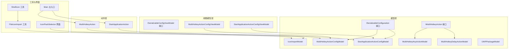
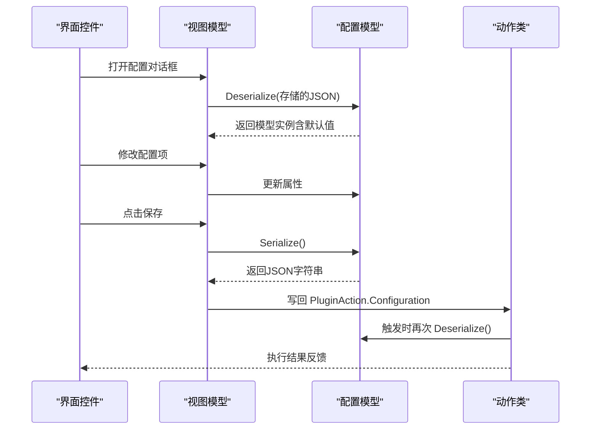
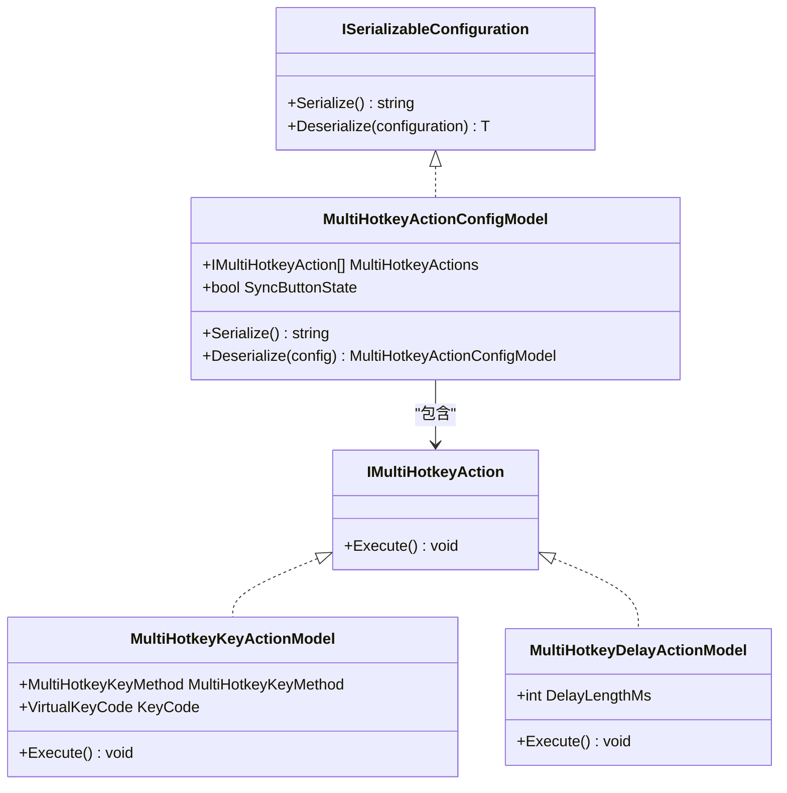
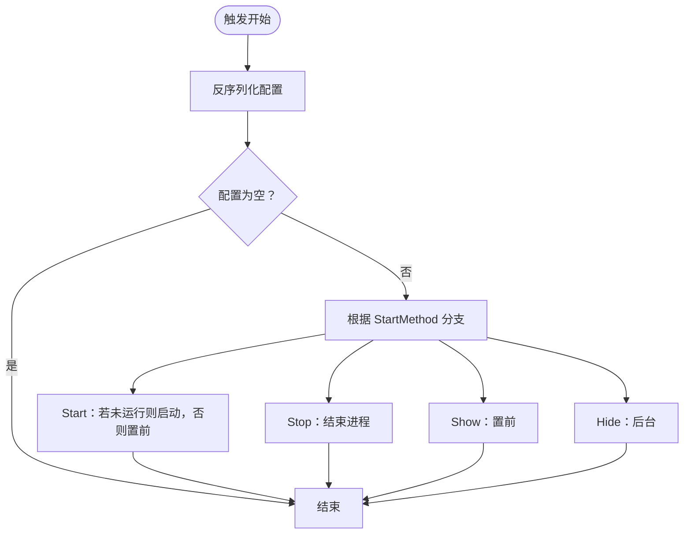
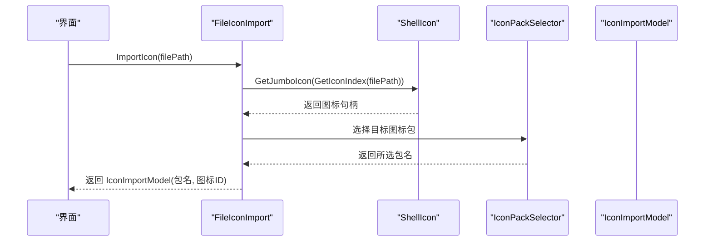
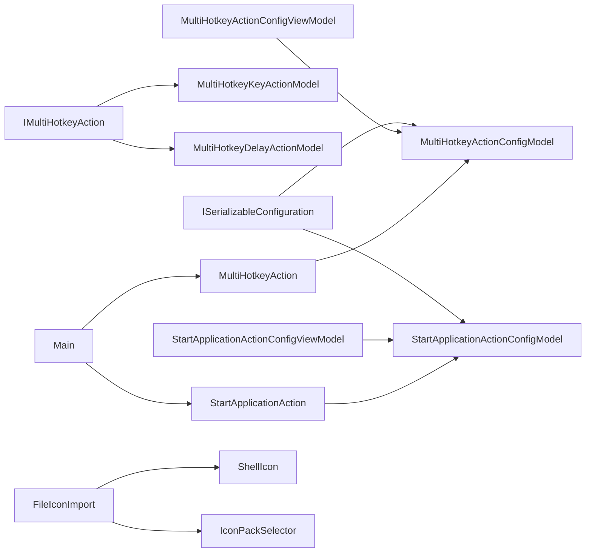

# 配置模型详解

<cite>
**本文档引用的文件**
- [ISerializableConfiguration.cs](file://Models/ISerializableConfiguration.cs)
- [MultiHotkeyActionConfigModel.cs](file://Models/MultiHotkeyActionConfigModel.cs)
- [StartApplicationActionConfigModel.cs](file://Models/StartApplicationActionConfigModel.cs)
- [IconImportModel.cs](file://Models/IconImportModel.cs)
- [IMultiHotkeyAction.cs](file://Models/IMultiHotkeyAction.cs)
- [MultiHotkeyDelayActionModel.cs](file://Models/MultiHotkeyDelayActionModel.cs)
- [MultiHotkeyKeyActionModel.cs](file://Models/MultiHotkeyKeyActionModel.cs)
- [UWPPackageModel.cs](file://Models/UWPPackageModel.cs)
- [ISerializableConfigViewModel.cs](file://ViewModels/ISerializableConfigViewModel.cs)
- [MultiHotkeyActionConfigViewModel.cs](file://ViewModels/MultiHotkeyActionConfigViewModel.cs)
- [StartApplicationActionConfigViewModel.cs](file://ViewModels/StartApplicationActionConfigViewModel.cs)
- [FileIconImport.cs](file://Utils/FileIconImport.cs)
- [ShellIcon.cs](file://Utils/ShellIcon.cs)
- [IconPackSelector.cs](file://GUI/IconPackSelector.cs)
- [MultiHotkeyAction.cs](file://Actions/MultiHotkeyAction.cs)
- [StartApplicationAction.cs](file://Actions/StartApplicationAction.cs)
- [Main.cs](file://Main.cs)
</cite>

## 目录
1. [引言](#引言)
2. [项目结构](#项目结构)
3. [核心组件](#核心组件)
4. [架构总览](#架构总览)
5. [详细组件分析](#详细组件分析)
6. [依赖关系分析](#依赖关系分析)
7. [性能考虑](#性能考虑)
8. [故障排除指南](#故障排除指南)
9. [结论](#结论)
10. [附录](#附录)

## 引言
本文件面向开发者与高级用户，系统性解析本插件中的“配置模型”体系，重点围绕 ISerializableConfiguration 接口的设计理念与实现机制展开，覆盖 JSON 序列化/反序列化流程、各配置模型的数据结构与字段语义、默认值与兼容性策略、数据类型转换与错误处理方式，并给出可操作的最佳实践与扩展建议。通过多处时序与类图，帮助读者快速掌握从界面到动作执行的完整链路。

## 项目结构
本项目采用“模型-视图模型-视图-动作-工具”的分层组织方式，配置模型位于 Models 层，负责承载持久化配置；ViewModels 层负责桥接界面与模型；Actions 层在触发时读取配置并执行业务逻辑；Utils/GUI 提供图标导入与选择等辅助能力。

图表来源
- [ISerializableConfiguration.cs:1-12](file://Models/ISerializableConfiguration.cs#L1-L12)
- [MultiHotkeyActionConfigModel.cs:1-22](file://Models/MultiHotkeyActionConfigModel.cs#L1-L22)
- [StartApplicationActionConfigModel.cs:1-36](file://Models/StartApplicationActionConfigModel.cs#L1-L36)
- [IMultiHotkeyAction.cs:1-9](file://Models/IMultiHotkeyAction.cs#L1-L9)
- [MultiHotkeyKeyActionModel.cs:1-33](file://Models/MultiHotkeyKeyActionModel.cs#L1-L33)
- [MultiHotkeyDelayActionModel.cs:1-14](file://Models/MultiHotkeyDelayActionModel.cs#L1-L14)
- [IconImportModel.cs:1-16](file://Models/IconImportModel.cs#L1-L16)
- [UWPPackageModel.cs:1-17](file://Models/UWPPackageModel.cs#L1-L17)
- [ISerializableConfigViewModel.cs:1-13](file://ViewModels/ISerializableConfigViewModel.cs#L1-L13)
- [MultiHotkeyActionConfigViewModel.cs:1-56](file://ViewModels/MultiHotkeyActionConfigViewModel.cs#L1-L56)
- [StartApplicationActionConfigViewModel.cs:1-73](file://ViewModels/StartApplicationActionConfigViewModel.cs#L1-L73)
- [FileIconImport.cs:1-67](file://Utils/FileIconImport.cs#L1-L67)
- [IconPackSelector.cs:1-44](file://GUI/IconPackSelector.cs#L1-L44)
- [ShellIcon.cs:1-337](file://Utils/ShellIcon.cs#L1-L337)
- [MultiHotkeyAction.cs:1-57](file://Actions/MultiHotkeyAction.cs#L1-L57)
- [StartApplicationAction.cs:1-84](file://Actions/StartApplicationAction.cs#L1-L84)
- [Main.cs:1-60](file://Main.cs#L1-L60)

章节来源
- [Main.cs:14-60](file://Main.cs#L14-L60)

## 核心组件
本节聚焦 ISerializableConfiguration 接口及其派生模型，阐明统一的序列化/反序列化契约与默认行为。

- ISerializableConfiguration 接口
  - 职责：定义统一的配置序列化与反序列化方法，确保所有配置模型具备一致的持久化与加载体验。
  - 方法：
    - Serialize(): 将当前实例序列化为 JSON 字符串。
    - Deserialize<T>(string): 静态泛型方法，支持基于 JSON 字符串的反序列化，默认值回退策略为返回新实例。
  - 设计要点：
    - 使用 System.Text.Json 进行序列化/反序列化。
    - 反序列化时对空字符串进行判空处理，避免异常并保证向后兼容。

- 派生模型
  - MultiHotkeyActionConfigModel
    - 字段：MultiHotkeyActions（列表，元素实现 IMultiHotkeyAction）、SyncButtonState（布尔）。
    - 默认值：空列表、SyncButtonState=false。
    - 行为：Serialize() 直接序列化自身；Deserialize() 委托给接口静态方法。
  - StartApplicationActionConfigModel
    - 字段：Path、Arguments（字符串，默认空）、RunAsAdmin（布尔，默认false）、SyncButtonState（布尔，默认false）、StartMethod（枚举，默认Start）。
    - 兼容性：JsonPropertyName 特性保留旧版字段名映射，确保升级后仍可读取旧配置。
    - 行为：Serialize()/Deserialize() 同上。
  - IconImportModel
    - 字段：IconPack、IconId；ToString() 返回“包名.图标ID”的格式化字符串。
  - UWPPackageModel
    - 字段：DisplayName、Path（构造函数初始化），用于封装 UWP 包信息。

章节来源
- [ISerializableConfiguration.cs:5-11](file://Models/ISerializableConfiguration.cs#L5-L11)
- [MultiHotkeyActionConfigModel.cs:6-21](file://Models/MultiHotkeyActionConfigModel.cs#L6-L21)
- [StartApplicationActionConfigModel.cs:6-35](file://Models/StartApplicationActionConfigModel.cs#L6-L35)
- [IconImportModel.cs:3-15](file://Models/IconImportModel.cs#L3-L15)
- [UWPPackageModel.cs:4-16](file://Models/UWPPackageModel.cs#L4-L16)

## 架构总览
下图展示配置从界面到动作执行的关键流转：界面通过视图模型读取/写入配置，视图模型调用模型的 Serialize()/Deserialize() 完成持久化；动作在触发时再次反序列化配置并执行相应逻辑。

图表来源
- [ISerializableConfigViewModel.cs:5-12](file://ViewModels/ISerializableConfigViewModel.cs#L5-L12)
- [MultiHotkeyActionConfigViewModel.cs:30-54](file://ViewModels/MultiHotkeyActionConfigViewModel.cs#L30-L54)
- [StartApplicationActionConfigViewModel.cs:47-71](file://ViewModels/StartApplicationActionConfigViewModel.cs#L47-L71)
- [MultiHotkeyActionConfigModel.cs:13-20](file://Models/MultiHotkeyActionConfigModel.cs#L13-L20)
- [StartApplicationActionConfigModel.cs:19-26](file://Models/StartApplicationActionConfigModel.cs#L19-L26)
- [MultiHotkeyAction.cs:23-48](file://Actions/MultiHotkeyAction.cs#L23-L48)
- [StartApplicationAction.cs:22-50](file://Actions/StartApplicationAction.cs#L22-L50)

## 详细组件分析

### ISerializableConfiguration 接口与默认反序列化策略
- 设计原则
  - 统一契约：所有配置模型共享相同的序列化/反序列化协议。
  - 安全回退：当传入空或无效 JSON 时，返回新实例而非抛出异常，提升健壮性。
- 实现细节
  - 反序列化泛型方法通过 System.Text.Json 完成对象还原。
  - 通过 JsonPropertyName 保持历史字段兼容。

章节来源
- [ISerializableConfiguration.cs:5-11](file://Models/ISerializableConfiguration.cs#L5-L11)

### 多热键配置模型：MultiHotkeyActionConfigModel
- 数据结构
  - MultiHotkeyActions：IMultiHotkeyAction 列表，支持按键按下/抬起、延时等动作组合。
  - SyncButtonState：同步按钮状态，配合 UI 状态显示。
- 动作类型
  - MultiHotkeyKeyActionModel：根据 MultiHotkeyKeyMethod（Down/Up）调用输入模拟器执行按键事件。
  - MultiHotkeyDelayActionModel：按毫秒级延时阻塞当前线程，实现动作间间隔。
- 执行流程
  - 触发时按顺序遍历动作列表，支持中断标志以停止执行。
  - 可选同步按钮状态，便于用户感知执行中。

图表来源
- [ISerializableConfiguration.cs:5-11](file://Models/ISerializableConfiguration.cs#L5-L11)
- [MultiHotkeyActionConfigModel.cs:6-21](file://Models/MultiHotkeyActionConfigModel.cs#L6-L21)
- [IMultiHotkeyAction.cs:3-8](file://Models/IMultiHotkeyAction.cs#L3-L8)
- [MultiHotkeyKeyActionModel.cs:5-32](file://Models/MultiHotkeyKeyActionModel.cs#L5-L32)
- [MultiHotkeyDelayActionModel.cs:5-13](file://Models/MultiHotkeyDelayActionModel.cs#L5-L13)

章节来源
- [MultiHotkeyActionConfigModel.cs:6-21](file://Models/MultiHotkeyActionConfigModel.cs#L6-L21)
- [MultiHotkeyKeyActionModel.cs:5-32](file://Models/MultiHotkeyKeyActionModel.cs#L5-L32)
- [MultiHotkeyDelayActionModel.cs:5-13](file://Models/MultiHotkeyDelayActionModel.cs#L5-L13)
- [MultiHotkeyAction.cs:23-48](file://Actions/MultiHotkeyAction.cs#L23-L48)

### 应用程序启动配置模型：StartApplicationActionConfigModel
- 字段与默认值
  - Path/Arguments：字符串，默认空；RunAsAdmin/SyncButtonState：布尔，默认false；StartMethod：枚举，默认Start。
- 兼容性设计
  - 使用 JsonPropertyName 映射旧字段名，确保旧版本配置可被新版本读取。
- 执行逻辑
  - 根据 StartMethod 分支：Start（若未运行则启动，否则置前）、Stop（结束进程）、Show/Hide（窗口前后台切换）。
  - 支持按钮状态同步，通过主入口的定时器周期性更新按钮状态。

图表来源
- [StartApplicationActionConfigModel.cs:6-35](file://Models/StartApplicationActionConfigModel.cs#L6-L35)
- [StartApplicationAction.cs:22-50](file://Actions/StartApplicationAction.cs#L22-L50)

章节来源
- [StartApplicationActionConfigModel.cs:6-35](file://Models/StartApplicationActionConfigModel.cs#L6-L35)
- [StartApplicationAction.cs:22-83](file://Actions/StartApplicationAction.cs#L22-L83)

### 图标导入模型：IconImportModel 与导入流程
- IconImportModel
  - 作用：封装已导入图标的包名与图标ID，提供 ToString() 便于显示与调试。
- 导入流程
  - FileIconImport.ImportIcon(filePath)：弹出质量选择对话框，提取系统大图标，缩放后添加至目标图标包，返回 IconImportModel。
  - ShellIcon：提供获取系统大图标索引与 Jumbo 图标的底层能力。
  - IconPackSelector：提供可用本地图标包的选择界面。

图表来源
- [FileIconImport.cs:14-64](file://Utils/FileIconImport.cs#L14-L64)
- [ShellIcon.cs:313-335](file://Utils/ShellIcon.cs#L313-L335)
- [IconPackSelector.cs:12-36](file://GUI/IconPackSelector.cs#L12-L36)
- [IconImportModel.cs:3-15](file://Models/IconImportModel.cs#L3-L15)

章节来源
- [FileIconImport.cs:11-67](file://Utils/FileIconImport.cs#L11-L67)
- [ShellIcon.cs:48-337](file://Utils/ShellIcon.cs#L48-L337)
- [IconPackSelector.cs:9-44](file://GUI/IconPackSelector.cs#L9-L44)
- [IconImportModel.cs:3-15](file://Models/IconImportModel.cs#L3-L15)

### 视图模型与配置持久化
- ISerializableConfigViewModel
  - 抽象：暴露 SerializableConfiguration、SetConfig()、SaveConfig()。
- MultiHotkeyActionConfigViewModel
  - 读取：构造时通过 MultiHotkeyActionConfigModel.Deserialize(action.Configuration) 初始化。
  - 写回：SetConfig() 更新 action.Configuration 与摘要。
  - 错误处理：SaveConfig() 包裹日志记录与异常捕获。
- StartApplicationActionConfigViewModel
  - 读取/写回与上述类似，同时在 OnActionButtonLoaded/OnActionButtonDelete 中注册/注销状态更新定时器。

章节来源
- [ISerializableConfigViewModel.cs:5-12](file://ViewModels/ISerializableConfigViewModel.cs#L5-L12)
- [MultiHotkeyActionConfigViewModel.cs:9-56](file://ViewModels/MultiHotkeyActionConfigViewModel.cs#L9-L56)
- [StartApplicationActionConfigViewModel.cs:8-73](file://ViewModels/StartApplicationActionConfigViewModel.cs#L8-L73)

## 依赖关系分析
- 模型层
  - ISerializableConfiguration 作为契约，被 MultiHotkeyActionConfigModel 与 StartApplicationActionConfigModel 实现。
  - IMultiHotkeyAction 作为多热键动作抽象，由 MultiHotkeyKeyActionModel 与 MultiHotkeyDelayActionModel 实现。
- 视图模型层
  - 通过 ISerializableConfigViewModel 统一配置读写，分别对接两个配置模型。
- 动作层
  - MultiHotkeyAction 与 StartApplicationAction 在触发时反序列化配置并执行。
- 工具与界面
  - FileIconImport 依赖 ShellIcon 与 IconPackSelector 完成图标导入；Main 提供全局 InputSimulator 与定时器。

图表来源
- [ISerializableConfiguration.cs:5-11](file://Models/ISerializableConfiguration.cs#L5-L11)
- [MultiHotkeyActionConfigModel.cs:6-21](file://Models/MultiHotkeyActionConfigModel.cs#L6-L21)
- [StartApplicationActionConfigModel.cs:6-35](file://Models/StartApplicationActionConfigModel.cs#L6-L35)
- [IMultiHotkeyAction.cs:3-8](file://Models/IMultiHotkeyAction.cs#L3-L8)
- [MultiHotkeyKeyActionModel.cs:5-32](file://Models/MultiHotkeyKeyActionModel.cs#L5-L32)
- [MultiHotkeyDelayActionModel.cs:5-13](file://Models/MultiHotkeyDelayActionModel.cs#L5-L13)
- [MultiHotkeyActionConfigViewModel.cs:9-56](file://ViewModels/MultiHotkeyActionConfigViewModel.cs#L9-L56)
- [StartApplicationActionConfigViewModel.cs:8-73](file://ViewModels/StartApplicationActionConfigViewModel.cs#L8-L73)
- [MultiHotkeyAction.cs:11-57](file://Actions/MultiHotkeyAction.cs#L11-L57)
- [StartApplicationAction.cs:14-84](file://Actions/StartApplicationAction.cs#L14-L84)
- [FileIconImport.cs:11-67](file://Utils/FileIconImport.cs#L11-L67)
- [ShellIcon.cs:48-337](file://Utils/ShellIcon.cs#L48-L337)
- [IconPackSelector.cs:9-44](file://GUI/IconPackSelector.cs#L9-L44)
- [Main.cs:14-60](file://Main.cs#L14-L60)

## 性能考虑
- 序列化/反序列化
  - 使用 System.Text.Json，性能稳定；避免在高频路径重复序列化同一配置。
- 多热键执行
  - 延时动作会阻塞当前线程，建议控制总时长与数量，避免 UI 卡顿。
- 图标导入
  - 大尺寸图标缩放与系统图标提取可能较耗时，建议异步执行并在 UI 上提供进度提示。
- 按钮状态同步
  - StartApplicationAction 的定时器周期为固定间隔，需权衡刷新频率与资源占用。

## 故障排除指南
- 配置为空或反序列化失败
  - 现象：Deserialize 返回新实例，配置项使用默认值。
  - 处理：检查存储的 JSON 是否有效；必要时清理损坏配置。
- 图标导入失败
  - 现象：导入返回 null 或弹出失败提示。
  - 处理：确认文件路径有效、目标图标包存在且可写；检查缩放像素设置是否合理。
- 按钮状态不同步
  - 现象：启用 SyncButtonState 后按钮状态不更新。
  - 处理：确认 StartApplicationAction 已注册定时器；检查路径是否为空；查看日志输出。

章节来源
- [ISerializableConfiguration.cs:9-10](file://Models/ISerializableConfiguration.cs#L9-L10)
- [FileIconImport.cs:29-36](file://Utils/FileIconImport.cs#L29-L36)
- [StartApplicationAction.cs:57-83](file://Actions/StartApplicationAction.cs#L57-L83)

## 结论
本配置模型体系通过 ISerializableConfiguration 统一了序列化/反序列化契约，结合视图模型与动作层实现了从界面到执行的闭环。多热键与应用启动两大场景的配置模型清晰分离职责，既保证了扩展性，又兼顾了向后兼容与易用性。建议在新增配置模型时遵循现有模式：实现接口、提供默认值、标注兼容性特性、在视图模型中完成读写封装，并在动作中安全地反序列化与执行。

## 附录

### 最佳实践清单
- 新增配置模型
  - 实现 ISerializableConfiguration 并提供 Serialize()/Deserialize()。
  - 为每个字段提供明确的默认值，避免空引用。
  - 对历史字段名使用 JsonPropertyName 保持兼容。
- 视图模型
  - 在构造函数中完成 Deserialize；在 SetConfig() 中统一 Serialize 并更新摘要。
  - SaveConfig() 中捕获异常并记录日志。
- 动作执行
  - 触发时再次 Deserialize，确保配置最新。
  - 对关键路径（如图标导入、进程管理）增加边界检查与错误提示。
- 扩展多热键动作
  - 实现 IMultiHotkeyAction 并在 MultiHotkeyActions 中组合使用。
  - 控制延时与并发，避免阻塞 UI。

### 示例参考
- 多热键配置示例
  - 场景：先按下某个键，等待一段时间，再松开该键。
  - 关键点：使用 MultiHotkeyKeyActionModel 与 MultiHotkeyDelayActionModel 组合；设置 SyncButtonState 以反馈执行状态。
- 应用启动配置示例
  - 场景：启动浏览器并置前；若已运行则置前；支持管理员权限。
  - 关键点：StartMethod=Start；RunAsAdmin=true；SyncButtonState=true；路径与参数正确配置。