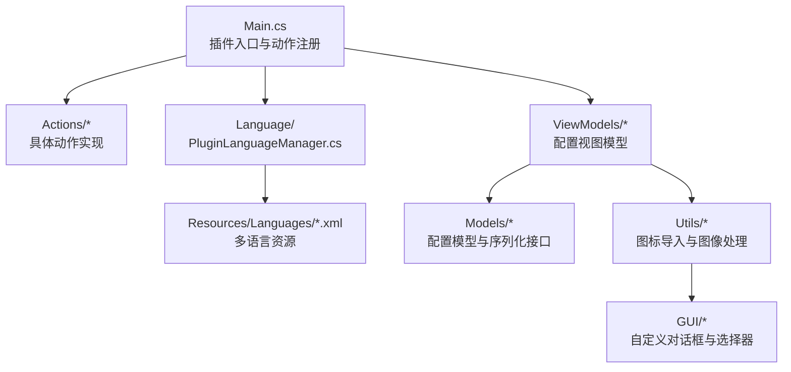
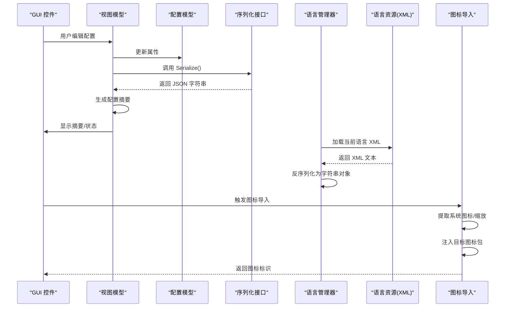
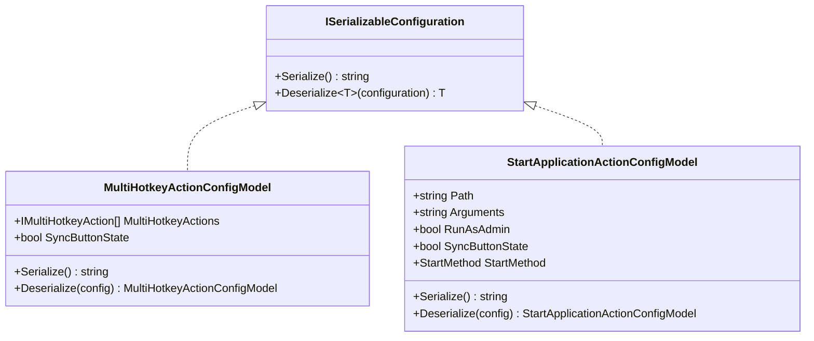
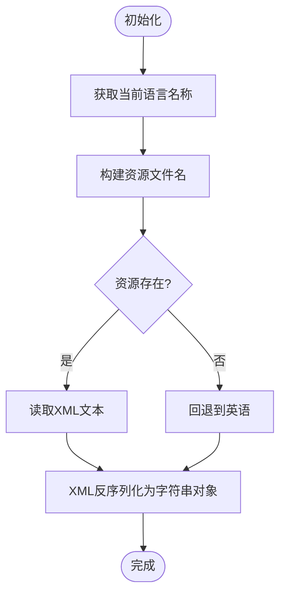
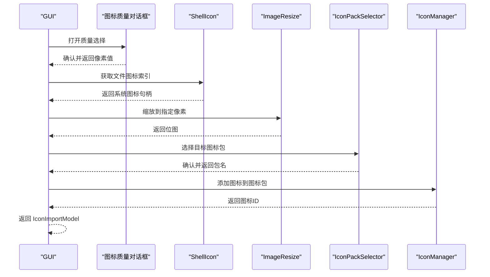
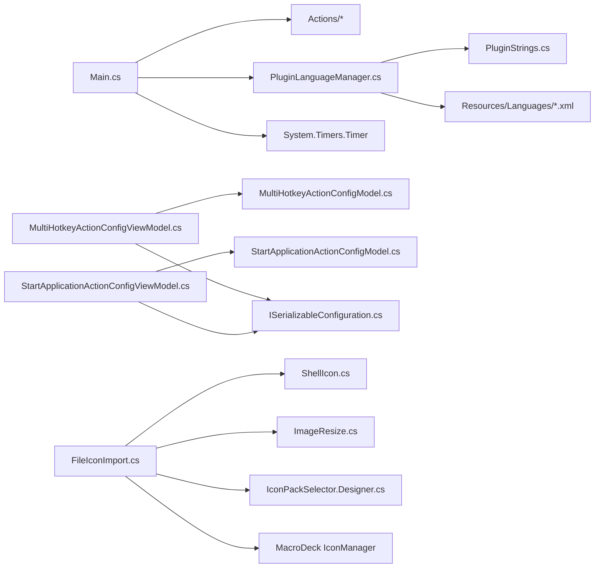

# 高级配置

<cite>
**本文引用的文件**
- [ExtensionManifest.json](file://ExtensionManifest.json)
- [Main.cs](file://Main.cs)
- [README.md](file://README.md)
- [ISerializableConfiguration.cs](file://Models/ISerializableConfiguration.cs)
- [IconImportModel.cs](file://Models/IconImportModel.cs)
- [MultiHotkeyActionConfigModel.cs](file://Models/MultiHotkeyActionConfigModel.cs)
- [StartApplicationActionConfigModel.cs](file://Models/StartApplicationActionConfigModel.cs)
- [PluginLanguageManager.cs](file://Language/PluginLanguageManager.cs)
- [PluginStrings.cs](file://Language/PluginStrings.cs)
- [ISerializableConfigViewModel.cs](file://ViewModels/ISerializableConfigViewModel.cs)
- [MultiHotkeyActionConfigViewModel.cs](file://ViewModels/MultiHotkeyActionConfigViewModel.cs)
- [StartApplicationActionConfigViewModel.cs](file://ViewModels/StartApplicationActionConfigViewModel.cs)
- [FileIconImport.cs](file://Utils/FileIconImport.cs)
- [ImageResize.cs](file://Utils/ImageResize.cs)
- [Chinese.xml](file://Resources/Languages/Chinese.xml)
</cite>

## 目录
1. 引言
2. 项目结构
3. 核心组件
4. 架构总览
5. 详细组件分析
6. 依赖关系分析
7. 性能考量
8. 故障排除指南
9. 结论
10. 附录

## 引言
本文件面向高级用户与扩展开发者，系统性阐述 Macro Deck Windows Utils 插件的“高级配置”能力，覆盖以下主题：
- 配置模型与序列化机制（JSON 与接口契约）
- 多语言支持与资源加载流程
- 自定义图标导入与图标包集成
- 变量系统与配置摘要生成
- 自定义 GUI 控件与视图模型交互
- 高级使用场景、性能优化与扩展开发建议
- 调试技巧、故障排除与最佳实践

## 项目结构
该插件采用“动作(Action) + 视图模型(ViewModel) + 模型(Model) + 工具(Utils) + 国际化(Language)”分层组织，主入口负责注册动作与定时器，语言模块负责动态加载 XML 资源，配置模型通过统一接口进行序列化/反序列化。

图表来源
- [Main.cs:28-58](file://Main.cs#L28-L58)
- [PluginLanguageManager.cs:12-33](file://Language/PluginLanguageManager.cs#L12-L33)
- [ISerializableConfiguration.cs:5-11](file://Models/ISerializableConfiguration.cs#L5-L11)

章节来源
- [ExtensionManifest.json:1-11](file://ExtensionManifest.json#L1-L11)
- [Main.cs:14-59](file://Main.cs#L14-L59)
- [README.md:1-40](file://README.md#L1-L40)

## 核心组件
- 配置序列化接口：统一的 JSON 序列化/反序列化契约，确保跨版本兼容与空配置安全初始化。
- 配置模型：针对不同动作的配置载体，包含字段与枚举，提供 Serialize/Deserialize 方法。
- 视图模型：封装配置读取、保存、摘要生成与日志记录，桥接 UI 与模型。
- 语言管理：基于 Macro Deck 语言系统，动态加载对应语言 XML 并反序列化为字符串对象。
- 图标导入：通过系统 Shell 图标提取、缩放与目标图标包注入，返回可绑定的图标标识。
- 主入口：注册动作集合、启动周期性计时器，初始化语言与动作列表。

章节来源
- [ISerializableConfiguration.cs:5-11](file://Models/ISerializableConfiguration.cs#L5-L11)
- [MultiHotkeyActionConfigModel.cs:6-21](file://Models/MultiHotkeyActionConfigModel.cs#L6-L21)
- [StartApplicationActionConfigModel.cs:6-27](file://Models/StartApplicationActionConfigModel.cs#L6-L27)
- [ISerializableConfigViewModel.cs:5-12](file://ViewModels/ISerializableConfigViewModel.cs#L5-L12)
- [MultiHotkeyActionConfigViewModel.cs:9-55](file://ViewModels/MultiHotkeyActionConfigViewModel.cs#L9-L55)
- [StartApplicationActionConfigViewModel.cs:8-72](file://ViewModels/StartApplicationActionConfigViewModel.cs#L8-L72)
- [PluginLanguageManager.cs:8-50](file://Language/PluginLanguageManager.cs#L8-L50)
- [FileIconImport.cs:11-66](file://Utils/FileIconImport.cs#L11-L66)
- [Main.cs:28-58](file://Main.cs#L28-L58)

## 架构总览
下图展示从 UI 到模型、序列化、语言资源与图标导入的整体交互：

图表来源
- [ISerializableConfiguration.cs:7-10](file://Models/ISerializableConfiguration.cs#L7-L10)
- [MultiHotkeyActionConfigModel.cs:13-20](file://Models/MultiHotkeyActionConfigModel.cs#L13-L20)
- [StartApplicationActionConfigModel.cs:19-26](file://Models/StartApplicationActionConfigModel.cs#L19-L26)
- [PluginLanguageManager.cs:18-49](file://Language/PluginLanguageManager.cs#L18-L49)
- [FileIconImport.cs:14-64](file://Utils/FileIconImport.cs#L14-L64)

## 详细组件分析

### 配置模型与序列化机制
- 统一接口：ISerializableConfiguration 定义 Serialize 与受保护的 Deserialize 泛型方法，确保所有配置模型遵循一致的序列化契约。
- 兼容性设计：反序列化在空配置时自动构造新实例，避免空引用；部分模型使用 JSON 属性名标注以保证旧版兼容。
- 模型示例：
  - 多热键动作配置：包含动作列表与按钮同步开关，序列化为 JSON。
  - 启动应用动作配置：包含路径、参数、管理员权限、按钮同步与启动方法枚举，序列化为 JSON。
- 视图模型职责：从 PluginAction.Configuration 反序列化到模型，调用 SetConfig 生成摘要并回写 JSON。

图表来源
- [ISerializableConfiguration.cs:5-11](file://Models/ISerializableConfiguration.cs#L5-L11)
- [MultiHotkeyActionConfigModel.cs:6-21](file://Models/MultiHotkeyActionConfigModel.cs#L6-L21)
- [StartApplicationActionConfigModel.cs:6-27](file://Models/StartApplicationActionConfigModel.cs#L6-L27)

章节来源
- [ISerializableConfiguration.cs:5-11](file://Models/ISerializableConfiguration.cs#L5-L11)
- [MultiHotkeyActionConfigModel.cs:6-21](file://Models/MultiHotkeyActionConfigModel.cs#L6-L21)
- [StartApplicationActionConfigModel.cs:6-27](file://Models/StartApplicationActionConfigModel.cs#L6-L27)

### 多语言支持与资源管理
- 初始化：插件启用时调用语言管理器初始化，监听语言变更事件以动态重载。
- 资源定位：根据当前语言名称拼装资源文件名，若不存在则回退至英语。
- 反序列化：使用 XML 序列化器将 XML 资源反序列化为字符串对象，供 UI 使用。
- 示例资源：中文 XML 包含语言元信息与全部键值对，确保界面文案完整。

图表来源
- [PluginLanguageManager.cs:12-33](file://Language/PluginLanguageManager.cs#L12-L33)
- [PluginLanguageManager.cs:35-49](file://Language/PluginLanguageManager.cs#L35-L49)
- [Chinese.xml:1-62](file://Resources/Languages/Chinese.xml#L1-L62)

章节来源
- [PluginLanguageManager.cs:8-50](file://Language/PluginLanguageManager.cs#L8-L50)
- [PluginStrings.cs:3-69](file://Language/PluginStrings.cs#L3-L69)
- [Chinese.xml:1-62](file://Resources/Languages/Chinese.xml#L1-L62)

### 自定义图标导入与图标包集成
- 流程概览：弹出质量选择对话框 → 获取系统图标索引 → 按像素缩放 → 选择目标图标包 → 注入图标 → 返回图标标识。
- 关键点：
  - 使用 ShellIcon 获取系统图标句柄，再转换为位图。
  - 使用 ImageResize 进行尺寸调整。
  - 通过 IconManager 将图标写入指定图标包，并返回可绑定的图标标识。
- 返回模型：IconImportModel 包含图标包名与图标 ID，便于后续绑定。

图表来源
- [FileIconImport.cs:14-64](file://Utils/FileIconImport.cs#L14-L64)
- [ImageResize.cs:8-17](file://Utils/ImageResize.cs#L8-L17)
- [IconImportModel.cs:3-15](file://Models/IconImportModel.cs#L3-L15)

章节来源
- [FileIconImport.cs:11-66](file://Utils/FileIconImport.cs#L11-L66)
- [ImageResize.cs:5-20](file://Utils/ImageResize.cs#L5-L20)
- [IconImportModel.cs:1-16](file://Models/IconImportModel.cs#L1-L16)

### 变量系统集成与配置摘要
- 配置摘要：视图模型在保存前更新 PluginAction.ConfigurationSummary，用于在 Macro Deck 中直观显示配置要点。
- 日志记录：保存成功与异常均通过日志记录，便于排错。
- 变量保存：命令行动作支持将输出保存到变量（见 README），需在动作配置中启用相应选项。

章节来源
- [MultiHotkeyActionConfigViewModel.cs:50-54](file://ViewModels/MultiHotkeyActionConfigViewModel.cs#L50-L54)
- [StartApplicationActionConfigViewModel.cs:67-71](file://ViewModels/StartApplicationActionConfigViewModel.cs#L67-L71)
- [README.md:6-6](file://README.md#L6-L6)

### 自定义 GUI 控件与视图模型交互
- 控件类型：包含命令选择器、文件/文件夹选择器、热键配置器、通知配置器、电源选项选择器、文本选择器、窗口切换配置器与资源管理器控制配置器。
- 交互模式：视图模型持有配置模型，UI 修改属性后由视图模型统一序列化并回写到 PluginAction。
- 事件驱动：语言变更触发重新加载，确保界面文案即时更新。

章节来源
- [Main.cs:31-50](file://Main.cs#L31-L50)
- [PluginLanguageManager.cs:15-15](file://Language/PluginLanguageManager.cs#L15-L15)

## 依赖关系分析
- 主入口依赖：动作集合、语言管理器、计时器。
- 视图模型依赖：配置模型、日志系统、插件实例。
- 配置模型依赖：JSON 序列化库。
- 图标导入依赖：ShellIcon、图像缩放、图标包管理器、消息框与选择器对话框。
- 语言资源依赖：XML 序列化器与嵌入式资源流。

图表来源
- [Main.cs:28-58](file://Main.cs#L28-L58)
- [MultiHotkeyActionConfigViewModel.cs:30-34](file://ViewModels/MultiHotkeyActionConfigViewModel.cs#L30-L34)
- [StartApplicationActionConfigViewModel.cs:47-51](file://ViewModels/StartApplicationActionConfigViewModel.cs#L47-L51)
- [ISerializableConfiguration.cs:1-12](file://Models/ISerializableConfiguration.cs#L1-L12)
- [FileIconImport.cs:23-44](file://Utils/FileIconImport.cs#L23-L44)
- [PluginLanguageManager.cs:25-32](file://Language/PluginLanguageManager.cs#L25-L32)

章节来源
- [Main.cs:14-59](file://Main.cs#L14-L59)
- [ViewModels/ISerializableConfigViewModel.cs:5-12](file://ViewModels/ISerializableConfigViewModel.cs#L5-L12)
- [Models/ISerializableConfiguration.cs:5-11](file://Models/ISerializableConfiguration.cs#L5-L11)
- [Utils/FileIconImport.cs:11-66](file://Utils/FileIconImport.cs#L11-L66)
- [Language/PluginLanguageManager.cs:8-50](file://Language/PluginLanguageManager.cs#L8-L50)

## 性能考量
- 序列化成本：JSON 序列化/反序列化在频繁保存时可能带来开销，建议批量修改后再一次性保存。
- 图标处理：大尺寸图标缩放与多次克隆可能占用内存，建议在导入前确认像素值，避免过度放大。
- 计时器频率：主入口中的周期性计时器间隔为 2 秒，通常不影响 UI 响应，但应避免在计时器回调中执行重型任务。
- 资源加载：语言资源按需加载，切换语言时仅在事件触发时重新反序列化，注意避免在高频事件中重复切换语言。

## 故障排除指南
- 语言资源未生效
  - 检查语言文件是否以“语言名.xml”命名且包含正确元信息。
  - 确认资源已嵌入并可被 Assembly.GetManifestResourceStream 读取。
  - 若无对应语言，默认回退至英语，检查回退逻辑。
- 图标导入失败
  - 确认系统图标句柄有效且可转换为位图。
  - 检查目标图标包是否存在且可写入。
  - 查看消息框提示与异常日志。
- 配置保存异常
  - 查看视图模型保存过程中的错误日志，定位反序列化或序列化问题。
  - 确保配置模型字段完整，必要时保留兼容字段名。
- 动作不可用或未注册
  - 检查主入口是否正确注册了动作集合。
  - 确认插件清单与目标 API 版本匹配。

章节来源
- [PluginLanguageManager.cs:23-33](file://Language/PluginLanguageManager.cs#L23-L33)
- [FileIconImport.cs:31-36](file://Utils/FileIconImport.cs#L31-L36)
- [MultiHotkeyActionConfigViewModel.cs:43-47](file://ViewModels/MultiHotkeyActionConfigViewModel.cs#L43-L47)
- [StartApplicationActionConfigViewModel.cs:55-65](file://ViewModels/StartApplicationActionConfigViewModel.cs#L55-L65)
- [Main.cs:31-50](file://Main.cs#L31-L50)
- [ExtensionManifest.json:6-8](file://ExtensionManifest.json#L6-L8)

## 结论
本插件通过统一的配置序列化接口、灵活的视图模型与完善的语言资源加载机制，提供了稳定可靠的高级配置能力。结合自定义图标导入与变量系统，能够满足复杂场景下的自动化需求。建议在实际部署中关注序列化与资源加载的性能影响，并遵循多语言与图标规范以提升用户体验。

## 附录

### JSON 配置结构与参数说明（示例）
- 多热键动作配置
  - 字段：动作列表、按钮同步开关
  - 行为：序列化为 JSON，反序列化为空配置时自动构造新实例
- 启动应用动作配置
  - 字段：路径、参数、管理员权限、按钮同步、启动方法
  - 兼容性：使用 JSON 属性名标注以兼容旧版本
- 图标导入模型
  - 字段：图标包名、图标 ID
  - 用途：绑定到 UI 或动作配置

章节来源
- [MultiHotkeyActionConfigModel.cs:6-21](file://Models/MultiHotkeyActionConfigModel.cs#L6-L21)
- [StartApplicationActionConfigModel.cs:6-27](file://Models/StartApplicationActionConfigModel.cs#L6-L27)
- [IconImportModel.cs:3-15](file://Models/IconImportModel.cs#L3-L15)

### 高级使用场景与最佳实践
- 复杂配置组合
  - 将多个动作组合为宏，利用按钮同步与配置摘要提升可维护性。
  - 在命令行动作中启用变量保存，配合后续动作读取变量值。
- 性能优化
  - 减少频繁序列化次数，合并 UI 变更后再保存。
  - 控制图标导入尺寸，避免超大位图导致内存压力。
- 扩展开发
  - 新增动作时，遵循 ISerializableConfiguration 接口与视图模型模式。
  - 为新动作提供本地化字符串与资源文件，保持一致性。
  - 使用统一的日志记录与错误处理模板，便于调试与维护。